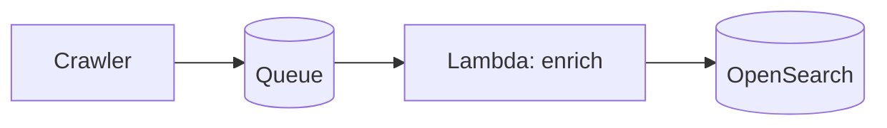

# Blog authoring guide

How to write posts so they render correctly on iliazlobin.com/blog. This is the
contract for any author (human or Hermes). The blog is Jekyll + GitHub Pages;
rich rendering (Mermaid, callouts) is done client-side, no plugins required.

## 1. File location & name

Create one file per post in `_posts/`, named:

```
_posts/YYYY-MM-DD-kebab-title.md
```

The date in the filename is the publish date and drives ordering on `/blog/`.

## 2. Front matter (required)

```yaml
---
layout: post
title: "Designing a Serverless Event Ingestion Pipeline"
date: 2026-06-24
tags: [System Design, Serverless, AWS]
description: "One-sentence summary used for SEO and the social share card."
thumbnail: /images/posts/2026-06-24-serverless-event-ingestion-pipeline.svg  # the blog-index CARD image
# image: /images/posts/my-custom-share-card.png   # optional; OG/social SHARE card only — NOT the index card
---
```

- `layout: post` is mandatory (gives you the styled article + Mermaid support).
- `tags` render as pills on the card and post header.
- `description` feeds `<meta>` + the link preview. Write it.
- Reading time and the formatted date are generated automatically.
- **`thumbnail:` is the blog-index CARD image** — see §9. **`image:` is a different thing**: the Open-Graph /
  social SHARE card (`<meta>`), defaulted site-wide to `/images/og-default.png`. **The index card reads
  `thumbnail` ONLY** — it never falls back to `image`, so do **not** set `image:` to try to give a post a card.

## 3. Diagrams — Mermaid

Use a fenced code block with the `mermaid` language. It renders to an SVG in a
framed container automatically.

````markdown

````

Supported: `graph`, `flowchart`, `sequenceDiagram`, `classDiagram`, `stateDiagram`,
`erDiagram`, `gantt`, etc. (Mermaid v11). Keep node labels short.

**Every Mermaid block MUST be COMPLETE and VALID — a broken block renders as a red
"Syntax error in text" box on the live page (HARD):**
- **NEVER ship a truncated diagram or any `... (truncated)` / placeholder text** inside a
  fenced block. If a diagram is long, write it out in full — do not cut it off. (This is
  the exact bug that broke the Instagram post's §5: the edges were cut mid-definition with
  a literal `... (truncated)` marker.)
- **Edge labels stay on ONE line:** `A -->|"label"| B` — a label that wraps to the next
  source line (`A -->|"trans` ⏎ `code"| B`) is a parse error. For multi-word labels keep
  them short; use `<br/>` for an intentional break inside a **node** label, never a raw newline.
- **Every edge must land on a declared node**, and every declared node should be reachable —
  no dangling `A -->` with no target, no reference to an undeclared id.
- **No raw `\n` in any label** (renders literally) and **no emoji/icon glyphs** in node labels
  (render as broken tofu boxes) — labels are plain text; use `classDef` fills for visual grouping.
- After writing a diagram, re-read the whole fenced block start-to-finish and confirm it is
  complete and parses before publishing. A diagram that doesn't render is worse than none.

## 4. Callouts — Notion-style (info / warning / etc.)

Authored as **GitHub alert blockquotes**. Five types map to colored callouts:

```markdown
> [!NOTE]
> Neutral context or an aside.

> [!TIP]
> A recommendation or best practice.

> [!IMPORTANT]
> Key information the reader must not miss.

> [!WARNING]
> A caveat, gotcha, or risk.

> [!CAUTION]
> A serious "this can break things" warning.
```

Each can span multiple paragraphs/lists — keep them inside the `>` blockquote.

## 5. Code

Fenced blocks with a language render with a dark theme:

````markdown
```python
def rank(events): ...
```
````

Inline `code` works as usual.

## 6. Images

```markdown

```

Put post images under `images/posts/`. Always include alt text. Prefer Mermaid
over screenshots for architecture (smaller, crisper, themeable).

## 7. Excerpt on the index card

The first paragraph (up to `<!--more-->` if present) becomes the card preview.
Lead with a strong first sentence.

## 8. References & links (HARD — must be clickable)

Every external reference, citation, or source URL **MUST be a clickable markdown
link `[title](url)`** — **NEVER a bare/plain-text URL.** Kramdown (Jekyll/GitHub
Pages) does **not** auto-linkify a naked `https://…`; it renders as dead grey,
unclickable text. This applies to a `## References` section, inline source links,
and anywhere a URL appears.

For an academic-style citation, **hyperlink the quoted title and DROP the trailing
bare URL** — keep authors/year/venue as plain text around the link:

```markdown
<!-- BAD — bare URL, renders unclickable -->
1. Cormode, G., & Muthukrishnan, S. (2005). "An Improved Data Stream Summary." Journal of Computer and System Sciences. https://dimacs.rutgers.edu/~graham/pubs/papers/cm-full.pdf

<!-- GOOD — title is the link, no naked URL -->
1. Cormode, G., & Muthukrishnan, S. (2005). ["An Improved Data Stream Summary"](https://dimacs.rutgers.edu/~graham/pubs/papers/cm-full.pdf). Journal of Computer and System Sciences.
```

For an engineering-blog / source-code entry, hyperlink the whole label:
`[Twitter Algebird — CMS with TopCMS](https://github.com/twitter/algebird/blob/develop/algebird-core/src/main/scala/com/twitter/algebird/CountMinSketch.scala).`

Never fabricate a link — drop a source you can't verify. Use real, resolvable URLs.

## 9. Card thumbnail — the real diagram from the article (required)

The blog-index card shows a **picture from the post itself: its main architecture diagram**, rendered to a
static SVG. This is the `thumbnail:` front-matter field (§2), and it is **set automatically** — don't hand-pick it:

```bash
python3 ~/.hermes/scripts/render-post-diagram.py _posts/YYYY-MM-DD-kebab-title.md
```

The script renders the first `mermaid` block under `## 5` (the High-Level Design architecture diagram; falls
back to the `## 1` overview) to `images/posts/<file>.svg` via kroki.io and writes `thumbnail: /images/posts/<file>.svg`.
`git add` the generated SVG.

- **The card reads `thumbnail` ONLY** — `blog.md` falls back to the gradient title-card, **never** to the
  site-wide OG image (`image:` / `og-default.png`). A post with **no `thumbnail:` shows the gradient card**, not
  a diagram — so always run the script and confirm the `thumbnail:` line landed before publishing.
- If the diagram fails to render (a Mermaid syntax error), **fix the diagram** and re-run with `--force` —
  don't ship the post on the gradient fallback.
- **Overwriting a thumbnail is cache-safe.** `render-post-diagram.py --force` writes the new SVG to the
  **same** `images/posts/<file>.svg` path. `blog.md` appends a build-time `?v=` to the card URL (same scheme
  as CSS/JS), so each deploy serves a fresh URL — browsers and Cloudflare (`max-age=14400`) can't keep showing
  a stale placeholder. Without that versioning a re-rendered diagram stays invisible for up to 4h behind cache.
