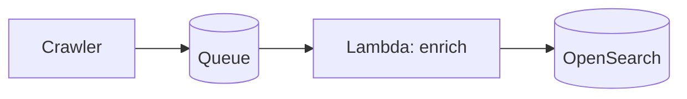

# Blog authoring guide

How to write posts so they render correctly on iliazlobin.com/blog. This is the
contract for any author (human or Hermes). The blog is Jekyll + GitHub Pages;
rich rendering (Mermaid, callouts) is done client-side, no plugins required.

## 1. File location & name

Create one file per post in `_posts/`, named:

```
_posts/YYYY-MM-DD-kebab-title.md
```

The date in the filename is the publish date and drives ordering on `/blog/`.

## 2. Front matter (required)

```yaml
---
layout: post
title: "Designing a Serverless Event Ingestion Pipeline"
date: 2026-06-24
tags: [System Design, Serverless, AWS]
description: "One-sentence summary used for SEO and the social share card."
# image: /images/posts/my-custom-share-card.png   # optional; overrides the default OG card
---
```

- `layout: post` is mandatory (gives you the styled article + Mermaid support).
- `tags` render as pills on the card and post header.
- `description` feeds `<meta>` + the link preview. Write it.
- Reading time and the formatted date are generated automatically.

## 3. Diagrams — Mermaid

Use a fenced code block with the `mermaid` language. It renders to an SVG in a
framed container automatically.

````markdown

````

Supported: `graph`, `flowchart`, `sequenceDiagram`, `classDiagram`, `stateDiagram`,
`erDiagram`, `gantt`, etc. (Mermaid v11). Keep node labels short.

## 4. Callouts — Notion-style (info / warning / etc.)

Authored as **GitHub alert blockquotes**. Five types map to colored callouts:

```markdown
> [!NOTE]
> Neutral context or an aside.

> [!TIP]
> A recommendation or best practice.

> [!IMPORTANT]
> Key information the reader must not miss.

> [!WARNING]
> A caveat, gotcha, or risk.

> [!CAUTION]
> A serious "this can break things" warning.
```

Each can span multiple paragraphs/lists — keep them inside the `>` blockquote.

## 5. Code

Fenced blocks with a language render with a dark theme:

````markdown
```python
def rank(events): ...
```
````

Inline `code` works as usual.

## 6. Images

```markdown

```

Put post images under `images/posts/`. Always include alt text. Prefer Mermaid
over screenshots for architecture (smaller, crisper, themeable).

## 7. Excerpt on the index card

The first paragraph (up to `<!--more-->` if present) becomes the card preview.
Lead with a strong first sentence.
