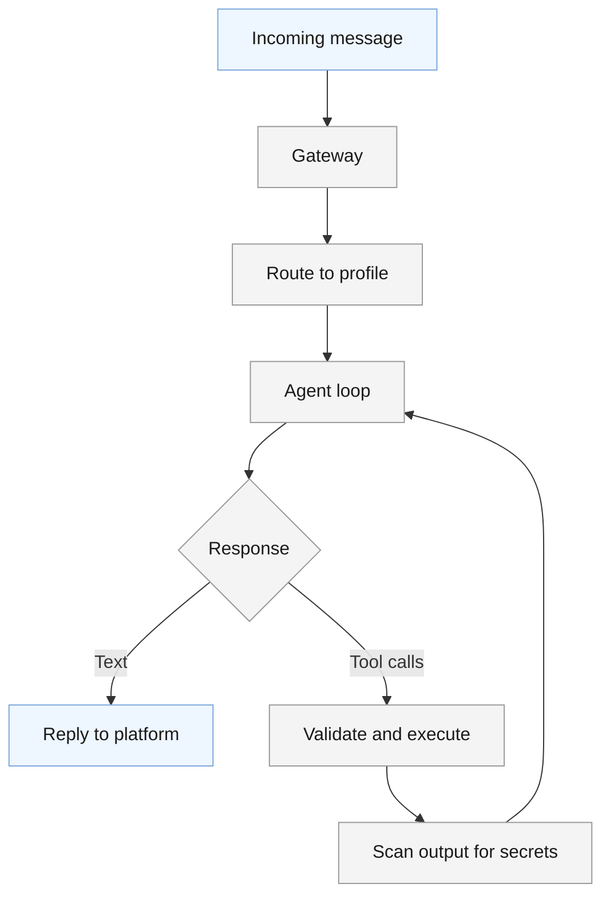

Hermes Agent (Nous Research, MIT license) is an open-source AI agent framework that runs on the CLI, across messaging platforms, and in IDEs. It is not a single-agent chatbot. It is a router with a dispatch engine that spawns multiple isolated agent instances, called profiles, to handle work.

<!--more-->

> [!TIP]
> **Case Study (Own System).** A practitioner's account of running an open-source AI agent framework at production scale: 21 kanban boards, 98 worker profiles, 2,100+ completed tasks, one operator. The framework specifics are Hermes Agent; the patterns are transferable to any multi-agent deployment.

## What Hermes Agent Is

Hermes Agent (Nous Research, MIT license) is an open-source AI agent framework that runs on the CLI, across messaging platforms, and in IDEs. It is not a single-agent chatbot. It is a router with a dispatch engine that spawns multiple isolated agent instances, called profiles, to handle work.

The mental model: a gateway receives a message on any of 18+ platforms (Telegram, Discord, Slack, Signal, email, SMS, and more), routes it to the right profile, and that profile runs as an autonomous agent with its own model, tools, skills, and persistent memory. One framework, many independent agents, each shaped for its job.

## Architecture

Hermes separates concerns into three tiers.

**Router.** Decides which profile handles a given message. The decision is configuration, not model judgment: each platform channel maps to a profile, and the profile carries its own config specifying model, provider, toolset allowlist, and skills. A private DM can route to a full-tool agent while a shared channel gets a restricted profile with no shell access and only the skills its job needs.

**Dispatcher.** A deliberately dumb scheduling loop inside the gateway. It manages task lifecycles on a SQLite-backed kanban board: atomically claims ready tasks, spawns the assigned profile as a fresh process, reclaims tasks whose workers died or went silent, and auto-blocks tasks that keep failing. No routing logic, no budget logic - those live in configuration and skills.

**Agent loop.** Each profile is an autonomous loop: persistent memory, skill-loaded procedures, and a large tool surface (terminal, web, files, code execution, browser, vision) organized into toolsets. Tool output is scanned for secrets before it enters the agent's context. Terminal work can execute locally, in a Docker sandbox, or on remote backends - sandboxed execution is what makes unattended autonomy tolerable.

## Multi-Agent Orchestration

The kanban system is the backbone of multi-agent work, and it is the part of the framework this deployment leans on hardest. Tasks are rows in a durable board; dependencies are parent links; a task becomes ready only when all its parents are done. Workers claim tasks atomically, run in isolated workspaces, and either complete or block with a reason - a worker that dies is reclaimed and its task re-queued, so long chains survive crashes.

Three pipeline shapes cover most real work:

**Research, then synthesize.** Parallel researchers produce independent appendices; a writer depends on all of them. Used for deep-dives and case studies - this page came out of exactly this pipeline.

**Pipeline with gates.** Architect, reviewer, verifier, writer - each stage a card that depends on the previous one. A verifier card sitting between draft and publish means nothing ships on a writer's self-assessment; the verifier blocks back with specific edits and the chain resumes without rebuilding.

**Design to build to experiment.** The longest chain in this deployment: a design pipeline publishes to a designs database, promotion turns it into a build pipeline with staged engineering reviews, and an optional experiment cycle deploys and evaluates the result. Databases connect the stages, so every artifact has a paper trail.

The transferable insight: dependency gating plus durable state does the orchestration. There is no message bus between agents and no shared memory - a card either has what the worker needs in its body, or the worker blocks and says so.

## Skills

Skills are reusable procedures stored as markdown files with frontmatter - playbooks an agent loads into context when the task calls for them. They compose: a profile carries the skills for its role, related skills cross-reference each other, and linked scripts and references load on demand. The framework ships roughly 170 and a marketplace adds thousands more, but the leverage in this deployment came from writing custom ones: each vertical's pipeline, its quality rubric, and its publish path live in a skill, versioned in git, so improving the standard improves every future run.

A background curator tracks skill usage and archives stale ones - procedural memory with garbage collection.

## Running It at Scale

The numbers above (2,100+ tasks, 93% completion) come from about six weeks of daily operation. What made that sustainable is less about the framework and more about a handful of operational patterns:

- **Deterministic gates before model judgment.** Every content pipeline ends with a structural gate script (typography, structure, dead links) followed by a rubric scored by a different model than the one that wrote. Cheap models write; the gate makes them trustworthy.
- **Disposable workers, durable state.** Sandboxes are recreated per task and reaped when idle; anything that must survive lives on the board or in a mounted workspace. Workers write intermediate output to disk as they go, so a killed process resumes instead of restarting.
- **Supervised everything.** The gateway auto-restarts on crash, a healer brings the stack up after reboot, and watchdog jobs sweep blocked tasks on a schedule with substantive feedback rather than letting them rot.
- **Default-deny at the edge.** Anything exposed publicly sits behind SSO plus an allowlist; unrouted hostnames return 404. The rule that stuck: add authentication first, then the route - never the reverse.
- **Model right-sizing per role.** Commodity models run research lanes; stronger models verify and synthesize; the judging model is never the writing model. Prompt caching is the single biggest cost lever - cache reads cost orders of magnitude less than fresh input - followed by watching the hidden spenders: subagent fan-out, auxiliary calls, and unattended cron jobs.

## Lessons

The incidents that shaped the deployment, generalized:

| Lesson | Where it came from |
|---|---|
| Add auth before adding the route | An exposure gap from doing it in the other order |
| Size retry windows from observed outages, not defaults | A flaky origin blew through default retries and surfaced public errors |
| Reap leaked workers automatically | Idle sandbox sprawl nearly exhausted the host |
| Treat network as a dependency | One provider blip killed a night of unattended runs until fallback chains landed |
| Put the ground truth where workers actually run | A verification gate drifted stale in a mirror and approved broken work |
| Write the design doc into the config comments | Every incident left its failure mode and fix as a comment next to the setting it changed |

The last one is the quiet winner. The configuration files read like an operations log: what failed, what changed, and why - documentation that cannot drift from the system it describes because it lives inside it.

## When to Use It

Hermes fits when you want multi-agent orchestration with routed profiles, durable task pipelines, and reach across many messaging surfaces - research pipelines, gated build workflows, fleets of specialized agents working queues. It rewards an operator mindset: the wins in this case study came from configuration, skills, and gates, not from framework code changes.

**Wrong fit:** a single chatbot with no routing (the profile machinery is pure overhead), embedding inside another application as a library (Hermes is a standalone runtime with its own gateway and state), and lightweight serverless scripting (the process model is heavier than the job). If one prompt and one answer solve the problem, this is the wrong tool.

## References

1. [Hermes Agent documentation](https://hermes-agent.nousresearch.com/docs/developer-guide/architecture) - architecture, configuration, messaging, Docker guides
1. [Hermes Agent GitHub repository](https://github.com/nousresearch/hermes-agent) - source and releases
1. [Kanban feature documentation](https://hermes-agent.nousresearch.com/docs/user-guide/features/kanban) - the task board, dispatcher, and worker contract
1. [Provider integrations](https://hermes-agent.nousresearch.com/docs/integrations/providers) - model and provider configuration
