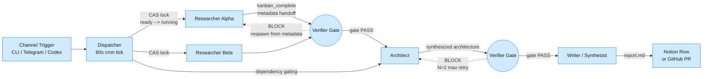

Building a research pipeline with multiple AI agents sounds straightforward: chain a researcher to a writer and call it done. In practice, three problems surface fast. First, agents hallucinate numbers and contradict each other, so you need someone to catch errors before they reach the reader.

<!--more-->

## Hermes Pipelines: Multi-Agent Swarm Routing with Deterministic Quality Gates

Building a research pipeline with multiple AI agents sounds straightforward: chain a researcher to a writer and call it done. In practice, three problems surface fast. First, agents hallucinate numbers and contradict each other, so you need someone to catch errors before they reach the reader. Second, an agent's sandbox cannot see files another agent wrote, so sharing results through anything other than structured metadata is unreliable. And third, a pipeline that works once by hand should work the same way every time without anyone watching. The Hermes pipeline system solves all three by combining a kanban task board (for state management), a cron-driven dispatcher (for orchestration), and a chain of specialist agent profiles with deterministic gate-check scripts between stages.

## The Core Concepts

The system is built on four primitives:

**Boards** are isolated SQLite databases, one per pipeline category. A board holds cards (tasks), tracks their state transitions, and stores run history. Nineteen active boards cover use cases from system architecture write-ups to private-equity deal analysis.

**Cards** are task descriptions with a status (`todo` -> `ready` -> `running` -> `done` or `blocked`), an assignee (a named Hermes profile), and optional parent dependency links. A card is the smallest unit of work a dispatcher can route.

**Profiles** are named Hermes Agent sessions with a fixed model, toolset, and skill set. Each profile is one persona in the pipeline: `tech-researcher-alpha` has a web-search toolset and reads papers; `system-design-verifier` runs deterministic lint scripts and scores against a rubric. The fleet has 98 profiles across 11 pipeline families.

**The Dispatcher** is a 60-second cron loop that reads the board state machine. It picks `ready` cards, assigns them to profiles via an atomic compare-and-swap lock (15-minute claim TTL, 4-hour stale timeout), and spawns a full Hermes process per card - not a lightweight subagent call.

A fifth concept, **the bar version**, stamps every published deliverable with `bar-vYYYY.MM.DD.N` from a VERSION file. This lets downstream consumers detect staleness and skip re-processing rows already at the current bar.

## How It Works

The dispatcher runs every 60 seconds. It scans each board for cards in `ready` status, acquires a claim lock atomically, and spawns a Hermes process for the named profile. That worker runs autonomously until it completes (transitioning the card to `done`) or blocks (transitioning to `blocked` with a reason for human attention). Cards with uncompleted parents cannot enter `ready` - the `parents=[...]` field at creation time enforces stage ordering without race conditions.

Between stages, a verifier profile runs **deterministic gate-check scripts** first: linting for forbidden typography (em-dashes, curly quotes), validating Mermaid diagram syntax, checking that the `## References` section exists at the end with clickable links, and ensuring no body H1 duplicates the page name. Only after these structural checks pass does a rubric-based LLM evaluation score the content. Cards that fail either gate return to their producer with the failing rows quoted.

## What I’ve Build with It

The system has grown five distinct pipeline patterns, each tuned to a different deliverable type:

**System Design pipeline** (5 cards, 540 tasks completed at 94.6%): Two parallel researchers investigate a design topic (WhatsApp, Yelp, YouTube). An architect reconciles their findings into a single architecture document. A verifier runs the gate check. A writer produces the final 8-section pyramid write-up. Gotcha: the architect's sandbox cannot see the researchers' files, so metadata must carry structured findings through `kanban_complete(metadata=...)`.

**Deep-Dive pipeline** (7 cards, 22 tasks at 77.3%): Three parallel researchers each own one sub-topic. A verifier milestone approves the set before the synthesist merges all three appendices into a single report. A second gate-verifier runs the full structural + rubric check. A publisher files the result to a Notion database. Gotcha: the verifier triple-block - a producer finishes, verifier rejects, producer fixes, verifier rejects again. The fix is a hard N=2 retry ceiling with auto-escalation to triage after the second block.

**MVP Build pipeline** (7+ cards, 386 tasks at 88.1%): Research -> spec -> scaffold -> architect -> senior engineer -> staff engineer -> verifier -> SRE -> writer -> end-to-end test. This is the longest chain and the most profile-intensive, using a dozen distinct personas. Gotcha: cards with unknown assignee names sit in `ready` forever because the dispatcher is intentionally dumb - it does not validate profile existence. The fix is an orchestrator playbook that discovers available profiles before creating cards.

**Tech Research pipeline** (3 cards, 267 tasks at 98.1%): A single researcher investigates a topic, a verifier gates the findings, and a writer produces a summary. The simplest and most reliable pattern.

**Discovery pipeline** (3 cards, 183 tasks at 100%): Two parallel researchers produce landscape briefings. A verifier accepts or rejects. No writer - the research artifact is the deliverable. This is the only pipeline that runs at 100% completion across all 183 tasks.

All five share the same structure: Trigger (Slack, CLI, or Telegram) -> Fan-out (parallel researchers) -> Verification gate -> Synthesis -> Publish (typically a Notion row stamped with the current bar version).

## Running in Production

The dashboard exposes three views: a board-by-board status grid showing completion rates and blocked cards, a real-time dispatch latency chart, and a cost attribution breakdown. Cost attribution joins worker run timestamps with session logs by time-window containment, achieving roughly 94% attribution accuracy. The remaining 6% splits across sub-agent overlap (2%), idle and gateway maintenance (2%), cron jobs (1%), and interactive dashboard use (1%).

Dispatch latency averages 3-6 seconds per card. The median 4.2-second breakdown is: 50ms for the CAS lock acquisition, 200ms for process fork, 600ms for Python initialization, 1.5 seconds for model auth and handshake, and 1.8 seconds for prompt processing. The p99 is dominated by container-init overhead, which is hard to reduce without a pool-warm strategy.

Model diversity is a deliberate choice. Different profile roles use different models: the standard researcher uses one model, the verifier uses another (typically DeepSeek or GPT-4 variants), and the architect uses a third. This prevents correlated failure modes - a hallucination pattern that fools one model is unlikely to fool a different one at the next stage.

A read-cache optimization collapses repeated board scans: the dispatcher checks file modification time on each board's kanban.db and skips boards whose WAL has not changed. This reduced per-tick SQLite reads from 85 to 1 in typical operation.

## Failure Modes and Lessons Learned

Every pipeline pattern listed above was born from a production failure. The honest catalog:

**Per-profile sandbox isolation.** Each Hermes worker runs in its own Docker container with an isolated filesystem. An architect that writes findings to `/tmp/research.md` finds the file invisible to the downstream verifier. The fixes: `dir:` workspaces that mount the same host path across containers, structured metadata handoff through `kanban_complete(metadata=...)`, and a shared host mount at `~/hermes-share/`. All three are in production.

**Verifier triple-block.** A producer finishes a card, the verifier rejects it, the producer revises and re-completes, the verifier rejects again, and the cycle spirals indefinitely. The fix has three layers: a hard N=2 max retry ceiling coded into the pipeline design, a `BLOCK_RECURRENCE_LIMIT=2` constant that auto-escalates to human triage, and a `regenerate-from-metadata` mode where the verifier reads the prior run's structured metadata instead of the full output - avoiding a full reprocess for minor formatting nits.

**Card-creation race condition.** Early pipelines used `kanban_create` followed by a separate `kanban_link` call. The dispatcher could claim the child card in the gap between the two calls, racing it past its uncompleted parent. Fix: `parents=[...]` at creation time, making the dependency atomic. Post-hoc `kanban_link` is still available but discouraged.

**replace_content overwrite.** A second pipeline run on the same slug would overwrite an already-published Notion page with a stub. The fix has three guards: idempotency keys that prevent duplicate card creation, bar-version comparison that skips rows already at the current bar, and a published-row freeze that refuses to overwrite any page where `Status=Published`.

**Bar-version staleness.** The gateway caches environment variables at boot time. A VERSION bump mid-lifecycle was invisible to running workers. The fix bakes the bar at pre-commit time in the `hermes-config` repo, so every worker starts with the correct version. Gateway restart on version bump remains a manual step.

**Shared-mount write visibility race.** Two workers writing to the same `dir:` workspace could race on file writes. The data loss window is narrow (milliseconds between `write_file` and the next reader), but it surfaces in high-throughput pipelines. No complete fix exists yet; the mitigation is to use structured metadata for cross-worker handoff and reserve file writes for final deliverables.

**Six percent unattributed cost.** The time-containment join misses sessions that span multiple task runs or start before the dispatcher tick. Fixing this requires a `parent_run_id` tag in the kernel's session table, which is on the roadmap.

## When to Use It, and When Not To

This system excels at structured multi-step work with quality gates: research syntheses, system-design write-ups, technical deep-dives with fact-checking, any workflow where the cost of an error reaching the reader is higher than the cost of an extra pipeline stage.

It is wrong for real-time chat (the 60-second dispatcher tick adds seconds of latency to every stage), simple Q&A where a single model call suffices, single-agent tasks that do not benefit from parallel fact-finding, and any workflow where the pipeline overhead (3-7 cards, 5-15 minutes wall-clock) dwarfs the value of the output. The dispatcher does not optimize for latency - it optimizes for correctness and auditability.

## Where It Is Heading

The per-pipeline profile split is the most consequential change in flight. Fifty-eight percent of task assignments still use legacy unprefixed profiles (researcher, verifier, writer). The migration to prefixed profiles (tech-researcher-alpha, system-design-verifier) will give each pipeline its own model assignments, tool configurations, and skill sets without cross-pipeline interference.

The skill catalog (74 [SKILL.md](http://skill.md/) files across all profiles) is growing faster than the board inventory. The immediate need is automated profile discovery - today the orchestrator playbook tells you to check available profiles before creating cards, but the check is manual.

The dashboard is evolving from a status grid toward a pipeline analytics tool: per-stage latency percentiles, bottleneck detection across the 98-profile fleet, and drill-down from a blocked card to its full worker log without leaving the browser. The p99 dispatch latency (dominated by container initialization) remains the hardest problem without a pool-warm strategy, but even that becomes tractable once pipeline profiles stabilize and pre-warming makes economic sense.

## References

1. [Hermes Kanban Documentation](https://hermes-agent.nousresearch.com/docs/user-guide/features/kanban) - public docs, dispatcher lifecycle and state machine
1. `kanban-orchestrator` [SKILL.md](http://skill.md/) v3.0.0 - orchestrator playbook with step-0 profile discovery
1. [DESIGN-BUILD-PIPELINE.md](http://design-build-pipeline.md/) - pipeline definitions, bar-version mechanism, and idempotency keys
1. [JOBS-PIPELINE-V3-DESIGN.md](http://jobs-pipeline-v3-design.md/) - jobs pipeline spec, retry ceiling, and sandbox isolation fixes
1. [agents-deepdive-gate-check.py](http://agents-deepdive-gate-check.py/) - deterministic structural gate script (~1,070 lines)
1. [hermes-sandbox-reaper.sh](http://hermes-sandbox-reaper.sh/) - container OOM reaper
