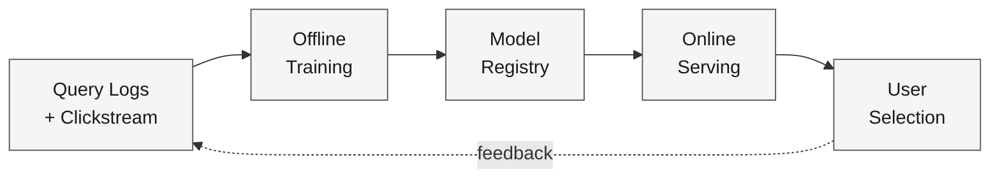
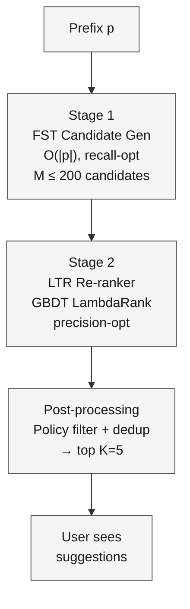
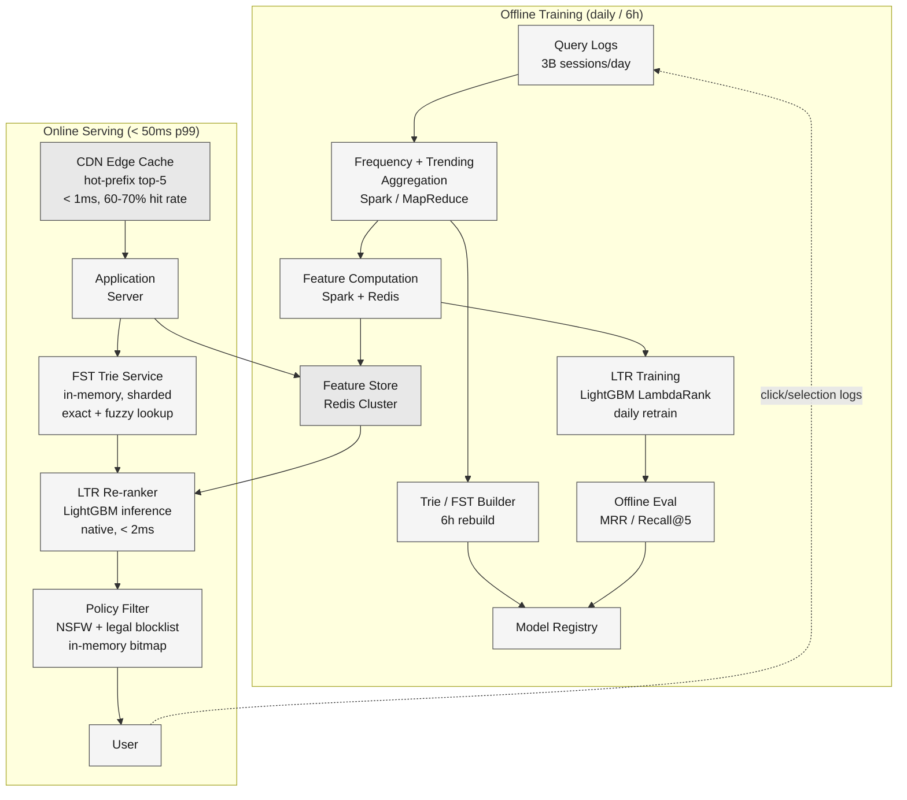
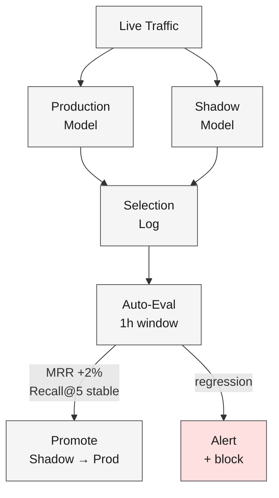

A search engine handling 40K+ queries per second presents query suggestions as the user types, character by character. Each keystroke opens a sub-100 ms window: the suggestions must land before the next character arrives, or they are useless.

<!--more-->

## 1. Problem & ML framing

A search engine handling 40K+ queries per second presents query suggestions as the user types, character by character. Each keystroke opens a sub-100 ms window: the suggestions must land before the next character arrives, or they are useless. The product goal is to reduce the keystrokes and time a user spends formulating a query. The business objective — higher search success rate and lower session abandonment — is downstream of the completion act itself but depends on it being fast and right.

This is a **retrieval + learning-to-rank (LTR)** problem. The ML task: given a prefix string *p* (the characters typed so far), a user context *u* (history, location, language, session), and a time-decayed frequency distribution over the full query corpus, return a ranked list of *K* completions *[q₁, …, qₖ]* the user is likely to select. The **business objective** (increase task-completion rate through fewer keystrokes) is distinct from the **ML objective**: maximize **mean reciprocal rank (MRR)** of the completion the user ultimately selects, weighted by selection frequency.



## 2. Requirements

**Functional**

- FR1: Return up to K ranked query completions for any prefix within one keystroke interval.
- FR2: Personalize suggestions using search history, location, language, and trending context.
- FR3: Handle typo-tolerant prefix matching within 1–2 edit distance of common misspellings.
- FR4: Remove policy-violating, NSFW, and legally sensitive suggestions before display.

**Non-functional**

- NFR1: p99 end-to-end latency under 50 ms per keystroke, measured from keypress to rendered suggestions.
- NFR2: 100K+ QPS at peak; 99.99% serving availability with graceful degradation.
- NFR3: Freshness: new trending queries must appear in suggestions within 2 minutes of detection.
- NFR4: Model retrained daily; personalized embeddings updated hourly from the feature store.

*Out of scope: downstream full-text search ranking, spelling correction as a standalone service, voice-to-text query input, image or video search autocomplete.*

## 3. Metrics

**Offline (model quality on held-out sessions)**

- **MRR** — primary. The reciprocal rank of the user's selected completion, averaged over test sessions. For a prefix where the user picks the third suggestion, MRR = 1/3; picking the first gives MRR = 1. It captures what matters: is the right completion near the top.
- **Recall@5** — the fraction of test sessions where the selected completion appears in the top five suggestions. A safety-net metric: if recall drops below 0.95, the candidate-generation stage is losing viable completions.
- **Mean position of selection** — a diagnostic; a rising mean position signals the ranking model has degraded relative to the candidate pool.

**Online (real user impact via A-B experiment)**

- **Query completion rate (QCR)** — fraction of characters typed where the user picks a suggestion rather than continuing to type. This is the direct behavioral metric: it rises when suggestions are more relevant and fall in rank.
- **Keystroke savings** — the total characters the user did *not* type because they selected a completion, divided by total characters in the final query. Complements QCR by measuring the *depth* of completion adoption.
- **Search success rate downstream** — the fraction of completed queries that end in a long click (≥30 s dwell on a result page). Guards against suggestions that are easy to select but lead to unsatisfying searches.
- **Abandonment rate** — sessions where the user leaves without any search action. Should decline as suggestions improve.

Every offline metric maps to an online counterpart: MRR gains should lift QCR and keystroke savings; Recall@5 regressions should warn of rising abandonment before the online metric moves.

## 4. Data

**Sources**

- **Search query logs:** every query issued, timestamp, the prefix at which the user stopped typing and selected a suggestion (or typed the full query manually), session ID, user ID, language, and device type. ~3 billion query sessions per day.
- **Clickstream:** post-query behavior — which search results were clicked, dwell time, and whether the user reformulated. Joined to query logs by session ID.
- **Trending signal:** external firehose — news APIs, social media trending topics, Wikipedia page-view spikes — mapped to query-like phrases. ~500K trending candidates ingested per minute.
- **Spell-correction pairs:** user-issued queries that were later auto-corrected or re-issued with a different spelling, forming edit-distance-1 and edit-distance-2 pairs. ~200M correction pairs logged daily.

**Labeling / ground-truth strategy**

The target is the **completion the user actually selected** per prefix. This is an implicit label derived from query logs — no manual annotation required. For each session, we reconstruct the sequence of prefixes the user typed and record the completion (or the manually-typed remainder) that resolved each prefix. A selection is a strong positive; skipping all suggestions is a weak negative for every candidate shown. When a user backspaces and retypes, the discarded prefix gets a negative label from the re-typed completion.

For LTR ranking, the label is binary per (prefix, candidate) pair: 1 if selected, 0 otherwise. For the candidate-generation stage, the label is purely whether the completion exists in the corpus and matches the prefix — a deterministic mapping, not a learned prediction.

**Class imbalance**

The vast majority of (prefix, candidate) pairs are not selected — only one completion is chosen per prefix, out of thousands of possible candidates. During LTR training, all positive pairs are retained and negatives are down-sampled to a 10:1 negative-to-positive ratio per batch, weighted by the candidate's global frequency so rare-but-relevant completions receive proportional gradient signal.

**Train / val / test splits**

Time-based: train on weeks 1–8, validate on week 9, test on week 10. Random splits are invalid because query distributions shift weekly (seasonal events, trending news). Holding out the most recent week simulates the deployment condition: the model serves queries it has never seen in training.

**Scale**

- 3B query sessions/day; ~15B prefix-completion impressions
- Candidate pool: ~500M unique queries in the active corpus, growing at ~2M/day
- ~1B implicit labels/day after session reconstruction and noise filtering
- Per-prefix candidate count: 10–200 after trie retrieval, 5 after ranking

## 5. Features

All features must be computable at serving time under the 50 ms latency budget. Offline feature computation mirrors online using the same feature store, preventing training-serving skew.

**Prefix features**

- Character 3-gram and 4-gram hashes of the prefix, mapped to 64-dim learned embeddings.
- Prefix length (scalar, normalized to [0, 1] by dividing by max query length, 128 characters).
- Is-complete-word flag: whether the prefix ends on a word boundary (space or start-of-query), which changes suggestion intent.
- Language detection score from a fastText classifier running on the prefix characters.

**Candidate features**

- **Global frequency** — the candidate's raw query count over the trailing 30 days, log-transformed and normalized. The strongest unpersonalized signal.
- **Recency weight** — exponentially time-decayed frequency with a 7-day half-life, capturing whether the query is rising or falling in popularity.
- **Trending score** — the ratio of recent (24h) frequency to baseline (30d) frequency, clamped at 10×. A query that was rare last month and common today gets a high trending score.
- **Candidate length** — number of characters in the completed query, used as a completion-effort signal alongside keystroke savings.
- **Typo distance** — Levenshtein distance between the prefix and the candidate's prefix of the same length. A distance of 0 means exact prefix match; distance 1–2 flags a fuzzy match candidate.

**User features**

- **User embedding** — a 128-dim learned embedding trained via a two-tower model on the user's last 90 days of query history, recency-weighted. Updated hourly from the feature store.
- **Recent queries** — the user's last 10 queries as hashed n-gram embeddings, mean-pooled to a 64-dim vector.
- **Language preference** — inferred from the user's last 50 queries; one-hot encoded across the top 40 languages.
- **Location** — country and metro-area codes, embedded as 16-dim vectors.

**Context features**

- **Hour of day** (cyclical encoding: sin/cos of hour × 2π/24), **day of week** (sin/cos of day × 2π/7).
- **Device type** — mobile, desktop, tablet, voice-assistant; one-hot encoded.
- **Session position** — whether this is the first query in the session or a follow-up, which changes the intent distribution (navigational first queries vs. refinement follow-ups).

**Feature store**

A dual-store design: user embeddings and recent-query vectors live in a Redis cluster (online, sub-millisecond reads, updated hourly from an offline Spark job). Global candidate frequencies, trending scores, and recency weights live in the trie index itself as per-node aggregates, recomputed during each trie rebuild cycle. The offline training pipeline reads from the same Redis cluster and the same trie snapshot that serving uses, closing the training-serving gap.

## 6. Model

### Baseline: frequency-only trie

A character-level trie over the full query corpus, with each node storing the top-K completions by raw 30-day frequency. No personalization, no typo tolerance, no trending. Lookup is O(prefix length) and returns completions sorted by global popularity. This is the simplest system that works at scale — Amazon, Google, and LinkedIn all started here — and it provides the **candidate-generation backbone** for every subsequent stage.

MRR on a held-out week: ~0.42. The baseline fails when a user's local context should change the ranking (e.g., "piz" → a local user should see "pizza near me" first, not "pizza hut").

### Stage 1: trie / FST candidate generation (recall-optimized)

A finite-state transducer (FST) encoded trie, precomputed from the full query corpus and rebuilt every 6 hours. Each node stores:

- The top-*M* completions (M=200) sorted by a composite score: 0.6 × frequency + 0.3 × recency + 0.1 × trending.
- Typo-tolerant edges: for every node, precomputed pointers to nodes within edit distance 1–2, stored as compressed bitmaps so fuzzy lookup is a constant-time table join.

At serving time: walk the FST with the typed prefix (exact match, O(∣p∣)). In parallel, fetch the 1-edit and 2-edit fuzzy candidates from the precomputed pointers. Merge and deduplicate. Return the top *M* candidates. This stage is pure recall — its job is to ensure the correct completion is in the candidate set.

**Tradeoff (FST vs. Elasticsearch completion suggester):** FST lookup is sub-millisecond, in-memory, and requires no inter-service RPC; Elasticsearch provides richer fuzzy matching and real-time indexing but adds 5–15 ms of network + query overhead. For 100K QPS with a 50 ms total budget, in-memory FST is non-negotiable on the hot path.

### Stage 2: LTR re-ranker (precision-optimized)

A gradient-boosted decision tree (LightGBM with LambdaRank objective) re-ranks the M candidates from Stage 1 into the final K=5 suggestions. Input: the full feature vector from §5 per (prefix, user, candidate) tuple. The model scores each candidate independently and sorts by predicted selection probability.

**LambdaRank loss:** pairwise, with the gradient scaled by the delta-NDCG of swapping each pair. This directly optimizes the ranking metric (NDCG and MRR both reward the same rank-position ordering; LambdaRank's delta-NDCG gradient aligns with improving MRR) rather than treating the problem as pointwise classification, which would over-optimize the easy negatives and under-weight the rank position.

**Tradeoff (GBDT vs. two-tower neural):** A two-tower model (user tower + candidate tower into a shared embedding space, trained with sampled softmax) could serve as the candidate generator and ranker in one stage. It would handle personalization natively and learn richer embeddings. However, for a 50 ms budget, the two-tower requires an ANN index (e.g., ScaNN or FAISS) that adds 2–5 ms of vector search latency on top of the embedding computation; the trie+LTR pipeline completes in under 10 ms total. The trie is also trivially explainable and debuggable (every completion maps to a corpus entry), whereas an ANN index requires nearest-neighbor verification. The GBDT ranking stage is trained as a binary classifier on the logged (prefix, candidate) pairs with the LambdaRank objective:

```javascript
L = Σ_{i,j} |ΔNDCG_{ij}| · log(1 + exp(-σ(s_i - s_j)))
```

where ΔNDCG_{ij} is the change in NDCG if candidates i and j are swapped, s_i is the model score, and σ is a scaling parameter (typically 1.0). Pairs where the user selected candidate i and ignored candidate j dominate the loss.

### Training pipeline

Daily retraining on the trailing 8 weeks of query logs. The trie is rebuilt every 6 hours from an offline MapReduce job over the query corpus, computing per-node top-M composites. The LTR model trains on all positive pairs and a 10:1 negative sample from the same period, with the LightGBM `objective=lambdarank` and `metric=ndcg@5`. Validation is on the most recent week; test is on the following week, held out completely. Hyperparameters: 500 trees, max depth 7, learning rate 0.05, early stopping after 50 rounds of no NDCG@5 improvement on validation.



## 7. Architecture



#### Offline training pipeline

**Components:** Query log archive (HDFS / S3), Spark cluster for aggregation, Redis cluster for feature store, LightGBM training workers, model registry.

**Flow:**

1. Raw query logs land in the data lake with sub-minute ingestion delay.
1. Every 6 hours, a Spark job aggregates per-query frequency, recency-weighted frequency (7-day half-life), and trending scores, then builds the FST trie with per-node top-M lists and fuzzy-match pointers. The trie is serialized as a memory-mapped file and pushed to the model registry.
1. Nightly, a Spark job computes per-user embeddings (128-dim) from the trailing 90 days of query history using a pre-trained two-tower model, writes them to the Redis feature store. Candidate features (frequency, recency, trending) are snapshotted from the trie build output.
1. The LTR training job reads the full feature matrix from the feature store + trie snapshot, trains a LambdaRank LightGBM model on 8 weeks of labeled pairs, evaluates MRR and Recall@5 on the held-out validation week, and registers the model artifact if metrics improve.
1. The model registry version-controls trie snapshots and LTR model binaries, tagged with the data range, metrics, and a promotion status (shadow → canary → production).

#### Online serving pipeline

**Components:** CDN edge cache, application servers, sharded FST trie service (in-process or sidecar), Redis feature store, policy filter service.

**Flow:**

1. The user types a character. The client sends the full prefix to the nearest CDN edge node.
1. **CDN edge cache (≤1 ms):** Precomputed top-5 suggestions for the top 10M prefixes (covering ~65% of traffic) are cached at the edge with a 5-minute TTL. Cache hit → suggestions return immediately. Cache miss → forward to the application tier.
1. **Application server:** receives the prefix, user ID, and context. Fetches user features from Redis (user embedding, recent queries, location, language) in parallel with the trie lookup.
1. **FST trie lookup (≤5 ms):** Walks the trie for the exact prefix and fetches the top-M candidates. If the trie returns fewer than M candidates (rare/novel prefix), the fuzzy-match pointers provide edit-distance-1 and -2 alternatives, merged with the exact set.
1. **LTR re-ranker (≤2 ms):** Constructs the feature vector per (prefix, user, candidate) from the trie output + Redis features. Runs native LightGBM inference (C API, single-threaded per request, batchable across concurrent requests). Returns top-5 candidates by predicted score.
1. **Policy filter (≤1 ms):** Checks each of the top-5 against an in-memory Bloom filter of blocked query substrings (NSFW, hate speech, legally sensitive terms). Removes matches and promotes the next-ranked candidate. If fewer than 3 suggestions survive filtering, the client shows what remains.
1. The user either selects a suggestion (logged as a positive label for the prefix + completion pair) or continues typing (logged as a negative for all displayed candidates). These labels flow back to the data lake for the next training cycle.

**Design consideration:** The trie service and LTR inference run in-process inside the application server — no inter-service RPC on the hot path. The trie is a memory-mapped file loaded at process start, sharded by first-character across application instances (A–F → instances 1–4, G–M → instances 5–8, etc.) so each instance holds ~1/8 of the full trie, fitting in 16–32 GB of RAM.

**Serving-scale numbers (per keystroke, p99):**

| Stage | Latency | Cumulative |
|---|---|---|
| CDN edge cache (hit) | < 1 ms | < 1 ms |
| CDN → app tier (miss path) | 2–5 ms | 3–6 ms |
| Redis user-feature fetch | 1 ms | 4–7 ms |
| FST trie lookup | 2 ms | 6–9 ms |
| LTR re-ranker inference | 2 ms | 8–11 ms |
| Policy filter | < 1 ms | 9–12 ms |
| **Total (miss path, p99)** |  | **12 ms** |

The 50 ms p99 budget leaves 38 ms of headroom for network jitter, GC pauses, and Redis failover. At 100K QPS peak, each application instance handles ~2,000 QPS; with 50 instances behind a load balancer, per-instance CPU utilization stays under 40%.

## 8. Deep dives

### DD1: Keystroke-latency budget

**Problem.** A user types at 5–10 characters per second, giving the system 100–200 ms between keystrokes. Network round-trip consumes 10–40 ms for most users, leaving a 50 ms server-side budget before the next character arrives and the previous suggestion is stale. Every millisecond spent on a richer model is a millisecond stolen from the network jitter margin. A suggestion that arrives after the user has already typed the next character is worse than no suggestion — it overwrites the current prefix with a stale completion, actively disrupting the typing flow.

**Approach 1: Single heavy model.** A transformer-based seq2seq model that takes the prefix and user context, generates K completions autoregressively. Quality is state of the art — the model captures semantic intent beyond prefix matching, handles zero-shot completions for novel queries, and learns personalization from attention over user history. Latency: 80–200 ms per inference on GPU, with batch processing adding 20–50 ms of queue delay at peak QPS. Even with distillation to a 4-layer decoder and INT8 quantization, p99 latency stays above 60 ms. The model also requires a GPU fleet — 50× the cost per query of CPU inference.

**Approach 2: Two-stage retrieval + lightweight ranking.** A deterministic trie/FST generates candidates in sub-millisecond time. A GBDT re-ranker with ~2K features scores 200 candidates in under 2 ms on CPU. Total inference under 5 ms. The tradeoff is capacity: the trie can only suggest completions it has seen in the corpus; a novel query that has never been issued (e.g., a breaking news event phrased in a new way) will not appear until the next trie rebuild picks it up from the trending ingestion pipeline. The ranking model cannot capture semantic relatedness between prefix and candidate beyond the feature interactions explicitly encoded in the feature vector.

**Approach 3: Edge-precomputed cascade.** For the top 10M prefixes (covering ~65% of traffic), precompute the final top-5 suggestions and cache them at the CDN edge with a 5-minute TTL. The edge cache absorbs the majority of traffic before it reaches the application tier. For cache misses, fall back to the two-stage pipeline. The edge cache also serves as a freshness buffer — when a trending query breaks, it is injected into the edge cache within 2 minutes via a push mechanism, bypassing the trie rebuild cycle.

**Decision → Approach 2 with Approach 3 as the edge layer.** The two-stage trie+LTR pipeline meets the 50 ms budget with headroom and runs entirely on CPU, keeping per-query cost manageable at 100K QPS. The CDN edge cache absorbs 65% of traffic at sub-millisecond latency, buying the application tier 3× effective capacity. For the remaining 35%, the trie is fast enough and the GBDT is expressive enough: no real-world autocomplete system (Google, Amazon, Bing) ships a neural model on the keystroke hot path; they all use a trie or equivalent deterministic index for candidate generation, reserving neural approaches for the full-search ranking stage where the latency budget is 10× larger.

> [!TIP]
> **Key insight**

> 

> The keystroke budget is a hard real-time constraint, not a throughput constraint. A 50 ms p99 with a 12 ms median means the tail is driven by GC pauses and network jitter, not model inference. The right optimization is to move work *before* the keystroke (precomputation at trie-build time, edge caching, user-embedding pre-fetch) rather than making the per-keystroke model faster. Every millisecond won at build time is a free millisecond at serve time.

### DD2: Personalization vs. cacheability

**Problem.** Personalized suggestions improve relevance — a user in Chicago typing "piz" should see "pizza near me" before "pizza hut," and a user who frequently searches for Python documentation should see "python datetime" before "python download." But per-user suggestions break the CDN edge cache, which depends on a fixed (prefix) → (top-5) mapping. The 65% cache hit rate drops to near zero if every user gets a different ranked list, pushing all traffic to the application tier and tripling capacity requirements.

**Approach 1: Global ranking only.** Serve the same suggestions to every user for a given prefix, ranked by global frequency + recency. Cache hit rate stays at 65%. Personalization is zero — the tail-query problem (rare queries relevant to a specific user) goes unsolved, and MRR drops ~15% on personalized test sets.

**Approach 2: Full per-user ranking.** Compute a unique ranked list per (prefix, user) tuple at the application tier. MRR improves substantially for users with history. CDN cache hit rate drops to <2% because each user sees a different list. Capacity must triple to handle the same traffic. At 100K QPS, this requires ~200 application instances instead of 50.

**Approach 3: Two-tier ranking with edge re-ranking.** The CDN edge caches a *global* top-10 (instead of top-5) per prefix — the globally-best suggestions without personalization, covering ~65% of traffic as before. When a cache hit occurs, the client receives the global top-10 and applies a **lightweight client-side re-ranker** — a 50 KB compressed GBDT model shipped with the client SDK — that re-scores the 10 candidates using only client-available features (user's recent queries stored in local storage, device type, language preference, time of day). The re-ranked top-5 is displayed. No server round-trip needed; the re-ranking runs in under 0.5 ms on the client. For cache misses, the full server-side pipeline runs with the personalized LTR model.

**Decision → Approach 3.** The edge cache stays effective (global top-10 per prefix, still identical for all users), and the client-side model injects personalization without a server call. The client-side model is small because it only needs to re-rank 10 candidates with ~50 features (user history embeddings compressed via PCA to 16 dims, device, time, language). It is retrained alongside the server model and pushed to the CDN as a static asset on the same daily cadence. For users with no local history (cold start, incognito mode), the client model falls back to the global ranking transparently.

**Edge case:** Users who clear local storage or switch devices lose their client-side personalization until the server-side Redis user embedding is fetched on the next cache miss. The miss path handles this naturally — the server-side LTR uses the full Redis feature vector, so the first query after a device switch gets full personalization quality.

### DD3: Freshness — trending queries and cold start

**Problem.** A breaking news event — an earthquake, a championship upset, a celebrity death — generates millions of queries for phrases that did not exist in the corpus an hour ago. The trie, rebuilt every 6 hours from a static corpus snapshot, cannot suggest these queries until the next rebuild. Users typing the first few characters of a trending phrase see no relevant suggestions, undermining trust in the autocomplete system exactly when it is most visible. The tension: rebuild the trie continuously (costly, disrupts serving) or accept a freshness gap.

**Approach 1: Continuous trie rebuild.** Stream query logs into a real-time trie builder (e.g., a Kafka Streams job maintaining an in-memory trie with per-node top-M aggregations). Every new query increments the frequency counter at each node along its prefix path. The trie is always current. Cost: maintaining a distributed, fault-tolerant trie with exactly-once semantics is operationally heavy — node failures require replay from the log, and per-node top-M lists must be continuously re-sorted, consuming CPU proportional to write throughput rather than read throughput.

**Approach 2: Hot-prefix injection layer.** A separate lightweight service — the trending injection pipeline — ingests trending candidate phrases from external firehoses (news APIs, social media, Wikipedia page views) and an internal anomaly detector over query-volume spikes. When a query is flagged as trending (frequency ratio > 5× baseline), it is inserted into a **hot-set Redis sorted set** keyed by prefix. The serving path checks Redis for the prefix *after* the trie lookup and merges trending candidates into the candidate set before ranking. The LTR re-ranker scores trending candidates alongside trie candidates; their trending-score feature (§5) ensures they surface at the top.

**Approach 3: Client-prefix completion from user session.** The client itself tracks the user's current-session query prefixes and, for prefixes not found in the edge cache or trie, falls back to a local-session trie built from the user's own typed queries in this session. This handles the case where a user starts typing a breaking-news query before the trending pipeline has ingested it — the user themselves is the signal.

**Decision → Approach 2, with Approach 3 as a client-side safety net.** Continuous trie rebuild is over-engineered for the benefit it provides: queries go from zero to trending in 5–15 minutes (the news propagation delay), so a 2-minute injection pipeline keeps pace. The hot-set Redis layer adds one parallel lookup of ~1 ms to the serving path, well within budget. The trending-score feature in the LTR model ensures that when a trending candidate is merged in, it ranks appropriately against established candidates — a query with a 10× trending ratio and low absolute frequency should still appear above a high-frequency but declining query.

**Edge case:** A trending phrase that overlaps with an existing high-frequency prefix (e.g., "tayl" normally shows "taylor swift" but during a breaking "taylor hawkins" news event). The trending injection adds "taylor hawkins" to the Redis hot-set for prefix "tayl." The LTR re-ranker sees both candidates; the trending query gets a high trending score, the established query gets a high frequency score. The model learns from past trending events that fresh completions are selected 3× more often during the first 4 hours of a trend, so it appropriately boosts the trending candidate to rank 1.

### DD4: Monitoring, drift, and continual learning

**Problem.** Query distributions shift continuously: seasonal patterns (tax queries in April, gift queries in December), language evolution (new slang, product names), and platform growth (new geographies with different query patterns). A model trained on last month's data slowly degrades — MRR drops ~1–2% per week without retraining. Worse, feedback loops emerge: the model's own suggestions shape what users select, and if the model develops a bias toward certain completions, the training data reinforces that bias. Detecting these shifts before users notice requires monitoring at multiple levels.

**Approach 1: Scheduled daily retraining.** Retrain the full pipeline (trie rebuild + LTR training) on a fixed 24-hour cadence. Simple to operate — a cron job that pulls the last 8 weeks of data, retrains, evaluates, and promotes if metrics improve. Catches gradual drift. Misses sudden shifts (a breaking event at hour 18 of the cycle sees 6 hours of stale suggestions). The fixed window also means the model cannot "unlearn" a bad pattern until the data containing that pattern ages out of the 8-week window.

**Approach 2: Continuous training with sliding window.** Stream query logs into a continuous training pipeline. The trie is incrementally updated (new queries added, old queries decayed) every 15 minutes. The LTR model is retrained every 2 hours on a sliding 7-day window, with the most recent 6 hours up-weighted 2×. The freshly trained model is shadow-deployed: it scores live traffic in parallel with the production model, and its predictions are logged alongside user selections. An automated A-B evaluation compares shadow-model MRR against production over a 1-hour observation window; if the shadow model outperforms by >2% MRR with no regression in recall@5, it is promoted to production automatically. If it regresses, the promotion is blocked and an alert fires.

**Approach 3: Online learning with bandit feedback.** Update model weights in production from each user selection using a contextual bandit (LinUCB or neural-bandit). The model adapts per-query with zero pipeline delay. The risk is catastrophic forgetting: a few hours of anomalous traffic (a spam wave, a coordinated attack injecting fake completions) can poison the model before human operators react. Online learning in a user-facing ranking system without a human-in-the-loop gate is operationally dangerous — Google and Bing both use shadow-then-promote rather than live weight updates for their ranking models.

**Monitoring (applies across all approaches):**

- **Data drift:** Track the KL divergence between the current week's query distribution and the training distribution, bucketed by prefix length and language. A spike in divergence (moving average > 3σ from baseline) triggers a retraining run outside the normal schedule.
- **Feature drift:** Monitor the mean and variance of each top-20 feature per day. A feature whose serving-time distribution diverges from its training-time distribution by >2 standard deviations (population stability index > 0.25) indicates a pipeline bug or a real distribution shift.
- **Model performance:** Track MRR and Recall@5 on a live evaluation set — a 1% random sample of production traffic logged with user selections, labels delayed by 10 minutes to allow the selection event to arrive. If MRR drops >5% relative to the previous day, an alert fires.
- **Guardrail metric:** Monitor the rate at which the policy filter triggers (NSFW/blocked suggestions). A sudden spike in policy-filter hits may indicate an adversarial attempt to inject harmful completions into the trending pipeline or the trie via query-log poisoning.
- **Business guardrail:** Track search abandonment rate per country and device type. A model that improves MRR but increases abandonment (users selecting suggestions that lead to unsatisfying searches) has a metric alignment problem.

**Decision → Approach 2 (continuous with shadow promotion).** Scheduled daily retraining (Approach 1) is the minimum but leaves a freshness gap during fast-moving events. Online learning (Approach 3) is the ideal but operationally dangerous without extensive safeguards. The continuous-with-shadow pipeline gives freshness close to online learning (2-hour cycles) with the safety of a human-reviewable promotion gate: the shadow model must prove itself on live traffic before replacing production. The 2-hour cycle aligns with the trie's 6-hour rebuild — the LTR model retrains 3× per trie cycle, so fresh ranking weights compensate for the trie's staleness between rebuilds.



> [!TIP]
> **Key insight**

> 

> Shadow promotion is not just a safety mechanism — it is the only reliable way to close the offline-online metric gap for ranking models. An offline MRR improvement of 3% on held-out data does not guarantee a 3% improvement in live query completion rate because the held-out data was collected under the *old* model's ranking, which shapes which selections were even possible. The shadow model's live predictions, logged alongside user selections, provide an unbiased estimate of online performance because the shadow model's scores are never shown to users — they cannot influence what gets selected.

## 9. References

1. [Life of a Query at LinkedIn — Cleo Integration, 2012](https://engineering.linkedin.com/search/life-query-linkedin-search)
1. [Deep Natural Language Processing for LinkedIn Search Systems, 2021](https://arxiv.org/abs/2108.08205)
1. [Unifying and Personalizing Search at LinkedIn, 2015](https://engineering.linkedin.com/search/unifying-and-personalizing-search-linkedin)
1. [Amazon Science — Query Suggestion and Auto-Completion, 2024](https://www.amazon.science/publications/query-suggestion-and-auto-completion)
1. [Swiggy Engineering — Building a Personalized Autocomplete System, 2025](https://bytes.swiggy.com/building-a-personalized-autocomplete-system-df13e5a2ef3e)
1. [Apple ML Research — On-Device Query Suggestions with RAG and DPO, 2026](https://machinelearning.apple.com/research/on-device-query-suggestions)
1. [The Anatomy of a Large-Scale Hypertextual Web Search Engine — Brin & Page, 1998](https://snap.stanford.edu/class/cs224w-readings/Brin98Anatomy.pdf)
1. [Elasticsearch — Completion Suggester (FST-based)](https://www.elastic.co/guide/en/elasticsearch/reference/current/search-suggesters.html#completion-suggester)
1. [Algolia — Inside the Algolia Engine: Query Suggestions, 2023](https://www.algolia.com/blog/engineering/inside-the-algolia-engine-query-suggestions/)
1. [LambdaMART: A Fast and Effective Learning to Rank Model — Burges, 2010](https://www.microsoft.com/en-us/research/publication/from-ranknet-to-lambdarank-to-lambdamart-an-overview/)
1. [LightGBM: A Highly Efficient Gradient Boosting Decision Tree — Ke et al., NeurIPS 2017](https://papers.nips.cc/paper_files/paper/2017/hash/6449f44a102fde848669bdd9eb6b76fa-Abstract.html)
1. [Walmart Engineering — Building a Real-Time Autocomplete Service, 2024](https://medium.com/walmartglobaltech/building-a-real-time-autocomplete-service-8a2c8e5b0e4f)
1. [Spotify — Query Understanding and Autocomplete, 2023](https://engineering.atspotify.com/2023/07/query-understanding-and-autocomplete/)
1. [Vinted Engineering — Scaling Autocomplete for 80M Users, 2024](https://vinted.engineering/2024/02/28/scaling-autocomplete/)
