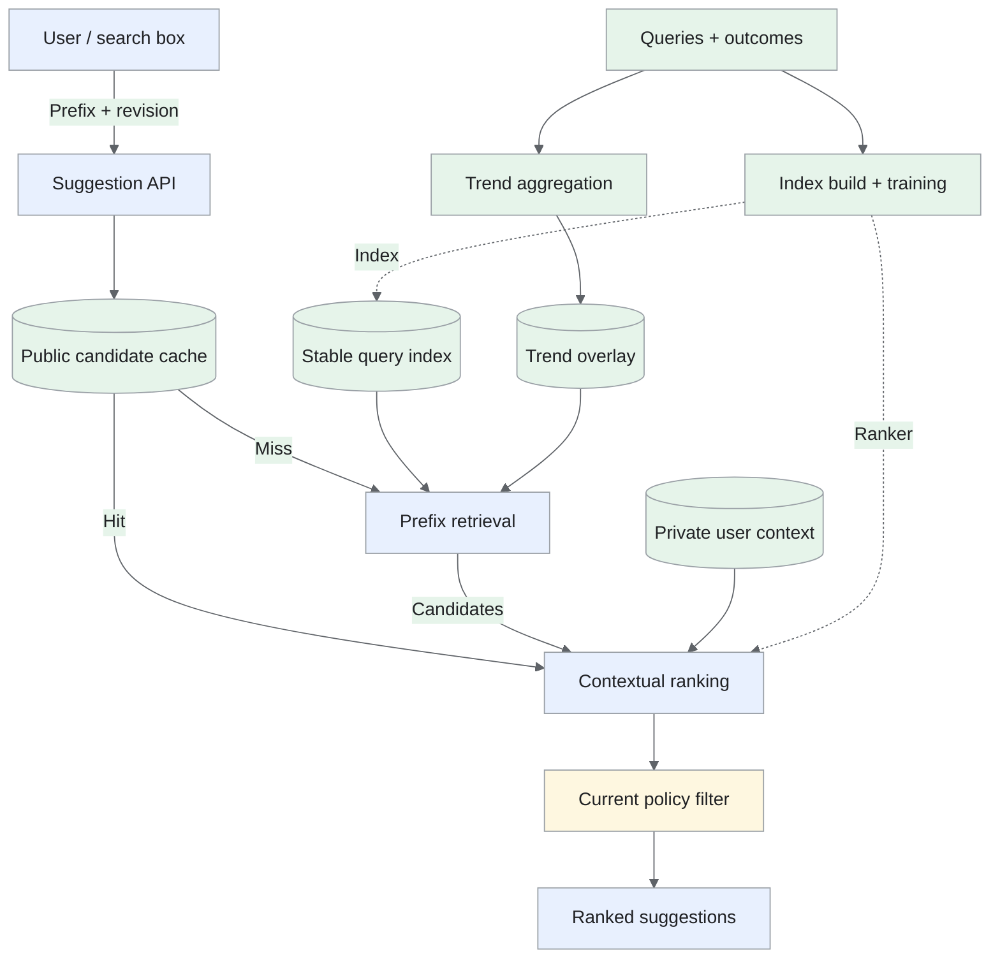
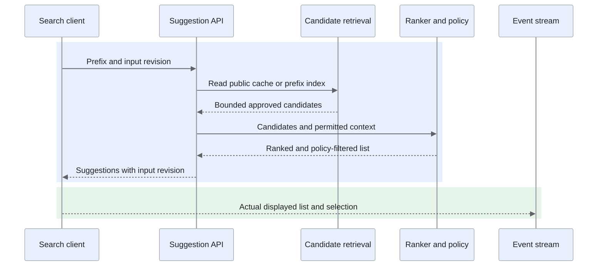
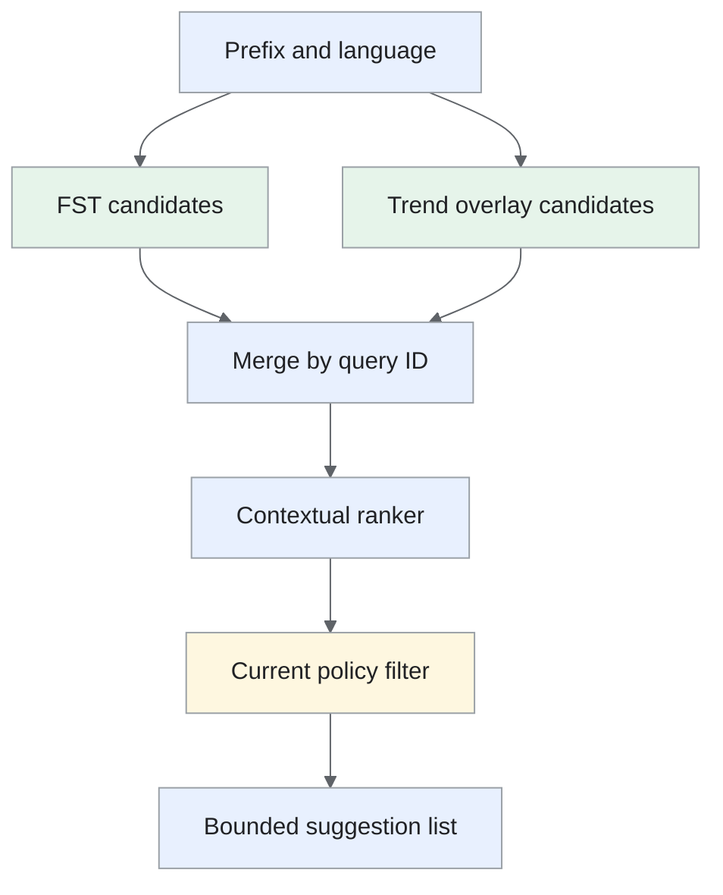

A query-suggestion service that returns useful search completions as a user types, combining prefix retrieval, ranking and fresh policy checks.

<!--more-->

## Problem

Users often know part of what they want to search for. Suggestions help them complete the query with fewer keystrokes and can surface a relevant phrase they would otherwise miss.

The service receives the current prefix and returns a short ranked list. It combines a stable query corpus with recent trends, while keeping each response fast enough to remain useful for the next keystroke.

## Requirements

### Functional requirements

- **Suggest completions.** Return up to five useful queries for the typed prefix.

- **Use context.** Consider language, coarse region and consented search history.

- **Handle minor typos.** Allow bounded fuzzy matching when the prefix is long enough.

- **Reflect trends.** Make approved trending queries eligible within two minutes.

- **Apply policy.** Exclude prohibited or sensitive suggestions on every serving path.

- **Handle rapid typing.** Associate each response with the input revision so older responses cannot replace newer suggestions.

- **Collect feedback.** Record displayed suggestions, selections and the resulting search outcome.

### Non-functional requirements

- **Scale:** support 100K suggestion requests/s at peak.

- **Latency:** target p99 below 50ms from a keystroke to displayed suggestions, including client delay and delivery.

- **Availability:** target 99.99%, using safe frequency-ranked suggestions when personalization is unavailable.

- **Freshness:** publish trend updates within two minutes; refresh the stable index and evaluate ranking candidates on a regular schedule.

- **Quality:** measure selection rank, successful search outcomes and abandonment by prefix length and language.

- **Privacy:** keep private history out of shared cache entries and restrict retention of raw queries.

## Back-of-the-envelope calculations

- At 100K requests/s and 200 candidates/request, the service evaluates up to **20M ranking candidates/s**. Candidate limits and compiled ranking cost determine the serving budget.

- With an assumed 65% public-candidate cache hit rate, index retrieval falls to **35K requests/s**. Personalized ranking and the final policy check still run for all 100K requests/s.

- A 500M-query corpus averaging 32 bytes of query text and 24 bytes of metadata contains about **28GB of raw data**, before index overhead, compression and replicas.

- Two million new queries/day is about **23 queries/s on average**. Bursts, spam filtering and trend aggregation determine the peak update load.

## Core entities

- **SuggestionRequest** identifies a prefix and the current input revision.

- **QueryCandidate** contains the display text and ranking features.

- **SuggestionImpression** records the list the client actually displayed.

- **SuggestionOutcome** records selection and search feedback.

- **SuggestionBundle** versions the stable index, ranker and feature definitions.

```protobuf
message SuggestionRequest {
  string prefix;
  string language;
  string region;
  string session_id;
  int64 sequence;          // Increases when the input changes
}

message QueryCandidate {
  string query_id;
  string text;
  double frequency;
  double recent_popularity;
  string language;
}

message SuggestionImpression {
  string request_id;
  repeated string query_ids;
  google.protobuf.Timestamp displayed_at;
  string bundle_id;
}

message SuggestionOutcome {
  string event_id;
  string request_id;
  string selected_query_id;
  string search_outcome;   // Successful result interaction, abandonment
}

message SuggestionBundle {
  string bundle_id;
  string index_uri;
  string ranker_uri;
  string feature_schema;
  string corpus_watermark;
}

```
## API

```yaml
suggest:
  method: GET
  path: /v1/suggestions
  query:
    prefix: pizz
    language: en
    region: us
    sequence: 18
    limit: 5
  identity: optional authenticated user; otherwise anonymous session
  response:
    request_id: sug_123
    sequence: 18
    bundle_id: suggestions_v9
    suggestions:
      - {query_id: q1, text: "pizza near me"}
      - {query_id: q2, text: "pizza delivery"}

record_outcome:
  method: POST
  path: /v1/suggestion-events
  fields: [event_id, request_id, displayed_query_ids, selected_query_id, search_outcome]

```
## High-level design

The API retrieves public candidates from a prefix cache or index and adds recent trending queries. A lightweight ranker uses request context, then the current policy filter produces the final list.

Query events update the trend overlay and training data. Stable index and ranker releases are published as compatible bundles.


```mermaid
%%{init: {'theme':'base','themeVariables':{'primaryColor':'#e8f0fe','primaryTextColor':'#202124','primaryBorderColor':'#9aa0a6','lineColor':'#5f6368','secondaryColor':'#e6f4ea','tertiaryColor':'#fef7e0','actorBkg':'#e8f0fe','actorBorder':'#9aa0a6','actorTextColor':'#202124','noteBkgColor':'#fef7e0','noteTextColor':'#202124','noteBorderColor':'#9aa0a6','signalColor':'#5f6368','signalTextColor':'#202124','labelBoxBkgColor':'#fef7e0','labelBoxBorderColor':'#9aa0a6'}}}%%
flowchart TB
  U["User / search box"] -->|"Prefix + revision"| API["Suggestion API"]
  API --> CACHE[("Public candidate cache")]
  CACHE -->|"Miss"| RET["Prefix retrieval"]
  IDX[("Stable query index")] --> RET
  TREND[("Trend overlay")] --> RET
  CACHE -->|"Hit"| RANK["Contextual ranking"]
  RET -->|"Candidates"| RANK
  CONTEXT[("Private user context")] --> RANK
  RANK --> POLICY["Current policy filter"]
  POLICY --> RESULT["Ranked suggestions"]
  EVENTS["Queries + outcomes"] --> AGG["Trend aggregation"]
  AGG --> TREND
  EVENTS --> BUILD["Index build + training"]
  BUILD -.->|"Index"| IDX
  BUILD -.->|"Ranker"| RANK
classDef request fill:#e8f0fe,stroke:#9aa0a6,color:#202124;
classDef data fill:#e6f4ea,stroke:#9aa0a6,color:#202124;
classDef control fill:#fef7e0,stroke:#9aa0a6,color:#202124;
class U,API,RET,RANK,RESULT request;
class CACHE,IDX,TREND,CONTEXT,EVENTS,AGG,BUILD data;
class POLICY control;

```
## Storage

- **Weighted finite-state index:** keep the stable query corpus in a compact prefix-search structure, loaded or memory-mapped by retrieval workers. A finite-state transducer (FST) shares repeated paths to make prefix lookup efficient.

- **[Redis](/designs/tech-redis/):** cache public candidate IDs by normalized prefix, language, coarse region and bundle ID. Keep trending candidates and short-lived user features in separate key spaces.

- **[Kafka](/designs/tech-kafka/) and object storage:** collect deduplicated query and impression events, retain approved training records and build reproducible index snapshots.

- **[PostgreSQL](/designs/tech-postgresql/):** store consent settings, release metadata and reviewed policy changes.

- **Policy snapshot:** distribute a versioned deny set to serving workers independently of the slower index release. Track its freshness on cache hits as well as misses.

Shared cache entries contain public candidates. Private history is fetched only for that user's ranking request.

## From request to response

### Suggestion flow


```mermaid
%%{init: {'theme':'base','themeVariables':{'primaryColor':'#e8f0fe','primaryTextColor':'#202124','primaryBorderColor':'#9aa0a6','lineColor':'#5f6368','secondaryColor':'#e6f4ea','tertiaryColor':'#fef7e0','actorBkg':'#e8f0fe','actorBorder':'#9aa0a6','actorTextColor':'#202124','noteBkgColor':'#fef7e0','noteTextColor':'#202124','noteBorderColor':'#9aa0a6','signalColor':'#5f6368','signalTextColor':'#202124','labelBoxBkgColor':'#fef7e0','labelBoxBorderColor':'#9aa0a6'}}}%%
sequenceDiagram
  participant U as Search client
  participant A as Suggestion API
  participant R as Candidate retrieval
  participant M as Ranker and policy
  participant E as Event stream
  rect rgb(232, 240, 254)
    U->>A: Prefix and input revision
    A->>R: Read public cache or prefix index
    R-->>A: Bounded approved candidates
    A->>M: Candidates and permitted context
    M-->>A: Ranked and policy-filtered list
    A-->>U: Suggestions with input revision
  end
  rect rgb(230, 244, 234)
    U-->>E: Actual displayed list and selection
  end

```

The client renders the response only while its input revision is current. Shared retrieval produces public candidates, while ranking and policy checks run for this request; the client logs the list actually displayed so training can distinguish exposure from an obsolete response.

### Completing a prefix

- **Handle the input revision.** The client sends a sequence number for the current text. Keep debounce time within the user-visible latency budget and cancel obsolete requests when practical.

- **Normalize for lookup.** Apply language-aware normalization while retaining the candidate's display text. Bound prefix length and validate the requested language and result count.

- **Retrieve candidates.** Read the public-candidate cache. On a miss, search the stable prefix index and merge approved trend candidates; cap the set at 200.

- **Rank for the request.** Score candidates using prefix match, frequency, recency and permitted user/context signals.

- **Apply policy and return.** Filter with the current policy version, select up to five candidates and return the input sequence.

- **Record actual display.** The client reports the rendered list and any selection, using the request ID.

A ranker can improve candidate order, but retrieval coverage determines whether the intended query appears at all. Very short prefixes need bounded traversal and frequency-ranked caching to avoid scanning a large portion of the corpus.

### Handling a typo

For prefixes of at least three characters, expand retrieval with a bounded edit-distance search. Begin with one edit, retain a required exact initial portion where appropriate and cap both visited states and returned candidates.

Exact prefix matches and fuzzy candidates are ranked together with an explicit typo penalty. If fuzzy retrieval exceeds its time budget, return the exact-match list.

### Updating a trend

Deduplicate query events, aggregate short-window counts and compare them with the recent baseline. Promote a candidate only after language, policy and abuse checks pass.

Write approved candidates and their trend features to the overlay, then invalidate affected prefix-cache entries. A five-minute cache TTL alone would miss the two-minute freshness target.

### Keeping the UI consistent

Requests can finish out of order. Each response carries the sequence of the input that produced it.

```javascript
const sequence = ++latestSequence;
const result = await fetchSuggestions(input, sequence);

if (result.sequence === latestSequence) {
  renderSuggestions(result.suggestions);
}

```

When the user clears or changes the input, increment the sequence immediately. The client displays a result only for the current revision.

## Deep dives

### Which retrieval and ranking approach should we use?

A high-frequency query is often a useful completion, but frequency alone misses context. Generating suggestions freely also adds latency and makes policy enforcement harder.

- **Frequency-ordered prefix lookup:** Traverse a prefix index and return the most frequent approved queries. Precomputed short-prefix lists make this path cheap, but the same ordering is shown to users with different intent and recent context.

- **Prefix retrieval with a learned ranker — recommended:** Retrieve a bounded set, then score it using prefix, recency and permitted context features. Ranking can adapt the order within a predictable candidate budget; training labels and feature-version compatibility become additional dependencies, and missing candidates stay missing.

- **Generated completions:** Decode new phrases from a language model conditioned on the prefix. This can cover queries absent from the corpus, but decoding consumes the keystroke latency budget and every generated phrase needs policy validation.

**Use prefix retrieval followed by a small learned ranker.** Build a weighted FST from approved queries and store query-level features separately. Cache the frequent short-prefix candidate sets so a broad prefix has bounded lookup cost. The 50ms user-visible p99 target favors bounded retrieval and a small scorer over open-ended generation. We accept an approved-corpus coverage limit and maintain candidate-recall tests alongside ranking metrics.

[Elasticsearch](/designs/tech-elasticsearch/) offers a [completion suggester](https://www.elastic.co/docs/reference/elasticsearch/rest-apis/search-suggesters) as a practical managed-index alternative with prefix and fuzzy support. An in-process index gives more control over memory and traversal; the choice is driven by measured corpus size and operational cost.

Start ranking with frequency and recency. Add a LightGBM LambdaMART model once impression and selection labels are reliable. [LambdaMART](https://www.microsoft.com/en-us/research/publication/from-ranknet-to-lambdarank-to-lambdamart-an-overview/) learns ordering from relevance labels; evaluate ranking and candidate recall separately.

For very common prefixes, replicate the relevant index ranges. For less common prefixes, route by prefix range. Fuzzy expansion has a bounded shard fan-out so a typo cannot trigger a full-corpus query.

**Prefix traversal and contextual scoring**

Normalize the incoming prefix with the bundle's Unicode/case policy, traverse the FST to its prefix state, and read a bounded set of approved completions. For a broad prefix such as “a,” use a precomputed top-candidate set instead of enumerating its full subtree.

The ranker receives query frequency, trend score, prefix coverage and request context for those candidates. Group training examples by one displayed list so the ranking loss compares candidates that competed in the same situation. Retrieve enough candidates to retain useful alternatives; ranking cannot recover a completion absent from the set.


```mermaid
%%{init: {'theme':'base','themeVariables':{'primaryColor':'#e8f0fe','primaryTextColor':'#202124','primaryBorderColor':'#9aa0a6','lineColor':'#5f6368','secondaryColor':'#e6f4ea','tertiaryColor':'#fef7e0','actorBkg':'#e8f0fe','actorBorder':'#9aa0a6','actorTextColor':'#202124','noteBkgColor':'#fef7e0','noteTextColor':'#202124','noteBorderColor':'#9aa0a6','signalColor':'#5f6368','signalTextColor':'#202124','labelBoxBkgColor':'#fef7e0','labelBoxBorderColor':'#9aa0a6'}}}%%
flowchart TB
    P["Prefix and language"] --> F["FST candidates"]
    P --> T["Trend overlay candidates"]
    F --> M["Merge by query ID"]
    T --> M
    M --> R["Contextual ranker"]
    R --> S["Current policy filter"]
    S --> U["Bounded suggestion list"]
classDef request fill:#e8f0fe,stroke:#9aa0a6,color:#202124;
classDef data fill:#e6f4ea,stroke:#9aa0a6,color:#202124;
classDef control fill:#fef7e0,stroke:#9aa0a6,color:#202124;
class P,M,R,U request;
class F,T data;
class S control;

```

Fuzzy matching is an alternate bounded path: limit edit distance, prefix length and expanded candidates. Route hot short prefixes to replicated candidate caches. A rare fuzzy prefix has a strict work budget so one keystroke cannot trigger an expensive corpus scan.

### How do we cache without mixing users' results?

The same prefix can be relevant to many users, but their history and permissions differ. Caching a personalized final list under a public prefix would share private context with other users.

- **Cache final lists per user:** Key the final result by user and relevant context. Repeated inputs can skip ranking, but rapid input changes create many low-reuse entries and every context or policy change requires careful invalidation.

- **Cache a global final list:** Reuse one ranked list for a prefix and locale. Hit rate can be high, but context-sensitive relevance is lost and any private feature accidentally included in the result would be shared.

- **Cache public candidates, rank per request — recommended:** Share prefix retrieval and public query features, then fetch only the requesting user's permitted context. This retains private ranking boundaries; each cache hit still pays for lightweight ranking and a current policy check.

**Cache public candidates and perform lightweight contextual ranking for every request.** The cache key includes language, coarse region and the active bundle ID. Private history is read separately and never stored in that entry. At 100K requests/s, avoiding repeated index work has substantial value while private history must remain request-specific. We accept per-request scoring cost so shared entries have a clear public-data contract.

The final policy check runs on both hits and misses. Trend updates invalidate affected entries; a bundle switch changes the cache namespace through its versioned key.

If user features fail, rank with public frequency and recency. If the policy snapshot is unavailable or too stale, serve only a known-safe fallback under its approved policy deadline, or return an empty list. Policy failures are monitored separately from personalization fallbacks.

**A shared candidate hit still has private work**

A public cache hit returns IDs and public query features, not the previous user's final list. The request then fetches only the current user's consented history, ranks, and applies the latest policy snapshot.

```text
Shared key: prefix + language + coarse region + bundle
Private input: current user's history and permissions
Output: request-specific ranked list after policy filtering

```

If a suggestion becomes prohibited, a long candidate-cache TTL must not preserve it in the response. The policy filter rejects it immediately when the new deny-set version reaches the worker; monitor that propagation deadline separately from model/index freshness.

Set limits on user-history reads and ranker batch size. If personalization misses its deadline, public ranking is a declared fallback. If the safety snapshot is beyond its permitted age, the service follows the known-safe/empty-result policy. Cache-hit rate and final-response latency should therefore be measured separately.

### How do we keep suggestions fresh without rebuilding everything?

A stable corpus may contain hundreds of millions of queries, while a trend can emerge within minutes. Rebuilding the entire index for each trend is costly.

- **Frequent full builds:** Rebuild and publish the complete approved corpus for every update window. One immutable artifact simplifies serving and rollback, but processing hundreds of millions of queries for a small trend wastes build work and delays freshness.

- **Continuously mutable index:** Apply query updates directly to the serving index. Freshness improves, but concurrent reads, mutation recovery and reproducible release snapshots require more coordination.

- **Immutable base plus trend overlay — recommended:** Publish large stable snapshots less often and merge a small recent overlay at retrieval time. Trends can meet the two-minute target; cutovers must reconcile watermarks and query IDs to avoid losing or double-counting updates.

**Use an immutable base index and a Redis trend overlay.** The event stream feeds short-window aggregates. Abuse checks require enough independent activity and constrain sudden spikes before promotion. The corpus is large while the freshness requirement applies to a much smaller changing set. Two retrieval layers are an accepted cost in exchange for bounded rebuild work; base manifests and overlay watermarks make that coordination explicit.

Each base build records the last event watermark it includes. At cutover, retain overlay entries newer than that watermark and reconcile candidates already present in the new base. Deduplicate by query ID so merging the two sources preserves one candidate per query.

Warm the index and ranker bundle before switching the serving pointer. Keep the previous bundle available for rollback, with an overlay compatible with that version.

**Cut over a base index without losing trends**

Suppose the new base includes all events through offset 8,000. The overlay retains later contributions and merges query IDs already found in the base. Publishing the base manifest and its watermark together tells serving workers exactly which interval each layer represents.

```text
Old base    events through 5,000
New base    events through 8,000
Live overlay after cutover    contributions after 8,000

```

A query's historical frequency and recent-window trend are different features, so do not sum them blindly. The base supplies stable prior features; the overlay supplies its explicitly defined rolling-window contribution.

An event consumer checkpoints only after the overlay update is recoverable. Stable query/event IDs prevent replay from inflating trend counts. Popularity promotion also applies minimum independent activity and abuse checks. During a failed rollout, preserve the previous base and rebuild or retain an overlay compatible with its watermark; reverting only the FST pointer would otherwise leave a gap.

### How do we learn from feedback without reinforcing the old list?

A suggestion near the top gets more exposure than one below it. A missing suggestion gets no selection opportunity at all. Treating every unselected candidate as equally irrelevant would reproduce the old ranking's biases.

- **Selection labels alone:** Train from clicks on displayed suggestions. These labels are inexpensive and directly tied to an exposure, but position and the old candidate set determine what users had a chance to select.

- **Manually completed queries:** Use the query eventually typed by the user as a candidate-coverage signal. This reveals omissions, but intent can change during typing and it gives no controlled comparison between suggestions.

- **Displayed-list outcomes with bounded exploration — recommended:** Join actual impressions, selections and search outcomes, with a small approved randomized exposure sample. This provides better-supported comparisons; exploration may temporarily worsen ordering and requires assignment-probability logs.

**Train on actual displayed lists and resulting search outcomes.** Attribute selection and downstream engagement to the request ID. An unselected suggestion is a weak label; an abandoned search has a different interpretation from a successful manually typed query. Autocomplete needs both coverage and useful ordering, so the design combines completion signals with outcome-linked exposures. We accept a small, controlled exploration cost and keep it separate from ordinary production impressions.

Split data chronologically and group events from the same session. Fit normalization and query statistics on the training period so future popularity does not leak into evaluation.

Use a small randomized exposure experiment where appropriate, logging its assignment probabilities. Apply propensity correction only where those probabilities provide sufficient support, with bounded weights.

Evaluate mean reciprocal rank, candidate recall and successful-search rate by language and prefix length. Run a canary to check selection, abandonment, latency and policy incidents before promotion. Shadow traffic checks mechanics and latency; user-impact comparisons need controlled exposure.

**From a keystroke to a training group**

The client debounces requests and tags each prefix with a request sequence. If a response to an older prefix arrives later, the UI discards it. The displayed list, not every server-produced list, becomes the exposure log.

Join a selected suggestion and resulting search outcome to that displayed request. A manually completed query becomes a candidate-coverage signal when it differs from the suggestions; it is not proof that every shown suggestion was bad.

```text
Request 10: "sys" → displayed list and positions
Request 11: "syste" → newer list
Late response 10 → ignored; not counted as an impression
Selection from 11 → label joins to request 11

```

Use controlled exploration only within approved candidates and store its actual assignment probabilities. Training can then separate relevance from positions favored by the old model. Evaluate short/common prefixes, long/rare prefixes, languages and typo cases independently; aggregate selection rate alone can reward repetition of already popular queries.
