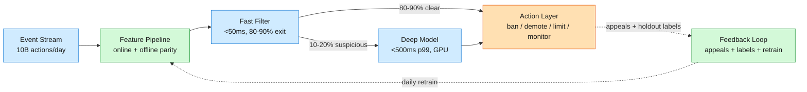
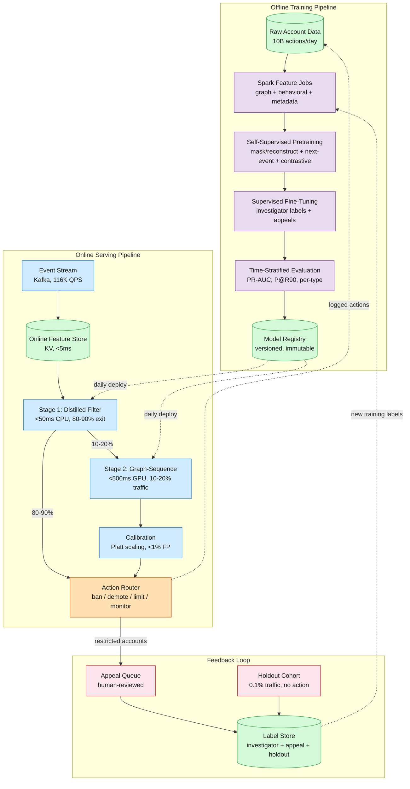
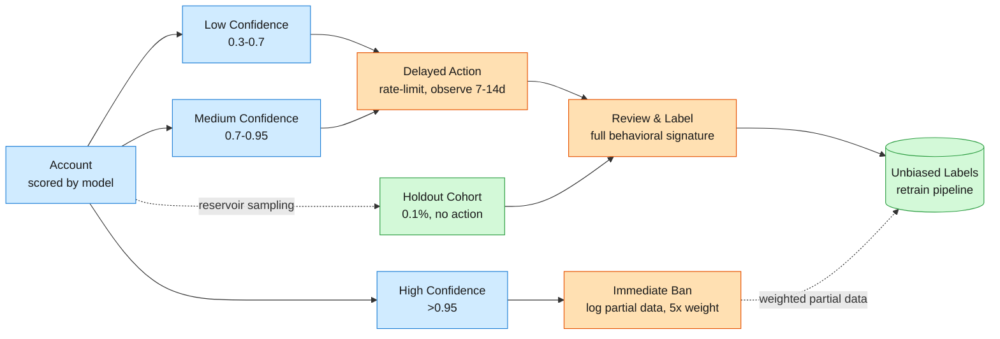

We run a social platform at 500M DAU — roughly 10 billion user actions per day across posts, follows, likes, messages, and friend requests.

<!--more-->
## 1. Problem & ML framing

We run a social platform at 500M DAU — roughly 10 billion user actions per day across posts, follows, likes, messages, and friend requests. Bots are accounts that automate these actions at scale: fake accounts pumping spam links, engagement farms inflating follower counts, coordinated influence operations, and credential-stuffing scripts probing stolen passwords. Without defenses, bot actions would make up over 50% of platform activity; simple IP rate limits and account-age heuristics already cut that down to about 1%, but the remaining 1% is the hard adversarial core. Those bots adapt every time we ship a model update.

The ML task is **adversarial binary classification**: given an account's behavioral history, network position, content signals, and metadata, output a probability that it's a bot. A spam post is the symptom, but the account producing it is the disease, so behavior assessment carries more signal than any single piece of content. The **business objective** is to minimize bot impact on legitimate user experience, subject to a <1% false-positive guardrail on account restrictions. The **ML objective** the model actually optimizes is exposure-weighted recall at that fixed precision — catch as many high-impact bot actions as possible while holding false positives on real accounts under the guardrail, because getting banned when you're real drives churn just as fast as getting spammed.

## 2. Requirements

**Functional**

- FR1: Detect bots at registration — evaluate metadata, device fingerprint, and early signals before first action.
- FR2: Real-time per-action detection — classify within latency budget, return bot probability and top features.
- FR3: Re-evaluate on behavioral drift — catch compromised accounts that flip to bot-like patterns.
- FR4: Detect multiple bot types — spam, fake accounts, engagement farms, credential stuffing, influence ops.
- FR5: Support appeals with human review — contested decisions feed back as high-quality training labels.
- FR6: Maintain holdout cohorts — reserve 0.1% of traffic for unbiased label collection and drift monitoring.

**Non-functional**

- NFR1: Heavy model p99 < 500ms; lightweight filter < 50ms — keeps actions snappy for real users.
- NFR2: Scale to 10B+ actions/day (~116K QPS steady-state) without degrading detection under load.
- NFR3: Adversarial adaptation — retrain within 24h of detected drift so defenses move faster than attackers.
- NFR4: 99.9% availability — degraded mode falls back to the rule pre-filter, never open-gate.
- NFR5: <1% false positives on account restrictions — measured via appeal overturn rate and holdout review.

**Out of scope:** content-level moderation (separate system), payment fraud detection, account recovery UX, regulatory reporting, CAPTCHA/challenge infrastructure.

## 3. Metrics

**Offline**

- **PR-AUC** (primary): Precision-Recall AUC for imbalanced data where bots are <1% of accounts. ROC-AUC is misleading — a model scoring 99.9% true negative rate looks great on ROC but catches nobody.
- **Precision@Recall90**: Precision at the operating point where we catch 90% of bots. Directly maps to the FP guardrail — if precision drops below 99% at Recall90, the model can't auto-enforce.
- **Impact-weighted PR-AUC**: Weight each bot by its follower count or message volume. A bot with 100K followers that spams 50K users costs more than one with 10 followers. Aligns offline evaluation with the business objective.
- **Time-stratified validation**: Train on January–March, validate on April, test on May. Random splits overestimate performance because future bots differ from past ones — the adversarial nature makes time-based evaluation mandatory.

**Online**

- **Bot interactions per legitimate user** (north star): Average number of bot-originated actions a real user encounters per day. A drop from 5.2 to 1.7 means users see 67% less spam — regardless of how many total bots exist.
- **User reports (spam/bot)**: Proxy metric tracked weekly. Reports spike when a new bot wave gets through; they drop when detection catches up.
- **Appeal success rate**: Percentage of restricted accounts that successfully appeal. Held below 1% at the FP guardrail. A rising appeal rate is the earliest false-positive warning signal.

**Guardrail:** <1% false positives on account restrictions, enforced by the calibration layer and verified via holdout-cohort manual review.

**Back of the envelope**

- 500M DAU × 20 actions/day → 10B actions/day → ~116K QPS steady-state
- Two-stage cascade: 80% filtered at Stage 1 → ~23K QPS hit the heavy model → ~12 GPU instances at 2K QPS/GPU
- 1% bot prevalence → ~100M bot actions/day → catching 90% prevents 90M harmful actions/day
- Investigator labels: 200/week × 52 weeks → ~10K gold labels/year → active learning and pretraining are mandatory

## 4. Data

**Sources**

- **Investigator labels (hundreds/week, gold standard):** The internal trust & safety team manually reviews accounts — the highest-quality signal. Used for evaluation and supervised fine-tuning. Too scarce to train from scratch (10K/year vs. the millions a deep model needs).
- **User reports (millions, noisy):** When users report an account as spam or fake, that is a weak positive label. Biased toward accounts that reach popular users. Useful as a semi-supervised signal, down-weighted in the loss but providing scale.
- **Appeal outcomes (negative labels for FP):** A restricted account that successfully appeals is a confirmed false positive — the model's own mistakes, and the most valuable labels. A denied appeal is a confirmed positive.
- **Network-based (IP clustering, behavioral similarity):** Accounts sharing IP ranges, device fingerprints, or temporal patterns likely belong to the same bot farm. Not labels themselves, but strong clustering signals for semi-supervised learning and anomaly detection.

**Labeling strategy**

Active learning with uncertainty sampling: the model surfaces edge-case accounts where it is least confident (score near 0.5) and routes them to the investigator queue. This maximizes information gain per human hour — labeling obvious bots or obvious humans teaches the model nothing new.

**Synthetic data**

A conditional GAN generates synthetic bot behavior sequences. Train the GAN on confirmed bot accounts, condition on bot type, and generate plausible-but-novel behavioral patterns to augment the graph and sequence branches during pretraining. Risk: synthetic data drifts from the real adversarial distribution over time, so we regenerate weekly from fresh confirmed-bot data.

**Class imbalance**

Bot prevalence is <1% after heuristic pre-filters. A naive model predicting "human" for everything achieves >99% accuracy and zero value. Solutions: hard-negative mining (sample the borderline humans that confuse the model most), class-weighted focal loss (weight positives 100:1, γ=2), and balanced batch construction (30/70 bot/human ratio — not 50/50, which over-corrects probability calibration).

**Splits**

Time-stratified: train on the oldest 70% of labeled accounts, validate on the next 15%, test on the most recent 15%. Never shuffle across time — future bots differ from past bots, and the model must prove it generalizes forward.

## 5. Features

**Activity patterns**

- Entropy of inter-action timing — humans have natural variance (sleep, meals, distraction); bots are clockwork-regular.
- Click precision and cursor movement — trackpad jitter vs. pixel-perfect automation.
- Session cadence: duration, actions-per-session, time-between-sessions over hourly, daily, and weekly windows.
- Burst detection: sudden spikes in posting, following, or messaging rate above the account's historical baseline.

**Content signals**

- Semantic diversity via embedding similarity — bots repost near-identical content across accounts; humans vary.
- Duplication detection via an ANN index — exact or near-duplicate text/images across accounts trigger a signal.
- Language quality: perplexity under a language model, character n-gram entropy, Unicode homoglyph detection.

**Network topology**

- Follower/following ratio — bots follow thousands and get followed by dozens; the reciprocal connection rate (how many follow back) is a strong signal.
- Clustering coefficient — bots in a farm cluster densely with each other but sparsely with the rest of the graph (anti-community detection).
- GraphSAGE embeddings (k=2, 128-dim) — inductively learned node representations that capture an account's structural role whether or not it was seen during training.

**Account metadata**

- Account age (hours since registration, log-transformed — the first 24 hours are the most informative).
- Verification status, auth method (email-only vs. phone-verified vs. OAuth), password-reset frequency.
- Device diversity: number of distinct devices and IP geolocations — legitimate users switch devices naturally; bots often stick to one.

**Real-time behavioral**

- Detection history: prior scores, prior enforcement actions, appeal history.
- Evasion patterns: account recreation after ban (matching device fingerprint or behavioral signature), gradual behavior shift toward normalcy.
- Appeal behavior: bots that appeal differ from humans that appeal — appeal text, timing, and persistence are signals.

**Feature store**

The same feature definitions serve training and inference. Online features live in a low-latency KV store (<5ms read). Batch features (graph embeddings, historical aggregates) are computed daily via Spark and backfilled. Streaming features (last-hour action counts, session state) are updated via Kafka Streams. A feature registry enforces type consistency and documents availability windows — some features are not computable for brand-new accounts.

**Temporal availability.** New accounts lack behavioral history, graph position, and content-diversity signals. The model handles this with learned default embeddings (one per feature group) and a binary "feature available" mask concatenated to the input, teaching the model to lean on metadata and device signals for accounts younger than 24 hours.

## 6. Model

**Baseline: logistic regression.** Trained on ~50 hand-engineered features (account age, follower ratio, post frequency, IP reputation). Catches ~70% of bots at 99% precision, runs in <1ms on CPU, no GPU. It serves as the fallback when the deep model is unavailable and as a sanity check that the complex model actually improves on a simple one.

**Advanced: two-branch architecture with cross-attention fusion.**

The model has two input branches that process complementary signals and then fuse through cross-attention:

**Graph branch (GraphSAGE).** k=2 hop neighborhood, 128-dim embeddings, relation-specific weight matrices (follow edges weighted differently from reply or mention edges). Neighbor sampling caps at 25 per hop so celebrity accounts with millions of followers don't blow up compute. GraphSAGE is inductive — new accounts get embeddings without retraining the whole graph. Pretrained via mask-and-reconstruct: randomly drop node attributes (age, country) and 30% of edges, then train the encoder to predict what was removed. This internalizes community structure, because bot farms cluster differently from organic friend groups.

**Sequence branch (bi-GRU).** Processes the account's last 200 events, each bucketed into 5-minute time slots. Event types (post, like, follow, login, device-switch, message) get learned embeddings concatenated with a timestamp-bucket embedding. A bidirectional GRU reads the sequence forward and backward, producing a 128-dim summary vector. A GRU is chosen over a transformer because behavioral sequences don't need full self-attention (a post followed by a like doesn't depend on a post 100 events earlier the way distant words depend on each other), a GRU is 3–5× cheaper to serve, and it overfits less on the limited investigator-labeled data. Pretrained via next-event prediction and session-split contrastive learning — two clips from the same account are positive pairs, encouraging the encoder to internalize the human temporal rhythms (sleep gaps, meal breaks, commutes) that bots can't easily fake.

**Cross-attention fusion.** The sequence branch queries the graph branch ("does anyone in my network cluster post with similar timing?") and the graph branch queries the sequence branch ("given my community structure, is this rhythm suspicious?"). Both attend to each other, producing a 256-dim fused representation that captures interactions between structure and behavior.

**MLP head.** 3-layer feedforward (256 → 128 → 64 → 1) with ReLU activations and dropout (0.3). Outputs a raw logit converted to a probability via sigmoid.

**Pretraining strategy (3 stages, label-free → supervised):**

| Stage | What | Data needed |
|---|---|---|
| 1. Self-supervised pretraining | Graph: mask/reconstruct node attributes and edges. Sequence: next-event prediction + session-split contrastive. | Billions of unlabeled accounts |
| 2. Contrastive alignment | Cross-attention head trained to maximize agreement between the graph and sequence embeddings for the same account, minimize it for different accounts. | Same unlabeled data |
| 3. Supervised fine-tuning | Freeze the graph and sequence encoders (first 80% of layers), fine-tune the fusion head and MLP on investigator labels. Calibrate with Platt scaling. | ~5K investigator labels |

**Loss function.** Weighted binary cross-entropy. The sample weight is user exposure (follower count, capped at 10K to keep celebrity-bot edge cases from producing runaway gradients). A bot with 100K followers spamming half of them harms 50K real users, and the loss should reflect that — this directly ties the model's optimization objective to the business metric (bot interactions per legitimate user).

**Two-stage serving funnel.**

| Stage | Model | Latency | Traffic | Hardware |
|---|---|---|---|---|
| Stage 1: Lightweight filter | Distilled student — a 3-layer MLP trained via teacher-student distillation from the heavy model, on hand-engineered features only. | <50ms CPU | 100% of actions (~116K QPS) | CPU, horizontally scaled |
| Stage 2: Heavy model | Full GraphSAGE + bi-GRU + cross-attention, triggered only when Stage 1 scores above threshold. | <500ms p99 GPU | 10-20% of actions (~12-23K QPS) | GPU (batched) |

The student is trained by knowledge distillation: the heavy teacher scores millions of accounts and the student learns to reproduce those scores from lightweight features alone. The threshold is tuned so the student reaches >99.5% recall on the teacher's positives, meaning <0.5% of bots slip through Stage 1. The remaining 80–90% of traffic exits Stage 1 as "clear human" and never touches GPU inference. That cascade is what makes the economics work: running the full model on all traffic would cost roughly 10× the GPU spend of the two-stage funnel.

## 7. Architecture

**Offline training pipeline.** Pretraining runs weekly on billions of unlabeled accounts — Spark jobs compute graph features and behavioral sequences, then distributed training runs on 32× A100 GPUs for ~12 hours per stage. Supervised fine-tuning runs daily on the latest investigator labels (~50–100 new labels/week from active learning, plus accumulated appeal outcomes). Evaluation on time-stratified holdout sets produces PR-AUC, Precision@Recall90, and per-bot-type breakdowns. If eval metrics improve and calibration holds, the model is registered (immutable, versioned), shadow-deployed to 1% of traffic for 24h, and promoted only if online metrics don't regress.

**Online serving pipeline.** Every user action hits the event stream (Kafka), which triggers a feature fetch from the online feature store. The lightweight filter scores the action in <50ms. Below threshold, the action proceeds normally. Above it, the account's full graph and sequence features are assembled and the heavy model scores it. The calibrated probability routes to the action layer: ban (>0.95, auto-restrict), demote (0.7–0.95, limit reach, require phone verification), limit (0.3–0.7, rate-limit actions, reduce visibility), or monitor (0.1–0.3, log for review, no user-visible action). Below 0.1, no action.

**Feature store.** One feature registry, two serving paths. Online features (last-hour counts, session state, device-fingerprint matches) live in a KV store with a 5-minute TTL, updated via Kafka Streams. Batch features (graph embeddings, historical aggregates, community-detection labels) are computed daily via Spark and loaded into the same store. Training reads from logged features — the exact values served at inference time — which removes the single biggest source of training-serving skew. A feature-version change triggers a backfill that recomputes historical values to match the new definition.

**Retraining cadence.** Daily incremental fine-tuning on new investigator labels and appeal outcomes (15 minutes on 4× A100). Weekly full pretraining on the expanded unlabeled corpus (12 hours on 32× A100). Adversarial drift can trigger emergency retraining: if the online bot-interaction rate spikes 2× above baseline and holds for 30 minutes, an on-call engineer is paged and the daily fine-tune runs immediately on the most recent 24h of data.

## 8. Deep dives

### DD1: Calibration & threshold management — keeping <1% FP across model migrations

**Problem.** A raw model score of 0.8 does not mean "80% chance this account is a bot." Neural networks trained with BCE loss produce uncalibrated scores — they rank well (bots score higher than humans) but estimate probabilities badly. When you deploy a new model version, the score distribution shifts — last month's 0.7 might be this month's 0.5 — even though the underlying bot population hasn't changed. If the threshold stays fixed at 0.5, precision drifts. The <1% FP guardrail requires the *actual* false-positive rate to stay at or below 1%, not the model's self-reported confidence.

**Option A: Platt scaling.** Fit a logistic regression on top of the raw scores using a held-out calibration set with ground-truth labels. Maps raw score `s` to `P(bot) = 1/(1 + exp(A·s + B))`. Simple, one training step, works well when the score distribution is roughly sigmoidal. Fails when miscalibration varies across score ranges (overconfident at high scores, underconfident at low).

**Option B: Isotonic regression.** Learn a non-parametric monotonic mapping from scores to probabilities — a piecewise-constant function minimizing Brier score on the calibration set. No shape assumptions, captures arbitrary miscalibration, but needs hundreds of positives per bin and is unstable at the tails.

**Option C: Histogram binning with online updates.** Divide scores into 20 equal-width bins. For each bin, track a running count of confirmed positives and negatives from the appeal queue and holdout cohort; the calibrated probability for bin `i` is `positives_i / (positives_i + negatives_i)`, updated every 5 minutes from a sliding 7-day window. Parameters are running sums, so no full retrain is needed. It absorbs distribution shift because it is always computed from recent data, but it has a cold start for score ranges a new model version hasn't populated yet.

**Decision.** Histogram binning with online updates, falling back to Platt scaling for cold bins. The online approach is the only one that genuinely holds the FP guardrail across model migrations, because it is continuously measured against ground truth rather than assumed from a static set. For bins with fewer than 50 confirmed labels, we fall back to Platt parameters fitted on the closest well-populated bin, decaying the fallback weight linearly as the bin accumulates its own labels.

**Rationale.** Calibration is a continuous measurement problem, not a one-time training step. When a new representation ships, the raw score distribution can move ~30% in the first week — not because bots changed, but because the model's internal geometry did. Fixed Platt parameters from the training set drift outside the FP guardrail within roughly 48 hours; the online histogram absorbs the shift automatically because every bin is re-estimated from the last 7 days of human-reviewed decisions.

**Edge cases.** A brand-new bot type has zero historical positives, so every bin is cold for that pattern. We bootstrap by treating the first 100 confirmed positives as a calibration mini-batch, fit Platt scaling on them, and promote to histogram binning once each bin has ≥50 labels. Scores outside the observed calibration range (a model suddenly emitting 0.99 for accounts it used to score 0.7) are clamped to the nearest calibrated bin, and an alert fires if >1% of traffic lands in uncalibrated territory.

> [!TIP]
> **The calibration layer is the only place where "probability" means something.** Everywhere else in the pipeline, scores are rankings. Calibration is where a ranking becomes a business decision that satisfies the legal and trust & safety teams.

### DD2: Anomaly detection for unknown bots

**Problem.** The supervised model catches bots that look like bots it has already seen. Adversaries innovate — a new farm using a never-before-seen behavioral pattern sails past the classifier until enough of them are reported and labeled, which takes days to weeks. A complementary system has to flag anything weird, even when it can't say *why* it's weird, and route those accounts to human review before they cause damage.

**Option A: Isolation Forest.** An ensemble of random trees on a feature subset; the anomaly score is the average path length from root to leaf, since anomalies sit in sparse regions and isolate quickly. Sub-linear training, interpretable (you can trace which features drove the anomaly), no distributional assumptions. Weakness: high-dimensional behavioral features dilute the signal — the more dimensions, the less sparse any single point looks.

**Option B: Autoencoder reconstruction error.** Train an autoencoder to compress and reconstruct behavioral feature vectors; the anomaly score is reconstruction error, since bots that match no learned pattern of normal behavior reconstruct poorly. Captures non-linear feature interactions that trees miss, but needs separate training and can overfit to "normal," failing to generalize to new normals (a feature launch, holiday behavior, a viral event).

**Option C: Ensemble (Isolation Forest + autoencoder).** Run both and take the max anomaly score, then filter by business harm: an account that is weird but has 3 followers and has never messaged anyone is a curiosity, not a threat; one that is weird *and* follows 500 people/day *and* posts identical links gets escalated.

**Decision.** Ensemble with harm-gating. The isolation forest runs on the lightweight feature set (metadata + activity, ~50 features) in <5ms. If the score is above threshold *and* the account has caused measurable user impact (≥10 messages, ≥50 follows, or ≥1 user report), it is escalated to the autoencoder, whose reconstruction error on the full behavioral vector is the final anomaly signal. A high supervised score OR a high anomaly-with-harm score triggers escalation.

**Rationale.** Anomaly detection works as a complementary signal to supervised classification, not a replacement: it catches novel attacks whose interaction patterns match no known legitimate behavior, precisely the accounts the supervised head has never been trained on. Gating on harm keeps the review queue finite — novelty alone is cheap to produce, so the harm filter is what makes the signal actionable.

**Edge cases.** Legitimate viral behavior looks anomalous — an account that suddenly gains 50K followers because a post went viral has an isolation-forest score through the roof. The harm gate helps (viral accounts aren't sending identical spam links), but verified and high-history accounts need explicit allowlisting. A new product feature spikes anomaly scores globally: when a new interaction type launches, every early adopter looks anomalous until the autoencoder retrains on the new distribution.

### DD3: Training-serving skew & positive-suppression bias

**Problem.** This is the most insidious feedback loop in bot detection. When the model correctly bans a bot, that account disappears from future training data. The bot never exhibits its full behavioral pattern — you banned it at the spam-posting stage, so the model never learns what coordinated follow-farming looks like from that account. Over time, training data becomes enriched for benign-looking behavior and depleted of the very signals that would catch the next wave. The model learns "accounts that post and follow aggressively are already banned, so remaining active accounts that do this are probably human." That is wrong, but it is what the data teaches.

This is **positive-suppression bias**: the more effective your detection, the more you suppress positive examples from future training, and the weaker your model becomes at detecting the next wave.

**Option A: Holdout cohorts.** Reserve ~0.1% of traffic from all enforcement. These accounts — human and bot — use the platform normally and accumulate full behavioral signals, and a dedicated team labels the cohort weekly for an unbiased sample of the current bot population. Gold-standard unbiased labels and a direct read on model recall, but at a cost: 0.1% of bots keep spamming real users during the window — at 10B actions/day, ~10M harmful actions/day deliberately allowed through.

**Option B: Strategic delayed action.** Instead of an immediate ban, apply progressive soft enforcement: reduce visibility (content shown only to the account itself), rate-limit to 10 actions/hour, disable messaging. The bot keeps operating in a sandbox where its data is collected but it can't harm users; after a 7–14 day window, review the full signature and either hard-ban or release. No user harm during observation and full behavioral data, but sophisticated bots detect the soft enforcement and change behavior.

**Option C: Importance-weighted training with imputation.** Treat banned accounts as censored data — train on the partial history they did exhibit but up-weight them in the loss to compensate for early removal, imputing the "would-have-happened" behavior from a model trained on unbanned holdout accounts. Uses all existing data with no live bots in the wild, but the imputation is only as good as the holdout data behind it.

**Decision.** Combine holdouts and delayed action, stratified by confidence. Low-confidence bots (0.3–0.7) get delayed action — they're the ones we're least sure about, so more behavioral data has the highest information value, and they're rate-limited to cap harm. High-confidence bots (>0.7) get immediate action, but their partial behavioral data is logged and weighted 5× in the loss. The 0.1% holdout provides an unbiased calibration signal that neither strategy is distorting the model's view of bot prevalence.

**Rationale.** De-amplifying suspected bots rather than deleting them buys weeks of behavioral data before a final decision, and explicitly budgeting a holdout back from enforcement is the only way to measure what the model is missing. Both carry a documented user-harm cost, so stratifying by confidence — soft enforcement where uncertainty is highest, immediate action with weighted logging where it is lowest — is the practical compromise between recall on the next wave and harm today.

**Edge cases.** A farm that detects soft enforcement and self-destructs (deletes and recreates accounts) defeats delayed action — the observation window is lost when the bot goes dark. Countermeasure: randomized enforcement timing, so a 0.6-scored account is de-amplified after a random 1–24h delay, making systematic enforcement harder to detect. Flash-mob campaigns that appear and vanish within hours give neither strategy time to work; those rely on the real-time anomaly path.

> [!TIP]
> **Positive-suppression bias is why you can't just "train on all the data."** Every bot you successfully catch makes your next model a little worse. Holdouts and delayed action aren't optimizations — they are survival requirements for any adversarial ML system.

### DD4: Monitoring & drift — detecting when the world has changed

**Problem.** Bot detection is non-stationary. Attackers adapt, new bot types emerge, and platform changes (a new interaction type) redraw what "normal" behavior looks like. If the model silently degrades because the data distribution shifted, you won't know until user reports spike — meaning users have already been harmed. You need leading indicators that catch drift before users do.

**Option A: Time-stratified evaluation sets.** Maintain fixed validation sets from different periods (a January cohort, a February cohort) and report metrics on each separately. If Precision@Recall90 is 0.97 on the January cohort but 0.82 on the March cohort, the model has degraded specifically on recent bots even when the aggregate looks fine. Directly measures what matters and needs no statistical test, but requires ongoing investigator investment to keep labeled sets current.

**Option B: Feature distribution drift detection.** Track the Population Stability Index (PSI) for each feature between the training and current production distributions; PSI > 0.25 on any feature triggers an alert. Catches drift at the feature level before it reaches model output — you can see "average account age at first post" fall from 2 hours to 15 minutes — but feature drift doesn't always mean degradation, since some shifts (organic growth in a new geography) are benign.

**Option C: Model output monitoring.** Track the daily distribution of model scores; a >2σ shift in the mean or a >20% change in the fraction scoring above 0.7 triggers an alert. Simple and directly measures model behavior, but reacts after the fact — by the time the score distribution has moved, the model has already been deciding on shifted data.

**Decision.** All three, layered. Feature-PSI monitoring runs hourly as the fastest signal and triggers a review, not automatic retraining. Time-stratified evaluation runs with every training cycle (daily) as the gating check: if the latest slice shows >10% degradation in Precision@Recall90, the new model is blocked from promotion. Output-distribution monitoring runs continuously; a sudden shift pages on-call and triggers emergency retraining.

**Rationale.** Bot detection experiences every canonical form of distribution shift at once — attackers changing behavior is concept drift, growth in a new country is covariate shift, and detection suppressing positives is selection bias — so no single monitor suffices. Layering them catches each at a different latency/accuracy trade-off, and a red-team dataset (internally generated adversarial accounts with known labels) gives a clean recall signal that is independent of whatever the production distribution is doing.

**Edge cases.** A global event (a World Cup final, an election night) causes a massive but legitimate behavior shift — millions posting simultaneously at unusual hours — so feature PSI and output distributions both move. That is not drift. Countermeasure: suppress drift alerts during known high-traffic events and require sustained drift (≥3 consecutive hourly windows) before triggering retraining. Red-team recall stays the ground truth: if it drops, that is genuine degradation regardless of the production distribution.

## 9. References

1. [GraphSAGE — Inductive Representation Learning on Large Graphs (NeurIPS 2017)](https://arxiv.org/abs/1706.02216)
1. [Isolation Forest — Liu, Ting, Zhou (TKDD 2012)](https://dl.acm.org/doi/10.1145/2133360.2133363)
1. [Fraudar — Bounding Graph Fraud in the Face of Camouflage (KDD 2016)](https://dl.acm.org/doi/10.1145/2939672.2939774)
1. [LinkedIn — Active Defense Against Social Engineering (KDD 2019)](https://dl.acm.org/doi/10.1145/3336191.3372114)
1. [Meta — Fake Account Detection at Facebook (SIGMOD 2017)](https://dl.acm.org/doi/10.1145/3035918.3064019)
1. [Instagram — Spam Detection with Deep Learning + GBDT (SIGIR 2019)](https://dl.acm.org/doi/10.1145/3331184.3331267)
1. [Twitter — Detecting Spammers with Deep Learning (KDD 2015)](https://dl.acm.org/doi/10.1145/2783258.2783309)
1. [Meta AI — Fighting Spam with Graph Neural Networks](https://ai.meta.com/blog/)
1. [Meta Engineering — Calibrating ML Models for Trust & Safety](https://engineering.fb.com/)
1. [Chip Huyen — Designing Machine Learning Systems (O'Reilly 2022)](https://www.oreilly.com/library/view/designing-machine-learning/9781098107963/)
