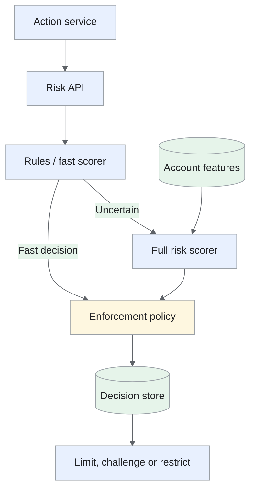
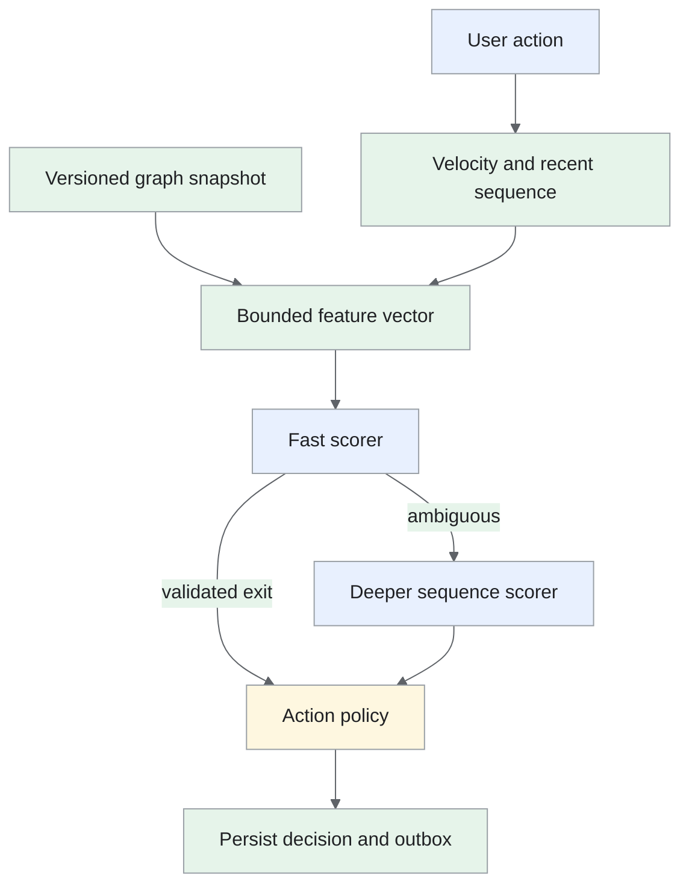

Design of an account-risk service that detects abusive automation and limits its impact on legitimate users.

<!--more-->

## Problem

Spam accounts, engagement farms and compromised accounts can automate actions that reach many users. Simple rate limits stop obvious bursts, but coordinated activity can resemble ordinary behavior at the individual-account level.
The service combines recent actions, account relationships and reviewed evidence to assess risk. Enforcement is proportionate to the action and confidence: monitoring, rate limits, challenges, reduced reach or account restrictions. Authorized automation is distinguished from abusive automation.

## Requirements

### Functional requirements

- **Assess registrations and actions:** return a risk decision using signals available at that moment.

- **Re-evaluate accounts:** detect changes in behavior and coordinated activity.

- **Apply proportionate controls:** support limits, challenges, review and restrictions.

- **Support appeals:** preserve reasons and versions so reviewers can correct decisions.

- **Learn new patterns:** collect representative audits and targeted investigator labels.

Content-policy moderation, payment fraud and account-recovery interfaces are separate systems.

### Non-functional requirements

- **Scale:** assume 500M daily users and 10B actions/day.

- **Latency:** target p99 below 50ms for the fast check and below 500ms for explicitly gated full assessments.

- **Availability:** target 99.9%, with rules and bounded rate limits during model failures.

- **Quality:** target less than 1% false-positive account restrictions among independently reviewed legitimate accounts; track precision and recall separately.

- **Adaptation:** investigate drift promptly and target an evaluated update within 24 hours when mature labels support it.

- **Privacy:** restrict device/network identifiers, retain bounded histories and audit enforcement access.

## Back-of-the-envelope calculations

- `500M × 20 = 10B actions/day`, or about 116K/s on average.

- If 10–20% require a full assessment, the heavy path receives 12–23K/s before peak headroom. This fraction depends on the screening threshold.

- At an assumed 200 bytes/event, raw action logs add about 2TB/day before compression.

- At 200 gold labels/week, the investigator set grows by only about 10K/year. Reusable representations, targeted review and independent evaluation matter more than a large unverified model.

## Core entities

- **Action event:** an account action with stable identity and event time.

- **Feature snapshot:** recent counts, sequence and graph representations with availability/version metadata.

- **Risk assessment:** score and explanations from a particular model.

- **Enforcement decision:** action, expiry and policy version.

- **Review outcome:** a human judgment, including appeals and independent audits.

```protobuf
message ActionEvent {
  string event_id;
  string account_id;
  string action_type;
  string target_ref;
  Timestamp occurred_at;
}

message RiskAssessment {
  string assessment_id;
  string account_id;
  string action_id;
  float risk_score;
  string model_version;
  string feature_version;
  repeated string reason_codes;
}

message EnforcementDecision {
  string account_id;
  string decision_version;
  string action; // Monitor, limit, challenge or restrict
  Timestamp expires_at;
  string policy_version;
}

message ReviewOutcome {
  string assessment_id;
  string judgment;
  string selection_method; // Audit, appeal or targeted review
  Timestamp available_at;
}

```

Enforcement versions prevent a delayed assessment from reinstating an outdated restriction. Appealed and audited labels retain their distinct selection provenance.

## API

```yaml
POST /v1/account-risk/assessments:
  headers:
    Idempotency-Key: action-123
  body:
    account_id: account-7
    action_id: action-123
    action_type: send_message
  response:
    assessment_id: risk-123
    action: challenge
    reason_codes: [unusual_activity]
    decision_version: "8"

POST /v1/account-risk/reviews:
  body:
    review_id: review-123
    assessment_id: risk-123
    judgment: legitimate

GET /v1/account-risk/accounts/{account_id}/decision:
  response: current action, expiry and version

```

Internal callers authenticate and authorize the requested account/action. User-facing responses avoid exposing detailed detection signals; reviewers receive the permitted audit evidence.

## High-level design

Fast rules and a lightweight model evaluate every relevant action. Uncertain cases receive a deeper account assessment, and a versioned policy converts risk into an enforceable result.


```mermaid
%%{init: {'theme':'base','themeVariables':{'primaryColor':'#e8f0fe','primaryTextColor':'#202124','primaryBorderColor':'#9aa0a6','lineColor':'#5f6368','secondaryColor':'#e6f4ea','tertiaryColor':'#fef7e0','actorBkg':'#e8f0fe','actorBorder':'#9aa0a6','actorTextColor':'#202124','noteBkgColor':'#fef7e0','noteTextColor':'#202124','noteBorderColor':'#9aa0a6','signalColor':'#5f6368','signalTextColor':'#202124','labelBoxBkgColor':'#fef7e0','labelBoxBorderColor':'#9aa0a6'}}}%%
flowchart TB
    A["Action service"] --> API["Risk API"]
    API --> FAST["Rules / fast scorer"]
    FAST -->|"Uncertain"| FULL["Full risk scorer"]
    FAST -->|"Fast decision"| POLICY["Enforcement policy"]
    FULL --> POLICY
    F[("Account features")] --> FULL
    POLICY --> D[("Decision store")]
    D --> OUT["Limit, challenge or restrict"]
classDef request fill:#e8f0fe,stroke:#9aa0a6,color:#202124;
classDef data fill:#e6f4ea,stroke:#9aa0a6,color:#202124;
classDef control fill:#fef7e0,stroke:#9aa0a6,color:#202124;
class A,API,FAST,FULL,OUT request;
class F,D data;
class POLICY control;

```
## Storage

- **[Kafka](/designs/tech-kafka/):** deduplicated action/report events keyed by account. Event-time aggregation maintains recent counts and sequence windows.

- **[Redis](/designs/tech-redis/):** hot counters, bounded histories and feature snapshots. Include timestamps and missing-feature masks; use approved defaults for new accounts.

- **Partitioned graph/feature storage:** adjacency lists and precomputed graph representations keyed by account/version. Object storage retains immutable graph/training snapshots.

- **[PostgreSQL](/designs/tech-postgresql/):** enforcement state, idempotency records, appeal/review provenance and policy configuration. Commit decisions with an outbox event for downstream consumers.

- **Parquet/model registry:** time-correct training data, calibration sets and compatible model bundles, with scoped access and retention.

Network/device indicators are risk signals rather than proof of abuse. Shared networks, accessibility tools and legitimate automation need explicit evaluation slices.

## From request to response

### Action assessment flow

```mermaid
%%{init: {'theme':'base','themeVariables':{'primaryColor':'#e8f0fe','primaryTextColor':'#202124','primaryBorderColor':'#9aa0a6','lineColor':'#5f6368','secondaryColor':'#e6f4ea','tertiaryColor':'#fef7e0','actorBkg':'#e8f0fe','actorBorder':'#9aa0a6','actorTextColor':'#202124','noteBkgColor':'#fef7e0','noteTextColor':'#202124','noteBorderColor':'#9aa0a6','signalColor':'#5f6368','signalTextColor':'#202124','labelBoxBkgColor':'#fef7e0','labelBoxBorderColor':'#9aa0a6'}}}%%
sequenceDiagram
  participant A as Action service
  participant R as Risk API
  participant F as Feature store
  participant M as Fast and deeper scorer
  participant D as Decision store
  rect rgb(232, 240, 254)
    A->>R: Action ID and action context
    R->>F: Read bounded request-time features
    F-->>R: Features, age and missingness
    R->>M: Run fast score; escalate uncertain band
    M-->>R: Calibrated risk evidence
  end
  rect rgb(254, 247, 224)
    R->>D: Commit action policy and decision version
    D-->>R: Committed result
    R-->>A: Allow, challenge, review or restrict
  end

```

The action service applies the committed policy result for the same action ID. The API limits feature and inference work before committing; retries reuse the action identity, and a deeper assessment follows the action-specific waiting or challenge policy.

### Evaluating an action

1. Authorize the action service, deduplicate the action ID and load the current enforcement version.

2. Read fast features such as recent action counts, account age and approved network reputation. Record feature timestamps and availability.

3. Apply rules and the lightweight scorer. A clear result uses the fast policy; an uncertain or high-impact action requests a full assessment.

4. Fetch the bounded recent-event sequence and precomputed graph embedding. Batch full scoring with a deadline.

5. Apply calibrated risk and action-specific policy. Persist the decision and publish its version before the caller applies it.

6. Record the serving snapshot and later reviewer outcomes.
The heavy path has its own latency budget. Low-risk actions can continue under existing limits while a background assessment completes; a policy-gated action waits or receives a challenge. Large graph traversal on every action would make latency unpredictable, so serving uses prepared representations.

### Handling drift or compromise

Streamed features detect departures from the account's recent baseline. A trigger schedules re-assessment using current evidence. A previously trusted account still receives compromise checks; verification is a feature, not a permanent bypass.

### Handling dependencies and retries

Use the existing enforcement state and approved fallback rules when the feature/model service is unavailable. Apply bounded protective limits to high-impact actions. Retries reuse the action ID; inconsistent payloads conflict, and transient failures remain distinguishable from confirmed restrictions.

## Deep dives

### Which signals and models should run synchronously?

Timing/count features detect individual bursts; graph and sequence representations detect patterns across actions and accounts.

- **Rules or logistic regression:** Use current counts and account attributes in a small, explainable scorer. Serving cost is low, but fixed rules and simple feature combinations can miss coordinated behavior spread across accounts.

- **Full graph and sequence scoring for every action:** Run the richest available model on every request. Detection has consistent access to deeper evidence, but graph-feature retrieval and long sequences consume latency and capacity even for clear low-risk actions.

- **Bounded cascade — recommended:** Apply fast checks to all actions and deeper scoring to the uncertain or high-impact subset, using prepared graph features. This concentrates expensive inference where it matters; early exits need separate recall validation and sudden ambiguity can overload the heavy path.

High action volume and proportionate enforcement favor a bounded cascade. We accept two scoring paths and monitor the escalation rate, because the fast path's missed-abuse rate and the heavy path's capacity jointly determine the result.
[GraphSAGE](https://arxiv.org/abs/1706.02216) provides inductive graph representations. Cap neighbor sampling and retain the graph's event-time/version context; an embedding for a new account still needs available attributes or neighbors.
A GRU or transformer encodes recent events and elapsed-time features. Choose the simpler model based on quality and measured serving cost. Supervised distillation can train a lightweight student, but teacher agreement is distinct from recall on independently labeled abuse.
**Assemble a bounded action-time feature vector**
The synchronous path reads permitted account attributes, short-window velocity, a capped recent-event sequence and prepared graph features. It pins their schema/version and supplies age/missingness, then runs the fast scorer. Only the ambiguous band reaches the deeper model.


```mermaid
%%{init: {'theme':'base','themeVariables':{'primaryColor':'#e8f0fe','primaryTextColor':'#202124','primaryBorderColor':'#9aa0a6','lineColor':'#5f6368','secondaryColor':'#e6f4ea','tertiaryColor':'#fef7e0','actorBkg':'#e8f0fe','actorBorder':'#9aa0a6','actorTextColor':'#202124','noteBkgColor':'#fef7e0','noteTextColor':'#202124','noteBorderColor':'#9aa0a6','signalColor':'#5f6368','signalTextColor':'#202124','labelBoxBkgColor':'#fef7e0','labelBoxBorderColor':'#9aa0a6'}}}%%
flowchart TB
    A["User action"] --> V["Velocity and recent sequence"]
    G["Versioned graph snapshot"] --> F["Bounded feature vector"]
    V --> F
    F --> S["Fast scorer"]
    S -->|ambiguous| M["Deeper sequence scorer"]
    S -->|validated exit| P["Action policy"]
    M --> P
    P --> D["Persist decision and outbox"]
classDef request fill:#e8f0fe,stroke:#9aa0a6,color:#202124;
classDef data fill:#e6f4ea,stroke:#9aa0a6,color:#202124;
classDef control fill:#fef7e0,stroke:#9aa0a6,color:#202124;
class A,S,M request;
class V,G,F,D data;
class P control;

```

A sequence includes event type and time since the preceding action, allowing rapid repeated behavior to differ from the same actions over a day. Cap events and neighbor-derived features so an attack cannot turn feature extraction into unbounded work.
Replaying an event updates counters once using its stable identity or an idempotent window computation. The offline training path reconstructs those counters at the original action time. A missing graph snapshot selects a separately evaluated fallback instead of an unexplained zero vector.

### How do thresholds avoid mistaken restrictions?

False-positive rate, precision and appeal-overturn rate use different denominators. A low appeal rate can coexist with many mistaken restrictions if few users appeal.

- **One fixed raw-score threshold:** Reuse one cutoff across releases. It is easy to deploy, but a changed score scale or cohort distribution can change restriction rates without any policy decision.

- **Online histogram updates:** Move thresholds using recent labeled score distributions. This reacts quickly with representative labels; sparse bins and selectively investigated accounts can make the update unstable or biased.

- **Versioned calibration and action thresholds — recommended:** Fit calibration on mature independent labels and set separate challenge, review and restriction bands. This makes user-impact costs explicit; it requires labeled support per cohort and reviewed threshold releases.

A challenge and a restriction have different user costs, so this design ties thresholds to actions rather than one raw score. We accept slower promotion where labels are sparse and use broader reviewed bands instead of an unsupported precise cutoff.

```text
False-positive rate = restricted legitimate accounts / all reviewed legitimate accounts
Precision = confirmed abusive restrictions / all reviewed restrictions
Appeal overturn rate = overturned appeals / all completed appeals

```
[Calibration methods](https://scikit-learn.org/stable/modules/calibration.html) map scores to estimated probabilities; they do not automatically guarantee an enforcement-quality target. Report uncertainty and category/cohort coverage with each threshold version.
Use wider review/challenge bands when labels are sparse. A new model receives its own calibration evaluation, shadow comparison and gradual rollout; rollback includes thresholds and feature definitions.
**Calibrate and choose a proportionate action**
Fit calibration on independent mature labels, then select thresholds for challenge, temporary restriction and review according to their costs. A challenge has different user impact from a permanent restriction, so each band needs its own quality/capacity evidence.
If 1,000 reviewed restrictions contain 900 abusive accounts, precision is 90%. If there were 50K reviewed legitimate accounts and 100 were restricted, false-positive rate is 0.2%. These quantities answer different questions and should appear together with cohort coverage.

```text
Model score → calibrator version → action threshold policy
                                     ↓
                         challenge / review / restriction

```

Persist action duration and expiry, with a version preventing an older event from extending or undoing a newer reviewed decision. Model rollout includes its calibration; threshold-only releases remain separate policy changes. Monitor successful challenge completion and investigator backlog so a wider uncertain band does not quietly degrade the user experience.

### How do we detect unfamiliar attacks?

A supervised model recognizes patterns represented in its labels. Novel coordination may look unusual without resembling a known attack.

- **Supervised detection alone:** Learn the patterns represented in reviewed abuse labels. It gives directly evaluated known-attack quality, but a genuinely new coordination pattern may remain outside the training coverage.

- **Anomaly-triggered restrictions:** Restrict accounts whose behavior differs sharply from the baseline. Novel attacks can stand out, but live events, new features and accessibility workflows can also be unusual, creating mistaken strong actions.

- **Anomaly-assisted investigation — recommended:** Combine novelty with observed harmful impact to prioritize review and proportionate temporary controls. This supports discovery without making novelty a gold label; investigator capacity and label turnaround limit response speed.

Bot detection needs a path for new attacks while preserving legitimate unusual activity. We accept an investigation delay and queue-management cost, with temporary controls chosen by impact instead of automatically escalating an anomaly score into a permanent restriction.
[Isolation Forest](https://scikit-learn.org/stable/modules/generated/sklearn.ensemble.IsolationForest.html) is a lightweight candidate for activity features; an autoencoder can add a separate sequence/feature anomaly signal. Compare their investigation yield before maintaining both.
A major event or accessibility workflow can look unusual. Evaluate those cohorts, apply proportionate temporary controls and seek independent labels. Product launches change feature schemas and baselines; they should be visible in drift diagnostics.
**Novelty becomes an investigation queue**
Build an anomaly score from bounded action-rate, sequence and relationship features. Compare it with observed product impact—for example, concentrated unsolicited messages—then prioritize review. Unusual activity alone remains insufficient evidence for a strong irreversible action.
A live event can raise action rates for legitimate users, while a coordinated attack may look ordinary per account but unusual across a graph. Review examples from both sides and use temporary proportionate controls under the declared policy.

```text
Unusual pattern + measurable impact → investigation priority
Independent review                → new labeled cohort
Validated candidate               → versioned production release

```

Record baseline/feature version and launch/event context in diagnostics. Cluster similar sequences to reduce duplicate investigations and preserve representative sampling for prevalence measurement. The anomaly detector's success metric is useful confirmed investigations per review cost, not agreement with its own outlier threshold.

### How do enforcement and scarce labels affect learning?

Restricted accounts have truncated future activity. Appeals and investigator queues sample selected accounts, so they cannot alone measure the whole population.

- **Survivors or denied appeals only:** Train from readily available post-enforcement outcomes. Collection is convenient, but restricted accounts have truncated activity and appeals represent a self-selected subset, so the dataset does not represent all actions.

- **Synthetic behavior or counterfactual imputation:** Generate attack scenarios or estimate outcomes hidden by enforcement. Coverage can improve for known mechanisms; simulation fidelity and unverifiable outcome assumptions limit population-quality claims.

- **Independent audits with targeted review — recommended:** Review stored action-time evidence across enforcement bands and retain selection probabilities. This supports quality estimates and difficult-case learning; audit labels, restricted evidence retention and reviewer work add cost.

The design must measure legitimate-user impact and missed abuse after it has intervened. Independent audits supply that missing coverage; synthetic tests remain useful for mechanisms, while their accepted limitation is that they do not estimate live prevalence.
Keep normal safety controls active during evaluation. Quarantined evidence and red-team test environments provide review data without deliberately allowing harmful activity. Red-team recall tests known scenarios; representative audits estimate current prevalence and missed abuse.
Treat reports as weak labels and appeal decisions as reviewed judgments with provenance. Group coordinated accounts and near-duplicate sequences across time-based splits. Historical features must have been available at the original assessment time.
**Preserve evidence across enforcement**
Capture the allowed feature snapshot and assessment before action. Later reviews and appeals append label revisions. A restricted account's future inactivity is censored by enforcement; it is not proof that the model prevented an independently verified attack.
Draw audits across action bands with logged probabilities, and keep targeted investigator cases distinguishable. Synthetic/red-team behavior tests known mechanisms but has different prevalence and fidelity from representative traffic.
Group connected attack accounts and near-duplicate sequences before splitting datasets to reduce leakage. Evaluate labels only after their availability/maturity cutoff. Retain human corrections through retraining and rollback; automatically regenerated labels must not overwrite their provenance.

### How do model updates stay reliable?

Monitor input distributions, missing features, scores, action rates and mature labeled quality by cohort. Distribution changes trigger investigation; they are not proof that quality has degraded.

- **Calendar-only retraining:** Release reproducible candidates on a fixed cadence. Operations are predictable, but abrupt compromise patterns may wait for the next labeled cycle.

- **Retrain on every drift alert:** Immediately train and promote from changing inputs. Adaptation is fast, but seasonal traffic or poisoned labels can produce an unnecessary or harmful model change.

- **Scheduled releases with reviewed incident response — recommended:** Use drift diagnostics to collect evidence and accelerate a validated candidate. This combines repeatable release gates with urgent response; investigation and mature labels take time and require retained compatible bundles.

A model update can change restrictions at scale. We accept the reviewed response time so diagnosis can distinguish a product event from actual degradation, and rollback can restore the corresponding scorer, features and thresholds together.
Block incompatible feature/model releases. Test timeouts, missing graph snapshots, duplicate events and restriction expiry. Track investigator backlog and challenge completion alongside bot impact. A rollback restores the approved scoring/policy bundle while preserving the audit trail and human corrections.
**Model failure and policy failure have different recovery**
A timeout or missing feature is an operational failure routed to the documented fallback. A harmful increase in legitimate restrictions is a quality incident that can require threshold or bundle rollback. Persist the fallback reason and decision version for both.
Test duplicate delivery of enforcement events, expired temporary restrictions, reordered human-review results and unavailable graph snapshots. Consumers apply conditional versions so stale events cannot recreate a restriction.
Use shadow comparisons to locate disagreements and latency costs, then reviewed cohort evidence to establish quality. Maintain previous-bundle workers for rapid new-request rollback. Track impact, challenge/review completion, fallback use and mature false positives separately; one aggregate “bot detection rate” cannot explain whether the system remains safe and useful.
