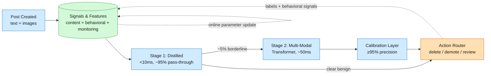
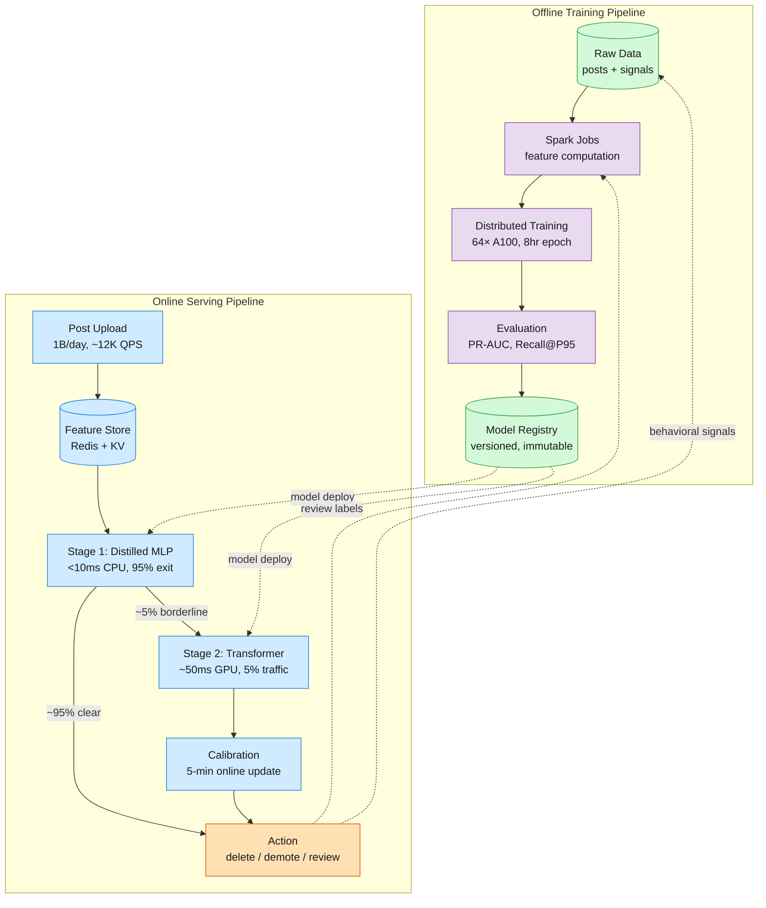
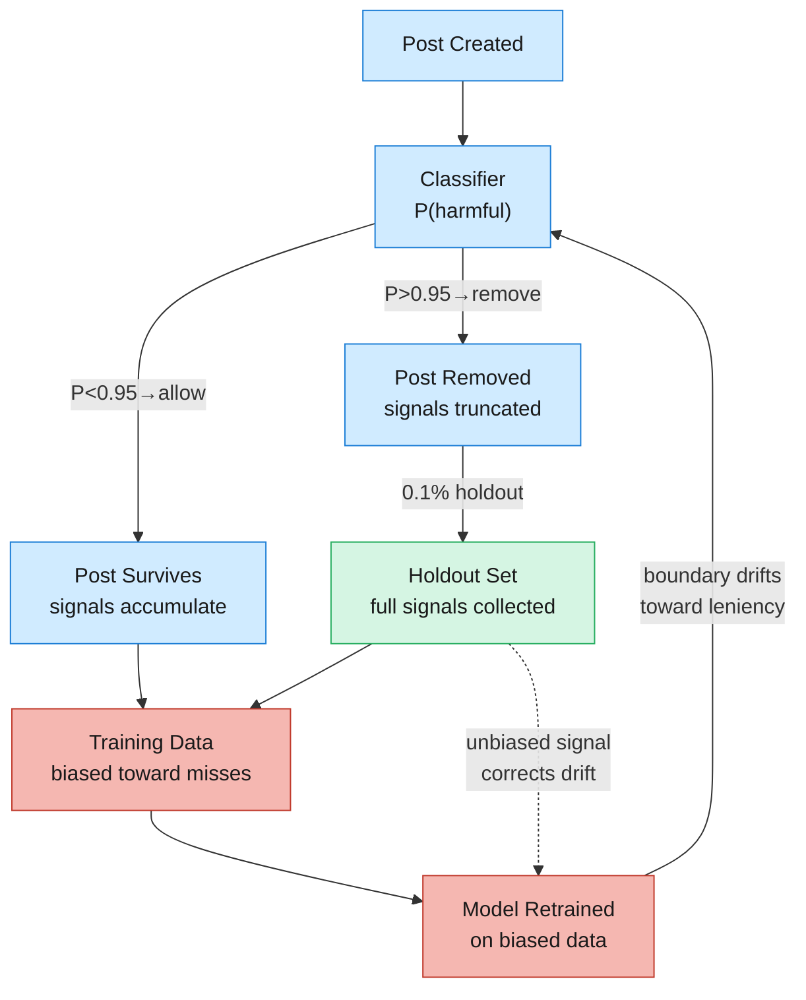

We're operating a social platform at Meta/Facebook scale — roughly 1 billion posts per day across text, images, and video, with harmful content making up less than 1% of that volume. At that scale even 0.1% means a million harmful posts daily.

<!--more-->
## 1. Problem & ML framing

We're operating a social platform at Meta/Facebook scale — roughly 1 billion posts per day across text, images, and video, with harmful content making up less than 1% of that volume. At that scale even 0.1% means a million harmful posts daily. The product problem is simple: users who encounter violent, hateful, or sexually explicit content leave the platform, advertisers flee, and regulators fine you. The business objective is to minimize the number of views of harmful content, subject to a precision guardrail of at least 95% for automated removal — because false positives (legitimate posts wrongly deleted) drive users away just as reliably as the toxic stuff does.

The ML task is **binary classification** over multi-modal input: given a post's text, attached images, and any accumulated behavioral signals, output a probability that the post is harmful. That probability then gets routed through a calibration layer enforcing the 95% precision constraint before an action layer decides whether to auto-delete, demote in feeds, or queue for human review. This framing matters because it directly maps the ML output to the business objective — higher recall at fixed precision means fewer harmful views — without the burden of defining and maintaining per-category taxonomies before you've shipped a working system. Per-category heads come later as an optimization, not the core definition.



## 2. Requirements

**Functional**

- FR1: Accept a post at upload time (text + images) and return a harm probability within the latency budget.
- FR2: Apply calibrated actions: auto-delete (score ≥ threshold with confidence), demote in feeds, or queue for human review.
- FR3: Re-evaluate a post when new behavioral signals arrive (views, reactions, reports) — classification must update as evidence accumulates.
- FR4: Provide per-post explainability: which modalities and features drove the harm score.
- FR5: Support multi-category harm classification (hate speech, violence, CSAM, nudity) as secondary output heads for policy transparency.

**Non-functional**

- NFR1: Scale to ~1B posts/day — ~12K QPS steady-state, ~35K QPS peak (Sunday morning upload spike).
- NFR2: End-to-end latency p99 under 200ms at post creation; Stage 1 under 10ms, Stage 2 under 50ms.
- NFR3: Precision ≥ 95% for auto-delete actions — calibrated per harm category, enforced by a dedicated calibration layer.
- NFR4: Model updates within 5 minutes of detected drift; full retraining cycle (shadow → A/B → promote) within 24 hours.

**Out of scope:** comment-level moderation, live-stream moderation, advertiser content policy, appeals management UX, reviewer tooling, regulatory reporting.

## 3. Metrics

**Offline**

- **PR-AUC** (primary): Precision-Recall AUC is the right summary for imbalanced data where the positive class is rare. ROC-AUC is misleading — a model with 99.9% true negative rate looks excellent on ROC but may catch zero harmful posts.
- **Recall@Precision95**: Recall at the operating point where precision is exactly 95%. This directly measures how many harmful posts we'd catch at the guardrail that governs auto-delete actions. Improving this metric means catching more harmful content without increasing false positives.
- **Impression-weighted PR-AUC**: Weight each post by its view count in the evaluation. A misclassification on a viral post (1M views) should penalize the model more than one on an obscure post (10 views). This aligns offline evaluation with the business objective of minimizing harmful views, not just harmful posts.
- **Per-category recall@precision**: Category-level breakdowns — CSAM targets near-100% recall (legal mandate), hate speech targets balanced precision/recall, political speech targets higher precision (chilling-effects concern).

**Online**

- **Views of harmful content** (north star): The number of user-impressions on posts later confirmed as harmful. This collapses prevalence and reach into a single number. Dropping from 500M to 200M harmful views/day is a 60% reduction in real user harm — regardless of how many total posts existed.
- **Proactive detection rate**: Percentage of eventually-removed harmful posts that the system caught before any user report. Measures independence from user reporting. YouTube reports 96.4% auto-flagging; Meta targets similar.
- **Valid appeal rate**: Percentage of removed posts that users successfully appeal. Measures false positive rate from the creator's perspective. Below 5% at 95% precision, roughly 18K false positives/day at 1B posts/day scale.
- **Time-to-detection p50/p95**: Minutes from post creation to removal. Shorter times mean fewer views accumulated before action.

## 4. Data

**Sources**

- **Supervised labeled set — 50K examples, balanced (50/50 harmful/benign):** Human annotators label posts according to content policy. Balanced because at <1% base rate, a random sample would produce ~500 positive examples — not enough to train on. 50K balanced means 25K harmful, 25K benign. This is our ground truth for evaluation and the core training signal.
- **Semi-supervised from user reports — 10M+ examples:** When users report a post, that's a noisy positive label. Reports are correlated with harm but biased: popular posts get more reports, coordinated reporting campaigns exist, and benign-but-controversial posts attract reports. We use these as weak labels — down-weighted in the loss function but providing scale that human annotation can't match.
- **Self-supervised from comments — billions of examples:** Train a model to predict comment text from post body+images. "This is disgusting" and "beautiful shot!" carry different signals. The resulting post representations capture semantic similarity that transfers to harm detection. This is how Facebook bootstrapped image models from Instagram hashtags before they had labeled data.

**Labeling strategy**

- Human annotation with 3-5 raters per post, label = ratio of raters marking harmful, threshold at 0.5 for binary positive.
- 5% QC re-review by senior raters to catch drift in annotation quality.
- Semi-supervised: user reports as noisy proxy labels, weighted by reporter reliability (reporters with history of accurate reports get higher weight).
- Self-supervised: predict comment embeddings from post embeddings — no labels needed.

**Class imbalance**

- Base rate <1% harmful. A trivial "always benign" classifier achieves >99% accuracy. During training we balance batches to 50/50 via oversampling the minority class. During evaluation we use PR-AUC, never accuracy.

**Splits**

- **Time-based split:** Train on months 1-2, validate on month 3, test on month 4. Random splitting is invalid here — harmful content patterns shift over time (COVID conspiracies become vaccine hesitancy becomes election misinformation), and a random split would leak future patterns into training, producing optimistic offline metrics that evaporate online.
- Point-in-time correctness: features used at training time t must have been available at or before t. No peeking at future behavioral signals.

**Data scale numbers**

- 50K human-labeled (25K harmful, 25K benign) — initial seed
- 10M+ user reports/month — weak labels for scale
- Billions of posts with comments — self-supervised pre-training
- ~12K QPS at steady state, ~35K peak
- Training pipeline: ~1TB of feature data per training epoch

## 5. Features

**Content features**

- **Text:** Concatenated post body, title, hashtags, and OCR-extracted text from images. Encoded via a pre-trained multilingual text encoder (DistilmBERT or XLM-RoBERTa for 100+ language coverage). The encoder produces a 768-dimensional dense vector. We don't hand-engineer bag-of-words or keyword lists — the market has moved past that and adversarial actors game keyword filters trivially.
- **Images:** Each image in the post passed through a ViT-B/16 encoder, producing a 768-dimensional patch-aggregated embedding per image. For posts with multiple images we take the element-wise max across image embeddings (permutation-invariant, handles variable image counts). We also compute perceptual hashes (PDQ, PhotoDNA) as fast-lookup features for known CSAM — no model needed for exact matches.

**Behavioral features**

- **Negative-reactions-per-view:** Angry reactions, hides, and reports divided by view count. Raw counts are dominated by popularity — a benign post with 10M views gets more reports than a toxic post with 100 views. Normalizing by views corrects for this.
- **Shares-per-view:** High share rate signals virality; combined with harm score this is dangerous (harmful content spreading fast).
- **Comment-sentiment ratio:** Ratio of comments classified as negative to total comments. Like reports, this is a noisy-but-useful proxy.
- **Bayesian averaging for low-view posts:** When a post has 3 views and 1 hide, the ratio (33%) is wildly unstable. We shrink toward a prior — the platform-wide average hide rate — using a Bayesian average: `score = (views × observed_ratio + C × prior) / (views + C)`, where C is a smoothing constant (typically 10-50). This prevents fresh posts from getting zapped by statistical noise.
- **Velocity features:** Rate of change of reactions/reports in the first 5, 15, and 60 minutes. A post accumulating reports at 10× the platform average within 5 minutes is suspicious regardless of its content.

**Creator features**

- **User embedding:** A 256-dimensional learned representation capturing the creator's posting history, group memberships, account age, and past violation record. Trained via a separate user-understanding model and cached in the feature store. A new account posting from a known-bad IP range in a high-risk language gets a different embedding than a 5-year-old account with clean history.
- **Real-time tallies:** Account age in hours, number of posts in the last hour, login country count in the last 24 hours, flag rate (posts flagged / total posts). These are computed online from event streams and served with sub-millisecond latency. They catch account compromise — a 3-year-old account suddenly posting from 4 countries and generating 100 posts/hour.

**Feature store**

All features live in a shared feature store with two serving paths:

- **Offline:** Batch materialization into training data with point-in-time-correct joins. A training example at timestamp T only sees features available at or before T.
- **Online:** Low-latency KV store (Redis/DynamoDB) keyed by post_id and user_id. Content features are computed at upload time and cached; behavioral features update continuously as new signals arrive.
- **Parity:** Push one raw input through both offline and online pipelines, assert identical output vectors. Run in CI on every deployment. Training-serving skew is the #1 cause of offline-success → online-failure — more common than model architecture problems.

## 6. Model

**Baseline: heuristic rules → logistic regression**

Start with regex rules (CSAM keyword blocklist, known-bad URLs) and a simple logistic regression on bag-of-words + image hash features. This ships in week 1, catches the obvious stuff (roughly 60% recall at 95% precision on unambiguous content), and establishes the serving infrastructure. The logistic regression serves as our "is this even worth the GPU?" sanity check — if a post can't beat 0.01 probability on this model, it never reaches the heavy transformer.

**Advanced: multi-modal transformer with cross-attention**

The production model is a multi-modal transformer inspired by FLAVA and Meta's WPIE architecture:

- **Text encoder:** A 6-layer transformer (DistilmBERT-derived, 66M parameters) encoding concatenated post text into a sequence of 768-dim token embeddings, pooled via mean pooling to a single vector.
- **Image encoder:** ViT-B/16 (86M parameters) processing each image into patch embeddings, pooled to a single 768-dim vector per image.
- **Cross-attention fusion:** Text representation serves as query, image representations serve as keys and values. Cross-attention lets the model learn that "great shot!" next to an image of a sunset is benign, while the same text next to CSAM is harmful. Late fusion (concatenate independent encodings → MLP) misses this interaction entirely — it's why memes with benign text + benign image that combine into hate speech slip through.
- **Lightweight update network:** A separate small MLP (3 layers, ~2M parameters) that takes the frozen content encoder outputs plus updated behavioral features as input. When a post accumulates new reactions, we re-compute only this network, not the full transformer. Saves ~95% of inference cost on re-evaluation. Behavioral signals change frequently (every view/reaction); content encodings are static after upload.
- **Calibration layer:** A small logistic regression on top of the transformer output, trained to enforce ≥95% precision. It maps raw model scores to calibrated probabilities using isotonic regression or Platt scaling, with per-category bins. The calibration is updated every 5 minutes from a sliding window of recent human-reviewed decisions — same approach Meta uses with contextual bandits.
- **Multi-task heads:** Beyond the primary binary "harmful" head, secondary heads predict per-category labels (hate speech, violence, nudity, CSAM). These share the same fused representation, trained jointly. The shared representation benefits from data across all categories — CSAM data helps the model recognize boundary-pushing content in other categories.

**Loss function**

```text
L = α · L_BCE_view_weighted + β · L_reports_prediction

```

- **L_BCE_view_weighted:** Binary cross-entropy where each post's contribution is scaled by `min(log(1 + views), c)`. c is a cap (e.g., 20) to prevent viral outliers from dominating the loss. This directly aligns the loss with the business objective — the model pays more attention to posts that more people will see. A harmful post with 1M views contributes ~13.8× more to the loss than one with 10 views.
- **L_reports_prediction:** Auxiliary task: predict the number of user reports a post will receive. This provides a dense training signal (every post has 0 or more reports) and regularizes the representation toward behaviorally-relevant features. Weight β is small (0.1) to prevent the auxiliary task from dominating.
- **Focal loss** variant on the BCE term: `FL(p_t) = -(1 - p_t)^γ · log(p_t)` with γ=2. Down-weights easy examples (posts the model confidently classifies correctly) and focuses gradient on borderline cases — the posts sitting in the human review queue because the model is uncertain. This is Meta WPIE's approach.
- **Gradient blending** across modalities: during joint training, compute per-modality gradient norms and rescale so no single modality (typically text, which has the richest signal) starves the others.

**Why cross-attention over late fusion?**

```text
                    | Late Fusion                                                     | Cross-Attention (chosen)                                                                                                          
--------------------|-----------------------------------------------------------------|-----------------------------------------------------------------------------------------------------------------------------------
Pro                 | Simple, fast, each encoder can be pre-trained independently     | Captures cross-modal interactions ("benign text + benign image = harmful meme")                                                   
Con                 | Misses cross-modal harm — each modality classified in isolation | 2-3× inference cost, requires joint training                                                                                      
Production evidence | —                                                               | Unified representation (WPIE-style) replaced dozens of single-modality classifiers in production, deployed in weeks across markets

```

**Decision:** Cross-attention. At 1B posts/day, the extra compute cost is absorbed by the two-stage cascade — only 5% of posts reach the heavy model. The cross-modal reasoning is essential because the hardest harmful content (memes, coded language, context-dependent imagery) exploits modality gaps.

## 7. Architecture

### 7.1 Offline Training Pipeline

```text
Feature Computation → Training → Evaluation → Model Registry

```

#### Feature computation

Daily batch job (Spark on 500-node cluster) reads raw post data, user logs, and report streams. Joins features with point-in-time correctness — a training example at time T only sees features available at or before T. Materializes training DataFrames to the feature store's offline layer (Parquet on S3/HDFS). Handles class imbalance: downsample benign posts to achieve 30/70 harmful/benign ratio in training batches (not 50/50 — too aggressive, loses information from the majority class).

#### Training

Distributed training across 64 GPUs (A100-80GB) using FSDP (Fully Sharded Data Parallel). Mixed precision (fp16), gradient accumulation to simulate larger batches. Training time: ~8 hours for a full epoch over 1B posts. The multi-modal transformer (total ~200M parameters) is pre-trained on the self-supervised comment-prediction task first, then fine-tuned on the 50K labeled set with the view-weighted BCE loss.

#### Evaluation

Offline evaluation against the held-out test month (time-based split, never random). Primary metrics: PR-AUC, Recall@Precision95, per-category breakdowns. Before promotion, the new model runs in **shadow mode** alongside production — scores computed but actions ignored — for 24 hours to measure false-positive delta and latency impact.

#### Model Registry

Trained models stored in a model registry (MLflow or internal equivalent) with metadata: training data range, evaluation metrics, PR-AUC vs. production baseline, per-category recall. Promotion workflow: shadow → A/B test (5% traffic) → full rollout. Rollback: instant, revert to previous model version. Models are versioned and immutable.

### 7.2 Online Serving Pipeline

```text
Upload → Feature Fetch → 2-Stage Inference → Action Layer

```

#### Upload & feature fetch

Post arrives via API gateway. Request routed to the inference service. Feature fetch service calls the online feature store: content features (text/image embeddings computed at upload time by the encoders, cached in Redis), behavioral features (Bayesian-averaged ratios from a real-time aggregator consuming the event stream), creator features (user embedding from KV store + real-time tallies from counters). Feature fetch p99: 5ms.

#### Stage 1: Distilled filter

A lightweight model — a 3-layer MLP (~500K parameters) trained via knowledge distillation from the heavy transformer. Takes content-only features (text embedding + image embedding max-pooled) and outputs a fast harm probability. Inference time: <10ms on CPU. Threshold set conservatively: only posts scoring above 0.1 proceed to Stage 2; everything below is marked benign. At 1B posts/day, ~95% pass through Stage 1 as clear benign. The remaining ~5% (~50M posts/day, ~600 QPS steady-state) hit Stage 2.

Why not skip Stage 1? Running a 200M-parameter transformer on 1B posts/day would cost ~$5M/day in GPU compute at $2/GPU-hour. Stage 1 runs on CPU at negligible cost — it's the economic enabler.

#### Stage 2: Heavy multi-modal transformer

The full model: cross-attention transformer with behavioral features injected through the lightweight update network. Runs on GPU (T4 or A10G, batched for throughput). Inference time: ~50ms p99 with dynamic batching. Output: calibrated harm probability + per-category scores.

Re-evaluation trigger: when a post accumulates significant new behavioral signals (e.g., 10× the reports expected for its view count), it's re-queued for Stage 2. Re-evaluation skips content encoding (cached from initial pass) and only runs the lightweight update network — ~5ms on CPU.

#### Calibration layer

Platt-scaled logistic regression on top of the raw model score, with per-category bins. Updated every 5 minutes from a sliding window of recent human-reviewed decisions (Meta's bandit calibration approach — parameters computed via running sums, no full retrain needed). Ensures the precision guardrail holds as the content distribution shifts.

#### Action layer

- **Score ≥ 0.95 calibrated:** Auto-delete. Post removed, notification to creator.
- **0.7 ≤ score < 0.95:** Demote in feeds (shown only to followers, not in recommendations).
- **0.3 ≤ score < 0.7:** Queue for human review (SLA: 30 minutes).
- **Score < 0.3:** Allow through.

CSAM override: any CSAM head score above 0.1 triggers immediate removal and legal escalation regardless of the overall harm score.

#### Serving-scale numbers

```text
Metric                | Value      | Notes                                
----------------------|------------|--------------------------------------
Steady-state QPS      | ~12K       | 1B posts/day ÷ 86,400 seconds        
Peak QPS              | ~35K       | Sunday morning 5× multiplier         
Stage 1 latency (p99) | <10ms      | CPU, MLP                             
Stage 2 latency (p99) | <50ms      | GPU, transformer                     
End-to-end p99        | <200ms     | Including feature fetch + action     
Stage 1 traffic exit  | ~95%       | Only ~5% of posts reach GPU inference
GPUs required         | ~8 T4/A10G | For Stage 2 serving at steady state  
Daily GPU cost        | ~$400/day  | At $2/GPU-hour reserved              

```



## 8. Deep dives

### DD1: Class Imbalance — Training When 99.9% of Posts Are Benign

**Problem.** At <1% base rate, a model that predicts "benign" for everything achieves >99% accuracy and a deceptively high ROC-AUC. But it catches zero harmful content. The classifier must learn from a signal that appears in fewer than 1 in 100 training examples, while not drowning in the ocean of benign content. Standard cross-entropy loss on natural proportions produces a model whose optimal strategy is to always predict near-zero probability — the cost of misclassifying a rare positive is swamped by the reward of correctly predicting the overwhelming majority.

**Option A: Balanced batch sampling.** Construct each training batch as 50/50 harmful/benign by oversampling the minority class. This forces the model to see equal numbers of positive and negative examples during gradient computation. Pro: Simple, works with any loss function, no architectural changes. Con: Throws away information from the majority class; oversampling can lead to overfitting on the limited positive examples.

**Option B: Class-weighted loss.** Scale the loss contribution of positive examples by a factor inversely proportional to their frequency: `weight_pos = N_neg / N_pos`. Pro: Uses all data, no need to throw away majority examples. Con: A single weight doesn't capture the continuum — some benign posts are trivially easy, others are borderline.

**Option C: Focal loss.** Down-weight easy examples regardless of class: `FL(p_t) = -(1-p_t)^γ · log(p_t)`. When the model is 99% confident a post is benign, the loss contribution is scaled by (0.01)² = 0.0001. When it's uncertain at 0.6, the scaling is (0.4)² = 0.16. Pro: Naturally focuses gradient on the hardest examples — exactly the borderline content that ends up in the human review queue. This is Meta's WPIE approach. Con: The focusing parameter γ is a hyperparameter that needs tuning per dataset.

**Decision:** Combine B and C — class-weighted focal loss. Weight positive examples 100:1 (matching the approximate base rate) **and** apply focal loss with γ=2 within each class. This handles both the global imbalance and the within-class easy/hard distinction. Balanced batch sampling (30/70, not 50/50) used during training to ensure the model sees enough positives without discarding too much majority-class information.

**Rationale grounded in production.** Focal loss is critical for preventing easy benign examples from dominating training. Without it, models on billions of posts converge to a trivial near-zero-probability solution — easy benign examples dominate gradient computation, requiring months of additional training to recover. The 30/70 ratio (not 50/50) matters because over-aggressive balancing causes the model to overestimate P(harmful) across the board, requiring a post-hoc calibration step that introduces its own variance.

**Edge cases.** When a new harm category emerges (e.g., COVID misinformation in March 2020), there are literally zero positive examples. Focal loss doesn't help here — the model has nothing to focus on. We fall back to FSL-style entailment: convert the new policy to natural language ("this content makes false claims about vaccine safety that could cause harm") and check if the post embedding is close to that description in the shared representation space.

### DD2: Positive-Suppression Bias — When the Classifier Eats Its Own Training Data

**Problem.** The classifier removes harmful posts. Those posts never accumulate views, reactions, or reports. Future training data contains only posts that *survived* the classifier — and the harmful ones that survived are precisely the ones the classifier missed. This creates a feedback loop: the model trains on an increasingly sanitized dataset where harmful content looks rarer than it actually is, so it becomes more conservative, so it misses more harmful posts, so those missed posts become the only positive examples... and the model's boundary drifts toward leniency. Meanwhile, the behavioral features our model relies on (negative-reactions-per-view, report rate) are never computed for removed posts — they're truncated before the signal develops.

**Option A: Holdout set.** Reserve a small percentage of traffic (e.g., 1%) where the classifier's decision is logged but ignored. All posts, including predicted-harmful ones, accumulate full behavioral signals. This holdout set provides unbiased training data. Pro: Gold-standard ground truth, directly measures the bias magnitude. Con: Deliberately serves harmful content to 1% of users — ethically and legally fraught, especially for CSAM.

**Option B: Counterfactual imputation.** For removed posts, impute what their behavioral signals *would have been* had they remained visible. This uses cached content embeddings from the pre-removal state plus a model trained on holdout data to predict virtual behavioral trajectories. Pro: No harmful content served to users. Con: Imputation model introduces its own bias — if the imputation model under-predicts signals, we still get suppression bias in the training data.

**Option C: Randomized exploration via contextual bandit.** The calibration layer uses a UCB (Upper Confidence Bound) bandit to occasionally route borderline posts to human review even when the model is confident they're benign. These reviewed posts (both confirmed-harmful and confirmed-benign) provide unbiased labels. Meta uses this approach: parameters updated every 5 minutes from running sums, no full retrain required. Pro: Naturally balances exploration/exploitation, handles nonstationarity. Con: Only provides labeled data for the subset that reaches human review — doesn't give us behavioral signal trajectories for removed posts.

**Decision:** Combine A (scaled conservatively) and C. A 0.1% holdout (not 1%) provides unbiased behavioral trajectories — small enough that the ethical burden is manageable, large enough to detect systematic bias. The bandit exploration (C) provides unbiased *labels* at the borderline. Together they break the feedback loop: holdout data corrects the behavioral signal bias, bandit labels correct the classifier boundary bias.

**Rationale grounded in production.** This isn't theoretical. In 2019, YouTube reported that over 80% of auto-flagged videos were removed before receiving a single view. Without countermeasures, future training data would have had zero behavioral signals for removed videos — the classifier would have trained itself into irrelevance within weeks. With bandit calibration (Bastani et al., 2024), a 13% Integrity Value improvement over ranking-only approaches comes from explicitly modeling exploration — parameters updated every 5 minutes from running sums without full retraining.




> [!TIP]
> **The feedback loop is asymmetric.** Precision guardrails prevent the model from becoming *too aggressive* (false positives get appealed and corrected), but nothing automatically corrects *leniency* — false negatives are invisible until user reports come in, which takes hours or days. The system's natural drift is toward under-detection. The holdout is the only production signal telling you "your model missed X harmful posts that would have accumulated Y reports each." Without it, you're flying blind on recall.

### DD3: Model Size vs. Latency — The Two-Stage Inference Cascade

**Problem.** The multi-modal transformer achieves the best cross-modal understanding (Recall@Precision95 ~88%) but costs ~50ms on GPU. Running it on 1B posts/day costs ~$5M/day in GPU compute and requires ~500 GPUs. Meanwhile, 95% of posts are unambiguously benign — a photo of a sunset with "beautiful evening!" doesn't need a 200M-parameter transformer to classify. The economic and latency constraints demand a cheaper path for the majority.

**Option A: Single-stage transformer, scaled horizontally.** Deploy enough GPUs to handle peak QPS. At 35K QPS peak and 50ms per inference, we'd need ~1,750 GPU-seconds of compute per second — roughly 350 A100 GPUs. Pro: Simplest architecture, no cascade coordination. Con: Costs ~$16K/day in GPU alone, not counting the infrastructure to load-balance across 350 GPUs.

**Option B: Single distilled model (teacher → student).** Train a small model (DistilmBERT + EfficientNet, ~20M parameters) to mimic the heavy transformer's output via knowledge distillation. Run this on CPU for all traffic. Pro: Cheap (CPU-only, no GPU), simple deployment. Con: Distillation loses the cross-modal reasoning — the student can approximate the teacher's output distribution but can't replicate the cross-attention mechanism that catches memes. Recall drops ~10-15 points at the same precision.

**Option C: Two-stage cascade — distilled filter → heavy transformer.** Stage 1: a distilled MLP (500K parameters, <10ms on CPU) scores every post. Posts below a conservative threshold (0.1) exit as benign. The remaining ~5% flow to Stage 2: the full transformer on GPU. Pro: Blended cost ~$400/day (vs. $16K for Option A), preserves the heavy model's accuracy on borderline content. Con: Cascade introduces a new failure mode — if Stage 1 has poor recall, harmful posts exit at Stage 1 and never reach the model that could catch them.

**Decision:** Option C — the two-stage cascade. Set Stage 1's threshold at 0.1 (conservative) and measure Stage 1 recall independently. If Stage 1 recall drops below 99.5% (i.e., more than 0.5% of harmful posts score below 0.1 at Stage 1), lower the threshold or retrain Stage 1. The economic argument is decisive: $400/day vs. $16K/day for the same accuracy on borderline content.

**Rationale grounded in production.** Every major platform uses this pattern. Google's Perspective API distilled BERT → CNN per language before moving to Charformer. YouTube uses hash matching → ML classifiers → human review (96.4% auto-flagged, cascaded). Reddit's LLM Guardrails Service achieves F1 0.97 at sub-25ms p99 latency. The key isn't whether to cascade — it's setting the Stage 1 threshold correctly.

```text
Stage       | Model                   | Params | Hardware | Latency   | Traffic Exit | Daily Cost
------------|-------------------------|--------|----------|-----------|--------------|-----------
Stage 1     | Distilled MLP           | 0.5M   | CPU      | <10ms     | 95%          | ~$50      
Stage 2     | Multi-modal transformer | 200M   | GPU (T4) | ~50ms     | 5%           | ~$350     
**Blended** | —                       | —      | —        | ~12ms avg | —            | **~$400** 

```

**Edge cases.** When content distribution shifts (e.g., a spam wave creates millions of nearly-identical harmful posts), Stage 1's threshold may need dynamic adjustment. If Stage 1 sees a sudden spike in scores between 0.05 and 0.10, we lower the threshold to 0.05 temporarily and route more traffic to Stage 2 — scaling up GPU capacity preemptively. Conversely, if Stage 2 is overloaded and latency is spiking, we can raise Stage 1's threshold slightly (to 0.15) and accept a small recall hit during the incident, prioritizing availability over perfect accuracy.

### DD4: Drift, Monitoring, and Continual Learning

**Problem.** Harmful content is a moving target. Adversaries adapt: when we block "vaccine microchips," they switch to "v@ccine m1crochips" and then to coded imagery. Platform culture shifts: a phrase that was benign last month becomes a dog whistle this month. The classifier's performance degrades silently because we don't have real-time ground truth — we only learn a post was harmful when users report it (hours later) or human reviewers confirm it (minutes later). The delay between content posting and label arrival means our training data always lags behind reality.

**Option A: Scheduled retraining (quarterly/monthly).** Retrain the full model on the latest labeled data on a fixed calendar. Pro: Simple, predictable compute cost. Con: In Q1 2020, a model trained in December 2019 would have zero COVID-related training data until the April retrain. Harmful content evolves faster than quarterly cycles.

**Option B: Triggered retraining on drift detection.** Monitor feature distributions (mean, variance, min/max) and model output distribution. When a monitored metric deviates beyond a threshold, trigger retraining. Pro: More responsive than scheduled. Con: Knowing *which* distribution change matters is hard — most feature distribution shifts are benign seasonal effects.

**Option C: Continual learning with online parameter updates.** Update model parameters continuously as new labels arrive, without full retraining. Meta's bandit calibration: update calibration parameters every 5 minutes using running sums (no re-scan of historical data). Pro: Adapts in near-real-time. Con: Requires careful engineering to avoid catastrophic forgetting and feedback loops.

**Decision:** Hybrid — Option B for full model retraining (triggered when Recall@Precision95 drops >2 points on the holdout set), Option C for the calibration layer (5-minute updates). The calibration layer is the fast-adapt mechanism; the full model retrain handles structural changes in content that the lightweight calibration can't address.

**Monitoring stack:**

- **Input drift:** KL divergence between today's feature distributions and the training distribution's. Track per modality — text embedding mean shift, image embedding variance shift. Alert on >3σ deviation from historical baseline. Most alerts will be benign (seasonal trend shift), but they're the canary for adversarial shifts.
- **Prediction drift:** Distribution of P(harmful) over all traffic, tracked hourly. A sudden spike from mean 0.05 to 0.15 suggests either a real harm wave (check holdout) or model decay (check calibration).
- **Label drift:** Natural label rate (user reports / views) tracked over time. Rising report rates while P(harmful) is stable suggests the model is missing new violation types.
- **Slice-based monitoring:** "Show me all wrong predictions in the last hour, grouped by content language and creator country." The model might be 95% precise globally but 70% precise on posts in Amharic from new accounts. Without slice observability, you'd never know.
- **Retraining pipeline:**
1. **Shadow mode:** New model scores alongside production for 24 hours; actions logged but not executed. Measure false-positive delta and latency.
1. **A/B test:** 5% of traffic routed to new model for 48 hours. Compare views-of-harmful-content and valid-appeal-rate between A and B.
1. **Promote:** Gradual rollout (5% → 25% → 50% → 100%) with automated rollback if any metric deviates >5%.
1. **Rollback:** Instant — model versions are immutable in the registry. Revert to previous version in <60 seconds.

**Rationale grounded in production.** Google's ML Rules #29 and #37 explicitly warn against training-serving skew from feature divergence. Rule #37: track training→holdout drift, holdout→next-day drift, and next-day→live drift separately — they measure different things. Meta's 5-minute bandit update cycle is the state of the art for fast adaptation without full retraining, and it works because the calibration layer is a simple linear model with running-sum parameter computation.

**Edge cases.** Adversarial adaptation cycles faster than 5 minutes — a coordinated attack can flood the platform with variants before the calibration adapts. For these, we have a separate "emergency circuit breaker": if user reports on a specific text pattern spike 100× above baseline in a 5-minute window, that pattern is temporarily added to the Stage 1 hash-match blocklist (tier 1 of the cascade) bypassing the ML pipeline entirely. This is the nuclear option — it causes false positives but stops a viral harm wave while the ML system catches up.

