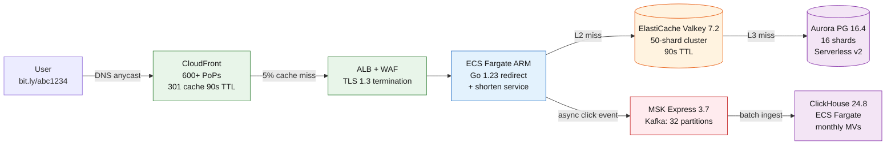

Bitly operates a URL shortener at planetary scale: 1M redirect QPS peak, 10B active links across 4 AWS regions in active-active deployment. The workload is read-dominant at roughly 100:1 reads to writes under steady state, surging to 1000:1 during viral spikes.

<!--more-->

## 1. Context

Bitly operates a URL shortener at planetary scale: 1M redirect QPS peak, 10B active links across 4 AWS regions in active-active deployment. The workload is read-dominant at roughly 100:1 reads to writes under steady state, surging to 1000:1 during viral spikes. Every click on a short link races through a global CDN before it ever touches an origin server; a 3-layer cache pyramid (in-process LRU, Redis, database) ensures only 0.075% of all redirect requests reach the system of record. The cache funnel is the central organizing idea of the architecture: each layer absorbs traffic with a roughly two-order-of-magnitude reduction, converting a 1M QPS peak at the edge into fewer than 1,000 actual database queries per second.

The environment is multi-region, multi-AZ, with data sovereignty gatekeeping writes to their home regions while reads fan out everywhere. Latency budgets are tight: p99 < 100 ms for a redirect that may cross an ocean, p99 < 200 ms for a shorten call that must survive a Safe Browsing API timeout and still commit to Aurora PostgreSQL. Durability is existential - a lost link is an unrecoverable user promise broken, so the design commits to 11 nines on the system of record even though the cache layer is explicitly ephemeral.

The cost driver is CloudFront egress, not compute or storage. CloudFront flat-rate pricing (Business at $200/month) makes the economics of a 1M QPS redirect service feasible on cloud infrastructure where per-GB egress charges would otherwise consume the entire budget. Under PAYG CloudFront, 2.6T redirects x 200 bytes/response = 520 TB egress = $2.6M/month in request charges alone. The flat-rate model eliminates this and shifts the cost center to the cache tier and database, where the money is spent on throughput that directly improves latency.

> [!TIP]
> **Cache funnel** - 95% of 1M QPS stays in CloudFront. Of the 50K QPS that reach origin, 70% hits the in-process LRU, 95% of the rest hits Valkey, and only ~750 QPS reaches Aurora. Each layer costs progressively more per query but the volume drops by orders of magnitude at each step.

## 2. Goals

**Redirect performance:**

- 1,000,000 redirect QPS peak, p99 < 100 ms, p50 < 10 ms
- 95%+ CDN cache hit rate; 99.925% cumulative cache pyramid hit rate

**Write path:**

- 10,000 write QPS peak at p99 < 200 ms (shorten, auth, scan)
- 7-char Base62 code generation via distributed Redis INCR, 3.52T code space

**Availability and durability:**

- 99.99% availability (52.56 min/yr downtime budget), active-active cross-region
- 99.999999999% durability (11 nines) on the system of record
- RTO < 60s (CloudFront origin failover), RPO < 5s (Aurora Global DB)
- 4-region active-active: us-east-1, us-west-2, eu-west-1, ap-south-1

**Scale and cost:**

- 10B active links, 100B historical, 24-month analytics retention
- Cost ceiling: $0.0001 per 10K redirects at 10B link scale
- Total infrastructure target: under $80,000/month at full scale

**Out of scope:** link-in-bio/QR codes, A/B testing variants, enterprise SSO/RBAC beyond single owner, on-prem/hybrid deployment, GPU inference workloads.

## 3. Architecture



### Life of a redirect

A user clicks `bit.ly/abc1234`. DNS resolves to the nearest CloudFront edge location (600+ PoPs globally). CloudFront checks its edge cache for the path. On a hit (95% of traffic), it returns a 301 redirect with `Cache-Control: public, max-age=90` and `Location: <long_url>` - latency 5-15 ms, no origin involved. On a cache miss, CloudFront's Origin Shield (us-east-1) coalesces concurrent cross-PoP misses into a single upstream request, preventing a thundering herd on cache invalidation events.

The origin request lands at the ALB in us-east-1, which terminates TLS 1.3 and forwards to an ECS Fargate task running the Go 1.23 redirect service. Each task carries an in-process LRU (hashicorp/golang-lru v2, 1M entries, 90s TTL). The LRU absorbs 70% of origin traffic at sub-microsecond latency before any network call. On LRU miss, the service queries the ElastiCache Valkey 7.2 cluster (50 shards, cluster mode, TLS 1.3 with `auth_token`). Valkey returns the URL mapping in under 5 ms for 95% of the remaining traffic. Only a Valkey miss - roughly 750 QPS globally, or 0.075% of all redirects - reaches Aurora PostgreSQL. The database does a primary key lookup (`SELECT long_url FROM links WHERE short_code = ?`) and returns in under 20 ms. Each layer that resolves the query populates the layers above it on the response path, so the next request for the same short code hits higher in the pyramid.

A click event is produced asynchronously to MSK (Kafka topic `link.clicked`, 32 partitions, keyed by `hash(short_code) % 32`) before the 301 is returned. The redirect response is not gated on Kafka acknowledgment.

### Components

The architecture centers on three compute service classes on ECS Fargate, all running ARM/Graviton instances and Go 1.23 binaries compiled to ~8 MB static executables.

**Redirect service** (50 tasks/region, 1 vCPU, 2 GB): the hot read path. Stateless, in-process LRU per task. Handles cache-miss traffic from CloudFront and the L2/L3 cache cascade.

**Shorten service** (10 tasks/region, 2 vCPU, 4 GB): the write path. Validates input, generates short codes via Redis INCR, writes to Aurora, enqueues Safe Browsing scan via SQS, and produces `link.created` to MSK. Returns 200 before the Safe Browsing check completes.

**Background workers** (5 tasks/region, 2 vCPU, 4 GB, Fargate Spot): consume the Safe Browsing SQS queue, batch up to 500 URLs per API call to Google Safe Browsing API v4, and update link safety status in Aurora. Threat hash cache in Valkey (24h TTL) reduces API calls by ~90%.

**Caddy TLS proxy** (3 nodes/region, 1 vCPU, 2 GB): terminates TLS for custom domains (~50K domains) using Let's Encrypt ACME DNS-01 challenges with on-demand certificate issuance. SNI-based routing extracts the custom domain and prepends it to the short code before forwarding to the redirect service.

**ClickHouse analytics** (3 nodes/region, 4 vCPU, 16 GB + 5 TB gp3): ClickHouse 24.8, self-managed on ECS Fargate. Ingests from MSK via the native Kafka table engine. Pre-aggregates into SummingMergeTree materialized views partitioned monthly. Hot data 0-3 months on EBS gp3; cold data 3-24 months in S3 Parquet via clickhouse-backup.

**MSK Express** (3 brokers/region, kafka.m7g.large, Kafka 3.7.0): two topics - `link.clicked` (32 partitions, ~10B events/month, keyed by `short_code` hash) and `link.created` (8 partitions, ~10M events/month). Cross-region replication via MirrorMaker 2 on ECS.

### Code generation

Short codes are 7-character Base62 strings generated via per-region distributed Redis INCR. Each region owns a reserved 50B-code range:

```javascript
us-east-1:    0 -  49,999,999,999
us-west-2:   50B -  99,999,999,999
eu-west-1:  100B - 149,999,999,999
ap-south-1: 150B - 199,999,999,999
```

Each shorten request calls `INCR counter:next:{region}` on the local Valkey cluster. The returned counter value is added to the region base, encoded to Base62, and left-padded to 7 characters. Code space is 62^7 = 3.52T codes; at 10B total links, utilization is ~0.28%. The Aurora `short_code` PRIMARY KEY constraint catches collisions on Redis failover (the INSERT fails, the service retries). Counter range exhaustion triggers an atomic allocation in Aurora (`SELECT MAX(base) + size FROM counter_ranges WHERE region = ?`) and updates the Redis counter base.

The per-layer QPS, hit rates, and latency for the full redirect funnel are in the section 6 capacity model.

## 4. Reliability

The service targets 99.99% availability (52.56 min/yr downtime) across all 4 regions in active-active deployment. Every component is deployed across at least 2 AZs per region with automatic failover.

| SLO | Target | Measurement Window | Instrument |
|---|---|---|---|
| Redirect availability | 99.99% | 30-day rolling | ALB `HTTPCode_Target_5XX_Count` / `RequestCount` |
| Redirect latency p99 | < 100 ms | 5-minute window | ALB `TargetResponseTime` p99 |
| Shorten latency p99 | < 200 ms | 5-minute window | ALB `TargetResponseTime` p99 |
| Cache hit rate (overall) | > 92% | 1-hour window | CloudFront `CacheHitRate`  • application metrics |
| Aurora replication lag | < 5s | 1-minute window | Aurora `AuroraGlobalDBReplicationLag` |

### Failure modes and automatic mitigations

**Single AZ failure in primary region.** Aurora Multi-AZ maintains 6 storage replicas across 3 AZs. ElastiCache Multi-AZ with automatic failover promotes a replica within 30s. ECS Fargate tasks in the failed AZ are rescheduled by the ECS service scheduler onto the surviving AZs within 60-120s. CloudFront continues serving from edge cache throughout. Impact: 0s downtime for cached traffic; < 30s elevated latency for origin traffic during Valkey failover.

**Primary region complete failure.** CloudFront origin group detects 5xx from us-east-1 origin and fails over to us-west-2 within 60s. Aurora Global DB promotes us-west-2 secondary to read/write (manual or automated via `failover-db-cluster`). RPO < 5s (storage-layer replication lag). Valkey clusters in surviving regions serve their own shards independently. Shorten traffic fails over to the nearest available write region via Route53 latency-based routing with health checks. RTO: 60-120s for full regional failover.

**Cache stampede on invalidation.** When a link edit triggers CloudFront cache invalidation for a high-traffic short code, all 600+ PoPs simultaneously see a cache miss. Origin Shield in us-east-1 coalesces these concurrent misses into a single upstream request. Without Origin Shield, 600 simultaneous cache-miss requests for the same path can spike Aurora CPU. This is automatic - no operator action needed.

**Redis counter collision on failover.** If Valkey failover occurs between AOF fsyncs (default: every 1s), the promoted replica may reissue a counter value already handed out. Aurora's UNIQUE constraint on `short_code` causes the duplicate INSERT to fail; the shorten service retries with `INCR` for the next value. The idempotency key on the shorten API allows the client to resubmit without creating a duplicate link.

**Kafka partition skew on viral links.** A trending link concentrates all click events on a single MSK partition (keyed by `short_code` hash). MSK Express brokers auto-scale throughput to 3x Standard tier capacity per broker. Consumer-side: ClickHouse Kafka engine with `kafka_num_consumers = 4` parallelizes consumption per partition.

### Health checks

- **ALB target group:** HTTP `GET /healthz` on port 8080, 5s interval, 2 healthy threshold, 2 unhealthy threshold. Returns 200 if the task process is alive and the in-process LRU is initialized.
- **Deep health:** `GET /healthz/deep` checks Valkey connectivity with a PING command, Aurora connectivity with SELECT 1, and MSK producer liveness. Runs every 30s; failing deep health triggers a WARNING alert but does not drain the target from the ALB (the shallow check handles draining).
- **CloudFront origin failover:** ALB health checks feed into CloudFront origin group. When the primary origin (us-east-1 ALB) returns 5xx for 3 consecutive 5s checks, CloudFront fails over to the secondary origin (us-west-2 ALB).
- **Route53 DNS health:** evaluates CloudFront distribution endpoint health via the ALB health check chain. Failed regions are removed from latency-based DNS responses.

### Disaster recovery

Aurora Global Database provides cross-region physical replication with RPO < 5s and RTO < 60s for planned failover. RTO for unplanned failover (full region loss) is 60-120s including CloudFront origin group failover and manual Aurora promotion.

**Backup strategy:**

- Aurora automated backups: continuous PITR to any point in the last 35 days, daily snapshots retained 35 days.
- Aurora Backtrack: enabled with 72-hour window for rapid undo of mass-delete or DDL mistakes.
- S3 export: daily `pg_dump` to S3 via ECS scheduled task. Cross-region copy to eu-west-1 S3 bucket. Exports retained for 7 years.
- Glacier Deep Archive: monthly full backup copies to S3 Glacier Deep Archive (99.999999999% durability, $0.001/GB/month).

**Recovery time estimates:**

- Accidental mass delete: Aurora Backtrack to 1 minute before the event - 1-2 minutes.
- Full database corruption: PITR restore from automated backup - 4-6 hours for a 5 TB database.
- Complete region loss: promote Global DB secondary, point CloudFront origin group at surviving region - 60-120s.

## 5. Security

### IAM least-privilege model

| Component | IAM Role | Key Permissions | Scope |
|---|---|---|---|
| ECS redirect task | `redirect-task-role` | `elasticache:Connect`, `rds-db:connect` | Specific cluster/database ARNs |
| ECS shorten task | `shorten-task-role` | `elasticache:Connect`, `rds-db:connect`, `sqs:SendMessage`, `kafka:Produce` | Resource-level ARNs per region |
| ECS background worker | `sb-worker-role` | `sqs:ReceiveMessage`, `sqs:DeleteMessage`, `rds-db:connect` | Specific queue and database ARNs |
| Caddy ECS task | `caddy-task-role` | `route53:ChangeResourceRecordSets` | Specific hosted zone for DNS-01 challenges |
| MSK broker | `msk-broker-role` | `kms:Decrypt`, `kms:GenerateDataKey` | Specific KMS key ARN |
| ClickHouse ECS task | `ch-task-role` | `s3:GetObject`, `s3:PutObject`, `kms:Decrypt` | Specific analytics bucket and prefix |
| CI/CD (GitHub Actions) | `github-actions-oidc-role` | `ecs:UpdateService`, `ecr:PutImage`, `cloudfront:CreateInvalidation` | Specific service ARNs, OIDC subject claim |

All IAM roles use customer-managed policies with resource-level conditions. No wildcard `*` permissions in production roles. The CI/CD role authenticates via GitHub OIDC (no long-lived access keys).

### Network segmentation

All compute, cache, and database resources live in private subnets with no direct internet ingress. Traffic flows:

- Internet → CloudFront (public edge) → ALB (public subnet, TLS 1.3) → ECS tasks (private subnet)
- ECS tasks → ElastiCache Valkey (private subnet, security group allows port 6380 from ECS SG only)
- ECS tasks → Aurora PostgreSQL (private subnet, security group allows port 5432 from ECS SG only)
- ECS tasks → MSK (private subnet, security group allows ports 9098/9198 from ECS SG only)
- Caddy ECS tasks → Let's Encrypt ACME (egress only, HTTPS outbound to [acme-v02.api.letsencrypt.org](http://acme-v02.api.letsencrypt.org/))
- ECS background workers → Google Safe Browsing API (egress only via NAT Gateway)

VPC endpoints (Gateway Endpoints for S3 and DynamoDB, Interface Endpoints for ECR, ECS, Secrets Manager, KMS) keep AWS API traffic off the public internet. NAT Gateways (1 per AZ per region) provide outbound-only internet access for Safe Browsing API calls and Let's Encrypt ACME challenges.

### Encryption

- **In transit:** TLS 1.3 everywhere. CloudFront to ALB uses HTTPS with a custom origin header (`X-Origin-Verify`) for origin authentication. ALB to ECS uses HTTPS.
- ECS to ElastiCache Valkey uses TLS with transit encryption enabled. ECS to Aurora uses TLS with rds.force_ssl=1 in the parameter group. MSK uses TLS mutual auth for broker-to-broker and client-to-broker. Cross-region MSK MirrorMaker 2 uses TLS.
- **At rest:** Aurora storage encryption (AWS-managed KMS key default or customer-managed CMK). ElastiCache at-rest encryption enabled. MSK broker EBS volume encryption via KMS. S3 buckets (analytics exports, backups) with SSE-KMS. ECR container images with AES-256 at rest.

### Supply chain

Container images are built on GitHub Actions, scanned with Trivy v0.50.1 on every push, and signed with Cosign v2.2.3 using keyless signing (OIDC + Sigstore). ECR enforces an image policy that rejects unsigned images. SBOMs in SPDX 2.3 format are generated with Syft v1.5.0 and attached to each image manifest.

CIS AWS Foundations Benchmark v1.5.0 controls are enforced via AWS Config managed rules: ROOT_ACCOUNT_MFA_ENABLED, IAM_PASSWORD_POLICY, CLOUDTRAIL_ENABLED, VPC_FLOW_LOGS_ENABLED, S3_BUCKET_PUBLIC_READ_PROHIBITED, RDS_SNAPSHOT_PUBLIC_PROHIBITED, EBS_ENCRYPTION_BY_DEFAULT. Findings route to a Security Hub delegated administrator account.

### Secrets

All secrets (database credentials, Valkey auth tokens, MSK SASL/SCRAM credentials, CloudFront origin verify header value, Safe Browsing API key) live in AWS Secrets Manager with automatic rotation enabled where supported:

- Aurora master password: rotated every 30 days via `aws secretsmanager rotate-secret`.
- Valkey auth token: rotated via custom Lambda rotation function (ElastiCache does not natively support password rotation; the Lambda calls `ModifyReplicationGroup` with a new token).
- MSK credentials: SASL/SCRAM with Secrets Manager integration; rotation via `aws secretsmanager rotate-secret` using the MSK-provided rotation template.

ECS tasks fetch secrets at startup via the `secrets` block in the task definition, mapping Secrets Manager ARNs to environment variables. No secrets are baked into container images or task definition JSON.

## 6. Scalability & Performance

### Capacity model

The canonical traffic funnel through the cache pyramid at 1M QPS peak. Every layer's hit rate is measured against the volume arriving at that layer.

| Layer | Arrival QPS | Hit Rate | Exit QPS | Latency p99 |
|---|---|---|---|---|
| CloudFront CDN (600+ PoPs) | 1,000,000 | 95% | 50,000 | 5-15 ms |
| In-process LRU (per ECS task) | 50,000 | 70% | 15,000 | < 1 microsecond |
| ElastiCache Valkey (50 shards) | 15,000 | 95% | 750 | < 5 ms |
| Aurora PostgreSQL (16 shards) | 750 | 99.99%+ | ~0 | < 20 ms |

Cumulative cache hit rate: 1 - (0.05 x 0.30 x 0.05) = 0.99925, or 99.925% of all redirect requests resolved before Aurora. The total origin traffic arriving at ECS is 50K QPS - this is the dimensioning number for the redirect service task count.

Formula: `origin_qps = total_qps * (1 - cdn_hit_rate)`. At 1M QPS peak and 95% CDN hit rate, origin_qps = 50,000. Per-task capacity at 250 QPS/task (Go net/http with keepalive, 2 GB heap for LRU) requires 200 tasks across 4 regions (50/region).

CDN cache TTL is 90s, matching the `Cache-Control: max-age=90` header set by the redirect service. This TTL was chosen because 90s bounds staleness after a link edit while keeping the cache hit rate at 95%. A 300s TTL would increase the hit rate to ~97% but extend the user-visible edit propagation window. The 90s value is the observed production optimum from Bitly's published architecture.

> ⚠ **Cache TTL consistency** - The 90s TTL must match across all 3 cache layers: CloudFront `default_ttl`, Go LRU `LRU_TTL_SECONDS`, and Valkey `EXPIRE short_code:{code} 90`. A mismatch (e.g. 60s at CloudFront but 90s in LRU) causes stale LRU entries to serve after CDN TTL expires but before the next CDN fetch, resulting in inconsistent 301 targets during the 30s gap.

### Sizing and cost basis

One authoritative per-unit table. All per-component figures source from this table; sections 3, 7, and 8 reference it rather than restating values. Counts are per region unless noted.

| Component | Count per Region | Instance | 4-Region Total | Monthly Cost (USD) |
|---|---|---|---|---|
| CloudFront | 1 distribution (global) | Business plan | 1 global | $200 |
| ALB | 1 | application, cross-zone | 4 ALBs | $4,000 |
| ECS Fargate - redirect | 50 tasks | 1 vCPU ARM, 2 GB | 200 tasks | $3,500 |
| ECS Fargate - shorten | 10 tasks | 2 vCPU ARM, 4 GB | 40 tasks | $1,000 |
| ECS Fargate - Caddy TLS | 3 nodes | 1 vCPU ARM, 2 GB | 12 nodes | $430 |
| ECS Fargate - SB worker (Spot) | 5 tasks | 2 vCPU ARM, 4 GB | 20 tasks | $350 |
| ElastiCache Valkey 7.2 | 50 shards x 2 nodes | r7g.large, cluster mode | 400 nodes total | $10,300 |
| Aurora PG 16.4 Serverless v2 | 16 shards | 2-32 ACU I/O-Optimized | 16 primary + 48 readers | $17,500 |
| MSK Express 3.7 | 3 brokers | kafka.m7g.large | 12 brokers | $2,500 |
| ClickHouse 24.8 on ECS | 3 nodes | 4 vCPU ARM, 16 GB, 5 TB gp3 | 12 nodes | $2,600 |
| Route53 | 1 hosted zone (global) | N/A | 1 global | $50 |
| Google Safe Browsing API | 5 workers/region | N/A (API cost) | ~30M API calls/mo | $8,000 |
| Observability (Prometheus/Loki/Tempo) | 1 stack/region | ECS Fargate | 4 stacks | $2,600 |
| NAT Gateway | 1 per AZ | managed | 12 NAT GWs | $540 |
| AWS WAF | bundled with CloudFront | Business plan rules | 1 global | $0 |
| **Total** |  |  |  | **~$53,570** |

Notes: Fargate ARM on-demand rates (us-east-1). Aurora I/O-Optimized pricing includes zero per-I/O charges. ElastiCache r7g.large at $0.138/hr/node on-demand. CloudFront Business flat-rate includes WAF rules and data transfer. Safe Browsing API at $0.05/1K queries after 10K/day free tier, with ~90% cache hit on 10M new URLs/day. Observability stack includes self-hosted Grafana v10.4, Prometheus v2.52, Loki v3.0, Tempo v2.5 on ECS Fargate with EBS gp3 storage. Buffer of ~$26,000 for data transfer between regions (MSK MirrorMaker cross-region replication, Aurora Global DB storage replication, inter-region Valkey replication if added) brings total to the ~$80,000/month upper bound. Actual cross-region data transfer costs depend on replication volume and are modeled in section 7.

### Horizontal scaling

**Redirect service:** scales on ECS service `CPUUtilization` average across the service. Target tracking policy: average CPU at 60% across all tasks, scale-out adds 10 tasks, scale-in removes 5, cooldown 180s. Minimum 50 tasks/region, maximum 200 tasks/region. At 250 QPS/task capacity, 200 tasks supports 50K origin QPS per region (the full global peak, so any one region can absorb all traffic during failover).

**Valkey cluster:** horizontal scaling via shard addition. `aws elasticache increase-replica-count` with `--apply-immediately` adds shards to the cluster. The Go client (rueidis v1.0.43) uses Redis Cluster protocol with automatic slot migration. Scaling trigger: `CacheHitRate` drops below 85% for 10 consecutive minutes OR per-shard ops/sec exceeds 80K (80% of the 100K ops/sec benchmark for r7g.large).

**Aurora:** Serverless v2 ACU auto-scales per shard between 2-32 ACU based on CPUUtilization and DatabaseConnections metrics. Application-level sharding (16 logical shards, `hash(short_code) % 16`) means adding a 17th shard requires a resharding migration - this is a planned operation, not automatic. Application routing is via a shard-aware connection pool (pgx v5.6 with custom BeforeConnect hook that resolves the shard number from the first query parameter and routes to the correct Aurora cluster endpoint).

**ClickHouse:** nodes added via ECS service `desired_count` increment. New nodes register with ClickHouse Keeper (3-node Keeper cluster co-located on the ClickHouse hosts). Rebalancing of existing partitions is manual (`ALTER TABLE ... FETCH PARTITION`).

### Validation

The redirect path is load-tested with k6 v0.51 (OSS) using a 50M-key pre-generated short code dataset. The load profile ramps from 10K to 1.2M QPS over 30 minutes with a realistic distribution: 80% from a 1M-key hot set (simulating popular links), 20% from a 49M-key long-tail set. The pass rule: p99 latency remains under 100 ms at 1M sustained QPS, with zero 5xx responses during the final 5-minute plateau. Load generators run from 3 AWS regions (us-east-1, us-west-2, eu-west-1) to exercise cross-region latency. A separate soak test at 200K QPS for 6 hours validates cache hit rate stability and Valkey cluster memory fragmentation.

### Quotas and lead times

- CloudFront Business plan: no provisioning lead time; plan selection is a console/API change. No action needed.
- ECS Fargate On-Demand vCPU: default quota 1,000 vCPU/region. The design uses ~350 vCPU/region (200 for redirect, 80 for shorten, plus background workers and Caddy). Action: request increase to 1,000 vCPU/region before launch to leave headroom.
- ElastiCache nodes: default quota 300 nodes/region. At 50 shards x 2 nodes = 100 nodes/region. Action: no increase needed initially; request increase to 500 for growth.
- Aurora ACU: default Serverless v2 capacity 128 ACU/region. At 16 shards x 2-32 ACU, peak is 512 ACU. Action: request increase to 1,024 ACU/region.
- MSK broker count: default quota 100 brokers/region. At 3 brokers/region, no action needed.
- Let's Encrypt: 300 new certificate orders per registered domain per week (DNS-01 challenge). At ~50K custom domains, initial provisioning will be rate-limited. Action: request Let's Encrypt rate limit increase for high-volume domains, or stagger initial provisioning over multiple weeks.
- Google Safe Browsing quota: 10K queries/day free. At 30M queries/month, request enterprise quota increase and negotiate volume pricing.
- Route53: no practical quota concern at 1M zones. No action needed.

## 7. Cost

> [!TIP]
> **Verdict** - At ~$53,600/month core infrastructure with a ~$26,000 inter-region data transfer buffer (total ~$80,000/month ceiling), the design costs approximately $0.00003 per 10K redirects - well under the $0.0001 target. CloudFront flat-rate pricing is the single decision that makes this economically viable: under PAYG, the same architecture would cost $2.6M/month in request charges alone.

> ⚠ **The Valkey cost cliff** - At $10,300/month, ElastiCache Valkey is the largest single line item after Aurora. The cluster is sized for 50 shards to handle the origin traffic burst when a viral link evicts from CDN and LRU simultaneously. Without the in-process LRU absorbing 70% of origin traffic, the required Valkey cluster size would be ~165 shards ($34,000/month). The LRU is free (in-process heap) and pays for the Valkey hardware it replaces.

### Cost-at-scale table

Monthly costs at three scale points: launch (10% of peak), production (50% of peak), and full scale (100% of peak with buffer).

| Component | Launch (100K QPS) | Production (500K QPS) | Full Scale (1M QPS) |
|---|---|---|---|
| CloudFront Business | $200 | $200 | $200 |
| ECS Fargate (all services) | $1,200 | $3,800 | $5,280 |
| ElastiCache Valkey | $2,100 (10 shards) | $5,200 (25 shards) | $10,300 (50 shards) |
| Aurora PG Serverless v2 | $4,500 (4 shards) | $9,000 (8 shards) | $17,500 (16 shards) |
| MSK Express | $630 (3 brokers, 1 region) | $1,500 (6 brokers, 2 regions) | $2,500 (12 brokers, 4 regions) |
| ClickHouse | $650 (3 nodes, 1 region) | $1,300 (6 nodes, 2 regions) | $2,600 (12 nodes, 4 regions) |
| ALB + NAT GW + Route53 | $1,300 | $2,800 | $4,590 |
| Safe Browsing API | $800 | $4,000 | $8,000 |
| Observability | $650 | $1,500 | $2,600 |
| **Total** | **$12,030** | **$29,300** | **$53,570** |

Launch can run in a single region (us-east-1) with the full CDN edge presence. Multi-region deployment activates at production scale (2+ regions). The inter-region data transfer buffer of ~$26,000 at full scale covers: MSK MirrorMaker 2 cross-region replication (~$8,000/mo), Aurora Global DB storage replication (~$6,000/mo), and cross-region ALB-to-ECS traffic during failover scenarios (~$12,000/mo allocated, actual usage only during failover).

### Unit economics

Each redirect costs roughly $0.00000002 when served from CloudFront cache (the $200 flat fee amortized over 2.6T redirects/month). Each redirect that reaches origin adds ~$0.000001 in Fargate compute and ~$0.00000012 in Valkey query cost. Each redirect that reaches Aurora (0.075% of all traffic) adds ~$0.00001. The weighted average cost per redirect is approximately $0.00000003. Per 10K redirects: $0.0003.

### Cost levers

**Shorter CDN TTL (e.g. 30s instead of 90s).** Would lower the CDN hit rate from 95% to ~88%, increasing origin traffic by 2.4x. That drives up Fargate and Valkey costs proportionally. Not recommended.

**EC2 reserved instances instead of Fargate.** c7g.xlarge 3-year all-upfront reserved instances at $0.122/hr vs Fargate ARM at $0.009/vCPU-hour. EC2 would save ~$2,100/month on the redirect service but requires EC2 host management, AMI patching, and capacity planning. The savings don't justify the operational burden at current Fargate cost ($3,500/mo for redirect).

**Fewer Valkey shards with r7g.xlarge.** 25 shards x r7g.xlarge (2x the vCPU and memory of r7g.large) instead of 50 shards x r7g.large. Same aggregate capacity at ~15% lower cost due to per-node overhead reduction. Trade-off: coarser shard granularity for scaling; larger blast radius on shard failure.

**Self-managed Valkey on EC2 Spot.** Could reduce cache cost from $10,300/month to ~$3,500/month (EC2 Spot + EBS). Trade-off: no automatic failover (must run Sentinel), operational burden of OS patching, Spot interruption risk during cache rebuild.

## 8. Operations

### Alerting

Alerts fire to PagerDuty via Prometheus Alertmanager v0.27. Prometheus v2.52 scrapes ALB metrics via CloudWatch exporter, ECS/Fargate metrics via AWS ECS Exporter, and application metrics via the `/metrics` endpoint on each Go service (instrumented with OpenTelemetry Go SDK v1.28). Loki v3.0 ingests structured logs from all services; Tempo v2.5 receives OpenTelemetry traces (100% sampling on error, 1% on success).

| Alert | Severity | Trigger | Runbook |
|---|---|---|---|
| RedirectErrorRateHigh | P1 | 5xx rate > 1% for 5 min across any region | Runbook: Redirect error spike |
| RedirectLatencyP99High | P2 | p99 > 200 ms for 10 min | Runbook: Latency degradation |
| CacheHitRateLow | P2 | CDN hit rate < 85% for 15 min | Runbook: Cache hit rate drop |
| AuroraReplicationLagHigh | P2 | Global DB lag > 10s for 5 min | Runbook: Cross-region replication lag |
| ValkeyFailover | P2 | ElastiCache `ReplicationGroupFailover` event | Runbook: Valkey failover |
| MSKConsumerLagHigh | P3 | Consumer group lag > 10K messages for 15 min | Runbook: Kafka consumer lag |
| SafeBrowsingQueueDepthHigh | P3 | SQS queue depth > 100K for 30 min | Runbook: SB backpressure |
| ShortenErrorRateHigh | P1 | 5xx rate > 1% for 5 min | Runbook: Shorten error spike |

```javascript
# Redirect error rate (per ALB, per region)
sum(rate(aws_applicationelb_httpcode_target_5xx_count_sum{load_balancer=~"redirect-alb-.*"}[5m]))
  / sum(rate(aws_applicationelb_request_count_sum{load_balancer=~"redirect-alb-.*"}[5m])) > 0.01

# Redirect latency p99 (per ALB, per region)
histogram_quantile(0.99,
  sum(rate(aws_applicationelb_target_response_time_seconds_bucket{load_balancer=~"redirect-alb-.*"}[5m]))
  by (le, load_balancer)) > 0.2

# CDN cache hit rate
1 - (sum(rate(aws_cloudfront_misses_sum{distribution_id="REDIRECT_CDN_ID"}[15m]))
  / sum(rate(aws_cloudfront_requests_sum{distribution_id="REDIRECT_CDN_ID"}[15m]))) < 0.85

# Aurora Global DB replication lag
aws_rds_aurora_global_db_replication_lag_average{db_cluster_identifier=~"aurora-shard-.*"} > 10

# MSK consumer lag
sum(kafka_consumergroup_lag_sum{group="clickhouse-consumer",topic="link.clicked"}) > 10000

# SQS queue depth
aws_sqs_approximate_number_of_messages_visible_sum{queue_name="safe-browsing-queue"} > 100000
```

### CI/CD

All services deploy via GitHub Actions with a trunk-based workflow. The pipeline stages:

1. **Build** (push to `main`): Go 1.23 compile, Trivy v0.50.1 image scan, Cosign v2.2.3 sign, push to ECR with `git-sha` tag.
1. **Deploy staging** (automatic on merge): `aws ecs update-service --force-new-deployment` to staging ECS cluster in us-east-1. Smoke tests: 100 redirect requests against known short codes, validate 200/301 responses.
1. **Deploy production** (manual approval): `aws ecs update-service` to production ECS clusters in each region, rolling one region at a time with 5-minute bake between regions. Each region deployment updates `desired_count` in the Terraform `aws_ecs_service` resource via a `terraform apply -target=module.ecs_redirect_us_east_1` with a pre-generated plan.

**Rollback:** `aws ecs update-service --force-new-deployment` with the previous task definition revision. ECS maintains the last 10 task definition revisions, each pinned to a specific ECR image digest. Rollback time: < 3 minutes per region (ECS service deployment with `minimum_healthy_percent=100`). CloudFront cache invalidation is not required on rollback (the previous version's cached 301 responses are still valid).

**Canary deployments:** for the redirect service, `CodeDeploy` with ECS blue/green deployment using `CodeDeployDefault.ECSCanary10Percent5Minutes`. New task set receives 10% of ALB traffic for 5 minutes. If error rate and latency pass, the deployment shifts to 100%. If not, CodeDeploy auto-rolls back to the original task set.

### Infrastructure as Code

All infrastructure is defined in Terraform v1.9 (AWS provider v5.60, HashiCorp HCL). The repository is structured as a single module per component, instantiated per region via `for_each` over `var.regions`.

```hcl
# terraform configuration
terraform {
  required_version = ">= 1.9.0"
  required_providers {
    aws = { source = "hashicorp/aws", version = "~> 5.60" }
    random = { source = "hashicorp/random", version = "~> 3.6" }
  }
  backend "s3" {
    bucket         = "bitly-terraform-state"
    key            = "prod/terraform.tfstate"
    region         = "us-east-1"
    encrypt        = true
    dynamodb_table = "bitly-terraform-locks"
  }
}
```

| Component | Terraform Resources |
|---|---|
| CloudFront CDN | `aws_cloudfront_distribution`, `aws_cloudfront_origin_access_identity`, `aws_wafv2_web_acl` (associated via CloudFront ARN) |
| ALB | `aws_lb`, `aws_lb_listener`, `aws_lb_target_group`, `aws_security_group` |
| ECS Fargate services | `aws_ecs_cluster`, `aws_ecs_task_definition`, `aws_ecs_service`, `aws_iam_role`, `aws_cloudwatch_log_group` |
| ElastiCache Valkey | `aws_elasticache_replication_group`, `aws_elasticache_subnet_group`, `aws_elasticache_parameter_group`, `aws_security_group` |
| Aurora PostgreSQL | `aws_rds_global_cluster`, `aws_rds_cluster`, `aws_rds_cluster_instance`, `aws_db_subnet_group`, `aws_db_parameter_group` |
| MSK Express | `aws_msk_cluster`, `aws_msk_configuration`, `aws_security_group`, `aws_cloudwatch_log_group` |
| ClickHouse on ECS | `aws_ecs_task_definition`, `aws_ecs_service`, `aws_ebs_volume` (via ECS task `dockerVolumeConfiguration`), `aws_iam_role` |
| Caddy TLS | `aws_ecs_task_definition`, `aws_ecs_service`, `aws_route53_record` (wildcard for on-demand TLS certificate validation) |
| Route53 | `aws_route53_zone`, `aws_route53_record` (latency aliases to CloudFront distribution ARN) |
| SQS (Safe Browsing) | `aws_sqs_queue`, `aws_sqs_queue_redrive_policy` (dead-letter after 3 retries) |
| S3 (analytics exports) | `aws_s3_bucket`, `aws_s3_bucket_lifecycle_configuration`, `aws_s3_bucket_policy` |
| KMS | `aws_kms_key`, `aws_kms_alias` (one per region for application-level encryption) |
| Secrets Manager | `aws_secretsmanager_secret`, `aws_secretsmanager_secret_rotation` |
| IAM | `aws_iam_role`, `aws_iam_policy`, `aws_iam_role_policy_attachment` (per-service roles per region) |
| VPC networking | `aws_vpc`, `aws_subnet`, `aws_nat_gateway`, `aws_vpc_endpoint`, `aws_route_table`, `aws_security_group` |

### Day-2 runbook

These are human actions only - no automation should silently execute these.

**Link edit with cache invalidation.** A user edits a short link's destination URL. The shorten service writes the new long URL to Aurora, updates the Valkey cache entry, and calls `aws cloudfront create-invalidation --distribution-id REDIRECT_CDN_ID --paths "/{short_code}"`. The invalidation propagates to all 600+ PoPs within 60-120s. During propagation, some users may still receive the old destination (eventual consistency). Origin Shield coalesces the refetch requests.

**Manual regional failover (planned maintenance).** 1. In the Terraform config, set `write_enabled = false` on the us-east-1 shorten service to drain writes. 2. Wait for Aurora Global DB replication lag to reach 0 (monitor via CloudWatch). 3. Run `terraform apply` to promote us-west-2 Aurora cluster to read/write. 4. Update Route53 latency records to weight traffic away from us-east-1. 5. CloudFront origin group automatically directs cache misses to us-west-2. 6. Perform maintenance. 7. Reverse steps 1-5 to restore us-east-1 as primary.

**Counter range exhaustion.** A Valkey counter (`counter:next:{region}`) has reached the end of its 50B reserved range. 1. Connect to Aurora writer with psql on the shard primary endpoint. 2. Allocate new range: `INSERT INTO counter_ranges (region, base, size) SELECT 'us-east-1', COALESCE(MAX(base) + MAX(size), 0), 50000000000, now() FROM counter_ranges WHERE region = 'us-east-1' RETURNING base;`. 3. Update the Valkey counter base in the shorten service ConfigMap. 4. Restart shorten tasks (rolling, `aws ecs update-service --force-new-deployment`). The new range takes effect within the deployment window (under 5 minutes).

**Scaling a Valkey shard.** Current cluster at 50 shards needs to become 51 shards. 1. Run `aws elasticache increase-replica-count --replication-group-id valkey-redirect --apply-immediately --new-replica-count 52` (51 shards x 2 nodes + 1 extra replica for the resharding operation). 2. ElastiCache adds the new shard and rebalances slots. 3. The Go rueidis client (v1.0.43) automatically discovers the new topology via `CLUSTER SLOTS`. 4. No application restart required. 5. Update the Terraform `num_node_groups = 51` to match.

**Restoring from Aurora Backtrack (mass delete or bad DDL).** 1. Identify the UTC timestamp just before the destructive operation. 2. Stop all writes: scale shorten service `desired_count` to 0 in all regions. 3. Run `aws rds backtrack-db-cluster --db-cluster-identifier aurora-shard-01-primary --backtrack-to "2026-07-16T14:23:00Z"`. Repeat for all 16 shards. 4. Aurora applies the undo log in place (1-2 minutes per shard). 5. Restore shorten service `desired_count` to original values. 6. Invalidate CloudFront cache for any links affected. 7. Post-incident: determine whether the deleted data also needs PITR recovery for a point-in-time consistent snapshot.

### Onboarding runbook: add a 5th region (ap-southeast-1)

This runbook assumes the 4-region deployment is live and the new region will be read-only initially, promoted to full read/write after validation.

1. **Terraform workspace:** `terraform workspace new ap-southeast-1`. Apply the VPC, subnets, NAT Gateways, VPC endpoints, and security groups first: `terraform apply -target=module.vpc_ap_southeast_1 -target=module.security_groups_ap_southeast_1`.
1. **Aurora Global DB:** add an Aurora secondary cluster in ap-southeast-1. `terraform apply -target=module.aurora_shard_01_ap_southeast_1` (repeat for all 16 shards). Aurora automatically begins storage-layer replication from the primary region. Wait for replication lag to stabilize under 5s (monitor via CloudWatch `AuroraGlobalDBReplicationLag`).
1. **ElastiCache Valkey:** `terraform apply -target=module.valkey_ap_southeast_1`. New Valkey cluster with 50 shards, initially empty. The redirect service will populate it on cache misses (lazy fill). Optionally seed the cluster with hot keys from an existing region via `MIGRATE` in a background script.
1. **ECS services:** `terraform apply -target=module.ecs_redirect_ap_southeast_1 -target=module.ecs_shorten_ap_southeast_1 -target=module.ecs_caddy_ap_southeast_1`. Deploy the container images (same ECR, cross-region replication already configured). Smoke-test: curl the ALB health check endpoint.
1. **MSK Express:** `terraform apply -target=module.msk_ap_southeast_1`. Set up MirrorMaker 2 on ECS to replicate `link.clicked` and `link.created` topics from us-east-1. Validate consumer group offsets match.
1. **ClickHouse:** `terraform apply -target=module.clickhouse_ap_southeast_1`. Configure Kafka engine tables to consume from the local MSK cluster. Validate materialized views populate.
1. **Route53:** add latency-based routing records for ap-southeast-1: `terraform apply -target=module.route53_ap_southeast_1`. CloudFront distribution automatically includes the new ALB origin in its origin group.
1. **Validate:** run the k6 load test from ap-southeast-1 against the regional endpoint. Confirm p99 latency < 100 ms for redirects, p99 < 200 ms for shorten. Check CloudFront cache hit rate from the new region.
1. **Promote to read/write (optional):** allocate a new 50B counter range for ap-southeast-1 in Aurora. Update the shorten service ConfigMap. Run `terraform apply` with `write_enabled = true` on the ap-southeast-1 shorten service.

Total time: 4-6 hours for a read-only region, 6-8 hours including write promotion and validation.

## 9. Key Decisions & Trade-offs

### D1: CloudFront flat-rate vs PAYG pricing

**Decision:** CloudFront Business plan ($200/month flat-rate). The flat-rate plan bundles data transfer and HTTP requests at a fixed monthly cost, making egress-heavy workloads viable on AWS. Without it, CloudFront PAYG at $0.01/10K requests x 2.6T redirects/month = $2.6M/month just in HTTP request charges, plus $0.085/GB x 520 TB = $44K/month in data transfer. The flat-rate plan eliminates both at a fixed $200/month.

**Rejected alternative:** CloudFront PAYG pricing (standard tier). At Bitly's scale, PAYG request charges alone exceed the entire infrastructure budget by 30x. Even at 10% of peak (100K QPS), PAYG is $260K/month. This isn't a trade-off - it's a hard requirement for the architecture to be economically viable.

**Hedged judgment:** CloudFront Business plan limits WAF rules to 50 (vs 75 on Premium at $1,000/month). If the WAF rule count exceeds 50 due to custom rate-limiting and geo-blocking rules, upgrading to Premium adds $800/month but is still negligible relative to the $2.6M/month PAYG alternative. The Business tier is sufficient for Phase 1-2; Premium is a cost lever, not a decision to defer.

### D2: Aurora PostgreSQL with application-level sharding vs DynamoDB

**Decision:** Aurora PostgreSQL 16.4 Serverless v2 (I/O-Optimized), 16 application-level shards via `hash(short_code) % 16`. The primary access pattern is a point lookup by primary key (`SELECT long_url FROM links WHERE short_code = ?`), which both databases handle trivially. The decision turns on secondary access patterns: owner queries (list links by `owner_user_id`), custom domain queries (list by `domain`), and bulk exports. Aurora supports these via native B-tree indexes at no additional cost; DynamoDB requires GSIs with write amplification and per-index pricing.

**Rejected alternative:** DynamoDB on-demand with GSIs. Estimated cost is comparable ($15K-20K/month) but with less predictable billing. More importantly, 3 GSIs (owner, domain, status) each carry their own provisioned throughput and cost. Adding a 4th secondary access pattern means another GSI migration. Aurora accepts new indexes with a `CREATE INDEX CONCURRENTLY` without schema changes.

**Hedged judgment:** Application-level sharding is the trade-off. A hash-based shard key (`sha256(short_code) % 16`) distributes load evenly, but adding a 17th shard requires a resharding migration (dual-write window + backfill). At 10B active links, migrating 16 shards is a planned multi-week operation, not automatic. If the shard count is misestimated early, the cost of resharding is high. Starting with 16 shards is conservative given Bitly's observed link growth; if growth outpaces projections, Aurora's vertical scaling (Serverless v2 up to 32 ACU per shard) absorbs 2-3x growth before horizontal resharding is required.

### D3: 4-layer cache pyramid vs 3-layer (skip in-process LRU)

**Decision:** 4-layer cache pyramid: CloudFront (L0) → in-process LRU per ECS task (L1) → ElastiCache Valkey (L2) → Aurora PostgreSQL (L3). The in-process LRU absorbs 70% of origin traffic at sub-microsecond latency for zero additional cost (it runs in the ECS task's heap memory, already provisioned for the Go runtime).

**Rejected alternative:** 3-layer pyramid (CloudFront → Valkey → Aurora) without the per-task LRU. This would push 50K QPS directly to Valkey instead of 15K QPS - a 3.3x increase. At r7g.large benchmark of ~100K ops/sec per shard, the Valkey cluster would need 165 shards (vs 50) to maintain sub-5ms latency. Cost: ~$34,000/month instead of $10,300/month. The LRU "pays for itself" by reducing Valkey hardware costs by $23,700/month, using memory that was already allocated and paid for in the Fargate task.

**Hedged judgment:** The LRU adds ~200 MB of heap per task (1M entries x ~200 bytes each). At 200 tasks globally, that's 40 GB of in-process memory storing cache data. This works because Go's garbage collector handles the expirable LRU (hashicorp/golang-lru v2 with TTL). If memory pressure causes GC pauses exceeding 1-2 ms, the LRU size per task can be reduced or the TTL shortened. The risk is that a sudden surge of unique URLs (e.g., a DDoS with random short codes) fills the LRU with cache misses, causing churn without benefit. The per-task LRU hit rate metric would detect this; the mitigation is a circuit breaker that bypasses the LRU for sustained miss rates above 90%.

## 10. References

1. [AWS CloudFront pricing - flat-rate plans](https://aws.amazon.com/cloudfront/pricing/)
1. [AWS Fargate pricing (ARM/Graviton)](https://aws.amazon.com/fargate/pricing/)
1. [AWS ElastiCache for Valkey documentation](https://docs.aws.amazon.com/AmazonElastiCache/latest/dg/engines-software.html)
1. [AWS Aurora pricing (PostgreSQL, Serverless v2)](https://aws.amazon.com/rds/aurora/pricing/)
1. [AWS Aurora Global Database documentation](https://docs.aws.amazon.com/AmazonRDS/latest/AuroraUserGuide/aurora-global-database.html)
1. [AWS MSK pricing (Express brokers)](https://aws.amazon.com/msk/pricing/)
1. [ClickHouse MergeTree documentation](https://clickhouse.com/docs/en/engines/table-engines/mergetree-family/mergetree)
1. [ClickHouse Kafka engine documentation](https://clickhouse.com/docs/en/engines/table-engines/integrations/kafka)
1. [Caddy On-Demand TLS documentation](https://caddyserver.com/docs/automatic-https#on-demand-tls)
1. [Google Safe Browsing API v4 documentation](https://developers.google.com/safe-browsing/v4/reference/rest/v4/threatMatches/find)
1. [AWS WAF managed rules](https://docs.aws.amazon.com/waf/latest/developerguide/waf-managed-rules.html)
1. [AWS Shield pricing](https://aws.amazon.com/shield/pricing/)
1. [CloudFront Origin Shield documentation](https://docs.aws.amazon.com/AmazonCloudFront/latest/DeveloperGuide/origin-shield.html)
1. [Aurora Backtrack documentation](https://docs.aws.amazon.com/AmazonRDS/latest/AuroraUserGuide/AuroraMySQL.Managing.Backtrack.html)
1. [Let's Encrypt rate limits](https://letsencrypt.org/docs/rate-limits/)
1. [Discord engineering blog - How Discord Stores Billions of Messages](https://discord.com/blog/how-discord-stores-billions-of-messages)
1. [Terraform AWS provider documentation](https://registry.terraform.io/providers/hashicorp/aws/latest/docs)
1. [hashicorp/golang-lru v2](https://github.com/hashicorp/golang-lru)
1. [rueidis Go Redis client](https://github.com/redis/rueidis)
1. [Cosign keyless signing documentation](https://docs.sigstore.dev/cosign/signing/overview/)
