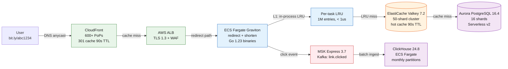

Bitly serves 1M redirect QPS through a cache funnel: CloudFront answers 95% at the edge, an in-process LRU absorbs 70% of what leaks through, and Redis catches most of the rest - only about 750 QPS ever reaches Aurora. Every number on this page follows from that funnel.

<!--more-->

## 1. Context

Bitly serves 1M redirect QPS through a cache funnel: CloudFront answers 95% at the edge, an in-process LRU absorbs 70% of what leaks through, and Redis catches most of the rest - only about 750 QPS ever reaches Aurora. Every number on this page follows from that funnel. The workload is read-dominant, roughly 100:1 reads to writes at steady state and 1000:1 during viral spikes, across 10B active links.

Four AWS regions run active-active: every region serves reads, writes land in the nearest region via latency-based DNS, and Aurora Global Database replicates in under 5 seconds. Latency budgets are tight - a redirect may cross an ocean and still has to feel instant (§2 carries the numbers). Losing a link is the one failure we cannot recover from - a short code's destination cannot be re-derived - so the store of record gets 11 nines of durability and every cache layer is allowed to be lossy.

The bill runs about $80K a month and is feasible only because of CloudFront's flat-rate plan: metered egress would cost about $44K a month for the CDN alone (the math is in §7).

## 2. Goals

**Performance**

- Peak 1,000,000 redirect QPS at p99 < 100 ms, p50 < 10 ms
- Peak 10,000 write QPS (shorten, auth, scan) at p99 < 200 ms

**Availability and durability**

- 99.99% redirect availability, active-active across 4 regions
- Region loss: RTO < 60 s via DNS failover, RPO < 5 s via Aurora Global
- 99.999999999% (11 nines) durability on the system of record

**Scale**

- 10B active links, 100B historical, 24-month analytics retention

**Cost**

- Ceiling $0.0001 per 10K redirects at the 10B-link design point
- **Out of scope:** link-in-bio/QR codes, A/B test variants, enterprise SSO/RBAC beyond a single owner, on-prem/hybrid deployment, GPU inference workloads

## 3. Architecture

The topology is deliberately short: one CDN, one load balancer per region, two stateless Go services, and three data systems.

> [!TIP]
> **The funnel is the architecture** - three caches sit in front of the database: CDN, in-process LRU, Redis. 95% of traffic never leaves the edge, the LRU absorbs 70% of what does, Redis catches most of the remainder, and about 0.1% of redirects ever reach Aurora.



### Life of a redirect

One request, edge to database - each component appears as the request meets it.

1. A click on [bit.ly/abc1234](http://bit.ly/abc1234) resolves through Route53 latency-based DNS to the nearest of CloudFront's 600+ PoPs.
1. CloudFront checks its edge cache and, on a hit, answers with the stored 301 in 5-15 ms. 95% of all traffic stops here.
1. On a miss, the request travels to the ALB origin; Origin Shield in us-east-1 coalesces concurrent misses for the same code, so the origin sees one fill instead of hundreds.
1. The ALB terminates TLS 1.3, runs the WAF rules, and forwards to a redirect task.
1. The task tries its in-process LRU first. A hit - most origin requests - returns the 301 in under 1 ms with no network call.
1. On an LRU miss it asks ElastiCache. A hit returns in under 5 ms and back-fills the LRU.
1. On a Redis miss it hashes the code to one of 16 Aurora shards and runs `SELECT long_url, status FROM links WHERE short_code = 'abc1234' AND domain = 'bit.ly'`, then populates both caches on the way back. About 0.1% of redirects get this far, and even these resolve in under 20 ms at the shard.
1. After responding, the task emits a `link.clicked` event to Kafka - fire-and-forget, never on the latency path. Worst case - a full cache miss - still lands under the 100 ms p99 budget.

### Components

What the path did not show: shard counts, instance families, exact versions, and the supporting cast.

**CloudFront** - 600+ PoPs on the flat-rate Business plan serve the 301 straight from edge cache. WAF (managed core rules plus a 100 req/min per-IP rate limit) and Shield Standard ride on the distribution, with ACM issuing the certificates.

**ALB** - one per region, terminating TLS 1.3 and routing by path: `/api/shorten*` to the shorten target group, `/{code}` to redirect. Billing is per ALB-hour plus LCU with no per-request charge. Health checks hit /healthz every 5 s (2-of-2 threshold), and access logs land in S3 every 5 minutes for analytics reconciliation.

**Redirect service** - 50 Fargate tasks per region (1 vCPU / 2 GB, ARM Graviton) running a Go 1.23 binary. Each task carries a 1M-entry in-process LRU (hashicorp/golang-lru v2.0.2, ~200 MB of heap) that answers most origin lookups without a network hop; across the 200-task fleet that is ~200M cached entries at zero infrastructure cost.

**Shorten service** - 10 Fargate tasks per region (2 vCPU / 4 GB). It accepts authenticated POSTs (JWT via Amazon Cognito), writes to Aurora, and enqueues a Safe Browsing scan to SQS before returning - the scan never blocks the response.

**ElastiCache** - Valkey 7.2 in cluster mode: 50 shards of r7g.large (6.5 GB each), Multi-AZ with one replica per shard and automatic failover in under 30 s. It holds the hot redirect cache (~50M keys at steady state) plus the per-region counter ranges, behind an auth token and TLS.

**Aurora** - PostgreSQL 16.4, Serverless v2, 16 shards routed in the application by sha256 of the short code mod 16. Each shard is its own cluster - a db.r6g.xlarge writer with 2-5 db.r6g.large readers - autoscaling 2-32 ACU on CPU above 60%. Aurora Global Database replicates the us-east-1 primary to us-west-2, eu-west-1, and ap-south-1 at under a second of typical lag. The links table keys on (short_code, domain), partitions monthly via pg_partman, and carries PostGIS for geo-query offload.

**MSK** - Kafka 3.7 on 3 Express brokers per region (kafka.m7g.large; Express delivers about 3x the throughput of Standard). The clicks topic (32 partitions, keyed by short-code hash) ingests ~10B events a month; a creations topic (8 partitions) captures new links. Segments older than 3 days tier to S3, and MirrorMaker 2 on Fargate replicates clicks cross-region.

**ClickHouse** - 24.8, self-managed: 3 nodes per region (4 vCPU / 16 GB Fargate tasks, 5 TB of gp3 as the hot tier), replicated via ClickHouse Keeper with no ZooKeeper. Clicks arrive through the native Kafka table engine into monthly partitions ordered by short code and time; a SummingMergeTree materialized view pre-aggregates daily counts. Hot data lives 3 months on EBS, then exports to S3 Parquet via clickhouse-backup out to the 24-month retention. The owner dashboard reads the view in under 500 ms, a 5-minute real-time view comes from a Redis rollup fed by Kafka Streams, and bulk exports ship as S3 signed URLs.

**Supporting cast** - Route53 does latency-based routing with health checks against every ALB. Caddy 2.7 (3 Fargate tasks per region, 1 vCPU / 2 GB) terminates ~50K custom domains per node with on-demand TLS: ACME DNS-01 against the Route53 API, certificates renewed every 60 days. SQS buffers Safe Browsing scans (60 s visibility timeout, dead-letter queue after 3 retries). Secrets Manager and KMS round it out; §5 covers both.

### Code generation

Short codes are 7-character Base62 - a 3.52T code space (62^7) - minted from an atomic Redis INCR against a per-region counter range.

| Region | Counter range |
|---|---|
| us-east-1 | 0 to 500,000,000,000 |
| us-west-2 | 500,000,000,001 to 1,000,000,000,000 |
| eu-west-1 | 1,000,000,000,001 to 1,500,000,000,000 |
| ap-south-1 | 1,500,000,000,001 to 2,000,000,000,000 |

A counter value of 1,234,567 in us-east-1 encodes to 0005BAN. Range partitioning makes cross-region collisions impossible, and five 500B ranges use barely a seventh of the code space. If Redis loses the counter, it re-seeds from `SELECT MAX(decode_base62(short_code)) FROM links WHERE region='us-east-1'` - the store of record is the recovery source.

A deploy flows the other way: CI builds the arm64 image, pushes it to ECR, registers a new task-definition revision, and ECS rolls it out behind the ALB target group at min 100% / max 200% healthy - the pipeline detail and rollback live in §8.

Per-layer QPS, hit rates, and latencies live in the §6 capacity model.

## 4. Reliability

The design survives the loss of a PoP, an AZ, a cache cluster, a database shard, or a whole region; the only human step anywhere in the failure matrix is promoting Aurora Global after a region loss.

> ⚠ **DR posture** - reads fail over automatically via Route53 DNS in under 60 s (RPO < 5 s via Aurora Global); restoring write capability is a manual Aurora Global promotion taking 3-8 minutes.

### SLIs and SLOs

Eight SLIs cover the redirect path, the write path, and the async pipeline. The cache-hit SLOs exist because a hit-rate slide is the leading indicator of every capacity problem this system has.

| SLI | Measurement | SLO |
|---|---|---|
| Redirect availability | CloudFront 5xx rate + ALB 5xx rate | 99.99% (4.38 min/month; 52.56 min/yr budget) |
| Redirect latency | ALB TargetResponseTime plus OpenTelemetry spans at LRU, Redis, and Aurora | p99 < 100 ms |
| Shorten latency | TargetResponseTime on the shorten target group; OTel span from receive to respond | p99 < 200 ms |
| CDN cache hit rate | CloudFront CacheHitRate | > 95% |
| L1 LRU hit rate | App gauge `lru_hit_ratio` per task | > 60% aggregate |
| L2 Redis hit rate | App gauge `redis_hit_ratio` | > 80% |
| Counter generation | App counter `counter_incr_errors_total` plus collision count | 0 collisions; < 0.01% INCR errors |
| Click event delivery | MSK produce success (acks=1 with retry); ClickHouse `absolute_delay` | > 99.9% delivered; < 60 s lag |

### Failure modes and blast radius

Everything in this table remediates itself; anything that needs hands is in the §8 runbook.

| Failure mode | Blast radius | Detection | Automatic response |
|---|---|---|---|
| CDN PoP loss | ~1/600th of traffic | CloudFront internal health checks | Requests route to the next-nearest PoP; the origin never notices |
| Single AZ failure | All resources in that AZ | ALB healthy-host count drops | ALB shifts cross-AZ; ElastiCache promotes replicas (10-30 s); Aurora fails over to a reader in a surviving AZ |
| Entire region failure | 1 of 4 regions | Route53 health check on the ALB fails | DNS shifts reads to surviving regions per the callout above; Redis cold-fills from LRU and Postgres; write restoration is the §8 runbook |
| Aurora shard writer failure | ~1/16th of writes and of cache-miss reads | App probe (SELECT 1 per shard pool) | Failover to a same-AZ reader in 10-30 s (cross-AZ 30-60 s); writes for the hash range queue and retry |
| ElastiCache shard or cluster failure | L2 misses spike toward origin | CacheHitRate drop; replication-lag spike | Replica auto-promotes in 10-30 s; LRUs absorb most reads; ECS scales redirect tasks 3x when L2 hit rate < 60% |
| LRU staleness | One task serving stale redirects | App counter `lru_stale_served_total` | 90 s TTL-before-eviction bounds staleness; Redis pub/sub invalidation broadcasts deactivations |
| MSK broker loss | In-flight click events delayed | UnderReplicatedPartitions above zero | Two surviving brokers keep topics writable; producers retry with backoff; MSK replaces the broker in 5-15 min |
| ClickHouse node down | 1/3 of a region's analytics capacity | Replica-lag alert; insert-rate monitor | Surviving replicas serve reads; ReplicatedMergeTree reconciles from the Keeper log on restart |

### Health checks

Every layer is probed on its own terms.

- CloudFront origin health: built-in, automatic.
- ALB target groups: /healthz every 5 s, 2-of-2 threshold.
- Route53: checks against each region's ALB endpoint at 10 s intervals gate DNS answers.
- ElastiCache: node health plus replication lag.
- Aurora: ReplicaLag alarm above 10 s per shard.
- MSK: ActiveControllerCount plus under-replicated partitions.
- ClickHouse: system.replicas must show is_readonly=0 and absolute_delay under 60.

### Disaster recovery

Active-active is the DR strategy: all four regions live, no standby burning compute. Route53 alias records carry a 60 s TTL, so reads move without intervention. ElastiCache stays per-region with no cross-region replication - a cold cache refills from LRU and Postgres in minutes, and the shared TTL makes brief staleness harmless.

- Aurora: automated backups, 7-day retention, point-in-time recovery to any 5 minutes.
- ElastiCache: daily snapshots exported to S3 with SSE-KMS.
- ClickHouse: clickhouse-backup daily to S3.

## 5. Security

Least privilege per task, default-deny networking, encryption everywhere, and an async scanning pipeline for hostile URLs.

### IAM

Each service runs under its own task role scoped to exactly what it touches; nothing on the redirect path holds general AWS API access.

| Service | Permissions | Scope |
|---|---|---|
| ECS redirect task | `elasticache:Connect`, `rds-db:connect` (shards 0-15), `kms:Decrypt` for the cache auth token | Task role only; no general AWS API surface |
| ECS shorten task | The redirect set plus `sqs:SendMessage` (scan queue) and `secretsmanager:GetSecretValue` (JWT signing key) | Task role; a separate execution role pulls from ECR |
| Safe Browsing worker | SQS receive/delete plus the Safe Browsing API key from Secrets Manager | Fargate Spot; internet egress via NAT only |
| MSK producers/consumers | IAM SASL/SCRAM authentication on the cluster | No cross-topic access |
| ClickHouse backup agent | `s3:PutObject` on the analytics-cold bucket, `kms:GenerateDataKey` | Sidecar container; that bucket only |

### Network segmentation

Three subnet tiers per region, each defaulting to deny.

- Per-region VPC with public, private-app, and private-data subnet tiers across 3 AZs.
- Public tier: ALB only, internet gateway attached, NACL allows inbound TCP 443 alone.
- Private app tier: ECS tasks and MSK brokers; NAT gateway for Safe Browsing and ACME egress; tasks accept traffic from the ALB security group only.
- Private data tier: Aurora accepts PostgreSQL (5432) from the ECS security group only; ElastiCache accepts TLS Redis (6380) the same way.
- VPC endpoints for S3, ECR, Secrets Manager, and CloudWatch Logs keep AWS traffic on the backbone.
- MSK brokers speak on private IPs; public access stays disabled.

### Encryption

- At rest, one KMS CMK covers everything: Aurora storage, ElastiCache snapshots, MSK broker storage, the S3 analytics bucket, and Secrets Manager secrets.
- In transit, TLS 1.3 end to end: CloudFront to origin, ALB to tasks, ECS to Aurora in verify-full mode, TLS to ElastiCache and MSK, and ClickHouse's native protocol.
- ACM manages the AWS-side certificates; Caddy renews custom-domain certificates via ACME every 60 days. No manual rotation anywhere.

### Threat protection

The perimeter assumes hostile traffic: a URL shortener is a spam magnet.

- WAF at CloudFront: managed Core Rule Set and IP-reputation lists, the 100 req/min per-IP rate rule, and a custom rule blocking shorten calls with no User-Agent header.
- WAF at the ALB: geographic block for sanctioned regions - defense in depth.
- DDoS: Shield Standard is bundled and always on; Shield Advanced ($3,000/month) is a call we defer until its cost protection is warranted.
- Safe Browsing: Google's v4 ThreatMatches.find runs asynchronously from Spot workers via SQS, batched up to 500 URLs; a 24-hour threat-hash cache in ElastiCache cuts API calls by ~90%.
- Enumeration resistance: the 3.52T code space makes brute-force discovery statistically improbable even at 1M QPS; custom-code lookups cap at 10/s per user.
- Rate limiting in three tiers: 100 redirects/min per IP at the CDN, 10 shortens/min authenticated (5/min anonymous per IP), 10 custom-code lookups/s per user.
- Limits are enforced in Go middleware using the redis-cell token bucket (`CL.THROTTLE`) backed by Redis.

### Supply chain

Images are the attack surface deploys ride in on. ECR scans on push (Amazon Inspector), images are signed with cosign and verified by an ECS launch-time policy, and the CI pipeline emits an SBOM per build with syft. CIS AWS Foundations Benchmark v3 is the audited baseline for the account posture.

### Secrets

Secrets Manager holds every credential: Aurora master passwords, ElastiCache auth tokens, MSK SASL credentials, the Safe Browsing API key, and JWT signing keys. Aurora passwords rotate every 30 days through the rotation Lambda; MSK credentials rotate quarterly. Applications read secrets once at startup through the SDK, and task definitions reference Secrets Manager ARNs in their secrets block - environment variables never carry a credential.

## 6. Scalability & Performance

The capacity model is the funnel made quantitative; everything below it scales horizontally on its own signal.

### Capacity model

Each layer sees a fraction of the layer above it. This table is the canonical home of these figures - other sections reference it.

| Layer | Peak QPS | Layer hit rate | Cumulative hit rate | P99 latency |
|---|---|---|---|---|
| CloudFront edge (600+ PoPs) | 1,000,000 | 95% | 95.00% | < 15 ms |
| In-process LRU (200 tasks x 1M entries) | 50,000 | 70% | 98.50% | < 1 ms |
| ElastiCache Valkey (50 shards) | 15,000 | 95% | 99.925% | < 5 ms |
| Aurora PostgreSQL (16 shards) | 750 | 100% (system of record) | 100% | < 20 ms |

The effective DB-side hit rate is 99.925% - the product of the misses: 1 - (0.05 x 0.30 x 0.05) = 1 - 0.00075. In plain terms, about 0.1% of redirects reach the database. All three caches share the same 90-second TTL, so staleness at any layer is bounded to roughly one TTL window. The Redis row's 95% is the design point; the §8 alert floor sits at 80% because a sagging cache is a capacity signal, not an outage.

> ⚠ **The 90 s TTL is the pivot** - drop it to 10 s and origin load rises 9x; raise it to 300 s and a deactivated link keeps redirecting for 5 minutes. 90 s is the production sweet spot.

### Sizing and cost basis

All per-unit costs use July 2026 pricing; unit prices ride in the Instance column. Phases referenced below: P2 = 100M URLs, P3 = 10B URLs / 1M QPS (this page's design point), P4 = growth headroom.

| Component | Per region | Instance (unit price) | 4-region total | Monthly cost |
|---|---|---|---|---|
| CloudFront distribution | 1 (global) | Business plan, $200/month flat | 1 | $200 |
| ALB | 1 | Application LB, $0.0225/hr + LCU (~$0.008/LCU-hr) | 4 | $4,100 |
| ECS redirect tasks | 50 | Fargate ARM, 1 vCPU / 2 GB, $0.009/vCPU-hr | 200 | $3,500 |
| ECS shorten tasks | 10 | Fargate ARM, 2 vCPU / 4 GB | 40 | $1,000 |
| ECS Caddy tasks | 3 | Fargate ARM, 1 vCPU / 2 GB | 12 | $430 |
| ECS scan workers | 5 | Fargate Spot ARM, 1 vCPU / 2 GB (~70% off) | 20 | $350 |
| ECS Kafka Streams | 2 | Fargate ARM, 2 vCPU / 4 GB | 8 | $400 |
| ElastiCache Valkey | 50 shards | r7g.large, 2 vCPU / 6.5 GB, $0.138/hr | 100 nodes | $10,300 |
| Aurora PostgreSQL | 16 shards | db.r6g.xlarge writer ($0.492/hr) + 2-5 db.r6g.large readers | 16 writers + 48 readers | $17,500 |
| Aurora Global replication | 3 secondaries | Included with Global Database | 3 | $0 |
| MSK Express | 3 brokers | kafka.m7g.large, 2 vCPU / 8 GB, $0.21/hr | 12 brokers | $2,500 |
| ClickHouse | 3 nodes | Fargate 4 vCPU / 16 GB + 5 TB gp3 | 12 nodes | $2,600 |
| S3 analytics cold tier | Shared | Standard/IA, $0.023/GB-month | ~10 TB compressed | $230 |
| Route53 | 1 zone, 5 health checks | $0.50/zone + health checks | 4 zones, 20 checks | $20 |

### Horizontal scaling

No two layers share a scaling bottleneck.

- ECS redirect: target-tracking HPA on CPU above 60% and requests above 2,000/task; 50 warm per region, 200 at spike; 60 s scale-out and 300 s scale-in cooldowns, spread across 3 AZs.
- ECS shorten: scales 10-50 tasks on ALB request count, 500 req/min per task.
- In-process LRU: scales with the task fleet - aggregate capacity is linear in task count. Cold-start behavior is D2's story.
- ElastiCache: online shard add via `ModifyReplicationGroupShardConfiguration` with no downtime; scale-in needs data migration, so 50 shards are pre-provisioned from P2 and nodes resize vertically first.
- Aurora: Serverless v2 scales 2-32 ACU per shard; at 750 QPS over 16 shards (~47 QPS each) shards idle near 2 ACU. Adding shards is an application-level rehash with double-writes.
- MSK: `UpdateBrokerCount` adds brokers and Express auto-rebalances partitions; 3 per region at P2, 6 by P4.
- Counter: one Redis thread handles ~100K INCR/s against ~2.5K/s needed per region - never the bottleneck.

### Validation

Each layer's claimed capacity is load-tested, not asserted. k6 drives the end-to-end ramp - 50K to 1M QPS over 10 minutes against the CloudFront URL - and the test fails if any layer's p99 breaches its SLO. Below the edge, redis-benchmark targets 100K ops/s per shard (5M aggregate, p99 under 1 ms), pgbench targets 5K point-lookup QPS per Aurora shard at p99 under 10 ms - about 80K QPS across 16 shards against the 750 that arrive - and kafka-producer-perf-test verifies ~100K msg/s on 3 Express brokers with produce-to-ClickHouse latency under 5 s. The Go services export LRU hit and miss counters, so the 60% aggregate hit-rate floor is verified under load rather than assumed.

### Quotas and lead times

Every line ends in an action or no action needed.

- Fargate: ~270 tasks per region at full spike (redirect scaled 50 to 200, plus shorten, Caddy, scan workers, streams, ClickHouse) vs the 5,000-task default - no action needed.
- Aurora: Global DB means 1 primary + 3 secondary clusters per shard - 64 clusters total but 16 per region, within the 40-per-region default - no action needed.
- ElastiCache: 100 nodes (50 shards x 2 with replicas), within the cluster-mode node ceiling - no action needed.
- Route53: 20 health checks (4 regions x 5 endpoints), well within the default - no action needed.
- CloudFront WAF: the Business plan caps at 50 rules - track rule count; the Premium upgrade (75 rules) is a §7 lever.
- MSK Express: available in all four regions as of Kafka 3.7 - no action needed.
- Lambda: not on the hot path (D4 rejects edge compute), so its 1,000-per-region concurrency default is moot - no action needed.
- Lead times: AWS quota increases run 5-10 business days via Support if ever needed; MSK brokers provision in under 15 minutes; Savings Plans and Reserved Nodes apply immediately.
- Aurora I/O-Optimized is set at cluster creation - migrating an existing cluster means a snapshot/restore.

## 7. Cost

Two facts carry this section, so they lead it.

> [!TIP]
> **Verdict** - ~$80K/month at the P3 design point works out to $0.00031 per 10K redirects, 3.1x over the $0.0001 edge-only target. The CDN alone comfortably beats the target; the entire excess is the origin path that 5% of traffic touches.

> [!TIP]
> **The flat-rate CDN is the whole cost story** - on metered pricing, 2.6T requests a month at 200 bytes each is ~520 TB of egress (~$44K at $0.085/GB) plus ~$2.6M in per-request fees; the request fees alone would sink the project. The $200/month Business plan does more for the budget than everything else in this section combined.

### Cost at scale

Line items at the P3 design point; per-unit prices live in the §6 sizing table.

| Layer | Monthly cost | % of total | Dominant factor |
|---|---|---|---|
| CloudFront (CDN + WAF + DDoS) | $200 | < 1% | Flat-rate Business plan |
| ALB (4 regions) | $4,100 | 4% | LCU charges on 130B origin hits/month |
| ECS Fargate (redirect + shorten + Caddy) | $4,930 | 5% | On-demand Fargate, ARM Graviton |
| ECS Fargate (scan workers + Kafka Streams) | $750 | < 1% | Fargate Spot |
| ElastiCache Valkey | $10,300 | 10% | 50-shard Multi-AZ cluster |
| Aurora PostgreSQL | $17,500 | 17% | Serverless v2 + Global DB secondary compute |
| MSK Express | $2,500 | 2% | Express brokers, tiered storage |
| ClickHouse | $2,600 | 3% | Fargate + EBS hot tier, 12 nodes |
| S3 analytics cold tier | $230 | < 1% | ~10 TB compressed Parquet |
| Route53 + Caddy + ACM | $450 | < 1% | DNS, health checks, custom-domain TLS |
| Observability | $2,600 | 3% | Self-hosted Grafana stack (§8) |
| Cross-region data transfer | $5,000 | 5% | MirrorMaker 2 + Origin Shield (Aurora Global rides free) |
| Safe Browsing API | $8,000 | 8% | ~14.4M URLs/day; 10% survive the threat cache (1.44M calls/day) |
| Reserved capacity buffer (35%) | $20,500 | 20% | Headroom for scale events |
| Total | ~$79,760 | 100% | - |

Closing the remaining 3.1x means compressing the origin path - shrinking the reserved-capacity buffer or negotiating volume discounts on Aurora and MSK - not touching the CDN.

### Unit economics

What each operation costs end to end.

| Operation | Unit | Cost | What it covers |
|---|---|---|---|
| Redirect, CDN hit | per 1M | $0.08 | Flat-rate plan amortized over the month's requests |
| Redirect, origin hit (5% of traffic) | per 1M | $0.15 | ALB LCU + Fargate compute + Redis read |
| Redirect, L1 LRU hit | per 1M | $0 | Task heap already paid for; no network call |
| Shorten API call | per 1M | $4.20 | ALB + Fargate + Aurora write + MSK produce |
| Short-code generation | per 1M | $0.01 | Redis INCR; ~0.001% of cluster capacity |
| Click event (produce + store) | per 1M | $0.30 | MSK ingest + ClickHouse storage + S3 cold tier |
| Analytics query (owner dashboard) | per 1K | $0.05 | ClickHouse read over the precomputed view |
| Custom-domain TLS certificate | per domain-year | $0.08 | Caddy fleet amortized across custom domains |
| CloudFront egress | per GB | $0.00 | Bundled in the flat rate; overage at tiered pricing |

### Optimization levers

Each lever carries its saving and its price.

| Lever | Saving | Trade-off |
|---|---|---|
| Fargate Savings Plans (1-year) | 50% on compute (~$2,500/month) | Locked-in spend, ~$4.5K/month reserved |
| ElastiCache Reserved Nodes (1-year) | 40% on cache (~$4,100/month) | 50 r7g.large nodes committed |
| Fargate Spot for redirect tasks | 70% on redirect compute (~$2,450/month) | 2-min interrupt notice; CDN absorbs during draining; LRU heat lost on stop |
| Fargate Spot for ClickHouse | 70% on analytics compute (~$1,800/month) | Replicated cluster tolerates node loss |
| ECS on EC2 (30x c7g.xlarge) | ~$3,500/month | Patching, AMIs, and capacity planning return; Fargate zero-ops lost |
| Aurora I/O-Optimized over Standard | ~$5,000/month in eliminated I/O charges | 30% higher compute rate; net positive at this I/O volume |
| S3 Intelligent-Tiering | 20% on cold analytics (~$50/month) | Auto-archive after 90 days |
| CloudFront Premium ($1,000/month) | -$800/month vs Business | Only if WAF needs exceed 50 rules; Premium allows 75 |
| Threat-hash caching | ~$7,200/month fewer Safe Browsing calls | Malicious-URL detection lag up to 24 h |

## 8. Operations

Self-hosted observability, a boring deploy pipeline, and a runbook that lists only what a human actually does.

### Observability

The stack is Prometheus 3.2, Grafana 11.5, OpenTelemetry Collector 0.122, Loki 3.6, and Tempo 2.8, self-hosted on Fargate in all four regions - about $2,600/month against roughly $11,000 for equivalent CloudWatch coverage at this scale. CloudWatch stays as a fallback for basic infrastructure alarms (ALB health, Aurora failover, ElastiCache node replacement).

Twelve alerts cover the funnel and the async pipeline. P1 pages through PagerDuty; P2 and P3 route to Slack via Alertmanager. The table names each alert; the fence below carries the exact PromQL, one rule per alert.

| Alert | Threshold | Severity | Source |
|---|---|---|---|
| Redirect p99 latency | > 100 ms for 5m | P1 | ALB metrics via Prometheus |
| Shorten p99 latency | > 200 ms for 5m | P2 | ALB metrics via Prometheus |
| CDN cache hit rate | < 90% for 15m | P2 | CloudWatch exporter |
| L1 LRU hit rate | < 60% for 10m | P3 | App metrics |
| L2 Redis hit rate | < 80% for 5m | P2 | App metrics |
| Counter INCR errors | > 0.01% for 5m | P1 | App metrics |
| Aurora replica lag | > 10 s for 5m | P1 | CloudWatch exporter |
| Aurora shard connection errors | Any shard down > 1m | P1 | App metrics |
| ClickHouse insert rate | Drop > 50% for 10m | P2 | ClickHouse system tables |
| ClickHouse replica delay | > 60 s for 5m | P2 | ClickHouse system tables |
| MSK under-replicated partitions | > 0 for 5m | P2 | CloudWatch exporter |
| LRU stale entries served | Any increase | P3 | App metrics |

```javascript
# Redirect p99 latency > 100 ms for 5m (P1)
histogram_quantile(0.99, rate(alb_latency_seconds_bucket{service="redirect"}[5m])) > 0.1
# Shorten p99 latency > 200 ms for 5m (P2)
histogram_quantile(0.99, rate(alb_latency_seconds_bucket{service="shorten"}[5m])) > 0.2
# CDN cache hit rate < 90% for 15m (P2)
aws_cloudfront_cache_hit_rate_average < 0.90
# L1 LRU hit rate < 60% for 10m (P3)
rate(lru_hit_total[5m]) / (rate(lru_hit_total[5m]) + rate(lru_miss_total[5m])) < 0.60
# L2 Redis hit rate < 80% for 5m (P2)
rate(redis_hit_total[5m]) / (rate(redis_hit_total[5m]) + rate(redis_miss_total[5m])) < 0.80
# Counter INCR error rate > 0.01% for 5m (P1)
rate(counter_incr_errors_total[5m]) > 0.0001
# Aurora replica lag > 10 s for 5m (P1)
aws_rds_aurora_replica_lag_maximum > 10
# Any Aurora shard connection errors for 1m (P1)
rate(pg_conn_errors_total[5m]) > 0.01
# ClickHouse insert rate drop > 50% for 10m (P2)
rate(ch_insert_rows_total[5m]) < 1000
# ClickHouse replica delay > 60 s for 5m (P2)
ch_replica_absolute_delay > 60
# MSK under-replicated partitions > 0 for 5m (P2)
aws_msk_under_replicated_partitions > 0
# Any LRU stale entries served (P3)
rate(lru_stale_served_total[5m]) > 0.01
```

Grafana runs one folder per region, four dashboards each: redirect overview (QPS, latency percentiles, per-layer hit rates, errors), shorten API (auth failures, scan results), data plane (shard lag, cache stats, MSK throughput, ClickHouse inserts), and infrastructure (Fargate CPU/memory, ALB LCU, cost anomalies).

The Go services carry the OpenTelemetry SDK; trace context propagates via the traceparent header from ALB through the cache chain to Aurora, and spans export to Tempo over OTLP gRPC. Sampling is 1% head-based on redirects and 100% on shortens. Logs ship as structured JSON through Fluent Bit (awsfirelens) to Loki, 30 days hot and one year cold in S3; every line carries trace and span IDs, short code, domain, user, status, latency, and per-layer cache-hit flags.

### CI/CD

GitHub Actions (deploy.yml) drives every release:

1. Lint and test: go vet, unit tests, and an integration run against the dev Aurora cluster.
1. Build the ARM image with `docker buildx build --platform linux/arm64`, tagged with git SHA and semver.
1. Push to the private ECR repository.
1. Register the new task definition revision: `aws ecs register-task-definition --cli-input-json file://taskdef.json`.
1. Roll out via `aws ecs update-service --force-new-deployment` - minimum 100% healthy, maximum 200%.
1. Smoke test: curl a known-good short code and require a 301.

Rollback is one command - `aws ecs update-service --task-definition redirect:{prev-revision}` - because every previous revision is retained. ECS drains old tasks 30 s after new ones pass health checks.

### Infrastructure as code

Terraform 1.11 owns all infrastructure. Module layout:

```text
infra/
  cloudfront/     - distribution, WAF, Origin Shield
  alb/            - ALB, listeners, target groups
  ecs/            - cluster, task definitions, services
  aurora/         - clusters, parameter groups, subnets
  elasticache/    - replication groups, subnet groups
  msk/            - cluster, topics (via AWS provider)
  clickhouse/     - ECS services (configured via user_data)
  observability/  - Prometheus/Grafana/Loki/Tempo services
  security/       - KMS keys, security groups, IAM roles
  route53/        - zones, records, health checks
```

The component-to-resource mappings that are not obvious from the tree:

| Component | Terraform resources |
|---|---|
| CloudFront + WAF | `aws_cloudfront_distribution` with the ACL attached via `web_acl_id` |
| ALB | `aws_lb`, `aws_lb_listener`, `aws_lb_target_group` |
| ECS services | `aws_ecs_service`  • `aws_ecs_task_definition` (CPU and memory per task) |
| ECS autoscaling | `aws_appautoscaling_target`  • `aws_appautoscaling_policy` per service |
| ElastiCache | `aws_elasticache_replication_group` with `num_node_groups = 50` |
| Aurora shards | `aws_rds_cluster`  • `serverlessv2_scaling_configuration`; Global DB via `global_cluster_identifier` |
| MSK | `aws_msk_cluster` with IAM SASL client authentication |
| Route53 | `aws_route53_health_check`  • latency-alias `aws_route53_record` |
| In-process LRU (app code) | hashicorp/golang-lru v2 `expirable.NewLRU`, TTL from `LRU_TTL_SECONDS` |

Aurora shard module (infra/aurora/[main.tf](http://main.tf/), excerpt):

```hcl
resource "aws_rds_cluster" "shard" {
  count               = var.shard_count
  cluster_identifier  = "bitly-shard-${count.index}"
  engine              = "aurora-postgresql"
  engine_version      = "16.4"
  database_name       = "bitly"
  master_username     = var.db_username
  master_password     = random_password.shard_pass[count.index].result
  storage_encrypted   = true
  kms_key_id          = aws_kms_key.aurora.arn
  deletion_protection = true
  backup_retention_period = 7

  serverlessv2_scaling_configuration {
    min_capacity = 2
    max_capacity = 32
  }
}

resource "aws_rds_cluster_instance" "shard_writer" {
  count              = var.shard_count
  identifier         = "bitly-shard-${count.index}-writer"
  cluster_identifier = aws_rds_cluster.shard[count.index].id
  instance_class     = "db.r6g.xlarge"
  engine             = aws_rds_cluster.shard[count.index].engine
  engine_version     = aws_rds_cluster.shard[count.index].engine_version
}
```

Redirect task definition (infra/ecs/taskdef-redirect.json, excerpt):

```json
{
  "family": "bitly-redirect",
  "networkMode": "awsvpc",
  "cpu": "1024",
  "memory": "2048",
  "runtimePlatform": {
    "cpuArchitecture": "ARM64",
    "operatingSystemFamily": "LINUX"
  },
  "containerDefinitions": [{
    "name": "redirect",
    "image": "${ecr_repo}:${git_sha}",
    "portMappings": [{"containerPort": 8080, "protocol": "tcp"}],
    "environment": [
      {"name": "LRU_TTL_SECONDS", "value": "90"},
      {"name": "LRU_MAX_ENTRIES", "value": "1000000"},
      {"name": "REDIS_CLUSTER_URL", "value": "rediss://bitly-cache.xxxxx.cache.amazonaws.com:6380"},
      {"name": "AURORA_SHARD_COUNT", "value": "16"}
    ],
    "secrets": [
      {"name": "REDIS_AUTH_TOKEN", "valueFrom": "arn:aws:secretsmanager:...:redis-auth-token"},
      {"name": "DB_PASSWORD", "valueFrom": "arn:aws:secretsmanager:...:aurora-master-password"}
    ],
    "logConfiguration": {
      "logDriver": "awsfirelens",
      "options": {"Name": "loki", "Url": "http://loki:3100/loki/api/v1/push"}
    }
  }]
}
```

### Day-2 runbook

Automatic failure handling is in §4; this table is what a human does. Region loss is the one that matters - reads fail over on their own (the §4 DR callout), and the operator's job is the manual Aurora Global promotion that restores write capability.

| Failure | Detection | Operator steps | Recovery time |
|---|---|---|---|
| Region loss | Route53 health-check alarm | (1) Confirm ALB health failing region-wide. (2) Promote the us-west-2 secondary: `aws rds promote-read-replica-db-cluster`. (3) Watch ElastiCache and LRU warm. (4) Monitor hit rates to steady state | 3-8 min |
| Spam/malware wave (100x shorten rate) | Rate limiter firing; 5xx spike | (1) Add a WAF rule blocking the source IPs/ASNs. (2) Tighten the rate-limit window 10x. (3) Review Safe Browsing callback rates. (4) Fold attacker IPs into the blocklist post-incident | 10-30 min |
| Bad release | Smoke test returns 200 instead of 301 | (1) Stop the deployment; roll back to the previous task definition revision. (2) Verify CloudFront did not cache bad responses; purge if it did | 5-15 min |
| WAF misconfiguration (CDN hit rate < 80%) | CloudWatch alarm | (1) Verify the origin is healthy. (2) Check for a cache-key change or purge storm. (3) Roll back the WAF rule set; ECS scale-out is already automatic | 5-15 min |
| LRU degradation (hit rate < 50%) | Prometheus alert | (1) Check for TTL misconfiguration or a fresh deploy. (2) Verify no mass task restart. (3) A cold fleet self-resolves in ~5 min of warm-up | 5-10 min |

### Onboarding runbook - adding a 5th region (~2 hours hands-on, ~4 hours elapsed)

Tokyo (ap-northeast-1) is the worked example. Verify beforehand that the new region's default quotas cover the per-region footprint - at current defaults they do, so no increases are needed.

1. Terraform: duplicate the us-east-1 workspace, set the new region, run `terraform apply`. This creates the VPC, Aurora Global secondary, ElastiCache cluster, ECS services, ALB, MSK cluster (MirrorMaker 2 peers), ClickHouse, and Route53 records. Hands-on 30 min; provisioning continues unattended.
1. Counter range: add ap-northeast-1 as 2,000,000,000,001 to 2,500,000,000,000 in Secrets Manager; the config lands on the next deploy. 15 min.
1. DNS: latency-based routing picks up the new ALB automatically; verify with dig from a Tokyo instance. 10 min.
1. Cache warm-up: first traffic cold-fills LRU and Redis from the local Aurora reader; watch hit rates climb past 90% (~15 min cold period). 20 min.
1. Observability: add the region as a Grafana data source and import the dashboard templates; alert rules already match on the region label. 15 min.
1. Smoke: from a Tokyo source, a redirect must return a 301 within 100 ms and a shorten must return a 7-character code. 10 min.

Total: ~2 hours hands-on; the rest of the ~4 hours elapsed is Terraform provisioning.

## 9. Key Decisions & Trade-offs

Four decisions carry real money or real risk; each gets the argument, the numbers, and the alternative it beat.

### D1: Aurora PostgreSQL vs DynamoDB for the primary store

**Decision: Aurora PostgreSQL 16.4, Serverless v2 I/O-Optimized, 16 application-sharded clusters.**

The point lookup by short code and domain is trivial in either store; the secondary patterns decided it. Owner dashboards sort by owner and creation time, custom-domain lookups filter on a non-key column, and bulk exports stream millions of rows. On DynamoDB each of those is a GSI with write amplification and its own bill, or a throttling-prone Scan; on Postgres each is an index. Strong consistency comes by default, where DynamoDB doubles read cost via `ConsistentRead=true`. Write cost was never the decider: DynamoDB on-demand runs a modest ~$1,625/month at 2.6B writes ($0.625 per million), while Aurora I/O-Optimized folds I/O into the $0.156/ACU-hour rate with no per-IO charge.

What we accepted: sharding is ours to run - hash routing in the application, and resharding 16 to 32 is a multi-week double-write migration. Each shard caps at 256 TiB of storage, effectively unlimited here. Pre-provisioning 16 shards from P2 means ~625M rows per shard at 10B URLs, with hot monthly partitions near 50M rows - comfortable Postgres territory - and 2-5 readers per shard absorb dashboards and analytics offload.

### D2: keep the in-process LRU, or run Redis-only?

**Decision: three caches in front of the database, not two - the per-task LRU stays.**

We kept the in-process LRU, though it was a closer call than the rest of this page suggests. It is heap we already pay for, and it eats ~70% of origin lookups - dropping it means roughly a third more Redis shards - call it $3,600 a month - and pushes the median origin lookup from under a microsecond to 1-2 ms. On a smaller service we would start Redis-only and add the L1 once the bill justified the invalidation plumbing; at 50K origin QPS it already does. The price: every task needs pub/sub invalidation - a message on `cache:invalidate:{short_code}` reaches all tasks in ~10 ms - and a task that misses the message serves stale for up to 90 seconds, fine for a URL shortener where destinations almost never change.

Two more consequences ride along. A fresh task answers everything from Redis until its LRU warms - roughly its first 100K requests, about 7 minutes at 250 QPS - unless it prefetches the top 10K codes of its shard. And the memory is real but free: 1M entries at ~200 bytes is ~200 MB per task, ~40 GB across the 200-task fleet, all inside allocations we already own.

### D3: self-managed ClickHouse vs Timestream vs Athena for analytics

**Decision: ClickHouse 24.8 on Fargate - the only database we run ourselves, chosen with eyes open.**

The workload is OLAP: multi-dimensional aggregations over billions of click rows, 10B events a month arriving at ~3.8K/s steady with 100K/s viral bursts. Timestream's price made us look twice - under $10/month at our rollup volume - but it is built for single-metric IoT series, and the dashboard aggregation would need application-side merging across many series. Athena fails on arithmetic: 10K dashboard queries a day, each scanning ~10 GB of Parquet, is 100 TB a day - $500/day, $15,000/month at $5/TB - where ClickHouse answers from a SummingMergeTree view scanning under 100 MB, in sub-100 ms instead of 2-10 s. The real-time requirement seals it: a last-5-minutes view served off S3 arrives 7-17 minutes stale, while Kafka-direct ingestion makes it seconds.

What we accepted: upgrades, backup verification, and Keeper maintenance are now our problem, and the team learns a new database. Athena stays as the secondary path for rare deep-historical pulls beyond 24 months (under 100 queries a month), where its scan cost is irrelevant.

### D4: cache at the edge vs compute at the edge

**Decision: CloudFront caching with an ALB + ECS origin - no edge compute on the hot path.**

Resolving redirects in an edge function looked elegant and priced out absurd. Lambda@Edge at 2.6T requests a month is ~$1.56M in request fees ($0.60 per 1M) plus ~$130K of compute even at 1 ms duration ($0.00005 per 128 MB-second) - about $1.7M a month, 17x the entire infrastructure budget - before hitting the concurrency wall (Lambda@Edge executes in us-east-1 only, so the 10,000 concurrent executions it needs collide with the 1,000 regional default) and 200-500 ms cold starts on a 10 ms operation. CloudFront Functions with KeyValueStore price gentler at roughly $262K/month ($0.10 per 1M invocations plus $0.10 per 1M KVS reads), but KVS caps at 10,000 keys against a 50M-key hot working set, which ends the conversation.

What we accepted: a cache miss pays a 20-50 ms origin round-trip, and the 5% miss traffic is well within origin capacity (§6). We would look at the edge again only if the CDN hit rate sat below 80% and KVS grew to a million-plus keys; until both happen, the boring origin wins.

## 10. References

1. [AWS CloudFront Pricing (flat-rate plans)](https://aws.amazon.com/cloudfront/pricing/)
1. [AWS CloudFront KeyValueStore - limits and quotas](https://docs.aws.amazon.com/AmazonCloudFront/latest/DeveloperGuide/kvs-with-functions.html)
1. [AWS Application Load Balancer - pricing and LCU definition](https://aws.amazon.com/elasticloadbalancing/pricing/)
1. [AWS Fargate Pricing (ARM/Graviton)](https://aws.amazon.com/fargate/pricing/)
1. [AWS Aurora PostgreSQL Serverless v2 - I/O-Optimized](https://aws.amazon.com/rds/aurora/pricing/)
1. [AWS Aurora Global Database - cross-region replication](https://docs.aws.amazon.com/AmazonRDS/latest/AuroraUserGuide/aurora-global-database.html)
1. [AWS ElastiCache for Valkey - cluster mode and pricing](https://aws.amazon.com/elasticache/pricing/)
1. [AWS MSK Express brokers - throughput and pricing](https://aws.amazon.com/msk/pricing/)
1. [ClickHouse - MergeTree engine and Kafka table engine](https://clickhouse.com/docs/en/engines/table-engines/mergetree-family/mergetree)
1. [ClickHouse on AWS - deployment guide and S3 tiering](https://clickhouse.com/docs/en/guides/sre/keeper/clickhouse-keeper)
1. [Caddy Server - On-Demand TLS and SNI routing](https://caddyserver.com/docs/automatic-https#on-demand-tls)
1. [Let's Encrypt - Rate Limits](https://letsencrypt.org/docs/rate-limits/)
1. [AWS Route53 - Latency-based routing and health checks](https://docs.aws.amazon.com/Route53/latest/DeveloperGuide/routing-policy-latency.html)
1. [AWS WAF - Managed Rules and rate-based blocking](https://docs.aws.amazon.com/waf/latest/developerguide/waf-managed-rules.html)
1. [Google Safe Browsing API v4 - ThreatMatches.find](https://developers.google.com/safe-browsing/v4/reference/rest/v4/threatMatches/find)
1. [AWS Secrets Manager - Rotation and ECS integration](https://docs.aws.amazon.com/secretsmanager/latest/userguide/rotating-secrets.html)
1. [Terraform AWS Provider - RDS Aurora Cluster resource](https://registry.terraform.io/providers/hashicorp/aws/latest/docs/resources/rds_cluster)
1. [Prometheus - Alerting rules and histogram_quantile](https://prometheus.io/docs/prometheus/latest/configuration/alerting_rules/)
1. [Grafana - Provisioning dashboards and data sources](https://grafana.com/docs/grafana/latest/administration/provisioning/)
1. [OpenTelemetry Go SDK - instrumentation for HTTP and gRPC](https://opentelemetry.io/docs/languages/go/)
1. [ECS Service Auto Scaling - Target Tracking and Step Scaling](https://docs.aws.amazon.com/AmazonECS/latest/developerguide/service-auto-scaling.html)
1. [AWS Well-Architected Framework - Reliability Pillar](https://docs.aws.amazon.com/wellarchitected/latest/reliability-pillar/)
1. [Bitly Engineering - "How Bitly Processes Billions of Clicks"](https://engineering.bitly.com/)
1. [Bitly Engineering on Tumblr - "Distributed ID Generation"](https://bitlyengineering.tumblr.com/)
1. [hashicorp/golang-lru - Go LRU Cache Implementation](https://github.com/hashicorp/golang-lru)
