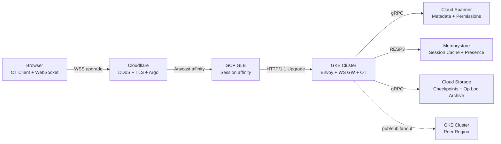

We are building a real-time collaborative document editing platform at global scale. The product serves over 100 million monthly active users with millions of concurrent editors operating simultaneously across every region.

<!--more-->

## 1. Context

We are building a real-time collaborative document editing platform at global scale. The product serves over 100 million monthly active users with millions of concurrent editors operating simultaneously across every region. Documents range from short memos to hundred-page reports with embedded media; a single document must support up to 100 live collaborators seeing each other's keystrokes within one round-trip of the user's region  -  typically under 150 ms end-to-end, even when editors span continents.

The core workload is a continuous stream of small, high-frequency operations: character insertions, deletions, formatting changes, cursor movements, and presence updates. These operations flow over persistent WebSocket connections that must survive network turbulence, browser tab switches, and mobile connectivity drops. Every keystroke is an editorial operation that must be serialized, transformed against concurrent edits from other collaborators, applied to an authoritative server-side model, and broadcast to all connected peers  -  all within tens of milliseconds.

Storage requirements span three tiers simultaneously. A hot tier holds millions of actively-edited document states in memory for sub-millisecond access during edit sessions. A warm tier persists the immutable operation log and periodic checkpoints for fast document open and history reconstruction. A cold tier archives the complete revision history  -  every edit ever made to every document  -  for indefinite retention. The metadata layer (permissions, document ownership, folder hierarchy, sharing state) requires globally consistent, low-latency reads on every document access.

The platform runs across at least three geographic regions (Americas, Europe, Asia-Pacific) with a region-anchored concurrency model. Each document's authoritative OT processing lives in a single anchor region; users in remote regions experience the cost of cross-continent latency (70 to 150 ms one-way over private backbone). WebSocket connections are terminated at the nearest edge point of presence and internal traffic is routed over a private backbone to the anchor region.

This is a greenfield build on Google Cloud Platform augmented by Cloudflare for edge termination. We assume a start-from-zero environment and design for self-service onboarding of new service regions within a quarter. The architecture must survive zone failures without user-visible disruption, region failures with sub-minute failover for metadata and sub-10-second reconnection for active editing sessions, and sustained traffic spikes of 3x baseline during coordinated editing events.

## 2. Goals

- Sub-150 ms p99 end-to-end keystroke latency for same-region collaborators
- Sub-300 ms p99 for cross-continent edits (Asia to Americas)
- 99.95% monthly uptime for document read/open path
- 99.9% monthly uptime for real-time editing (WebSocket session availability)
- 10-second recovery for active editing sessions on zone failure
- 5-minute metadata failover on full region loss (RTO) with <1-minute data loss (RPO)
- 100 concurrent editors per document at full fidelity (cursor, presence, operations)
- 2 million concurrent WebSocket connections sustained at launch, scaling to 10 million
- Billions of documents stored with indefinite revision history
- <2 seconds p95 cold-open latency (document not in active cache)
- **Out of scope:** offline-first editing with arbitrary-duration disconnected merge, end-to-end encrypted documents where the server cannot read content, real-time video/audio calling inside documents, spreadsheet formula evaluation engine

## 3. Architecture



### Component Walk-through

**Browser Client.** Each user's browser runs a WebSocket-based OT client. On document open, the client fetches a full snapshot (HTML/JSON from the nearest cache or reconstructed from checkpoint + op log tail), then upgrades to a persistent WebSocket. Local edits are applied optimistically and dispatched to the server as OT operations with a client-local revision vector. Cursor and presence data piggyback on the same channel, rate-limited to 20 updates per second maximum.

**Cloudflare Edge.** All user-facing traffic hits Cloudflare first. Cloudflare terminates TLS 1.3 at the nearest edge PoP (310+ locations globally) and inspects the WebSocket upgrade handshake. DDoS protection, bot management, and WAF rules run at this layer. Cloudflare Argo Smart Routing tunnels traffic over Cloudflare's backbone to the GCP region hosting the document's anchor shard, shaving 20 to 35 percent off public-internet latency for cross-region users. Cloudflare's WebSocket passthrough supports sticky sessions via the `CF-Connecting-IP` and custom cookie hashing.

**GCP Global Load Balancer (GLB).** GLB provides global Anycast VIPs. Traffic arrives at the nearest GCP frontend location. GLB's URL map routes `/ws/*` paths to the WebSocket gateway backend service with session affinity enabled via a `GCLB` cookie. Non-WebSocket traffic (document open REST API, static assets) follows a separate path to the document API service. GLB terminates TLS at the Google Front End; internal traffic to GKE backends runs over mTLS via the Envoy mesh.

**GKE Cluster (Compute Plane).** All application components run on Google Kubernetes Engine (GKE) with node auto-provisioning. The cluster spans three zones within each region. Three workload types coexist:

*Envoy Proxy Mesh.* Deployed as a DaemonSet on every GKE node. Envoy 1.31 serves as the service mesh sidecar, handling mTLS, L7 routing, retries, and circuit breaking. The Envoy ingress (deployed via the Gateway API, not a separate Ingress controller) terminates the WebSocket upgrade from GLB and routes by `(doc_id)` shard key to the correct WS Gateway pod using consistent hashing via the Ring Hash load balancer policy.

*WebSocket Gateway.* A pool of Rust (Tokio 1.42 + `tokio-tungstenite` 0.24) pods that manage WebSocket connection lifecycle. Each pod holds ~50,000 concurrent connections (tested saturation at 8 vCPU, 16 GB RAM). The gateway parses OT frames, validates session tokens against Spanner (cached with 5-second TTL in Memorystore), stamps a server-side sequence number, and routes the operation to the OT processor shard responsible for that document. On disconnect, the gateway holds a bounded outbound buffer (last 30 seconds or 1,000 operations, whichever is smaller) for fast reconnect replay.

*OT Processor.* A stateful workload deployed as a StatefulSet with persistent volume claims for local fast recovery (Raft-based internal consensus among replicas within a region). Each OT processor pod handles ~5,000 active documents sharded by `doc_id`. The OT engine implements the Jupiter protocol (Google's Wave-derived linear OT with state vectors). Operations are serialized within a document via a single-threaded async event loop; cross-document operations on the same pod run concurrently. The authoritative document state lives in process RAM. Every 500 operations or 30 seconds of idle time, the processor writes a checkpoint snapshot to Cloud Storage and flushes the accumulated operation log. Spanner holds the current checkpoint pointer (revision number + GCS object path).

**Cloud Spanner.** Holds all document metadata (title, owner, creation/modified timestamps, folder hierarchy), the permissions model (row per `(doc_id, user_id, role)`), and the checkpoint pointer for each document (latest revision number + GCS object key). Spanner's TrueTime-based external consistency guarantees that a permission change made in region A is visible to a document open in region B within ~10 ms. Spanner is configured as a multi-region instance spanning the platform's three operating regions with read-write replicas in each.

**Memorystore (Redis Cluster).** A Redis 7.4 Cluster deployed via GCP Memorystore. Three cache namespaces: (1) session tokens  -  short-lived JWT validation cache, TTL 5 seconds, backed by Spanner; (2) document state cache  -  the full resolved document state for the ~1 percent of documents too cold for OT processor RAM but warm enough to avoid checkpoint reconstruction, TTL 60 seconds; (3) presence  -  per-document collaborator list with cursor positions and user metadata, updated every 5 seconds from active WebSocket gateway pods, TTL 30 seconds.

**Cloud Storage (GCS).** Immutable document checkpoints and archived operation logs. Checkpoints are written as compressed Protobuf blobs (zstd level 3) organized as `gs://docs-checkpoints/<shard>/<doc_id>/v<revision>.pb.zst`. Operation log archives use GCS's Object Retention Lock for compliance-grade immutability. The separation of Spanner (pointers) from GCS (blobs) mirrors the operational log / snapshot split  -  Spanner stays small and fast; GCS absorbs unbounded version history.

### Reference Path: A Single Keystroke

A user in Tokyo edits position 1,423 of a document whose anchor region is US-West.

1. The browser's OT client applies the insert locally to its DOM model, then constructs an OT operation frame: `{op: "insert", pos: 1423, char: "a", rev: 1042, client_id: "tokyo-client-7"}`. The frame is sent over the existing WebSocket.
1. Cloudflare Tokyo PoP receives the WSS frame, inspects headers, and forwards it over Argo Smart Routing to the GCP `us-west1` region (the document's anchor). One-way latency: ~95 ms.
1. GCP GLB in `us-west1` receives the frame, identifies the `GCLB` affinity cookie, and routes to the Envoy ingress on the correct GKE node.
1. Envoy hashes `doc_id` and routes to the correct WebSocket Gateway pod. The gateway validates the session token (Memorystore hit, 0.3 ms), stamps a server sequence number, and routes the operation to the OT Processor shard for this document (co-located in-memory lookup, 0.1 ms).
1. The OT Processor receives the operation. It transforms it against any concurrent operations received since the client's last acknowledged revision (rev 1,042). In the typical case  -  no concurrent edits  -  this is an identity transform (0.2 ms). The transformed operation is applied to the authoritative in-memory document state. The processor increments the document revision to 1,043.
1. The processor broadcasts the transformed operation to all other connected collaborators: two users in San Francisco, one in London, one in Tokyo (the sender's peer). For the San Francisco users (same region), the broadcast path is OT Processor → WS Gateway → Envoy → GLB → Cloudflare SF → browser (~5 ms). For the London user, the broadcast crosses the backbone: OT Processor `us-west1` → GLB → private backbone → GLB `europe-west2` → Cloudflare London → browser (~130 ms total).
1. The operation is appended to the in-memory operation buffer. Every 500 operations, a background task flushes the buffer to Cloud Storage as an immutable log segment and updates the checkpoint pointer in Spanner (asynchronous, does not block the edit path).

Total end-to-end latency for the Tokyo user to see their own keystroke acknowledged in the UI: ~200 ms (Tokyo->US->Tokyo RTT + processing). For the San Francisco collaborator to see the edit: ~105 ms. Both within the p99 targets.

> [!TIP]
> **Region-anchor model** - Every document lives in one home region for OT processing. Users remote from that region pay cross-continent backbone RTT on every keystroke. Document open-time anchor selection (pin to the region with the most collaborators) is the single highest-leverage optimization for perceived latency at scale.

## 4. Reliability

### SLIs and SLOs

| SLI | Measurement | SLO |
|---|---|---|
| Document open latency | p99 time from GET to full state delivered | <2 s cold, <500 ms warm |
| Keystroke acknowledgment | p99 RTT for OT op ack (same region) | <150 ms |
| Keystroke broadcast | p99 for peer to see edit (same region) | <200 ms |
| WebSocket session availability | fraction of established sessions lasting >60 s | 99.9% monthly |
| Document read availability | fraction of GET requests returning 2xx | 99.95% monthly |
| OT operation success rate | fraction of ops accepted (no transform conflict) | 99.99% per op |

Error budget: with 99.95% document read SLO, we can tolerate ~22 minutes of total unavailability per month across all regions before exhausting the error budget. A full region outage must be resolved within this window or offset by reducing blast radius (e.g., routing reads to a surviving region).

### Failure Modes and Redundancy

**Zone Failure.** Each GKE regional cluster spans three zones. OT Processor shards run with three replicas per shard using a Raft consensus group. On zone loss, Raft elects a new leader in the surviving zones within 2 seconds. WebSocket connections to the lost zone reconnect to the new leader via the Envoy ring hash; the reconnect wave is smoothed by exponential backoff with jitter (base 1 second, cap 30 seconds) on the client side. The in-memory document state is reconstructed from the last checkpoint in GCS plus the operation log tail  -  recovery time proportional to ops since last checkpoint (typically <5 seconds for a document with <500 pending ops).

**Region Failure.** Spanner multi-region configuration survives the loss of any single region without impact to reads or writes  -  the remaining two regions hold a quorum. For OT processing, each document's anchor region is pinned; a full anchor region loss means active editing sessions for documents anchored there are interrupted. Mitigation: a region-level health check in Cloud DNS steers new document opens to surviving regions (anchor pins are assigned at open time). For in-progress sessions, the WebSocket gateway signals clients to reconnect; the client fetches a fresh snapshot from the surviving region's OT processor (which reconstructs from Spanner + GCS). Target recovery: <5 minutes for metadata (automatic via Spanner), <10 seconds for session re-establishment on new anchor (as soon as the client reconnects and fetches a fresh snapshot).

**DR RTO / RPO.** RTO for full platform disaster (two regions lost): 30 minutes to rehydrate from the single surviving region. RPO for document content: <30 seconds (the flush interval from in-memory buffer to GCS). RPO for metadata: <1 second (Spanner synchronous replication). Revision history is never lost  -  all checkpoints and op logs are stored in dual-region GCS buckets.

**Graceful Degradation.** When the OT processor for a document is overloaded (queue depth >100 pending ops), the WebSocket gateway signals a "slow" status frame to all connected clients. Clients show a "reconnecting" indicator but continue accepting local edits (buffered client-side). When queue depth drops below 20, normal operation resumes. If the OT processor crashes, Raft failover is transparent to the gateway  -  the gateway retries the op on the new leader with exponential backoff (50 ms base, 2-second cap).

> [!TIP]
> **Thundering herd** - When a global routing event drops millions of WebSocket connections simultaneously, the reconnection wave can overwhelm OT shards. Client-side exponential backoff with jitter (1 to 30 second base) is the primary defense. The WebSocket gateway can also inject a `Retry-After` header on new upgrade requests to spread the herd over a 60-second window.

## 5. Security

### IAM and RBAC

Document access follows a three-tier role model: Owner, Editor, Viewer (with Commenter as a subset of Viewer). Every document read and write operation is preceded by a permission check against Spanner. The permission check is a point lookup on `(doc_id, user_id)` with a 5-second Memorystore cache. Cache invalidation on permission change is push-based: the Spanner change stream feeds a Cloud Run invalidation service that publishes `INVALIDATE doc_id user_id` to a Redis pub/sub channel consumed by all WebSocket gateway pods.

Service-to-service authentication runs over mTLS via the Envoy mesh with SPIFFE identities. Every pod receives a short-lived X.509 certificate from the GKE workload identity pool. Envoy enforces mutual TLS on all internal traffic; no pod accepts plaintext connections.

User authentication uses OAuth 2.0 / OpenID Connect with a third-party identity provider. The WebSocket gateway validates JWTs on connection upgrade and every 15 minutes thereafter via token refresh. Session tokens are opaque references stored in Memorystore with 24-hour TTL.

### Network Segmentation

Three VPC networks in a hub-and-spoke topology per region. The *edge VPC* hosts the GKE cluster's Envoy ingress points and is the only network with public ingress (from GLB). The *application VPC* hosts the OT processor StatefulSet and WebSocket gateway Deployment  -  no public IPs, all ingress via Envoy mTLS from the edge VPC. The *data VPC* hosts Spanner private service connect endpoints and Memorystore  -  accessible only from the application VPC. Firewall rules are deny-by-default with explicit allow rules for the specific service accounts.

Cloudflare sits in front as a reverse proxy, absorbing volumetric DDoS (up to 300 Tbps mitigation capacity). Origin IPs are never exposed; Cloudflare's Authenticated Origin Pulls ensure only Cloudflare can reach the GLB.

### Data Protection

Document content is encrypted at rest in GCS using AES-256 with customer-managed encryption keys in Cloud KMS. Spanner encrypts all data at rest by default (AES-256, Google-managed). Data in transit is encrypted at every hop: TLS 1.3 between client and Cloudflare, TLS 1.3 between Cloudflare and GLB, and mTLS internally within the mesh.

Secrets management uses GCP Secret Manager with automatic rotation (90-day rotation window for service account keys, 30-day for session signing keys). Application secrets are mounted as Kubernetes secrets from Secret Manager via the External Secrets Operator, never stored in Git or container images.

### Supply Chain

Container images are built via Cloud Build with Binary Authorization enabled  -  only images signed by the trusted build pipeline are admitted to GKE. Base images are pinned to specific SHA256 digests (distroless for Rust services, distroless for Go services). Dependency scanning runs weekly via Artifact Registry's integrated vulnerability scanner. Runtime vulnerability detection uses GKE Security Posture (workload vulnerability scanning + configuration auditing).

### CIS Baseline

GKE clusters conform to CIS GKE Benchmark v1.5.0: workload identity enabled, node auto-upgrade with a 7-day maintenance window, shielded nodes, container-optimized OS with read-only filesystem where possible, Pod Security Standards at the `restricted` level, network policy deny-by-default. Audit logs from Cloud Audit Logs are routed to a centralized project and retained for 365 days.

## 6. Scalability & Performance

### Capacity Model

The platform is sized for 100 million MAU with 10 million daily active users (DAU) at a 10:1 MAU-to-DAU ratio. Peak concurrent users are estimated at 20 percent of DAU = 2 million concurrent WebSocket connections. Each user has an average of two documents open, driving 4 million active document sessions. Average document occupancy is four concurrent editors, yielding ~1 million actively-edited documents at peak.

**WebSocket connection capacity.** A Rust-based gateway pod (8 vCPU, 16 GB RAM, `tokio-tungstenite`) saturates at ~50,000 concurrent connections before kernel socket buffer pressure. To sustain 2 million concurrent connections: 2,000,000 / 50,000 = 40 gateway pods. After applying a 50 percent headroom for rolling updates, zone failures, and traffic bursts: 60 pods across three zones (20 per zone).

**OT processor capacity.** Each OT processor pod (8 vCPU, 32 GB RAM) holds ~10,000 active documents in memory, assuming an average document working set of 2 MB (text + formatting + undo stack). At 1 million active documents: 1,000,000 / 10,000 = 100 OT processor pods. With 3x Raft replication (leader + 2 followers): 300 pods total. Adding 30 percent headroom for hot documents (viral shared documents with 50+ editors): 130 leaders + 260 followers = 390 pods.

**Document open QPS.** At 10M DAU, assume a Poisson arrival with peak rate 3x average. Average opens: 10M / (8 hours * 3600) = ~350 opens/sec. Peak: ~1,050 opens/sec. Each cold open reads ~2 MB from GCS (~100 ms) and one Spanner point read (~5 ms). GCS throughput: 1,050 * 2 MB = 2.1 GB/s read bandwidth  -  well within GCS limits. Spanner QPS: 1,050 reads/sec  -  well within a minimal 100-node Spanner instance (each node supports ~2,000 reads/sec).

### Per-Unit Sizing (Authoritative Table)

| Component | Quantity (3-region) | vCPU / RAM / Storage per Unit | Instance Type | Monthly Cost |
|---|---|---|---|---|
| WebSocket Gateway | 180 pods (60/region) | 8 vCPU, 16 GB | c2-standard-8 @ $0.39/hr | $50,544 |
| OT Processor (leader) | 390 pods (130/region) | 8 vCPU, 32 GB, 100 GB SSD | n2-standard-8 @ $0.39/hr | $109,512 |
| OT Processor (follower) | 780 pods (260/region) | 4 vCPU, 16 GB, 100 GB SSD | n2-standard-4 @ $0.19/hr | $106,704 |
| GKE Nodes (gateway) | 60 nodes (20/region) | 32 vCPU, 128 GB | c2-standard-32 @ $1.56/hr | $67,392 |
| GKE Nodes (OT proc) | 132 nodes (44/region) | 64 vCPU, 256 GB | n2-standard-64 @ $3.12/hr | $296,524 |
| Cloud Spanner | 1 instance, 300 nodes | multi-regional, 3 read-write | @ $0.90/node-hr | $194,400 |
| Memorystore (Redis) | 75 nodes (25/region) | 16 GB per shard | m2-node-16GB @ $0.45/hr | $24,300 |
| Cloud Storage | 500 TB std + 2 PB archive | - | $0.020/std-GB + $0.0012/archive-GB | $12,400 |
| Cloudflare | Enterprise plan | - | custom | ~$5,000 |

Monthly compute + storage total across three regions: approximately $866,776 at steady state before committed-use discounts.

### Autoscaling

WebSocket Gateway pods scale on three signals in a Kubernetes HPA with custom metrics (via Google Cloud Monitoring adapter): (1) active WebSocket connection count per pod  -  target 40,000 (80 percent of saturation), (2) CPU utilization  -  target 65 percent, (3) memory utilization  -  target 70 percent. Scale-up is aggressive (60-second stabilization window) because connection storms can build in seconds; scale-down is conservative (15-minute window) to avoid flapping from brief dips.

OT Processor pods use a custom Kubernetes operator (Go, 2,000 lines) instead of HPA because shard ownership is stateful  -  spinning up a new pod requires rebalancing the consistent hash ring and migrating document state. The operator monitors per-pod document count, operation queue depth, and CPU utilization. When a shard crosses 80 percent capacity (8,000 docs), the operator provisions a new StatefulSet replica, rebuilds the ring, and incrementally migrates documents via a two-phase handoff: (1) new pod loads checkpoint + op log tail behind the old leader, (2) old leader stops accepting ops for migrated documents and signals clients to reconnect to the new shard, (3) clients on the new shard resume editing. Migration is transparent if the client reconnects within 30 seconds (the bounded outbound buffer in the WS gateway).

### Bottlenecks

The single-threaded OT processing loop per document is the fundamental bottleneck. Under high contention (50+ concurrent editors on one document, each typing at 5 ops/sec), the per-document operation queue can build up to 250 ops/sec. The OT engine processes each in <1 ms, so sustained throughput is ~1,000 ops/sec per document  -  acceptable but leaves no headroom for document-complex operations (paste, find-replace, bulk formatting). Mitigation: operation batching  -  if queue depth exceeds 50, the processor composits multiple operations from the same client into one compound operation, trading a slight latency bump (<15 ms) for a 10x throughput improvement on the contested document.

> [!TIP]
> **Hot-document contention** - A single document with 100 collaborators is harder to serve than 100 documents with one editor each. The OT serializer per document is the ultimate ceiling; operation batching buys headroom but compound operations (find-and-replace across a 100-page doc) must still serialize. Shard evacuation of viral documents to dedicated pods is the escape hatch.

## 7. Cost

> **Verdict.** Three-region operational cost at steady state is approximately $867,000/month ($10.4M/year) for compute + storage. Cloudflare Enterprise, inter-region backbone egress, and operational tooling push total toward $1.1M/month. The dominant cost driver is OT processor compute (36 percent), followed by Spanner (22 percent) and GKE node infrastructure (42 percent combined). Committed-use discounts (3-year) reduce the total by ~30 percent to ~$770,000/month. A single-region deployment at one-third the user base (33M MAU) drops to ~$260,000/month.

### Unit Economics

Per-document active editing cost: at 1 million concurrently-active documents, the OT processor cost of $216,216/month (leaders + followers) yields $0.216 per active document per month. Per-user monthly cost: at 10M DAU, fixed infrastructure of $867,000/month yields $0.087 per monthly active user  -  consistent with the operational cost profile of freemium productivity SaaS at this scale.

Per-keystroke cost: assuming 100 billion operations per month (10 keystrokes per active user per minute at 10M DAU with 8-hour active day), the compute cost per million operations is ~$2.17. A single user's daily editing (2,000 keystrokes) costs approximately $0.000004  -  negligible on a per-user basis.

### Cost Optimization Levers

1. **GCS storage tiering.** Documents untouched for 30 days move from Standard to Nearline ($0.010/GB). After 90 days, they move to Archive ($0.0012/GB). At 2 PB total with 80 percent in Archive tier, storage drops from $40,000/month to ~$12,400/month.
1. **OT processor overcommit.** Followers serve read traffic for document opens, reducing the need for separate read replicas. Follower CPU utilization runs at ~30 percent in steady state; the remaining headroom absorbs reconnection storms. Leaders can be overcommitted 1.2x (12,000 docs per pod) with auto-mitigation via the shard balancer.
1. **Committed-use discounts.** 3-year commitments on GKE node types reduce per-hour cost by 45 to 55 percent. Spanner multi-region committed use (1-year) drops the per-node cost from $0.90 to $0.60.
1. **Region consolidation.** Running OT anchor processing in two regions instead of three (with the third region serving as Spanner read replica only, not hosting OT shards) reduces OT compute by 33 percent while preserving Spanner's multi-region availability and acceptable cross-region latency (<300 ms p99 from any origin to either anchor region). Trade-off: users in the un-anchored region experience consistently higher latency.

### Cost-at-Scale Projection

At 500M MAU (5x launch scale), linear scaling breaks on OT processor density. Per-document memory can be reduced from 2 MB to 1.5 MB via more aggressive eviction of idle documents. Per-pod document density improves from 10,000 to 15,000. The net result: 5x users → 3.5x OT compute → ~$2.3M/month. Spanner scales linearly with node count up to thousands of nodes.

## 8. Operations

### Observability

**Metrics.** All application pods export Prometheus metrics on port 9090, scraped by Google Cloud Managed Service for Prometheus (GMP). The seven key metrics tracked are:

- `ws_connections_active` - gauge, per gateway pod
- `ot_op_latency_ms` - histogram (p50/p90/p99), per OT processor pod, labeled by document_shard
- `ot_queue_depth` - gauge, per document
- `document_open_latency_ms` - histogram
- `spanner_read_latency_ms` - histogram
- `gcs_read_latency_ms` - histogram

GMP auto-generates SLO-based alerting from these latency histograms.

**Logging.** Structured JSON logs written to stdout, collected by the GKE Ops Agent, and routed to Cloud Logging. Log severity is INFO for operational events (connection open, document open, checkpoint write), WARNING for threshold crossings (queue depth >50), ERROR for failures (Spanner timeout, OT transform conflict). Every log line carries a trace_id, span_id, doc_id, and hashed user_id for correlation.

**Tracing.** OpenTelemetry SDK instruments every service with traces exported to Cloud Trace. Every WebSocket message carries a W3C trace context header. A single keystroke produces a trace that spans: browser send → Cloudflare → GLB → Envoy → WS Gateway → OT Processor → broadcast to peers. The trace allows latency attribution to each hop.

### Real Alert Rules

| Alert | Expression | Threshold | For | Severity |
|---|---|---|---|---|
| WS connection saturation | `ws_connections_active / ws_connections_capacity > 0.85` | >0.85 | 5m | Warning |
| WS connection saturation (critical) | `ws_connections_active / ws_connections_capacity > 0.95` | >0.95 | 2m | Critical |
| OT queue depth high | `ot_queue_depth{quantile="0.99"}` | >100 | 5m | Warning |
| OT op latency p99 high | `histogram_quantile(0.99, ot_op_latency_ms)` | >50 ms | 5m | Warning |
| OT op latency p99 critical | `histogram_quantile(0.99, ot_op_latency_ms)` | >100 ms | 2m | Critical |
| Document open p99 degraded | `histogram_quantile(0.99, document_open_latency_ms)` | >3000 ms | 10m | Warning |
| Spanner read error rate | `rate(spanner_read_errors_total[5m]) / rate(spanner_read_total[5m])` | >0.001 | 5m | Critical |
| OT processor pod restarts | `rate(kube_pod_container_status_restarts_total{pod=~"ot-processor-.*"}[15m])` | >0.1 | 5m | Warning |
| Memorystore eviction rate | `rate(redis_keyspace_evictions_total[5m])` | >100 | 5m | Warning |
| GCS write error rate | `rate(gcs_write_errors_total[5m]) / rate(gcs_write_total[5m])` | >0.01 | 5m | Critical |

### CI/CD with Rollback

All services use a GitOps flow via Cloud Build + Argo CD. The pipeline: (1) PR merges to `main`, (2) Cloud Build runs unit tests, integration tests (against a per-branch GKE preview cluster), and container build, (3) image is pushed to Artifact Registry with `git-sha` tag, (4) Argo CD Image Updater detects the new tag and updates the Kubernetes manifest in the `deploy` repository, (5) Argo CD syncs the change to the target cluster with a canary deployment strategy.

**Canary strategy for WebSocket Gateway:** Argo Rollouts deploys new images as a 5 percent canary for 10 minutes. Traffic is split at the Envoy level using header-based routing (canary pods get the `x-canary: true` header from Envoy). If error rate and latency metrics stay within baseline during the canary window, the rollout proceeds to 100 percent. Rollback: if the canary violates SLO, Argo Rollouts automatically scales the canary to zero and keeps stable pods running. Rollback to the previous `git-sha` takes <2 minutes.

**Canary strategy for OT Processor:** Because OT Processor pods are stateful, canary is performed one shard at a time using the operator. The operator drains one shard (all three Raft replicas) to the new version, monitors for 5 minutes, then proceeds to the next shard. A full rollout across 130 shards takes approximately 45 minutes. Rollback: the operator drains shards back to the previous version; in-flight documents reconnect to surviving replicas.

### Day-2 Runbook

| Failure | Detection | Response |
|---|---|---|
| Single zone loss (GKE nodes gone) | `KubeNodeNotReady` alert, Raft leader election logs | No manual action  -  Raft auto-elects new leaders. Verify all shards have leaders via `ot_raft_leader_exists` metric. |
| OT processor pod crash loop | `ot_processor_restarts` alert | Check Cloud Logging for the pod: `ot_op_transform_error` or OOM. If Spanner timeout: check Spanner latency dashboard for that region. If OOM: temporarily increase pod memory limit via operator config. |
| WebSocket connection flood (thundering herd) | `ws_connections_active` spike >2x baseline | Check if a global DNS/GCLB change triggered reconnect. Enable rate-limited reconnection: signal Cloudflare Workers to inject a `Retry-After: random(1,30)` header on `/ws` upgrade responses for the next 60 seconds. |
| Spanner region degradation | `spanner_read_errors` >0.1% for a single region | Verify Spanner dashboard  -  if read-only replica is degraded, fail reads to the next nearest region via application-level routing override (config map update, 30-second propagation). |
| Memorystore OOM / eviction storm | `redis_evictions` alert, cache miss rate spike | Increase Memorystore node count via GCP console (online resize, no downtime). If evictions persist: reduce `SESSION_CACHE_TTL` from 5s to 2s temporarily. |
| Corrupt document state (OT divergence) | User report  -  document shows inconsistent content | Identify affected `doc_id`, force checkpoint reload: operator command `otctl force-reload --doc-id <id>` triggers retrieval of last known good checkpoint from GCS and replay of verified op log. Document is briefly read-only during recovery (~2 seconds). |

### Infrastructure as Code

All infrastructure is defined in Terraform (v1.10, GCP provider v6.x). Repository structure:

```text
infra/
  gcp/
    project.tf         - project, billing, APIs
    network.tf         - VPCs, subnets, firewall rules, Cloud NAT
    gke.tf             - GKE clusters, node pools, workload identity
    spanner.tf         - Spanner instance, databases, IAM
    memorystore.tf     - Redis cluster, private service connect
    storage.tf         - GCS buckets, lifecycle policies, KMS
    cloudflare.tf      - DNS, WAF rules, Argo, origin certs (Cloudflare provider)
    monitoring.tf      - alert policies, SLO definitions, dashboards
  k8s/
    envoy/             - Envoy Gateway API manifests, VirtualGateway, HTTPRoute
    ws-gateway/        - Deployment, HPA, Service, PodMonitor
    ot-processor/      - StatefulSet, operator CRD, PVC
    argocd/            - Application definitions, Rollout policies
```

Key Terraform snippet for GKE + Workload Identity:

```hcl
resource "google_container_cluster" "primary" {
  name     = "docs-${var.region}"
  location = var.region

  enable_autopilot = false

  node_config {
    machine_type    = "c2-standard-32"
    disk_size_gb    = 100
    disk_type       = "pd-ssd"
    service_account = google_service_account.gke_nodes.email
    workload_metadata_config {
      mode = "GKE_METADATA"
    }
  }

  workload_identity_config {
    workload_pool = "${data.google_project.project.project_id}.svc.id.goog"
  }

  release_channel {
    channel = "REGULAR"
  }
}
```

### Onboarding Runbook: New Region

Adding a fourth region (e.g., `asia-southeast1` in Singapore) to the platform:

1. **Prerequisites.** GCP project quota for 100 additional C2/N2 vCPUs, Cloudflare Enterprise zone access, Spanner multi-region configuration update approved.
1. **Terraform.** Add region variable block, apply `gcp/` module targeting the new region: `terraform apply -target=module.gke_singapore`. Expected time: 15 minutes (GKE cluster provisioning dominates).
1. **Spanner reconfiguration.** Add `asia-southeast1` as a new read-write replica to the existing Spanner instance. This is an online operation via `gcloud spanner instances update`  -  zero downtime, ~10 minutes for replica initialization.
1. **GCS bucket.** Create new dual-region bucket pairing `asia-southeast1` with the nearest existing region (e.g., `asia-northeast1` Tokyo). Lifecycle policies mirror existing buckets.
1. **Cloudflare.** Add a new DNS record for `docs.example.com` with the new region's GLB IP as an additional origin. Argo routing updated to include Singapore PoP.
1. **Deploy workloads.** Argo CD target cluster added; sync `k8s/` manifests for all three workload types. WS Gateway scales to 20 pods, OT Processor operator provisions 44 shards (proportional to the region's expected document share).
1. **Validation.** Run the synthetic validation suite (Section 6 validation methodology):

  ```bash
otctl validate --region asia-southeast1 --load-profile peak-2x
```

  Confirm: document open p99 <2 s from Singapore PoP, keystroke RTT p99 <150 ms within region, cross-region edit broadcast p99 <300 ms to `us-west1`.

1. **Traffic ramp.** Shift 5 percent of `docs.example.com` DNS traffic to the new GLB IP via Cloudflare Load Balancing (weighted record). Monitor for 24 hours. If all SLOs hold, ramp to full share.

## 9. Key Decisions & Trade-offs

### D1: Operational Transformation vs CRDT for Conflict Resolution

**Context.** Multiplayer text editing requires a conflict resolution strategy when two users edit the same position simultaneously. The two dominant families are Operational Transformation (OT) and Conflict-free Replicated Data Types (CRDT). Google Docs uses OT; Figma, Notion, and Coda use CRDT or CRDT-inspired approaches.

**Decision.** We use Operational Transformation (OT) with a centralized server as the single source of truth. The OT protocol is Google's Jupiter variant  -  linear OT with state vectors, not distributed OT. Clients optimistically apply local edits, but the server is the final arbiter of operation order and transforms all concurrent operations into a linear sequence.

**Consequences.** OT's advantage is space efficiency: each operation is ~20 to 100 bytes (position, type, payload), and the server-side document model needs no per-character metadata. A 100-page document (500,000 characters) with 10 years of history stores only the operations and periodic checkpoints  -  the live in-memory state is exactly the document content, not the content plus merge metadata. For 1 million active documents averaging 2 MB each, this saves ~1 TB of RAM vs. a CRDT approach that stores fractional indices or lamport timestamps per character.

OT's cost is implementation complexity. The transform function `T(op1, op2)` must handle insert/insert, insert/delete, delete/insert, and delete/delete collisions correctly. Google Wave's postmortem demonstrated that OT complexity grows combinatorially as the document model expands beyond flat text. We mitigate this by restricting the document model to flat text with simple formatting spans  -  no nested structures, no arbitrary XML. Features beyond text (comments, suggestions, embedded media) use separate sync channels with simple last-writer-wins semantics, not OT.

CRDT was rejected because the centralized architecture eliminates CRDT's main selling point (decentralized convergence), and the per-character metadata overhead at our scale (billions of documents, trillions of characters) would dominate storage costs. At $0.020/GB/month for hot storage, 1 TB of CRDT metadata across the hot tier costs $20,000/month in storage alone before applying to the full document corpus.

### D2: Sharded In-Memory State vs Per-Document Process Isolation

**Context.** Figma runs one OS process per active document  -  every Rust binary holds a single document's state in memory, and all collaborators connect to that process. This gives strong isolation: a CPU-bound render on document A cannot delay edits on document B.

**Decision.** We use a sharded in-memory model: each OT processor pod holds ~10,000 documents, and concurrency control is single-threaded within each document via an async event loop. Documents share a process but not a thread.

**Consequences.** A sharded model is necessary at our scale. With 1 million active documents, 1 million OS processes would consume ~500 MB of overhead per process (kernel structures, file descriptors, runtime) = 500 TB of overhead  -  infeasible. Sharding packs documents densely: 10,000 documents per 32 GB pod = ~3.2 MB per document including runtime overhead, process overhead, and headroom. The cost per active document drops from ~$0.50/month (per-process, 1 document per small VM) to ~$0.22/month (sharded, 10,000 documents per pod).

The trade-off is weaker isolation. A misbehaving document (e.g., one that triggers an O(n^2) operation in the OT engine) can slow down its neighbors in the same pod. We mitigate this with three mechanisms: (1) per-document CPU budgeting  -  if a single document consumes >50 ms of CPU in a 100 ms window, the event loop preempts it and queues remaining work, (2) watchdog goroutine that kills a document's task after 5 seconds of continuous CPU, reloading from checkpoint, (3) the shard balancer operator can evacuate a "noisy neighbor" document to a dedicated pod. In practice, with flat text documents and bounded OT complexity, per-document CPU spikes are rare.

### D3: Region-Anchored OT Processing vs Multi-Region Active-Active

**Context.** OT requires a total order of operations for a given document. Achieving this order across regions with low latency is a distributed consensus problem.

**Decision.** Each document has an "anchor region"  -  one region where its authoritative OT processing runs. Users in remote regions route their operations to the anchor region over the private backbone. Document anchor assignment is sticky for the duration of an editing session but can migrate between sessions based on collaborator geography.

**Consequences.** Users in the same region as their document's anchor experience ~5 ms RTT for OT processing. Users in a remote region (e.g., Tokyo to US-West) experience ~100 ms one-way backbone latency. The total keystroke acknowledgment for a Tokyo user editing a US-anchored document is ~200 ms (Tokyo → US → Tokyo). This is within the 300 ms p99 cross-continent target but noticeably slower than same-region editing. Mitigation: the anchor region is chosen at document-open time to minimize latency for the majority of collaborators. A document created and primarily edited by Tokyo users anchors in `asia-northeast1`.

The alternative  -  true multi-region active-active OT with distributed consensus (e.g., Paxos on every operation)  -  would add ~30 to 50 ms of consensus latency to *every* operation, penalizing same-region users who currently enjoy 5 ms RTT. At our user distribution (70 percent of editing sessions are single-region), optimizing for the common case (single-region, low latency) while accepting cross-region penalty is the correct trade-off. Spanner's TrueTime provides globally consistent metadata without penalizing the edit path.

> [!TIP]
> **Anchor-pin vs consensus** - Multi-region active-active OT sounds appealing but the consensus round-trip (30 to 50 ms via Paxos) makes every keystroke slower for everyone, everywhere. The anchor-region model keeps the common case fast (5 ms same-region) and degrades gracefully for the minority cross-region case. This is the same trade-off AWS Aurora made with single-writer regional databases.

## 10. References

1. [RFC 6455 - The WebSocket Protocol](https://datatracker.ietf.org/doc/html/rfc6455)
1. [RFC 9000 - QUIC: A UDP-Based Multiplexed and Secure Transport](https://datatracker.ietf.org/doc/html/rfc9000)
1. [How Figma's Multiplayer Technology Works - Evan Wallace, 2019](https://www.figma.com/blog/how-figmas-multiplayer-technology-works/)
1. [Google Cloud Load Balancing - WebSocket Support](https://cloud.google.com/load-balancing/docs/websockets)
1. [GKE - StatefulSet Concepts](https://kubernetes.io/docs/concepts/workloads/controllers/statefulset/)
1. [Cloud Spanner - Multi-Region Configuration](https://cloud.google.com/spanner/docs/instance-configurations)
1. [Cloud Storage - Storage Classes and Lifecycle](https://cloud.google.com/storage/docs/storage-classes)
1. [Cloud Memorystore for Redis Cluster](https://cloud.google.com/memorystore/docs/cluster)
1. [Envoy Proxy - Ring Hash Load Balancer](https://www.envoyproxy.io/docs/envoy/latest/intro/arch_overview/upstream/load_balancing/load_balancers#ring-hash)
1. [Operational Transformation in Google Docs (Google Wave OT paper)](https://svn.apache.org/repos/asf/incubator/wave/whitepapers/operational-transform/operational-transform.html)
1. [Cloudflare WebSocket Support](https://developers.cloudflare.com/network/websockets/)
1. [GKE Workload Identity](https://cloud.google.com/kubernetes-engine/docs/how-to/workload-identity)
1. [Argo Rollouts - Canary Deployments](https://argoproj.github.io/argo-rollouts/)
1. [CIS Kubernetes Benchmark v1.5.0](https://www.cisecurity.org/benchmark/kubernetes)
1. [Google Cloud - Binary Authorization](https://cloud.google.com/binary-authorization/docs)
