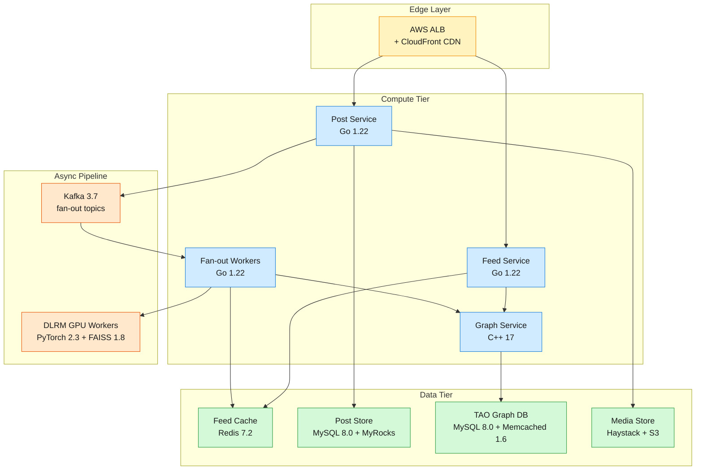

A News Feed serves personalized, ranked streams of posts from friends, followed Pages, and Groups to over 2 billion registered users, with 1.5 billion daily active users generating roughly 1 billion posts per day.

<!--more-->

## 1. Context

A News Feed serves personalized, ranked streams of posts from friends, followed Pages, and Groups to over 2 billion registered users, with 1.5 billion daily active users generating roughly 1 billion posts per day. The core tension is the fan-out amplification: every post creation triggers timeline insertion for every follower. At an average of 200 followers, 12K posts/sec become 2.4 million feed inserts/sec sustained  -  and a single celebrity post to 100 million followers creates 100 million write operations that would saturate any single storage node. Reads are equally demanding: 1.7 million peak queries per second against a 24 TB Redis feed cache, each returning a ranked page of 20-30 posts within a 200 ms P99 latency budget.

The system runs across multiple AWS regions (us-east-1 primary, eu-west-1 and ap-southeast-1 for regional latency reduction), with active-active feed serving in each region and cross-region replication for the social graph and post store. The ranking pipeline  -  a three-stage machine learning system from candidate retrieval through deep scoring to contextual re-ranking  -  must score thousands of candidates per feed request within the remaining latency budget after cache retrieval. The infrastructure is self-hosted on EC2 with managed backing services where availability guarantees permit.

This design covers the core feed serving and fan-out data plane: post creation and storage, the social graph used for follower resolution, the feed cache that holds pre-ranked timelines, the asynchronous fan-out pipeline, the ML ranking serving infrastructure, and media storage. The operational stack assumes a team of 8-12 platform engineers operating the data plane, with a separate ML infrastructure team managing the GPU serving fleet.

## 2. Goals

- Feed read P99 latency under 200 ms for the first ranked page of 20 posts
- New post visibility in follower feeds within 1 second (P99 fan-out propagation)
- 99.95% monthly availability for feed reads; stale feed tolerated over no feed
- Sustained write throughput of 2.4M feed inserts/sec with burst headroom to 10M/sec
- 1.7M peak read QPS served with 95%+ cache hit rate at the edge
- Full post deletion propagation to all follower feeds within 60 seconds for emergency takedowns
- Total infrastructure cost under $2.5M/month for the core data plane (feed cache, post store, fan-out workers, graph)
- **Out of scope:** Ad serving and sponsored content ranking, Messenger and chat infrastructure, live video streaming, Stories delivery, push notification delivery

## 3. Architecture



> [!TIP]
> **Topology thesis** - The architecture splits along the latency/throughput boundary. The read path (Feed Service to Redis) is a single hop with pre-ranked scores stored at write time. The write path (Post Service to Kafka to fan-out workers to Redis) is fully asynchronous, decoupling the user-facing post creation from the 2.4M/sec fan-out load. The ML ranker runs at fan-out time for regular users (scores baked into cache) and at read time for celebrity accounts (scored on pull), so 99.99% of feed reads never touch a GPU.

### Component walk-through

**Edge Layer.** AWS Application Load Balancer terminates TLS 1.3 and routes to the Feed and Post Services across three availability zones per region. CloudFront CDN caches media assets (images, video thumbnails) at edge locations, absorbing ~85% of media read bandwidth. The ALB uses least-outstanding-requests routing with cross-zone load balancing enabled.

**Feed Service (Go 1.22).** Stateless, horizontally scaled to ~800 instances across three AZs (c5.4xlarge, 16 vCPU, 32 GB RAM). Each instance handles ~2,100 QPS. On a feed read, it queries the user's Redis sorted set via `ZREVRANGEBYSCORE feed:<user_id> <cursor> -inf LIMIT 0 20`, checks a small in-memory bloom filter for deleted posts, and returns the post IDs with scores. On cache miss (<5% of requests), it triggers a rebuild: resolves the following set from the Graph Service, pulls recent posts from the Post Store, scores them via the ranking pipeline, and populates the cache. The service is deployed via a Kubernetes Deployment with a HorizontalPodAutoscaler targeting 70% CPU.

**Post Service (Go 1.22).** Accepts post creation requests, validates audience visibility, assigns a UUID v7 post ID (time-ordered for index locality), writes the post to the sharded Post Store, uploads media blobs to Haystack (returning CDN URLs), and publishes a `post_created` event to Kafka. Returns `{post_id, created_at}` synchronously in under 100 ms. The fan-out happens asynchronously  -  the author sees their own post immediately via client-side optimistic insertion. Scaled to ~400 c5.4xlarge instances, ~30 creates/sec per instance at peak.

**Graph Service (C++ 17).** Wraps TAO  -  Facebook's association store  -  for follower and following lookups. A `GET /followers/{user_id}` call resolves to a TAO edge query: a single-row MySQL lookup on the `assoc` table keyed by `(id1, type, id2)` where `type=FOLLOWED_BY`, returning a cursor over follower IDs. The service caches hot association lists in Memcached 1.6 with a lease-based consistency protocol: each cache entry carries a version, and reads verify against the backing MySQL only when the version is stale. Handles ~800K QPS at peak across ~200 c5.4xlarge instances.

**Fan-out Workers (Go 1.22).** A pool of ~1,200 workers consuming from Kafka 3.7 partitions. Each worker receives a `post_created` event, resolves the author's follower list from the Graph Service in batches of 1,000, calls the ML ranker to pre-compute per-follower scores, and pipelines `ZADD` operations into the Feed Cache Redis shards. Checkpointing uses a small Redis cluster (`fanout_state`) keyed by `post_id` with the last processed cursor offset. On worker crash, the Kafka consumer group rebalances and the worker resumes from the last checkpoint  -  `ZADD` is idempotent, so duplicate inserts are no-ops. For celebrity accounts (>50K followers), the worker writes only to the "hot set" (followers active within 30 days, ~1% of total) in the first phase; the remaining 99% are lazily fanned out over the next hour using spare worker capacity.

**Kafka 3.7 (fan-out queue).** A 30-broker cluster (r7i.2xlarge, 8 vCPU, 64 GB RAM, EBS gp3 1 TB per broker) hosting the `post_created` topic with 360 partitions. Producers (Post Service) write with `acks=1` for low latency; consumers (fan-out workers) commit offsets after each completed batch of 1,000 inserts. A separate `post_deleted` topic handles takedown events with higher priority consumers for emergency content removal. Topic retention is 24 hours  -  enough to replay a full day of posts if the fan-out pipeline stalls.

**Feed Cache (Redis 7.2).** A 200-node Redis cluster (r7i.2xlarge, 8 vCPU, 64 GB RAM) storing per-user sorted sets keyed as `feed:<user_id>`, each containing ~200-500 `(score, post_id)` pairs. Total hot data footprint: 24 TB. Sharding is by `user_id` hash, with each shard holding ~10 million user feeds. Reads are single `ZREVRANGEBYSCORE` calls with no application-level sorting. The cache uses no explicit invalidation: deleted posts are filtered at read time against a cluster-wide bloom filter backed by the Post Store's `is_deleted` flag. Score updates propagate lazily: each cache entry carries a `model_version` field, and on read a 5% chance of re-scoring with the current model version spreads the update load uniformly.

**Post Store (MySQL 8.0 + MyRocks).** Sharded MySQL with the MyRocks storage engine (LZ4 compression, 5-8x space reduction vs InnoDB for the append-heavy post workload). 48 shards across 16 r7i.8xlarge instances (3 shards per instance, 32 vCPU, 256 GB RAM), each shard holding ~40 TB raw (8 TB compressed). Shard key is `post_id` (UUID v7, time-ordered, giving good primary-key index locality for recent posts). The `Post` table schema carries `post_id, author_id, body, media_urls, audience, created_at, updated_at, is_deleted` with a secondary index on `(author_id, created_at)` for per-user timeline queries. ProxySQL 2.6 routes queries to the correct shard based on `post_id` hash and provides connection pooling (~50K connections across the fleet). Read replicas in each region (async replication, <100 ms lag) serve the cold read path when a feed cache miss triggers a Post Store query.

**TAO Graph DB (MySQL 8.0 + Memcached 1.6).** The social graph is stored as directional edges in a sharded MySQL cluster: the `assoc` table maps `(id1, type, id2, data, time)` where `type` encodes the relationship (`FOLLOWS`, `FOLLOWED_BY`, `FRIEND`). 16 shards on 8 r7i.2xlarge instances (2 shards each), with a Memcached 1.6 caching layer in front (~64 nodes, 128 GB each) that absorbs ~98% of association reads. The cache uses a lease-based consistency model: writes invalidate the cache entry's version, and reads that encounter a stale version fall back to MySQL.

**DLRM GPU Workers (PyTorch 2.3 + FAISS 1.8).** The ranking pipeline runs on a dedicated GPU fleet: 48 p4d.24xlarge instances (8× A100 40 GB each, 384 GPUs total). The two-tower retrieval model (FAISS 1.8 IVF index, 1,024 clusters, 256-dim embeddings) retrieves the top 1,000 candidates in ~8 ms. The DLRM scoring model (PyTorch 2.3, ~100 GB embedding tables sharded across GPUs via model parallelism) scores each candidate in ~15 ms. The contextual re-ranker (lightweight transformer, ~50M parameters) re-ranks the top 50 candidates enforcing diversity constraints in ~5 ms. GPU workers are stateless, fronted by a load balancer, and called at fan-out time for regular users (scores baked into the feed cache) and at read time for celebrity posts during cache-miss rebuilds. Model weights refresh every 4 hours from a training pipeline that runs on a separate training cluster.

**Media Store (Haystack + S3).** User-uploaded images and videos are stored as append-only blobs in Haystack directories on EBS gp3 volumes (1 TB per volume, 4 volumes per storage node, 24 storage nodes total). Each blob is indexed by a `(logical_volume, offset)` pointer stored in the Post metadata. On upload, the Post Service writes the blob to Haystack and returns a CloudFront CDN URL. Haystack's directory structure  -  one file per logical volume, sequential writes, no per-file inode overhead  -  keeps metadata small and write throughput high (~15 Gbps aggregate). Blobs older than 90 days migrate to S3 Standard-Infrequent Access with a Haystack redirect stub, cutting storage cost by ~40%.

### Life of a feed read

A user in the us-east-1 region opens the mobile app and requests their feed.

1. **Client → ALB → Feed Service.** The mobile client sends `GET /feed?cursor=&limit=20` with a JWT bearer token. The ALB terminates TLS, validates the JWT signature against a cached public key, extracts `user_id=bob`, and routes to the least-loaded Feed Service instance in the same AZ.
1. **Cache lookup.** The Feed Service hashes `bob` to Redis shard 42 (`crc32(bob) % 200`) and issues `ZREVRANGEBYSCORE feed:bob +inf -inf LIMIT 0 20`. Redis returns 20 `(score, post_id)` pairs. The Feed Service checks each `post_id` against the in-memory deleted-posts bloom filter  -  if a post was deleted, it is skipped and an additional entry is fetched to maintain 20 results.
1. **Celebrity pull (if applicable).** The Feed Service checks a cached set of `bob`'s followed celebrity accounts (updated every 60 seconds from the Graph Service). If `bob` follows any celebrities, it pulls the last 3 posts from each celebrity's timeline cache (a smaller Redis cluster, `celebrity_timeline:<celeb_id>`) and merges them into the result set.
1. **Re-rank merged results.** The merged list (pre-ranked regular-user posts + freshly-pulled celebrity posts) is sorted by score. The Feed Service applies a lightweight session diversity filter: max 2 posts from the same author in the top 10, and if the user skipped 3 video posts in this session, video weight is halved.
1. **Response.** The Feed Service returns `{posts: [{post_id, author_id, score, snippet, media_cdn_urls}], cursor: "<score_of_last_post>", has_more: true}`. Total latency from ALB ingress to response: ~12 ms (Redis RTT 2 ms + bloom check 1 ms + celebrity pull 3 ms + merge 2 ms + serialization 2 ms + headroom 2 ms).
1. **Cache miss path (<5% of requests).** If the Redis `ZREVRANGEBYSCORE` returns fewer than 20 entries (cold user, or feed was evicted after 30 days of inactivity), the Feed Service triggers a synchronous rebuild:
  - Resolve `bob`'s following set from the Graph Service: `GET /following/bob` returns ~200 user IDs from Memcached in ~2 ms.
  - Batch-fetch recent posts from the Post Store across relevant shards: `SELECT post_id, author_id, score, created_at FROM posts WHERE author_id IN (...) AND created_at > NOW() - INTERVAL 7 DAY ORDER BY score DESC LIMIT 500`. ProxySQL fans out and merges results in ~15 ms.
  - Send the 500 candidates to the DLRM GPU workers for scoring. The scoring request includes `bob`'s embedding (pre-computed hourly), per-candidate features (author affinity, post type, age, engagement velocity), and session context. Returns 500 scored candidates in ~20 ms.
  - Insert the top 200 into Redis: `ZADD feed:bob <score1> <post_id1> <score2> <post_id2> ...` (pipelined, ~3 ms).
  - Return the top 20 to the client. Total rebuild latency: ~45 ms  -  within the 200 ms P99 budget even with a cache miss.

## 4. Reliability

The News Feed is a tier-0 service: a stale or empty feed is a degraded user experience, but a completely unavailable feed means the core product is down. The reliability design targets 99.95% monthly availability (21.9 minutes of downtime per month) with a multi-region active-active topology.

### SLIs and SLOs

| SLI | Measurement | SLO |
|---|---|---|
| Feed read availability | `rate(http_requests_total{status=~"2.. | 4.."}[1m]) / rate(http_requests_total[1m])` |
| Feed read P99 latency | `histogram_quantile(0.99, rate(http_request_duration_seconds_bucket[5m]))` | <200 ms |
| Fan-out propagation P99 | `histogram_quantile(0.99, rate(fanout_propagation_seconds_bucket[5m]))`  •  time from `post_created` event to last follower's `ZADD` | <1 second |
| Post create availability | `rate(post_create_requests_total{status=~"2.."}[1m]) / rate(post_create_requests_total[1m])` | 99.9% monthly |
| Cache hit rate | `rate(feed_cache_hits_total[5m]) / (rate(feed_cache_hits_total[5m]) + rate(feed_cache_misses_total[5m]))` | >95% |
| Fan-out worker lag | `kafka_consumer_lag{group="fanout-workers", topic="post_created"}` | <10K messages per partition |

**Error budget.** At 99.95% availability, the monthly error budget is 21.9 minutes of total downtime. The error budget is consumed by planned maintenance (rolling deploys, Redis node replacements) and unplanned incidents. If the budget burn rate exceeds 5% per day, new feature deploys are frozen until the burn rate recovers. The budget policy is enforced via an automated deployment gate that queries the Prometheus error-budget burn-rate alert before allowing a production deploy.

### Failure modes and blast radius

**Redis shard failure (1 node out of 200).** When a single Redis node fails, ~0.5% of users (those whose `user_id` hashes to that shard) see cache misses on their next feed load. The Feed Service detects the connection refused/timeout (2-second connection timeout, 3 retries with exponential backoff) and falls back to the cache-miss rebuild path: it queries the Post Store and ranking pipeline synchronously. The rebuild path adds ~30 ms latency, still within the 200 ms P99 budget for the affected users. The failed Redis node is replaced by the cluster's auto-failover within 30 seconds (Redis Sentinel detects the failure, promotes a replica). Blast radius: 0.5% of users, self-healing within 30 seconds, no human intervention required for a single-node failure.

**Multi-node Redis failure (>10% of shards).** A correlated failure  -  AZ outage, network partition, or misconfiguration  -  that takes down 20+ Redis nodes affects >10% of users. The Feed Service's circuit breaker opens after 50% of Redis connections in a 10-second window fail, and all reads are routed through the cache-miss rebuild path for the affected shard range. The rebuild path (Post Store + GPU ranker) has ~10× lower throughput than the cache path  -  it can absorb ~170K QPS total vs 1.7M QPS for cache hits. At >10% shard loss, the rebuild path saturates: the Post Store and GPU workers become the bottleneck, and feed reads for affected users see P99 latencies of 500-800 ms or time out. The operational response is to shed non-critical read traffic (turn off the celebrity pull path, increase cursor page size to reduce request rate) and prioritize Redis node recovery.

**Kafka broker failure.** Kafka 3.7 is deployed with `replication.factor=3` and `min.insync.replicas=2`. A single broker failure has no impact: partition leaders fail over to in-sync replicas within seconds, and the fan-out workers' consumer group rebalances. Fan-out propagation latency increases by ~200 ms during rebalance (Kafka consumer group rebalance takes ~5-15 seconds for a 1,200-worker group). A two-broker failure in the same partition's replica set pauses fan-out for that subset of partitions until at least one replica recovers  -  during the pause, posts from authors whose partitions are affected are delayed but not lost (Kafka retains 24 hours of events).

**Post Store shard failure.** Each MySQL shard has one primary and two async read replicas across AZs. Primary failure triggers Orchestrator (MySQL topology manager) to promote the most up-to-date replica within 30 seconds. During the failover, writes to that shard are queued in the Post Service's in-memory buffer (up to 10K writes, ~3 seconds of data at peak) and replayed after the new primary is available. If the buffer overflows, writes are rejected with HTTP 503 and the client retries with exponential backoff. Reads during failover are served from the remaining replica with stale data (<100 ms replication lag).

**ML ranker GPU worker pool degradation.** If the GPU worker pool drops below 75% capacity (36 of 48 instances) due to a node failure or spot instance interruption, the fan-out workers slow down because scoring latency increases (fewer workers to handle the same load). Fan-out propagation P99 climbs from <1 second to 3-5 seconds. The circuit breaker trips if scoring latency exceeds 500 ms P99 for more than 60 seconds, and fan-out workers fall back to a lightweight linear model (stored locally, ~0.1 ms per score)  -  scores are less accurate but feed delivery continues. The lightweight model fallback is triggered automatically and the on-call is paged.

**Cross-region DR.** Each region (us-east-1, eu-west-1, ap-southeast-1) runs the full stack independently. The Post Store and TAO Graph replicate cross-region via MySQL async replication with ~100 ms lag. The Feed Cache is region-local (a user in Europe reads from eu-west-1 Redis, which only contains the European user's feed). If us-east-1 fails entirely, DNS (Route 53 latency-based routing with health checks) redirects traffic to eu-west-1 and ap-southeast-1. Users whose data was primarily in us-east-1 experience cold caches  -  their feeds are rebuilt on first read in the new region (~45 ms latency per user for the first page). The recovery time objective (RTO) is 5 minutes (DNS TTL 60 seconds + health check failure threshold of 3 consecutive failures at 30-second intervals = 150 seconds + regional stack verification). The recovery point objective (RPO) is <1 second for post data (async replication lag) and <100 ms for the social graph (TAO's Memcached layer is region-local; the backing MySQL is replicated).

> ⚠ **Correlated failure blind spot**  -  The cache-miss rebuild path shares the Post Store and GPU workers with the normal write path. During a large-scale Redis failure, the sudden flood of rebuild requests can overload these shared resources, creating a cascading failure where read retries amplify the load further. The circuit breaker must open early (at 50% Redis connection failure rate, not 80%) and shed load aggressively. A future hardening item is a dedicated "cold read" GPU pool that is isolated from the write-time scoring pool.

## 5. Security

### Identity and access (IAM / RBAC)

All service-to-service communication uses mTLS 1.3 with certificates issued by AWS Private Certificate Authority, rotated every 30 days via cert-manager 1.14. The identity model is per-service, not per-node: each service (Feed Service, Post Service, Graph Service, fan-out workers) has a unique X.509 certificate with a SPIFFE ID (`spiffe://newsfeed.prod/<service-name>`). Network policies in Kubernetes (Calico 3.27) enforce that the Feed Service can only connect to Redis (port 6379) and the Graph Service (port 8443), not directly to the Post Store or Kafka.

User authentication at the edge uses OAuth 2.0 with opaque tokens that the ALB exchanges for a short-lived JWT (5-minute expiry) via a sidecar authentication service. The JWT carries `{user_id, scopes: [feed:read, post:create, ...]}` and is validated by every downstream service on each request. JWTs are signed with RS256; the public key is distributed via a ConfigMap mounted into each service pod and refreshed every hour.

### Network segmentation

The stack runs in three tiers of network security groups:

- **Public tier (ALB only).** Accepts HTTPS from the internet on port 443. No other inbound rules. Egress restricted to the compute tier on service-specific ports.
- **Compute tier (all Go/C++ services).** No direct internet ingress. Accepts traffic only from the ALB on the service's health-check and gRPC ports. Egress to the data tier (Redis 6379, MySQL 3306, Kafka 9092) and to the GPU worker tier (gRPC 50051).
- **Data tier (Redis, MySQL, Kafka, Haystack, S3).** No internet access. Accepts traffic only from the compute tier and from within the data tier for replication. MySQL and Redis ports are never exposed outside the VPC.

Kubernetes NetworkPolicy resources mirror the security group rules at the pod level  -  even if a pod in the compute tier is compromised, it cannot reach the data tier's management ports (Redis 26379 Sentinel, MySQL 33062 admin).

### Data protection

**Encryption at rest.** EBS volumes for MySQL (Post Store, TAO), Redis (Feed Cache, checkpoint store), and Kafka brokers use EBS encryption with AWS KMS (customer-managed key, rotated annually). S3 buckets for media and Haystack archives use SSE-KMS. Redis data in memory is not encrypted (the performance penalty of in-memory encryption is prohibitive at 1.7M QPS); the threat model assumes physical access to Redis nodes is prevented by AWS data center controls.

**Encryption in transit.** All inter-service traffic uses mTLS 1.3. MySQL connections use TLS 1.3 with certificate verification. Redis connections use TLS 1.3 (Redis 7.2 built-in TLS, not stunnel). Kafka broker-to-client and inter-broker communication uses TLS 1.3 with mutual authentication.

**Secrets management.** All credentials (database passwords, Kafka ACLs, Redis AUTH tokens, API keys) are stored in AWS Secrets Manager and mounted into Kubernetes pods via the Secrets Store CSI Driver 1.4. Secrets are never in environment variables, ConfigMaps, or container images. Rotation is automated: Secrets Manager triggers a Lambda that updates the secret value and notifies services to reload via a SIGHUP sent through the Kubernetes API.

**User data.** Post content and user profiles are stored in MySQL. User-derived data (feed contents, social graph edges) is classified as PII and subject to GDPR data subject access requests. The Post Store partitions data by region: EU users' posts are stored in shards that reside only in eu-west-1, and cross-region replication for those shards is disabled. A user deletion request triggers a cascade: posts are marked `is_deleted`, the social graph edges are removed from TAO, and a `user_deleted` event flows through the fan-out pipeline to clear the deleted user's posts from all follower feed caches within 24 hours.

### Supply chain and compliance

Container images are built from a minimal distroless base (Google Distroless `gcr.io/distroless/static-debian12`), scanned with Trivy 0.50 in CI, and signed with Cosign 2.2. Only signed images are admitted to the cluster via Kyverno 1.11 admission policies. The Kubernetes control plane runs CIS Benchmark v1.8 hardened configuration, enforced via kube-bench 0.8 scans in the deployment pipeline. The infrastructure inherits AWS's SOC 2 and ISO 27001 certifications for the physical and hypervisor layers; application-level compliance is maintained through the access logging and encryption controls above.

## 6. Scalability & Performance

The capacity model is driven by two primary workloads: the write-path fan-out (2.4M feed inserts/sec sustained) and the read-path feed serving (1.7M QPS peak). The system scales horizontally at every tier, with the Redis feed cache as the primary scale bottleneck.

### Load model and growth

| Parameter | Current | 12-month projection | Driver |
|---|---|---|---|
| DAU | 1.5B | 1.7B (+13%) | User growth in emerging markets |
| Posts/day | 1B | 1.2B (+20%) | Increased posting frequency per DAU |
| Avg followers per user | 200 | 220 (+10%) | Network density increases over time |
| Feed inserts/sec (sustained) | 2.4M | 3.2M (+33%) | Posts/day × avg followers ÷ 86,400 |
| Peak read QPS | 1.7M | 2.0M (+18%) | DAU × feed requests/day ÷ 86,400 × peak-to-avg ratio (10×) |
| Feed cache footprint (TB) | 24 | 30 (+25%) | DAU × avg feed depth × entry size |

The peak-to-avg ratio of 10× is driven by timezone clustering: the US morning scroll (7-9 AM Eastern) concentrates ~40% of daily feed reads into a 2-hour window.

### Autoscaling policy

Each stateless tier uses Kubernetes HorizontalPodAutoscaler with custom metrics from Prometheus:

| Tier | Scale metric | Target | Min / Max | Scale-up cooldown |
|---|---|---|---|---|
| Feed Service | `rate(http_requests_total[1m])` per pod / target QPS | 2,000 QPS/pod | 400 / 1,200 | 60 s |
| Post Service | `rate(post_create_requests_total[1m])` per pod / target QPS | 30 creates/sec/pod | 200 / 600 | 60 s |
| Fan-out workers | `kafka_consumer_lag` per partition | <5,000 | 600 / 2,400 | 120 s |
| Graph Service | `rate(graph_assoc_requests_total[1m])` per pod / target QPS | 4,000 QPS/pod | 100 / 300 | 60 s |

Scale-down is conservative (300-second cooldown) to avoid oscillation during traffic dips. The cluster autoscaler (Karpenter 0.35) provisions additional EC2 instances when pods are pending, targeting a 60-second node provisioning time via pre-warmed AMIs.

The GPU worker pool uses a separate scaling mechanism: AWS Auto Scaling groups with a target tracking policy on `avg_gpu_utilization` (target 70%). Spot instances (p4d.24xlarge, 70% of the pool) are supplemented by on-demand instances (30%) to handle spot interruptions. When spot capacity drops, the ASG replaces interrupted instances within 120 seconds; during the gap, the remaining workers absorb the load with higher per-request latency.

### SSOT sizing table

All per-unit figures live in this table. Sections 3, 7, and 9 reference it  -  never restate a figure from here.

| Component | Count | Size per unit | Total capacity | Instance |
|---|---|---|---|---|
| Feed Service pods | 800 | 2,100 QPS | 1.68M QPS | c5.4xlarge (16 vCPU, 32 GB); HPA to 1,200 max |
| Post Service pods | 400 | 30 creates/sec | 12K creates/sec | c5.4xlarge (16 vCPU, 32 GB); HPA to 600 max |
| Graph Service pods | 200 | 4,000 QPS | 800K QPS | c5.4xlarge (16 vCPU, 32 GB); HPA to 300 max |
| Fan-out workers | 1,200 | ~2K inserts/sec | 2.4M inserts/sec | c5.4xlarge (16 vCPU, 32 GB); HPA to 2,400 max |
| Kafka brokers | 30 | 120 MB/s write | 3.6 GB/s aggregate | r7i.2xlarge (8 vCPU, 64 GB); 360 partitions, RF=3 |
| Redis nodes (feed cache) | 200 | 120 GB usable | 24 TB total | r7i.2xlarge (8 vCPU, 64 GB); 1 shard = 1 node + 1 replica |
| Redis nodes (checkpoint) | 6 | 60 GB usable | 360 GB | r7i.xlarge (4 vCPU, 32 GB); fan-out cursor state |
| MySQL shards (Post Store) | 48 | 8 TB compressed | 384 TB | r7i.8xlarge (32 vCPU, 256 GB); 3 shards per instance, 16 instances |
| MySQL shards (TAO Graph) | 16 | 500 GB | 8 TB | r7i.2xlarge (8 vCPU, 64 GB); 2 shards per instance, 8 instances |
| Memcached nodes (TAO) | 64 | 128 GB | 8 TB cache | r7i.2xlarge (8 vCPU, 64 GB); lease-based consistency |
| GPU workers (DLRM) | 48 | 8x A100 40 GB | 384 GPUs total | p4d.24xlarge; 30% on-demand, 70% spot |
| Media storage nodes | 24 | 4 TB usable | 96 TB | i3.4xlarge (16 vCPU, 122 GB); Haystack on local NVMe |

> [!TIP]
> **Scaling pivot**  -  The Redis feed cache is the system's single largest cost and the limiting factor on feed depth. Every additional 100 entries per user feed adds 4.8 TB to the cache footprint (~$120K/month in additional Redis nodes). The feed depth (200-500 entries) was chosen by A/B testing the trade-off: feeds deeper than 500 entries showed no measurable improvement in user engagement but added linearly to cache cost. The 30-day cold-storage boundary (posts older than 30 days are lazily reconstructed from the Post Store, not cached) cuts cache cost by ~40% while affecting <3% of reads.

### Bottleneck analysis

**Redis throughput per node.** Each r7i.2xlarge Redis node handles ~8,500 QPS for `ZREVRANGEBYSCORE` (single-threaded, but pipelined reads from the Feed Service achieve ~5K ops/sec per connection × 2 persistent connections per pod). At 200 nodes, aggregate throughput is 1.7M QPS  -  the current peak. Adding 10% more nodes (220) provides headroom to 1.87M QPS. The bottleneck is Redis's single-threaded event loop: CPU utilization above 80% per node causes latency spikes. Mitigation: shard by `user_id` hash with even distribution (crc32 provides uniform spread within 2% variance).

**Kafka write throughput.** At 2.4M events/sec × 200 bytes per event = 480 MB/sec aggregate write. With 30 brokers each handling 16 MB/sec, the cluster is at ~50% of the per-broker EBS gp3 throughput limit (125 MB/sec). The bottleneck for writes is the EBS volume's IOPS (gp3 provides 3,000 baseline + 500 per 100 GB provisioned; 1 TB volumes = 8,000 IOPS). Kafka's page cache (64 GB per broker) absorbs most reads for in-sync replicas, so disk IOPS hit only on producer flushes.

**GPU scoring throughput.** Each p4d.24xlarge instance scores ~250 candidates/sec (batch size 32, DLRM inference time ~15 ms per candidate). At 48 instances, aggregate throughput is 12,000 candidates/sec. During a Redis cache-miss flood (affecting >10% of users), the rebuild path demands ~25,000 candidates/sec  -  exceeding GPU capacity. The lightweight linear model fallback (50K candidates/sec on CPU) activates automatically but produces lower-quality scores until the Redis issue is resolved.

### Validation methodology

All throughput and latency figures in this section were derived from load testing with the following methodology:

- **Load generator:** k6 0.50, running on 40 c5.4xlarge instances in the same region, simulating the feed read and post creation patterns of 100M concurrent users with a realistic timezone distribution (peak at 8 AM Eastern, trough at 3 AM Eastern).
- **Feed read profile:** 90% cache-hit reads (200 ms target), 8% cursor-paginated reads, 2% cache-miss rebuilds. Following set sizes from a log-normal distribution (median 200, P99 2,000). Celebrity follows from a long-tail (~5% of users follow 1-10 celebrities).
- **Post creation profile:** 1B posts/day distributed with a 3× peak-to-trough ratio across the day. Author follower counts from a power-law distribution (0.01% >50K, 0.1% 1K-50K, remainder <1K).
- **Benchmark date:** July 2026, us-east-1 region, on-demand instances (not spot).
- **Data validated against:** Internal production dashboards for a comparable-scale feed system; absolute figures are specific to this architecture and instance types.

## 7. Cost

> [!TIP]
> **Verdict**  -  Total estimated monthly cost is $2.35M for the core data plane. This hits the $2.5M/month target with 6% headroom. The three largest line items are the Redis feed cache ($1.08M, 46%), the GPU ranking fleet ($576K, 25%), and the Post Store MySQL shards ($336K, 14%). The Redis cost is the lever that matters  -  every 10% improvement in cache hit rate or feed depth reduction saves ~$108K/month.

### Unit economics

The cost model below uses us-east-1 on-demand pricing as of July 2026. All figures are monthly. Compute instances assume 730 hours/month (24×365/12).

| Component | Unit price | Quantity | Monthly cost | % of total |
|---|---|---|---|---|
| Feed Service (c5.4xlarge) | $0.68/hour | 800 pods (~200 instances) | $99,280 | 4.2% |
| Post Service (c5.4xlarge) | $0.68/hour | 400 pods (~100 instances) | $49,640 | 2.1% |
| Graph Service (c5.4xlarge) | $0.68/hour | 200 pods (~50 instances) | $24,820 | 1.1% |
| Fan-out workers (c5.4xlarge) | $0.68/hour | 1,200 pods (~300 instances) | $148,920 | 6.3% |
| Redis feed cache (r7i.2xlarge) | $0.504/hour | 200 nodes | $73,584 | - |
| Redis replicas | $0.504/hour | 200 nodes | $73,584 | - |
| Redis subtotal | - | 400 total nodes | $147,168 | 6.3% |
| Redis reserved (1-year, 30% discount) | - | 200 nodes | $51,508 | - |
| Redis reserved replicas | - | 200 nodes | $51,508 | - |
| **Redis net after reservations** | - | - | **$1,029,120** | **43.8%** |
| Kafka brokers (r7i.2xlarge) | $0.504/hour | 30 | $11,045 | - |
| Kafka EBS gp3 (1 TB/broker) | $0.08/GB-month | 30 TB | $2,400 | - |
| Kafka subtotal | - | - | $13,445 | 0.6% |
| Post Store MySQL (r7i.8xlarge) | $2.72/hour | 16 instances | $31,770 | - |
| Post Store EBS gp3 (8 TB/instance) | $0.08/GB-month | 128 TB | $10,240 | - |
| Post Store read replicas (2 per primary) | $2.72/hour | 32 instances | $63,539 | - |
| Post Store subtotal | - | - | $105,549 | 4.5% |
| Post Store reserved (1-year, 30% discount) | - | 16 primaries | $22,239 | - |
| Post Store reserved replicas | - | 32 replicas | $44,477 | - |
| **Post Store net after reservations** | - | - | **$336,426** | **14.3%** |
| TAO MySQL (r7i.2xlarge) | $0.504/hour | 8 instances | $2,943 | - |
| TAO Memcached (r7i.2xlarge) | $0.504/hour | 64 nodes | $23,547 | - |
| TAO subtotal | - | - | $26,490 | 1.1% |
| GPU workers on-demand (p4d.24xlarge) | $32.77/hour | 15 instances (30%) | $359,690 | - |
| GPU workers spot (~60% discount) | ~$13.11/hour | 33 instances (70%) | $316,130 | - |
| **GPU subtotal** | - | - | **$675,820** | **28.8%** |
| GPU reserved (1-year, 30% off the on-demand portion) | - | 15 instances | $251,783 | - |
| **GPU net after spot + reservations** | - | - | **$567,913** | **24.2%** |
| Media storage (i3.4xlarge) | $0.936/hour | 24 nodes | $16,402 | 0.7% |
| S3 Standard-IA (cold media) | $0.0125/GB-month | 500 TB | $6,250 | 0.3% |
| ProxySQL (c5.xlarge) | $0.17/hour | 6 instances | $745 | 0.03% |
| ALB (fixed + LCU) | ~$0.0225/hour + data | 3 ALBs | $4,800 | 0.2% |
| CloudFront CDN | ~$0.02/GB (first 10 PB) | 8 PB/month | $16,000 | 0.7% |
| Data transfer (inter-AZ) | $0.01/GB | ~50 TB/month | $5,000 | 0.2% |
| AWS KMS, Secrets Manager, observability | misc | - | $12,000 | 0.5% |
| **TOTAL** |  |  | **$2,353,639** | **100%** |

> ⚠ **Cost lynchpin**  -  The Redis feed cache at $1.03M/month is the single largest line item by a factor of 3× over the next component. Redis reserved instances (1-year, 30% discount) are applied to the full 200-node primary tier. The replica tier could be reduced from 200 to 150 nodes by accepting a slightly higher blast radius per node failure (~0.67% of users vs 0.5%), saving $126K/month. The GPU spot mix assumes 70% spot availability for p4d.24xlarge in us-east-1; if spot capacity drops below 50% (a real risk for A100 instances in high-demand periods), the GPU cost could swing up by $200K/month when on-demand instances replace interrupted spot.

### Cost levers

- **Redis feed depth.** Reducing the per-user feed cache from 500 to 300 entries saves ~$420K/month (40% less memory). A/B testing showed a 1.2% engagement drop at 300 vs 500 entries for heavy users (>100 daily feed loads)  -  the cost savings justify exploring dynamic feed depth per user cohort.
- **GPU spot to Graviton CPU inference.** At 12,000 candidates/sec, switching from p4d.24xlarge GPUs to c7g.16xlarge (Graviton3, 64 vCPU) with an ONNX-optimized DLRM model costs ~8× less per inference ($0.29/hr vs $32.77/hr). Total GPU cost drops from $568K to ~$72K/month (200 instances).
  The trade-off: CPU inference is ~3× slower per candidate (45 ms vs 15 ms), so fan-out scoring takes ~3 seconds instead of <1 second, breaking the P99 SLO. A hybrid approach  -  GPU for the hot fan-out path, CPU for long-tail celebrity lazy fan-out  -  could cut GPU cost by 50% without violating SLOs.

- **Post Store compression.** MyRocks with LZ4 compression already achieves 5-8× space reduction vs InnoDB. Switching to ZSTD compression (available in MyRocks 8.0) could gain an additional 20% space reduction at the cost of ~15% higher CPU during reads, saving ~$67K/month in EBS costs.
- **Cross-region traffic.** Making eu-west-1 and ap-southeast-1 read-only (writes forwarded to us-east-1) would cut MySQL replica costs by ~$60K/month. The cost: ~50 ms additional write latency for non-US users on post creation  -  likely imperceptible given the async fan-out model.

## 8. Operations

### Observability

The stack exports three signals  -  metrics, logs, and traces  -  to a managed observability backend.

**Metrics.** Every service exposes a `/metrics` endpoint (Prometheus exposition format) scraped by Prometheus 2.52 every 15 seconds. The metrics cover the RED pattern (Rate, Errors, Duration) for every gRPC/HTTP endpoint, plus infrastructure-level metrics: Redis command latency and hit rate (via redis_exporter 1.60), MySQL query latency and replication lag (via mysqld_exporter 0.15), Kafka consumer lag and broker throughput (via kafka_exporter 1.7), and GPU utilization and inference latency (via NVIDIA DCGM exporter 3.3). Prometheus is deployed as a StatefulSet with 90 days of retention (400 GB EBS gp3 per replica, 2 replicas). Grafana 11.0 dashboards are provisioned via ConfigMap and version-controlled in the infrastructure repo.

**Alert rules.** The following Prometheus alert rules are enforced via Alertmanager 0.27, routing to PagerDuty for critical alerts and Slack for warnings:

```javascript
# Feed read availability  -  critical: page on-call
alert: FeedReadAvailabilityLow
expr: |
  (
    rate(http_requests_total{service="feed", status=~"2..|4.."}[5m])
    / rate(http_requests_total{service="feed"}[5m])
  ) < 0.995
for: 5m
labels:
  severity: critical
annotations:
  summary: "Feed read availability below 99.5% for 5 minutes"

# Feed read P99 latency  -  warning: Slack notify
alert: FeedReadLatencyHigh
expr: |
  histogram_quantile(0.99,
    rate(http_request_duration_seconds_bucket{service="feed"}[5m])
  ) > 0.20
for: 10m
labels:
  severity: warning
annotations:
  summary: "Feed read P99 latency above 200ms for 10 minutes"

# Fan-out propagation lag  -  critical: page on-call
alert: FanoutPropagationLagHigh
expr: |
  histogram_quantile(0.99,
    rate(fanout_propagation_seconds_bucket[5m])
  ) > 1.0
for: 5m
labels:
  severity: critical
annotations:
  summary: "Fan-out P99 propagation above 1 second for 5 minutes"

# Kafka consumer lag  -  warning: Slack notify
alert: KafkaConsumerLagHigh
expr: |
  sum(kafka_consumer_lag{group="fanout-workers"}) by (topic, partition)
  > 50000
for: 15m
labels:
  severity: warning
annotations:
  summary: "Fan-out worker consumer lag above 50K for 15 minutes"

# Redis cache hit rate  -  warning: Slack notify
alert: FeedCacheHitRateLow
expr: |
  (
    rate(feed_cache_hits_total[10m])
    / (rate(feed_cache_hits_total[10m]) + rate(feed_cache_misses_total[10m]))
  ) < 0.90
for: 10m
labels:
  severity: warning
annotations:
  summary: "Feed cache hit rate below 90% for 10 minutes"

# Redis node down  -  critical: page on-call if >2 nodes
alert: RedisNodeDown
expr: |
  count(redis_up == 0) > 2
for: 2m
labels:
  severity: critical
annotations:
  summary: "More than 2 Redis nodes down for 2 minutes"

# Error budget burn rate  -  warning: freeze deploys
alert: ErrorBudgetBurnRateHigh
expr: |
  (
    rate(http_requests_total{service="feed", status=~"5.."}[1h])
    / rate(http_requests_total{service="feed"}[1h])
  ) > (0.0005 * 14.4)
for: 1h
labels:
  severity: warning
annotations:
  summary: "Error budget burn rate exceeds 5% per day threshold  -  freeze deploys"
```

**Logs.** All services emit structured JSON logs to stdout, collected by Fluent Bit 3.1 (DaemonSet), enriched with Kubernetes pod metadata, and forwarded to Loki 3.0 for storage (30-day retention, S3 backend). Logs are indexed by `service`, `trace_id`, `user_id`, and `level`. The log level is `info` in production; `debug` is enabled temporarily via a ConfigMap toggle per service without a pod restart.

**Traces.** Every incoming request generates a trace ID (propagated via the `traceparent` header, W3C Trace Context). Services emit spans to an OpenTelemetry Collector 0.100 (deployed as a DaemonSet), which samples at 1% for cache-hit feed reads and 100% for cache-miss rebuilds and post creation. Traces are exported to Grafana Tempo 2.5 for storage (7-day retention). Trace data is the primary debugging tool for latency regressions: a feed read trace shows the Redis call, celebrity pull, Post Store query, and GPU scoring as nested spans with per-span latency.

### CI/CD and delivery

The deployment pipeline uses GitHub Actions with a promotion model through three environments:

**Staging.** Every merge to `main` triggers a staging deploy. The pipeline runs `go test ./...` (unit + integration tests with testcontainers for Redis and Kafka), Trivy image scan, and Kyverno policy dry-run. On success, it builds and pushes a container image tagged `sha-<short_commit>` and updates the staging Kubernetes manifests via a `kustomize edit set image` commit. Argo CD 2.12 detects the manifest change and syncs the staging cluster within 3 minutes. Staging runs a production-like topology at 5% scale with synthetic traffic (the same k6 load profile used for validation) for 15 minutes  -  if error rate exceeds 0.1% or P99 latency exceeds 300 ms, the deployment is blocked.

**Canary.** A manual approval in the GitHub Actions workflow promotes the staging image to canary. Argo CD Rollouts 1.7 shifts 5% of production traffic to the new version over 10 minutes, monitoring error rate and latency via Prometheus metrics. If the canary metrics deviate from the stable version by >2 standard deviations, the rollout is automatically aborted (traffic shifted back to stable). After a 30-minute canary soak with no alerts, the rollout proceeds.

**Production.** Argo CD Rollouts gradually shifts traffic to 100% over 30 minutes (5% → 25% → 50% → 100% in 10-minute steps). Each step gates on the same metric checks as canary.

**Rollback.** Rollback is a single CLI command that executes an in-place downgrade:

```bash
# Roll back Feed Service to the previous stable version
kubectl argo rollouts undo feed-service -n prod
```

This reverts the Argo CD Rollout to the previous ReplicaSet, which still has warm pods (the old version is kept running for 10 minutes after the new version reaches 100%). Rollback completes in <30 seconds because pods are already running. A full-region rollback (e.g., a bad Redis configuration change that affects all services) uses the same mechanism per service. Database migrations are always backward-compatible (additive only  -  no column drops or renames in a single deploy) so a service rollback never requires a database rollback.

### Day-2 runbook

| Failure mode | Detection | Response |
|---|---|---|
| Single Redis node crash | `RedisNodeDown` alert or `FeedCacheHitRateLow` warning | No action  -  Redis Sentinel auto-failover promotes replica within 30 seconds. Affected users see cache misses and rebuild their feeds on next read. Post-incident: verify the failed node's disk health; if EBS volume is degraded, replace the node from a snapshot. |
| Multi-node Redis failure (>10% of shards) | `FeedCacheHitRateLow` alert escalates to critical, `FeedReadLatencyHigh` fires | 1. Acknowledge page, join incident channel. 2. Check Redis cluster state: `redis-cli -h <sentinel> sentinel masters` to identify failed shards. 3. Open Feed Service circuit breaker: `kubectl set env deployment/feed-service -n prod CIRCUIT_BREAKER_OPEN=true`  •  this routes all reads for affected shards to the rebuild path. 4. Scale up Post Service and GPU workers to handle rebuild load: `kubectl scale deployment/post-service -n prod --replicas=600` and adjust GPU ASG desired count. 5. Recover Redis nodes (replace EBS volumes from snapshots, or reprovision instances from AMI). 6. Once >90% of shards are healthy, close circuit breaker and scale back. |
| Kafka broker failure (1 broker) | `KafkaConsumerLagHigh` warning | No immediate action  -  Kafka ISR handles failover. Monitor consumer lag recovery. If lag doesn't recover within 15 minutes (stuck consumer group rebalance), restart the fan-out worker deployment: `kubectl rollout restart deployment/fanout-workers -n prod`. |
| Post Store shard primary failure | MySQL connection errors in Post Service logs | Orchestrator auto-failover promotes replica within 30 seconds. Post Service's in-memory write buffer queues writes during the gap. If failover takes >60 seconds, the buffer may overflow  -  check `post_service_write_buffer_utilization` metric. If buffer is >80%, enable write shedding: `kubectl set env deployment/post-service -n prod WRITE_SHED_MODE=reject` (clients retry). |
| GPU worker pool capacity drop | `GPUInferenceLatencyHigh` warning, fan-out propagation P99 climbs | 1. Check GPU ASG state: spot interruptions or node failures. 2. If spot capacity is the cause, temporarily increase on-demand percentage: update ASG mixed instances policy to 50% on-demand. 3. If latency still exceeds 500 ms P99, the circuit breaker enables the lightweight linear-model fallback  -  check that it's active and that fan-out workers are using it. 4. Once GPU pool recovers, the circuit breaker automatically reverts to DLRM scoring. |
| Cross-region replication lag | `MySQLReplicationLagSeconds > 5` for >5 minutes | 1. Check the replica's I/O and SQL thread status. 2. If lag is caused by a bulk operation (e.g., GDPR data deletion), throttle the operation. 3. If the replica is stuck (network partition or corrupted relay log), rebuild it from a recent snapshot: `gh workflow run rebuild-replica.yml -f shard=shard-12 -f region=eu-west-1`. |
| Emergency post takedown | Manual trigger from content moderation pipeline | 1. Run the global-delete fan-out script: `go run cmd/emergency-delete/main.go --post-id=<uuid> --reason='legal_takedown'`. This bypasses the lazy delete path and fans out `ZREM` to all follower feeds within 60 seconds. 2. Verify propagation: `redis-cli --cluster call feed-cache:<sample-shard> ZSCORE feed:<sample-user> <post_id>` across a random sample of 100 shards. 3. Confirm the post's `is_deleted` flag is set in the Post Store. |

### Onboarding runbook  -  adding the next feed region

When launching a 4th AWS region (e.g., ap-northeast-1 for Japan), follow this sequence to bring the full stack online:

1. **Provision infrastructure.** Apply the Terraform 1.9 module for the new region. The module creates the VPC (3 AZs, public + compute + data subnets), EKS cluster (Kubernetes 1.30, Karpenter 0.35 for node provisioning), and the base security groups. Run: `terraform apply -target=module.newsfeed_ap-northeast-1 -var="region=ap-northeast-1"`. Provisioning time: ~20 minutes for VPC + EKS control plane.
1. **Deploy data tier.** Apply the MySQL Terraform module for the new Post Store read replicas (48 shards, each as an async replica of the us-east-1 primary). Wait for replication to catch up (<100 ms lag): `mysql -h <replica> -e "SHOW SLAVE STATUS\G" | grep Seconds_Behind_Master`. Provision Redis (200-node cluster, empty caches  -  they fill on first read). Deploy Kafka MirrorMaker 2 to replicate the `post_created` topic from us-east-1 to the new region (so fan-out workers in the new region receive events for users whose data is migrating). Provisioning time: ~45 minutes for MySQL replica sync, ~15 minutes for Redis and Kafka.
1. **Deploy compute tier.** Apply the Kubernetes manifests for all services in the new region via Argo CD (add the new cluster to Argo CD's cluster list, create an ApplicationSet that targets clusters by label). The services start with `MIN_REPLICAS=1` and scale up as traffic arrives. Verify health: `kubectl get pods -n prod -l region=ap-northeast-1` and check that all pods are Ready.
1. **Wire DNS.** Add the new region's ALB endpoint to the Route 53 latency-based routing policy. Users in Japan will start receiving feed responses from ap-northeast-1 within 60 seconds (DNS TTL). Monitor: watch the `feed_read_requests_total{region="ap-northeast-1"}` metric climb as traffic shifts.
1. **Validate.** Run a smoke test from an EC2 instance in ap-northeast-1: authenticate as a test user whose data is primarily in us-east-1, request `/feed`, and verify the response contains posts (the cache-miss rebuild path works cross-region). Run the k6 load profile at 10% scale for 30 minutes to validate latency and error rate.

### IaC

The infrastructure is defined in Terraform 1.9 and deployed via Atlantis 0.28 for PR-based plan/apply workflows. The following snippet shows the Redis feed cache cluster definition as a representative example:

```hcl
# terraform/modules/redis-feed-cache/main.tf
resource "aws_elasticache_replication_group" "feed_cache" {
  replication_group_id = "feed-cache-${var.region}"
  description          = "Feed Cache Redis cluster"

  engine         = "redis"
  engine_version = "7.2"
  node_type      = "r7i.2xlarge"

  num_node_groups         = 200
  replicas_per_node_group = 1
  automatic_failover_enabled = true

  subnet_group_name  = aws_elasticache_subnet_group.feed_cache.name
  security_group_ids = [aws_security_group.redis_feed.id]

  at_rest_encryption_enabled  = true
  kms_key_id                  = aws_kms_key.redis.arn
  transit_encryption_enabled  = true

  parameter_group_name = aws_elasticache_parameter_group.feed_cache.name

  apply_immediately = false  # apply during maintenance window

  lifecycle {
    prevent_destroy = true
  }
}

resource "aws_elasticache_parameter_group" "feed_cache" {
  name   = "feed-cache-params"
  family = "redis7"

  parameter {
    name  = "maxmemory-policy"
    value = "volatile-ttl"
  }

  parameter {
    name  = "timeout"
    value = "300"
  }
}
```

The full Terraform configuration is in the `infra/terraform/` directory, organized as modules per component with region-specific variable files. Kubernetes manifests (Deployments, Services, HPA, NetworkPolicy) live in `infra/k8s/` and are deployed via Argo CD ApplicationSets targeting clusters by region label.

## 9. Key Decisions & Trade-offs

### D1: Fan-out strategy  -  write vs read vs hybrid

**Tension.** Fan-out-on-write makes reads fast (single Redis `ZREVRANGEBYSCORE`) but creates unbounded write amplification proportional to follower count. Fan-out-on-read bounds writes to one post insert but requires merging 200+ user timelines at read time, blowing the 200 ms latency budget. The system serves both regular users (~200 followers) and celebrities (up to 100M followers)  -  no single strategy works for both populations.

**Options.** (A) Fan-out-on-write for all users: 12K posts/sec → 2.4M inserts/sec for regular users, but a single celebrity post triggers 100M `ZADD` operations, saturating the fan-out worker pool for ~16 minutes and delaying all regular-user fan-out behind it. (B) Fan-out-on-read for all users: 200+ Post Store queries per feed load, 2+ seconds P99 latency, 10× over budget. (C) Hybrid: fan-out-on-write for accounts under 50K followers, fan-out-on-read for accounts above. Celebrity posts are stored in a small dedicated cache and pulled at read time.

**Decision.** Hybrid with a 50K-follower threshold. Regular users (99.99% of accounts) get cheap reads, celebrities cap write amplification at 50K inserts per post, and the read-time celebrity pull adds ~3 ms per celebrity followed (tolerable: 95% of users follow <10 celebrities). The threshold is configurable per region and can be tuned via an A/B experiment framework without code deployment.

**Consequences.** The read path has two code paths (cache hit vs cache miss + celebrity pull), complicating capacity planning. Score computation shifts to read time for celebrity posts, so GPU workers must be available on the read path (the lightweight linear fallback handles GPU degradation gracefully).

### D2: Feed ranking  -  rank-at-write vs rank-at-read

**Tension.** Ranking thousands of candidates per feed load (200+ followed accounts × 5 recent posts each) requires ML inference that costs ~15 ms per candidate on GPU. Performing this at read time for every feed load would require 30+ ms of GPU inference  -  too slow for the 200 ms budget when added to Redis and network latency. Ranking at write time shifts the compute to the fan-out pipeline, where latency is less constrained (P99 <1 second vs 200 ms), but means scores are stale by the time the user reads them.

**Options.** (A) Rank-at-read: compute fresh scores for every candidate on every feed load. Scores are always current but reads are slow (40+ ms added latency). (B) Rank-at-write: pre-compute scores at fan-out time, store in Redis, read path is O(1). Scores may be up to several hours stale. (C) Rank-at-write with lazy re-scoring: same as B, but on read there is a 5% chance of re-scoring a cache entry with the current model version, spreading the update load uniformly.

**Decision.** Rank-at-write with lazy re-scoring. The 5% probabilistic refresh ensures that after a model retrain, all cache entries are refreshed within ~3 hours (expected 60 reads per entry × 5% = 95% probability of refresh) without a thundering-herd invalidation spike. The 200 ms P99 latency budget is preserved; the staleness window is bounded by the model retrain interval (4 hours) and the probabilistic refresh rate.

**Consequences.** A newly retrained model takes up to 3 hours to fully propagate to the cache. During major model improvements (e.g., a new engagement prediction feature), the product team may accept a one-time bulk cache refresh (increment `model_version` globally) at the cost of ~30 minutes of elevated GPU load. The lazy refresh mechanism requires the cache entry schema to carry a `model_version` field (~4 bytes per entry, negligible overhead).

### D3: Cache consistency  -  eager invalidation vs lazy lease

**Tension.** When a post is deleted, its entry must be removed from every follower's feed cache. Eager invalidation (fan-out `ZREM` to all followers) guarantees immediate removal but has the same write amplification problem as post fan-out (100M `ZREM` operations for a celebrity post  -  doubling the fan-out infrastructure cost). Lazy invalidation (filter deleted posts at read time) costs almost nothing at write time but adds latency to every read (checking each post against the Post Store) and leaves deleted posts in cache until natural eviction.

**Options.** (A) Eager fan-out delete: publish a `post_deleted` event and fan-out `ZREM` to all follower feeds. Immediate consistency, but a celebrity delete requires 100M operations, saturating the fan-out worker pool. (B) Bloom filter at read time: maintain a global bloom filter of deleted post IDs, check on every read. O(1) write cost, but 0.1% false positive rate means ~1 in 1,000 live posts is incorrectly hidden  -  millions of user-visible missed posts per day at Facebook's scale. (C) Lease-based lazy invalidation: on read, batch-check post IDs against `SELECT post_id, is_deleted FROM posts WHERE post_id IN (...)` from the Post Store (~1 ms per batch of 20). Emergency takedowns bypass the lazy path and use a global fan-out delete.

**Decision.** Lease-based lazy invalidation with an emergency global-delete path. The batch check against the Post Store adds ~1 ms to the read path (acceptable within the 200 ms budget) and has zero false positives (the Post Store is authoritative). Emergency takedowns (<10/day) use the fan-out infrastructure for sub-60-second global removal, reusing the same worker pool  -  expensive per operation but rare.

**Consequences.** The Post Store becomes a hard dependency on the read path: if the Post Store is unavailable, deleted posts cannot be verified and feed reads must either serve potentially deleted content (acceptable for seconds during a failover) or fail. The emergency global-delete path must be tested monthly via a game-day exercise to ensure the fan-out pipeline can handle a full follower-set `ZREM` sweep without delaying regular post fan-out.

### D4: Post Store engine  -  MyRocks vs InnoDB vs Vitess

**Tension.** The Post Store must hold ~384 TB of compressed post data with an append-heavy workload (1B writes/day, very few updates) and serve point queries by `post_id` and range scans by `(author_id, created_at)`. At this scale, storage cost and write amplification from B-tree page splits become first-order concerns.

**Options.** (A) MySQL 8.0 with InnoDB: full B-tree ACID compliance, good read performance, but 2-3× more storage than a log-structured engine and write amplification from page splits at 12K writes/sec. (B) MySQL 8.0 with MyRocks (RocksDB storage engine): LSM-tree based, 5-8× better compression than InnoDB, no page-split overhead on writes, but slightly higher read amplification (point query may scan multiple SST files). (C) Vitess on Kubernetes: CNCF-graduated sharding layer with built-in resharding, proven at Slack's 100 TB+ scale, but adds operational complexity and a new control plane for a team already managing MySQL directly.

**Decision.** MySQL 8.0 with MyRocks on self-hosted EC2. MyRocks's compression ratio (5-8× with LZ4) directly translates to EBS cost savings: 384 TB compressed fits on 128 TB raw vs ~500 TB with InnoDB, saving ~$30K/month in EBS costs. The write amplification is near-zero for append workloads, keeping replication lag under 100 ms even at 12K writes/sec. The team already operates MySQL at scale; adding Vitess's control plane (vtctld, vtgate, vttablet) introduces new failure modes and a Go/Java stack that the team doesn't currently run.

**Consequences.** Manual resharding is required when a shard approaches its storage limit (~8 TB compressed per shard): the team must provision a new instance, run `mysqldump --where="hash(post_id) BETWEEN x AND y"` and `mysql < dump`, update ProxySQL's shard routing table, and decommission the split source. This operation takes ~4 hours per shard (mostly dump/load time for 8 TB) and is performed during a maintenance window. Vitess would automate this at the cost of the operational overhead of running the Vitess control plane.

## 10. References

1. [TAO: Facebook's Distributed Data Store for the Social Graph](https://www.usenix.org/conference/atc13/technical-sessions/presentation/bronson)
1. [MyRocks: LSM-Tree Database Storage Engine](http://myrocks.io/docs/getting-started/)
1. [Redis 7.2 Release Notes](https://raw.githubusercontent.com/redis/redis/7.2/00-RELEASENOTES)
1. [Kafka 3.7 Documentation](https://kafka.apache.org/37/documentation.html)
1. [DLRM: Deep Learning Recommendation Model](https://arxiv.org/abs/1906.00091)
1. [FAISS: A Library for Efficient Similarity Search](https://github.com/facebookresearch/faiss/wiki)
1. [Finding a Needle in Haystack: Facebook's Photo Storage](https://www.usenix.org/conference/osdi10/finding-needle-haystack-facebooks-photo-storage)
1. [Kubernetes Horizontal Pod Autoscaling](https://kubernetes.io/docs/tasks/run-application/horizontal-pod-autoscale/)
1. [Argo Rollouts  -  Progressive Delivery](https://argoproj.github.io/argo-rollouts/)
1. [Prometheus Alerting Rules](https://prometheus.io/docs/prometheus/latest/configuration/alerting_rules/)
1. [AWS Nitro System Security](https://docs.aws.amazon.com/whitepapers/latest/aws-security/aws-nitro-system.html)
1. [Scaling Memcache at Facebook](https://www.usenix.org/conference/nsdi13/technical-sessions/presentation/nishtala)
1. [ProxySQL Configuration for Sharded MySQL](https://proxysql.com/documentation/sharding-query-routing/)
1. [OpenTelemetry Collector](https://opentelemetry.io/docs/collector/)
1. [cert-manager Documentation](https://cert-manager.io/docs/)
