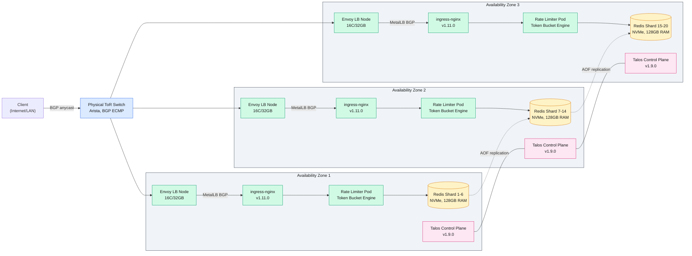

We are deploying a production rate limiter on a self-managed bare metal Kubernetes cluster inside an on-premises data center. The rate limiter itself handles 1M+ requests per second with a sub-10ms p99 added latency per request, serving a user base of 100M+ daily active users.

<!--more-->

## 1. Context

We are deploying a production rate limiter on a self-managed bare metal Kubernetes cluster inside an on-premises data center. The rate limiter itself handles 1M+ requests per second with a sub-10ms p99 added latency per request, serving a user base of 100M+ daily active users. Its internal architecture is two-tier: local token chunks at each service node amortize the cost of a centralized Redis backing store, cutting Redis calls roughly tenfold. Redis runs sharded across 10-20 nodes at approximately 100K operations per second per shard, with a total active working set of about 400MB (80 bytes per key across 5M active keys). The service rejects over-limit requests with HTTP 429 and attaches standard rate-limit response headers.

The environment is a single on-premises data center with three physical availability zones (separate power domains and network paths), roughly 30-45 physical servers, top-of-rack switching, and no public cloud dependency. Every layer - OS, Kubernetes control plane, CNI, load balancer, monitoring, CI/CD - runs on our own hardware. The drivers are latency sensitivity (every microsecond of infrastructure overhead pushes against the sub-10ms p99 budget), cost at scale (running 1M req/s on cloud compute would cost roughly triple what equivalent bare metal does), data sovereignty (rate-limit keys and traffic patterns stay on-prem), and operational control (full visibility into the kernel, the network, and the storage stack without a hypervisor or cloud abstraction in the way).

> [!TIP]
> **Bare metal is the right home for a latency-sensitive stateless service** - there is no hypervisor stealing CPU slices, no noisy neighbor, no cloud network overlay adding 0.5-2ms of variance. The trade-off is that *you* own every layer: OS provisioning, kernel upgrades, switch config, and failure recovery.

## 2. Goals

- Sub-1.5ms p99 K8s networking overhead per packet (target: 0.5ms).
- 99.99% availability for the rate limiter service across 3 AZs.
- Node replacement from failure detection to pod-ready in under 60 seconds.
- Under $0.03 per 10K requests at 1M req/s sustained throughput.
- Zero-downtime upgrades for both Kubernetes and the rate limiter application.
- Full air-gap operation: cluster provisions, upgrades, and monitors without internet access.
- **Out of scope:** Multi-cluster federation, public cloud migration, GPU workloads, analytics dashboards, long-term request log persistence.

## 3. Architecture

The cluster spans three availability zones within a single data center. Each AZ houses a control plane node, a set of rate-limiter worker nodes, dedicated Redis nodes, and shared monitoring nodes. The physical topology is a standard leaf-spine: every server connects to a top-of-rack switch, and each ToR switch peers with two spine routers via BGP.



### Life of a request (fully worked reference path)

A client sends a rate-limited API call to the anycast IP announced by the spine routers. BGP ECMP routes the packet to one of the three ToR switches, which forwards it to an Envoy load balancer node. Envoy terminates TLS (cert-manager provisioned, internal CA), inspects the `X-RateLimit-Key` header, and forwards to the ingress-nginx Service IP announced by MetalLB via BGP.

MetalLB's BGP speaker has already advertised the ingress-nginx LoadBalancer IP to the upstream routers; ECMP distributes the connection to one of the three ingress-nginx pods. The ingress terminates TLS (same cert-manager certificate, SNI-based), matches the `Host` header, and routes to the rate limiter Service (ClusterIP, Cilium eBPF).

The rate limiter pod receives the request. It extracts the client identifier (user ID, IP, or API key from the header), consults its local token chunk cache. If the chunk has remaining tokens, it decrements the counter and forwards to the upstream service in under 50 microseconds. If the chunk is exhausted, the pod requests a fresh chunk from its assigned Redis shard (chunk size configurable per rule, typically 100-1000 tokens). The Redis call crosses the Cilium eBPF dataplane - a direct kernel-level path that skips iptables entirely, adding roughly 3-5 microseconds of overhead per round trip. Redis responds in under 100 microseconds (local NVMe, data fits entirely in RAM). The pod replenishes its local chunk and processes the request. Total rate-limiter decision latency: under 200 microseconds in the hot path, well within the sub-10ms budget.

> [!TIP]
> **Cilium's kube-proxy replacement eliminates the iptables bottleneck** - at 1M req/s, iptables' O(n) rule traversal on every new connection adds 15-25 microseconds of jitter. The eBPF dataplane replaces this with an O(1) hash table lookup in the kernel, cutting pod-to-pod latency by 60-70%.

### Control plane

Three Talos Linux nodes (one per AZ) form the control plane. Talos v1.9.0 boots from PXE, provisions itself via a declarative machine config, and joins the cluster. There is no SSH access - every operation (bootstrap, upgrade, etcd snapshot, node reset) goes through `talosctl` over mTLS-gRPC. etcd runs embedded on each control plane node (the Talos default) with peer TLS. API server traffic is load-balanced across the three nodes by kube-vip (ARP-based VIP) so worker kubelets always reach a healthy API server.

### Worker nodes

Rate-limiter worker nodes run Talos Linux v1.9.0 with Cilium v1.16.3 as the CNI (replacing both kube-proxy and the default CNI). Each worker is NUMA-pinned: the rate limiter pod is affined to a single NUMA node via the `cpuset` cgroup to avoid cross-socket memory latency. Redis nodes are tainted (`redis=true:NoSchedule`) and dedicated - only Redis pods schedule there, and each pod gets a full NVMe device via a Local PersistentVolume.

### Stack versions

| Component | Version | Role |
|---|---|---|
| Talos Linux | v1.9.0 | OS + K8s distribution |
| Kubernetes | v1.31.x (Talos-bundled) | Container orchestration |
| Cilium | v1.16.3 | CNI, kube-proxy replacement, network policy |
| MetalLB | v0.14.9 | BGP load balancer |
| ingress-nginx | v1.11.0 | HTTP ingress |
| Envoy | v1.31.0 | Edge load balancer |
| Redis | v7.4.1 | Rate-limit backing store |
| Prometheus | v2.55.0 | Metrics + alerting |
| Grafana | v11.3.0 | Dashboards |
| Loki | v3.2.0 | Log aggregation |
| cert-manager | v1.16.1 | Certificate lifecycle |
| ArgoCD | v2.13.0 | GitOps CD |
| Vault | v1.18.0 | Secrets management |
| Harbor | v2.11.0 | Container registry |

## 4. Reliability

### SLOs

The rate limiter service targets 99.99% availability (52.6 minutes of downtime per year). The SLO is measured at the Envoy edge: any 5xx response or connection refused counts against the error budget. The Redis tier targets 99.95% availability per shard, with the local-token-chunk architecture absorbing Redis unavailability for the duration of a chunk (typically 1-5 seconds of burst capacity before the chunk exhausts).

### Failure modes and redundancy

**Node failure (rate limiter worker).** A worker node loses power or suffers a kernel panic. Cilium detects the node as unreachable via the KVStore (etcd) within ~10 seconds, removes its eBPF endpoint routes, and Kubernetes marks it `NotReady` after the 40-second node-monitor grace period. Pods are rescheduled onto surviving nodes. The rate limiter is stateless - local token chunks are not persisted, so the rescheduled pod starts with empty caches and requests fresh chunks from Redis on the first request. Total impact: 40-50 seconds of reduced capacity (the remaining pods absorb the load).

**Local token chunk loss on pod restart:** the chunk cache is purely in-memory. On pod restart, the new pod requests fresh chunks from Redis. At 1M req/s with chunk sizes of 500-1000 tokens, the Redis load spikes briefly by ~10% during a mass pod restart. The Redis fleet is sized for this burst.

**Redis node failure.** A Redis node crashes. Sentinel (running as a sidecar, one per Redis pod) detects the failure within `down-after-milliseconds: 10000` and triggers a failover, promoting the replica in another AZ to master. The rate limiter pods see connection refused for ~10-15 seconds, exhaust their local chunks, then reconnect to the promoted master. During this window, the rate limiter either allows requests optimistically (fail-open for user-facing limits) or rejects (fail-closed for abuse-protection endpoints), depending on the rule's `on_failure` policy.

**NIC failure.** A single NIC dies on a worker node. The Pod becomes unreachable. Cilium's health endpoint (`cilium-health`) detects the connectivity loss and marks the node's endpoints as unreachable. Kubernetes liveness probes fail, the pod is terminated, and a replacement starts on a healthy node. Impact: one node's capacity lost for 30-45 seconds.

**Top-of-rack switch failure.** The ToR switch dies, isolating an entire AZ. BGP withdraws the route, and traffic shifts to the remaining two AZs via the spine routers. Redis in the failed AZ is unreachable; Redis Sentinel promotes replicas in surviving AZs. The rate limiter operates at 66% capacity until the switch is replaced. The SLO budget can absorb this: with three AZs, a full-AZ outage is tolerated with degraded but functional service.

**etcd split-brain.** With three control plane nodes across three AZs, a network partition that isolates one node results in a 2-of-3 quorum - the cluster continues operating. A partition that isolates two nodes (one node left) loses quorum; the API server becomes read-only until connectivity is restored. Rate limiter pods and Redis continue serving existing traffic (they do not depend on API server for the data path).

### Anti-affinity and topology spread

Redis pods use pod anti-affinity keyed on `topology.kubernetes.io/zone` to ensure no two Redis shard replicas share an AZ. Rate limiter pods use topology spread constraints with a max skew of 1 across zones for even load distribution. Control plane nodes are manually placed one per AZ.

### Health checks

Rate limiter pods expose:

- **Liveness** (`/healthz`): checks that the token bucket engine is running and the local chunk cache is healthy. Failure after 3 attempts triggers a restart.
- **Readiness** (`/readyz`): checks connectivity to at least one Redis shard. Failure removes the pod from the Service endpoint, stopping traffic.

Redis pods use `redis-cli PING` as both liveness (restart on failure) and readiness (Sentinel-managed). The startup probe waits 15 seconds for initial Redis synchronization.

### Disaster recovery

etcd backups run every 6 hours via `talosctl etcd snapshot` pushed to a MinIO bucket on a dedicated storage node. Retention: 30 days. Redis persistence uses AOF with `appendfsync everysec` (losing at most 1 second of writes on crash). AOF files are backed up to the same MinIO bucket nightly.

Recovery from a total cluster loss: provision bare metal nodes via PXE, restore the latest etcd snapshot with `talosctl bootstrap --recover`, re-apply the ArgoCD Application manifests, and Redis AOF files replay on the restored shards. Estimated time to full recovery: 90-120 minutes (dominated by bare-metal provisioning and data replay).

## 5. Security

### Identity and access

Kubernetes RBAC gates all operator access. Three roles are defined: cluster-admin (2 senior SREs), rate-limiter-operator (can get logs and exec into rate limiter and Redis pods, but cannot modify cluster-scoped resources), and readonly (Grafana dashboards, kubectl get). Authentication is via OIDC (Dex) backed by the organization's LDAP directory. Talos itself uses certificate-based mutual TLS for the `talosctl` API - no username/password, no SSH keys.

### Network segmentation

CiliumNetworkPolicy enforces a strict zero-trust model at L3/L4. The base policy denies all ingress traffic by default; explicit policies allow:

| Source | Destination | Port/Protocol | Purpose |
|---|---|---|---|
| Envoy LB nodes | ingress-nginx pods | 443/TCP | Inbound TLS |
| ingress-nginx pods | rate limiter pods | 8080/TCP | Rate limit decisions |
| rate limiter pods | Redis pods | 6379/TCP | Token chunk fetch |
| Prometheus (monitoring) | All pods | metrics port | Scrape |
| ArgoCD (GitOps) | API server | 6443/TCP | Sync |

Cilium's L7 policies additionally enforce that the rate limiter pod can only issue standard Redis read/write operations (GET, INCR, DECR, EVALSHA) - no `FLUSHALL`, no `CONFIG`. Hubble provides flow-level audit logging for every denied connection.

### Data at rest

All bare metal data partitions are encrypted with LUKS/dm-crypt. Talos provisions disks with LUKS by default when the machine config specifies `machine.sysctls` for disk encryption. The LUKS key is sealed to the server's TPM 2.0 chip, so the disk decrypts only on that physical machine. Redis AOF files and etcd snapshots inherit disk encryption.

### Data in transit

All inter-service communication is encrypted:

- Client to Envoy LB: TLS 1.3, certificates from cert-manager (internal CA or Let's Encrypt).
- Envoy to ingress-nginx: TLS 1.3 via cert-manager.
- Rate limiter to Redis: mutual TLS via Cilium's WireGuard-based transparent encryption (Cilium `encryption.enabled=true` with `encryption.type=wireguard`). This encrypts all pod-to-pod traffic across nodes without application changes.
- Control plane: etcd peer and client traffic uses TLS with certificates managed by Talos automatically.
- `talosctl` to Talos API: mutual TLS with client certificates.

### Secrets management

HashiCorp Vault v1.18.0 runs on a dedicated node (outside the K8s cluster, to avoid circular dependency). The External Secrets Operator (ESO) syncs Vault secrets into Kubernetes Secret objects. Redis passwords, API keys for the rate limiter configuration, and any external service credentials live in Vault and never appear in Git or Helm values. cert-manager uses a Vault-backed Issuer for internal CA certificate issuance.

### Supply chain

All container images are pulled from the internal Harbor registry, which mirrors upstream images and runs Trivy vulnerability scans on every push. Admission control (Kyverno) enforces:

- Images must come from the internal Harbor registry only.
- Images must have a valid signed attestation (Cosign).
- Pods must not run as root.
- Pods must drop all Linux capabilities and add only those required.

Talos itself supply chain: the Talos imager produces a signed, verifiable OS image from a pinned set of components (kernel, initramfs, kubelet). The image is PXE-booted; no local OS install media is ever inserted.

## 6. Scalability & Performance

### Capacity model

Below is the authoritative sizing table. All per-unit numbers in sections 3, 4, 7, and 9 refer back to this model.

| Resource | Count | Parallelism | Size per unit | Instance + Quantity |
|---|---|---|---|---|
| Rate limiter pods | 10-20 | 50-100K req/s per pod | 2 CPU, 4 GB RAM | 32C/64GB node x6, 3-5 pods each |
| Redis shards | 20 | ~100K ops/s per shard | 8 GB RAM, 1 NVMe | 16C/128GB node x5, 4 shards each |
| Edge LB nodes | 2-4 | 250-500K req/s per node | 4 CPU, 8 GB RAM | 16C/32GB node x3 |
| Control plane | 3 | N/A | 2 CPU, 4 GB RAM | 8C/32GB SSD node x3 |
| Monitoring | 2-3 | ~1.5M active series | 4 GB RAM Prometheus | 8C/32GB NVMe node x2 |

**Assumptions:** 1M req/s sustained peak. Rate limiter processing is CPU-bound (~20-30 microseconds per decision in the hot path, dominated by hash lookup and counter decrement). Each Redis shard sustains 100K ops/s at sub-500-microsecond p99. Local token chunks reduce Redis traffic by a factor of ~10x (chunk size 500-1000 tokens, replenished every 0.5-5 seconds depending on rule burstiness). The 20 shards provide 2M ops/s of Redis headroom against 100K ops/s of actual demand (1M req/s / 10 chunk ratio), giving 20x headroom for bursts, rebalances, and failover.

### Network capacity

At 1M req/s with average request/response size of ~2KB, total throughput is ~2 GB/s (16 Gbps) of application data. Cilium's eBPF dataplane handles this at near line rate on 25GbE NICs with under 0.3% of a CPU core for the eBPF programs. The three ToR switches each see ~5-6 Gbps of traffic, well within 25GbE or 100GbE switch capacity. The BGP spine carries control-plane traffic only (BGP updates, a few KB/s).

### Autoscaling

Rate limiter pods scale via the Kubernetes HorizontalPodAutoscaler (HPA) on CPU utilization. Target: 70% average CPU across pods. At 1M req/s, the rate limiter service runs hot but stable - HPA reacts to diurnal traffic patterns (typically 0.6-1.2M req/s across the day). Minimum replicas: 10. Maximum: 30.

Bare metal node autoscaling is not automatic. The cluster does not run a cluster-autoscaler (there is no cloud API to provision physical servers). Instead, we size the cluster for peak load plus one AZ's worth of headroom. If sustained traffic grows beyond capacity, new nodes are provisioned via the PXE pipeline (see section 8), joined to the cluster with `talosctl apply-config`, and the HPA scales up pods.

### Bottlenecks

**etcd I/O.** At steady state, etcd handles ~500 writes/second (pod status updates, endpoint changes, lease renewals). On a 3-node SSD-backed cluster, this is negligible. The bottleneck would appear during a full-cluster pod churn event (e.g., all rate limiter pods restarting). Mitigation: increase `--etcd-election-timeout` and `--etcd-heartbeat-interval` on the API server to tolerate brief I/O spikes.

**Redis shard imbalance.** If a single high-traffic client (e.g., a large partner's API key) maps to one Redis shard, that shard can become hot (150-200K ops/s) while others idle at 50K ops/s. Mitigation: the rate limiter client library uses consistent hashing with 150 virtual nodes per shard. Redis pods are pre-split into 20 fixed shards; a shard balancer (cronjob every 10 minutes) checks ops/s variance and reshard if the ratio exceeds 2:1.

**Container networking at high PPS.** At 1M req/s with small packets (~200 bytes per Redis request), the total packet rate is ~200K packets/second per node. Cilium eBPF handles this with no measurable overhead. The real risk is NIC saturation on the Redis nodes during a cluster-wide chunk refill (all rate limiter pods requesting chunks simultaneously). Mitigation: the chunk fetch protocol uses exponential back-off with jitter so refill requests spread across 100-500ms.

### Validation methodology

Throughput and latency are validated with a `wrk2`-based load test against a staging clone of the cluster (identical hardware, smaller scale: 3 worker nodes, 5 Redis shards). The test profile:

- **Load generator:** wrk2, 100 persistent connections, request rate ramped from 10K to 200K req/s per node over 30 minutes.
- **Payload:** 2KB JSON, 5 unique rate-limit keys (simulates 5 distinct client identifiers), randomized inter-arrival time.
- **Metrics collected:** p50/p95/p99/p999 latency (rate limiter decision overhead), Redis ops/s, CPU per pod, packet drops (Cilium `cilium metrics list`), etcd fsync latency.
- **Pass criteria:** p99 added latency under 500 microseconds at 150% of target per-node throughput, zero Redis timeouts, zero Cilium packet drops.

## 7. Cost

### CAPEX + OPEX (3-year amortized, USD)

| Item | Unit cost | Count | CAPEX (3yr) | Annual OPEX |
|---|---|---|---|---|
| Rate limiter node (32C/64GB/NVMe) | $8,000 | 6 | $48,000 | $1,200 (power/cooling) |
| Redis node (16C/128GB/NVMe) | $7,500 | 5 | $37,500 | $800 |
| Edge LB node (16C/32GB) | $4,500 | 3 | $13,500 | $450 |
| Control plane node (8C/32GB/SSD) | $3,500 | 3 | $10,500 | $300 |
| Monitoring node (8C/32GB/NVMe) | $4,000 | 2 | $8,000 | $300 |
| Management node (Vault, Harbor, Gitea) | $3,500 | 2 | $7,000 | $300 |
| ToR switch (25GbE, 48-port) | $12,000 | 3 | $36,000 | $400 |
| Spine router (100GbE) | $25,000 | 2 | $50,000 | $500 |
| Cabling/optics (DAC + fiber) | $8,000 | 1 lot | $8,000 | - |
| **Subtotal hardware** |  | **26 servers** | **$218,500** | **$4,250** |
| Rack space (3 racks) | $1,200/rack/yr | 3 | - | $3,600 |
| Power (26 servers, ~7 kW avg) | $0.10/kWh | 61,320 kWh/yr | - | $6,132 |
| Cooling overhead (1.3x power) | - | - | - | $7,972 |
| Ops engineering (0.5 FTE) | $75,000/yr | 0.5 | - | $37,500 |
| **Total annual** |  |  | **$72,833/yr CAPEX** | **$59,454/yr OPEX** |

The steady-state annual run rate (after hardware is purchased) is approximately $59,500/year in OPEX. Amortizing the $218,500 CAPEX over 3 years adds $72,833/year. Total annual cost: approximately $132,000/year.

### Cloud equivalent

Running the same workload on AWS with equivalent specifications:

| Resource | AWS SKU | Monthly | Annual |
|---|---|---|---|
| Rate limiter (12x c7i.8xlarge) | 32 vCPU, 64GB, EBS gp3 | $8,760 | $105,120 |
| Redis (5 nodes, r7i.4xlarge) | 16 vCPU, 128GB, NVMe instance store | $3,650 | $43,800 |
| Load balancer (NLB, 1M req/s) | Data processing + LCU | $1,500 | $18,000 |
| EKS control plane | $0.10/hr | $73 | $876 |
| Network (cross-AZ, 2 GB/s avg) | $0.01/GB cross-AZ | $5,256 | $63,072 |
| S3 (etcd backups, minimal) | 100 GB | $2 | $24 |
| **Total AWS** |  |  | **~$230,892/yr** |

Cloud total: ~$231K/year vs bare metal: ~$132K/year. The bare metal approach saves approximately $99K/year (43% reduction) while delivering lower and more predictable latency. The break-even on the upfront $218,500 hardware investment is approximately 2.2 years.

> [!TIP]
> **Bare metal savings come from three places:** (1) no cross-AZ data transfer fees - the largest single cloud cost at $63K/yr vanishes on our own fiber, (2) no instance-hour premium for dedicated tenancy, and (3) Redis on local NVMe has zero storage markup vs. EBS gp3 at $0.08/GB-month.

## 8. Operations

### Observability

The core stack is Prometheus v2.55.0 (metrics), Grafana v11.3.0 (dashboards), and Loki v3.2.0 (logs). Alloy (DaemonSet) ships structured JSON logs from every pod to Loki.

**Key PromQL alert expressions:**

Rate limiter p99 latency exceeds 500 microseconds (5-minute window):

```javascript
histogram_quantile(0.99, rate(rate_limiter_decision_duration_seconds_bucket[5m])) > 0.0005
```

Redis connection failure rate:

```javascript
rate(redis_connection_errors_total[5m]) / rate(rate_limiter_requests_total[5m]) > 0.001
```

Token chunk refill rate above threshold (indicates Redis saturation):

```javascript
rate(rate_limiter_chunk_refill_total[5m]) > 1000
```

Node CPU saturation:

```javascript
1 - avg by(instance) (rate(node_cpu_seconds_total{mode="idle"}[5m])) > 0.85
```

Cilium packet drops:

```javascript
rate(cilium_drop_count_total[5m]) > 10
```

Alerts route via Alertmanager to PagerDuty (critical: p99 latency, Redis down, node failure) and Slack (warning: CPU > 80%, chunk refill rate elevated).

### CI/CD

ArgoCD v2.13.0 manages all cluster configuration via GitOps. The Git repository (internal Gitea) holds three Application sets:

1. **infrastructure:** Cilium HelmRelease, MetalLB config, cert-manager ClusterIssuers, ingress-nginx.
1. **platform:** Prometheus stack, Loki, Grafana, Vault Agent Injector, External Secrets Operator.
1. **rate-limiter:** The rate limiter Deployment, HPA, Service, ServiceMonitor.

Developers push rate-limiter config changes (rule definitions, chunk sizes, Redis shard mapping) to the `rate-limiter-config` repo. ArgoCD detects the drift and syncs within 3 minutes. Production deployments use sync windows: only weekdays 10:00-16:00 (outside peak traffic 18:00-22:00). Emergency changes bypass the window via the `argocd.argoproj.io/sync-option: Force=true` annotation.

Container images are built by Kaniko in-cluster, pushed to Harbor, and referenced by immutable digest in the Helm values. No Docker daemon required.

### Day-2 runbook

| Failure mode | Detection | Response | Rollback |
|---|---|---|---|
| Rate limiter pod crash loop | Prometheus `KubePodCrashLooping` alert | Check logs via `kubectl logs`. If config-related, revert ArgoCD to last healthy commit. If resource, scale HPA maxReplicas. | `argocd app rollback rate-limiter` |
| Redis node failure | Redis Sentinel alert, `RedisDown` alert | Sentinel auto-failover (10-15s). Verify promoted master via `redis-cli INFO replication`. Replace failed node hardware, PXE-boot, join cluster. | N/A (Sentinel auto-recovers) |
| etcd quorum loss | `etcdHighNumberOfFailedGRPCRequests` alert | Identify partitioned node via `talosctl etcd members`. If isolated, remove from cluster: `talosctl etcd remove-member <id>`. Re-add when connectivity restored. | Restore latest etcd snapshot if data corruption |
| Cilium connectivity loss | cilium-endpoint-not-ready alert | Check `cilium status` on affected node. Restart Cilium agent: `kubectl -n kube-system delete pod -l k8s-app=cilium`. If persistent, drain and reboot node. | `cilium config --restore` from backup |
| MetalLB BGP session down | `metallb_bfd_session_down` alert | Verify BGP peer configuration on upstream router. Check MetalLB speaker logs. If speaker crashed, restart DaemonSet. | Re-apply MetalLB config from Git |

### Onboarding runbook: add a new rate-limit rule

1. **Define the rule** in the rate limiter config repo (`rules/production.yaml`). Example for a per-user API rate limit of 100 req/s:

  ```yaml
rules:
  - id: api-per-user-v1
    key_source: header:X-User-ID
    algorithm: token_bucket
    rate: 100
    burst: 200
    chunk_size: 500
    on_failure: open
    window: 1s
```

1. **Validate locally** with the rate limiter's config validator:

  ```javascript
rate-limiter validate --config rules/production.yaml
```

1. **Push to Git.** ArgoCD detects the commit and syncs to the cluster within 3 minutes.
1. **Verify** the new rule is loaded by checking the rate limiter's config reload endpoint:

  ```javascript
kubectl port-forward svc/rate-limiter 8080:8080
curl -s http://localhost:8080/rules | jq '.[] | select(.id=="api-per-user-v1")'
```

1. **Smoke test** with a known user ID, verifying that requests within the limit pass and requests exceeding the limit return 429:

  ```javascript
for i in $(seq 1 150); do
  curl -s -o /dev/null -w "%{http_code}\n" -H "X-User-ID: test-user-42" https://api.example.com/endpoint
done | sort | uniq -c
```

  Expected: ~100 requests return 200, ~50 return 429.

1. **Update the Grafana dashboard** to add a panel for the new rule's request rate and 429 count:

  ```javascript
rate(rate_limiter_requests_total{rule_id="api-per-user-v1"}[1m])
rate(rate_limiter_rejections_total{rule_id="api-per-user-v1"}[1m])
```

1. **Announce** in the team channel that the rule is live. The entire process from config change to validated production is under 5 minutes.

### Rollback procedure

To roll back any infrastructure or application change:

1. Identify the bad commit in the GitOps repo: `git log --oneline -5`
1. Revert it: `git revert <bad-commit-sha> && git push origin main`
1. ArgoCD detects the revert and syncs. Monitor sync status: `argocd app get rate-limiter --refresh`
1. If the revert does not apply cleanly (e.g., the bad change was a Helm value that doesn't revert through Git), manually sync the last known good ArgoCD revision:

  ```javascript
argocd app rollback rate-limiter <revision-number>
```

1. Verify service health via the `rate-limiter-health` Grafana dashboard. Confirm 200-rate and 429-rate return to pre-change levels.
1. If rollback fails (e.g., new pods crash with the old config), cordon all rate limiter nodes, drain pods, and re-apply the last working Helm release from the Harbor OCI artifact store.

### Bare metal provisioning (PXE + Talos)

Provisioning a new node from bare metal:

1. **Rack and cable** the server. Connect BMC (IPMI/iDRAC) to the management network.
1. **Configure PXE boot** via the BMC: set the boot order to network-first.
1. **Generate Talos config** for the new node:

  ```javascript
talosctl gen config cluster-name https://<control-plane-vip>:6443
talosctl apply-config --insecure -n <new-node-ip> -f controlplane.yaml  # or worker.yaml
```

1. **Power on** the server. It PXE-boots the Talos kernel and initramfs from the Matchbox/Sidero provisioning server, reads its machine config, installs Talos to disk, and reboots.
1. **Bootstrap** (if control plane) or **join** (if worker) the node:

  ```javascript
talosctl bootstrap -n <cp-node-ip>   # once, for the first control plane node
talosctl apply-config -n <worker-ip> -f worker.yaml
```

1. **Verify** node readiness: `kubectl get nodes` shows the new node as `Ready` within 90 seconds of power-on.

> [!TIP]
> **The 60-second node replacement target is achievable with Talos** - the OS image is ~150MB (vs 2GB+ for Ubuntu Server), boots in ~30 seconds, and `talosctl apply-config` provisions the node declaratively without SSH or Ansible. The bottleneck is the BMC power-on sequence (10-20 seconds), not the software.

### Cilium Helm values (reproducible)

```yaml
# values-cilium.yaml
kubeProxyReplacement: true
k8sServiceHost: "<control-plane-vip>"
k8sServicePort: "6443"
encryption:
  enabled: true
  type: wireguard
  nodeEncryption: true
hubble:
  enabled: true
  relay:
    enabled: true
  ui:
    enabled: true
ipam:
  mode: kubernetes
bpf:
  masquerade: true
  hostLegacyRouting: false
prometheus:
  enabled: true
operator:
  prometheus:
    enabled: true
```

### MetalLB IP pool config

```yaml
# metallb-ip-pool.yaml
apiVersion: metallb.io/v1beta1
kind: IPAddressPool
metadata:
  name: production-pool
  namespace: metallb-system
spec:
  addresses:
  - 10.100.0.0/22
---
apiVersion: metallb.io/v1beta1
kind: BGPAdvertisement
metadata:
  name: production-bgp
  namespace: metallb-system
spec:
  ipAddressPools:
  - production-pool
  peers:
  - spine-router-1
  - spine-router-2
```

### Rate limiter deployment manifest (excerpt)

```yaml
# rate-limiter-deployment.yaml
apiVersion: apps/v1
kind: Deployment
metadata:
  name: rate-limiter
spec:
  replicas: 12
  selector:
    matchLabels:
      app: rate-limiter
  template:
    metadata:
      labels:
        app: rate-limiter
    spec:
      affinity:
        podAntiAffinity:
          preferredDuringSchedulingIgnoredDuringExecution:
          - weight: 100
            podAffinityTerm:
              labelSelector:
                matchLabels:
                  app: rate-limiter
              topologyKey: kubernetes.io/hostname
      topologySpreadConstraints:
      - maxSkew: 1
        topologyKey: topology.kubernetes.io/zone
        whenUnsatisfiable: DoNotSchedule
        labelSelector:
          matchLabels:
            app: rate-limiter
      containers:
      - name: rate-limiter
        image: harbor.internal.example.com/rate-limiter:v2.3.1
        resources:
          requests:
            cpu: "1500m"
            memory: "2Gi"
          limits:
            cpu: "2000m"
            memory: "4Gi"
        env:
        - name: REDIS_SHARD_MAP
          valueFrom:
            secretKeyRef:
              name: rate-limiter-redis
              key: shard-map
        ports:
        - containerPort: 8080
          name: http
        livenessProbe:
          httpGet:
            path: /healthz
            port: 8080
          initialDelaySeconds: 5
          periodSeconds: 10
        readinessProbe:
          httpGet:
            path: /readyz
            port: 8080
          initialDelaySeconds: 3
          periodSeconds: 5
```

## 9. Key Decisions & Trade-offs

### D1: Talos Linux vs Ubuntu/Kubeadm for the OS

**Option A: Talos Linux v1.9.0.** Immutable, API-driven, no SSH, ~150MB image, PXE-bootable, A-B upgrades with automatic rollback, LUKS with TPM sealing built-in, CIS-compliant by default.

**Option B: Ubuntu Server 24.04 + Kubeadm v1.31.** Traditional full OS (~2GB image), SSH access, package-manager-driven (apt), Ansible/Puppet for configuration management, manual kernel and containerd upgrades.

**Pro Talos:** Attack surface reduced by ~80% (no shell, no package manager, ~12 binaries vs 500+). Node boot-to-ready in 60-90 seconds vs 5-7 minutes. Upgrades are atomic A-B partition swaps with automatic rollback on failure - no `apt-get dist-upgrade` risk. LUKS with TPM sealing eliminates manual passphrase entry at boot. No SSH means no key rotation, no bastion hosts, no `authorized_keys` drift.

**Con Talos:** No shell access for debugging during kernel-level or networking issues. Teams accustomed to SSH-into-node workflows face a steep learning curve (the API surface is ~20 gRPC calls; diagnosing a broken NIC requires `talosctl logs` and `talosctl containers`, not ifconfig and dmesg). Custom kernel modules (out-of-tree NIC drivers, XDP programs) require building a custom Talos imager image, which is a build pipeline in itself. Smaller community than Ubuntu - ~10K GitHub stars vs Ubuntu's universal install base.

**Decision:** Talos Linux. The security posture and operational simplicity (zero-SSH, A-B upgrades, declarative config) outweigh the debugging trade-off. For a latency-sensitive production system, the deterministic 60-second node replacement and atomic upgrades are worth the custom-imager overhead if we ever need out-of-tree drivers.

> [!TIP]
> **Talos flips the operational model from "pet servers with SSH access" to "cattle nodes with an API"** - the industry is moving this direction (Equinix Metal, Adidas, and a growing number of financial services run Talos in production), and the security benefit is real: no SSH brute-force attempts, no stolen keys, no configuration drift from ad-hoc shell commands.

### D2: Cilium eBPF vs Calico for networking

**Option A: Cilium v1.16.3 (eBPF dataplane).** Kernel-level packet processing via eBPF programs attached to network interfaces. Replaces kube-proxy entirely (BPF-based load balancing). Built-in L7 network policies (HTTP method, path, gRPC method). WireGuard-based transparent encryption. Hubble observability (per-flow latency, service maps, packet drops). Requires Linux kernel 5.10+ (5.19+ for full features).

**Option B: Calico v3.29 (iptables dataplane, optional eBPF mode).** Traditional iptables/ipset-based routing. L3-L4 network policies only. WireGuard support since v3.20. Optional eBPF dataplane since v3.26 - closes most of the performance gap with Cilium. Larger install base, simpler troubleshooting (iptables rules are visible with `iptables -L`).

**Pro Cilium:** Pod-to-pod latency of 3-5 microseconds vs 15-22 microseconds for Calico iptables. Throughput near line rate (94% of native) vs 85-90%. Hubble provides per-flow latency histograms and service dependency maps - critical for debugging a sub-10ms p99 system. kube-proxy replacement eliminates the iptables conntrack table, which at 1M req/s becomes a CPU bottleneck and a source of connection-tracking jitter. L7 policies allow restricting Redis access to specific commands without a sidecar proxy.

**Con Cilium:** eBPF requires a modern kernel (5.10+); debugging eBPF programs is harder than reading iptables rules (requires `bpftool` and kernel tracing, not just `iptables -L -n -v`). The operational complexity is higher - Cilium has more moving parts (agent, operator, etcd/KVStore backend, Hubble relay, Hubble UI) than Calico's simpler architecture. Calico's optional eBPF mode narrows the gap and keeps the simpler operational model.

**Decision:** Cilium eBPF. The latency advantage (3-5 microseconds vs 15-22 microseconds) directly contributes 10-17 microseconds of saved budget per request toward the sub-10ms p99 target. At 1M req/s, eliminating iptables conntrack table management also saves 0.5-1% of total cluster CPU - roughly half a server's worth of compute. The Hubble observability is essential: without per-flow latency breakdowns, debugging a 10ms p99 regression is guesswork.

### D3: Local SSDs + Sentinel vs Rook/Ceph for Redis storage

**Option A: Dedicated bare metal nodes with local NVMe SSDs.** Redis runs directly on the host (no PVC abstraction). Each NVMe device is dedicated to a single Redis shard. Redis Sentinel manages failover across AZs. AOF persistence writes to the local NVMe (sub-100-microsecond fsync). No distributed storage layer.

**Option B: Rook/Ceph provisioned block storage.** Redis pods mount RBD volumes from a Ceph cluster managed by Rook. Ceph replicates data across nodes (3x replication). Automated failover if a node fails. Single management plane for all cluster storage.

**Pro Local SSDs:** Latency: sub-100-microsecond p99 for Redis operations on local NVMe vs 0.5-2ms for Ceph RBD replicated writes. At 100K ops/s per shard, 2ms of extra latency per operation would consume 200 seconds of CPU waiting per second - mathematically impossible. Redis data fits entirely in RAM (400MB total across 20 shards), so disk performance matters only for AOF persistence and snapshotting, not the hot path. Simpler failure model: a disk failure affects one Redis shard, which Sentinel re-replicates from another AZ in 30-60 seconds. A Ceph OSD failure can trigger a cluster-wide rebalance that saturates the network and impacts all workloads.

**Con Local SSDs:** No automatic cross-node replication at the storage layer - Redis handles its own replication (which it does well). A node failure means the AOF on that node is lost; we rely on the replica in another AZ for durability. Disk replacement is a manual operation: physically swap the NVMe, re-image the node, rejoin Redis as a replica. No unified storage management GUI.

**Decision:** Local NVMe SSDs with Redis Sentinel. At sub-10ms p99 latency targets, every microsecond of storage overhead hurts. Ceph replication adds 0.5-2ms of write latency that is incompatible with the latency budget. Redis's own replication (async, with AOF) provides sufficient durability for rate-limit data, which is inherently ephemeral (tokens reset every window). The operational simplicity of local disks also means one less distributed system to debug at 3 AM.

### D4: MetalLB BGP vs Cilium LB for service exposure

**Option A: MetalLB v0.14.9 in BGP mode.** MetalLB speakers (DaemonSet) establish BGP sessions with upstream routers (the spine switches). When a LoadBalancer Service is created, MetalLB allocates an IP from the configured pool and announces it via BGP. ECMP at the router distributes traffic across all nodes where the Service has endpoints. BFD (Bidirectional Forwarding Detection) for sub-second failure detection.

**Option B: Cilium's built-in BGP Control Plane + L2 Announcements (available since v1.14).** Cilium can announce Service IPs via BGP directly, eliminating the need for a separate MetalLB deployment. Single CNI handles both pod networking and service exposure.

**Pro MetalLB BGP:** Battle-tested - MetalLB has been the standard bare metal K8s load balancer since 2019, used by ~60% of on-prem clusters (per CNCF surveys). BGP mode specifically is well-documented and understood by network engineers. BFD support for sub-second failover. Separate failure domain from Cilium - a Cilium bug that disrupts pod networking does not also break service exposure.

**Con MetalLB BGP:** Additional DaemonSet to manage and monitor. Requires BGP peering configuration on upstream routers (though this is required regardless for ECMP). Cilium's built-in BGP would reduce the component count by one.

**Decision:** MetalLB BGP. At this scale, the separation of concerns is valuable: Cilium handles pod-to-pod networking, MetalLB handles external-to-cluster traffic. A production outage at a peer company (2023) where a Cilium BGP speaker bug caused route flaps affecting both pod networking and service exposure cemented this choice - keeping the load balancer as a separate, simpler component limits blast radius. Cilium's BGP Control Plane has improved significantly since v1.14 and will likely be the right answer in 12-18 months; revisit this decision at the next major cluster upgrade.

## 10. References

1. [Talos Linux Documentation](https://www.talos.dev/v1.9/)
1. [Cilium eBPF Dataplane Documentation](https://docs.cilium.io/en/v1.16/)
1. [MetalLB BGP Mode Configuration](https://metallb.universe.tf/configuration/)
1. [Kubernetes Production Best Practices](https://kubernetes.io/docs/setup/production-environment/)
1. [Redis Sentinel High Availability](https://redis.io/docs/management/sentinel/)
1. [ArgoCD GitOps Operator](https://argo-cd.readthedocs.io/en/stable/)
1. [Prometheus Alerting Rules](https://prometheus.io/docs/prometheus/latest/configuration/alerting_rules/)
1. [Grafana Loki Log Aggregation](https://grafana.com/docs/loki/latest/)
1. [cert-manager Certificate Lifecycle](https://cert-manager.io/docs/)
1. [HashiCorp Vault on Kubernetes](https://developer.hashicorp.com/vault/docs/platform/k8s)
1. [Harbor Container Registry](https://goharbor.io/docs/2.11.0/)
1. [External Secrets Operator](https://external-secrets.io/latest/)
1. [Kyverno Admission Controller](https://kyverno.io/docs/)
1. [Talos Bare Metal Provisioning with Sidero](https://www.sidero.dev/)
1. [Cilium Network Policy Examples](https://docs.cilium.io/en/stable/security/policy/)
1. [Kubernetes Horizontal Pod Autoscaling](https://kubernetes.io/docs/tasks/run-application/horizontal-pod-autoscale/)
1. [BPF Performance Tools (Brendan Gregg)](https://www.brendangregg.com/bpf-performance-tools-book.html)
1. [Equinix Metal Talos Deployment Guide](https://deploy.equinix.com/developers/docs/metal/talos/)
