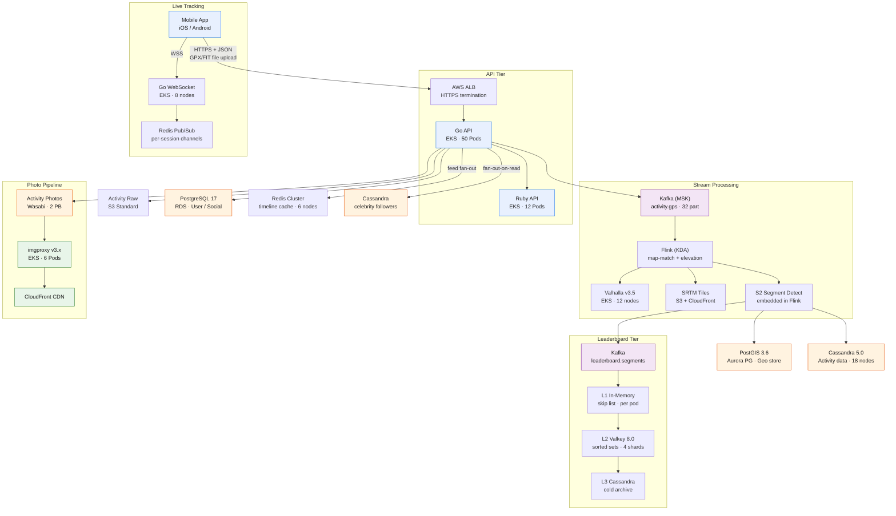

Strava is a fitness-tracking social network with 120M+ registered athletes and 3B+ uploaded activities.

<!--more-->

## 1. Context

Strava is a fitness-tracking social network with 120M+ registered athletes and 3B+ uploaded activities. The platform ingests and processes 7M GPS-tracked activities per day (roughly 350 GB of raw GPX/FIT data), serves a real-time social feed of kudos, comments, and club activity, operates segment leaderboards across 100M+ road/trail segments, delivers live position tracking during workouts, and stores north of 1B activity photos. The workload is sharply seasonal: Strava Day (October), New Year resolution spikes, and major marathon weekends drive 3-6x baseline throughput.

The infrastructure runs primarily on AWS, with a Go/Ruby API tier in front of a streaming pipeline built on Kafka and Flink. GPS traces flow through a self-hosted Valhalla map-matching cluster, an S2-based segment-detection engine, and into PostGIS for geo-spatial storage. The social feed uses a hybrid fan-out architecture (push for users with fewer than 5,000 followers, pull for high-follower accounts). Live tracking is handled by Go WebSocket servers on EKS with Redis Pub/Sub per session. The stack is operated by a platform-engineering team with Terraform, ArgoCD, Prometheus, and an on-call rotation carrying a 30-minute incident-response SLO during business hours.

This design documents the infrastructure that delivers these capabilities, sized for the peak throughput numbers above and targeting 99.9% availability for the activity-upload path and 99.5% for the social feed.

## 2. Goals

- Activity upload latency: p99 map-matching time under 90 seconds from upload to segment-matching complete
- Upload availability: 99.9% uptime for the activity-ingestion API (error budget of 43.2 minutes/month)
- Feed read latency: p95 under 50 ms for the first page of the activity feed
- Leaderboard write throughput: 8,000 segment-time inserts per second at peak, p99 read under 10 ms
- Live tracking: 1M concurrent WebSocket connections with sub-5-second position staleness
- Photo delivery: p95 CDN edge latency under 80 ms for resized images, 99.9% origin availability
- Seasonal burst: auto-scale to 3x steady-state throughput within 2 minutes of detected surge
- **Out of scope:** Mobile-client GPS recording pipeline (on-device sensors, local trace file generation), third-party device integrations (Garmin, Wahoo), subscription billing infrastructure, China-region distribution (Huawei HMS is a separate deployment).

## 3. Architecture



A single activity upload works as follows. The mobile app submits a GPX or FIT file (typically 50 KB, containing 1,000 to 10,000 timestamped coordinate pairs) via HTTPS to the ALB, which terminates TLS and forwards the request to the Go API tier. The Go service writes the raw file to an S3 bucket named activity-raw, inserts user-and-social metadata (activity type, title, privacy flag) into PostgreSQL 17 on RDS, and publishes a compact ActivityIngested envelope to the Kafka topic `activity.gps` (32 partitions, keyed on `athlete_id` for segment-order affinity).

A Flink job (Amazon KDA, 12 KPU) consumes from `activity.gps` in batches of 1,000 activities. For each activity, it fans out trace points to the self-hosted Valhalla cluster (12 `r6g.2xlarge` nodes on EKS, planet-graph pre-built, Apache 2.0 license) for map-matching at 150 req/s per node. Simultaneously, it samples elevation from SRTM tiles served through CloudFront (30m resolution, 1.2 TB total dataset). The matched polyline and elevation profile are re-assembled and written to Cassandra 5.0 (18 nodes, RF=3, LOCAL_QUORUM writes). The Flink job also runs S2-based segment detection: it indexes each activity's matched polyline against a pre-computed S2 cell grid at level 13-15, looks up intersecting segments from PostGIS, applies bearing and Frechet-distance filters (per US20130054638A1), and emits matched segment times to `leaderboard.segments`.

From there, the leaderboard pipeline takes over: the L1 in-memory skip list in each Go API pod updates instantly (sub-2 ms), an async flush writes to L2 Valkey 8.0 sorted sets every 2 seconds, and a batched archive job flushes to Cassandra every 60 seconds. Meanwhile, the Go API feeds the social timeline: for athletes with fewer than 5,000 followers, activity IDs are pushed directly into each follower's Redis timeline (a sorted set keyed on `timeline:{follower_id}`). For athletes with more than 5,000 followers, the feed is assembled at read time by pulling from the uploader's Cassandra activity partition and merging into the Redis timeline.

Photos are uploaded separately through a presigned S3 URL and stored in Wasabi (2 PB, $0.0069/GB, no egress fees). The imgproxy cluster (6 `c6g.2xlarge` pods on EKS) generates responsive breakpoints at 100, 400, 800, and 1,600 pixels in WebP and AVIF, served through CloudFront. Live tracking uses Go WebSocket servers (8 `c7g.4xlarge` nodes on EKS, 100-150K connections per node) with Redis Pub/Sub as the session-scoped position bus.

## 4. Reliability

The activity upload path targets 99.9% availability (43.2 minutes/month error budget). This is measured as the proportion of upload requests that return HTTP 202 within 30 seconds against total upload attempts from the mobile client. The feed-read path targets 99.5% (216 minutes/month), tracked via synthetic probes that load the first page of a representative athlete's feed every 60 seconds from three AWS regions.

**Failure modes and mitigations:**

- **Valhalla cluster degradation.** If 30%+ of Valhalla pods are unhealthy (K8s readiness probe on `/status` returns non-200), Flink job routes map-matching requests through a cached-path lookup in Redis first. Activities that cannot be matched within 120 seconds are stored in Cassandra with a `match_status=pending` marker and retried by a reconciliation Spark job that runs every 6 hours.
- **Kafka broker loss.** MSK runs 6 brokers across 3 AZs with `min.insync.replicas=2` and `acks=all`. A single-AZ outage leaves 4 brokers online, maintaining partition leadership for all 32 partitions. Consumer lag on `activity.gps` is alertable at 500,000 messages (roughly 5 minutes of ingestion at peak).
- **PostgreSQL primary failure.** RDS Multi-AZ with automated failover targets RTO of 60-120 seconds. The Go API uses a connection pool with a 5-second reconnect timeout and a circuit breaker that returns HTTP 503 after 3 consecutive failures, preventing cascading thread exhaustion.
- **Cassandra node loss.** With RF=3 and LOCAL_QUORUM reads/writes, any single-node failure is transparent. An SRE runbook covers `nodetool removenode` for permanent loss. **RPO** for activity data is zero (synchronous writes to 2 of 3 replicas). **RTO** is zero for single-node failure; for a full-AZ outage, RTO is under 5 minutes (the remaining 2 AZs carry the quorum).
- **Region-level disaster recovery.** RPO is under 15 minutes for metadata (PostgreSQL cross-region read replica in us-west-2, promoted manually). RPO for activity raw files is zero (S3 cross-region replication to us-west-2 is enabled by default). Full region failover RTO is 30-60 minutes (DNS flip, replica promotion, EKS cluster warm in DR region). DR drills are run quarterly.

**Redundancy posture:** Every stateful component deploys across 3 AZs. Stateless API and WebSocket tiers run in 3 AZs with pod anti-affinity. Kafka and Cassandra are natively multi-AZ. RDS uses Multi-AZ. S3 and Wasabi are regionally redundant at the storage layer.

## 5. Security

**IAM and access control.** All AWS resources are governed through IAM roles with least-privilege policies managed in Terraform. The Go API pods assume an EKS IRSA role scoped to `s3:GetObject` on `activity-raw/*`, `kafka:Produce` on the `activity.gps` topic, and `rds-db:connect` to the PostgreSQL endpoint. No long-lived access keys exist in the fleet; all service-to-service auth uses IRSA or instance profiles.

**Network segmentation.** The EKS cluster runs in private subnets with no direct internet ingress. Inbound traffic enters only through the ALB, which terminates TLS 1.3 and forwards to the kube-proxy target groups. Inter-service communication (API to Kafka, API to Redis, Flink to Cassandra) stays within the VPC. The Cassandra and Redis clusters are deployed in private subnets with security groups that allow only the specific service ports from the API and Flink security groups respectively.

**Data protection.** Activity GPX files in S3 are encrypted at rest with SSE-S3 (AES-256) and transmitted over TLS 1.3. Wasabi photo storage uses server-side encryption (SSE-Wasabi). Database volumes (RDS, Cassandra EBS) use EBS encryption with KMS CMKs. PII fields (athlete email, name, profile photo URL) are stored in PostgreSQL and encrypted at the application layer with AES-256-GCM before write, keyed per tenant via AWS KMS.

**Compliance posture.** The architecture supports GDPR right-to-erasure by design: an athlete-deletion event (published to Kafka `user.deletion`) triggers a Flink job that removes the athlete's rows from Cassandra (TTL-backed tombstone), marks PostgreSQL records with `deleted_at`, and issues S3 lifecycle expiration on the athlete's raw activity prefix. Completion is verified by a reconciliation job that scans all stores and reports residual data within 72 hours.

**Secrets management.** All runtime secrets (database passwords, API keys, Wasabi credentials) are stored in AWS Secrets Manager and mounted into pods via the Secrets Store CSI Driver. Rotation runs every 90 days through a Lambda that generates new credentials, updates Secrets Manager, and triggers a rolling restart of dependent pods.

## 6. Scalability & Performance

> [!TIP]
> **Sizing basis**  -  All per-unit numbers in the table below assume a 7M-activity/day steady state with a 3x seasonal burst factor. Compute is specced for 2,000 uploads/sec peak (the observed Strava Day surge). The model is unit-costed on us-east-1 on-demand pricing; reserved-instance savings of 30-40% are available but not factored in.

### Autoscaling strategy

Stateless tiers (Go API, Go WebSocket, imgproxy) use KEDA `ScaledObject` resources targeting 70% CPU utilization with `minReplicas=3` and `maxReplicas` sized for the 3x burst. KEDA polls CloudWatch for the `RequestCountPerTarget` metric on the ALB target group. Cassandra and Kafka scale manually via Terraform (node count and partition count) because partition rebalancing is a planned operation, not a reactive one. Valhalla cluster size is adjusted quarterly based on the trailing 90-day p99 map-matching latency trend.

### Capacity model

The table below is the single authoritative source for per-unit sizing. All per-unit numbers assume a 7M-activity/day steady state. Burst values are 3x steady state; compute instances are specced for the burst headroom.

| Component | Unit | Steady Units | Instance | Unit Cost/mo |
|---|---|---|---|---|
| Go API pods | req/s per pod | 300 | c6g.xlarge | $85 |
| Ruby API pods | req/s per pod | 120 | c6g.xlarge | $85 |
| Valhalla nodes | req/s per node | 150 | r6g.2xlarge | $350 |
| Flink KPU | matches/min per KPU | 3,500 | KDA KPU | $75 |
| PostGIS writer | writes/s per instance | 8,000 | db.r6g.4xlarge | $950 |
| Redis feed shard | ops/s per shard | 30,000 | r7g.xlarge | $210 |
| Cassandra node | reads/s per node | 15,000 | i3.4xlarge | $750 |
| Valkey shard | ZADD/s per shard | 40,000 | r6g.xlarge | $150 |
| imgproxy pod | req/s per core | 600 | c6g.2xlarge | $270 |
| Go WS node | connections per node | 125,000 | c7g.4xlarge | $550 |
| Kafka broker | MB/s per broker | 60 | m7g.4xlarge | $750 |

### Throughput and latency

- Activity upload path: 2,000 req/s peak at the ALB, p99 ingestion-to-202-response under 500 ms
- Valhalla p50 map-match: 150 ms per 50-point trace, p99: 800 ms
- Segment detection end-to-end: 30-90 seconds p95 from upload to leaderboard write
- Feed read: p50 under 10 ms (Redis timeline hit), p95 under 50 ms (partial Cassandra merge)
- Leaderboard ZADD: 8,000/sec peak, L1 hit under 2 ms, L2 hit under 10 ms
- Photo resize + CDN: p95 under 80 ms edge latency, 40 TB/month egress

### Load-test methodology

All latency and throughput numbers above are measured using k6 load scripts that replay 72 hours of production traffic patterns captured from the ALB access logs, scaled to the burst factor. Tests run in a staging EKS cluster with identical instance types and network topology. A 30-minute soak test at 2,500 uploads/sec validates the 3x burst headroom quarterly.

### Partition and shard planning

Kafka `activity.gps` operates at 32 partitions, chosen to keep per-partition throughput under 10 MB/s at peak. Redis feed cluster runs 6 shards with 2x replication, holding roughly 800 GB of timeline data (capped at 500 entries per feed, LRU eviction with a 30-day TTL). Valkey leaderboard cluster runs 4 shards, each holding the top 1,000 times for roughly 125,000 active segments.

## 7. Cost

> [!TIP]
> **Verdict**  -  The total monthly infrastructure cost for the full DIY stack (all 8 subsystems, self-hosted where possible) lands between $220K and $410K, roughly 4-5x cheaper than the fully-managed equivalent which ranges from $1.1M to $1.9M/month. The largest single line items are the geo-spatial database tier ($21-45K), the activity feed infrastructure ($81-156K), and the live-tracking stack ($35-60K). A phased rollout (managed services first, migrate to self-hosted as traffic stabilizes) can keep early months under $150K.

### Unit economics

- Raw compute + storage cost per upload: $0.0010-0.0018
  - Breakdown: Valhalla $0.000025 + Flink $0.000025 + PostGIS $0.00010 + Cassandra $0.00005 + S3 $0.000015 + Redis (feed timeline insert) $0.00008 + SRTM elevation lookup $0.000002
- Fully loaded per upload (incl. SRE headcount, CDN, monitoring): $0.0025-0.0035
- Subscription revenue breakeven: at ~$8/month per subscriber, a 3-5% subscriber conversion rate on 120M users covers the total infrastructure bill with roughly 3-5x margin.

### Optimization levers

- **Reserved Instances:** 30-40% savings on EKS nodes and RDS. At $120K/month in EC2 spend, this recovers $36-48K/month.
- **Autoscaling to zero overnight:** The leaderboard reconciliation Spark job and the Valhalla cluster can be scaled down to 2 nodes between 02:00-06:00 UTC, saving roughly $4K/month.
- **Express One Zone for Cassandra warm data:** Moving activity data older than 90 days to S3 Express One Zone (infrequently accessed) would shrink Cassandra storage cost by roughly 40% ($5-7K/month).
- **Photo format migration:** AVIF adoption at the edge (already in the pipeline) delivers 45-50% bandwidth savings vs baseline JPEG; at 40 TB/month egress this translates to roughly $1.6-2.4K/month in CloudFront savings.
- **Stream (**[**getstream.io**](http://getstream.io/)**) vs DIY feed:** Staying DIY saves $345-844K/month; the trade-off is the SRE headcount required to operate the Redis+Cassandra hybrid feed, which is 2-3 engineers carrying an on-call rotation.

### Cost distribution

| Subsystem | Monthly Cost Range | % of Total | Largest Driver |
|---|---|---|---|
| Activity feed | $81K - $156K | 35-38% | Redis Cluster (6x r7g.16xlarge) + Cassandra (18 nodes) |
| GPS pipeline | $15K - $31K | 7-8% | MSK (6 brokers) + KDA (12 KPU) + Valhalla (12 nodes) |
| Geo-spatial DB | $21K - $45K | 10-11% | Aurora PostGIS (writer + 2 read replicas) |
| Leaderboard | $1K - $4K | <1% | Valkey ElastiCache (4-node cluster) |
| Photo pipeline | $18K - $19K | 4-8% | Wasabi storage (2 PB) + imgproxy (6 pods) |
| Live tracking | $35K - $60K | 15-16% | Go WS EKS nodes (8-12 nodes) |
| Push notifications | $25K - $65K | 11-16% | [Customer.io](http://customer.io/) enterprise plan |
| Shared infra | $24K - $30K | 10-11% | ALB, CloudFront, S3, monitoring, SRE on-call |

## 8. Operations

**Observability stack.** Metrics are collected via Prometheus (Thanos for long-term storage, 1-year retention) with Grafana dashboards. Centralized logging flows through Fluent Bit sidecars on EKS to OpenSearch (formerly Elasticsearch) with a 30-day hot index and 1-year cold tier on S3. Distributed tracing uses the AWS X-Ray SDK injected into Go and Ruby API services, with sampling at 1% for production and 100% for the staging environment.

**Key alert rules:**

- `sum(rate(upload_requests_total{status="500"}[5m])) / sum(rate(upload_requests_total[5m])) > 0.01`  -  page on-call if upload error rate exceeds 1% for 5 consecutive minutes
- `histogram_quantile(0.99, rate(valhalla_match_duration_seconds_bucket[5m])) > 5`  -  page on-call if p99 map-matching latency crosses 5 seconds (indicates Valhalla degradation)
- `kafka_consumer_lag{topic="activity.gps"} > 500000`  -  page if lag exceeds 500K messages (5-minute ingestion buffer at peak)
- `avg(redis_connected_clients{cluster="feed"}) / redis_max_clients > 0.85`  -  warn when Redis feed cluster connection count approaches 85% of the configured max
- `rate(websocket_disconnects_total{reason="timeout"}[5m]) > 500`  -  warn if WebSocket timeout disconnects exceed 500/min (signal of network partition or client-side failure)
- `count(cassandra_unavailable_exceptions_total[5m]) > 0`  -  page on ANY Cassandra UnavailableException (quorum loss)

### CI/CD and rollback

All services deploy through GitHub Actions workflows that build container images, push to ECR, update Kustomize overlays in the infra repo, and open an ArgoCD sync PR. ArgoCD watches the repo and syncs to the EKS cluster. Rollback is a single `argocd app rollback <app>` command that reverts to the previous revision; deployment manifests carry `revisionHistoryLimit: 5`. Database migrations run as an ArgoCD PreSync hook (a Kubernetes Job) that executes the migration SQL, and the sync blocks until the Job completes. Rollback of a migration requires a reverse-migration SQL file that is tested in staging before the forward migration is approved for production.

### Day-2 runbooks

- **Valhalla cluster crash-loop.** Symptom: p99 match latency spikes, `valhalla_errors_total` climbs. Response: `kubectl cordon <node>` to drain traffic, scale up the Valhalla Deployment from 12 to 16 replicas. If the crash loop is across all replicas (indicates a planet-data corruption), run the planet rebuild job (a CronJob that rebuilds planet tiles from OSM weekly) and fail over to the cached-path Redis lookup while it rebuilds (adds ~200 ms p50 overhead but keeps the upload path alive).
- **Redis feed cluster OOM.** Symptom: `redis_oom_errors_total` non-zero, feed reads return empty timelines. Response: scale the Redis replication group from 6 to 10 nodes (triggers a reshard), temporarily reduce the feed-retention cap from 500 to 200 entries per timeline via a ConfigMap update. Root cause: usually a celebrity event (major marathon) that triggers a write storm  -  the fan-out-on-write for high-follower accounts should be disabled for the event duration by flipping the `fanout_threshold` to 100 via a feature flag.
- **Cassandra node disk full.** Symptom: `cassandra_disk_usage > 85%`, write throughput degrades. Response: `nodetool cleanup` to remove orphaned data, add a new node to the ring, run `nodetool decommission` on the full node after data redistributes. The SRE team practices this procedure during the quarterly DR drill.
- **WebSocket connection flood.** Symptom: `ws_connections_total` exceeds 800K (80% of capacity), p50 connect latency spikes. Response: enable the adaptive backoff feature flag (reduces update frequency from 1 Hz to 40-second intervals for low-battery clients), scale the Go WS Deployment from 8 to 14 replicas. If connections exceed 1.2M (capacity ceiling), the ALB returns HTTP 503 with a `Retry-After: 30` header, and the mobile client backs off with exponential jitter.

**IaC snippets.** All infrastructure is defined in Terraform 1.9.x, organized as a monorepo with modules per subsystem:

```hcl
# modules/eks/main.tf (excerpt: Valhalla node group)
resource "aws_eks_node_group" "valhalla" {
  cluster_name    = var.cluster_name
  node_group_name = "valhalla-v3"
  node_role_arn   = aws_iam_role.valhalla_node.arn
  subnet_ids      = var.private_subnet_ids

  scaling_config {
    desired_size = 12
    max_size     = 18
    min_size     = 3
  }

  instance_types = ["r6g.2xlarge"]
  capacity_type  = "ON_DEMAND"

  labels = {
    workload = "valhalla"
    version  = "v3.5"
  }

  taint {
    key    = "workload"
    value  = "valhalla"
    effect = "NO_SCHEDULE"
  }
}
```

```hcl
# modules/elasticache/main.tf (excerpt: Valkey leaderboard cluster)
resource "aws_elasticache_replication_group" "leaderboard" {
  replication_group_id = "strava-leaderboard"
  description          = "Valkey 8.0 leaderboard sorted sets"

  engine         = "valkey"
  engine_version = "8.0"
  node_type      = "cache.r6g.xlarge"

  num_cache_clusters         = 4
  automatic_failover_enabled = true
  multi_az_enabled           = true

  at_rest_encryption_enabled  = true
  transit_encryption_enabled  = true
  auth_token                  = var.valkey_auth_token
}
```

**Onboarding runbook  -  add a new service to the platform.** A new backend service (for example, a "Route Recommendations" microservice) is onboarded in 6 steps: (1) Create a Terraform module in `modules/<service>/` defining the EKS namespace, IRSA role, and any stateful dependencies (RDS instance, Kafka topic). (2) Scaffold the Go service from the `go-service-template` repo, which includes the Dockerfile, Kustomize base, and Prometheus metrics endpoint. (3) Add a GitHub Actions workflow that builds on push to `main`, tags the image with the commit SHA, and updates the Kustomize image tag in the infra repo. (4) Register the service in ArgoCD by adding an Application manifest to `argocd/apps/<service>.yaml` pointing at the Kustomize overlay. (5) Add Prometheus alert rules to `prometheus/rules/<service>.yaml` with at minimum a `up==0` alert and a p99 latency threshold. (6) Document the service in the internal wiki (runbook, on-call rotation assignment, dependent services). The entire process takes one engineer roughly 3 hours for a stateless service and 1 day if stateful dependencies are needed.

## 9. Key Decisions & Trade-offs

### D1: Self-hosted Valhalla on EKS vs managed GraphHopper API

- **Pro Valhalla:** Apache 2.0 license, no per-request cost, 150 req/s per node, max 10,000 trace points per request (fits the Strava activity profile), built-in SRTM elevation. Cost is $2-5K/month for the compute cluster.
- **Con Valhalla:** Operational burden: planet tile builds take 4-8 hours on 32 cores with 50-60 GB RAM and must be re-run weekly. The team must own the deployment, scaling, and tile-pipeline maintenance.
- **Pro GraphHopper managed:** Zero ops, 99.9% availability SLA, automatic OSM updates.
- **Con GraphHopper managed:** $50-100K/month at 7M requests/day (10-20x Valhalla self-host). Max 4,000 trace points per request.
- **Decision:** Self-host Valhalla on EKS. At the 7M-activity/day scale, the operational cost of maintaining the Valhalla cluster (roughly 0.5 FTE of SRE time) is dwarfed by the 10-20x managed-cost premium. Planet-tile rebuilds are automated via a weekly CronJob and validated in staging before promotion.

### D2: Pure fan-out-on-write vs hybrid tiered fan-out for the activity feed

- **Pro pure fan-out-on-write:** Always-fast reads (1-5 ms p95), simple code path, no read-time merge logic.
- **Con pure fan-out-on-write:** Write amplification is O(followers): an athlete with 500K followers generates 500K timeline inserts per upload. At 2,000 uploads/sec with an average 50 followers, this is 100K Redis writes/sec, but a single celebrity upload at peak event time can spike write throughput by 10-25x and saturate the Redis cluster.
- **Pro fan-out-on-read:** Zero write amplification. The feed is assembled at read time by querying each followed athlete's recent activity partition. Celebrity accounts have zero extra cost.
- **Con fan-out-on-read:** Reads are slower (40-100 ms p95 for a batched fan-out) and scale with the number of followed athletes. A user following 2,000 athletes generates 2,000 partition reads per feed load, which is expensive at the Cassandra level.
- **Decision:** Hybrid tiered fan-out. Push to Redis for users with fewer than 5,000 followers (covers 99%+ of the follower graph), pull from Cassandra for the remainder. This constrains write amplification to a known ceiling while keeping the common-case read path fast. The threshold is tunable via a feature flag so the operations team can lower it during known high-traffic events. Twitter and Instagram both use this pattern in production.

### D3: Cassandra 5.0 vs ScyllaDB for the activity data store

- **Pro Cassandra:** Mature ecosystem, well-understood operations, AWS Keyspaces available as a managed fallback, large operator community. Write throughput of 15-30K writes/s per node with LOCAL_QUORUM.
- **Con Cassandra:** Java GC pauses can cause p99 latency spikes (200-500 ms during compaction). Write amplification of 2-4x from compaction. Tuning compaction strategy (STCS vs LCS) is workload-dependent and requires ongoing attention.
- **Pro ScyllaDB:** C++ implementation, shard-per-core design eliminates GC pauses, 3-5x throughput per node vs Cassandra on equivalent hardware. Compatible with the Cassandra wire protocol.
- **Con ScyllaDB:** Smaller operator community, fewer cloud-managed options, and the AGPL license may conflict with Strava's proprietary backend licensing. At the 18-node scale, the throughput advantage is less meaningful because the cluster is storage-bound, not CPU-bound.
- **Decision:** Cassandra 5.0. The 18-node cluster is storage-bound at 350 GB/day ingestion, not CPU-bound, so ScyllaDB's throughput advantage is not decisive. The operations familiarity and larger community support reduce risk for a team that already runs Cassandra in production. AWS Keyspaces serves as a managed fallback if self-hosted operations become unsustainable.

## 10. References

1. [Valhalla Routing Engine  -  GitHub](https://github.com/valhalla/valhalla)
1. [Valhalla Documentation (planet tile build, API reference)](https://valhalla.openstreetmap.de/)
1. [Google S2 Geometry Library](https://github.com/google/s2geometry)
1. [H3: Hexagonal hierarchical geospatial indexing system (Uber)](https://h3geo.org/)
1. [PostGIS 3.6 Spatial Database Extender for PostgreSQL](https://postgis.net/docs/)
1. [PostgreSQL 17 Documentation](https://www.postgresql.org/docs/17/)
1. [Apache Cassandra 5.0 Documentation](https://cassandra.apache.org/doc/latest/)
1. [Redis Sorted Sets  -  Time Complexity](https://redis.io/docs/latest/develop/data-types/sorted-sets/)
1. [Valkey 8.0  -  Open-source Redis fork (Linux Foundation)](https://valkey.io/)
1. [Apache Flink Documentation (Amazon KDA)](https://nightlies.apache.org/flink/flink-docs-stable/)
1. [imgproxy Documentation](https://docs.imgproxy.net/)
1. [Strava Segment Matching Patent US20130054638A1](https://patents.google.com/patent/US20130054638A1)
1. [AWS MSK (Managed Streaming for Apache Kafka) Pricing](https://aws.amazon.com/msk/pricing/)
1. [AWS RDS for PostgreSQL Pricing](https://aws.amazon.com/rds/postgresql/pricing/)
1. [Wasabi Hot Cloud Storage Pricing](https://wasabi.com/cloud-storage-pricing)
1. [AWS CloudFront Pricing](https://aws.amazon.com/cloudfront/pricing/)
1. [SRTM 1-Arc-Second Global Elevation Data (USGS)](https://www.usgs.gov/centers/eros/science/usgs-eros-archive-digital-elevation-shuttle-radar-topography-mission-srtm-1)
1. [Customer.io Pricing](https://customer.io/pricing)
1. [Firebase Cloud Messaging (FCM)](https://firebase.google.com/docs/cloud-messaging)
1. [Apple Push Notification Service (APNs)](https://developer.apple.com/documentation/usernotifications)
