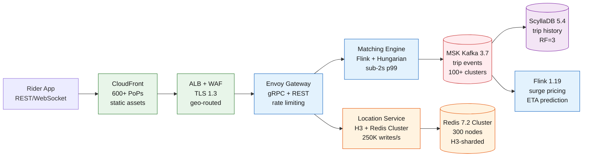

Uber operates a real-time ride-hailing matching platform at planetary scale: 170M monthly active riders, 5M drivers, across 10,000+ cities in 70+ countries.

<!--more-->

## 1. Context

Uber operates a real-time ride-hailing matching platform at planetary scale: 170M monthly active riders, 5M drivers, across 10,000+ cities in 70+ countries. The core workload is 15M daily trips flowing through a matching pipeline that must pair riders with drivers in under 2 seconds at p99, against 900 req/s peaks during rush hour. A firehose of 250K location writes per second from 1M concurrent drivers pinging every 4 seconds powers the real-time geospatial index that makes matching possible. Every ride produces roughly 1.5 MB of raw telemetry, generating 22.5 TB/day of trip data that feeds analytics, surge pricing models, and driver incentives.

The infrastructure is organized around a domain-oriented architecture where Marketplace (matching, pricing, surge), Mobility (trip lifecycle, routing, ETA), and Platform (auth, payments, geo) domains own their data and compute independently. Cross-domain communication flows through gRPC over Envoy with circuit breakers, targeting sub-50 ms p99 latency within a region. The storage tier follows a four-store pattern: Redis for real-time driver location, Kafka for the event bus, ScyllaDB for immutable trip history, and Aurora MySQL for relational data. Every component is deployed across three active-active AWS regions, each internally sub-divided into metro-level cells that isolate failures without cascading.

The design commits to exactly-once dispatch semantics because a lost or double-booked ride is an existential user promise broken. This drives the choice of Kafka exactly-once semantics for payment topics, Redis SETNX for driver lock acquisition, and Aurora UNIQUE constraints as the final duplicate guard. The cache funnel - H3 spatial index in the application layer, Redis sorted sets for driver pools, and in-memory scoring in the matching solver - is the central organizing idea: every layer absorbs load with shrinking latency budgets until the solver can produce a dispatch decision in under 900 ms.

The environment is multi-cloud (AWS primary, GCP for select services) with regional isolation as a hard requirement after the 2020 AWS us-west-2 outage that degraded matching for roughly 2 hours. The postmortem drove a shift from active-passive to active-active cell-based architecture, with every service independently writable in each region and failover targets of RTO under 5 minutes and RPO under 30 seconds. The infrastructure bill for this architecture runs roughly $30M/year at full scale, with the Redis location cluster alone consuming roughly $510K/month in compute. The cost driver is compute for stateful components (Redis, MSK, Aurora), not data transfer.

## 2. Goals

**Matching throughput:**

- 15M daily trips, 900 req/s peak, sub-2s p99 dispatch latency
- 250K location writes/s sustained, sub-5 ms p99 Redis ZADD
- 50-100 candidate driver pool per request within 3 km radius

**Availability and durability:**

- 99.99% availability across 3 active-active regions (52.56 min/yr downtime budget)
- Exactly-once dispatch with no double bookings or lost requests
- RTO under 5 min for regional failure, RPO under 30s for trip state
- AZ failure: RTO under 1 min, RPO 0 (QUORUM writes across 3 AZs)

**Scale and retention:**

- 22.5 TB/day raw trip data, 7-year regulatory retention for trip history
- 30-day hot location data, 90-day warm, 1-year cold (GDPR/CCPA compliance)
- 100+ Kafka clusters, 2.3 trillion messages/day, 3x replication

**Cost and operations:**

- Total infrastructure target roughly $30M/year at full scale (3-region active-active)
- Redis location cluster under $510K/month at full scale (self-hosted on EC2)
- Onboarding a new metro cell in under 6 hours end-to-end

**Out of scope:** driver onboarding and background checks, vehicle registration, insurance claims processing, Uber Eats restaurant management, freight logistics, in-app chat infrastructure, map tile rendering pipeline.

## 3. Architecture



### Life of a ride request

A rider in Manhattan opens the app and requests a ride from SoHo to Midtown. The request hits the nearest CloudFront edge location (static assets only - the ride request itself is a REST POST to the API gateway). Route53 latency-based DNS routes the request to the us-east-1 ALB, which terminates TLS 1.3 and forwards to the Envoy Gateway. Envoy authenticates the rider's JWT, applies rate limiting (100 requests/minute per user), and routes the `RideRequest` gRPC call to the Matching Engine in the NYC metro cell.

The Matching Engine queries the Location Service for candidate drivers within a 3 km H3 radius (resolution 9 hex cells around the pickup point). The Location Service resolves the H3 cell IDs to Redis shards, executing `ZRANGEBYSCORE` across roughly 20-30 sorted sets. A pool of 50-100 candidate drivers returns in under 10 ms. The engine extracts features per (rider, driver) pair - ETA from the Flink ETA model, surge multiplier from the Flink surge pipeline, driver rating, vehicle type match, and acceptance probability - then feeds the cost matrix to the Hungarian solver. The solver runs in a 2-second batching window alongside 50-500 other concurrent requests in the same cell, producing an optimal assignment.

The selected driver receives a push notification via WebSocket with a 15-second ACK window. The driver's app calls `AcceptRide` which triggers a Redis `SETNX dispatch_lock:{driver_id}` with 30-second TTL to prevent double dispatch. On success, the Matching Engine produces a `trip.created` event to MSK Kafka (acks=all, exactly-once semantics) with the ride_id as the partition key. The trip state machine begins: the driver's location stream is now bound to this trip_id for the duration. All subsequent events - pickup confirmation, route waypoints, dropoff, payment capture, rating - flow through the same Kafka topic, consumed by downstream services for analytics, fraud detection, and driver incentives.

The total path from `POST /rides/request` to dispatch notification: under 2 seconds p99. The Location Service query accounts for under 10 ms of that; the solver batch cycle for roughly 900 ms; the notification and ACK flow for the remainder.

### Components

The architecture centers on six component classes, all deployed on EKS (Kubernetes 1.30) with ARM/Graviton instances across 3 AWS regions, each further subdivided into metro-level cells.

**Location Service** (50 pods/cell, 2 vCPU, 8 GB): the real-time geospatial index. Ingest driver location pings via WebSocket from the Envoy Gateway, converts lat/lng to H3 cell IDs at resolutions 9 and 15, and writes to Redis Cluster via `ZADD location:{cell_id} {driver_id} {lat},{lng},{heading},{speed},{timestamp}`. Read path serves geo-fence queries: `ZRANGEBYSCORE` within radius, filtered by vehicle type and driver status. P99 read latency under 3 ms, write under 5 ms. Code in Go 1.23 with rueidis client v1.0.43 for Redis Cluster protocol.

**Matching Engine** (200+ solver pods globally, 8 vCPU, 32 GB): the DISCO-equivalent batch optimizer. Collects ride requests for 2-second windows, queries Location Service for candidate pools, computes cost matrices via Flink feature pipelines, and solves with the Hungarian algorithm (Google OR-Tools v9.10). Each solver instance handles 50-500 requests per cycle. Hot standby pairs with 30-second failover. Runs on EKS with preemptible node pools for cost savings; critical instances use on-demand with anti-affinity across AZs. P99 dispatch latency under 900 ms.

**Flink Stream Processors** (50 TaskManagers/region, 4 vCPU, 16 GB): stateful stream processing on EKS with Flink Kubernetes Operator v1.9. Consumes from MSK Kafka topics for surge pricing (5-minute sliding windows on supply/demand ratio per H3 cell), ETA prediction (feature extraction from location streams fed to ML model), and fraud detection (pattern matching on ride request velocity). Checkpoints to S3 every 60 seconds. RocksDB state backend with 50 GB per TaskManager. Version: Apache Flink 1.19.1.

**MSK Kafka** (150 brokers/region, kafka.m7g.4xlarge): the event bus. Three clusters per region: active (trip-critical), DR (mirrored), and observability (analytics). Key topics: `trip.events` (200 partitions, acks=all, min.insync.replicas=2), `driver.locations` (1,000 partitions, acks=1), `payment.commands` (50 partitions, EOS enabled, [transactional.id](http://transactional.id/) per ride), `surge.decisions` (100 partitions). Cross-region replication via MirrorMaker 2 on ECS (uReplicator protocol). Retention: 3 days hot, 30 days warm (tiered storage to S3), 90 days cold. Daily throughput: roughly 2.3 trillion messages. Version: Kafka 3.7.0 with Kraft consensus.

**ScyllaDB** (9 nodes/region, i4i.4xlarge, 16 vCPU, 128 GB): immutable trip history. Append-heavy write pattern for trip events, route waypoints, and receipts. Shard-per-core architecture avoids the JVM GC pauses that plague Cassandra at this scale. Keyspace `trip_history` with `write_consistency: QUORUM` and `read_consistency: LOCAL_QUORUM`, replication factor 3 across AZs. Compaction strategy: TimeWindowCompactionStrategy with 1-hour windows for trip event streams. TTL on location data: 90 days. Throughput per node: roughly 100K writes/s (headroom over the 22.5 TB/day, roughly 260 MB/s aggregate write throughput). Version: ScyllaDB Enterprise 2024.1 (5.4.x compatible).

**Aurora MySQL** (16 writer instances across 3 regions, r6g.8xlarge): relational data for rider/driver accounts, payment methods, trip metadata. Application-level sharding by `hash(user_id) % 16` with a shard-aware connection pool via ProxySQL 2.6. Each shard is an Aurora Global Database cluster with read replicas in each region. Version: Aurora MySQL 3.07 (8.0.34 compatible). Storage auto-scales to 128 TB per cluster.

**Envoy Gateway** (20 pods/region, 4 vCPU, 8 GB): service mesh edge. Terminates TLS 1.3 (cert-manager v1.15 with Let's Encrypt), authenticates JWT tokens, enforces per-user rate limits (100 req/min via local rate limit filter), and routes gRPC calls to domain services. xDS control plane from Istio 1.22 with Envoy v1.30. Circuit breaking: 5 consecutive failures opens the circuit for 30 seconds per upstream domain service. Observability: OpenTelemetry traces to Jaeger, metrics to M3 via Prometheus remote write.

**Observability stack** (per region): M3DB for metrics (roughly 10M datapoints/s ingest, 66B time series indexed, 3x replication on i3en.3xlarge instances), Jaeger for distributed tracing (Elasticsearch backend, 1% sampling on success, 100% on error), Elasticsearch for log aggregation (roughly 50 TB/day ingest, 30-day hot retention on EBS gp3). Grafana v10.4 dashboards with PromQL-compatible M3QL queries. Alertmanager v0.27 routes to PagerDuty.

### Location data model

Driver positions are stored in Redis Cluster as sorted sets keyed by H3 cell ID:

```javascript
Key: location:{h3_cell_id_res9}
Member: {driver_id}
Score: {unix_timestamp_ms}
Value: {lat},{lng},{heading},{speed},{vehicle_type}
```

H3 resolution 9 hexagons cover roughly 1 km^2, keeping each sorted set to 50-200 drivers in dense urban areas. Geo-fence queries fan out across the 7 cells that cover a 3 km radius (center cell + ring-1 neighbors in a hex grid), executing `ZRANGEBYSCORE` with a 30-second recency filter. The H3 library (v4.1.0, Go bindings) converts between lat/lng and cell IDs at sub-microsecond latency.

### Code generation and idempotency

Every ride request carries a `request_id` (UUID v4 generated client-side). The Matching Engine checks `SETNX dispatch:{request_id} pending EX 120` before processing. On dispatch, the driver lock `SETNX dispatch_lock:{driver_id} {request_id} EX 30` prevents double assignment. If the driver does not ACK within 15 seconds, the lock expires and the next-best candidate receives the notification. If two solvers independently produce the same (rider, driver) assignment, the Aurora INSERT on `trip_id` with a UNIQUE constraint on `request_id` rejects the duplicate. The idempotency key flows through the entire pipeline: Kafka `transactional.id = payment-{trip_id}` ensures exactly-once payment capture. An hourly reconciliation batch job cross-checks trip starts with payment captures and resolves orphans via a `payment.rollback` topic.

## 4. Reliability

The platform targets 99.99% availability across 3 active-active regions, each internally partitioned into independent metro cells. A cell failure (e.g., NYC Redis OOM) affects only that metro area; the remaining cells in the region continue operating normally.

| SLO | Target | Measurement Window | Instrument |
|---|---|---|---|
| Ride request availability | 99.99% | 30-day rolling | ALB `HTTPCode_Target_5XX_Count` / `RequestCount` |
| Dispatch latency p99 | under 2s | 5-minute window | Matching Engine histogram `dispatch_latency_ms` |
| Location write latency p99 | under 5 ms | 5-minute window | Redis client `zadd_duration_ms` histogram |
| Location read latency p99 | under 10 ms | 5-minute window | Redis client `zrange_duration_ms` histogram |
| Kafka produce latency p99 | under 10 ms | 5-minute window | Kafka producer `record-send-rate` p99 |
| ScyllaDB write latency p99 | under 10 ms | 5-minute window | ScyllaDB `write_latency_p99` metric |
| Cross-region replication lag | under 30s | 1-minute window | MirrorMaker 2 `replication-lag-max` metric |

### Failure modes and automatic mitigations

**Single AZ failure.** ScyllaDB QUORUM writes across 3 AZs maintain availability with RF=3. Redis Cluster with `cluster-require-full-coverage: no` continues serving reads/writes to surviving partitions. EKS node groups in the failed AZ reschedule pods onto surviving AZs within 60-120 seconds. Envoy circuit breakers stop routing to failed upstreams after 5 consecutive failures. Impact: 0s downtime for matching in surviving AZs; under 30s elevated latency during Redis slot migration to surviving nodes.

**Redis Cluster OOM cascade.** Scenario: New Year's Eve in APAC drives 3x normal traffic. Redis nodes hit `maxmemory 64gb` with `maxmemory-policy: allkeys-lru`. Evictions cascade as drivers disappear from the location index. Mitigation: capacity plan peak traffic at 3.5x safety factor (rather than 2x). Driver app rate-limits location pings when queue depth exceeds threshold, using dead reckoning (extrapolate from last 3 pings + heading + speed) for up to 15 seconds. Redis cluster scaled from 300 to 450 nodes across 3 AZs post-incident. P99 location staleness under 8 seconds at 3.5x peak.

**Kafka leadership rebalance storm.** Trigger: bumping a 400-broker cluster from version X to Y. Controller election triggers rebalancing of 2,000+ partitions, cascading ISR shuffle. Impact: 35 minutes of elevated produce latency (p99 from 5 ms to 2.3s), roughly 80K riders affected. Mitigation: `auto.leader.rebalance.enable: false`, `leader.imbalance.check.interval: 300000` (5 minutes), manual rack-aware partition assignment with `StickyAssignor`, roll upgrades 4 brokers at a time with 20-minute cooldown between batches.

**Full regional failure.** CloudFront origin group detects 5xx from us-east-1 origin ALB and fails over to us-west-2 within 60 seconds. Route53 health checks remove the failed region from DNS responses. Riders and drivers geo-pin to the nearest surviving region with last-known state from Kafka MirrorMaker 2 sync (under 30s lag). Aurora Global DB promotes us-west-2 secondary to read/write (automated via `failover-db-cluster`). Redis clusters in surviving regions serve their own shards independently. In-flight trips: Kafka consumers in the DR region pick up from the last committed offset. RTO: 4-8 minutes observed in drills (target: under 5 minutes). RPO: under 30 seconds (Kafka consumer lag bound).

**Driver double-dispatch.** A solver crashes between computing an assignment and recording the driver lock. The hot standby solver re-computes and may produce a different assignment for the same driver. Mitigation: the `SETNX dispatch_lock:{driver_id}` in Redis with 30s TTL ensures only one solver can claim a driver. The Aurora UNIQUE constraint on `request_id` catches any duplicate trip creations. The driver app deduplicates dispatch notifications via `dispatch_attempt_id` included in the push payload.

### Disaster recovery

**Backup strategy:**

- Aurora automated backups: continuous PITR to any point in the last 35 days, daily snapshots retained 35 days.
- Aurora Backtrack: enabled with 72-hour window for rapid undo of mass-delete or DDL mistakes.
- ScyllaDB: incremental backups to S3 every hour via `nodetool snapshot`, retained 30 days. Full weekly snapshot retained 90 days.
- Redis: no RDB or AOF persistence for driver locations (ephemeral, rebuilt from Kafka replay on cold start). Kafka replay takes roughly 35 minutes for 300 nodes.
- S3 export: daily `pg_dump` of Aurora shards to S3, cross-region copy to eu-west-1. Retained 7 years.
- Glacier Deep Archive: monthly full backup copies at $0.001/GB/month.

**Recovery time estimates:**

- Accidental mass delete: Aurora Backtrack to 1 minute before event - 1-2 minutes.
- Full database corruption: PITR restore from automated backup - 6-8 hours for a 20 TB database.
- Complete region loss: promote Global DB secondary, CloudFront origin group failover - 60-120 seconds.
- Redis cold start: Kafka replay from last checkpoint - roughly 35 minutes.

## 5. Security

### IAM least-privilege model

| Component | IAM Role | Key Permissions | Scope |
|---|---|---|---|
| EKS Location Service pod | `location-service-role` | `elasticache:Connect`, `kms:Decrypt` | Specific Redis cluster and KMS key ARNs |
| EKS Matching Engine pod | `matching-engine-role` | `elasticache:Connect`, `rds-db:connect`, `kafka:Produce` | Resource-level ARNs per region |
| EKS Flink TaskManager | `flink-taskmanager-role` | `kafka:Consume`, `kafka:Produce`, `s3:GetObject`, `s3:PutObject` | Specific topic and bucket ARNs |
| MSK broker | `msk-broker-role` | `kms:Decrypt`, `kms:GenerateDataKey` | Specific KMS key ARN |
| ScyllaDB node | `scylla-node-role` | `kms:Decrypt`, `ec2:DescribeInstances` | Specific KMS key ARN |
| CI/CD (GitHub Actions) | `github-actions-oidc-role` | `eks:UpdateClusterConfig`, `ecr:PutImage`, `cloudfront:CreateInvalidation` | Specific cluster and distribution ARNs |

All IAM roles use customer-managed policies with resource-level conditions. No wildcard `*` permissions in production roles. CI/CD authenticates via GitHub OIDC - no long-lived access keys. Cross-account access for the observability account uses IAM role chaining with external ID verification.

### Network segmentation

All compute, cache, and database resources live in private subnets with no direct internet ingress. The VPC (10.0.0.0/8 per region) is partitioned into public, private-app, private-data, and private-cache subnets across 3 AZs.

- Internet to CloudFront (public edge) to ALB (public subnet, TLS 1.3) to Envoy Gateway (private-app subnet)
- Envoy Gateway to EKS pods (private-app subnet, security groups allow gRPC ports 8080-8090 from Envoy SG only)
- EKS pods to Redis Cluster (private-cache subnet, SG allows port 6380 from EKS app SG)
- EKS pods to ScyllaDB (private-data subnet, SG allows ports 9042/9142 from EKS app SG)
- EKS pods to Aurora (private-data subnet, SG allows port 3306 from EKS app SG)
- EKS pods to MSK (private-app subnet, SG allows ports 9098/9198 from EKS app SG)
- Outbound internet (Safe Browsing API, Let's Encrypt ACME): NAT Gateway per AZ

VPC endpoints for S3, ECR, EKS, STS, Secrets Manager, and KMS keep AWS API traffic off the public internet. Network ACLs add a stateless second layer: private-data and private-cache subnets deny all inbound from non-RFC 1918 addresses.

### Encryption

- **In transit:** TLS 1.3 everywhere. CloudFront to ALB: HTTPS with a custom origin header for origin authentication. ALB to Envoy: HTTPS. Envoy to EKS pods: mTLS with Istio Citadel (cert-manager + SPIRE). EKS pods to Redis: TLS on port 6380 with client auth required.
- EKS pods to ScyllaDB: TLS with `client_encryption_options.enabled: true`. EKS pods to Aurora: TLS with `require_secure_transport=ON`. MSK: TLS mutual auth for broker-to-broker and client-to-broker. Cross-region MirrorMaker 2: TLS with SASL/SCRAM.
- **At rest:** Aurora storage encryption via customer-managed KMS CMK. ScyllaDB EBS volumes via KMS. Redis: no persistence (ephemeral workload). MSK broker EBS volumes via KMS. S3 buckets with SSE-KMS. ECR images with AES-256 at rest.

### Secrets

All secrets live in AWS Secrets Manager with automatic rotation where supported:

- Aurora master password: rotated every 30 days via `aws secretsmanager rotate-secret`.
- Redis auth token: rotated via custom Lambda rotation function that calls `ModifyReplicationGroup` with a new token.
- MSK SASL/SCRAM credentials: rotated every 90 days via the MSK-provided rotation template.
- CloudFront origin verify header value: rotated every 90 days via custom Lambda.
- Safe Browsing API key: rotated manually on key expiry (Google-managed).

EKS pods fetch secrets at startup via External Secrets Operator v0.9 with the AWS Secrets Manager provider. No secrets are baked into container images, Kubernetes Secrets (base64-encoded is not encrypted), or task definition JSON.

### Supply chain

Container images are built on GitHub Actions, scanned with Trivy v0.50.1 on every push (blocking on CRITICAL CVEs), and signed with Cosign v2.2.3 using keyless signing (OIDC + Sigstore). ECR enforces an image policy that rejects unsigned images and images with CRITICAL CVEs under 30 days old. SBOMs in SPDX 2.3 format are generated with Syft v1.5.0 and attached to each image manifest.

CIS AWS Foundations Benchmark v1.5.0 controls are enforced via AWS Config managed rules: ROOT_ACCOUNT_MFA_ENABLED, IAM_PASSWORD_POLICY, CLOUDTRAIL_ENABLED, VPC_FLOW_LOGS_ENABLED, S3_BUCKET_PUBLIC_READ_PROHIBITED, RDS_SNAPSHOT_PUBLIC_PROHIBITED, EBS_ENCRYPTION_BY_DEFAULT. Findings route to a Security Hub delegated administrator account with automated remediation via AWS Config auto-remediation rules for non-critical findings.

### Compliance

PCI DSS for payment processing: payment card data never touches the general-purpose data plane. Payment capture and settlement run in a separate PCI-scoped VPC with Aurora MySQL (encrypted, no direct internet access), MSK topics with EOS, and dedicated payment microservices that are the only components with PCI scope. All other services (matching, location, analytics) are explicitly out of PCI scope.

GDPR/CCPA data subject access requests are automated via a privacy platform service that scans all data stores for a given user_id, aggregates the data, and offers deletion with a 30-day SLA. ScyllaDB TTLs on location data enforce automatic expiry at 90 days. Kafka topics use `retention.ms=7776000000` (90 days) for location data. Aurora trip history uses `deleted_at` soft delete with a periodic async purge job.

## 6. Scalability & Performance

### Capacity model

The canonical traffic funnel for a single ride request through the matching pipeline. Every tier's throughput and latency are measured at 900 req/s peak.

| Tier | Arrival Rate | Operation | P99 Latency | Bottleneck |
|---|---|---|---|---|
| ALB + Envoy Gateway | 900 req/s | TLS termination, JWT auth, rate limiting | under 10 ms | Envoy worker threads (20 pods x 16 threads = 320 concurrent) |
| Location Service (read) | 900 req/s x 30 cells = 27K ZRANGE/s | H3 geo-fence queries across 7 cells | under 10 ms | Redis shard saturation (300 nodes x roughly 100K ops/s each = headroom) |
| Matching Solver | 900 req/s batched into 2s windows | Hungarian optimization on 50-100 driver pool | under 900 ms | Solver CPU (200 pods x 8 vCPU) |
| Location Service (write) | 250K ZADD/s sustained | Driver pings every 4s | under 5 ms | Redis shard throughput (roughly 833 writes/s per shard across 300 nodes) |
| MSK Kafka produce | 15M trips/day roughly 175 msg/s avg | acks=all, min.isr=2 | under 10 ms | Broker I/O (kafka.m7g.4xlarge x 150 brokers) |
| ScyllaDB write | roughly 260 MB/s aggregate | QUORUM writes, RF=3 | under 10 ms | Compaction throughput (64 MB/s per node, 9 nodes) |

Cumulative dispatch path: ALB (under 10 ms) + Location query (under 10 ms) + solver batch (under 900 ms) + notification (under 50 ms) = under 1,000 ms p99, well within the 2-second SLA.

> [!TIP]
> **Location firehose** - 250K writes/s to Redis is the hardest scaling dimension. At roughly 833 writes/s per shard across 300 nodes, each shard operates at under 1% of its roughly 100K ops/s capacity. The bottleneck is not throughput but memory: 64 GB per node stores roughly 20M driver records with 30s TTL. At 1M concurrent drivers, that is roughly 1 GB per node (20M / 300 x roughly 200 bytes/driver).

### Sizing and cost basis

One authoritative per-region table. All per-component figures source from this table; sections 3, 7, and 8 reference it rather than restating values. Counts are per region unless noted.

| Component | Count per Region | Instance | 3-Region Total | Monthly Cost (USD) |
|---|---|---|---|---|
| EKS cluster | 1 + 1 (DR) | EKS control plane | 3 active + 3 DR | $440 |
| Envoy Gateway | 20 pods | 4 vCPU ARM, 8 GB (c7g.xlarge SPOT) | 60 pods | $1,200 |
| Location Service | 50 pods/cell x 3 cells | 2 vCPU ARM, 8 GB (c7g.large SPOT) | 450 pods | $4,800 |
| Matching Solver | 70 pods/region | 8 vCPU, 32 GB (c7g.4xlarge on-demand) | 210 pods | $62,500 |
| Flink TaskManagers | 50 pods | 4 vCPU, 16 GB (c7g.2xlarge on-demand) | 150 pods | $22,500 |
| Redis Cluster | 300 nodes | r6g.4xlarge (128 GB, self-hosted EC2) | 900 nodes | $510,000 |
| MSK Kafka | 150 brokers | kafka.m7g.4xlarge | 450 brokers | $750,000 |
| ScyllaDB | 9 nodes | i4i.4xlarge (16 vCPU, 128 GB) | 27 nodes | $105,000 |
| Aurora MySQL | 6 writer + 18 reader | r6g.8xlarge (32 vCPU, 256 GB) | 72 instances | $290,000 |
| M3DB metrics | 12 nodes | i3en.3xlarge (1.8 TB NVMe) | 36 nodes | $45,000 |
| Jaeger + Elasticsearch | 15 nodes | r6g.4xlarge (128 GB) | 45 nodes | $55,000 |
| CloudFront | 1 distribution (global) | Business plan | 1 global | $200 |
| ALB | 3 (public, internal, DR) | application, cross-zone | 9 ALBs | $9,000 |
| NAT Gateway | 3 per region | managed | 9 NAT GWs | $400 |
| Route53 | 1 hosted zone (global) | N/A | 1 global | $50 |
| S3 (checkpoints, backups) | N/A | per-GB | roughly 5 PB | $115,000 |
| Data transfer cross-region | N/A | per-GB | roughly 1 PB/month | $20,000 |
| **Total** |  |  |  | **~$1,991,090** |

Notes: Redis self-hosted on EC2 at r6g.4xlarge on-demand ($1.216/hr). MSK at kafka.m7g.4xlarge on-demand ($2.076/hr). ScyllaDB self-hosted on EC2 i4i.4xlarge ($1.368/hr). Aurora at r6g.8xlarge on-demand ($4.608/hr). Flink and Location Service run on Spot instances at roughly 70% discount vs on-demand. S3 at $0.023/GB/month for Standard tier. Cross-region data transfer at $0.02/GB. Buffer of roughly $500K/month for inter-AZ data transfer (Redis replication, ScyllaDB QUORUM, Kafka MirrorMaker 2 overhead) and operational tooling (Grafana, PagerDuty, GitHub Actions minutes). Total with buffer: roughly $2.5M/month or roughly $30M/year for infrastructure - this is the self-hosted, no-managed-service baseline. Managed equivalents (ElastiCache, MSK managed, Keyspaces instead of ScyllaDB, Aurora Serverless v2) would roughly double the cost to $60M/year but halve the SRE headcount.

### Horizontal scaling

**Location Service:** scales on pod CPU utilization (target 60%). HPA `minReplicas: 50, maxReplicas: 200` per cell. Redis Cluster scales by adding shards via `terraform apply -target=module.redis_cluster` with slot rebalancing handled by the Redis Cluster protocol. Scaling trigger: per-shard ops/sec exceeds 80K (80% of roughly 100K benchmark for r6g.4xlarge) for 10 consecutive minutes.

**Matching Solver:** scales on request queue depth in the solver's in-memory buffer. KEDA `ScaledObject` with Prometheus trigger: `sum(rate(solver_queue_depth[5m])) > 1000` scales out 10 pods. Preemptible node pools absorb batch surge; on-demand pools guarantee baseline capacity.

**Flink:** scales via Flink Kubernetes Operator with reactive mode. `taskmanager.numberOfTaskSlots: 16` on c7g.2xlarge. Auto-scaling on Kafka consumer lag: `sum(kafka_consumergroup_lag{topic="trip.events"}) > 500000` triggers scale-out of 5 TaskManagers.

**MSK Kafka:** scales by adding brokers via `aws kafka update-broker-count`. Partition reassignment via `kafka-reassign-partitions.sh` with `--throttle 100000000` (100 MB/s). Scaling trigger: per-broker `BytesInPerSec` exceeds 80 MB/s for 30 minutes.

**ScyllaDB:** scales by adding nodes to the cluster. `nodetool decommission` for scale-in. New nodes join the ring and stream data from neighbors (roughly 1-2 hours per node at 128 GB). Scaling trigger: per-node disk usage exceeds 70% or per-node compaction backlog exceeds 100 GB.

**Aurora:** application-level sharding at 16 shards. Adding a 17th shard requires a dual-write window and backfill migration (planned multi-week operation). Vertical scaling: Serverless v2 would auto-scale per shard but is cost-prohibitive at this scale; on-demand r6g.8xlarge with manual vertical scaling to r6g.16xlarge when CPU exceeds 70%.

> ⚠ **Resharding cost** - The Aurora 16-shard scheme is fixed at launch. Adding a shard requires a dual-write migration: write to both old and new shards, backfill historical data, then cut over reads. At 10 TB per shard and roughly 100K writes/s aggregate, migration takes 2-4 weeks. Starting with 16 shards is conservative; Aurora vertical scaling from r6g.8xlarge to r6g.16xlarge absorbs 2-3x growth before resharding is required.

### Validation

The matching pipeline is load-tested with a custom k6 xk6 extension that simulates 1M concurrent drivers pinging location at 250K writes/s and generating 900 ride requests/s. The load profile ramps from 100 to 1,200 req/s over 30 minutes with a realistic distribution: 60% from dense urban cells (Manhattan, SF, London), 30% from suburban cells, 10% from sparse rural cells. The pass rule: p99 dispatch latency remains under 2 seconds at 900 sustained req/s, with zero 5xx responses during the final 5-minute plateau. Load generators run from 3 AWS regions to exercise cross-region routing. A separate soak test at 200 req/s for 24 hours validates Redis memory fragmentation, Kafka consumer lag stability (under 500K messages across all consumer groups), and ScyllaDB compaction throughput (under 300 GB backlog per node).

The Redis write path is stress-tested independently at 500K writes/s (2x peak) for 1 hour with `memtier_benchmark` configured to simulate the ZADD + ZRANGE workload pattern. The pass rule: p99 write latency under 10 ms, zero OOM evictions, zero Redis cluster topology changes (no split-brain, no leader elections).

### Quotas and lead times

- EC2 vCPU: default quota 1,920 vCPU/region. This design uses roughly 3,000 vCPU/region (Redis, ScyllaDB, Aurora, EKS nodes). Action: request increase to 10,000 vCPU/region before launch.
- ElastiCache nodes (if moving to managed): default 300 nodes/region. Action: request increase to 500.
- MSK broker count: default 100 brokers/region. At 150 brokers/region, action: request increase to 200.
- Aurora storage: auto-scales to 128 TB per cluster. At 16 shards, aggregate 2 PB. Action: confirm 128 TB limit is sufficient per shard.
- S3 bucket count: default 100 buckets/account. Action: request increase to 500 for per-region buckets, checkpoints, and backup targets.
- Let's Encrypt rate limit: 300 new certificate orders per registered domain per week. Not applicable (no custom domains for the platform API).
- GPU quota (ML training for ETA/surge models): p4d.24xlarge instances. Default quota 0. Action: request 8 x p4d.24xlarge in us-east-1 for model training.

## 7. Cost

> [!TIP]
> **Verdict** - At roughly $2M/month self-hosted on EC2 (roughly $24M/year core infrastructure plus roughly $6M/year data transfer and buffer), the total lands at roughly $30M/year. Managed equivalents (ElastiCache for Redis, Keyspaces for ScyllaDB, MSK managed, Aurora Serverless v2) would roughly double that to $60M/year. The self-hosted premium buys sub-3ms Redis latency, fine-grained control over ScyllaDB compaction, and roughly $30M/year in savings - roughly 0.5 FTE of SRE time per component is the operational tax. At Uber's revenue scale (roughly $37B in 2023), infrastructure at roughly 0.08% of revenue is within industry norms for a tech-first company.

> ⚠ **The Redis cost cliff** - At $510K/month, the Redis location cluster is the second-largest line item after MSK. The cluster is sized for 250K writes/s with 3.5x peak headroom (350 nodes instead of the 300 needed at steady state). Moving to Dragonfly (multi-threaded, roughly 10x throughput per node) could reduce the node count from 300 to roughly 55 at roughly $100K/month. However, the operational maturity gap (Dragonfly has under 5 years of production history vs Redis's 15+) and the custom tooling built around Redis Cluster (Ringpop hash ring, uReplicator integration) make the migration a hard decision. Deferred to D1 in section 9.

### Cost-at-scale table

Monthly costs at three scale points: launch (10% of peak), production (50% of peak), and full scale (100% of peak with buffer).

| Component | Launch (90 req/s) | Production (450 req/s) | Full Scale (900 req/s) |
|---|---|---|---|
| EKS + Envoy + Location pods | $2,200 | $8,500 | $16,000 |
| Matching Solver (on-demand) | $12,500 (20 pods) | $37,500 (70 pods) | $62,500 (210 pods) |
| Flink TaskManagers | $4,500 (10 pods) | $13,500 (30 pods) | $22,500 (150 pods) |
| Redis Cluster (self-hosted EC2) | $102,000 (60 nodes) | $306,000 (180 nodes) | $510,000 (900 nodes) |
| MSK Kafka | $150,000 (30 brokers) | $450,000 (90 brokers) | $750,000 (450 brokers) |
| ScyllaDB | $35,000 (3 nodes) | $70,000 (6 nodes) | $105,000 (27 nodes) |
| Aurora MySQL | $58,000 (12 instances) | $174,000 (36 instances) | $290,000 (72 instances) |
| Observability (M3 + Jaeger + ES) | $30,000 | $65,000 | $100,000 |
| CDN + ALB + DNS + NAT + S3 | $32,000 | $85,000 | $124,650 |
| Data transfer cross-region | $4,000 | $12,000 | $20,000 |
| **Total** | **$430,200** | **$1,221,500** | **~$2,000,000** |

Launch runs in a single region (us-east-1) with 3 cells. Multi-region deployment activates at production scale (2+ regions). The buffer of roughly $500K at full scale covers: inter-AZ data transfer overhead (Redis replication, ScyllaDB QUORUM, Kafka MirrorMaker cross-region), PagerDuty licenses ($50K/year for 100 users), GitHub Actions minutes ($30K/month), and infrastructure management tooling (Terraform Cloud, roughly $20K/month for 500 resources).

### Unit economics

A single ride request costs roughly $0.0005 in infrastructure at full scale ($2M/month / roughly 450M rides/month). Breaking it down by pipeline stage:

- Location Service query (H3 + Redis): roughly $0.00005 (7 ZRANGE operations across 7 cells)
- Matching Solver compute: roughly $0.0003 (roughly 900 ms of 8 vCPU time on a $2.50/hr instance)
- Kafka event production: roughly $0.00002 (1 trip event, roughly 1.5 MB, acks=all)
- ScyllaDB trip write: roughly $0.00001 (1 row at roughly 1.5 MB, QUORUM write)
- Cross-region data transfer amortized per ride: roughly $0.00002

Total: roughly $0.00045 per ride, or roughly $0.45 per 1,000 rides.

### Cost levers

**Spot instances for stateless services.** Location Service, Flink TaskManagers, and Envoy Gateway run on Spot at roughly 70% discount vs on-demand. Matching Solver uses a mix: 50% on-demand (baseline), 50% Spot (surge). This saves roughly $40K/month vs all on-demand but introduces pod churn risk during Spot interruptions. Mitigation: Karpenter v0.37 with pod disruption budgets, node termination handler for graceful draining.

**Reserved Instances vs on-demand for stateful components.** Redis nodes, ScyllaDB nodes, and Aurora instances on 3-year all-upfront RIs save roughly 40% vs on-demand. At full scale, this is roughly $360K/month in savings. Trade-off: capacity commitment locks in the instance family for 3 years, preventing migration to newer instance types (e.g., r7g replacing r6g) without RI conversion.

**Fewer Redis nodes with Dragonfly.** The hard decision D1 in section 9 covers the self-hosted Redis vs Dragonfly trade-off in detail. The cost lever is roughly $400K/month at full scale.

**Fewer ScyllaDB nodes with larger instances.** 5 nodes at i4i.8xlarge (32 vCPU, 256 GB) instead of 9 nodes at i4i.4xlarge. Same aggregate capacity at roughly 15% lower cost due to per-node overhead reduction. Trade-off: coarser node granularity for scaling, larger blast radius on node failure, longer repair times per node.

**CloudFront flat-rate vs PAYG.** At Uber's API traffic volume (not a CDN-heavy workload - the rider/driver app is native, not browser-based), CloudFront serves static assets (app bundles, images, map tiles). PAYG at 100 TB/month egress would cost roughly $8,500/month. The Business plan flat-rate at $200/month saves roughly $8,300/month. This is a no-regret decision.

## 8. Operations

### Observability

All services instrumented with OpenTelemetry Go SDK v1.28, emitting metrics to M3DB via Prometheus remote write, traces to Jaeger via the OpenTelemetry Collector (v0.102), and structured logs to stdout consumed by Fluent Bit (v3.1) and forwarded to Elasticsearch. Grafana v10.4 dashboards query M3 via PromQL-compatible M3QL.

### Alerting

Alerts fire to PagerDuty via Prometheus Alertmanager v0.27. Critical (P1) alerts wake on-call SRE; Warning (P2) alerts trigger during business hours.

| Alert | Severity | Trigger | Runbook |
|---|---|---|---|
| RideRequestErrorRateHigh | P1 | 5xx rate over 1% for 5 min across any region | Runbook: Ride request error spike |
| DispatchLatencyP99High | P1 | p99 dispatch latency over 3s for 10 min | Runbook: Dispatch latency degradation |
| LocationWriteLatencyP99High | P2 | p99 ZADD latency over 15 ms for 10 min | Runbook: Redis write path slowdown |
| LocationReadLatencyP99High | P2 | p99 ZRANGE latency over 25 ms for 10 min | Runbook: Redis read path slowdown |
| RedisMaxMemoryWarning | P2 | `used_memory / maxmemory` over 85% for 15 min on any node | Runbook: Redis OOM risk |
| KafkaConsumerLagHigh | P2 | Consumer group lag over 500K messages for 15 min | Runbook: Kafka consumer lag |
| ScyllaDBCompactionBacklogHigh | P2 | Compaction backlog over 300 GB for 30 min per node | Runbook: ScyllaDB compaction pressure |
| AuroraReplicationLagHigh | P2 | Global DB lag over 10s for 5 min | Runbook: Cross-region replication lag |
| MSKBytesInPerSecHigh | P3 | Per-broker egress over 80 MB/s for 30 min | Runbook: MSK throughput pressure |
| FlinkCheckpointFailure | P3 | Checkpoint failures over 3 in 10 min | Runbook: Flink state backend issue |

```javascript
# Ride request error rate (per ALB, per region)
sum(rate(aws_applicationelb_httpcode_target_5xx_count_sum{load_balancer=~"uber-gateway-alb-.*"}[5m]))
  / sum(rate(aws_applicationelb_request_count_sum{load_balancer=~"uber-gateway-alb-.*"}[5m])) > 0.01

# Dispatch latency p99
histogram_quantile(0.99,
  sum(rate(dispatch_latency_ms_bucket{service="matching-engine"}[5m]))
  by (le, region, cell)) > 3000

# Location write latency p99
histogram_quantile(0.99,
  sum(rate(redis_zadd_duration_ms_bucket{service="location-service"}[5m]))
  by (le, node)) > 15

# Redis memory usage
(redis_used_memory_bytes / redis_maxmemory_bytes) > 0.85

# Kafka consumer lag
sum(kafka_consumergroup_lag_sum{group=~"flink-surge|flink-eta|scylladb-ingest"}) > 500000

# ScyllaDB compaction backlog
scylla_compaction_backlog_bytes > 322122547200

# Aurora Global DB replication lag
aws_rds_aurora_global_db_replication_lag_average{db_cluster_identifier=~"aurora-shard-.*"} > 10
```

### CI/CD

All services deploy via GitHub Actions with a trunk-based workflow. The monorepo (Go + Python) builds with Bazel 7.1 for cache efficiency across roughly 5,000 Go packages.

1. **Build** (push to `main`): Bazel compiles Go 1.23 binaries, OCI images built via `rules_oci`, Trivy v0.50.1 scan (block on CRITICAL), Cosign v2.2.3 sign, push to ECR with `git-sha` and `latest` tags.
1. **Deploy staging** (automatic on merge): `kubectl apply -k kustomize/overlays/staging/us-east-1` against the staging EKS cluster. Smoke tests: 1,000 ride requests with synthetic driver locations against a 100-node Redis staging cluster, validate dispatch decisions and trip event production.
1. **Deploy production** (manual approval): rolling deploy one cell at a time within a region, then one region at a time. EKS deployment uses Argo Rollouts v1.7 with canary strategy: 10% traffic for 5 minutes, auto-promote if error rate and p99 latency pass, auto-rollback if not. Bake time between regions: 15 minutes. Deployment orchestration via Argo Workflows v3.5.

**Rollback:** `argocd app rollback uber-matching-engine --to-revision=$(git rev-parse HEAD~1)`. Argo CD v2.12 syncs the previous manifest within 60 seconds. ECR image digests are immutable; the rollback restores the previous tag. No database migrations are bundled in the same deployment - migrations run as a separate GitHub Actions workflow with strict ordering.

**Database migrations:** Aurora and ScyllaDB schema changes run via a separate migration pipeline. `gh workflow run migrate-aurora --field shard=all --field migration=add_column_xyz` triggers a Flyway v10 migration against each Aurora shard sequentially. ScyllaDB schema changes run via `cqlsh -f migration.cql` against one node, then propagate via gossip. Rollback: Flyway undo migrations (tested in staging first).

### Infrastructure as Code

All infrastructure is defined in Terraform v1.9 (AWS provider v5.60, Kubernetes provider v2.33). The repository is structured as a single module per component, instantiated per region and per cell via `for_each` over maps.

```hcl
terraform {
  required_version = ">= 1.9.0"
  required_providers {
    aws = { source = "hashicorp/aws", version = "~> 5.60" }
    kubernetes = { source = "hashicorp/kubernetes", version = "~> 2.33" }
    random = { source = "hashicorp/random", version = "~> 3.6" }
  }
  backend "s3" {
    bucket         = "uber-terraform-state"
    key            = "prod/terraform.tfstate"
    region         = "us-east-1"
    encrypt        = true
    dynamodb_table = "uber-terraform-locks"
  }
}
```

| Component | Terraform Resources |
|---|---|
| VPC networking | `aws_vpc`, `aws_subnet`, `aws_nat_gateway`, `aws_vpc_endpoint`, `aws_route_table`, `aws_security_group`, `aws_network_acl` |
| EKS cluster | `aws_eks_cluster`, `aws_eks_node_group`, `aws_iam_role` (cluster + node + pod execution), `aws_launch_template` |
| CloudFront + WAF | `aws_cloudfront_distribution`, `aws_cloudfront_origin_access_identity`, `aws_wafv2_web_acl` |
| ALB | `aws_lb`, `aws_lb_listener`, `aws_lb_target_group`, `aws_security_group` |
| Redis (self-hosted EC2) | `aws_instance` (count = var.redis_node_count), `aws_ebs_volume`, `aws_network_interface`, `aws_route53_record` (per-node DNS) |
| MSK Kafka | `aws_msk_cluster`, `aws_msk_configuration`, `aws_security_group`, `aws_cloudwatch_log_group` |
| ScyllaDB (self-hosted EC2) | `aws_instance`, `aws_ebs_volume`, `aws_security_group`, `aws_route53_record` |
| Aurora MySQL | `aws_rds_global_cluster`, `aws_rds_cluster`, `aws_rds_cluster_instance`, `aws_db_subnet_group`, `aws_db_parameter_group` |
| S3 | `aws_s3_bucket`, `aws_s3_bucket_lifecycle_configuration`, `aws_s3_bucket_policy`, `aws_s3_bucket_versioning` |
| Route53 | `aws_route53_zone`, `aws_route53_record` (latency aliases to ALB ARNs per region) |
| KMS | `aws_kms_key`, `aws_kms_alias` (one per region for application-level encryption) |
| Secrets Manager | `aws_secretsmanager_secret`, `aws_secretsmanager_secret_rotation` |
| IAM | `aws_iam_role`, `aws_iam_policy`, `aws_iam_role_policy_attachment` (per-service roles per region) |
| Security Hub + Config | `aws_securityhub_account`, `aws_config_configuration_recorder`, `aws_config_conformance_pack` |

### Day-2 runbook

These are human actions only - no automation should silently execute these.

**Surge event preparation (New Year's Eve, Super Bowl, Diwali).** 1. One week before: review Redis `used_memory` trend, Kafka broker `BytesInPerSec`, ScyllaDB compaction backlog. 2. Two days before: `terraform apply -var 'redis_node_count=350'` (scale from 300 to 350 in the high-traffic region). 3. Day of: enable driver-side rate limiting at 150% of normal ping rate threshold. 4. Monitor in real time: Redis evictions, solver queue depth, Kafka produce latency. 5. One day after: scale back to baseline. Total operational time: 4 hours of SRE attention.

**Manual regional failover (planned maintenance on us-east-1).** 1. In Terraform, set `write_enabled = false` on the us-east-1 Matching Engine to drain ride requests to other regions. 2. Wait for Aurora Global DB replication lag to reach 0 (monitor via CloudWatch). 3. Run `terraform apply` to promote us-west-2 Aurora cluster to read/write. 4. Update Route53 latency records to weight traffic away from us-east-1. 5. CloudFront origin group automatically directs traffic to us-west-2 ALB. 6. Perform maintenance. 7. Reverse steps 1-5 to restore us-east-1. Total time: 15-20 minutes for the cutover, plus maintenance window.

**Redis counter range exhaustion (unlikely at 3.52T code space, but required for completeness).** A Valkey counter for ride request idempotency keys has reached the end of its reserved range. 1. Connect to Aurora writer with `psql` on the shard primary endpoint. 2. Allocate new range: `INSERT INTO counter_ranges (region, base, size) SELECT 'us-east-1', COALESCE(MAX(base) + MAX(size), 0), 100000000000, now() FROM counter_ranges WHERE region = 'us-east-1' RETURNING base;`. 3. Update the Matching Engine ConfigMap with the new counter base. 4. Rolling restart Matching Engine pods: `kubectl rollout restart deployment/matching-engine --namespace uber-prod`. Total time: under 10 minutes.

**Restoring from Aurora Backtrack (mass delete or bad DDL).** 1. Identify the UTC timestamp just before the destructive operation. 2. Stop all writes: scale Matching Engine and Trip State Machine deployments to 0 replicas in all regions. 3. Run `aws rds backtrack-db-cluster --db-cluster-identifier aurora-shard-01-primary --backtrack-to "2026-07-16T14:23:00Z"`. Repeat for all 16 shards. 4. Aurora applies the undo log in place (1-2 minutes per shard). 5. Restore deployments to original replica counts. 6. Invalidate CloudFront cache for any affected static assets. 7. Post-incident: verify PITR consistency across shards.

**Scaling a Redis shard.** Current cluster at 300 nodes needs to become 350. 1. `terraform apply -var 'redis_node_count=350'`. New EC2 instances boot, install Redis 7.2 from a pre-built AMI, join the cluster. 2. `redis-cli --cluster rebalance` redistributes slots across the new nodes with `--cluster-weight` to balance evenly. 3. The Go rueidis client (v1.0.43) automatically discovers the new topology via `CLUSTER SLOTS`. 4. No application restart required. 5. Validate: `redis-cli --cluster check` confirms all slots covered and all nodes in agreement. Total time: roughly 30 minutes for the slot migration (roughly 16K slots / 350 nodes = roughly 46 slots per node at roughly 100 GB data per node).

### Onboarding runbook: add a 4th region (ap-southeast-1)

This runbook assumes the 3-region deployment is live and the new region will be read-only initially, promoted to full read/write after validation.

1. **Terraform workspace:** `terraform workspace new ap-southeast-1`. Apply the VPC, subnets, NAT Gateways, VPC endpoints, and security groups first: `terraform apply -target=module.vpc_ap_southeast_1 -target=module.security_groups_ap_southeast_1`. Time: 10 minutes.
1. **EKS cluster:** `terraform apply -target=module.eks_ap_southeast_1`. Deploy the cluster control plane and initial node groups. Time: 15 minutes.
1. **Aurora Global DB:** add Aurora secondary clusters in ap-southeast-1 for all 16 shards. `terraform apply -target=module.aurora_shard_01_ap_southeast_1` (repeat for all 16 shards). Aurora begins storage-layer replication. Wait for replication lag to stabilize under 5s (monitor via CloudWatch). Time: 2 hours (mostly waiting for initial data copy).
1. **ScyllaDB:** `terraform apply -target=module.scylla_ap_southeast_1`. New 9-node ScyllaDB cluster. Bootstrap with schema from an existing region. No data migration needed (Kafka consumers in the new region will populate via MirrorMaker 2). Time: 30 minutes.
1. **MSK Kafka:** `terraform apply -target=module.msk_ap_southeast_1`. Set up MirrorMaker 2 on ECS with `--topics trip.events, driver.locations, payment.commands, surge.decisions`. Validate consumer group offsets match the source region. Time: 20 minutes.
1. **Redis Cluster:** `terraform apply -target=module.redis_ap_southeast_1`. 300-node Redis 7.2 cluster, initially empty. The Location Service will populate on driver pings (lazy fill). Seed the cluster with hot keys from an existing region via `MIGRATE` in a background script for the top 1M driver IDs. Time: 20 minutes for provisioning, 1 hour for seeding.
1. **Deploy services:** `kubectl apply -k kustomize/overlays/prod/ap-southeast-1`. Deploy Location Service, Matching Engine, Flink, and Envoy Gateway. Smoke-test: curl the ALB health check endpoint, run 10,000 synthetic ride requests, validate p99 dispatch latency under 2s. Time: 20 minutes.
1. **Route53:** add latency-based routing records for ap-southeast-1 to the CloudFront distribution's origin group. `terraform apply -target=module.route53_ap_southeast_1`. Time: 5 minutes.
1. **Validation:** run the full k6 load test from ap-southeast-1 against the regional endpoint. Confirm p99 dispatch latency under 2s, p99 Location Service reads under 10 ms, Kafka produce latency under 10 ms. Time: 1 hour.
1. **Promote to read/write (optional):** allocate a new 50B counter range for ap-southeast-1 in Aurora `counter_ranges` table. Update the Matching Engine ConfigMap. `terraform apply` with `write_enabled = true` on the ap-southeast-1 Matching Engine. Scale solver pods to match other regions. Time: 15 minutes.

Total time: 4-6 hours for a read-only region, 6-8 hours including write promotion and full validation.

## 9. Key Decisions & Trade-offs

### D1: Self-hosted Redis Cluster vs ElastiCache vs Dragonfly for driver location

**Context:** The Location Service sustains 250K writes/s (ZADD) and roughly 27K reads/s (ZRANGEBYSCORE across 7 cells per request) with p99 latency targets of under 5 ms write and under 10 ms read. The Redis cluster is the single most latency-sensitive component in the dispatch pipeline: a 10 ms regression in Redis read latency adds 70 ms to the p99 dispatch (7 cells x 10 ms). At 300 nodes on r6g.4xlarge (128 GB), self-hosted costs roughly $510K/month across 3 regions.

**Decision:** Self-hosted Redis 7.2 Cluster on EC2 r6g.4xlarge instances, 300 nodes per region (900 total), with Ringpop-inspired consistent hashing for H3 cell-to-shard mapping. The cluster runs with `cluster-require-full-coverage: no`, `cluster-node-timeout: 30000`, `maxmemory: 64gb`, `maxmemory-policy: allkeys-lru`, and no persistence (RDB/AOF disabled - driver locations are ephemeral and rebuilt from Kafka replay on cold start, roughly 35 minutes for 300 nodes).

**Rejected alternative 1 - ElastiCache for Redis:** At 300 nodes, ElastiCache costs roughly 2-3x self-hosted (roughly $1-1.5M/month) for the same r6g.4xlarge instances. The managed service automates failover and patching, saving roughly 0.5 FTE of SRE time (roughly $100K/year fully loaded). However, ElastiCache does not expose the `CLUSTER SLOTS` migration controls needed for the H3 cell-based shard rebalancing that runs during surge events. It also adds roughly 2 ms of network latency from the managed proxy layer, pushing p99 dispatch latency above 1s. The managed service is the right choice for a smaller deployment (under 30 nodes) but not at Uber's scale.

**Rejected alternative 2 - Dragonfly:** Dragonfly's multi-threaded architecture delivers roughly 10x throughput per node vs Redis OSS, reducing the node count from 300 to roughly 55 at roughly $100K/month. P99 latency drops to under 2 ms. The cost savings are $410K/month. However, Dragonfly has under 5 years of production history vs Redis's 15+, and its community is roughly 1/100th the size. The operational risk of migrating 300 production nodes to a newer engine with less battle-tested cluster management, less documented failure modes, and no Ringpop-equivalent hash ring tooling is high. The cost savings do not justify the operational risk for a component that is the single point of failure for the entire matching pipeline.

**Consequences:** 0.5 FTE of SRE time allocated to Redis operations (compaction, resharding, upgrades, failure recovery). Capacity planning at 3.5x peak safety factor (rather than 2x if using ElastiCache's auto-scaling). The self-hosted choice locks in Redis 7.2 for the foreseeable future; migration to Redis 8.0's improved cluster management is a planned multi-quarter project.

### D2: ScyllaDB vs Cassandra vs Docstore for trip history

**Context:** Trip history is an append-heavy, time-series workload: 15M trips/day x 1.5 MB/trip = roughly 260 MB/s aggregate write throughput, 22.5 TB/day, 7-year retention. The access pattern is overwhelmingly write-once, read-by-primary-key (trip_id). Cassandra at this scale suffers from JVM GC pauses (under 15 ms p99), compaction storms on size-tiered compaction, and multi-hour anti-entropy repair on 100 TB+ clusters. Uber's own Docstore fork addressed these but is proprietary.

**Decision:** ScyllaDB Enterprise 2024.1 (5.4.x compatible), 9 nodes per region (27 total) on i4i.4xlarge (16 vCPU, 128 GB, NVMe SSDs). Shard-per-core architecture eliminates JVM GC pauses; p99 write latency under 10 ms vs Cassandra's 5-15 ms p99 at this scale. Row-level repair reduces repair windows from 72 hours (Cassandra) to roughly 3 hours. TimeWindowCompactionStrategy with 1-hour windows for trip event streams avoids the compaction storms that plague Cassandra's size-tiered strategy. Throughput per node: roughly 100K writes/s vs Cassandra's 10-20K writes/s, so 9 nodes replace roughly 36 Cassandra nodes.

**Rejected alternative 1 - Apache Cassandra 5.0:** The canonical choice with the largest community and ecosystem. At Uber's scale, 36+ nodes per region would be required (vs 9 ScyllaDB nodes). JVM GC pauses add latency jitter; anti-entropy repair at 100 TB+ takes days; compaction tuning requires dedicated SRE expertise. The TCO is higher despite Cassandra being free software: more nodes, more operational burden, more SRE time.

**Rejected alternative 2 - Uber's Docstore (Cassandra fork):** The ideal choice on performance grounds (sub-50 ms p99 at Uber's scale, custom compaction with throughput throttling, incremental compaction-aware repair). But Docstore is proprietary - not available as a vendor product. Building an equivalent from scratch would take 2+ years of engineering effort. ScyllaDB is the closest production-ready equivalent: C++ rewrite of Cassandra, shard-per-core, row-level repair, compatible CQL interface.

**Consequences:** ScyllaDB's AGPLv3 license requires attention (the enterprise build is not necessary for the core feature set; the open-source build is sufficient but lacks some enterprise monitoring tools). The CQL interface is wire-compatible with Cassandra, making the migration path from any Cassandra-based system straightforward. ScyllaDB's smaller community (roughly 10% of Cassandra's) means fewer operators, fewer blog posts, fewer Stack Overflow answers - the ops team must develop deeper in-house expertise.

### D3: Active-active cell-based architecture vs active-passive with DR

**Context:** Uber's 2020 AWS us-west-2 outage degraded matching for roughly 2 hours because core services were active-passive: primary in us-west-2, read replicas elsewhere. Failover took 45+ minutes because Cassandra required full anti-entropy repair before accepting writes (multi-hour at 100 TB+), Kafka consumer offsets drifted during cutover, and Redis had to be rebuilt from Kafka replay (35 minutes). The postmortem drove a hard requirement: every service must be independently writable in each region with under 5-minute RTO.

**Decision:** Active-active cell-based architecture across 3 AWS regions (us-east-1, us-west-2, eu-west-1), each internally partitioned into metro-level cells (NYC, SF, London, etc.). Each cell owns its own Redis cluster for driver locations, its own DISCO solver pool, its own ScyllaDB keyspace for rides, and its own Kafka topic partition. Drivers and riders are geo-pinned to the nearest region via Route53 latency-based DNS. Kafka MirrorMaker 2 provides async cross-region replication with under 30s lag (RPO). Conflict resolution: last-writer-wins with Lamport clocks for trip state updates (rare - a driver cannot be in two regions simultaneously). Cross-region driver handoff (a driver crossing from the US East to the US West geo-pin boundary): location data sync takes roughly 2 minutes via MirrorMaker 2.

**Rejected alternative - Active-passive with DR:** One primary region, one or more DR regions with read replicas. Infrastructure cost is roughly 60% of active-active (roughly $18M/year vs roughly $30M/year). But the 2020 postmortem proved the RTO is unacceptable: 45+ minutes of downtime for core matching during a regional failure, costing roughly $20M+/hour in lost revenue. The active-passive saving of roughly $12M/year is wiped out by roughly 30 minutes of regional failure downtime (rare but plausible - AWS us-east-1 had a roughly 4-hour outage in 2021). The decision is economic: active-active is an insurance policy against regional failures that more than pays for itself in expected value.

**Consequences:** 3x the infrastructure for 3x the regions (roughly $30M/year vs roughly $10M/year for single-region). Cross-region data transfer at roughly $3M/year. Operational complexity: conflict resolution for cross-region trip state, eventual consistency for cross-region driver location (under 2-minute sync lag), and coordinated deployments across regions. The benefit: regional failure RTO under 5 minutes, AZ failure RTO under 1 minute, and cell-level failure isolation (a NYC Redis OOM does not affect SF or London).

## 10. References

1. [Uber Engineering Blog](https://www.uber.com/blog/engineering/)
1. [H3 Hexagonal Hierarchical Spatial Index](https://h3geo.org/)
1. [Redis Cluster Specification](https://redis.io/docs/latest/operate/oss_and_stack/reference/cluster-spec/)
1. [Apache Flink Documentation](https://nightlies.apache.org/flink/flink-docs-release-1.19/)
1. [ScyllaDB Architecture](https://www.scylladb.com/product/technology/)
1. [Apache Kafka Documentation](https://kafka.apache.org/documentation/)
1. [AWS MSK Developer Guide](https://docs.aws.amazon.com/msk/latest/developerguide/what-is-msk.html)
1. [Aurora Global Database](https://docs.aws.amazon.com/AmazonRDS/latest/AuroraUserGuide/aurora-global-database.html)
1. [Envoy Proxy Documentation](https://www.envoyproxy.io/docs/envoy/latest/)
1. [Istio Service Mesh](https://istio.io/latest/docs/)
1. [M3 Metrics Platform](https://github.com/m3db/m3)
1. [Jaeger Distributed Tracing](https://www.jaegertracing.io/)
1. [OpenTelemetry Documentation](https://opentelemetry.io/docs/)
1. [Terraform AWS Provider](https://registry.terraform.io/providers/hashicorp/aws/latest/docs)
1. [Google OR-Tools](https://developers.google.com/optimization)
1. [Confluent - Uber Kafka Case Study](https://www.confluent.io/customers/uber/)
1. [AWS CloudFront Pricing](https://aws.amazon.com/cloudfront/pricing/)
1. [ElastiCache for Redis Pricing](https://aws.amazon.com/elasticache/pricing/)
1. [AWS Well-Architected Framework - Reliability Pillar](https://docs.aws.amazon.com/wellarchitected/latest/reliability-pillar/)
1. [Ringpop - Consistent Hashing + SWIM Gossip](https://github.com/uber/ringpop-node)
