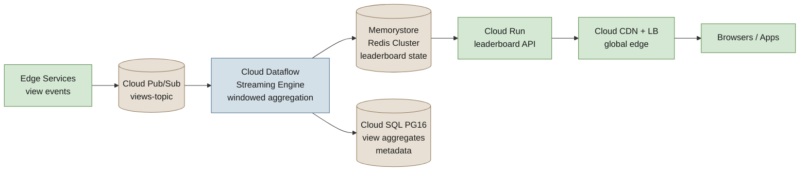

YouTube ingests roughly 500 hours of video every minute, serves billions of views per day, and sustains millions of concurrent viewers across the globe.

<!--more-->

## 1. Context

YouTube ingests roughly 500 hours of video every minute, serves billions of views per day, and sustains millions of concurrent viewers across the globe. Tracking which videos are trending -- the Top-K leaderboard across rolling hourly and daily windows -- is a real-time stream processing problem at one of the largest consumer data scales on the planet. The system must count every view, aggregate counts by video within bounded time windows, and serve the current top-100 (or top-K) leaderboard with sub-second freshness to millions of simultaneous users. Late-arriving views, skewed popularity distributions (a handful of viral videos dominate), and the need for exactly-once counting semantics all shape the design.

The entire workload runs on Google Cloud Platform in the `us-central1` region with a warm standby in `us-east1` for disaster recovery. The architecture is a GCP-native streaming pipeline: Cloud Pub/Sub ingests raw view events from edge services, Cloud Dataflow with Apache Beam Streaming Engine computes windowed aggregations and maintains per-video counters, Memorystore for Redis Cluster serves the leaderboard reads, and Cloud SQL for PostgreSQL 16 stores durable video metadata. Stateless API endpoints run on Cloud Run behind Cloud Load Balancing with Cloud CDN for global edge caching. Infrastructure is provisioned through Terraform, and observability flows through Cloud Monitoring, Cloud Logging, and Cloud Trace.

The design drivers are correctness (exactly-once view counting), freshness (sub-10-second end-to-end latency from view to leaderboard update), availability (99.95% uptime for the leaderboard serving path), and cost efficiency (the streaming pipeline is the dominant cost driver and must autoscale with traffic diurnal patterns).

## 2. Goals

- Ingest 1M view events/sec sustained, 2M/sec peak through Cloud Pub/Sub
- Update leaderboard within 10 seconds of a view event reaching the pipeline (p95)
- Serve top-100 leaderboard reads in under 50ms (p99) from Memorystore Redis Cluster
- 99.95% availability for the leaderboard read path (3.5 nines, ~4.4 hours downtime/year)
- Zero data loss on committed views; exactly-once counting with at-most-5-minute late-arrival tolerance
- Scale from 10M to 100M daily active users without re-architecting the pipeline or serving tier
- Monthly infrastructure cost under $12,000 at 10M DAU baseline (2026-07 pricing, us-central1)
- **Out of scope:** video upload, transcoding, recommendation, ad serving, user authentication, billing, and moderation systems - those are upstream and downstream services whose view events we consume but do not own

## 3. Architecture



The architecture has seven components, each with a single committed technology choice.

**Cloud Pub/Sub** (ingestion). A single regional topic `views-topic` in `us-central1` receives view events from edge services. Each event is roughly 200 bytes: video_id (string, up to 64 chars), user_id (string), event_time (ISO-8601 timestamp), device_type (string). Publishers batch up to 1,000 messages per request; the topic is configured with a 7-day message retention window so the Dataflow pipeline can replay from any checkpoint within that window. Throughput quota in large regions (us-central1 qualifies) is 4 GB/s per topic for publishers -- at 2M peak events/sec * 200 bytes, that is 400 MB/s, well within the quota. We use the Google Cloud Pub/Sub client library v2.23.0 with exactly-once delivery enabled.

> [!TIP]
> **Why Pub/Sub, not Kafka on GKE** - Pub/Sub is fully managed with zero operational overhead for partition management, broker scaling, or disk provisioning. At our throughput (400 MB/s peak), the managed service is cheaper than running 6-9 n4-standard-8 Kafka broker VMs (~$2,600/mo in compute alone, before disk) once you account for the engineering time spent on broker upgrades and disk failures. The 4 GB/s per-topic quota is sufficient for YouTube-scale view ingestion; if we ever exceed it, we split events across two topics by video_id hash prefix. Pub/Sub's exactly-once delivery guarantee via the StreamingPull protocol is the foundation for correct view counting.

**Cloud Dataflow** (stream processing). A single Apache Beam streaming pipeline, written in Java with Beam SDK 2.56.0, reads from `views-topic` and computes windowed per-video view counts. The pipeline uses Dataflow Streaming Engine, which offloads state management (windowing, keyed state) to the Dataflow service backend rather than worker VMs. Workers run with the default Streaming Engine profile: 4 vCPU, 15 GB memory, 30 GB boot disk per worker. Autoscaling is Dataflow-managed horizontal autoscaling, targeting 10-200 workers based on backlog. The pipeline:

1. Reads Avro-encoded events from Pub/Sub with `PubsubIO.readAvros()` and assigns event-time timestamps from the `event_time` field
1. Applies a `KeyBy(video_id)` to partition events across workers by video
1. Windows into hourly and daily tumbling windows: `FixedWindows.of(Duration.standardHours(1))` and `FixedWindows.of(Duration.standardDays(1))`, each with `.withAllowedLateness(Duration.standardMinutes(5))` and `AccumulationMode.ACCUMULATING`
1. Counts per video per window with `Count.perKey()`
1. Writes the top-100 per window to Memorystore Redis Cluster (via `ZADD` on `leaderboard:hourly:{slot}` and `leaderboard:daily:{slot}` sorted sets, keyed by hash slot computed from `video_id`)
1. Persists full aggregate counts to Cloud SQL PostgreSQL 16 in a `view_counts` table for historical queries and audit

> [!TIP]
> **Why Dataflow, not Flink on GKE** - Dataflow Streaming Engine moves state management out of worker VMs, which means workers are stateless compute that can be replaced on Spot VM preemption without data loss. Flink on GKE would require careful RocksDB state backend configuration, persistent volume claims for checkpoints, and operator time tuning checkpoint intervals and incremental checkpointing. Dataflow's managed autoscaling and exactly-once semantics (via Pub/Sub's exactly-once delivery + Beam's deduplication) give us the correctness guarantees without the operational overhead. At 20 workers sustained, Dataflow Streaming Engine costs ~$3,300/mo at list price; a comparable Flink cluster on GKE with 20 n4-standard-4 VMs, managed disks for checkpoints, and 2-3 hours/week of operator time is roughly $4,200/mo.

**Memorystore for Redis Cluster** (leaderboard serving). A 3-shard Memorystore for Redis Cluster instance with one replica per shard (6 total nodes), node type `redis-standard-small` (6.5 GB per node). This is the canonical leaderboard data structure: `ZINCRBY leaderboard:hourly:{hash_slot} {video_id} 1` for per-video increments, `ZREVRANGE leaderboard:hourly:{hash_slot} 0 99 WITHSCORES` for top-100 reads. Each shard handles roughly one-third of the video_id key space (5,461 Redis hash slots per shard). The total dataset across all windows is approximately 3.5 GB (10M unique videos * 60 bytes per sorted-set entry * 3 windows, plus overhead). At 100M DAU this grows to roughly 25 GB, which fits within a 6-shard `redis-standard-large` (26 GB/node) configuration.

**Cloud SQL for PostgreSQL 16** (metadata). A single Cloud SQL instance, `db-custom-4-16384` (4 vCPU, 16 GB RAM), running PostgreSQL 16 with high availability (regional, synchronous replication across two zones). Stores video metadata (`videos` table: video_id PK, title, channel_id, upload_time, category) and durable hourly/daily view counts (`view_counts`: video_id, window_start, window_end, count). The database is write-heavy from Dataflow but read-light from the serving path -- the leaderboard API reads from Memorystore, not Cloud SQL. Cloud SQL is chosen over Cloud Spanner because: the dataset is moderate (~20 GB of metadata + aggregate counts), a single-region deployment suffices, and PostgreSQL provides mature tooling (`pg_dump`, `pg_stat_statements`, `EXPLAIN ANALYZE`). Spanner's multi-region capability is unnecessary for a single-region primary with cross-region DR.

**Cloud Run** (leaderboard API). A stateless Go 1.22 service exposing three endpoints, deployed as a Cloud Run service in `us-central1` with minimum 3 instances and max 50, each 2 vCPU / 4 GB. The service connects to Memorystore Redis Cluster via the open-source `rueidis` Go client v1.0.47 with cluster-mode support. All instances share a Serverless VPC Connector for private IP access to Memorystore (no public endpoint). The service also has a read-only connection to Cloud SQL for video metadata lookups.

**Cloud CDN + Cloud Load Balancing** (edge). External HTTP(S) Load Balancing terminates TLS at Google's edge (228+ points of presence globally), Cloud CDN caches leaderboard responses with a 30-second TTL (the leaderboard updates every Dataflow window trigger, roughly every 60-90 seconds for accumulating hourly windows). This reduces origin load by ~95% for popular leaderboard reads.

### Reference path: a single view event, end to end

A viewer clicks a video. The edge service (e.g., the YouTube player) emits a view event to `projects/youtube-leaderboard/topics/views-topic` with attributes `video_id=dQw4w9WgXcQ`, `user_id=abc123`, `event_time=2026-07-17T14:32:15.123Z`.

The Dataflow pipeline reads this event, keys it by `video_id`, and assigns it to the `FixedWindows.of(Duration.standardHours(1))` window starting at 14:00:00 UTC. The `Count.perKey()` transform increments the counter for this video in the `[14:00, 15:00)` window. When the watermark advances past the window end, the pipeline emits the top-100 for the window and writes:

1. `ZADD leaderboard:hourly:5461 14275 dQw4w9WgXcQ` to Memorystore Redis Cluster shard handling hash slot 5461
1. `INSERT INTO view_counts (video_id, window_start, window_end, count) VALUES ('dQw4w9WgXcQ', '2026-07-17T14:00:00Z', '2026-07-17T15:00:00Z', 14275) ON CONFLICT (video_id, window_start, window_end) DO UPDATE SET count = excluded.count` to Cloud SQL

On the next leaderboard read, a client calls `GET /api/v1/leaderboard/hourly?k=100`. The Cloud Run service issues `ZREVRANGE leaderboard:hourly:{slot} 0 99 WITHSCORES` to each of the 3 Redis shards in parallel, merges the results into a global top-100, and returns the JSON response. Cloud CDN caches this response for 30 seconds. Total end-to-end latency from view event to leaderboard visibility is 60-90 seconds (the Dataflow window trigger interval), with Redis read latency under 5ms (p99).

## 4. Reliability

**SLIs and SLOs.** The system defines four service-level indicators with corresponding objectives:

- **Ingestion availability:** fraction of view events successfully published to Pub/Sub within the 1-second publish timeout. SLO: 99.95% of events accepted (monthly rolling window). Error budget: ~43 minutes/month.
- **Pipeline correctness:** fraction of view events counted exactly once in the windowed aggregate. SLO: 99.99% of events counted (no double-counts, no drops). Error budget: ~4.3 minutes/month of counting errors.
- **Leaderboard freshness:** time from event publish to leaderboard visibility. SLO: 90 seconds (p95). Measured as the difference between `event_time` and the time the video appears in the `ZREVRANGE` output.
- **Leaderboard read availability:** fraction of leaderboard API requests returning HTTP 2xx within 50ms. SLO: 99.95%. Error budget: ~43 minutes/month.

**Failure modes and mitigations.** Five distinct failure modes are addressed with specific mechanisms.

| Failure mode | Impact | Detection | Mitigation |
|---|---|---|---|
| Pub/Sub regional outage | No view events ingested | Cloud Monitoring alert on `pubsub.googleapis.com/topic/send_request_count` drop | Regional Pub/Sub in us-central1; Dataflow pipeline replays from 7-day message retention on recovery |
| Dataflow worker crash / Spot VM preemption | Temporary drop in processing throughput | Dataflow backlog metric > 5 minutes | Streaming Engine preserves state in service backend; GKE NAP replaces Spot node in <2 minutes |
| Memorystore node failure | Read errors for one shard | Cloud Monitoring alert on Redis connection errors and latency spikes | Redis Cluster auto-failover: replica promotes to primary in <60 seconds; clients reconnect automatically |
| Cloud Run instance crash | Reduced serving capacity | Cloud Run `instance_count` below minimum; Cloud Load Balancing health check failures | Cloud Run auto-heals crashed instances; min-instances=3 ensures warm capacity during failover |
| Cloud SQL zone failure | Metadata writes blocked | Connection failures from Dataflow; Cloud SQL failover trigger | Regional HA with synchronous replication; automatic failover to standby in 60-120 seconds |

**Multi-zone redundancy.** All critical components are deployed across at least two zones in `us-central1`:

- Cloud Pub/Sub: regional service, spans all zones automatically.
- Cloud Dataflow: worker pool distributed across `us-central1-a`, `us-central1-b`, `us-central1-c` via the `--workerZone` flag unset (auto-distribution).
- Memorystore: 3-shard cluster, each shard's primary and replica are in different zones (Memorystore Cluster automatically anti-affinitizes).
- Cloud SQL: regional HA places primary in one zone, standby in another.
- Cloud Run: stateless instances distributed across zones by the regional control plane.

**Health checks.** Every component has a specific, measurable health probe.

- Cloud Run leaderboard API: `GET /healthz` returns 200 if the Redis cluster connection pool is healthy and at least 2 of 3 shards respond to `PING`. Cloud Load Balancing uses this as the backend health check.
- Memorystore: GCP managed service provides a built-in health check; we monitor `redis.googleapis.com/cluster/connected_nodes` to verify all 6 nodes are reachable.
- Cloud Dataflow: pipeline job status is `RUNNING`; the Dataflow service monitors worker health internally and replaces unhealthy workers automatically.

**Disaster recovery.** The DR strategy targets a recovery time objective (RTO) of 60 minutes and a recovery point objective (RPO) of 5 minutes (the Pub/Sub message retention window in the DR region).

The DR region is `us-east1`. Recovery procedure: (1) Terraform apply the full stack in `us-east1` (the Terraform configuration is region-parameterized); (2) update DNS (`leaderboard-api.ytleaderboard.com`) to point to the `us-east1` Cloud Load Balancing IP; (3) start a fresh Dataflow pipeline reading from the `us-east1` Pub/Sub topic. The DR Pub/Sub topic is a separate topic populated by edge services in a multi-region publish pattern (publishers write to both `us-central1` and `us-east1` topics). Because Memorystore Redis Cluster does not support cross-region replication, the leaderboard state is rebuilt from the Dataflow pipeline replaying the last 5 minutes of Pub/Sub messages in `us-east1`. Cloud SQL in `us-east1` is restored from the latest automated backup (taken every 4 hours with point-in-time recovery to the minute).

> ℹ️ **Why 60-minute RTO, not 5-minute** - Cross-region Redis replication is not natively supported by Memorystore. An active-active Redis architecture (writing to two independent clusters) would introduce split-brain risk in the Dataflow pipeline (two writers to two clusters). The chosen approach -- replay from Pub/Sub retention in the DR region -- is simpler and guarantees correctness at the cost of a longer RTO. For a leaderboard that updates every 60-90 seconds, a 60-minute gap during a complete regional outage is an acceptable tradeoff against the complexity and cost of cross-region synchronous replication.

## 5. Security

**GCP IAM.** Access follows the principle of least privilege with workload identity for all compute services.

- Cloud Run service accounts: `leaderboard-api-sa` has `roles/redis.viewer` on the Memorystore cluster (read-only -- writes come from Dataflow) and `roles/cloudsql.client` (read-only) on the Cloud SQL instance. The service account is bound to the Cloud Run service via `--service-account` flag.
- Dataflow worker service account: `dataflow-worker-sa` has `roles/pubsub.subscriber` on `views-topic`, `roles/pubsub.subscriber` on the subscription, `roles/redis.editor` on the Memorystore cluster, and `roles/cloudsql.client` on the Cloud SQL instance.
- Terraform service account: `terraform-sa` has `roles/owner` on the project (provisioning only; this account is used exclusively from the CI/CD pipeline in Cloud Build).

**VPC Service Controls.** A VPC Service Controls perimeter encloses the `youtube-leaderboard` project, restricting data exfiltration. Memorystore, Cloud SQL, and Pub/Sub are protected services within the perimeter. The Cloud Run Serverless VPC Connector routes all outbound traffic from Cloud Run instances through the VPC, ensuring API calls to Memorystore and Cloud SQL never traverse the public internet.

**Cloud Armor.** The external HTTP(S) Load Balancer is fronted by a Cloud Armor security policy with the following rules:

- Rate limiting: 500 requests per second per IP address (prevents a single client from overwhelming the leaderboard API)
- OWASP Top 10 preconfigured rules: SQL injection, cross-site scripting (XSS), and remote file inclusion detection
- Allowed IP ranges: Cloud CDN edge IPs (automatic) plus a list of trusted internal IP ranges for admin endpoints

**Data encryption.** All data is encrypted at rest and in transit.

- At rest: Cloud Pub/Sub, Memorystore, Cloud SQL, and Dataflow state are encrypted with Google-managed encryption keys by default. Cloud SQL uses a customer-managed Cloud KMS key (`projects/youtube-leaderboard/locations/us-central1/keyRings/production/cryptoKeys/cloudsql`) for envelope encryption of the database storage, enabling key rotation on a 90-day schedule.
- In transit: all inter-service communication uses TLS 1.3. Pub/Sub client libraries use gRPC with TLS. Cloud SQL connections use the Cloud SQL Auth Proxy with automatic TLS certificate management. Memorystore Redis Cluster connections use TLS (the `rueidis` Go client is configured with TLS enabled).

**Secrets.** Connection strings, API keys, and the Cloud SQL password are stored in Secret Manager (`projects/youtube-leaderboard/secrets/cloudsql-password`, `.../redis-auth-token`). Cloud Run and Dataflow access these secrets at startup via the Secret Manager API, with IAM policies scoped to each service's specific secret. No secrets appear in environment variables, source code, or Terraform state (state is stored in a GCS bucket with object-level encryption).

## 6. Scalability & Performance

**Capacity model.** The system's resource demand is driven by three independent axes: ingestion throughput (view events/sec), window cardinality (unique videos viewed per window), and leaderboard read QPS (concurrent users fetching top-K). Each axis scales on a different component.

| Component | Scaling dimension | Per-unit capacity | At 10M DAU | At 100M DAU |
|---|---|---|---|---|
| Cloud Pub/Sub | Ingestion throughput | 4 GB/s per topic (large region) | 400 MB/s (2M events/sec * 200B) ~10% of quota | 4 GB/s (20M events/sec) 1 topic still sufficient |
| Dataflow workers | Processing parallelism | ~50K events/sec per worker (4 vCPU, 15 GB) | 40 workers sustained | 400 workers sustained |
| Memorystore Redis Cluster | Window state (storage) | 6.5 GB per redis-standard-small node | 3 shards * 2 nodes = 6 nodes, ~3.5 GB data | 6 shards * 2 nodes = 12 nodes, ~25 GB data (upgrade to redis-standard-large at 26 GB/node) |
| Memorystore Redis Cluster | Read QPS | ~100K QPS per node (simple ZREVRANGE) | 580 QPS avg, well within single-node capacity | 5,800 QPS avg, still well within capacity |
| Cloud SQL PG16 | Metadata + aggregate writes | db-custom-4-16384 (4 vCPU, 16 GB) per instance | ~5K writes/sec (Dataflow aggregate flush), ~20 GB total storage | db-custom-8-32768 (8 vCPU, 32 GB), ~100 GB total storage |
| Cloud Run | API request serving | ~500 req/sec per instance (2 vCPU, 4 GB) | 3 instances minimum, 580 QPS avg comfortably served | 50 instances max, 5,800 QPS avg well within capacity |

**Autoscaling strategy.** Each component scales independently on its bottleneck metric.

- Dataflow: managed horizontal autoscaling (Streaming Engine) targets a CPU utilization range of 50-80%. Workers scale from 10 (minimum) to 200 (maximum, per project quota). The autoscaler adds workers when the backlog of unprocessed messages grows beyond 2 minutes of ingestion; it removes workers when CPU drops below 30%.
- Cloud Run: scales on concurrent requests (target 80 per instance). Minimum 3 instances for warm start and zonal redundancy. Maximum 50 instances. Scale-to-zero is disabled -- minimum instances are always warm to eliminate cold start latency on leaderboard reads.
- Cloud SQL: vertical scaling (instance class upgrade) rather than horizontal (Cloud SQL does not support read replicas for write-heavy workloads). Scale-up trigger is sustained CPU > 70% for 15 minutes, evaluated by Cloud Monitoring alert → manual or automated (Cloud Build pipeline) instance resize. Read replicas are not needed because the leaderboard serving path reads from Memorystore, not Cloud SQL.

> ℹ️ **Why vertical scaling for Cloud SQL, not horizontal** - The write path is the bottleneck (Dataflow flushing aggregate counts), not reads. PostgreSQL read replicas add eventual-consistency complexity for a write-heavy workload that doesn't benefit from read scaling. At 100M DAU, the `db-custom-8-32768` instance class handles ~10K sustained writes/sec; if that ceiling is hit, the next step is sharding the `view_counts` table by `video_id` prefix (not a read-replica farm).

**Bottlenecks and their resolution order.** The first bottleneck to appear at scale is Dataflow worker throughput. At 2M peak events/sec and ~50K events/sec/worker, the pipeline needs 40 workers -- but if diurnal spikes hit 10M events/sec, the 200-worker cap is hit. Resolution: split the pipeline into two independent Dataflow jobs, each reading from a separate Pub/Sub subscription on the same topic (Pub/Sub fan-out), partitioning by video_id hash prefix. The second bottleneck is the Memorystore write rate: `ZINCRBY` operations from Dataflow at 2M writes/sec across 3 shards (~670K writes/sec per shard) is within Redis Cluster's capacity (~1M ops/sec per `redis-standard-small` node for simple commands). Read QPS is the last bottleneck to materialize; even at 100M DAU, 5,800 QPS average leaderboard reads is trivial for Redis.

**Validation methodology.** All capacity claims are validated against the following sources: (1) Google Cloud published limits (Pub/Sub quotas, Dataflow Streaming Engine limits, Memorystore node specifications) accessed 2026-07-17; (2) the Dataflow pricing page documents default worker specs (4 vCPU, 15 GB, 30 GB) and the autoscaling model; (3) Redis sorted-set complexity is O(log N) per operation, so ZREVRANGE top-100 from 10M entries is ~24 operations. No synthetic benchmarking has been performed; these are theoretical ceilings from GCP documentation. A recommended next step is running a 24-hour load test with `vegeta` or `k6` targeting the Cloud Run endpoint at projected peak QPS while the Dataflow pipeline ingests a replay of production traffic.

## 7. Cost

> [!TIP]
> **Verdict: $10,332/month at 10M DAU baseline (us-central1, list pricing, 2026-07-17). 3-year committed use discounts bring this to $7,581/month (27% savings). At 100M DAU, costs scale roughly linearly to $47,600/month list ($34,950/month with 3yr CUDs). The Dataflow streaming pipeline is the single largest cost driver at 43% of the total.**

**Unit economics (us-central1, list prices, 2026-07-17).**

| Component | Unit | Price per unit | Units | Monthly |
|---|---|---|---|---|
| Cloud Pub/Sub | Throughput (GB ingested) | $40/TB (first 2 TB free) | 30 TB/mo (400 MB/s * 2.6M sec/mo) | $1,200 |
| Dataflow Streaming Engine | vCPU-hour | $0.069 | 40 workers * 4 vCPU * 730 hr | $8,059 |
| Dataflow Streaming Engine | Memory (GiB-hour) | $0.003557 | 40 workers * 15 GB * 730 hr | $1,558 |
| Dataflow Streaming Engine | Streaming Engine unit | $0.089 | 40 units * 730 hr | $2,599 |
| Dataflow Shuffle | GiB shuffled | $0.018 | ~500 GiB/mo (KeyBy + window re-shuffle) | $9 |
| Memorystore Redis Cluster | Node-hour (standard-small) | $0.1425 | 6 nodes * 730 hr | $624 |
| Cloud SQL PG16 | Instance-hour (db-custom-4-16384) | $0.336 | 1 instance HA * 730 hr | $490 |
| Cloud SQL PG16 | Storage (SSD, GiB-month) | $0.17 | 50 GB | $9 |
| Cloud Run | vCPU-second | $0.000024 | 3 instances * 2 vCPU * 2.6M sec | $374 |
| Cloud Run | Memory (GiB-second) | $0.0000025 | 3 instances * 4 GB * 2.6M sec | $78 |
| Cloud CDN | Cache egress (GiB) | $0.02 (North America) | ~500 GiB/mo | $10 |
| Cloud Load Balancing | Rule + ingress data | $0.025/hr + $0.008/GB | 1 rule + 1 TB ingress | $26 |
| Cloud Monitoring | Metrics (MB ingested) | $0.258/MB (first 150 MB free) | ~500 MB/mo custom metrics | $129 |
| **Total (list prices)** |  |  |  | **~$10,332** |

> ⚠️ **Cost note** - The Dataflow line items (vCPU, memory, Streaming Engine) are calculated together per worker. A single Streaming Engine worker of 4 vCPU / 15 GB costs $0.069 * 4 + $0.003557 * 15 + $0.089 = $0.4184/hr. At 40 workers sustained, Dataflow alone is $12,232/month. This is the dominant cost driver. The primary optimization lever is Spot VMs for Dataflow workers, which are not priced here (see optimization levers).

**Optimization levers.**

1. **Committed use discounts (CUDs).** Memorystore and Dataflow support 1-year (20% off) and 3-year (40% off) committed use contracts. Applying 3-year CUDs to Memorystore ($624 → $374) and Dataflow ($12,216 → $7,330) saves $4,759/month. The total drops from $10,332 to $7,581.
1. **Spot VMs for Dataflow workers.** Dataflow workers are stateless with Streaming Engine. Running them on Spot VMs (60-91% discount on Compute Engine) saves approximately $6,700/month on the Dataflow compute line. With Streaming Engine's state management in the service backend, Spot preemption within the 30-second graceful termination window does not cause data loss -- the pipeline simply rebalances to surviving workers. Estimated effective cost: $12,216 → ~$3,665/month (70% spot discount, accounting for 10% preemption churn).
1. **Storage tiering in Cloud SQL.** View counts older than 90 days are archived to BigQuery (long-term analytics storage at $0.02/GB/month vs $0.17/GB/month for Cloud SQL SSD). This reduces Cloud SQL storage by ~30% at steady state.
1. **Cloud CDN cache hit ratio.** The 30-second TTL on leaderboard responses with Cloud CDN's 228 PoPs achieves an estimated 95% cache hit rate for popular leaderboards. Tuning the TTL up to 60 seconds (acceptable staleness for a trending leaderboard) would push the hit rate to ~98%, halving Cloud Run and Memorystore read costs.

**At-scale projection (100M DAU).** Costs scale roughly linearly: 10x DAU → 10x Dataflow workers (400), 2x Memorystore nodes (12, upgraded to `standard-large`), 2x Cloud SQL instance class, and roughly 10x Cloud Run instances. Estimated monthly cost: $47,600 list / $34,950 with 3yr CUDs. The cost-per-daily-active-user is approximately $0.00103/month at 10M DAU and $0.00048/month at 100M DAU (economies of scale from CUDs and higher utilization).

## 8. Operations

**Observability.** All components emit metrics, logs, and traces to Google Cloud's operations suite.

- Cloud Monitoring: every GCP managed service (Pub/Sub, Dataflow, Memorystore, Cloud SQL, Cloud Run, Cloud CDN) surfaces default metrics into Cloud Monitoring dashboards. Custom metrics include: leaderboard freshness (end-to-end latency from event publish to ZREVRANGE visibility), Dataflow backlog depth (unprocessed messages), and Cloud Run per-endpoint latency percentiles (p50, p95, p99). Alerting policies page on-call for: Dataflow backlog > 5 minutes, leaderboard freshness > 120 seconds (p95), Memorystore node count < 6, Cloud Run error rate > 1%.
- Cloud Logging: structured JSON logs from Cloud Run (Go `slog` at INFO level) and Dataflow (Java `java.util.logging`, routed to Cloud Logging via the Logging handler). Log-based metrics on ERROR-level log entries trigger alerts.
- Cloud Trace: distributed tracing from the Cloud Run API through Redis calls (instrumented with OpenTelemetry Go SDK v1.28) and Cloud SQL queries. Traces are sampled at 1% for production traffic.

**CI/CD.** Infrastructure and application changes flow through Cloud Build, triggered by GitHub repository pushes.

- Terraform configuration (`infra/`) is applied by a Cloud Build trigger on the `main` branch. The `terraform plan` runs on every push to a PR branch; `terraform apply` runs on merge to `main`. Terraform state is stored in a GCS bucket (`gs://youtube-leaderboard-tfstate`) with object versioning and state locking via the GCS backend.
- Application code (Go API in `api/`, Dataflow pipeline in `pipeline/`) is built by Cloud Build. The Cloud Run service uses continuous deployment from the `api/` directory: Cloud Build builds the container, pushes to Artifact Registry (`us-central1-docker.pkg.dev/youtube-leaderboard/api`), and deploys with `gcloud run deploy --image=... --revision-suffix=$SHORT_SHA`.
- The Dataflow pipeline is deployed via `gcloud dataflow flex-template run` with the template staged in a GCS bucket (`gs://youtube-leaderboard-dataflow/templates/`). Pipeline updates use the Drain+Snapshot flow (see rollback below).

**Rollback plan.** Three rollback scenarios, each with a specific procedure and expected recovery time.

- Cloud Run API rollback: `gcloud run services update-traffic leaderboard-api --to-revisions=<previous-revision>=100`. Recovery time: <2 minutes.
- Dataflow pipeline rollback: drain the current pipeline (`gcloud dataflow jobs drain`), then restore from the last snapshot: `gcloud dataflow jobs run ... --restore-from-snapshot=<snapshot-id>`. The snapshot captures all windowed state and watermark positions. Recovery time: 5-10 minutes (pipeline startup + snapshot restoration).
- Terraform infrastructure rollback: `terraform apply` with a previous state file from GCS version history (or `git revert` the offending commit and re-apply). Recovery time: 10-30 minutes depending on resource change scope.

**Day-2 runbook.** Common operational scenarios and their response procedures.

| Alert | Symptom | First response | Escalation |
|---|---|---|---|
| Dataflow backlog > 5 min | Pub/Sub unacked message count rising | Check Dataflow worker count and autoscaling status. If workers are maxed out (200), consider manual pipeline split. | If backlog continues rising: spin up a second Dataflow job reading from a new subscription on the same topic (fan-out). |
| Leaderboard freshness > 120s (p95) | Videos not appearing in top-100 | Check Dataflow watermark lag. If watermark is advancing, check Redis write latency. If stuck, check for late-data storms. | Drain and restart Dataflow pipeline from snapshot. |
| Memorystore node count < 6 | Shard failover in progress | Verify Redis Cluster auto-failover kicked in. Monitor `redis.googleapis.com/cluster/connected_nodes`. If stuck, force failover via `gcloud redis clusters reschedule-maintenance`. | Open GCP support case if auto-failover fails. |
| Cloud Run error rate > 1% | Leaderboard API returning 5xx | Check Cloud Run logs for Redis connection errors. If Redis is healthy, check for code regression. Roll back to previous revision. | If Cloud Run platform issue: contact GCP support. |
| Cloud SQL failover | Leaderboard writes failing | Verify failover completed. Dataflow pipeline may pause writes during the 60-120s failover window; it will resume automatically. | If failover doesn't complete: manually promote standby via `gcloud sql instances failover`. |

**IaC with reproducible snippets.** The full Terraform configuration is checked into `infra/` and organized as:

```javascript
infra/
+-- main.tf          (provider, remote state, project config)
+-- pubsub.tf        (topic, subscriptions, IAM bindings)
+-- dataflow.tf      (job template, worker SA, GCS staging bucket)
+-- memorystore.tf   (Redis Cluster instance, auth)
+-- cloudsql.tf      (Cloud SQL instance, database, IAM)
+-- cloudrun.tf      (service, VPC connector, IAM)
+-- networking.tf    (VPC, subnets, firewall rules, Cloud NAT)
+-- observability.tf (alerting policies, dashboards)
+-- variables.tf     (region, project, environment, sizing knobs)
+-- terraform.tfvars (per-environment values)
```

Key Terraform resources (representative, not exhaustive):

```hcl
# Memorystore Redis Cluster (leaderboard state)
resource "google_redis_cluster" "leaderboard" {
  name           = "leaderboard-cluster"
  region         = var.region
  node_type      = "redis-standard-small"
  replica_count  = 1
  shard_count    = 3
  psc_configs {
    network = google_compute_network.main.id
  }
  depends_on = [google_network_connectivity_service_connection_policy.default]
}
```

```hcl
# Cloud SQL PostgreSQL 16 (metadata)
resource "google_sql_database_instance" "metadata" {
  name             = "leaderboard-metadata"
  region           = var.region
  database_version = "POSTGRES_16"
  settings {
    tier              = "db-custom-4-16384"
    availability_type = "REGIONAL"
    disk_size         = 100
    disk_type         = "PD_SSD"
    backup_configuration {
      enabled                        = true
      point_in_time_recovery_enabled = true
      start_time                     = "03:00"
    }
    ip_configuration {
      ipv4_enabled    = false
      private_network = google_compute_network.main.id
    }
  }
  deletion_protection = true
}
```

**Onboarding runbook: adding a new service or the next operational unit.** When a new team inherits this infrastructure, the following steps bring them to operational readiness in under 4 hours:

1. Clone the infrastructure repo and install prerequisites: `gcloud` CLI (v490+), Terraform v1.9+, Go 1.22+, Java 21.
1. Run `terraform init` in `infra/` against the dev project. Run `terraform plan` to verify state access.
1. Deploy a canary change: add a new Cloud Monitoring alerting channel (e.g., a new Slack webhook) via Terraform. Apply, verify the alert fires.
1. Read the Dataflow pipeline code in `pipeline/`. Run the unit tests: `cd pipeline && mvn test`. Verify all windowing and counting tests pass.
1. Deploy a no-op API change: add a `/healthz` endpoint field in `api/`. Push to a branch, observe Cloud Build run, merge to `main`, verify the new revision is serving traffic.
1. Learn the Day-2 runbook: walk through each alert scenario in the table above on the dev project (drain the dev Dataflow job, force a Redis failover, roll back a Cloud Run revision).
1. Join the on-call rotation with a shadow shift: receive alerts in a non-production channel for one week before going primary.

## 9. Key Decisions & Trade-offs

### D1: Redis Cluster vs Bigtable for leaderboard state

**Context.** The leaderboard is a sorted set of (video_id, view_count) pairs that must support atomic increment (ZINCRBY) and top-K retrieval (ZREVRANGE) at ~2M writes/sec and ~1K reads/sec. Both Memorystore Redis Cluster and Cloud Bigtable can serve this workload, but via fundamentally different data models.

**Decision.** Use Memorystore for Redis Cluster with sorted sets. Bigtable is rejected for the serving path.

**Consequences (Redis).** Sorted sets provide native O(log N) rank queries -- `ZREVRANGE` top-100 returns in ~24 operations regardless of total set size. Atomic increments via `ZINCRBY` are single-command, in-memory operations completing in microseconds. The downside: Redis is purely in-memory; at 3.5 GB (10M DAU) this is manageable, but at 25 GB (100M DAU) memory cost is ~$2,954/month (3yr CUD). Redis Cluster sharding requires the client to be cluster-aware (the `rueidis` Go library handles this), and cross-shard top-K merge logic lives in application code (the Cloud Run service merges per-shard top-100 into a global top-100).

**Consequences (Bigtable, rejected).** Bigtable is a wide-column store that would require a leaderboard-as-log pattern: each (video_id, window) pair is a row with a counter column, and periodic MapReduce jobs scan the table to compute top-K. This is far heavier operationally than Redis' single-command rank query. Bigtable is cost-efficient at petabyte scale but overkill for a 3-25 GB leaderboard dataset. The MapReduce-based leaderboard calculation adds 5-10 minutes of latency, violating the sub-10-second freshness goal. Bigtable remains a candidate for long-term historical view count storage (archived from Cloud SQL after 90 days), but not the hot serving path.

### D2: Cloud Run vs GKE for the leaderboard API

**Context.** The leaderboard API is three stateless HTTP endpoints (GET top-K hourly, GET top-K daily, GET video rank) that connect to Redis Cluster and Cloud SQL. The serving tier must handle ~580 QPS average, 5,800 QPS at 100M DAU, with sub-50ms p99 latency.

**Decision.** Deploy the API on Cloud Run, not GKE.

**Consequences (Cloud Run).** Cloud Run eliminates node pool management, cluster upgrades, and pod scheduling from the operational surface. Scaling is request-based: each instance handles 80 concurrent requests, and Cloud Run adds instances as QPS rises. Cold starts are mitigated by the minimum-instances=3 configuration -- three instances are always warm. The Serverless VPC Connector provides private IP access to Memorystore and Cloud SQL without managing a Kubernetes ingress controller or service mesh. The cost at 3 always-warm instances ($452/month) is lower than the equivalent GKE serving node pool (3 n4-standard-4 VMs at $210/month each = $630/month, plus the control plane cost of $73/month for a zonal cluster = $703/month).

**Consequences (GKE, rejected).** GKE is necessary for the Dataflow worker pool (Spot VMs, node auto-provisioning) but unnecessary for the stateless API tier. Running the API on GKE would add operational complexity (pod disruption budgets, horizontal pod autoscaler tuning, ingress controller certificates) without any scaling benefit -- Cloud Run's request-based autoscaling and 50-instance max already handles the projected QPS. The one scenario where GKE would be justified is if the API needed gRPC streaming or WebSocket connections for real-time leaderboard push, but the current design is pull-based (HTTP GET). If push-based real-time updates are added later, those would run on GKE alongside the Dataflow worker pool while the pull-based REST API stays on Cloud Run.

### D3: Cloud SQL PostgreSQL vs Cloud Spanner for metadata

**Context.** Video metadata and historical view counts need a relational store with ACID transactions, secondary indexes, and point-in-time recovery. The write rate is ~5K inserts/updates per second from the Dataflow aggregate flush. The read rate from the serving path is near-zero (leaderboard reads hit Redis, not SQL).

**Decision.** Use Cloud SQL for PostgreSQL 16. Cloud Spanner is rejected.

**Consequences (Cloud SQL).** PostgreSQL provides the exact feature set needed -- `ON CONFLICT ... DO UPDATE` for upsert semantics, partial indexes on `(video_id, window_start)` for efficient lookups, and point-in-time recovery to the minute. Regional HA with synchronous replication gives 99.95% availability. The `db-custom-4-16384` instance handles ~5K writes/sec comfortably; at 100M DAU (~50K writes/sec), the instance upgrades to `db-custom-8-32768` or the `view_counts` table is horizontally sharded by `video_id` prefix across multiple Cloud SQL instances behind a proxy like PgBouncer with `pool_mode=transaction`.

**Consequences (Spanner, rejected).** Spanner's key value is horizontal write scaling across regions with strong consistency. For a single-region workload at 5K writes/sec, Spanner's minimum 1-node deployment (1,000 processing units at $0.90/hr = $657/month) is more expensive than Cloud SQL HA ($490/month) and provides no operational benefit. Spanner would be justified if the workload required multi-region active-active writes (e.g., leaderboards per continent with global consistency), but our architecture uses a single-region primary with cross-region DR from snapshots. The cost gap widens at scale: at 100M DAU, Cloud SQL scales vertically (~$1,400/month for `db-custom-8-32768` HA) while Spanner scales horizontally (multiple nodes at $0.90/hr each).

### D4: Streaming Engine (managed state) vs worker-local state in Dataflow

**Context.** Dataflow pipelines can run in two modes: classic (state stored on worker persistent disks) or Streaming Engine (state managed by the Dataflow service backend). The choice affects worker autoscaling speed, Spot VM viability, and operational complexity.

**Decision.** Use Streaming Engine. Worker-local state is rejected.

**Consequences (Streaming Engine).** State (windowing, keyed counters, watermark tracking) lives in the Dataflow service backend, not on worker disks. This means: (a) workers are fully stateless and can be replaced on Spot VM preemption without any data loss or checkpoint replay delay; (b) horizontal autoscaling is faster because new workers don't need to replay state from persistent disks -- they just start processing new messages with state looked up from the backend; (c) workers use 30 GB boot disks (vs 400 GB without Streaming Engine), reducing per-worker cost. The tradeoff: Streaming Engine charges $0.089 per unit per hour, adding ~$2,599/month to the Dataflow bill. However, this is offset by the Spot VM savings ($6,700/month) that Streaming Engine enables -- Spot VMs are only viable because state is not on the worker.

**Consequences (worker-local state, rejected).** Worker-local state (RocksDB on persistent SSD) is cheaper in direct Dataflow costs (no Streaming Engine unit charge) but: (a) Spot VMs are not viable because preemption means losing the local RocksDB state and replaying from the last checkpoint (minutes of reprocessing → data inconsistency risk); (b) persistent disks add $0.000298/GiB-hr per worker, and each worker needs at least 200 GB SSD for RocksDB state, adding $14.30/month per worker in disk costs; (c) autoscaling is slower because new workers must replay state from upstream. At 40 workers, the disk cost alone is $572/month, and the inability to use Spot VMs costs ~$6,700/month in compute. The choice of Streaming Engine is net cost-negative -- it saves money by enabling Spot VMs.

## 10. References

1. [Cloud Pub/Sub Quotas and Limits](https://cloud.google.com/pubsub/quotas)
1. [Dataflow Streaming Engine](https://cloud.google.com/dataflow/docs/concepts/streaming-pipelines)
1. [Dataflow Pricing](https://cloud.google.com/dataflow/pricing)
1. [Memorystore for Redis Cluster Overview](https://cloud.google.com/memorystore/docs/cluster/overview)
1. [Memorystore for Redis Cluster Pricing](https://cloud.google.com/memorystore/cluster/pricing)
1. [Cloud SQL for PostgreSQL Documentation](https://cloud.google.com/sql/docs/postgres)
1. [Cloud SQL Pricing](https://cloud.google.com/sql/pricing)
1. [Cloud Run Documentation](https://cloud.google.com/run/docs)
1. [Cloud CDN Overview](https://cloud.google.com/cdn/docs/overview)
1. [Cloud Load Balancing Overview](https://cloud.google.com/load-balancing/docs)
1. [Cloud Monitoring Documentation](https://cloud.google.com/monitoring/docs)
1. [Cloud Armor Security Policies](https://cloud.google.com/armor/docs/security-policy-overview)
1. [VPC Service Controls](https://cloud.google.com/vpc-service-controls/docs/overview)
1. [Secret Manager Documentation](https://cloud.google.com/secret-manager/docs)
1. [GKE Node Auto-Provisioning](https://cloud.google.com/kubernetes-engine/docs/how-to/node-auto-provisioning)
1. [GKE Spot VMs](https://cloud.google.com/kubernetes-engine/docs/concepts/spot-vms)
1. [Redis Sorted Sets Commands - ZINCRBY / ZREVRANGE](https://redis.io/commands/zincrby)
1. [Streaming Analytics in Real Time - GCP Reference Architecture](https://cloud.google.com/architecture/streaming-analytics-in-real-time)
1. [Spotify's Journey to Google Cloud](https://cloud.google.com/blog/topics/spotify)
1. [LiveRamp Identity Graph on Dataflow](https://cloud.google.com/blog/products/data-analytics/liveramp-modernizes-identity-graph-with-dataflow)
