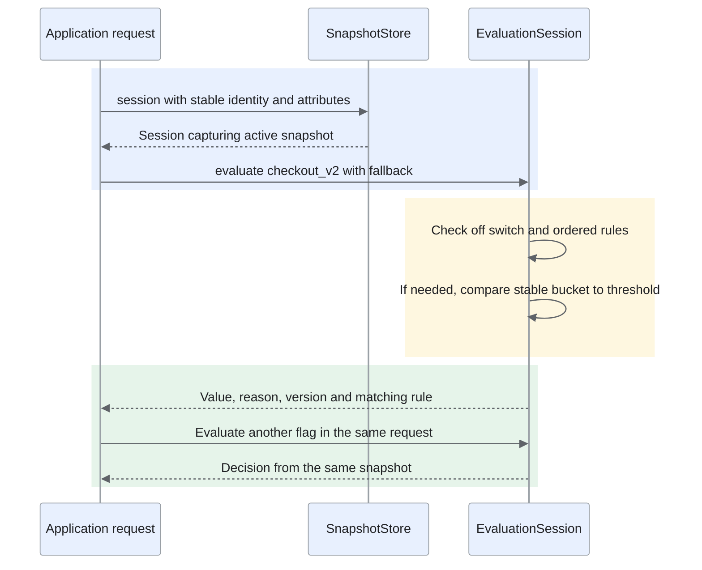
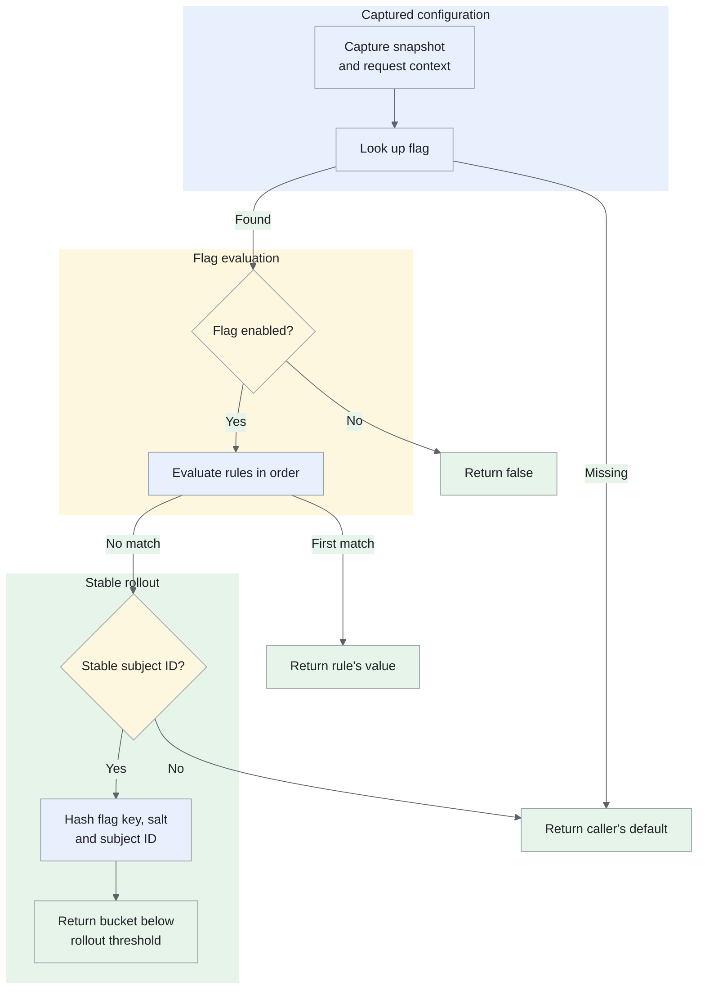
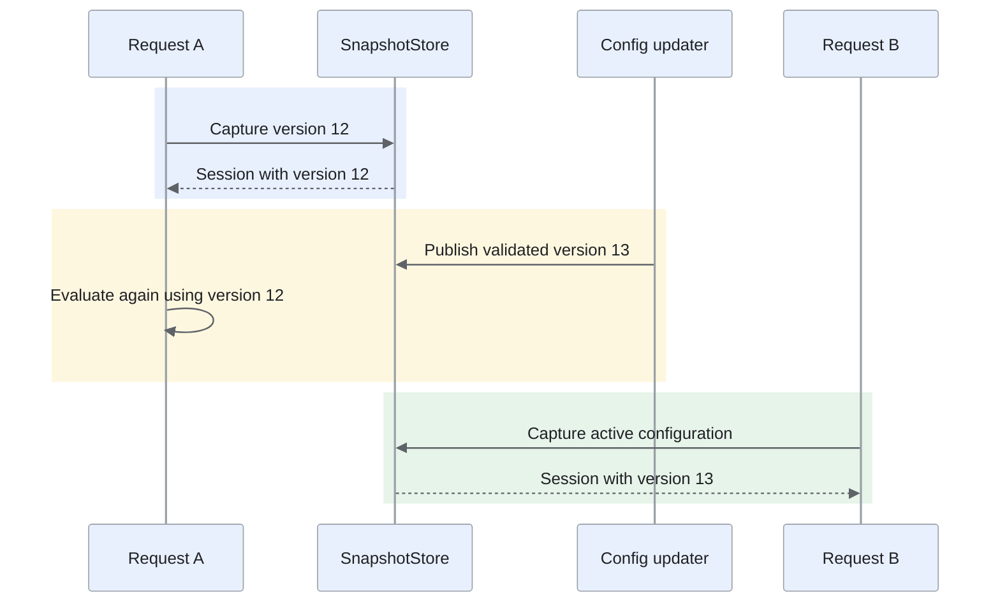

Build a local feature-flag evaluator with ordered rules, stable rollouts and request-consistent configuration.

<!--more-->

## Problem

A team has built a new checkout. They want employees to try it first, then 10% of customers, and eventually everyone. They also need to switch it off if something goes wrong.

The application asks a small library whether `checkout_v2` is enabled for a customer. Customers should not switch between checkouts just because they refresh the page. Within a request, every flag check should use the same configuration, even if an update arrives.

We'll design the part that makes this decision inside the application. The service that stores and distributes flag configuration is outside this design.

## Requirements

### Functional requirements

- **Target a group.** A rule can enable the new checkout for employees, or disable it for an excluded customer segment. Rules run in their configured order; the first match wins.
- **Roll out gradually.** A customer gets a stable position in a rollout. Increasing the percentage adds customers without removing people who were already included, provided the flag key, rollout salt and customer identity stay the same.
- **Switch a feature off.** A disabled flag returns `false`, even if a targeting rule would otherwise enable it.
- **Use a fallback.** The caller supplies a default for a missing flag or a rollout that cannot identify the customer. An anonymous customer may still match an explicit targeting rule.
- **Explain a decision.** Return the value, the reason, the configuration version and, when applicable, the rule that matched.
- **Refresh configuration.** Publish a new snapshot without changing the one a request is already using.

### Non-functional requirements

- Evaluation reads memory only: no network, disk or configuration lock on the decision path.
- The same snapshot and context produce the same decision across processes. A rollout does not depend on Python's built-in `hash()` or a fresh random number.
- Configuration and request attributes are immutable once a session captures them. Copy incoming dictionaries rather than exposing a mutable caller-owned mapping.
- Reject invalid rollout thresholds, duplicate rule IDs and stale configuration versions before replacing the active snapshot.
- Make the decision logic easy to test without a running configuration service.

### Out of scope

- Flag administration, authentication and configuration transport or JSON parsing.
- Multivariate experiments, statistical analysis and impression delivery.
- Regular expressions, nested expressions and flag prerequisites. The first version supports string equality with AND within a rule and first-match ordering between rules.

Feature flags are not authorization checks. A customer who is shown a new checkout must still pass the application's normal access and payment checks.

## Core entities

- **Context** identifies the subject and carries string attributes such as `employee=true` or `plan=business`. Use a stable, opaque customer ID, not an email address. The evaluator does not authenticate the supplied attributes.
- **Condition** compares one attribute with one expected value. A missing attribute does not match.
- **Rule** owns an ID, a list of conditions and a Boolean result. All its conditions must match. Empty rules are rejected so they cannot accidentally enable everyone.
- **Flag** owns its key, enabled state, ordered rules, rollout threshold and salt. A threshold of `1,000` means 10% of a 10,000-bucket space; `10,000` includes every identified subject.
- **Snapshot** owns a version and an immutable mapping of flag keys to flags. It is a complete configuration, not a collection of partially applied updates.
- **Evaluation** records the Boolean value, reason, snapshot version and optional matching rule ID.

The result separates application behavior from diagnostics. The application uses `value`; logs and support tools can use `reason` and `version`. This resembles [OpenFeature's distinction between a typed value and detailed evaluation](https://openfeature.dev/docs/reference/concepts/evaluation-api/), without attempting to implement its full API.

## Classes and interfaces

Only two objects coordinate evaluation:

- **SnapshotStore** holds the active snapshot. `publish(candidate)` replaces it only when the candidate has a newer version. `session(context)` captures the current snapshot once.
- **EvaluationSession** owns that snapshot and context for one request. `evaluate(key, default)` can be called several times without recapturing configuration.

The flags and rules are data, not subclasses with separate evaluators. Equality checks and Boolean results do not yet justify a plug-in hierarchy. A predicate interface would become useful if we added several genuinely different condition types.

## From flag to decision



The application captures one session at request entry and passes it to every component that needs a decision. Evaluation reads only that session's immutable snapshot and context; returning the version makes several decisions in one request traceable to the same configuration.

The order matters: the off switch overrides everything, targeting rules take precedence over the rollout, and missing identity uses the caller's fallback.



Every return also carries a reason and the captured version. We can therefore distinguish a deliberate `false` from a missing-flag fallback, even though both might keep the old checkout visible.

## Key implementation

The following Python uses the standard library. It accepts typed, already-parsed configuration objects; transport decoding and a public SDK's input-validation layer are outside the example.

### Represent rules and configuration

Frozen dataclasses prevent field reassignment, but do not freeze a nested dictionary. `Context` and `Snapshot` copy their mappings and expose read-only views; rules copy their sequences into tuples. Strings, Booleans and the nested frozen records complete the immutable object graph for the declared types.

```python
from dataclasses import dataclass
from typing import Mapping, Optional, Tuple
from types import MappingProxyType
from threading import Lock
import hashlib
import json


@dataclass(frozen=True)
class Context:
    subject_id: Optional[str]
    attributes: Mapping[str, str]

    def __post_init__(self):
        object.__setattr__(self, "attributes",
                           MappingProxyType(dict(self.attributes)))


@dataclass(frozen=True)
class Condition:
    attribute: str
    expected: str


@dataclass(frozen=True)
class Rule:
    rule_id: str
    conditions: Tuple[Condition, ...]
    value: bool

    def __post_init__(self):
        object.__setattr__(self, "conditions", tuple(self.conditions))
        if not self.rule_id or not self.conditions:
            raise ValueError("A rule needs an ID and at least one condition")
        if type(self.value) is not bool:
            raise ValueError("A rule's result must be Boolean")

    def matches(self, context: Context) -> bool:
        return all(context.attributes.get(c.attribute) == c.expected
                   for c in self.conditions)


@dataclass(frozen=True)
class Flag:
    key: str
    enabled: bool
    rules: Tuple[Rule, ...]
    rollout_bps: int
    salt: str

    def __post_init__(self):
        object.__setattr__(self, "rules", tuple(self.rules))
        if not self.key or not self.salt or type(self.enabled) is not bool:
            raise ValueError("A flag needs a key, salt and Boolean state")
        if type(self.rollout_bps) is not int or not 0 <= self.rollout_bps <= 10000:
            raise ValueError("Rollout must be an integer from 0 to 10000")
        ids = [rule.rule_id for rule in self.rules]
        if len(ids) != len(set(ids)):
            raise ValueError("Rule IDs must be unique within a flag")


@dataclass(frozen=True)
class Snapshot:
    version: int
    flags: Mapping[str, Flag]

    def __post_init__(self):
        flags = dict(self.flags)
        if type(self.version) is not int or self.version < 1:
            raise ValueError("Version must be a positive integer")
        if any(key != flag.key for key, flag in flags.items()):
            raise ValueError("Mapping keys must match their flag keys")
        object.__setattr__(self, "flags", MappingProxyType(flags))


@dataclass(frozen=True)
class Evaluation:
    value: bool
    reason: str
    version: int
    rule_id: Optional[str] = None
```

`rollout_bps` uses basis points: 100 basis points equal one percentage point. Integers avoid ambiguity about whether a setting such as `0.1` means 0.1% or 10%.

### Make one decision

Encode the hash inputs as a JSON array, rather than joining them with a delimiter that might appear in an ID. Use the first eight bytes of SHA-256 to select a bucket from `0` to `9,999`. The salt is stable configuration; changing it deliberately reshuffles the cohort.

```python
def stable_bucket(flag: Flag, subject_id: str) -> int:
    payload = json.dumps(
        [flag.key, flag.salt, subject_id],
        ensure_ascii=False, separators=(",", ":"),
    ).encode("utf-8")
    number = int.from_bytes(hashlib.sha256(payload).digest()[:8], "big")
    return number * 10000 // (1 << 64)


@dataclass(frozen=True)
class EvaluationSession:
    snapshot: Snapshot
    context: Context

    def evaluate(self, key: str, default: bool = False) -> Evaluation:
        flag = self.snapshot.flags.get(key)
        version = self.snapshot.version
        if flag is None:
            return Evaluation(default, "FLAG_NOT_FOUND", version)
        if not flag.enabled:
            return Evaluation(False, "DISABLED", version)
        for rule in flag.rules:
            if rule.matches(self.context):
                return Evaluation(rule.value, "RULE_MATCH", version, rule.rule_id)
        if not self.context.subject_id:
            return Evaluation(default, "MISSING_SUBJECT", version)
        bucket = stable_bucket(flag, self.context.subject_id)
        return Evaluation(bucket < flag.rollout_bps, "ROLLOUT", version)
```

The hash does not include the configuration version or percentage. Those change when a rollout grows; including them would move customers to new buckets and undo the stable assignment. The flag key keeps assignments independent between flags.

### Publish a snapshot

Build and validate a complete candidate before calling `publish`. The lock protects the pointer swap and session capture, not the evaluation itself. In-flight sessions keep their old snapshot through an ordinary object reference.

```python
class SnapshotStore:
    def __init__(self, initial: Snapshot):
        self._snapshot = initial
        self._lock = Lock()

    def publish(self, candidate: Snapshot) -> None:
        with self._lock:
            if candidate.version <= self._snapshot.version:
                raise ValueError("Configuration version must increase")
            self._snapshot = candidate

    def session(self, context: Context) -> EvaluationSession:
        with self._lock:
            snapshot = self._snapshot
        return EvaluationSession(snapshot, context)
```

A delayed version 12 cannot overwrite version 13. A rollback of flag values would be a new version 14 containing the older settings, not an exception to the version rule. This assumes one configuration authority supplies monotonically increasing versions.

## A worked example

Employees get the new checkout regardless of percentage. Other identified customers enter the rollout. The request creates one session and passes it to the components that need a flag decision.

```python
staff = Rule("employees", (Condition("employee", "true"),), True)
flag = Flag("checkout_v2", True, (staff,), 1000, "checkout-v1")
store = SnapshotStore(Snapshot(12, {flag.key: flag}))

session = store.session(Context("customer-42", {"employee": "false"}))
decision = session.evaluate("checkout_v2", default=False)
assert decision == Evaluation(True, "ROLLOUT", 12)

# A refresh affects new sessions, not the request already in progress.
off = Flag("checkout_v2", False, (staff,), 1000, "checkout-v1")
store.publish(Snapshot(13, {off.key: off}))
assert session.evaluate("checkout_v2").value is True
assert store.session(session.context).evaluate("checkout_v2").reason == "DISABLED"
```

With this flag key and salt, the sample hash function gives the following assignments. These are calculated examples, not measurements from a production SDK.

| Customer | Bucket | At 10%: below 1,000 | At 50%: below 5,000 |
| --- | ---: | --- | --- |
| customer-42 | 250 | New checkout | New checkout |
| customer-17 | 4,560 | Old checkout | New checkout |
| customer-91 | 7,524 | Old checkout | Old checkout |

The first customer stays in; the second joins when the threshold rises. The percentage describes the fraction of the bucket space, not an exact count of customers in a small sample.

## Deep dives

### How do we keep a rollout stable?

Choosing a random number on every call is tempting, but the same customer could alternate between two checkout experiences. We need assignment to depend on identity, not on the moment of evaluation.

- **Random choice per call:** simple, but inconsistent across refreshes and services. Suitable only when each independent invocation really should be sampled.
- **Remember an assignment:** persist a customer-to-variant record. This supports explicit enrollment, manual overrides and cohort history, but needs a durable authority and a cached copy for local evaluation. A stale assignment cache delays enrollment changes; an unavailable authority affects new assignments.
- **Deterministic hashing:** derive a bucket from stable identity, flag key and salt, then compare it with the configured threshold. Evaluation stays local and repeatable, but changing identity, salt or algorithm reshuffles the cohort. It also gives a fraction of bucket space rather than an exact customer quota.

For this memory-only Boolean evaluator, use deterministic hashing because stable percentage rollout needs no per-customer enrollment workflow. We accept that membership is determined by the identity contract rather than an editable assignment ledger. Explicit customer exceptions belong in ordered targeting rules; audited enrollment or an exact cohort quota would justify a persisted assignment model outside this library. Deterministic partitioning is also used by [LaunchDarkly's percentage rollouts](https://launchdarkly.com/docs/home/releases/percentage-rollouts); this example's 10,000-bucket algorithm is our own and is not compatible with its SDK.

The assignment algorithm is a versioned contract: identical UTF-8 inputs, JSON encoding, SHA-256 truncation, byte order and bucket formula must produce the same test vectors in every language. Preserve it while changing rollout percentages. An algorithm migration needs an explicit new contract and coordinated SDK/configuration rollout; changing implementations silently can move customers between experiences. [Python's hashlib](https://docs.python.org/3/library/hashlib.html) supplies the hash primitive; the surrounding encoding and bucket rules define this evaluator's cohort.

### What happens when configuration changes during a request?

Suppose a checkout checks a flag when selecting the screen, then checks it again when calculating its response. A refresh between those calls could select the new screen but return data for the old one. Each lookup might be individually correct, while the request as a whole is not.

- **Mutate one shared dictionary:** cheap, but readers can see partially applied changes, and a request can observe different settings between calls.
- **Lock every lookup:** protects each lookup, but does not give several lookups a common version. Holding the lock for an entire request would also delay refreshes behind application work.
- **Capture an immutable snapshot:** construct and validate a candidate separately, swap the active pointer, and let each request retain one version. Evaluation avoids configuration locks and partial updates, at the cost of retaining old generations until their sessions finish; a long-running session delays off-switch adoption.

Use the snapshot approach. It makes the consistency boundary explicit: one session, one version. The caller must reuse that session; repeatedly opening a session inside a request would discard the guarantee.



Each session holds an ordinary reference to its captured snapshot. Publication makes version 13 active for new sessions while requests on version 12 finish coherently. The runtime can reclaim version 12 after its last session releases it.

This trades memory and update responsiveness for request consistency. Full-copy publication briefly retains the active and candidate configurations; frequent refreshes plus long-lived sessions can retain several generations. Memory is proportional to the live snapshots and their retained flag/rule data, while the oldest session bounds how long stale settings remain in use. Keep sessions request-scoped, release them at request completion and monitor retained generations, snapshot bytes and oldest-session age. An emergency off switch applies to new sessions after publication; immediate interruption of existing requests needs a separate application cancellation policy.

## Edge cases and tests

Test the decision contract, not just the happy path:

- A missing flag returns the caller's default with `FLAG_NOT_FOUND`, including when the default is `true`.
- A disabled flag returns `false` even for an employee and even when the caller's default is `true`.
- The first matching rule wins when two rules disagree; missing attributes do not match.
- An anonymous subject uses the fallback after rules have been checked.
- The threshold comparison is strict: bucket 1,000 is excluded at a 10% threshold. Zero excludes all identified subjects; 10,000 includes all.
- The same subject stays in the cohort when only the threshold increases. Restarting the process produces the same bucket.
- Invalid candidates and stale versions leave the active snapshot unchanged. A source dictionary changed after construction cannot change a snapshot or context.
- Publishing while requests capture sessions yields complete old or new snapshots, never a mixture. Sessions captured before publication keep the old result.

The example also needs a caller-chosen identity policy. Switching from an anonymous device ID to an account ID at sign-in can change an assignment; that is a product decision, not a hash defect. This first version falls back for anonymous users rather than inventing an identity.

## Extensions and trade-offs

Keep the first version Boolean and equality-only. Add typed variants or richer predicates when a real use case needs them, with matching typed defaults and validation. Add reusable segments before copying large customer lists into every rule. If prerequisites are introduced, validate their dependency graph and define how missing or cyclic references behave.

Snapshot capture gives consistency within one request, not simultaneous updates across all application processes. If configuration delivery stops, the last valid snapshot remains usable, but an off switch cannot take effect until it arrives and a new session captures it. Delivery health and maximum configuration age belong in the surrounding SDK, not in `evaluate`.

The class boundaries follow the progression from behavior to entities, interfaces and working methods in [Hello Interview's low-level design delivery framework](https://www.hellointerview.com/learn/low-level-design/in-a-hurry/delivery). The feature-flag problem, implementation and examples here are original.
