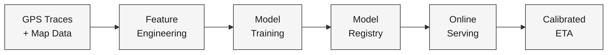
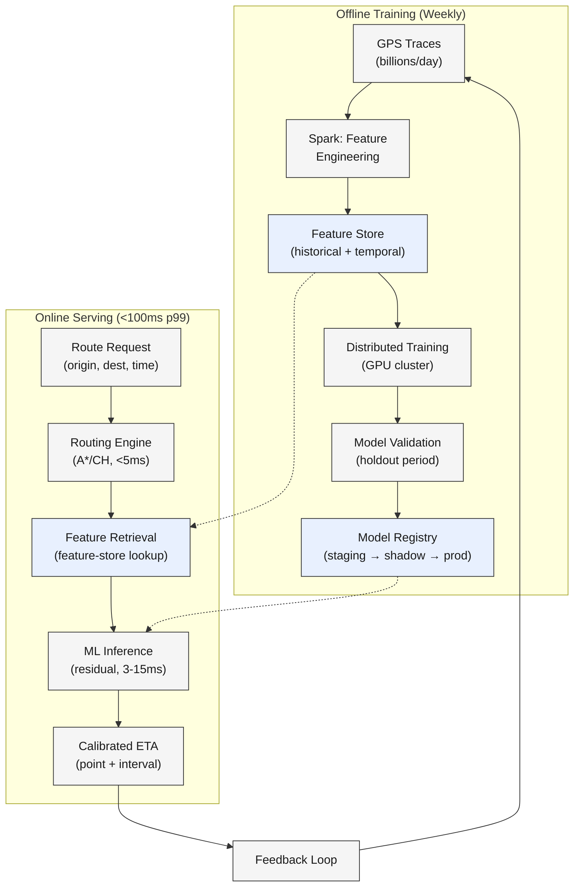

A rider opens the app and enters a destination.

<!--more-->

## 1. Problem & ML framing

A rider opens the app and enters a destination. Before they request, while they wait, and while they ride, one question dominates: *when?* Inaccurate ETAs are the fastest way to burn trust — the user cancels when the prediction feels too long, or worse, waits past the predicted arrival and never comes back. At Uber's scale, a single-digit percentage ETA improvement unlocks tens of millions of dollars annually through retained rides and efficient dispatching. The same dynamics hold for food delivery, logistics, and turn-by-turn navigation.

The ML task is **regression over multi-modal inputs**: predict a continuous positive number (travel time in seconds) given a route between an origin and destination. The input is a feature vector capturing route geometry, road-network attributes, real-time traffic conditions, historical travel patterns, and temporal context (hour, day, weather). The output is a point estimate `ETA ∈ ℝ⁺` plus, at staff level, a **prediction interval** ("8–12 minutes") so the user calibrates their expectation.

**Business objective**: maximize user trust and ride completion rate through reliable, calibrated ETAs. **ML objective**: minimize mean absolute error (MAE) between the predicted and actual arrival time, with asymmetric cost — underpredicting by 5 minutes ("I'm 3 minutes away" → actually 8) damages trust far more than overpredicting.



## 2. Requirements

**Functional**

- FR1: Predict travel time in seconds for any origin–destination pair in served regions.
- FR2: Return a confidence interval alongside the point estimate.
- FR3: Adapt predictions to real-time traffic conditions within one minute of change.
- FR4: Fuse route-geometry, map attributes, live traffic, and temporal context into one prediction.
- FR5: Support multi-stop routes without compounding error across legs.
- FR6: Serve predictions at <100ms p99 for interactive user sessions.

**Non-functional**

- NFR1: Throughput: 100M+ predictions/day globally, millions per minute at peak.
- NFR2: Inference latency: p99 < 100ms end-to-end; ML step alone < 15ms.
- NFR3: Freshness: traffic data stale by ≤1 minute; model retrained at least weekly.
- NFR4: Availability: 99.95% uptime; graceful degradation to routing-engine-only ETA on ML failure.

*Out of scope: turn-by-turn rerouting during a trip; multi-modal transit (walking + bus + train); in-ride dynamic surging logic; accident/construction detection from raw camera feeds.*

## 3. Metrics

**Offline (model quality on held-out data)**

- **MAE (primary):** interpretable in minutes/seconds, maps directly to user-perceived error. The industry standard across Uber, Lyft, and Google Maps.
- **p50 / p95 absolute error:** captures tail degradation — the worst 5% of predictions are what users remember.
- **MAPE:** normalizes error by trip duration, enabling comparison across short and long trips. Becomes unstable for trips under ~2 minutes; used as a secondary metric.
- **Asymmetric Huber loss (training):** parameterized by δ (robustness to outliers) and ω (under/over-prediction asymmetry). For ride-hailing, ω > 1 penalizes underpredictions — telling a user "3 minutes" when the actual wait is 15 hurts more than saying "12 minutes" for an 8-minute ride.
- **Pinball loss (quantile):** evaluates P10/P50/P90 calibration for the confidence-interval output.

**Online (real-world impact)**

- **Pickup ETA accuracy:** MAE between predicted and actual pickup time — the metric that drives rider satisfaction most directly.
- **Negative ETA outcome rate:** percentage of trips where the error exceeds a business-defined threshold (e.g., >3 minutes late for a 15-minute trip). Google Maps tracks this; a 40% reduction drove their GNN deployment.
- **Ride completion rate:** percentage of requested rides that complete without cancellation. ETA accuracy directly shapes the decision to wait or cancel.
- **User retention (28-day):** repeat usage. Guardrail: an ETA model that overpredicts to be "safe" might depress new-request conversion.

Every offline metric maps to a business outcome: MAE → pickup accuracy → ride completion; p95 → worst-case user experience → retention; asymmetric loss → trust calibration.

## 4. Data

- **GPS trace history:** tens of billions of pings/day from driver and rider devices, sampled every ~4 seconds during active trips. Each completed trip yields a ground-truth travel time label — the actual time from pickup to dropoff (or origin to destination for navigation).
- **Map data (OSM / proprietary road graph):** ~100M road segments globally, each with attributes: length, speed limit, road class (highway/arterial/local), turn restrictions, traffic-light positions.
- **Real-time traffic feeds:** segment-level current speeds from probe data (devices on the road), aggregated into 2-minute rolling windows. Coverage varies by region density.
- **Historical travel times:** per-segment median travel time sliced by hour-of-day and day-of-week, aggregated over the trailing 17 weeks (Google Maps approach) with exponential decay to deprioritize stale patterns.
- **Labeling:** ground-truth arrival times come from completed-trip GPS — the timestamp when the driver's device reached the dropoff coordinates. No human annotation needed; this is a naturally supervised problem at scale.
- **Train/val/test split:** strictly time-based — train on all data before date *T*, validate on the two weeks after *T*, test on the two weeks after validation. Random splitting would leak future traffic patterns into training and inflate metrics.
- **Data scale:** billions of completed trips for training; millions of road segments with active real-time probes; 100K+ feature rows/second ingested for real-time traffic features.

## 5. Features

All features fall into five groups, unified through a **feature store** that computes each feature identically offline (for training) and online (for serving):

**Route features** (computed by the routing engine at request time)

- Route distance, segment count, number of turns, traffic-light count
- Road-class composition (percentage of highway vs. arterial vs. local)
- Routing engine's own baseline ETA (the "physics" estimate used as input, not as final output)

**Temporal features** (precomputed, keyed by timestamp)

- Hour of day, day of week, holiday flag, season
- Minute-of-day bucketed into 15-min quantile bins → embedded

**Real-time traffic features** (fetched from feature store at serve time, stale tolerance ≤60s)

- Current segment speed for each segment on the route, averaged over 2-min windows
- Incident flags (accidents, road closures) within 500m of the route
- Weather: precipitation intensity, visibility (from external API, cached per city)

**Historical features** (precomputed offline, refreshed weekly)

- Per-segment median travel time by hour-of-week, aggregated over 17 weeks
- Per-segment 15th/85th percentile speed spread (as a congestion-volatility proxy)
- Origin/destination geohash embeddings at 4 spatial resolutions (H3 levels 6–9), trained jointly with the model
- Multi-resolution feature hashing: each lat/lon maps to multiple hash bins using independent hash functions, increasing collision robustness without blowing up vocabulary size

**Trip-context features** (known at request time)

- Trip type (ride vs. delivery vs. freight), pickup vs. dropoff leg
- Driver historical speed profile (optional, only for registered drivers with ≥50 completed trips — falls back to regional average)

**Feature store + online/offline parity:** The feature store is the arbiter. Offline, a Spark pipeline precomputes historical and temporal features and writes them to the store. Online, a low-latency key-value lookup (Redis or equivalent) serves the same features. Traffic features update continuously via a Flink streaming pipeline. The model registry pins a feature-config version alongside each model version, so a serving container always fetches the features the model was trained on.

## 6. Model

### Baseline: XGBoost on engineered features

A gradient-boosted tree ensemble trained on the ~40 tabular features from §5, with max_depth=15, 250 trees, and L2 regularization. Uber ran this in production for years — one ensemble per mega-region. It handles tabular data well, requires no GPU for serving, and produces interpretable feature-importance scores.

The limit: XGBoost cannot easily scale to billions of training examples, does not inherently capture sequential structure (the route as a sequence of segments), and maxes out on feature interactions that a transformer can learn from raw embeddings.

### Advanced: deep residual network with linear transformer

The canonical production architecture follows a **physics-first hybrid pattern**: the routing engine produces a base ETA using graph algorithms and real-time segment speeds; the ML model predicts the *residual* — the systematic deviation between the routing engine's estimate and the ground truth. The final output is `ETA = RE_ETA + residual`. This respects the routing engine's hard-won knowledge of road-network physics (speed limits, turn costs, road hierarchy) and lets the model focus on patterns the engine misses: driver route choices, pickup/dropoff slowdowns, future traffic evolution.

**Encoder:** Every continuous feature is discretized into quantile bins (e.g., speed → 256 bins) and mapped to learned embeddings (dim=8). Categorical features (trip type, region) get direct embeddings. Spatial features (origin/destination lat/lon) are quantized into multi-resolution geohash grids (H3 levels 6–9), with multiple feature hashing to reduce collision artifacts. This produces ~40 embedding vectors → concatenated into the model input.

**Interaction layer:** A linear transformer applies self-attention using the kernel trick `φ(x) = elu(x) + 1`, reducing complexity from O(K²d) to O(Kd²). For K=40 features × d=8 embedding dims, this is ~5× faster than standard self-attention — critical when the inference budget is 3–15ms. Only 2 transformer layers are used; nearly all model parameters live in the embedding lookup tables, and only ~0.25% are touched per prediction.

**Decoder:** A shallow fully-connected network with a segment bias-adjustment layer — learned per-segment offsets for different trip types (ride vs. delivery), trip lengths (short vs. long), and mega-regions. ReLU on the output clamps the residual to be non-negative (the routing engine already gives a positive ETA).

**Loss function — asymmetric Huber:**

```javascript
L(y, ŷ) = ω·h(y−ŷ)  if y−ŷ > 0   (underprediction)
          (2−ω)·h(y−ŷ) otherwise (overprediction)
where h(r) = 0.5·r²      for |r| ≤ δ   (quadratic region, small errors)
           = δ·(|r|−δ/2)  for |r| > δ   (linear region, large errors)
```

With δ = 1.0 and ω = 1.2, the model is robust to outliers (linear tail for large residuals) and penalizes underpredictions 20% more heavily than overpredictions. For use cases that need a median ETA (delivery dispatch), ω = 1.0; for rider-facing pickup ETA, ω > 1.0.

**Quantile estimation:** The same architecture is trained with pinball loss to produce P10, P50, and P90 estimates. At serving, these three quantiles are fetched in parallel and packaged as "arrives in 8–12 minutes" (P10–P90) with a central point estimate (P50).

**Training:** Distributed training on GPU clusters, one model per mega-region (North America, EMEA, APAC, LATAM) with shared embedding tables pre-trained globally. Weekly auto-retraining pipeline validates on the most recent two weeks of data and promotes through staging → shadow → A/B → full traffic.

**Multi-stage funnel:**

```javascript
Route Request → Routing Engine (RE-ETA) → Feature Retrieval → ML Residual → Calibrated ETA
```

The routing engine runs first — A* or contraction hierarchies over the road graph, consuming precomputed edge weights from the traffic forecasting layer. It produces the route polyline, per-segment estimates, and a summed RE-ETA in single-digit milliseconds. The ML step then corrects the residual in 3–15ms. If the ML service times out or errors, the system falls back to the raw routing-engine ETA — the physics-first design makes graceful degradation trivial.

## 7. Architecture



### Offline training pipeline

**Components:** Spark cluster for batch feature engineering, a feature store (Redis/Valkey for online, Parquet/S3 for offline), GPU training cluster, model registry, and an orchestration layer (Airflow or equivalent).

**Flow:**

1. Raw GPS pings (tens of billions/day) land in a data lake. Map-matching HMM snaps each ping to a road segment.
1. A weekly Spark job computes per-segment historical travel times, aggregates temporal profiles (hour-of-week medians, 17-week windows), and materializes geohash embeddings into the feature store.
1. Training examples are constructed from completed trips: for each trip, join the routing-engine ETA at request time with the actual arrival time at completion. The label is `actual − RE_ETA` (the residual).
1. Distributed training runs on GPU clusters — one model per mega-region, with shared embedding tables. Training uses the asymmetric Huber loss and takes ~6–12 hours on 8× A100 GPUs.
1. Validation evaluates MAE, p50, and p95 on a held-out two-week period. If the candidate model beats the production model on all metrics and shows no regressions on any mega-region, it passes.

**Design consideration:** The validation set must be temporally *after* the training set — random splitting leaks future traffic patterns. A rolling-window evaluation (train on weeks 1–4, validate on week 5, test on week 6, retrain on weeks 2–5) provides a more honest estimate of how the model will perform after deployment.

### Online serving pipeline

**Components:** Load balancer, routing-engine service (A*/CH, sub-5ms), feature-store client (Redis/Valkey, sub-2ms), ML inference container (Triton or TorchServe, 3–15ms), and a post-processing layer for interval formatting.

**Flow:**

1. A route request arrives with `(origin_lat, origin_lon, dest_lat, dest_lon, timestamp, trip_type)`.
1. The routing engine computes the optimal path and a base RE-ETA. Edge weights come from the real-time traffic-forecasting layer, which ingests 160K+ feature rows/second via Flink and updates segment speeds every 2 minutes.
1. The feature-retrieval layer fetches temporal, historical, geospatial, and traffic features from the feature store in a single batched call.
1. The ML inference container runs the linear transformer in 3–15ms (p50: ~3.25ms, p95: ~4ms). Quantile models (P10, P50, P90) run in parallel.
1. Post-processing combines `RE_ETA + residual`, clamps to positive values, formats the interval, and returns `{"eta_seconds": 540, "interval": [480, 660], "confidence": 0.8}`.

**Design consideration:** The routing engine is the fallback. If the ML container times out (budget: 15ms), the feature store is unreachable, or any downstream service fails, the system returns the raw RE-ETA — still a reasonable estimate because the engine already incorporates real-time segment speeds. This is the core advantage of the physics-first hybrid architecture.

### Serving scale

- **Throughput:** 100M+ predictions/day. At peak, millions of predictions/minute — ETA is called for every fare estimate, every driver-rider matching decision, and every in-ride ETA update.
- **Latency budget:** p99 < 100ms end-to-end. Budget split: routing engine < 5ms, feature retrieval < 2ms, ML inference < 15ms, network + serialization < 20ms. The remaining ~60ms is headroom for retries and traffic spikes.
- **Infrastructure:** The ML step runs on CPU-only containers (4 cores per host) with sparse embedding tables — only ~0.25% of parameters are touched per prediction. No GPU needed at serving; the linear transformer's O(Kd²) complexity fits comfortably on CPU.

### Retraining feedback loop

Completed trips feed back into the data lake: the actual arrival time is joined with the prediction that was served. A monitoring dashboard tracks MAE drift by region, hour, and trip type. When drift exceeds a threshold (or weekly, whichever comes first), the training pipeline fires. The new model enters the registry as `staging` → deployed to 1% of traffic (`shadow` — predictions logged but not served) → A/B test at 5% → gradual ramp to 100%. This automated loop keeps the model calibrated against evolving traffic patterns, new road construction, and seasonal shifts.

## 8. Deep dives

### DD1: Real-time traffic incorporation

**Problem.** Traffic conditions change minute-to-minute: an accident blocks a lane, rain slows everyone down, a sports game ends and floods the streets. A route that takes 20 minutes at 2:00 PM might take 45 at 5:15 PM. The model must distinguish between *current* conditions (what the first few segments look like now) and *future* conditions (what the later segments will look like when the driver reaches them in 25 minutes). Using only current traffic for the whole route systematically underestimates travel time during the onset of rush hour; using only historical averages misses the accident that just happened.

**Approach 1: Streaming features only.** Send live segment speeds for every segment on the route. The model learns to project these forward. Weakness: probe data is sparse — many segments have zero active probes at any moment. The model receives a noisy, incomplete snapshot.

**Approach 2: Periodic full retraining only.** Retrain the model frequently (daily or weekly) on the latest data. The model captures systematic shifts (a new highway opened, a neighborhood densified) but cannot react to a weather event or accident that happened 10 minutes ago.

**Approach 3: Multi-horizon prediction (Google Maps approach).** Train separate models for each time horizon into the future (0s, 600s, 1200s, 1800s, 3600s). At serving time, query each segment-use successive horizons: the first segment uses the 0s model (current traffic dominates), the fifth segment — which the driver reaches ~8 minutes in — uses the 600s model, and so on. This explicitly models *when* each segment will be traversed. The temporal gap between models' predictions provides a natural uncertainty signal.

**Decision:** Blended approach — multi-horizon for the ML residual model, fed by a streaming traffic-forecasting layer (Uber's DeepETT pattern) that continuously ingests probe data and outputs calibrated per-segment speeds. The forecasting layer itself runs as a separate model (graph-aware transformer) with a Flink-based real-time calibration pipeline that detects drift and corrects systematic bias within minutes.

**Rationale:** Multi-horizon models explicitly solve the "future traffic on later segments" problem, which is the core difficulty. The traffic forecasting layer decouples raw probe ingestion from the ETA model — the ETA model receives clean, calibrated segment speeds rather than raw noisy pings. This separation also makes each component independently improvable.

> [!TIP]
> The real-time calibration pipeline is the unsung hero. Uber's DeepETT team found that segment-level resolution improvements (explaining more variance) could *worsen* trip-level accuracy if calibration drifted — small per-segment biases compound into large trip-level errors. A Flink pipeline that buckets predictions by city and time-of-day, joins with observed travel times, and applies a continuous correction factor drives this error to near zero — even during extreme events like New Year's Eve in Manhattan.

**Edge cases:** When probe data is entirely absent for a segment (rural area, 3 AM), fall back to the historical median for that hour-of-week. When a sudden event (accident) changes a segment's speed by >50% within 2 minutes, the calibration layer flags the segment as anomalous and the ETA model receives a special "disruption" feature flag.

### DD2: Uncertainty estimation

**Problem.** A point estimate ("arrives in 12 minutes") is a lie the model tells with confidence. Users calibrate their expectations around a range. A rider told "12 minutes" who waits 18 feels much worse than one told "10–18 minutes" who waits 14. The business needs calibrated uncertainty to set user expectations, to decide dispatch (a driver 8–12 minutes away might be preferred over one 6–14 minutes away — same mean, very different worst case), and to detect when the model itself is uncertain (triggering a fallback to a safer estimate).

**Approach 1: Quantile regression.** Train three separate output heads on the same encoder — one each for P10, P50, and P90 — using pinball loss. At serving, run all three and return the interval. The pinball loss for quantile τ is `L(y, ŷ) = max(τ·(y−ŷ), (τ−1)·(y−ŷ))`. Simple, interpretable, production-proven at Uber (asymmetric Huber approximates arbitrary quantiles via varying ω). Limitation: the intervals are pointwise — they don't capture correlation between segments (if one segment is congested, adjacent ones likely are too).

**Approach 2: Monte Carlo dropout.** Apply dropout at inference time (not just training), run the forward pass B=100 times with different dropout masks, and compute the empirical mean and variance of the predictions. Decomposes uncertainty into **model uncertainty** (the model is unsure because this input pattern is rare — high dropout variance) and **inherent noise** (the label is noisy even with a perfect model — the residual variance across passes). Uber's time-series team achieved ~95% empirical coverage with B=100 passes and p=0.05 dropout. Overhead: <10ms per forward pass × 100 passes is too slow for the 3–15ms ETA budget; used for offline analysis and training-time diagnostics only.

**Approach 3: Conformal prediction.** A distribution-free post-hoc method: hold out a calibration set, compute the empirical distribution of residuals, and at serving time return an interval that covers the true value with probability ≥ 1−α. No model changes needed — it wraps any point predictor. The interval width adapts to model confidence: regions with sparse data get wider intervals.

**Decision:** Quantile regression (P10/P50/P90) as the online serving approach. Conformal prediction as an offline validation guardrail — it provides coverage guarantees the quantile model might violate after distribution shift.

**Rationale:** Quantile regression adds negligible serving overhead (3 parallel forward passes through the same encoder, no MC sampling) and maps cleanly to the user-facing UX ("8–12 minutes"). The asymmetric Huber loss already used for the point estimate is a natural quantile approximator — the same architecture serves both. Conformal prediction runs offline on the validation set each training cycle; if the quantile model's empirical coverage falls below 80%, the training pipeline is blocked from promoting.

> [!NOTE]
> Quantile-crossing — the model might predict P10 > P50 for some inputs, producing a nonsensical interval. Fix with a monotonicity penalty in the loss or a post-hoc sort of the three quantile outputs. In practice, training on the same encoder with shared representations makes crossing rare.

### DD3: Training-serving skew & calibration drift

**Problem.** The model trained on last month's data serves predictions on today's traffic patterns, which changed last week when a bridge closed for construction. This is the core ML rot problem for any temporal prediction system, and ETA systems have several distinct skew sources:

1. **Feature-distribution skew:** The distribution of segment speeds shifts — a highway that averaged 55 mph at 8 AM in training data now averages 25 mph due to ongoing construction.
1. **Calibration drift:** The model's residuals develop systematic bias — it consistently underpredicts trips in a specific neighborhood because a new traffic light was installed. Small per-segment biases compound across a 30-segment route into large trip-level errors.
1. **Feedback-loop skew:** The model's own predictions influence dispatch — which driver is assigned to which rider — which changes actual traffic patterns, which changes the true distribution the next model will be trained on. Naive retraining on logged data causes the model to learn its own distortions.
1. **Temporal leakage:** Using features computed at *trip completion time* during training that are unavailable at *request time* during serving. Example: if the model receives the actual average speed along the route during training (computed after the trip ended), it cannot access that feature at serving time.

**Approach 1: Weekly retraining with shadow deployment.** Retrain the full model weekly on the most recent data. Deploy to shadow (1% traffic, logging only), compare against production, and promote if all metrics improve. Weakness: cannot react to events faster than the retraining cadence.

**Approach 2: Continuous real-time calibration (Uber DeepETT).** Separate the problem into **resolution** (how much variance the model explains — the model's capacity) and **calibration** (how much systematic bias remains). A Flink streaming pipeline independently corrects calibration drift: it buckets predictions by city and 10-min travel-time bins, joins with recently observed traversal times, and applies a continuous multiplicative correction factor. The model itself does not retrain mid-flight — only the calibration layer updates. This drove calibration error to near zero even during extreme events (NYE in NYC) while preserving the model's resolution gains.

**Approach 3: Online learning.** Update model weights continuously from the stream of completed trips. Weakness: feedback-loop risk is acute — the model rapidly learns its own dispatch distortions. Requires careful counterfactual logging or inverse-propensity weighting to debias. Also operationally complex — a bad update poisons all future predictions with no rollback.

**Decision:** Weekly model retraining (Approach 1) with a real-time calibration layer (Approach 2). Online learning is deferred — the operational risk and feedback-loop hazard outweigh the freshness benefit at current scale.

**Rationale:** The calibration layer handles fast-changing patterns (accidents, construction) within minutes without touching the model weights. The weekly retraining handles slow-changing patterns (seasonal shifts, new road topology, changes in driver behavior). This decoupling is the pattern that earned Uber $100M in annualized revenue impact — resolution gains from the model compound over time, while calibration corrections keep the predictions honest in the moment.

> [!TIP]
> The counterintuitive finding from Uber DeepETT: improving segment-level MSE (better resolution — explaining more variance in per-segment travel times) can *increase* trip-level MAE if calibration drifts. A segment-level resolution improvement of 30% compounds to ~85% at the trip level — but a 2% calibration error per segment compounds to a 45% error over 30 segments. The real-time calibration layer prevents the compounding by driving per-segment bias to zero independently.

**Edge cases — data leakage:** The train/val/test split must be strictly time-based with a gap between train and val periods. Features must be computed using only information available *at or before* the time the prediction would have been made. The feature store enforces this by versioning feature definitions alongside model versions — a serving container fetches features computed exactly as they were during training.

### DD4: Cold start for new routes, regions, and trip types

**Problem.** A new city launches. The historical-feature tables are empty — no per-segment median travel times, no geohash embeddings trained on local data, no trip-completion labels for the new driver fleet. The model must produce reasonable ETAs from day one, and improve rapidly as data accumulates. Similarly, a new trip type (e.g., motorcycle delivery) or a new route through a recently opened highway faces the same sparse-data problem.

**Approach 1: Routing-engine-only fallback.** Without ML correction, the raw routing-engine ETA is still reasonable — the engine uses map attributes (speed limits, road class) and real-time traffic feeds that are available from probe data regardless of historical depth. The physics-first architecture makes cold start survivable: the ML residual model adds zero correction until it has enough data, and the baseline RE-ETA is the initial estimate.

**Approach 2: Geographic embedding regularization.** Use H3 hexagonal binning at resolutions 6–9 as embedding IDs. A new region's embeddings are initialized as the weighted average of adjacent known regions' embeddings. As trips accumulate, the embedding adapts. This shares statistical strength across nearby areas — a suburb of an established city gets a reasonable starting point from the city center's embeddings.

**Approach 3: Transfer learning from source cities.** Pre-train the model on a large established city (e.g., São Paulo for a new Brazilian city) with similar road topology. Freeze the encoder layers and fine-tune only the decoder and bias-adjustment layers on the new city's limited data. This transfers road-network reasoning and temporal patterns while allowing city-specific calibration.

**Approach 4: Segment-level similarity.** For new road segments (new highway), identify the 5 most similar existing segments by road class, lane count, speed limit, and surrounding density. Use the average of their historical travel-time profiles as the initial estimate, with a wide uncertainty interval that narrows as data accumulates.

**Decision:** Routing-engine fallback (Approach 1) as the zero-data floor, geographic embedding regularization (Approach 2) as the 1–100 trip bootstrap, and transfer learning (Approach 3) for major new-city launches. Segment similarity (Approach 4) for individual new roads.

**Rationale:** The routing-engine fallback means cold start is never catastrophic — the user still gets a reasonable ETA. Embedding regularization works automatically as part of the normal training process; no special cold-start pipeline is needed. Transfer learning is reserved for launches where the business needs high accuracy from day one (a competitive new market) and engineering effort is justified.

> [!TIP]
> The single most important cold-start defense is the physics-first design itself. A pure-ML model (no routing engine) with zero training data for a new city outputs random noise. The hybrid architecture outputs the routing engine's best estimate — which already accounts for speed limits, road hierarchy, and current traffic — and the ML correction gracefully ramps from zero to its full contribution over ~2 weeks of accumulating trips.

**Monitoring:** For any new region, track the ratio of ML-residual to RE-ETA over time. In an established region, the residual is 10–30% of the total ETA. In a brand-new region, it starts near 0% and should converge within ~10K completed trips. If it never converges (residual stays near 0 or oscillates), the embeddings may have collapsed — the region is too different from any trained area. Trigger manual review.

## 9. References

1. [DeepETA: How Uber Predicts Arrival Times Using Deep Learning](https://www.uber.com/us/en/blog/deepeta-how-uber-predicts-arrival-times/)
1. [DeeprETA: An ETA Post-processing System at Scale](https://arxiv.org/pdf/2206.02127)
1. [Scaling Real-Time Traffic Forecasting with a Graph-Aware Transformer (DeepETT)](https://www.uber.com/us/en/blog/scaling-real-time-traffic/)
1. [Scaling ML at Uber with Michelangelo](https://www.uber.com/us/en/blog/scaling-michelangelo/)
1. [Traffic Prediction with Advanced Graph Neural Networks](https://deepmind.google/blog/traffic-prediction-with-advanced-graph-neural-networks/)
1. [ETA Prediction with Graph Neural Networks in Google Maps](https://kandluis.github.io/files/eta-prediction.pdf)
1. [Engineering Uncertainty Estimation in Neural Networks for Time Series](https://www.uber.com/us/en/blog/neural-networks-uncertainty-estimation/)
1. [ETA Reliability at Lyft](https://eng.lyft.com/eta-estimated-time-of-arrival-reliability-at-lyft-d4ca2720bda8)
1. [How Science Inspires Our ETA Models](https://eng.lyft.com/how-science-inspires-our-eta-models-bf229e3148e8)
1. [Real-Time Spatial Temporal Forecasting @ Lyft](https://eng.lyft.com/real-time-spatial-temporal-forecasting-lyft-fa90b3f3ec24)
1. [Lyft's Feature Store: Architecture, Optimization, and Evolution](https://eng.lyft.com/lyfts-feature-store-architecture-optimization-and-evolution-7835f8962b99)
1. [DuETA: Congestion Propagation Pattern Modeling via Efficient Graph Learning](https://export.arxiv.org/pdf/2208.06979v1.pdf)
1. [How Waze Uses TFX to Scale Production-Ready ML](https://blog.tensorflow.org/2021/09/how-waze-uses-tfx-to-scale-production-ready-ml.html)
