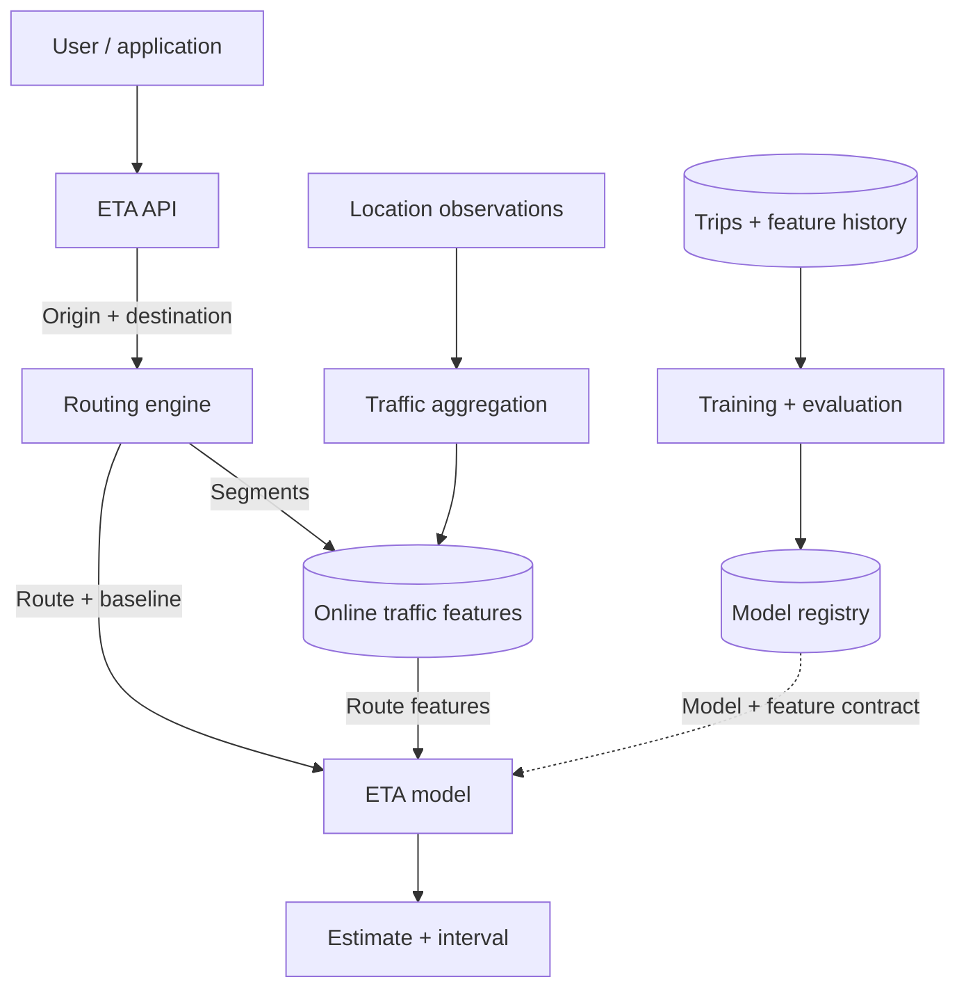
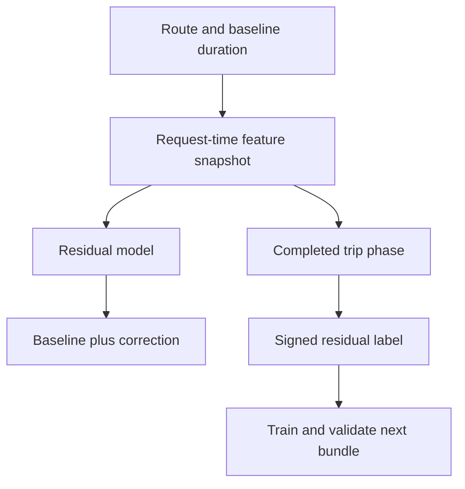
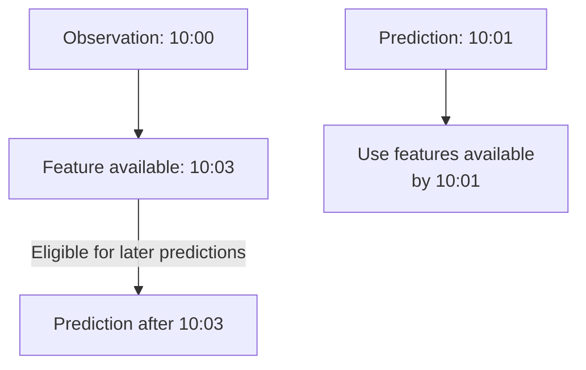

An arrival-time prediction service that combines a routing estimate with a learned correction for traffic, location and trip context.

<!--more-->

## Problem

Users rely on an arrival estimate to decide when to leave, whether to request a ride and how long they will wait. The same route can take different amounts of time as traffic, weather and pickup conditions change.

We start with the duration calculated by a routing engine, then predict a correction from recent conditions and historical trips. The response includes a central estimate and a time range so the application can communicate uncertainty.

## Requirements

### Functional requirements

- **Predict an arrival time.** Accept an origin, destination and departure time.
- **Update an active trip.** Refresh the estimate as the vehicle moves and new traffic observations arrive.
- **Handle different trip types.** Support pickup, driving and multi-stop routes, including expected stop duration.
- **Return an interval.** Provide P10, P50 and P90 travel-time estimates.
- **Use recent conditions.** Include traffic updates within one minute of publication.
- **Support new regions.** Return a routing-based estimate while regional training data is collected.

### Non-functional requirements

- **Scale:** support 100M predictions/day; size the peak from the regional traffic distribution.
- **Latency:** target p99 below 100ms for the prediction API and below 15ms for model inference.
- **Availability:** target 99.95%, with a routing-based fallback when ML serving is unavailable.
- **Freshness:** keep online traffic features within 60 seconds of their publication deadline.
- **Quality:** measure absolute error, signed bias and interval coverage by region, trip type and duration.
- **Privacy:** restrict access to precise location data and apply explicit retention limits.

## Back-of-the-envelope calculations

- 100M predictions/day is about **1,160 requests/s on average**. An assumed 10× peak gives roughly **12K requests/s** before regional skew and failure headroom.
- A planning budget of 20ms for transport, 5ms for routing, 2ms for feature retrieval and 15ms for inference totals 42ms. End-to-end load tests establish the p99 target; individual stage estimates are inputs to that test.
- A feature pipeline handling 160K location updates/s must aggregate updates before serving. Online requests fetch one compact route-feature vector rather than querying raw GPS observations.
- Versioned road graphs and model artifacts are loaded into memory. Their replication and update cost is sized separately from request metadata and historical trip storage.

## Core entities

- **Route** contains the ordered road segments and the routing engine's baseline duration.
- **TrafficFeature** records both observation time and availability time.
- **ETAPrediction** identifies the estimate, uncertainty and serving versions.
- **CompletedTrip** supplies the actual duration used as a training label.
- **ETABundle** keeps the model compatible with its feature definitions and routing inputs.

```protobuf
message Route {
  string route_id;
  repeated string segment_ids;
  double baseline_seconds;
  string map_version;
}

message TrafficFeature {
  string segment_id;
  double speed_mps;
  double congestion;
  google.protobuf.Timestamp observed_at;
  google.protobuf.Timestamp available_at; // When serving could first read it
}

message ETAPrediction {
  string prediction_id;
  optional double p10_seconds; // Included when the interval is calibrated
  double p50_seconds;
  optional double p90_seconds;
  string serving_mode;       // Learned correction or routing fallback
  string model_bundle;
  string route_id;
}

message CompletedTrip {
  string trip_id;
  string prediction_id;
  double actual_seconds;     // Measured for the same trip phase
  string region;
  string trip_type;
}

message ETABundle {
  string bundle_id;
  string model_uri;
  string feature_schema;
  string training_snapshot;
  string evaluation_report_uri;
}
```

## API

```yaml
predict_eta:
  method: POST
  path: /v1/eta
  body:
    origin: {latitude: 37.78, longitude: -122.42}
    destination: {latitude: 37.79, longitude: -122.39}
    departure_time: "2026-10-05T17:00:00Z"
    trip_type: driving
    stops: []
  response:
    prediction_id: eta_123
    route_id: route_456
    p10_seconds: 480
    p50_seconds: 600
    p90_seconds: 780
    serving_mode: learned_correction
    model_bundle: eta_v12
  errors:
    400: invalid coordinates or unsupported departure horizon
    404: no route available
    503: routing and prediction are unavailable
```

## High-level design

The routing engine chooses the route and calculates a baseline duration. The feature service adds recent traffic and trip context, and the ETA model predicts a correction and travel-time quantiles.

Completed trips and the features recorded at prediction time feed the training pipeline. A passing model bundle is loaded before new requests are routed to it.


```mermaid
flowchart TB
  U["User / application"] --> API["ETA API"]
  API -->|"Origin + destination"| ROUTE["Routing engine"]
  ROUTE -->|"Route + baseline"| MODEL["ETA model"]
  ROUTE -->|"Segments"| FEATURES[("Online traffic features")]
  FEATURES -->|"Route features"| MODEL
  MODEL --> RESULT["Estimate + interval"]
  GPS["Location observations"] --> AGG["Traffic aggregation"]
  AGG --> FEATURES
  TRIPS[("Trips + feature history")] --> TRAIN["Training + evaluation"]
  TRAIN --> REG[("Model registry")]
  REG -.->|"Model + feature contract"| MODEL
```

## Storage

- **Road graph:** use a versioned routing artifact in object storage, loaded by routing workers. The route response includes its map version.
- **Redis:** serve compact current traffic features with timestamps and freshness limits. Publish each feature vector atomically so a request reads a consistent version of that vector.
- **Kafka and stream processing:** ingest location observations and compute rolling traffic statistics. Start with two-minute windows published every 15 seconds; retain event IDs and late-arrival handling.
- **Object storage / Parquet:** store trip labels, served prediction snapshots and historical features for reproducible training.
- **PostgreSQL:** store prediction references, trip completion records and model-release metadata. A unique trip-phase key prevents a retried completion event from creating another label.

Offline training needs the feature values that were available when the estimate was requested. Retaining only the latest Redis value would lose that history.

## From request to response

### Predicting a trip

- **Calculate the route.** Validate the requested departure horizon, choose a route and obtain its baseline duration.
- **Fetch features in a batch.** Read traffic summaries for the route, time of day, region and trip type. Include feature age and missing-data indicators.
- **Predict a correction.** Apply the active residual model to the baseline. A signed correction can increase or decrease the duration.
- **Return the estimate.** Produce positive, ordered P10, P50 and P90 values, with the bundle ID and serving mode.
- **Record the prediction.** Log the route, feature versions and request time for later comparison with the completed trip.

A route may contain many segments. Batched feature retrieval and route-level summaries keep storage round trips bounded; long-horizon trips need traffic forecasts rather than only current speeds.

### Updating an active trip

Calculate the remaining route from the latest accepted vehicle position. Keep location timestamps visible so a delayed GPS message cannot move the vehicle backward in the trip.

Use the expected arrival time at each route segment to select the appropriate traffic forecast. Refresh the estimate when movement or new conditions materially change the remaining duration.

For a multi-stop trip, include driving time and expected dwell time at each stop. Produce route-level uncertainty from examples of similar complete trips; correlations between congested segments make independently summed interval bounds unreliable.

### Learning from a completed trip

Match the actual start and arrival events to the same phase the prediction covered. Pickup waiting time and driving time are separate labels. Remove trips with broken GPS traces, incorrect timestamps or incomplete phase boundaries.

Join each label to the features available at its prediction time, then train the next candidate. Evaluate on later trips, including regional and trip-type slices.

### Falling back

If the learned model fails, return the routing estimate with `serving_mode: routing_fallback`. If live traffic is stale, use historical traffic for that route and time of day and mark the degraded feature state.

The application can still display an estimate, while monitoring records which path produced it. A fallback interval is returned only if it has a separately calibrated baseline model.

## Deep dives

### Should the model predict the entire duration or a correction?

A routing engine already accounts for road topology and route length. Training a model to relearn those relationships requires substantial data and makes new-region behavior harder to control.

| Approach | Strength | Trade-off |
| --- | --- | --- |
| Routing estimate only | Works with little trip history | Misses recurring local and trip-specific bias |
| Predict duration directly | Flexible learned representation | Greater dependence on coverage and route features |
| Routing plus learned residual | Uses the baseline and learns its errors | Requires compatible routing and model versions |

**Use a residual model.** Start with a gradient-boosted tree model over compact route and context features. Consider a neural model when embedding interactions and traffic volume justify its serving cost. [Uber's DeepETA](https://www.uber.com/us/en/blog/deepeta-how-uber-predicts-arrival-times/) describes this routing-plus-residual architecture.

```python
residual_target = actual_seconds - baseline_seconds
predicted_seconds = max(1.0, baseline_seconds + predicted_residual)
```

The residual stays signed. If a 600-second baseline is consistently 90 seconds too short, the corrected estimate is 690 seconds. If it is 30 seconds too long, the corrected estimate is 570 seconds.

Underestimation and overestimation can have different business costs. Tune an asymmetric loss using the relevant trip type; evaluate the resulting signed bias alongside absolute error. A lower average error is useful only when the application's wait-time and reliability requirements also improve.

**Build one residual training row**

At request time, record the selected route, its baseline duration, map version and every feature used by the scorer. After the trip phase ends, join its actual duration to that prediction. The model learns the baseline's signed error, not the total trip duration.

A 10-minute route that takes 12 minutes supplies a +120-second residual. Features might include road-class mix, remaining distance, departure-time bucket, current traffic age and trip phase. Keep waiting for pickup separate from in-vehicle travel unless the output explicitly represents both.


```mermaid
flowchart TB
    R["Route and baseline duration"] --> F["Request-time feature snapshot"]
    F --> M["Residual model"]
    M --> P["Baseline plus correction"]
    F --> T["Completed trip phase"]
    T --> L["Signed residual label"]
    L --> V["Train and validate next bundle"]
```

The serving bundle pins the routing-feature schema and permitted map versions. A feature-contract mismatch or stale traffic vector selects a validated routing-only fallback. Log the fallback mode so its errors can be evaluated separately. Compare absolute error and signed bias across short/long trips; an apparently good average can still systematically underestimate busy-region trips.

### How do we prevent future information from entering training?

A GPS observation may describe conditions at 10:00 but arrive at the feature pipeline at 10:03. A prediction made at 10:01 could not have used it, even though its observation timestamp is earlier.

- **Join by observation time** for temporal alignment, with a risk of including late-arriving information.
- **Use archived serving snapshots** to reproduce the exact values used online.
- **Use availability-aware historical joins** when rebuilding features from their full history.

**Log the served feature snapshot and use availability-aware joins for reconstruction.** An eligible historical feature satisfies both its event-time window and `available_at <= prediction_time`.


```mermaid
flowchart TB
  O["Observation: 10:00"] --> A["Feature available: 10:03"]
  P["Prediction: 10:01"] --> SNAP["Use features available<br/>by 10:01"]
  A -->|"Eligible for later predictions"| L["Prediction after 10:03"]
```

A feature store's [point-in-time joins](https://docs.feast.dev/getting-started/concepts/point-in-time-joins) help construct historical training rows. Configure arrival-time filtering explicitly where backfills or late data are possible.

Share feature calculations, normalization and missing-value definitions between training and serving. The bundle manifest pins those definitions; a feature-schema change is released with its corresponding model.

**An availability-aware join**

Store each historical feature with both observation time and the time it became queryable. For a 10:01 request, select only revisions published by 10:01, then apply that feature's event-window/expiry rule. A later backfill must not overwrite the archived view used for training that request.

```sql
-- Logical reconstruction; indexed by feature identity and availability time.
SELECT value, observed_at, available_at
FROM feature_history
WHERE feature_key = :key
  AND available_at <= :prediction_time
  AND observed_at >= :oldest_eligible_observation
ORDER BY available_at DESC
LIMIT 1;
```

The joined row also records feature age and missingness. Defaulting an unavailable traffic speed to zero would imply stopped traffic; use an explicit missing flag plus the approved baseline value.

Split examples chronologically and keep related predictions from the same trip together. Later updates from that trip provide labels only after they become available, never serving features for an earlier prediction. Test reconstruction by comparing historical joins against logged serving snapshots; discrepancies identify late-data or feature-version leakage.

### Which traffic estimate should a long route use?

Current traffic is relevant to the first road segment. A segment reached 30 minutes later needs a forecast for that time.

- **Current speeds everywhere** are simple, but can misrepresent conditions later in the route.
- **Historical time-of-day speeds** provide a useful baseline when live observations are sparse.
- **Horizon-specific forecasts** combine recent traffic with expected future conditions.

**Use current traffic for the near term and horizon-specific forecasts farther along the route.** Start with forecast buckets such as 0, 10, 20, 30 and 60 minutes, and select a bucket using the estimated time each segment will be reached.

Long routes may need another pass because revised segment times change later arrival horizons. Bound the number of passes and include that cost in the routing budget. Regions with limited observations fall back to historical speeds and wider, separately evaluated intervals.

A graph-based traffic model is a later alternative when congestion propagation matters. [Google Maps' traffic-prediction work](https://deepmind.google/blog/traffic-prediction-with-advanced-graph-neural-networks/) illustrates how neighboring road segments can contribute to such forecasts.

**Select traffic by the expected arrival horizon**

Walk the route from departure time. For each segment, use the elapsed predicted time to choose its forecast bucket, calculate that segment's duration, and advance the elapsed time. A segment 25 minutes into the journey needs the 20/30-minute forecast range rather than the speed observed at departure.

```python
elapsed = 0
for segment in route:
    horizon = elapsed
    speed = forecast_speed(segment, horizon, pinned_forecast_version)
    elapsed += segment.length / bounded_positive_speed(speed)
```

Interpolation must be defined for adjacent buckets; missing forecasts use historical road/time-of-day estimates. Keep one forecast snapshot for the pass so a mid-request update does not combine inconsistent values.

A revised residual or traffic pass may shift downstream horizons. Limit iterations and stop when the change is below a configured threshold, with a hard deadline fallback to the last valid estimate. Benchmark intersections, incidents and long routes separately. A spatial traffic model may improve propagation forecasts, but the request path still uses the same versioned horizon interface.

### How do we return an interval users can trust?

A point estimate hides how variable a trip can be. Repeated model sampling can estimate uncertainty, but adds serving work and may still need calibration.

- **Separate quantile predictions** directly estimate travel-time percentiles.
- **Model ensembles** provide multiple predictions, at higher inference cost.
- **Held-out calibration** adjusts an existing interval using recent prediction errors.

**Train P10, P50 and P90 quantile outputs, then calibrate them on held-out trips.** Quantile loss penalizes errors differently above and below the requested percentile.

```python
error = actual_seconds - predicted_quantile
loss = max(quantile * error, (quantile - 1.0) * error)
```

Constrain the outputs to remain ordered and positive. Measure how often actual trips fall inside the P10–P90 interval; the target is 80% coverage over comparable trips, rather than a guaranteed probability for a particular journey.

Check coverage and interval width by region, duration, weather and trip type. During unusual conditions, widen intervals only through a validated calibration rule and report stale or missing features.

**Calibration with an explicit example**

Suppose held-out trips fall inside the nominal P10–P90 interval only 65% of the time. The raw quantile heads are under-covering their evaluation population. Use a separate calibration set to estimate the extra width needed for the desired coverage, then evaluate that adjustment on an untouched later period.

Track interval width as well as coverage: widening every estimate dramatically could reach coverage while becoming unhelpful. Small region/weather slices may need pooled calibration with uncertainty rather than an unstable independently fitted correction.

```text
Actual trip duration:       760s
Predicted P10/P50/P90:       600 / 700 / 800s
Covered:                    yes
Signed median error:        +60s
Interval width:             200s
```

Constrain quantile order during training or apply a validated ordering step. Evaluate any clipping against very short trips and sparse-data regions. Log map/model/calibration versions with the output so a coverage regression can be traced to the actual serving combination.

### How do we adapt to new regions and changing conditions?

A new region has a road graph before it has enough completed trips to train a reliable local model. Traffic shifts also happen faster than a full training cycle.

- **Regional models** allow focused tuning but fragment data and serving capacity.
- **A shared model with region features** transfers learning, with the risk of region-specific bias.
- **Routing plus local calibration** provides a simple baseline while data accumulates.

**Use a shared residual model with an explicit routing fallback, then add regional calibration from measured errors.** Keep the initial correction small where coverage is weak. Evaluate new regions separately before enabling a larger learned correction.

Traffic features update continuously. Calibration refreshes use recent completed trips; full model candidates follow a slower release cycle. Keep recent trips out of training when they are used for release evaluation.

Shadow a candidate to inspect errors and latency, then run a controlled rollout to measure its effect on the application. Rollback restores the previous model and feature contract; live traffic ingestion continues independently.

**Adaptation operates at several time scales**

Current traffic changes through the stream pipeline; regional calibration changes after enough completed trips arrive; model weights change after training and validation. Keeping these clocks separate allows a traffic incident to affect serving immediately without retraining the model in response to every spike.

A new region initially uses routing with a small, validated correction. As reviewed trip coverage grows, compare local residual distributions with the shared model and enable a region-specific calibration only when enough evidence supports it.

Maintain cohorts for previously seen and genuinely new roads/trip patterns. Shadow candidates reproduce the exact request-time features and compare later mature trip outcomes. A canary measures serving errors and latency immediately, but quality conclusions wait for completed trips. Rollback pins the prior bundle while allowing compatible live traffic features to continue; incompatible feature-schema updates require a coordinated pointer change.
