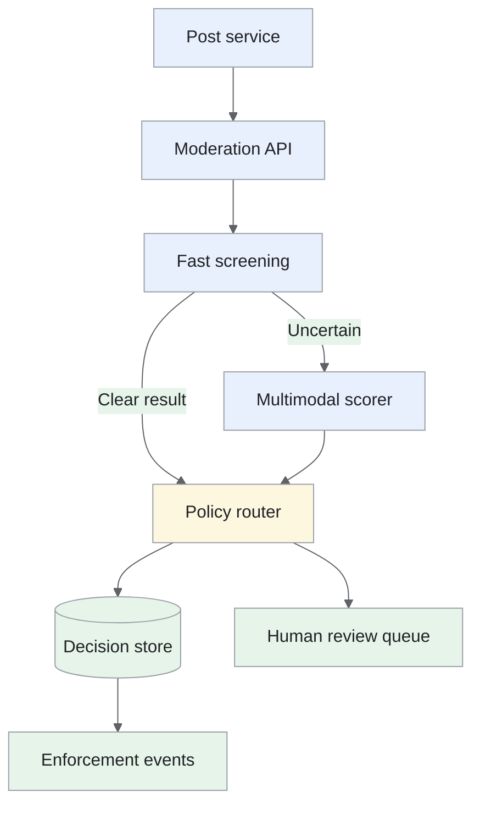
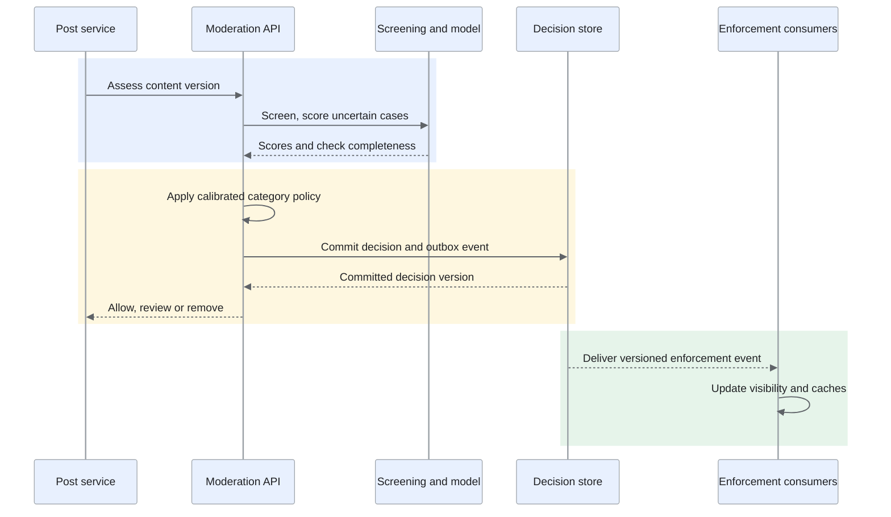
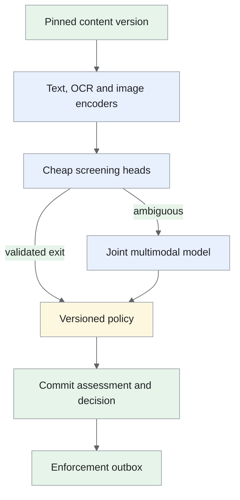

Design of a moderation service that identifies policy-violating posts and applies versioned enforcement decisions.

<!--more-->

## Problem

A social platform needs to reduce users' exposure to harmful content while preserving legitimate posts. A post may combine text and images, and its meaning can depend on how those parts relate.
The service evaluates new content, routes uncertain cases to reviewers and re-evaluates posts as reports or other evidence arrive. Model scores inform decisions; the policy service determines which action is permitted for each category.

## Requirements

### Functional requirements

- **Evaluate posts:** score supported text and image content against policy categories.

- **Apply enforcement:** allow, limit distribution, quarantine for review or remove a post according to policy.

- **Re-evaluate content:** incorporate new reports, behavioral evidence and revised policy.

- **Support review:** retain decision reasons, model/policy versions and reviewer corrections.

- **Measure impact:** track harmful-content exposure and mistaken enforcement by category and language.

Video and live-stream moderation, advertiser-specific policies and reviewer-interface design are separate systems.

### Non-functional requirements

- **Scale:** assume 1B posts/day and 35K upload evaluations/s at peak.

- **Latency:** target p99 below 200ms for supported bounded text/image requests.

- **Quality:** target at least 95% precision for automated removal on an independently reviewed sample, with category-specific recall and false-positive limits.

- **Freshness:** refresh behavioral features within minutes; evaluate threshold updates when enough mature labels exist.

- **Reliability:** persist enforcement decisions before acknowledging them; retain the last approved model during failed releases.

- **Privacy:** restrict raw-content/reviewer access and apply retention, deletion and evidence-handling controls.

## Back-of-the-envelope calculations

- `1B / 86,400 ≈ 11.6K posts/s` on average; 35K/s is approximately a threefold peak.

- If 5% require the heavy model, it receives about 580/s on average and 1,750/s at peak. This is a routing assumption to validate against recall.

- At an assumed 1KB decision/feature reference per post, metadata adds about 1TB/day before replicas; raw media is accounted for separately.

- Sampling 50K reviewed examples can seed training, but evaluation also needs representative traffic and enough examples per policy/language slice.

## Core entities

- **Post version:** immutable content identity and modality references.

- **Assessment:** category scores and the features/models used to compute them.

- **Policy decision:** the current enforceable action for that post version.

- **Review label:** a human judgment with provenance and label-availability time.

```protobuf
message PostVersion {
  string post_id;
  string content_version;
  string author_id;
  string text;
  repeated string media_refs;
  Timestamp created_at;
}

message Assessment {
  string assessment_id;
  string post_id;
  string content_version;
  map<string, float> category_scores;
  string model_version;
  string feature_version;
}

message PolicyDecision {
  string post_id;
  string content_version;
  string action; // Allow, demote, quarantine or remove
  string policy_version;
  string decision_version; // Monotonic per post
  repeated string reason_codes;
}

message ReviewLabel {
  string post_id;
  string content_version;
  map<string, bool> violations;
  string label_source;
  Timestamp available_at;
}

```

Scores and actions are separate records. A reviewer correction can update the policy decision without changing the original assessment.

## API

```yaml
POST /v1/moderation/assessments:
  headers:
    Idempotency-Key: post-7-version-3
  body:
    post_id: post-7
    content_version: "3"
    text: content
    media_refs: [object-reference]
  response:
    assessment_id: assessment-123
    action: quarantine
    decision_version: "12"
    reason_codes: [review_required]

GET /v1/moderation/posts/{post_id}/decision:
  response:
    content_version: "3"
    action: quarantine
    policy_version: policy-8

POST /v1/moderation/reviews:
  body:
    review_id: review-123
    assessment_id: assessment-123
    violations: {category: false}

```

Only authorized internal services submit assessments and reviews. Reusing a key with different content returns a conflict; an edited post receives a new content version.

## High-level design

A cheap screening stage handles clear cases and sends uncertain content to a multimodal scorer. The policy router commits the decision and publishes it to consumers such as feeds and search.


[Meta's generalized moderation approach](https://ai.meta.com/blog/the-shift-to-generalized-ai-to-better-identify-violating-content/) motivates sharing representations across related categories. This proposal retains independent category thresholds and policies.

## Storage

- **Post/media storage:** immutable content versions in the existing catalog and restricted object storage. The moderation service stores references rather than duplicate media.

- **[PostgreSQL](/designs/tech-postgresql/):** assessments, policy decisions and review provenance. Use transactions and a per-post decision version so an older assessment cannot overwrite a newer enforcement result.

- **[Redis](/designs/tech-redis/):** cached content embeddings and recent behavioral aggregates, keyed by content/model version with explicit freshness.

- **[Kafka](/designs/tech-kafka/):** assessment triggers, reports and enforcement events. A transactional outbox publishes committed decisions; consumers deduplicate by decision version.

- **Parquet/object storage:** immutable, access-controlled training snapshots and model artifacts. Keep label availability separate from content creation time.

Decision history remains auditable within approved retention. Raw evidence and harmful media require narrower access than aggregate model metrics.

## From request to response

### Assessment flow



The post service receives a committed assessment for one content version. Enforcement consumers then apply that version to feeds and search; decision-commit latency and visibility-propagation latency are measured separately. The following scenarios cover re-evaluation and dependency failures.

### Evaluating a new post

1. Validate modality and size limits, authorize the caller and resolve the immutable content version.

2. Run approved known-content matching and a lightweight content model. Perceptual hashes provide similarity signals; their thresholds and policies are validated independently.

3. Route uncertain or high-risk cases to the heavier model. Encode text/OCR and image representations, then combine them with category heads.

4. Apply a versioned calibration mapping and policy thresholds. Missing features, unsupported languages or incomplete image analysis can require review or quarantine.

5. Commit the assessment and decision with an outbox event. Return the committed decision version.

6. Feed/search consumers apply the enforcement event and invalidate affected caches. Track propagation lag so an older cached eligibility value is detectable.
Encoding every modality for every post is expensive. The cascade reduces heavy inference, but its early-exit recall needs separate evaluation.

### Re-evaluating a post

Deduplicated reports update exposure-normalized behavioral aggregates. A trigger queues re-evaluation against the current content version. Reuse cached content encodings only when content and model versions match; recompute the lightweight behavior head, then commit only if the new decision is based on current evidence.

### Handling an outage

Use the last approved screening/model bundle and a bounded queue. If the service cannot complete required checks, follow the category's quarantine/review policy. Preserve retryable work and report backlog age; changing a screening threshold during overload also changes safety coverage and requires policy approval.

## Deep dives

### Which model captures multimodal meaning?

Text and images can be benign separately while conveying a violation together.

- **Single-modality models:** Score text and images independently and combine their decisions. Encoders can be optimized and cached separately, but a violation expressed through the relationship between an image and its caption can pass both checks.

- **Late fusion:** Concatenate pooled text and image embeddings before the category heads. This reuses independent encoders and keeps inference relatively compact; pooling can discard the token-to-region relationships needed to understand a difficult meme.

- **Joint attention for difficult cases — recommended:** Let text tokens and visual tokens interact in the heavier model, after a cheap screen. This captures cross-modal context while bounding expensive inference; screening mistakes still limit total recall, and the heavy path needs its own latency and capacity budget.

The design needs category-specific moderation of combined text and visual meaning at a bounded serving cost. We accept a two-stage pipeline and evaluate early-exit recall alongside heavy-model quality; joint attention is reserved for cases where that additional work is useful.
Use a multilingual text encoder, an image encoder and category-specific heads. [FLAVA](https://arxiv.org/abs/2112.04482) is a reference for language/vision representations; the final architecture is selected through category-specific evaluation.
Keep content encodings separate from rapidly changing report/count features. Re-evaluation can reuse expensive content work when versions match. Compare the screening recall, heavy-model quality and complete cascade quality; a missed early exit limits overall recall.
**The multimodal cascade in one assessment**
Pin the post's content version, extract text/OCR and image features, and run the inexpensive screen. Clear lower-risk exits are allowed only under independently validated thresholds. Ambiguous cases go to the heavy fusion model, which compares text and visual representations before producing separate category scores.



For example, benign text over an otherwise benign image may become a prohibited message when read together. The joint model receives both representations; independent binary decisions would miss that relationship.
Cache embeddings by content and encoder version. A new report changes behavioral context without requiring the image to be re-encoded. An edit changes content identity and invalidates the old assessment. Quality tests include the whole cascade, because a heavy model never sees content mistakenly dismissed by the screen.

### How should rare violations be learned and evaluated?

Natural traffic contains many legitimate posts. Balanced training batches help the model see rare categories, but also change the apparent class prevalence.

- **Natural sampling:** Draw training examples from the production distribution. Prevalence is preserved, but rare violation categories contribute few useful gradients and may need far more reviewed traffic.

- **Class weighting or oversampling:** Give reviewed rare positives more influence in training. This improves their representation in batches, at the cost of repeated-example overfitting and a score distribution that needs calibration on natural traffic.

- **Targeted training plus representative evaluation — recommended:** Train with reviewed positives and hard legitimate examples, while keeping a separately sampled audit set for quality estimates. This supports rare-category learning and realistic evaluation; it requires label provenance, sampling information and two independently maintained datasets.

Rare violations need deliberate training coverage, while removal precision and missed-violation rates must reflect the population actually served. The extra review and dataset-management work is justified by keeping those two questions measurable.
[Focal loss](https://arxiv.org/abs/1708.02002) downweights well-classified examples. Evaluate it alongside weighted cross-entropy rather than assuming ordinary cross-entropy always learns a trivial classifier.
Reports are weak evidence and can be coordinated. Human labels include category, policy version, reviewer agreement and provenance. Time-based splits use only features available at assessment time; group near-duplicate content to prevent leakage.
Report PR-AUC, recall at the chosen precision, false-positive rate and harmful-view prevalence. Evaluate languages and categories separately; successful appeals describe the subset that appealed, rather than all mistaken removals.
**Build datasets with different purposes**
Maintain reviewed positive examples, hard legitimate examples and a representative audit sample as distinct sources. Training can oversample rare categories; prevalence and precision estimates use representative held-out data with selection information retained.
A coordinated-report campaign may create many reports for legitimate material. Store reports as features/weak evidence rather than turning their count directly into a gold label. Review records include policy version and disagreement; policy changes can require relabeling before reuse.

```text
Targeted reviews → hard examples for training
Representative audits → prevalence and quality estimates
Appeals → evidence about the subset that appealed

```

Near-duplicate memes or copied posts must be grouped before time-based splitting; otherwise the same visual template leaks across train and test. Evaluate language/category cohorts with enough reviewed support and uncertainty intervals. A high aggregate precision can conceal poor performance in a rare category, while balanced training prevalence cannot be reported as live prevalence.

### How do thresholds produce reliable actions?

A calibrated probability estimates risk on a particular distribution. It does not itself guarantee 95% removal precision after traffic changes.

- **One global threshold:** Apply one cutoff to every score. Operation is simple, but different categories and languages can have different calibration and error costs, so aggregate precision can conceal mistaken removals in a small cohort.

- **Automatically adjusted thresholds:** Update cutoffs from recent reviewed decisions. This can respond quickly to change, but sparse or selectively reviewed labels can move a threshold in the wrong direction and overload review queues.

- **Versioned category thresholds — recommended:** Calibrate scores on independent mature labels and release category-specific action cutoffs with uncertainty and capacity checks. This makes actions auditable and reversible; it adds review gates and responds more slowly where fresh labels are scarce.

Removal and quarantine have different user impacts and depend on available review capacity. Versioned thresholds let this design balance those costs per category; we accept a slower reviewed release instead of letting noisy recent decisions change enforcement automatically.

```python
if required_checks_incomplete:
    action = policy.incomplete_check_action
elif score >= policy.removal_threshold:
    action = "remove"
elif score >= policy.review_threshold:
    action = "quarantine"
else:
    action = policy.lower_risk_action

```

Track review capacity as part of threshold selection. A wider review band improves coverage only if reviewers can handle it within the intended delay. Separate score-model releases from policy changes, with rollback for both.
**Scores become actions through a separate policy**
An assessment writes content version, category scores, calibration version and required-check completeness. The policy maps those values to allow, quarantine/review or remove, with thresholds selected using independently reviewed data and available review capacity.
If 10K posts/day enter the review band but reviewers can handle 2K, the queue violates its turnaround target. Adjust admission, thresholds or staffing through an explicit policy decision; a review state without capacity only postpones action.

```text
Score 0.2, checks complete → lower-risk action under category policy
Score 0.7                → review band
Score 0.98               → removal only if its validated threshold is met
Checks incomplete        → explicit incomplete-check policy

```

These numbers illustrate control flow, not universal thresholds. Persist decisions transactionally with their enforcement outbox. Consumers apply only a newer decision version to the same content version. An old slow assessment arriving after a content edit or human correction must not restore an obsolete action. Review results create auditable revisions, and rollback changes future policy while retaining previous decisions.

### How do we learn after enforcement suppresses feedback?

Removed posts accumulate fewer views and reports. Training only on surviving content therefore changes which examples and behaviors are observed.

- **Train on surviving content:** Use the views and reports still visible after enforcement. These labels are easy to collect, but removed content has lost its exposure opportunity, creating a systematically different training population.

- **Impute missing behavior:** Estimate the reports or views removed content might have received. This can support sensitivity analysis, but the counterfactual depends on assumptions that cannot be verified from the suppressed observations alone.

- **Independent audits across decisions — recommended:** Sample pre-decision content and retained evidence from allowed, quarantined and removed bands for restricted review. Logged sampling probabilities support population estimates; human review and evidence retention add operational and privacy costs.

This design needs to measure missed violations and mistaken removals while its safety controls remain active. Independent review provides that evidence, with explicit sampling and retention costs; imputed behavior remains an analytical aid rather than the release-quality signal.
Evaluation sampling preserves normal safety enforcement. It does not require intentionally exposing users to known harmful content. Record which observations were truncated by enforcement and distinguish missing behavior from zero reports.
Use representative audits to estimate missed violations and targeted reviews to learn difficult boundaries. Keep both datasets identifiable so targeted review does not masquerade as prevalence measurement.
**Measure missed violations without weakening enforcement**
Select audit samples from the pre-decision population and from each action band using logged selection probabilities. Review retained evidence in restricted systems. This provides observations about allowed, quarantined and removed content while normal user-facing safeguards remain active.
Suppose reports fall to zero after a removal. That is censored exposure, not a clean negative label. Store the decision time and the period during which users could view the material. Models using report velocity receive the history available at assessment time, rather than the later suppressed count.
Representative audits estimate current missed violations and mistaken actions; targeted disagreement review supplies difficult training examples. Keep these datasets separate so a deliberately enriched violation sample does not become a prevalence claim. Weighting helps only where sampling support exists. Appeals contribute verified evidence for their reviewed cases but cannot alone describe all removed posts.

### How do emerging patterns and releases stay controlled?

New formats and language patterns can reduce recall before enough labels arrive.

- **Fixed retraining calendar:** Build reproducible candidates on a regular schedule. Release planning is predictable, but an emerging language pattern can remain poorly detected until the next sufficiently labeled cycle.

- **Continuous model and threshold changes:** Promote updates as new data arrives. Response is fast, but noisy reports, changing label maturity and incompatible components make regressions harder to isolate and roll back.

- **Scheduled training with reviewed drift response — recommended:** Keep regular releases and use drift alerts to collect labels and prioritize an incident candidate. This supports controlled adaptation; it requires mature audit evidence and may temporarily increase quarantine or review load.

Input drift suggests investigation; mature labeled performance establishes quality degradation. New policy descriptions or few-shot models can prioritize review while gold labels accumulate. They need category-specific validation before automated enforcement.
Block incompatible schemas and malformed datasets. Shadow evaluation measures latency and decision differences while existing enforcement stays active; controlled rollout measures quality and propagation. Rollback restores the compatible model/policy bundle and leaves the decision audit trail intact.
**Release and drift investigation** Moderation changes affect user-visible enforcement, so a drift alert should accelerate investigation rather than directly change policy. The reviewed release path preserves compatible encoder, calibration and policy versions; its accepted cost is the time and reviewer capacity needed to establish quality.
Compare input drift with missing-feature, category-score, enforcement and mature audit trends. A spike in removals may follow a new format, a tokenizer error or a policy change; route diagnosis to the affected stage.
Warm a complete content-encoder/fusion/calibration/policy bundle and test fixtures covering category/language interactions. Shadow against the existing decision path, review sampled disagreements, then canary only after quality gates pass. Preserve current enforcement during evaluation.
A rollout failure restores the prior compatible bundle and leaves the audit trail intact. Outbox consumers continue applying versioned human decisions and removals. Measure propagation from decision commit to feed/search/media enforcement, plus review age and model fallback rate. A model with good offline accuracy still fails the product goal if its decisions arrive after broad exposure.
