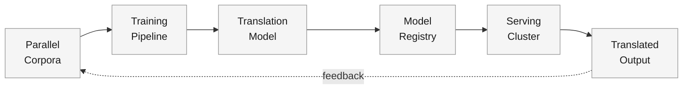
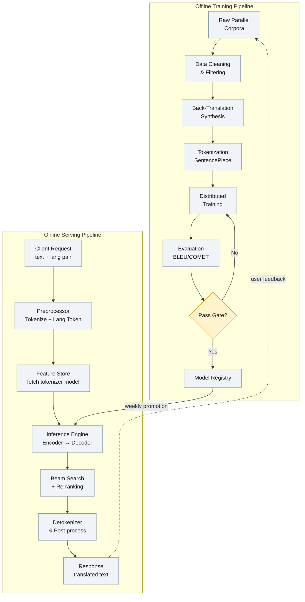

A translation service wants to serve 100+ language pairs to hundreds of millions of users, translating arbitrary text in under 500ms. The product ships a text box: user pastes text, picks a target language, and gets a fluent translation that preserves meaning, tone, and formatting.

<!--more-->

## 1. Problem & ML framing

A translation service wants to serve 100+ language pairs to hundreds of millions of users, translating arbitrary text in under 500ms. The product ships a text box: user pastes text, picks a target language, and gets a fluent translation that preserves meaning, tone, and formatting.

This is a **conditional text generation** problem. Given a source sentence **x** in language A, the model produces a target sentence **y** in language B by maximizing P(y \| x; θ) autoregressively — one token at a time, each conditioned on the source and all previously generated target tokens. The output space is unbounded: every valid sentence in the target language.

**Business objective:** maximize accurate, fluent translations served with low latency, measured indirectly through user engagement, translation adoption, and reduction in re-translation requests. **ML objective:** minimize token-level cross-entropy loss (label-smoothed) on a large parallel corpus, which directly drives the quality metrics that move the business needle.

The loop is critical: user interactions — copy-pastes, re-translations, thumbs-up/down — flow back as training signal for the next model iteration. A static model degrades within weeks as language usage shifts and new content domains emerge.

## 2. Requirements

**Functional**

- FR1: Translate arbitrary text between any supported language pair
- FR2: Support 100+ language pairs in a single deployed system
- FR3: Preserve source formatting including whitespace, paragraphs, and markup
- FR4: Stream partial translations as tokens are generated (real-time UX)
- FR5: Detect and handle unsupported languages with a graceful fallback

**Non-functional**

- NFR1: p99 end-to-end latency under 500ms for sentences ≤100 tokens
- NFR2: Throughput of 100K+ translations/second at peak load
- NFR3: Model freshness — retrained weekly, deployed within 24h
- NFR4: 99.9% availability with degraded-but-functional fallback on overload

*Out of scope: speech-to-speech translation, document layout preservation (PDF/DOCX), on-device-only deployment, translation memory integration.*

## 3. Metrics

**Offline (model quality on held-out data)**

- **BLEU** — fast, cheap, reproducible n-gram precision baseline. Used for hyperparameter sweeps and daily regression checks. Not trusted alone because it ignores recall and penalizes legitimate rephrasing.
- **COMET-22** — neural learned metric (XLM-R based) trained on human Direct Assessment judgments. Primary offline quality gate: highest correlation with human preference across 100+ languages. Replaces BLEU as the go/no-go signal for model promotion.
- **chrF** — character n-gram F-score. Secondary metric for morphologically rich and low-resource languages where BLEU's word-level matching is too harsh.

**Online (real user impact via A/B experiment)**

- **Translation adoption rate** — fraction of users who translate again within 7 days. Direct proxy for "the output was useful enough to come back."
- **Re-translation rate** — fraction of translations where the user immediately re-submits with edited source text. If high, the model missed the mark.
- **Copy/paste rate** — user copies the translation output (for low-resource pairs, this is often the strongest implicit quality signal).
- **Toxicity guardrail** — fraction of outputs flagged by the toxicity classifier. Must not regress beyond 0.1% on any language at model promotion.

Latency (p50/p99) and throughput are tracked as system health SLAs — they are NFRs from §2, not model quality metrics in §3.

## 4. Data

- **Parallel corpora** — WMT shared task data (news, Europarl, TED talks), OPUS (subtitles, EU legislation, Quran), WikiMatrix (Wikipedia-aligned sentences). These provide 10M–100M sentence pairs for high-resource pairs (En↔De/Fr/Es/Zh).
- **Web-crawled bitexts** — CommonCrawl-derived parallel data mined with LASER3 embeddings. Produces ~10B sentence pairs across 200 languages. Quality is noisy; heavy filtering required (language ID confidence >0.95, length ratio <3:1, toxicity removal).
- **Synthetic data via back-translation** — monolingual target-language text → existing MT model translates to source → pair used as training data. Doubles effective training volume for mid-resource languages (5M–50M pairs). Critical for languages with little natural parallel data.
- **Labels / ground truth** — human-translated reference sentences. FLORES-200 provides ~2,000 professionally translated sentences per language across 200 languages. For high-resource pairs, WMT test sets add ~3,000 sentences/year. Implicit labels come from user edits and post-editing corrections in professional use cases.
- **Class imbalance** — high-resource pairs (En↔De) have 100M+ examples; low-resource pairs (Yoruba↔Swahili) have ~10K. Mitigation: temperature-based sampling that oversamples low-resource pairs proportional to 1/√(pair_count), and a data-temperature parameter that controls how aggressively the distribution is flattened.
- **Train/val/test split** — 80/10/10, time-stratified: newer data in validation and test sets. Never random-split on temporal data — a Dec-2025 sentence in training leaking into a Jan-2025 test inflates BLEU by 2–5 points.

## 5. Features

The model learns features directly from raw text — there is no hand-crafted feature engineering pipeline. What matters is the **representation** the model consumes and the parity between training and serving.

**Subword tokenization (SentencePiece BPE)**

- Shared vocabulary of 64K subword tokens across all languages. Unifies the input space: every language maps to the same token IDs, enabling cross-lingual transfer.
- Trained once on a balanced sample of all language corpora, then frozen. Online tokenization must use the exact same SentencePiece model — any drift here produces garbled output.

**Language embedding**

- A learned embedding vector for each language, prepended as a special token (e.g., `<2en>`, `<2de>`) at the start of the source sequence. This single token tells the model both source and target language identity. Costs one extra token position and avoids the O(n²) model proliferation of bilingual systems.

**Position encoding**

- Sinusoidal positional encodings added to token embeddings before the first encoder layer. Training uses sequences up to 512 tokens; serving truncates or splits longer inputs.

**Attention mask**

- Causal mask in the decoder (token t can only attend to positions ≤t) plus padding mask that prevents attention to `<pad>` tokens in variable-length batches.

**Online/offline parity**

- The tokenizer and language-embedding table are versioned artifacts in the model registry. When the serving cluster loads a model checkpoint, it also loads the exact SentencePiece model and embedding table that the checkpoint was trained with. No drift is possible because the artifacts are a single immutable bundle. Training-time preprocessing (lowercasing, Unicode normalization) is replicated exactly in the serving preprocessor — same code path, same library version.

## 6. Model

**Baseline: phrase-based statistical MT (PBMT)**

Before neural methods, production systems used phrase tables with a log-linear re-ranking model. PBMT scores ~20–25 BLEU on WMT En→De, struggles with word order across distant language pairs, and requires per-pair tuning. It establishes the floor: any NMT model must beat 25 BLEU to justify the compute cost.

**Primary: Dense Transformer (encoder-decoder)**

A 12-layer encoder, 12-layer decoder Transformer with 8 attention heads, 512-dim hidden states, and 2048-dim feed-forward layers (~65M parameters for the base configuration). Trained with cross-entropy loss + label smoothing (ε=0.1) using teacher forcing. The encoder processes the full source sentence in parallel; the decoder generates autoregressively, attending to encoder outputs via cross-attention at each layer.

Tradeoffs against the alternative (pure-decoder LLM): a dedicated encoder-decoder Transformer processes the source bidirectionally in one pass, runs 3–5× faster per token than a GPT-style decoder that must re-read the source prefix at every generation step, and achieves comparable BLEU at 10–20× fewer parameters. The cost is that an encoder-decoder is a single-purpose model — it cannot do summarization or chat without architectural changes.

**Advanced: Sparse Mixture of Experts (MoE) for multilingual scaling**

Each feed-forward layer in both encoder and decoder is replaced with N expert sub-networks (N=128 for a 54.5B total-parameter model). A learned gating network routes each token to the top-2 experts. Because only 2/128 experts activate per token, the per-token FLOPs stay roughly constant while total capacity scales linearly with expert count. Different language pairs naturally specialize to different expert combinations — low-resource pairs route through shared experts to avoid overfitting; high-resource pairs develop dedicated expert pathways.

**Loss and training**

Cross-entropy with label smoothing (ε=0.1). Label smoothing prevents the model from assigning probability 1.0 to the reference token, which improves calibration and is worth ~0.5 BLEU on WMT benchmarks. Training uses Adam with inverse-square-root learning-rate schedule, 4096 tokens per GPU batch, dynamic batching that groups sequences of similar length to minimize padding waste.

**The translation funnel (inference)**

Unlike a retrieval/ranking system, translation has no multi-stage funnel — the model generates directly. But inference has its own staged pipeline:

1. **Candidate generation** — beam search with width 4–8 explores the top-k most probable token sequences at each decoding step. Each beam maintains its own cumulative log-probability.
1. **Length normalization** — raw beam scores are divided by (sequence_length)^α (α=0.6) to prevent bias toward short, incomplete translations.
1. **Coverage penalty** — a learned penalty term that discourages the model from ignoring portions of the source sentence. Without this, the model occasionally drops clauses.
1. **Re-ranking** — the top-N complete candidates (N=10) are re-scored with the full encoder-decoder forward pass (no teacher forcing), and the highest-scoring candidate is returned.

For latency-sensitive paths (real-time streaming, on-device), beam width drops to 1 (greedy decoding) and re-ranking is skipped entirely — ~2× faster at a cost of 0.5–1.0 BLEU.

## 7. Architecture

#### Offline training pipeline

**Components:** Data ingestion workers (Apache Beam / Spark), distributed GPU training cluster (8–64 A100/H100 GPUs), evaluation harness, model registry (MLflow or internal equivalent).

**Flow:**

1. Raw parallel corpora ingested from WMT, OPUS, CommonCrawl dumps into a data lake (Parquet, partitioned by language pair).
1. Cleaning pipeline: language identification (LID-200 classifier, confidence >0.95), deduplication (MinHash with Jaccard >0.8), length-ratio filtering, toxicity removal.
1. Back-translation synthesis: monolingual target-language text → current-best model translates to source → pair added to training set. Runs weekly on fresh monolingual crawls.
1. Tokenization with the frozen SentencePiece model. Output: arrays of token IDs + attention masks, sharded as TFRecord files.
1. Distributed training: data-parallel across GPUs with gradient accumulation. Dynamic batching groups sequences by approximate length. Checkpoint every 5K steps. Training for a 65M-param dense model on 1B sentence pairs takes ~3 days on 8 A100 GPUs.
1. Evaluation: compute BLEU, chrF, and COMET-22 on held-out test sets for every language pair. Toxicity benchmark on all 200 languages. Results written to the experiment tracker.
1. Gate check: COMET must not regress >0.5 points on any high-resource pair and must improve or stay flat on all low-resource pairs vs. the currently deployed model. Toxicity must stay below 0.1%.
1. Promoted checkpoints land in the model registry as an immutable versioned bundle: weights, tokenizer model, config, evaluation results. The registry is the single source of truth for "what is deployable."

**Design considerations:** Training is the expensive part — 3 days of GPU time per model iteration. Weekly cadence means the model is always within 7 days of freshness. Back-translation synthesis runs in parallel on CPU clusters so training GPU time is fully utilized on forward/backward passes. The evaluation harness must run on the same GPU architecture as training or inference — COMET scores shift meaningfully between FP16 and FP32.

#### Online serving pipeline

**Components:** Load balancer (Envoy/NGINX with HTTP/2), model servers (Triton Inference Server or custom TorchServe pods on GPU nodes), feature store (Redis for tokenizer model lookup), monitoring stack (Prometheus + Grafana).

**Flow:**

1. Client sends source text, source language, and target language via a REST/gRPC endpoint.
1. Preprocessor normalizes Unicode, lowercases, applies the SentencePiece tokenizer, and prepends the target-language token. This is the same code path as training-time preprocessing.
1. Feature store resolves `tokenizer:v3` to the exact SentencePiece model bytes (cached in server memory after first fetch; the lookup is a formality to guarantee the server loads the right version).
1. Inference engine: encoder passes over the full source sequence in one parallel forward pass (~15ms for 100 tokens on an A100). Decoder runs autoregressively, generating one token per step with KV-cache for efficiency (~8ms/token, ~400ms total for a 50-token output).
1. Beam search maintains top-4 hypotheses with cumulative log-prob scores. Length normalization and coverage penalty applied before final ranking.
1. Detokenizer converts token IDs back to text. Post-processing restores casing and whitespace.
1. Response returned. Streaming mode sends each generated token as a server-sent event so the UI can render partial translations.

**Serving-scale numbers:** A single A100 GPU serving a 65M-param Transformer with FP16 and dynamic batching handles ~500 translations/second. At 100K peak QPS, the cluster needs ~200 GPU replicas. With 200 language pairs, each GPU can serve any pair — the model is multilingual, so no per-pair sharding is needed. p99 latency stays under 500ms with beam size 4 for inputs up to 100 tokens; longer inputs are split at sentence boundaries and translated in parallel, with results concatenated.

**Design considerations:** The model registry is the bridge between the two pipelines. When a new checkpoint passes the offline gate, the serving cluster performs a rolling update: new pods load the new checkpoint while old pods drain. Canary deployment routes 5% of traffic to the new model for 4 hours, monitoring COMET and latency; if stable, ramps to 100%. Rollback is instant — previous checkpoint stays warm in the registry.

## 8. Deep dives

### DD1: Low-resource language support

**Problem.** A language like Kinyarwanda has ~10K parallel sentence pairs with English. Training a bilingual Transformer on 10K pairs produces BLEU scores under 5 — unusable. But withholding translation from these languages fails the product's coverage requirement. The model must achieve acceptable quality without thousands of professional translators.

**Approach 1: Pivot through a high-resource bridge language.** Translate source → English → target using two high-quality models. Simple to implement — no new training needed. Produces coherent output because both bridge models are strong. However, errors compound: a 5% error rate in each hop yields ~10% error in the final output. Idioms and culturally specific concepts get flattened to the English interpretation, losing nuance. Works acceptably for gisting, fails for publication-quality translation where meaning fidelity matters.

**Approach 2: Massive multilingual training with oversampling.** Train a single Transformer on all language pairs simultaneously, oversampling low-resource pairs by temperature-based sampling. The shared encoder and decoder learn representations that transfer from high-resource to low-resource languages — the model discovers that "the cat is black" in English maps to similar token patterns in Spanish, which helps it learn the Kinyarwanda mapping from far fewer examples. This is the NLLB-200 approach (44% BLEU improvement for low-resource languages vs. bilingual baselines). The downside is capacity dilution: adding 100 low-resource languages to a fixed-capacity model degrades high-resource pairs by 1–3 BLEU unless the model scales proportionally.

**Approach 3: Adapter modules with frozen backbone.** Train a large dense Transformer on high-resource pairs only, then freeze it. For each low-resource language, insert small adapter layers (bottleneck MLPs, ~2% of total parameters) between the frozen layers and train only the adapters on the small parallel corpus. Adapters prevent catastrophic interference from low-resource data leaking into the shared representation. The tradeoff is that adapter training still needs some data (5K+ pairs to beat the pivot baseline), and inference latency increases slightly from the adapter forward passes.

**Decision: Massive multilingual with MoE routing, plus back-translation for the sparsest pairs.** The multilingual approach is the only one that demonstrably works at scale (200 languages, 44% improvement over bilingual). MoE mitigates the capacity-dilution problem by letting high-resource pairs develop dedicated expert pathways without shrinking the capacity available to low-resource pairs. For languages with <5K pairs, synthetic back-translation data bridges the gap: monolingual web text is cheap and abundant even for low-resource languages.

**Rationale.** NLLB-200 at 54.5B sparse params achieved >70% BLEU improvement for several African and Indian languages vs. the prior state of the art at the same total compute cost. The pivot approach degrades meaning fidelity unacceptably for languages where the service may be the only available translation tool. Adapter modules are promising but haven't been validated at 200-language scale — they're a research bet, not a production bet.

> **💡 Key insight:** The hard ceiling for low-resource translation isn't model architecture — it's evaluation. When no native speaker is on the team, you can't tell if the model is hallucinating fluent gibberish or producing real translations. Every low-resource launch must pair with at least one native-speaker evaluator on retainer, or you're shipping blind.

### DD2: Serving latency vs. translation quality

**Problem.** Autoregressive decoding is inherently sequential: token t+1 depends on token t, so the decoder cannot parallelize across output positions. A 50-token output requires 50 sequential forward passes through the decoder. Increasing beam width from 1 to 4 roughly quadruples decoder calls. Users expect sub-second translation, but the highest-quality configuration (beam=8, full re-ranking) pushes latency past 1.5 seconds for long sentences. The system must find the sweet spot where quality is high enough and latency is low enough.

**Approach 1: Knowledge distillation (teacher → student).** Train a small "student" model (6-layer encoder, 6-layer decoder, ~25M params) to mimic the output distribution of a large teacher (12/12, 65M params, or MoE 54.5B). The student runs 2–4× faster with 1–3 BLEU degradation. Distillation is data-efficient: the student learns from the teacher's soft targets (full probability distribution over vocabulary), not just the argmax, which transfers nuance that hard labels lose. The student can also be trained on synthetic data generated by the teacher, effectively infinite training data.

**Approach 2: INT8/FP8 quantization.** Quantize model weights from FP32 → INT8 (or FP8). Modern GPUs (H100, GB200) have native INT8/FP8 tensor cores that deliver 2–4× throughput improvement on matrix multiplies. DeepL's 2026 system uses FP8 for both training and inference with negligible quality loss, halving memory bandwidth requirements vs. FP16. Quantization is lossy — activations can saturate — but calibration on a representative dataset minimizes accuracy drop to <0.3 BLEU for INT8.

**Approach 3: Speculative decoding.** Run a small, fast "draft" model (2-layer decoder) to propose the next K tokens, then verify them in one parallel forward pass through the large model. If the large model agrees on token i, accept it; if not, reject from token i onward and fall back to standard autoregressive decoding. Because the large model can verify K tokens in one parallel pass, accepted tokens cost ~1/K the latency of standard decoding. Draft-model quality determines the acceptance rate; a well-tuned draft achieves 60–80% acceptance with 3–4× effective speedup and zero quality loss (the output is identical to the large model's autoregressive output).

**Decision: INT8 quantization as the default path, speculative decoding for premium tier.** Quantization is the simplest, most reliable latency reduction — it's a one-time calibration step with no architectural changes, no additional models to deploy, and well-understood quality tradeoffs. Speculative decoding is layered on top for latency-sensitive or premium traffic: it's transparent (output is identical to the un-optimized model), scales with draft quality, and integrates with beam search by speculating on each beam independently. Distillation is reserved for on-device or extremely cost-sensitive deployments where the 1–3 BLEU penalty is acceptable.

**Rationale.** Moving from FP32 → INT8 on an A100 cuts decoder latency from ~30ms/token to ~10ms/token for a 65M-param Transformer, bringing a 50-token output from 1.5s to 500ms — under the NFR1 budget — with no architecture changes. Speculative decoding adds an extra 2–3× on top. The combination of quantization + speculative decoding + beam pruning keeps the p99 under 500ms while running the full 12/12 Transformer with beam size 4.

> **💡 Key insight:** The largest latency win in production MT systems isn't a model trick — it's dynamic batching. When the server groups 32 requests arriving within a 5ms window and runs the encoder as one batch, per-request encoder latency drops from 15ms to ~1ms. The decoder can't batch across requests (each request has a different target sequence length), but the encoder — which is 30–40% of total latency — is embarrassingly parallel.

### DD3: Continual learning and domain adaptation

**Problem.** A model trained on news and Wikipedia text degrades by 3–8 BLEU when translating medical records, legal contracts, or social media posts. Fine-tuning on in-domain data fixes the domain but catastrophically forgets the general translation capability — the model that aced WMT news benchmarks starts hallucinating on everyday sentences. And the world changes: new entities (companies, products, political figures), new slang, and new domain conventions appear continuously. A model frozen at training time rots within months.

**Approach 1: Elastic Weight Consolidation (EWC).** During fine-tuning on new domain data, add a penalty term to the loss: Σ (F_i × (θ_i − θ*_i)²), where F_i is the Fisher information — a measure of how important weight i was for the original task, and θ*_i is the original weight value. Important weights for the general task are "pinned" and can't move far; unimportant weights are free to adapt to the new domain. EWC requires one extra forward pass to estimate Fisher information before fine-tuning begins. It's effective (retains 80–90% of original performance while adapting) but the Fisher computation is a one-time snapshot — if the model later adapts to a third domain, the Fisher from the original task has already drifted.

**Approach 2: Experience replay with a memory buffer.** Maintain a fixed-size buffer (e.g., 1M sentence pairs) drawn uniformly from all previously seen domains and language pairs. During fine-tuning, each batch is a mix of 50% new-domain data and 50% replay-buffer data. The replay buffer prevents catastrophic forgetting by keeping old data in the training distribution. The buffer size is a direct quality lever: 1M pairs costs ~5% of a training epoch to replay but maintains within 0.5 BLEU of the original model on old domains. The buffer must be refreshed periodically as the model improves — stale replay data from an older model distribution loses effectiveness.

**Approach 3: Adapter-based domain specialization.** Freeze the base model and train domain-specific adapter modules. A medical adapter is a small set of bottleneck layers (~2% of total parameters) inserted after each transformer layer, trained only on medical parallel data. At serving time, the system selects which adapter to activate based on the detected domain of the input. Adapters are composable: medical + legal adapters can be active simultaneously if the base model is frozen. The tradeoff is that adapters don't help with genuinely new translation phenomena that the base model never saw — they only re-weight existing representations, they can't create new ones.

**Decision: Experience replay as the primary continual-learning mechanism, with domain-tag conditioning for known domains.** For scheduled weekly retraining, replay 20% of the training batch from a memory buffer covering all language pairs and domains, sampled uniformly. This maintains general quality while incorporating new data. For known domain shifts (medical, legal, technical), prepend a domain tag token (`<domain:medical>`) to the source during both training and inference — the model learns to condition on domain identity without architectural changes.

**Rationale.** Experience replay is the simplest mechanism that demonstrably works at scale — Google's production NMT has used replay-like data mixing since GNMT (2016). EWC is theoretically elegant but the Fisher matrix becomes stale across multiple adaptation steps (which is the real production pattern — continuous weekly updates, not one-shot adaptation). Adapter modules add serving complexity (domain detection → adapter selection latency) for a gain that domain-tag conditioning achieves with zero additional serving cost.

> **💡 Key insight:** The most insidious form of model rot isn't domain shift — it's entity staleness. A model trained in January doesn't know about a company that launched in March, a politician elected in April, or a product announced in May. Named-entity freshness requires a data pipeline that continuously mines news, Wikipedia edits, and knowledge-base updates, and folds them into training data as context-rich sentence pairs, not just glossary entries. Without this, the model translates entity names as literal transliterations, which is worse than leaving them untranslated.

### DD4: Evaluation and production monitoring

**Problem.** BLEU scores can stay flat or even improve while real translation quality degrades in ways users notice — a model that learned to produce short, safe translations scores well on n-gram precision but frustrates users who wanted complete translations. Conversely, a model can produce fluent, natural-sounding output that subtly changes the meaning — COMET scores look great, human evaluators flag it. And different language pairs have different failure modes: gender mistranslation in Romance languages, honorific level errors in Japanese/Korean, dropped negation in any language. No single metric catches everything.

**Approach 1: Multi-metric dashboard with per-language thresholds.** Track BLEU, chrF, COMET-22, and a toxicity score for every language pair, every model checkpoint. Any regression >2% relative on any metric for any high-resource pair triggers an alert. Any regression on any low-resource pair triggers a mandatory human review. This catches most degradation but doesn't tell you *why* — the dashboard says "COMET dropped 3 points on En→Ja" but doesn't explain whether it's honorifics, word order, or dropped particles.

**Approach 2: Slice-based evaluation with linguistic checkpoints.** Define evaluation "slices" — subsets of the test set that isolate specific phenomena: sentences with named entities, sentences with negation, sentences >50 tokens, sentences with gender-marked pronouns, sentences in informal register. Run metrics per slice per language. A model that regresses on the "negation" slice but improves overall can be caught before deployment. Slices require linguist-annotated test data for each phenomenon, which is expensive — typically 500–2000 hand-annotated sentences per slice per language. Automated slice generation from grammar rules is possible but noisy.

**Approach 3: Online A/B with human evaluation for promotion gates.** For major model releases (monthly), run a 4-hour A/B experiment: 5% of traffic gets the new model. Measure online metrics (adoption rate, re-translation rate, copy/paste rate) and also route a random 1% of translations to human evaluators for side-by-side comparison against the production model on adequacy, fluency, and preference. The human evaluation is the final gate — no model is promoted with a statistically significant human preference for the old model, regardless of automatic metric scores.

**Decision: Multi-metric dashboard for continuous monitoring, slice-based eval for pre-release gating, A/B + human eval for major promotion.** The dashboard runs daily on every checkpoint and catches 90% of regressions cheaply. Slice-based evaluation runs before any model promotion to production and catches the "BLEU improved but negation got worse" class of errors. Human evaluation gates the monthly major release — it's expensive (~$50K per evaluation round across 20 language pairs) but it's the only mechanism that catches the failure modes automatic metrics still miss.

**Rationale.** COMET-22 reduced but didn't eliminate the metric-human gap — on some language pairs, COMET and human preference diverge by 5–10 percentage points. Human evaluation at every checkpoint is economically impossible (40,000 directions × 100 sentences × $0.50/sentence ≈ $2M per evaluation). The layered approach — cheap dashboard for daily, expensive human for monthly — gives both coverage and signal quality. The slice-based evaluation is the middle tier that prevents the most embarrassing class of regressions from reaching human evaluators in the first place.

> **💡 Key insight:** Production MT evaluation is fundamentally a language-coverage problem, not a metric-quality problem. You can have perfect BLEU/COMET correlation with human judgment on En→De — but if your monitoring infrastructure can't compute COMET on Kinyarwanda→Swahili because the underlying XLM-R model wasn't pre-trained on those languages, you're flying blind on 180 of your 200 supported languages. The evaluation infrastructure must cover every deployed language pair, or the uncovered pairs become a silent quality regression vector.

## 9. References

1. [Attention Is All You Need](https://arxiv.org/abs/1706.03762) — Vaswani et al. (2017), NeurIPS
1. [Google's Neural Machine Translation System: Bridging the Gap between Human and Machine Translation](https://arxiv.org/abs/1609.08144) — Wu et al. (2016)
1. [Google's Multilingual Neural Machine Translation System: Enabling Zero-Shot Translation](https://arxiv.org/abs/1611.04558) — Johnson et al. (2017), TACL
1. [No Language Left Behind: Scaling Human-Centered Machine Translation](https://arxiv.org/abs/2207.04672) — NLLB Team, Meta AI (2022)
1. [Beyond English-Centric Multilingual Machine Translation](https://arxiv.org/abs/1911.02116) — Fan et al., M2M-100 (2020)
1. [GShard: Scaling Giant Models with Conditional Computation and Automatic Sharding](https://arxiv.org/abs/2006.16668) — Lepikhin et al. (2020)
1. [How we built DeepL's next-generation LLMs with FP8 for training and inference](https://www.deepl.com/en/blog/tech) — DeepL Engineering Blog (2026)
1. [COMET: A Neural Framework for MT Evaluation](https://aclanthology.org/2020.emnlp-main.213/) — Rei et al. (2020), EMNLP
1. [BLEURT: Learning Robust Metrics for Text Generation](https://arxiv.org/abs/2004.04696) — Sellam et al. (2020), ACL
1. [chrF: character n-gram F-score for automatic MT evaluation](https://aclanthology.org/W15-3049/) — Popović (2015), WMT
1. [BLEU: a Method for Automatic Evaluation of Machine Translation](https://aclanthology.org/P02-1040/) — Papineni et al. (2002), ACL
1. [SentencePiece: A simple and language independent subword tokenizer and detokenizer](https://arxiv.org/abs/1808.06226) — Kudo & Richardson (2018), EMNLP
1. [Neural Machine Translation of Rare Words with Subword Units](https://aclanthology.org/P16-1162/) — Sennrich et al. (2016), ACL
1. [Overcoming catastrophic forgetting in neural networks](https://arxiv.org/abs/1612.00796) — Kirkpatrick et al. (2017), PNAS
1. [Tencent AI Lab Multilingual MT System for WMT22 Large-Scale African Languages](https://arxiv.org/abs/2210.09644) — Tencent AI Lab (2022)
