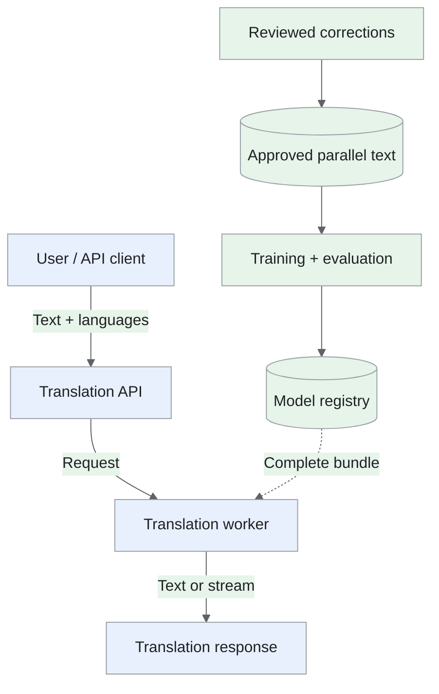
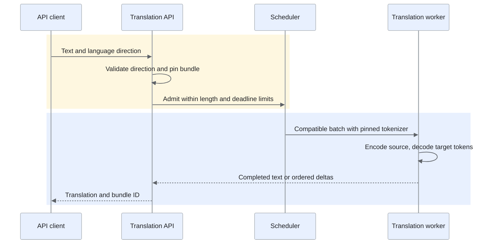
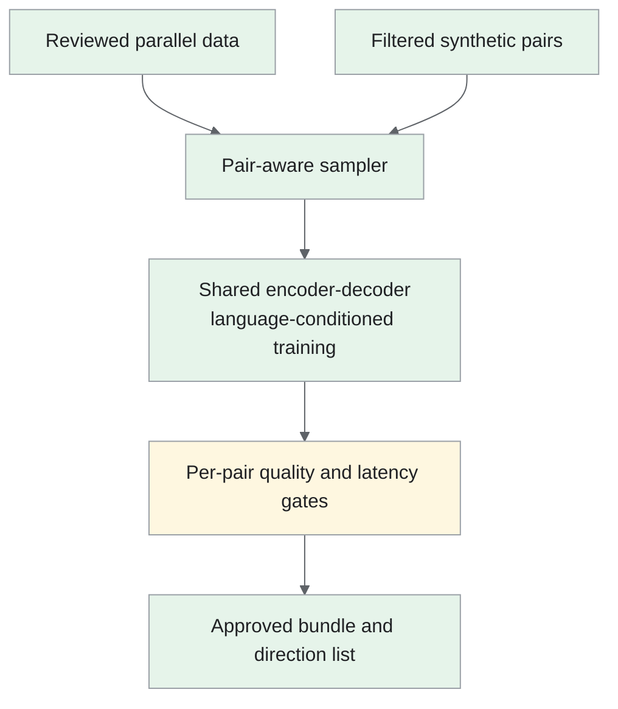

A multilingual text-translation service that returns translated text through an API, with streaming output for longer requests.

<!--more-->

## Problem

Users need to translate messages, product descriptions and other text while preserving the original meaning. The service accepts text and a target language, then returns a translation that keeps names, numbers and formatting intact.
Most requests are short, but language coverage and quality vary substantially by language pair. We use a shared multilingual model, evaluate each supported direction separately and keep the translation API independent of model releases.

## Requirements

### Functional requirements

- **Translate text.** Accept a source language and target language, or detect the source language when it is omitted.

- **Support multiple languages.** Launch with an explicit allowlist of at least 100 language pairs.

- **Stream translations.** Return generated text incrementally and allow the user to cancel a request.

- **Preserve content.** Retain names, numbers and supported formatting; reject unsupported languages or invalid input with a clear response.

- **Collect feedback.** Let users report an incorrect translation or submit a correction.

Speech translation, document-layout conversion and on-device inference are out of scope.

### Non-functional requirements

- **Scale:** support 100K translation requests/s at peak, with independent capacity limits for each model pool.

- **Latency:** target p99 below 500ms for requests with at most 100 source tokens and 50 generated tokens. Measure first-output latency separately for streaming requests.

- **Availability:** target 99.9% for supported language pairs.

- **Quality:** pass language-pair and domain-specific evaluation gates, including human checks for meaning changes and harmful output.

- **Freshness:** evaluate a new candidate weekly and support deploying an approved bundle within 24 hours.

- **Privacy:** keep user text out of training unless consent and retention policy permit its use.

## Back-of-the-envelope calculations

- At 100K requests/s and 50 generated tokens per request, the peak workload is **5M output tokens/s**. Size pools from measured throughput at the required latency, input lengths and decoding settings: `replicas = peak requests/s ÷ sustainable requests/s per replica`, plus failure headroom.

- A 500ms response budget includes queueing, tokenization, encoding, decoding and delivery. For example, 50 decoding steps at 8ms each already consume 400ms; batching and model choice must be tested against the remaining budget.

- Language coverage is a matrix of supported directions. Supporting 200 languages would create 39,800 possible directions; a launch with 100 approved pairs needs a much smaller evaluation and capacity plan.

## Core entities

- **TranslationRequest** identifies the input, language direction and decoding mode.

- **ModelBundle** versions the weights and all preprocessing needed to reproduce an output.

- **ParallelExample** stores a source sentence and a verified translation for training or evaluation.

- **TranslationFeedback** records a reported issue separately from approved training data.

```protobuf
message TranslationRequest {
  string request_id;
  string text;
  string source_language;   // Empty: run language detection
  string target_language;
  string domain;
  bool stream;
}

message ModelBundle {
  string bundle_id;
  string weights_uri;
  string tokenizer_uri;
  string preprocessing_version;
  repeated string supported_pairs;
  string evaluation_report_uri;
}

message ParallelExample {
  string source_text;
  string target_text;
  string language_pair;
  string domain;
  string provenance;        // Licensed corpus, consented correction, synthetic
  string split_group;       // Related documents stay in the same data split
}

message TranslationFeedback {
  string request_id;
  string issue_type;
  string corrected_text;
  bool training_consent;
}

```
## API

```yaml
translate:
  method: POST
  path: /v1/translations
  body:
    text: "Where is the train station?"
    source_language: en
    target_language: es
    domain: general
    stream: false
  response:
    request_id: tr_123
    translated_text: "¿Dónde está la estación de tren?"
    source_language: en
    model_bundle: mt_2026_10_01
  errors:
    400: invalid input or unsupported language pair
    413: input exceeds the request limit
    429: capacity limit reached

stream:
  transport: server-sent events
  events: [text_delta, completed, failed]
  fields: [request_id, sequence, text_delta]
  cancellation: closing the connection cancels queued or active work

feedback:
  method: POST
  path: /v1/translation-feedback
  fields: [request_id, issue_type, corrected_text, training_consent]

```
## High-level design

The API validates the language pair and sends the request to a model pool. Each worker loads one complete bundle: weights, tokenizer and preprocessing configuration.
A separate training pipeline prepares parallel text, trains candidates and evaluates them before publishing a bundle. Serving continues with the active version while the next version is prepared.


```mermaid
%%{init: {'theme':'base','themeVariables':{'primaryColor':'#e8f0fe','primaryTextColor':'#202124','primaryBorderColor':'#9aa0a6','lineColor':'#5f6368','secondaryColor':'#e6f4ea','tertiaryColor':'#fef7e0','actorBkg':'#e8f0fe','actorBorder':'#9aa0a6','actorTextColor':'#202124','noteBkgColor':'#fef7e0','noteTextColor':'#202124','noteBorderColor':'#9aa0a6','signalColor':'#5f6368','signalTextColor':'#202124','labelBoxBkgColor':'#fef7e0','labelBoxBorderColor':'#9aa0a6'}}}%%
flowchart TB
  U["User / API client"] -->|"Text + languages"| API["Translation API"]
  API -->|"Request"| WORKER["Translation worker"]
  WORKER -->|"Text or stream"| RESULT["Translation response"]
  CORPUS[("Approved parallel text")] --> TRAIN["Training + evaluation"]
  TRAIN --> REG[("Model registry")]
  REG -.->|"Complete bundle"| WORKER
  FEEDBACK["Reviewed corrections"] --> CORPUS
classDef request fill:#e8f0fe,stroke:#9aa0a6,color:#202124;
classDef data fill:#e6f4ea,stroke:#9aa0a6,color:#202124;
classDef control fill:#fef7e0,stroke:#9aa0a6,color:#202124;
class U,API,WORKER,RESULT request;
class CORPUS,TRAIN,REG,FEEDBACK data;

```
## Storage

- **Object storage:** keep licensed corpora, Parquet training shards, model weights, tokenizers and evaluation reports in versioned objects. The dataset manifest records provenance and split membership.

- **[PostgreSQL](/designs/tech-postgresql/):** store bundle manifests, release decisions and consented feedback. A transaction updates the active-bundle pointer only after the candidate passes its release gates.

- **Worker memory:** hold the active model and per-request decoder state. Load the replacement bundle before routing traffic to it; retain the previous bundle for rollback.

- **[Redis](/designs/tech-redis/):** enforce request limits and hold short-lived job coordination if needed. Translation text is excluded from shared caches by default.

Weights and tokenizer must move together. A worker reports its bundle ID on every response so an incident can be traced to the exact serving configuration.

## From request to response

### Translation flow


```mermaid
%%{init: {'theme':'base','themeVariables':{'primaryColor':'#e8f0fe','primaryTextColor':'#202124','primaryBorderColor':'#9aa0a6','lineColor':'#5f6368','secondaryColor':'#e6f4ea','tertiaryColor':'#fef7e0','actorBkg':'#e8f0fe','actorBorder':'#9aa0a6','actorTextColor':'#202124','noteBkgColor':'#fef7e0','noteTextColor':'#202124','noteBorderColor':'#9aa0a6','signalColor':'#5f6368','signalTextColor':'#202124','labelBoxBkgColor':'#fef7e0','labelBoxBorderColor':'#9aa0a6'}}}%%
sequenceDiagram
  participant U as API client
  participant A as Translation API
  participant Q as Scheduler
  participant W as Translation worker
  rect rgb(254, 247, 224)
    U->>A: Text and language direction
    A->>A: Validate direction and pin bundle
    A->>Q: Admit within length and deadline limits
  end
  rect rgb(232, 240, 254)
    Q->>W: Compatible batch with pinned tokenizer
    W->>W: Encode source, decode target tokens
    W-->>A: Completed text or ordered deltas
    A-->>U: Translation and bundle ID
  end

```

Admission pins the language direction and complete model bundle before generation. Streaming emits ordered text from one decoding run; cancellation releases that run's state, while non-streaming quality mode can spend additional decoding work before returning a completed translation.

### Translating a short request

- **Validate the input.** Check the payload size and supported language pair. If the source language is omitted, run language detection and reject low-confidence results that would select the wrong translation direction.

- **Prepare the text.** Preserve case and meaningful punctuation. Segment long input at sentence boundaries, protect supported markup and tokenize using the active bundle.

- **Generate the translation.** The scheduler batches compatible requests while respecting their deadlines. The encoder processes the source once; the decoder generates the target tokens.

- **Return the result.** Detokenize complete text segments and restore protected formatting. The response includes the detected source language and bundle ID.

Autoregressive decoding performs repeated model steps. Its latency depends on output length, making decoding and admission control the main serving bottlenecks.

### Streaming a longer translation

Use greedy decoding for the streaming path so each emitted token extends the selected output. Buffer incomplete subwords until they form valid text, then send ordered `text_delta` events.
The client appends each event once using its sequence number. A disconnect cancels the generation and releases decoder memory. A worker failure produces a failed stream; the client can submit a new request rather than combining output from two independent generations.
Beam search keeps several candidate translations alive and can revise the leading hypothesis. Use it for a non-streaming quality mode, where the service returns the completed result.

### Preparing a training candidate

Group related documents and duplicates before creating chronological train, validation and test splits. Language identification, length-ratio checks and quality filters remove incorrect sentence pairs; near-duplicate filtering prevents the same passage from appearing in both training and evaluation.
Training uses teacher forcing: the decoder receives the preceding reference tokens and predicts the next token. Length-based batches reduce padding. The published bundle includes the trained weights, shared tokenizer, language identifiers and preprocessing version.
Synthetic examples from back-translation retain their provenance so evaluation can distinguish genuine parallel text from generated training data.

## Deep dives

### How should we share a model across languages?

Training data is uneven. A high-resource language pair can dominate a shared model, while maintaining a separate model for every pair creates a large serving and release burden.

- **One model per language pair:** Train and serve each direction independently. Pair-specific tuning is isolated, but model count, warm capacity and release work grow with the supported directions.

- **English pivot:** Translate first into English and then into the target language. Existing strong directions can be reused; two inference passes increase latency and an error in the first translation can propagate into the second.

- **Shared multilingual model — recommended:** Condition one encoder-decoder on source and target languages. Representations and serving capacity are shared; dominant pairs can interfere with weaker ones, requiring balanced training and per-pair release gates.
**Use a shared multilingual encoder-decoder for the initial service.** Include source and target language identifiers, and route only the directions that passed evaluation. [M2M-100](https://arxiv.org/abs/2010.11125) demonstrates direct multilingual translation, while [NLLB](https://arxiv.org/abs/2207.04672) develops broader coverage using multilingual training and conditional computation. The service supports several evaluated directions under one serving budget. We accept cross-pair interference and stricter sampling/evaluation work in exchange for fewer independently operated models; a weak direction remains excluded until it passes its own gates.
For sampling, let `n_i` be the number of examples for pair `i` and choose `p_i ∝ n_i^α`, with `0 < α < 1`. This increases the relative exposure of smaller datasets while keeping their contribution bounded. Tune the exponent against low-resource improvements and high-resource regressions.
Where parallel data is scarce, translate target-language monolingual text into the source language to create synthetic pairs. Filter these examples and mix them with genuine parallel text. Evaluate on human translations that were kept out of both training and synthetic-data generation.
A mixture-of-experts model is a later option when its quality gain justifies expert routing, communication and deployment complexity. Measure performance per pair before changing the serving architecture.
**Training and serving the shared model**
The encoder turns the source token sequence into contextual representations. The decoder attends to those representations and generates target tokens autoregressively. Language identifiers tell the same weights which direction to produce; routing validates that the requested pair belongs to the evaluated serving set.
For two datasets of 1M and 10K pairs, proportional sampling gives the smaller dataset about 1% of updates. With an illustrative exponent of 0.5, the relative weights become 1,000 and 100, giving it roughly 9%. That increases low-resource exposure, but repeatedly presenting the same small dataset can overfit it. Track validation loss separately for each pair.


```mermaid
%%{init: {'theme':'base','themeVariables':{'primaryColor':'#e8f0fe','primaryTextColor':'#202124','primaryBorderColor':'#9aa0a6','lineColor':'#5f6368','secondaryColor':'#e6f4ea','tertiaryColor':'#fef7e0','actorBkg':'#e8f0fe','actorBorder':'#9aa0a6','actorTextColor':'#202124','noteBkgColor':'#fef7e0','noteTextColor':'#202124','noteBorderColor':'#9aa0a6','signalColor':'#5f6368','signalTextColor':'#202124','labelBoxBkgColor':'#fef7e0','labelBoxBorderColor':'#9aa0a6'}}}%%
flowchart TB
    A["Reviewed parallel data"] --> S["Pair-aware sampler"]
    B["Filtered synthetic pairs"] --> S
    S --> T["Shared encoder-decoder<br>language-conditioned training"]
    T --> E["Per-pair quality and latency gates"]
    E --> R["Approved bundle and direction list"]
classDef request fill:#e8f0fe,stroke:#9aa0a6,color:#202124;
classDef data fill:#e6f4ea,stroke:#9aa0a6,color:#202124;
classDef control fill:#fef7e0,stroke:#9aa0a6,color:#202124;
class A,B,S,T,R data;
class E control;

```

The bundle includes tokenizer vocabulary, language mapping, weights and decoding defaults. A request pins that bundle for its entire generation. Adding a new direction requires evidence on that pair even when both languages already appear elsewhere in training; transfer is useful, but coverage in the language list alone does not establish translation quality.

### How do we fit translation into the latency budget?

The decoder performs one step per generated token. Longer outputs and larger beams increase the work even when the input is short.

- **Greedy decoding:** Choose one token at each step. Work and streaming behavior are predictable, but a locally best token can lead to a poorer complete translation.

- **Beam search:** Retain several candidate translations and select a completed sequence. Quality can improve for difficult inputs; more decoder state and repeated scoring raise queueing cost, and the leading hypothesis can change before completion.

- **Greedy streaming with optional bounded-beam quality mode — recommended:** Use one stable decoding path for live deltas and a small beam for completed-text requests. Each mode has a clear latency contract; operating two modes requires separate admission budgets and quality evaluation.
**Use greedy decoding for streaming and a small beam for the optional non-streaming quality mode.** Start with a maximum 5ms batching wait, then tune it from measured queueing and completion latency. Bound input length, output length and active decoder state per worker. Streaming users need appendable text while some callers value a better completed translation. We accept a separate quality-mode capacity budget rather than making every request pay beam-search cost. Distillation and quantization are complementary optimizations whose speed, memory and quality effects must be evaluated for both modes.
The scheduler groups requests with similar lengths and compatible decoding settings. Long requests use a separate queue so they do not occupy every batch needed by short requests. Reject overload promptly with `429`; the client can retry with backoff.
Benchmark the complete path at the expected length distribution. Quantization is promoted only when the same language-pair suite passes, including numbers, names and low-resource directions. Any speed improvement belongs to that tested hardware and bundle.
**The decoder's work, step by step**
Compute the encoder once, then keep decoder attention state for the generated prefix. Greedy decoding selects the next token from one hypothesis. A beam of width four retains up to four hypotheses at each step, scores their extensions and keeps the best surviving paths. Length normalization and stopping rules matter: raw summed log probability favors shorter sequences.

```text
Input queue → encoder → decode token 1 → decode token 2 → ... → end token
                       one active path for streaming
                       several competing paths for quality mode

```

Beam hypotheses can change order as later tokens arrive, so the optional quality mode returns its chosen sequence after completion. Streaming emits the greedy path and promises that already delivered tokens remain part of that generation.
Batch only requests with compatible bundle and decoding settings. Apply length buckets to reduce padding, while keeping a maximum queue age so a rare bucket still runs. Count active hypotheses and total decoder tokens against memory capacity. Cancellation removes the request at an iteration boundary and reclaims its state. Compare quantized and baseline bundles on the same pair/length cohorts; a faster average can still hide worse tail latency on long outputs.

### How do we adapt to a new domain?

A general model may translate everyday text well but mishandle legal, medical or product-specific terminology. Fine-tuning only on the new domain can also reduce quality elsewhere.

- **Domain-only full fine-tuning:** Update all weights using domain translations. Adaptation is flexible, but shared parameters can lose general-language or other-pair quality through forgetting.

- **Domain adapters:** Train a small routed parameter set while retaining the base model. Domains can release independently; adapter selection, resident memory and compatible bundle versions add serving complexity.

- **Mixed-data fine-tuning — recommended:** Train on reviewed domain pairs with representative general-data replay. This balances adaptation and retained quality; the mixture needs tuning and a shared release can still regress an unrelated pair.
**Start with mixed-data fine-tuning.** Use approved domain translations and replay general examples during training; begin with a 20% general-data share and tune it using both domain and general evaluation. Use adapters when domains need independent release schedules or their requirements conflict. The initial service has one shared multilingual bundle, so replay offers a direct way to improve domain errors while checking general quality. We accept broader regression gates; adapters become preferable when domains require independent release ownership.
Each release is tested for terminology, omitted phrases, incorrect numbers and changes in meaning. A domain-specific improvement is accepted only when the agreed general-language regression limits also pass.
**A domain-training example**
For a product-support domain, collect approved source/target pairs containing product names, error messages and support terminology. Keep some terminology-heavy cases out of training for evaluation, then mix domain and general batches using a recorded sampler configuration. The model should learn surrounding grammar as well as the preferred term.
A terminology list can guide decoding or evaluation, but replacing translated substrings afterward can damage inflection or word order. The proposed first release improves the model with mixed-data training; a constrained-decoding extension would need its own grammatical and latency tests.
Store dataset lineage and permitted uses in the manifest. Deduplicate pairs before splitting so paraphrases or repeated support templates do not appear on both sides of the evaluation boundary. Compare general-language and domain results, including examples with similar words but different meanings.
Adapters become useful when two customers require incompatible terminology or independent rollout. Route an adapter by an explicit approved domain ID, load it with its base-model revision, and cap the number held on each worker. An adapter cache miss adds loading delay, so warm the expected active set rather than treating adapter routing as free.

### How do we decide whether a candidate is better?

Text similarity metrics provide useful feedback, but users care about accurate meaning. Fluent output can still reverse a negation or mistranslate a name.

- **Automated metrics alone:** Score fixed references with BLEU, chrF and a learned metric. Comparisons are repeatable and inexpensive to rerun, but a score gain can miss a meaning-changing negation, number or name error.

- **Human review alone:** Have reviewers assess meaning and severity by language pair. This covers important semantic failures, but cost and reviewer variation limit repeated coverage across all pairs and lengths.

- **Automated matrix plus targeted human review — recommended:** Use repeatable pair/domain/length comparisons and reviewed high-impact cases, followed by a canary. This combines broad regression coverage with semantic evidence; it requires scorer versions, reviewer criteria and protected evaluation data.

Translation quality is about preserved meaning as well as serving performance. We accept review cost for sensitive errors and weaker pairs, using automated checks for coverage rather than as the sole promotion decision.
Use [BLEU](https://aclanthology.org/P02-1040/) and [chrF](https://aclanthology.org/W15-3049/) for reproducible reference comparisons, and [COMET](https://aclanthology.org/2020.emnlp-main.213/) for a learned quality signal. Pin the scorer versions and evaluate the same held-out examples for each candidate.
Group results by language pair, domain and input length. Human review covers low-resource pairs and high-impact errors: negation, numbers, names, gender, honorifics and harmful output. User corrections become training examples only after consent and review.
Release a passing candidate to a small canary pool. Compare quality incidents, latency, errors and resource use against the active bundle, then increase traffic gradually. Rollback switches the routing pointer to workers already serving the previous complete bundle.
**What the release gate checks**
Use one fixed evaluation matrix covering pair, domain, length and error severity. Automated scorers provide repeatable comparisons; reviewed examples determine whether a candidate introduces meaning-changing errors. Store the normalized reference text and scorer versions so rerunning the same candidate produces a comparable report.

```text
Gate                 Example evidence
Meaning              negation and named-entity checks
Numbers              amounts, dates, units retained correctly
Pair regressions     candidate versus baseline on each supported pair
Serving              queue, first-token and completion distributions

```

Select candidates using validation data, then evaluate the chosen candidate once on the protected final test set. Repeatedly picking a model from that final set would turn it into another tuning set.
A canary pins requests to the candidate or baseline bundle. Compare user corrections and incidents only with their sampling/consent context; operational logs do not replace reviewed quality labels. If a pair fails, exclude that direction or retain the previous pair-compatible bundle. Rollback changes new-request routing and lets active generations finish on their pinned version.
