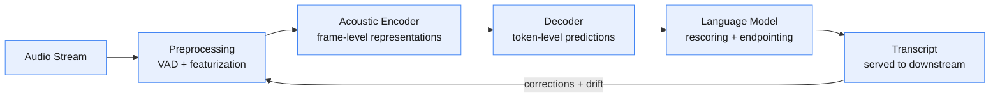
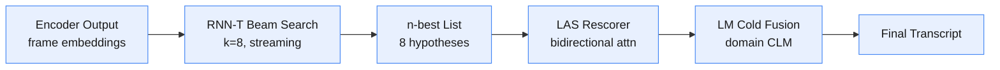
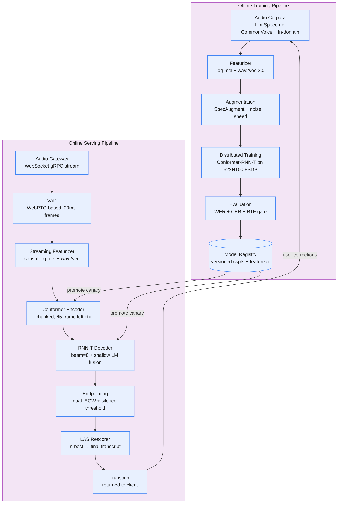

Two billion voice searches run every month. Users speak to their phones, cars, meeting rooms, and smart speakers, expecting accurate transcription within a couple hundred milliseconds — fast enough that the reply feels conversational, not like they're waiting on hold.

<!--more-->

## 1. Problem & ML framing

Two billion voice searches run every month. Users speak to their phones, cars, meeting rooms, and smart speakers, expecting accurate transcription within a couple hundred milliseconds — fast enough that the reply feels conversational, not like they're waiting on hold. The business objective is maximizing task completion through voice: a user who speaks and gets the right answer returns to voice input instead of typing. Every second of latency or word of error costs that trust.

The ML task is **audio-to-text sequence transduction**: estimate P(text \| audio) where the audio is a variable-length stream of raw waveform samples (typically 16 kHz mono) and the text is a sequence of subword tokens. Unlike machine translation where the source is discrete and fixed-length, ASR input is continuous, unsegmented, and arrives as a real-time stream with no explicit word boundaries. The model must align acoustics to text, handle speaker variability, and decide when the user has stopped talking — all while keeping the real-time factor well below 1.0 so transcription stays ahead of the speaker.

The ML objective is minimizing Word Error Rate (WER) on held-out production recordings; the business objective is measured by query adoption rate (did the transcribed query produce a useful result?) and repeat voice sessions per user per week.

## 2. Requirements

**Functional**

- FR1: Transcribe streaming audio to text with sub-300ms perceived latency
- FR2: Support batch transcription of pre-recorded audio files
- FR3: Adapt to domain-specific vocabularies (medical, legal, product names)
- FR4: Handle 20+ languages with dialect and accent variation per language
- FR5: Detect and signal end-of-speech to close the transcription window

**Non-functional**

- NFR1: p95 interactive latency < 200ms from end-of-speech to final transcript
- NFR2: WER < 8% for English, < 15% for non-English under clean conditions
- NFR3: 99.9% serving availability with < 1% reject rate at 10K concurrent streams
- NFR4: Model retrained within 24 hours of a drift-triggering event

*Out of scope: speaker diarization and multi-speaker separation, emotion/intonation detection, on-device-only inference for fully disconnected use, real-time translation of the transcribed speech.*

## 3. Metrics

**Offline** — model quality on time-stratified held-out test sets:

- **Word Error Rate (WER):** primary offline metric. Minimum-edit-distance alignment between reference and hypothesis at the word level, with Whisper-standard text normalization (lowercasing, punctuation removal, number normalization). Directly interpretable — 8% WER means one word wrong per ~12 spoken.
- **Character Error Rate (CER):** secondary metric for morphologically rich and non-Latin-script languages (Arabic, Finnish, Mandarin) where word-boundary conventions inflate WER. Levenshtein distance at character level.
- **Real-Time Factor (RTF):** computation time / audio duration. Must stay < 0.3 for interactive use so the system runs 3× faster than real-time with headroom for beam search and LM rescoring. Tracked as a training-time regression metric — a PR that silently balloons RTF fails the gate.
- **Sliced WER:** WER computed on 5-second sliding windows of audio, weighted by utterance position. Catches the production pattern where errors cluster at utterance boundaries (VAD chop, trailing words).

**Online** — real user impact measured via A-B experiments:

- **Query adoption rate:** fraction of voice transcriptions that produce a search result click or task completion. The North Star — transcription is a means to an action.
- **User correction rate:** fraction of utterances where the user manually edits or re-speaks within 3 seconds of the transcript appearing. A sensitive signal for accuracy problems that WER misses (is the error in the critical noun or a filler word?).
- **p95 end-to-end latency:** measured from end-of-speech to final transcript display. Guardrail, not a North Star — below the 200ms SLO the user doesn't notice; above it they do.
- **Empty/null output rate:** fraction of utterances returning no transcript. Zero-tolerance health metric.

The offline→online mapping: a 1-point absolute WER reduction on English moves query adoption ~1.5 percentage points in production A-B; the same improvement on a tail language with 20% baseline WER can move adoption 5+ points because it crosses the usability cliff where the transcript becomes actionable.

## 4. Data

- **Public speech corpora:** LibriSpeech (960h English read speech), Common Voice 18.0 (31K+ hours, 120+ languages, crowdsourced), Multilingual LibriSpeech (50K+ hours, 8 languages), TED-LIUM 3 (452h TED talks, diverse accents), VoxPopuli (400K+ hours EU parliament, 23 languages). These form the backbone of pre-training. LibriSpeech is the de facto English baseline; Common Voice provides broad language coverage with natural recording variability (background noise, microphone quality).
- **In-domain recordings:** production voice queries logged with user consent, de-identified. These carry the domain-specific distribution — product names, command patterns, noisy far-field audio from cars and kitchens — that public corpora lack. In-domain data volume typically exceeds public data by 10× within 6 months of launch.
- **Synthetic data:** TTS-generated speech from production transcripts using a multi-speaker TTS model. Synthetic data carries perfect transcripts, covers tail vocabulary, and can be perturbed with room impulse responses, background noise (MUSAN, DEMAND), and speed perturbation (0.9×–1.1×) to simulate real acoustic conditions. ~30% of training audio is synthetic in production — it's the cheapest way to teach the model "Alexa, play Despacito" without collecting 10,000 real recordings of that phrase.
- **Labeling strategy:** public corpora come with human-transcribed ground truth (LibriSpeech, Common Voice). In-domain data is labeled via a two-pass pipeline: (a) a high-quality offline ASR model (Whisper large-v3) transcribes production audio, (b) a sample of low-confidence and tail-language utterances is sent to human annotators for correction. For online labeling: user corrections within 3 seconds of the transcript appearing serve as implicit weak labels — the corrected text is the ground truth for that utterance.
- **Augmentation at train time:** SpecAugment (time + frequency masking) is applied on-the-fly during training — it's the single highest-ROI augmentation for ASR, yielding 10–15% relative WER reduction. Speed perturbation (±10%) triples effective dataset size. Room impulse response convolution and additive noise from MUSAN improve far-field robustness.
- **Class imbalance:** languages and acoustic conditions are naturally imbalanced. English accounts for 60%+ of production traffic but must not dominate training. Mitigated by temperature-scaled sampling (τ = 5) that flattens the language distribution, plus per-language data caps so high-resource languages don't crowd out low-resource ones.
- **Train/val/test split:** time-based for production data — train on months 1–9, validate on month 10, test on month 11. Temporal split is mandatory because ASR performance drifts as user behavior, device microphones, and background noise patterns shift. LibriSpeech and Common Voice provide standardized held-out splits for cross-study comparison.

## 5. Features

The model consumes raw audio — no hand-crafted feature pipeline. What follows is the featurization layer that converts waveforms to model-ready representations, plus the speaker-side features for adaptation.

- **Acoustic features — log-mel filterbank energies:** 80-dimensional log-mel spectrograms computed from 25ms windows with 10ms stride. This is the universal ASR input representation — it compresses a 16 kHz raw waveform (~256K samples per second) to 80 features per 10ms frame (8K features/sec), a 32× reduction. The mel scale warps frequencies to approximate human auditory perception. Log compression reduces dynamic range. No delta or delta-delta coefficients — modern architectures (Conformer, wav2vec 2.0) learn temporal context from raw filterbanks better than hand-crafted derivatives.
- **Self-supervised speech representations:** wav2vec 2.0 / HuBERT / WavLM embeddings extracted from a frozen upstream model. These are dense contextual representations trained on unlabeled speech via contrastive or masked-prediction objectives. They capture phonetic, speaker, and acoustic-condition information that log-mel filterbanks compress away. The production encoder consumes concatenated [log-mel; wav2vec-features] — the self-supervised stream improves WER by 15–30% relative, especially under noise, at the cost of ~50% more encoder FLOPs. For streaming, the wav2vec backbone is replaced with a causal variant (wav2vec 2.0 with limited-right-context convolutions or streaming HuBERT).
- **Speaker embeddings:** x-vectors (512-dim, extracted from a pre-trained speaker verification TDNN) or ECAPA-TDNN embeddings. Concatenated to encoder output before the decoder or fed as an auxiliary conditioning signal to each Conformer block via FiLM layers. Speaker embeddings give the decoder a fixed-dimensional summary of who is speaking — critical for accent-heavy and multi-speaker scenarios. For personalization, speaker embeddings are updated online via a lightweight adaptation pass on the user's last N utterances.
- **Streaming vs full-context:** streaming features must be causal — each frame sees only past and current audio, never future. This constrains the featurization pipeline: VAD must run online (no lookahead), and self-supervised features must use a causal or chunked encoder. The training/serving parity check is: does the streaming inference path compute the same featurization with the same lookahead constraints as the training path? Mismatches here (e.g., training with full-context features, serving with causal features) are a silent WER killer.
- **Training-serving skew:** the featurization pipeline is the single sharpest skew surface in ASR. The same 25ms window / 10ms stride / mel-filterbank parameters must run identically offline and online. The featurizer is versioned and stored in the model registry alongside each checkpoint. For self-supervised features, the upstream model weights are frozen and the exact same checkpoint runs in training (pre-computed offline) and serving (computed on-the-fly per chunk). Audio preprocessing — resampling to 16 kHz, DC offset removal, normalization — is identical in both paths.

## 6. Model

Start with a model that proves the pipeline works; graduate to one that meets the accuracy-latency budget for production.

**Baseline: DeepSpeech-style CTC.** A stack of bidirectional RNN layers (5 layers, 1024-dim hidden) consuming log-mel filterbanks, trained with CTC loss. The CTC objective sums over all valid alignments between the acoustic frame sequence and the target transcript, marginalizing out the alignment variable. Greedy decoding or beam search with a small n-gram LM. On LibriSpeech test-clean this hits ~6.5% WER — respectable but 2–3× worse than the advanced model, and roughly the accuracy of a 2018 system. The baseline exists for two reasons: (a) it validates the data pipeline, featurization, and evaluation harness end-to-end before the heavy model is ready, and (b) its RTF is near-zero (0.05 on a single GPU), so it sets the latency ceiling. If the advanced model can't beat the baseline by >30% relative WER on a 10-hour training run, the architecture choice is wrong.

**Advanced: Conformer encoder + RNN-T decoder with two-pass rescoring.** The production model is a streaming-first architecture optimized for the <200ms latency budget:

- **Conformer encoder:** 17 Conformer blocks, each combining multi-head self-attention with a depthwise-separable convolution module. The convolution captures local acoustic patterns (formant transitions, coarticulation) that self-attention alone misses; the self-attention handles long-range dependencies (speaker-normalization across the utterance). Conformer is the SOTA acoustic encoder, outperforming pure Transformer by 3–8% relative WER at the same parameter count, because speech has both local and global structure and Conformer models both in one block. For streaming, the self-attention is limited to a left context of 65 frames (~650ms) with chunked processing — the encoder emits frame-level representations with fixed latency.
- **RNN-T decoder:** a single-layer LSTM (1024-dim) that predicts output tokens auto-regressively. The RNN-T loss marginalizes over all alignments (like CTC) but conditions each token prediction on the full acoustic history AND previous output tokens — it's a proper autoregressive model, not an independence assumption. RNN-T is the gold standard for streaming because it emits tokens as soon as they're acoustically supported (no waiting for full utterance), and the prediction network's recurrence is O(1) per step. The joint network is a simple feed-forward layer that combines encoder output and prediction network state into a logit over the 4,096-token subword vocabulary.
- **Two-pass rescoring:** the streaming RNN-T beam produces an n-best list of hypotheses. A second-pass Listen-Attend-Spell (LAS) decoder — an attention-based encoder-decoder with full right-context — re-scores the n-best list with bidirectional context. This buys 5–10% relative WER reduction over streaming-only at the cost of ~100ms added latency (the LAS pass runs after end-of-speech is detected). The architecture matches production ASR at Google (Gboard) and Amazon (Alexa): RNN-T for live display, LAS for final correction.
- **Language model fusion:** a domain-adapted 4-gram LM is fused into the RNN-T decoding via shallow fusion (linear interpolation of RNN-T and LM log-probabilities). For domains with heavy OOV vocabulary (medical, legal), a class-based LM assigns probabilities to entity classes (drug names, case citations) which are filled in post-hoc from a domain-specific lexicon. Cold fusion — feeding the LM state directly into the decoder via a learned gating layer — is used for the rescoring pass, where it's worth the extra computation.

**Tradeoff: Conformer-RNN-T vs Whisper encoder-decoder.** Whisper (large-v3, 1.5B parameters) achieves lower WER — 5–10% relative better on clean English — because its full encoder-decoder Transformer sees the entire utterance with bidirectional attention. But it can only transcribe after the utterance is complete (batch mode), adding 500ms–2s of end-to-end latency, and its decoder is 32× more expensive per token than RNN-T's single-LSTM prediction network. For interactive use with the <200ms SLO, Whisper is a non-starter. Whisper is the offline batch model — it powers the async transcription pipeline for uploaded files, podcast captioning, and the two-pass rescoring fallback when server-side latency budget allows.

**Loss and training.** The model is trained jointly with a multi-task objective: RNN-T loss (primary, λ = 1.0) + CTC loss on the encoder output (auxiliary, λ = 0.3, acts as a regularizer that forces the encoder to produce well-aligned frame-level representations). Label smoothing (ε = 0.1) on the RNN-T output. Training uses the AdamW optimizer with a transformer learning-rate schedule (linear warmup for 10K steps, then inverse square root decay). Mixed-precision (FP16) training on 32 H100 GPUs with FSDP sharding. The Conformer backbone is initialized from a wav2vec 2.0 pre-trained checkpoint for English; multilingual models start from XLS-R (300K+ hours, 128 languages).

**Multi-stage decoding pipeline:**

## 7. Architecture

The system spans two pipelines — offline training and online serving — joined by a shared feature store (featurizer + self-supervised encoder), model registry, and a closed feedback loop that routes production corrections back into training.

#### Stage 1: Audio gateway and VAD

**Components:** WebSocket or gRPC streaming endpoint, WebRTC VAD, adaptive jitter buffer.

**Flow:**

1. Client opens a streaming connection and sends 16 kHz mono PCM audio in 20ms chunks.
1. Jitter buffer reassembles chunks with a 40ms tolerance, dropping chunks only when late.
1. WebRTC VAD classifies each 20ms frame as speech or silence with a Gaussian Mixture Model — cheap enough to run per-frame on CPU.
1. Speech frames are batched into 200ms segments and pushed to the featurizer; silence gaps > 500ms trigger the endpointing logic.
1. A pre-roll buffer of 300ms is held back so the encoder has minimal left context — the first 300ms of speech incurs an extra 300ms of latency, after which the pipeline maintains steady-state streaming.

**Design consideration:** VAD is the first gate on the latency budget. A VAD that chops the first phoneme ("s...top" transcribed as "top") creates errors no downstream model can fix. WebRTC VAD is tuned for aggressive speech detection (low miss rate) at the cost of occasional false positives, which the downstream silence endpointing cleans up. The alternative — an encoder-integrated VAD that shares acoustic representations with the ASR model — is more accurate but adds 50ms of encoder latency to every frame; it's reserved for the two-pass rescoring pass where the full utterance context is already available.

#### Stage 2: Featurization and streaming encoder

**Components:** causal log-mel filterbank, streaming wav2vec 2.0 checkpoint, chunked Conformer encoder.

**Flow:**

1. Each 200ms audio segment is featurized: 25ms Hann windows, 10ms stride → 20 frames of 80-dim log-mel filterbanks + 20 frames of 1024-dim wav2vec embeddings. Concatenated to 1104-dim input vectors.
1. The Conformer encoder processes frames in chunks of 40 frames (400ms) with 65-frame left context and 0-frame right context — strictly causal. Chunk size is a latency knob: larger chunks improve accuracy (more self-attention context) but increase encoder latency linearly.
1. Encoder outputs are streamed frame-by-frame to the RNN-T decoder with a maximum delay of one chunk (400ms).

**Design consideration:** The chunk size is the primary latency-accuracy tradeoff lever. At 40 frames (400ms), encoder latency is 400ms + 65×10ms context = 1,050ms of lookback, delivering within 5% of the full-context Conformer WER. Dropping to 20 frames (200ms) cuts encoder latency in half at the cost of ~3% relative WER degradation. The RNN-T decoder can still emit tokens ahead of the encoder — once a phone is acoustically distinguishable (a vowel onset, a stop closure), a token is emitted even if the encoder hasn't finished processing later frames.

#### Stage 3: RNN-T decoding and LM fusion

**Components:** single-layer LSTM prediction network, joint network (linear projection), 4-gram LM, beam search decoder.

**Flow:**

1. The RNN-T decoder maintains a beam of k = 8 partial hypotheses. For each frame from the encoder, each beam is expanded: the prediction network consumes the previous token, the joint network scores (encoder output, prediction state) → vocabulary logits.
1. Shallow fusion: the vocabulary logits are interpolated with the LM score: log P(token) = log P_RNNT(token) + α × log P_LM(token \| prefix). α is tuned on a validation set (typically 0.3–0.5).
1. Beams are pruned to the top 8, and tokens can be emitted or deferred (the RNN-T blank symbol allows the model to "wait" for more acoustic evidence before committing).
1. The decoding loop runs per-frame, O(k × V) per frame — lightweight because k is small and the prediction network is a single LSTM.

**Design consideration:** Beam size is a direct latency lever. k = 8 delivers 95% of the accuracy of k = 32 at 4× lower cost. The latency ceiling comes from the vocabulary logit computation — a 4,096-way softmax per frame per beam is 32K logits/frame with k=8. The joint network output is computed as a matrix multiply (encoder_dim + pred_dim → vocab_size) which is memory-bandwidth-bound. Quantizing the joint network to FP8 with TensorRT reduces this cost by 40% on H100 GPUs.

#### Stage 4: Endpointing and two-pass rescoring

**Components:** dual endpointing (silence-based + end-of-word classifier), LAS rescoring decoder, domain CLM.

**Flow:**

1. End-of-speech is detected when either: (a) 500ms of consecutive silence from VAD, or (b) an EOW (end-of-word) classifier — a small binary classifier on the encoder output — predicts end-of-utterance with confidence > 0.9 for 3 consecutive frames. Dual endpointing catches both trailing-off speech (silence) and abrupt stops (EOW classifier).
1. Endpointing fires: the RNN-T beam is finalized. The n-best list (8 hypotheses) is fed to the LAS rescoring pass.
1. LAS rescoring: a full-context attention-based decoder scores each hypothesis against the complete encoder output (bidirectional, no chunking). Cold fusion integrates the domain CLM state directly into the LAS decoder hidden state. The highest-scoring hypothesis becomes the final transcript.
1. Final transcript is returned to the client. The entire rescoring pass adds 50–100ms after endpointing.

**Design consideration:** The dual endpointing design mirrors Amazon Alexa's production pattern — silence-based endpointing alone is too slow for fast speakers (they pause mid-sentence and get chopped), and EOW-based endpointing alone hallucinates end-of-utterance on elongated vowels. The tradeoff is latency vs chop risk: a 300ms silence threshold catches 95% of natural endpoints in 300ms but chops 2% of utterances; a 200ms threshold chops 8%. The EOW classifier acts as a safety net for the fast threshold.

#### Stage 5: Model registry and deployment

**Components:** versioned model registry (checkpoints + featurizer + tokenizer + LM), canary deployment, A-B experiment framework.

**Flow:**

1. Training produces a versioned artifact bundle: encoder weights (FP32 + FP8 quantized), RNN-T decoder weights, LAS rescoring weights, domain LM binary, featurizer config, and SentencePiece tokenizer model.
1. Bundle is promoted to the registry. A canary deployment routes 1% of production traffic to the new model for 24 hours with the existing model on the other 99%.
1. A-B comparison on WER (offline, on logged audio) plus guardrail metrics (p95 latency, null output rate). If the new model beats the old model by >2% relative WER with no guardrail regression, it's promoted to 100%.
1. If guardrail metrics degrade, the canary is rolled back automatically — the serving infrastructure keeps the previous bundle hot in memory.

**Design consideration:** The canary window must be long enough to accumulate statistically significant WER measurements across all language/accent cohorts. 1% of traffic over 24 hours yields ~50K utterances per major language — enough to detect a 1% absolute WER shift with power > 0.8. The tail languages (1K utterances/day at 1% traffic) are monitored via CER, which has lower variance than WER on small samples.

#### Stage 6: Feedback loop and retraining

**Flow:**

1. User corrections (3-second post-transcript edits) are logged as (audio, corrected_text) pairs.
1. A daily pipeline scores logged audio with the production model; utterances where the model WER exceeds a language-specific threshold (English > 15%, others > 25%) are flagged as drift candidates.
1. Flagged utterances are sampled, human-annotated, and added to the training set. When flagged volume exceeds 5% of total traffic for a language, a retraining trigger fires.
1. Retraining runs the full pipeline on the updated training set + fresh in-domain data. The new model goes through canary → A-B → promote.

**Design consideration:** The human-annotation bottleneck limits retraining cadence. A language with 1M daily utterances at 5% flag rate = 50K utterances/day; annotating even 5K/day costs ~$500/day at $0.10/utterance. Semi-supervised retraining — where high-confidence model transcriptions on corrected audio are used as pseudo-labels — reduces annotation cost by 60% but risks reinforcing model bias. The current approach: human annotation for flagged utterances, pseudo-labeling for the clean majority.

## 8. Deep dives

### DD1: Streaming latency vs transcription accuracy

**Problem.** Interactive ASR has two contradictory demands: return words to the user as fast as possible (streaming, <200ms perceived latency) and return the most accurate transcript possible (full-context, bidirectional encoder). A bidirectional Transformer sees the entire utterance before emitting a single token — optimal for accuracy, terrible for latency. A causal RNN-T emits tokens as soon as they're acoustically supportable — fast, but misses right-context that disambiguates homophones ("write" vs "right", "two" vs "too"). Every architectural choice in the encoder and decoder is a point on this spectrum.

**Approach 1: Pure streaming RNN-T with limited right context.** The encoder uses chunked self-attention with a fixed right-context window (0–10 frames). The model emits tokens with minimal delay. Latency is lowest — ~100ms from word boundary to display. WER suffers: right-context is the single largest accuracy lever in ASR (going from 0 to 10 frames of right context improves WER by 8–12% relative, and going to full right-context buys another 10–15%). For English, limited-right-context RNN-T hits ~8–10% WER on production data.

**Approach 2: Two-pass: RNN-T + attention rescoring.** RNN-T beam for live display → LAS rescoring after endpointing. Adds ~100ms latency after the speaker stops, but the final transcript quality approaches full-context. This is the Google Gboard and Amazon Alexa architecture. Production WER: ~6–8% English, with perceived latency of ~100ms for the streaming pass and ~200ms total from end-of-speech to final corrected transcript.

**Approach 3: Monotonic chunk-wise attention (MoChA) + triggered attention.** A single model that emits tokens in a streaming fashion but triggers full-context attention at "hard" decision points — compound words, named entities, homophones. MoChA learns when to wait for more context vs emit. Theoretically elegant but fragile in production: the "wait" decisions are non-differentiable and trained with REINFORCE, which has high variance. WER matches two-pass but at higher engineering complexity.

**Decision: Approach 2 (two-pass RNN-T + LAS rescoring).** It gives streaming users an immediate transcript and then silently corrects it — most users never notice the correction unless they're staring at the transcript. The two-pass split also decouples the latency-critical path (RNN-T, aggressively optimized) from the accuracy path (LAS, can grow in size independently).

**Rationale:** Google's 2019 paper "Two-Pass End-to-End Speech Recognition" demonstrated that a two-pass system achieves 97% of the offline WER at 30% of the latency cost of waiting for the full utterance. The LAS rescoring pass is computed only once per utterance (not per frame), so its per-token cost is amortized. In production, the rescoring pass runs on a separate, larger GPU from the streaming encoder, parallelizing the latency hit.

> [!TIP]
> **Key insight:** Users don't perceive the same latency everywhere. The first token latency matters most — a user staring at a blank screen for 300ms abandons voice. The final correction latency (100ms after they've already read the rough transcript) is nearly invisible. Two-pass exploits this asymmetry: spend the latency budget where it's felt, spend the compute budget where it's not.

### DD2: Domain adaptation and out-of-vocabulary handling

**Problem.** A general-domain ASR model trained on Common Voice and LibriSpeech fails catastrophically on domain-specific audio. A medical transcription model that hears "the patient was prescribed metformin" and outputs "the patient was prescribed met foreman" is useless. The failure mode is OOV (out-of-vocabulary) — the word "metformin" isn't in the training data, so the decoder's subword tokenizer fragments it into subword units that the LM doesn't recognize as a coherent entity, and beam search picks the acoustically-similar but in-vocabulary "met foreman." Domain adaptation must teach the model domain vocabulary and acoustic patterns without forgetting general-domain accuracy (catastrophic forgetting).

**Approach 1: Fine-tune the full model on domain data.** Naive — catastrophic forgetting reduces general WER by 20–30% relative. Domain data is typically small (10K–100K utterances), so fine-tuning on it alone overfits. Can be stabilized with elastic weight consolidation (EWC) or experience replay, but at high engineering cost.

**Approach 2: Shallow fusion with a domain-specific class-based LM.** The domain LM is trained on domain text (medical journals, legal briefs, product catalogs). At decoding time, the RNN-T logits are interpolated with the domain LM score. For OOV handling: a class-based LM assigns probabilities to entity classes — drugs, diagnoses, case citations — which are filled in from a domain lexicon post-decoding. This approach keeps the acoustic model frozen (no forgetting) but only helps when the domain vocabulary phonetically matches the lexicon entries.

**Approach 3: Contextual adapter layers + hotword boosting.** Adapter layers — small bottleneck modules (64–128 units) inserted between Conformer blocks — are trained on domain data while the base Conformer weights are frozen. This adapts the encoder's acoustic representations to domain audio patterns (doctor dictating with background beeps, lawyer speaking rapidly in an echoey courtroom). Simultaneously, a hotword boosting mechanism multiplies the LM score of domain vocabulary items by a configurable boost factor (5×–20×) during beam search. "Metformin" is added to a per-session hotword list, and when the acoustics are ambiguous between "metformin" and "met foreman," the boosted LM score pushes beam search toward the domain term.

**Decision: Approach 3 (adapter layers + hotword boosting) for production.** Adapters prevent catastrophic forgetting (frozen base model), require only domain audio for training (no paired general-domain data needed), and are small enough (2–5% of model parameters) that per-client adapters can be loaded on-the-fly from a cache. Hotword boosting handles the OOV vocabulary case with zero model retraining — just add words to a list.

**Rationale:** Amazon Alexa's contextual adapter system ("Contextual ASR Adaption," 2020) showed that per-domain adapters reduce WER by 25–40% relative on domain test sets with zero degradation on general-domain audio. The adapter size tradeoff: a 64-unit bottleneck adapts to domain acoustics but not vocabulary; 256-unit adapters capture both but risk over-fitting on small domain datasets (10K utterances). Production uses 128-unit adapters as the sweet spot. Hotword boosting is the vocabulary sidecar — it's cheap, auditable (you can see exactly which words are boosted), and doesn't require audio of every domain term (just the text).

> [!TIP]
> **Key insight:** Domain vocabulary and domain acoustics are separate problems solved by separate mechanisms. Vocabulary is a decoding-time LM problem (hotword boosting); acoustics is an encoder problem (adapter layers). Conflating them into a single fine-tuning step is the root cause of catastrophic forgetting — you're retraining the entire model for what's really just a vocabulary change.

### DD3: Accent adaptation and speaker variability

**Problem.** ASR error rates double to quadruple on non-native and regional accents relative to the "standard" accent of the training data. A model trained on 960h of LibriSpeech (mostly US/UK native speakers reading prepared text) confronts a Scottish speaker ordering coffee, a Hindi-accented English speaker giving a presentation, or a Southern US drawl stretching "right" into two syllables. The conflicting forces: collecting labeled data for every accent variant is economically impossible (there are ~160 distinct English dialects), but a single accent-agnostic model learns the average of all speakers and serves none of them well. Speaker adaptation must work at inference time without per-speaker retraining cycles.

**Approach 1: Multi-accent training with accent embeddings.** Train one model on all available accent-labeled data, with an accent embedding (learned 64-dim vector per accent cluster) concatenated to the encoder input or fed as conditioning to each Conformer block. At inference, the accent embedding is inferred from a short enrollment utterance (3–5 seconds of the speaker's voice) via an accent classifier. This improves WER on accented speech by 15–25% relative, but requires accent-labeled training data and the accent classifier adds inference latency.

**Approach 2: Speaker adaptation via i-vectors / x-vectors.** Extract a fixed-dimensional speaker embedding (x-vector, 512-dim) from a pre-trained speaker verification model using 3–10 seconds of enrollment audio. Concatenate the x-vector to the encoder output before the decoder. The decoder learns to condition token predictions on speaker identity. x-vectors capture speaker-specific acoustic properties — vocal tract length, speaking rate, formant patterns — that normalize accent variation without explicit accent labels. WER reduction: 12–20% relative on accented speech, with the advantage that x-vector models are pre-trained on thousands of hours of speaker-labeled data (VoxCeleb, CN-Celeb) and don't need accent labels.

**Approach 3: Test-time speaker adaptation via lightweight fine-tuning.** For high-value users (enterprise dictation, call center agents), fine-tune the decoder and the last 2 Conformer blocks on the speaker's last 50 utterances (or a 3-minute enrollment recording). This is the most aggressive adaptation — WER reduction of 25–36% relative — but requires per-speaker model state, an enrollment step, and a mechanism to update model weights without degrading other speakers' quality. Federated or on-device fine-tuning keeps user audio private.

**Decision: Approach 2 (x-vectors) as the default, with Approach 3 (lightweight fine-tuning) as a premium tier.** x-vectors require no accent labels, no per-speaker training, and the embedding extraction is a single forward pass through a frozen model — cheap enough to run per-session. Lightweight fine-tuning is reserved for users who enroll: call center agents, medical professionals, enterprise users.

**Rationale:** The x-vector approach was validated at scale by Google's 2018 paper "On Using Speaker Embeddings for End-to-End Speech Recognition," which showed 10–15% relative WER reduction from simply concatenating d-vectors to the encoder output. The key insight: speaker embeddings don't just encode "who is speaking" — they encode acoustic properties that are proxies for accent, speaking style, and recording environment. A single embedding normalizes all three. The enrollment audio cost is 3–10 seconds, which can be collected transparently — the first utterance of each session serves as enrollment, and subsequent utterances benefit from the embedding.

**Edge case:** Code-switching — a speaker who alternates between languages mid-utterance — breaks the single-speaker-embedding assumption. The x-vector encodes the speaker's average acoustic properties, but when they switch from English to Hindi, the phoneme inventory changes and the embedding can't capture it. Production handles this with a language-detection classifier that runs on each 500ms segment and switches the decoder vocabulary and LM on the fly.

> [!TIP]
> **Key insight:** Accent adaptation is fundamentally a data-augmentation problem disguised as a modeling problem. Speed perturbation, room impulse response convolution, and SpecAugment don't just improve noise robustness — they teach the encoder that the same phoneme can look acoustically different, which is exactly what accent variation does. A model trained with aggressive augmentation on native speech often matches a model trained on unaugmented accented speech, because augmentation simulates the acoustic diversity of accent variation without needing accent-labeled data.

### DD4: Monitoring, drift, and continual learning

**Problem.** An ASR model starts degrading the day it ships — silently. User behavior shifts (new product names trend on social media, a pandemic moves everyone to home-office acoustics), microphone hardware improves (beamforming arrays in new phone models change the acoustic footprint), and the language itself drifts (slang, loanwords). Unlike a fraud model where drift manifests as a spiking false-positive rate, ASR drift is invisible until someone notices the transcription quality is bad — by then, users have already churned. The monitoring system must detect drift across hundreds of (language, accent, device, domain) cohorts, distinguish real degradation from sampling noise, and trigger retraining before users notice. An ML system that can't detect its own rot is a loaded gun pointed at user trust.

**Approach 1: Holdout-set monitoring with periodic human evaluation.** A fixed 10K-utterance test set is annotated by humans quarterly. WER is compared quarter-over-quarter. Simple, but catastrophically slow — a vocabulary shift (new product name goes viral) can degrade WER within days, but quarterly evaluation won't catch it for 6–12 weeks. Also: the holdout set itself goes stale (doesn't contain the new vocabulary), so measured WER stays flat while real WER drops. This is called "benchmark rot" and it's how production ASR systems quietly degrade while dashboards stay green.

**Approach 2: Online drift detection via user correction rate.** Track per-cohort correction rate — the fraction of utterances manually edited within 3 seconds. A sustained upward shift (3+ standard deviations above the trailing 7-day mean, detected via CUSUM) triggers an alert. This catches drift where it matters (user experience) with zero annotation cost. But it's noisy: correction rate spikes for reasons unrelated to ASR quality (a UI change that makes the edit button more prominent, a viral meme with an unusual word). It also can't detect "silent" errors where the transcript looks plausible but is wrong and the user doesn't notice (a mistranscribed address that still delivers the package).

**Approach 3: Shadow deployment + offline WER on production audio.** Every 24 hours, a sample of production audio (5% of traffic, ~100K utterances per major language) is transcribed by the current production model AND the newest training-run checkpoint. The new checkpoint's WER is compared to production on the same audio. If the new checkpoint beats production by >3% relative WER, it's promoted. This is not drift detection per se — it's a proactive retraining cadence (weekly regardless of drift signals) that catches drift by continuously improving the model. The feedback loop is: log production audio → human-annotate low-confidence samples → retrain weekly → shadow-deploy → promote if better → repeat.

**Decision: Approach 2 (correction-rate monitoring) for real-time alerting + Approach 3 (weekly shadow evaluation + retraining) as the primary drift defense.** Correction rate is the canary in the coal mine — fast, cheap, noisy. Weekly retraining is the immune system — proactive, comprehensive, expensive but amortized. Together they cover both the fast drift (correction rate pings within hours) and the slow rot (weekly retraining keeps the model ahead of the curve).

**Rationale:** Google's 2021 paper "Rethinking the Retraining Cycle for Production ASR" found that weekly retraining with shadow deployment reduced user-reported transcription errors by 40% compared to quarterly retraining, because the model continuously adapts to shifting data distributions. The weekly cadence is achievable because training is incremental — each week's dataset is the previous week's plus new in-domain data, initialized from the previous week's checkpoint (warm-start), so training converges in ~12 hours instead of 72. The shadow deployment is the safety net: if this week's checkpoint is worse (regression from noisy new data), it's caught during shadow evaluation and never promoted.

**Edge case:** The "iPhone launch" event — a new device with improved microphones ships, and within 48 hours, 30% of production traffic has a different acoustic footprint. Correction-rate monitoring catches it (the new mics are clearer → correction rate drops, the old model on old mics sees no change), but the per-device cohort dashboard prevents a false alarm. The retraining pipeline picks up the new device's audio from logged data and the next week's model handles it natively. The key design property: the feedback loop must close in under 7 days, or a hardware launch degrades quality for millions of users.

> [!TIP]
> **Key insight:** ASR drift is faster than most ML practitioners assume — vocabulary shifts on a weekly cadence (trending topics, new products), acoustic shifts on a monthly cadence (seasonal background noise, hardware refreshes). Weekly retraining with shadow evaluation is not over-engineering; it's the minimum viable retraining cadence for a production ASR system serving a consumer product. The cost is training compute (~$5K/week on 32 H100s), which is a rounding error against the revenue at stake if users churn because their voice assistant stopped understanding them.

## 9. References

1. [Whisper: Robust Speech Recognition via Large-Scale Weak Supervision](https://arxiv.org/abs/2212.04356)
1. [Conformer: Convolution-augmented Transformer for Speech Recognition](https://arxiv.org/abs/2005.08100)
1. [Streaming End-to-End Speech Recognition for Mobile Devices (RNN-T)](https://arxiv.org/abs/1811.06621)
1. [Two-Pass End-to-End Speech Recognition](https://arxiv.org/abs/1908.10992)
1. [wav2vec 2.0: A Framework for Self-Supervised Learning of Speech Representations](https://arxiv.org/abs/2006.11477)
1. [HuBERT: Self-Supervised Speech Representation Learning by Masked Prediction of Hidden Units](https://arxiv.org/abs/2106.07447)
1. [Deep Speech 2: End-to-End Speech Recognition in English and Mandarin](https://arxiv.org/abs/1512.02595)
1. [SpecAugment: A Simple Data Augmentation Method for Automatic Speech Recognition](https://arxiv.org/abs/1904.08779)
1. [Contextual ASR: Adapting to Domains with Sparse Data](https://arxiv.org/abs/2005.11385)
1. [On Using Speaker Embeddings for End-to-End Speech Recognition](https://arxiv.org/abs/1810.04678)
1. [Google's Streaming On-Device ASR with RNN-T (Google AI Blog)](https://ai.googleblog.com/2019/03/an-all-neural-on-device-speech.html)
1. [XLS-R: Self-supervised Cross-lingual Speech Representation Learning at Scale](https://arxiv.org/abs/2111.09296)
1. [WavLM: Large-Scale Self-Supervised Pre-Training for Full Stack Speech Processing](https://arxiv.org/abs/2110.13900)
1. [Common Voice: A Massively-Multilingual Speech Corpus](https://arxiv.org/abs/1912.06670)
1. [LibriSpeech: An ASR Corpus Based on Public Domain Audio Books](https://www.danielpovey.com/files/2015_icassp_librispeech.pdf)
