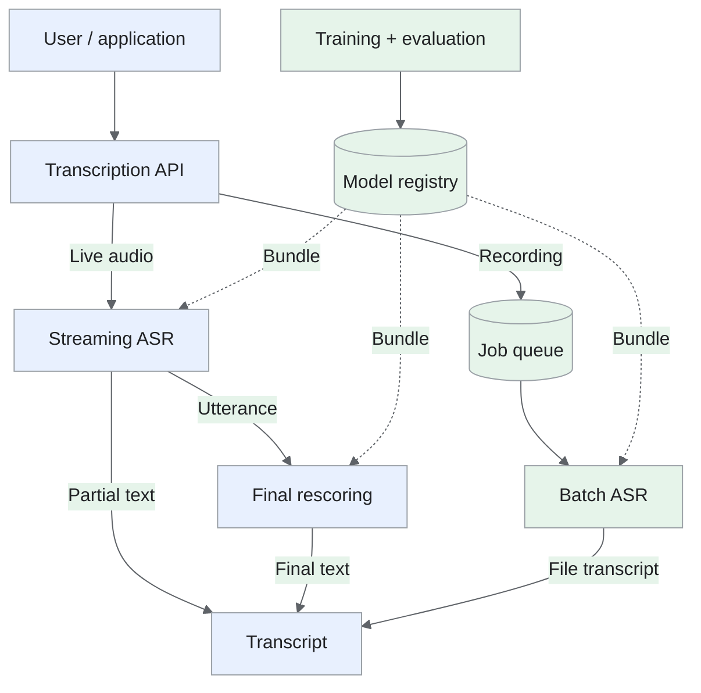
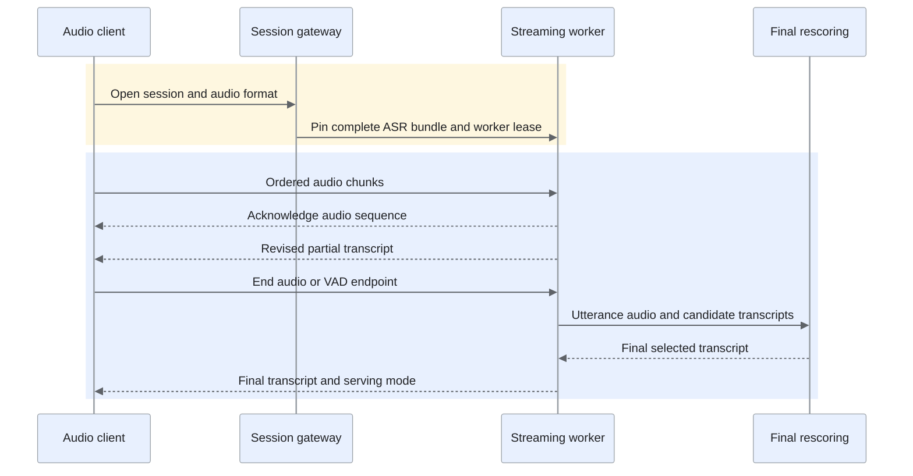
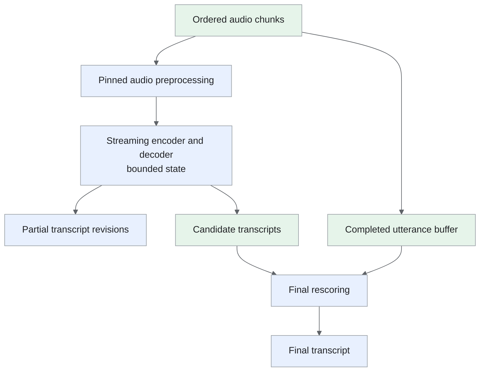

A speech-recognition service for live audio and uploaded recordings, with partial transcripts during speech and a final transcript when an utterance ends.

<!--more-->

## Problem

Users expect a voice interface to respond while they are speaking. An uploaded recording has a different requirement: the service can use the complete audio to produce a more accurate transcript.
We provide both through a shared audio-processing pipeline. Live recognition uses a streaming model; a second pass refines the transcript after the service detects the end of an utterance.

## Requirements

### Functional requirements

- **Transcribe live audio.** Show partial text during speech and return a final transcript for each utterance.

- **Transcribe recordings.** Accept an audio file and return text with word timestamps.

- **Support multiple languages.** Cover at least 20 approved languages and common recording conditions.

- **Recognize domain vocabulary.** Accept a bounded list of relevant names or terms.

- **Manage sessions.** Support cancellation, end-of-audio signals and reconnects within a bounded replay window.

- **Collect corrections.** Let users report transcription errors for reviewed evaluation and training.

Speaker identification, voice synthesis and translation are outside this design.

### Non-functional requirements

- **Latency:** target first partial text within 300ms of usable speech; target p95 finalization below 200ms after endpoint detection.

- **Endpointing:** begin with a 500ms silence threshold and measure the resulting speech-end-to-final delay separately.

- **Quality:** target word error rate below 8% for clean English speech and below 15% for other approved languages, on fixed evaluation sets.

- **Scale:** serve 10K concurrent live streams with admission rejection below 1% at the planned workload.

- **Throughput:** target a real-time factor below 0.3 for batch transcription; one minute of audio takes less than 18 seconds of processing.

- **Availability:** target 99.9%; an interrupted stream returns an explicit recovery outcome.

- **Freshness:** prepare routine candidates weekly and a drift-triggered candidate within 24 hours; promotion depends on its evaluation gates.

- **Privacy:** retain raw audio only under the user's consent and retention policy.

## Back-of-the-envelope calculations

- Assuming 2B utterances/month, the average arrival rate is about **770 utterances/s**. At an average duration of 10 seconds, Little's law gives roughly **7,700 concurrent streams**. The 10K-stream target therefore needs a separate burst and failure-capacity plan.

- Mono 16kHz, 16-bit PCM uses **32KB/s**. Ten thousand active streams produce about **320MB/s** of audio payload before protocol overhead.

- A 20ms audio chunk contains 640 bytes. Feature extraction with a 25ms window and 10ms stride produces about 100 feature frames/s; the model may process several transport chunks together.

- GPU capacity is measured with active streams, encoder lookahead, decoding beam and final-pass work included. Real-time factor alone does not establish concurrency or tail latency.

## Core entities

- **RecognitionSession** owns the live stream and pins its model bundle.

- **AudioChunk** carries ordered audio; sequence numbers let a reconnect replay only unprocessed chunks.

- **Transcript** is a revision of the current utterance, including its final state.

- **TranscriptionJob** represents an uploaded recording.

- **ASRBundle** versions the acoustic model, tokenizer and audio preprocessing.

```protobuf
message RecognitionSession {
  string session_id;
  string user_id;
  string language;
  string model_bundle;
  repeated string hotwords;
  int64 last_processed_sequence;
}

message AudioChunk {
  string session_id;
  int64 sequence;
  bytes pcm_audio;
  int64 audio_start_ms;
}

message Transcript {
  string utterance_id;
  int64 revision;
  string text;
  bool is_final;
  repeated Word words;
}

message Word {
  string text;
  int64 start_ms;
  int64 end_ms;
}

message TranscriptionJob {
  string job_id;
  string user_id;
  string audio_uri;
  string status;           // Queued, running, completed, failed
  string model_bundle;
}

message ASRBundle {
  string bundle_id;
  string model_uri;
  string tokenizer_uri;
  string preprocessing_version;
  repeated string languages;
}

```
## API

```yaml
live_transcription:
  transport: WebSocket
  path: /v1/transcriptions/stream
  start:
    language: en
    sample_rate_hz: 16000
    encoding: pcm_s16le
    hotwords: [VoiceMatch]
  audio_frame:
    header: [sequence, audio_start_ms]
    payload: binary PCM
  server_events:
    - ready: {session_id: asr_123, model_bundle: asr_v7}
    - acknowledged: {last_processed_sequence: 42}
    - transcript: {utterance_id: u1, revision: 3, text: "hello", is_final: false}
    - transcript: {utterance_id: u1, revision: 4, text: "hello world", is_final: true}
  controls: [end_audio, cancel, resume]

batch_transcription:
  method: POST
  path: /v1/transcriptions
  input: audio file, language, idempotency key
  response: {job_id: job_123, status: queued}
  result: GET /v1/transcriptions/{job_id}

```
## High-level design

The live path extracts audio features and runs a streaming Conformer encoder with an RNN-T decoder. RNN-T generates text as audio arrives. A final rescoring pass uses the completed utterance to choose the final transcript.
Uploaded recordings run through a queued batch path. Both paths load versioned bundles and feed a separate evaluation and training workflow.


```mermaid
%%{init: {'theme':'base','themeVariables':{'primaryColor':'#e8f0fe','primaryTextColor':'#202124','primaryBorderColor':'#9aa0a6','lineColor':'#5f6368','secondaryColor':'#e6f4ea','tertiaryColor':'#fef7e0','actorBkg':'#e8f0fe','actorBorder':'#9aa0a6','actorTextColor':'#202124','noteBkgColor':'#fef7e0','noteTextColor':'#202124','noteBorderColor':'#9aa0a6','signalColor':'#5f6368','signalTextColor':'#202124','labelBoxBkgColor':'#fef7e0','labelBoxBorderColor':'#9aa0a6'}}}%%
flowchart TB
  U["User / application"] --> API["Transcription API"]
  API -->|"Live audio"| LIVE["Streaming ASR"]
  API -->|"Recording"| Q[("Job queue")]
  Q --> BATCH["Batch ASR"]
  LIVE -->|"Partial text"| OUT["Transcript"]
  LIVE -->|"Utterance"| FINAL["Final rescoring"]
  FINAL -->|"Final text"| OUT
  BATCH -->|"File transcript"| OUT
  TRAIN["Training + evaluation"] --> REG[("Model registry")]
  REG -.->|"Bundle"| LIVE
  REG -.->|"Bundle"| FINAL
  REG -.->|"Bundle"| BATCH
classDef request fill:#e8f0fe,stroke:#9aa0a6,color:#202124;
classDef data fill:#e6f4ea,stroke:#9aa0a6,color:#202124;
classDef control fill:#fef7e0,stroke:#9aa0a6,color:#202124;
class U,API,LIVE,OUT,FINAL request;
class Q,BATCH,TRAIN,REG data;

```
## Storage

- **[PostgreSQL](/designs/tech-postgresql/):** store batch-job state, access ownership and retained final transcripts. A conditional state transition claims each queued job; repeated delivery returns the existing result.

- **Object storage:** keep encrypted audio, training datasets, model artifacts and evaluation reports. Apply a retention deadline to each audio object.

- **[Redis](/designs/tech-redis/):** route reconnects to the session's assigned worker and store a short-lived lease. Acoustic encoder state stays in that worker's memory.

- **Durable job queue:** deliver uploaded recordings to batch workers with at-least-once delivery. Job IDs and idempotent result writes handle retries.

The live worker keeps the current utterance's audio and decoder state until finalization. Session retention and replay are bounded so a long-lived connection cannot consume unlimited memory.

## From request to response

### Live transcription flow


```mermaid
%%{init: {'theme':'base','themeVariables':{'primaryColor':'#e8f0fe','primaryTextColor':'#202124','primaryBorderColor':'#9aa0a6','lineColor':'#5f6368','secondaryColor':'#e6f4ea','tertiaryColor':'#fef7e0','actorBkg':'#e8f0fe','actorBorder':'#9aa0a6','actorTextColor':'#202124','noteBkgColor':'#fef7e0','noteTextColor':'#202124','noteBorderColor':'#9aa0a6','signalColor':'#5f6368','signalTextColor':'#202124','labelBoxBkgColor':'#fef7e0','labelBoxBorderColor':'#9aa0a6'}}}%%
sequenceDiagram
  participant U as Audio client
  participant G as Session gateway
  participant S as Streaming worker
  participant F as Final rescoring
  rect rgb(254, 247, 224)
    U->>G: Open session and audio format
    G->>S: Pin complete ASR bundle and worker lease
  end
  rect rgb(232, 240, 254)
    U->>S: Ordered audio chunks
    S-->>U: Acknowledge audio sequence
    S-->>U: Revised partial transcript
    U->>S: End audio or VAD endpoint
    S->>F: Utterance audio and candidate transcripts
    F-->>S: Final selected transcript
    S-->>U: Final transcript and serving mode
  end

```

Partial messages replace the previous hypothesis rather than appending independent text. The worker retains acoustic and decoder state for the pinned session, then final rescoring uses the completed utterance; a missed final-pass deadline selects the explicitly labeled streaming-result fallback.

### Transcribing live speech

- **Open the session.** Authenticate the user, validate the audio format and choose a supported language. The gateway pins a bundle and assigns the session to a worker.

- **Prepare the audio.** Resample to the bundle's expected rate, convert to mono and preserve chunk order. Voice activity detection (VAD) identifies speech and retains a short pre-roll so the first sound is included.

- **Run streaming inference.** Extract log-Mel features, update the causal encoder state and decode the next text hypothesis. Batch compatible model steps across active sessions.

- **Show partial text.** Send the entire current hypothesis with an increasing revision. The client replaces the prior partial transcript; partial words can change as more audio arrives.

- **Finalize the utterance.** VAD or an explicit `end_audio` signal closes the utterance. Rescore the candidate transcripts, emit `is_final: true` and release utterance state.

A very short audio chunk reduces transport delay but increases scheduling overhead. The model's processing chunk and lookahead determine when it has enough acoustic context to emit useful text.

### Reconnecting or cancelling

The worker acknowledges the highest sequence it has processed. On reconnect, the client sends the session ID and replays chunks after that sequence. The gateway resumes only while the assigned worker's lease and decoder state are still available.
If the worker has failed or the replay window expired, return `session_expired` and begin a new session. The application shows that interruption explicitly. Cancellation stops both live decoding and queued final rescoring.

### Transcribing an uploaded recording

Create a job after validating file size, duration and format. A worker claims the job, downloads the audio and transcribes it in bounded segments with overlap for boundary context.
Convert segment-relative timestamps to file-relative timestamps, reconcile overlapping words and store one completed result. A retry uses the same job ID and bundle, preserving the result contract.

## Deep dives

### How do we balance fast partial text with accurate final text?

A streaming decoder has only the audio received so far. Similar-sounding words may become distinguishable later in the utterance, while waiting for the full recording makes a live interface feel unresponsive.

- **Full-context model:** Wait for a completed recording and recognize it with full acoustic context. Final accuracy can benefit from future audio, but this does not provide responsive partial text during speech.

- **Streaming model only:** Maintain causal encoder/decoder state and emit revisions as audio arrives. Capacity and latency are bounded, but ambiguous words have limited future context and final quality inherits those errors.

- **Streaming plus final rescoring — recommended:** Generate prompt partial hypotheses, then rescore candidates with the completed utterance. This fits interactive transcription; it retains utterance state and consumes extra final-pass capacity, while rescoring is limited by candidate coverage.
**Use a streaming Conformer/RNN-T first pass and a final rescoring pass.** [Conformer](https://arxiv.org/abs/2005.08100) combines convolutional and attention-based acoustic modeling. [Two-pass ASR](https://arxiv.org/abs/1908.10992) uses a streaming RNN-T followed by a Listen, Attend and Spell model for final recognition. The product needs useful text while the user speaks and a better final result after endpointing. We accept retained utterance state and reserved final-pass capacity, with a tested streaming-only fallback for overload.
Keep a bounded set of candidate transcripts from the first pass. The second pass scores those candidates using the complete utterance. Its benefit depends on candidate coverage: a correct word pruned by the first pass may be unavailable to the rescoring stage.
Tune processing chunk size, lookahead and beam width together. Evaluate partial-transcript stability as well as final word error rate. Batch-only models such as [Whisper](https://arxiv.org/abs/2212.04356) provide another baseline for completed recordings.
**Audio frames to a revised transcript**
Decode ordered audio chunks into encoder representations, retaining the streaming model's bounded acoustic context. The RNN-T decoder combines those representations with the token-prefix state to advance a small hypothesis beam. The client receives a revision ID and replacement partial text for the current utterance, rather than appending every changing hypothesis.


```mermaid
%%{init: {'theme':'base','themeVariables':{'primaryColor':'#e8f0fe','primaryTextColor':'#202124','primaryBorderColor':'#9aa0a6','lineColor':'#5f6368','secondaryColor':'#e6f4ea','tertiaryColor':'#fef7e0','actorBkg':'#e8f0fe','actorBorder':'#9aa0a6','actorTextColor':'#202124','noteBkgColor':'#fef7e0','noteTextColor':'#202124','noteBorderColor':'#9aa0a6','signalColor':'#5f6368','signalTextColor':'#202124','labelBoxBkgColor':'#fef7e0','labelBoxBorderColor':'#9aa0a6'}}}%%
flowchart TB
    A["Ordered audio chunks"] --> F["Pinned audio preprocessing"]
    F --> S["Streaming encoder and decoder<br>bounded state"]
    S --> P["Partial transcript revisions"]
    S --> N["Candidate transcripts"]
    A --> U["Completed utterance buffer"]
    N --> R["Final rescoring"]
    U --> R
    R --> X["Final transcript"]
classDef request fill:#e8f0fe,stroke:#9aa0a6,color:#202124;
classDef data fill:#e6f4ea,stroke:#9aa0a6,color:#202124;
classDef control fill:#fef7e0,stroke:#9aa0a6,color:#202124;
class F,S,P,R,X request;
class A,N,U data;

```

For example, the partial text may change from “send to Ann” to “send to Anna” when later sounds resolve the name. The UI replaces that partial region. After finalization it receives a final result with a stable utterance ID.
Retain enough audio and hypotheses for the final pass, with explicit duration/byte limits. When an utterance exceeds the limit, finalize at a safe segment boundary or report the configured long-utterance behavior. The rescorer chooses among retained paths; increasing its capacity cannot recover a word eliminated from all first-pass candidates. Inspect oracle error over the beam to distinguish a retrieval problem from a rescoring problem.

### What does the user actually experience as latency?

Audio transport, model lookahead and silence detection contribute different delays. Reporting only decoder execution time can hide most of the time the user waits.

| Measurement | Starts | Ends |
| --- | --- | --- |
| First partial latency | Usable speech begins | First partial text is displayed |
| Endpoint delay | Last spoken audio | Service declares the utterance complete |
| Finalization latency | Endpoint decision | Final text is returned |

- **Fixed silence threshold:** Finalize after a configured interval without detected speech. Behavior is predictable, but shorter thresholds truncate legitimate pauses and longer thresholds directly increase last-word-to-final delay.

- **Learned endpoint model:** Use acoustic and linguistic context to decide when speech has ended. It can recognize natural endings, but requires separate cohort calibration and can fail on hesitant speech or background conversation.

- **VAD silence threshold with explicit end signals — recommended:** Use predictable silence handling for continuous audio and honor a sequenced client end signal for push-to-talk. This covers both interaction modes; the silence threshold still trades false cutoffs against waiting.
**Start with VAD plus a 500ms silence threshold and explicit end signals.** At 200ms finalization, the last-word-to-final delay can be around 700ms before delivery overhead. Tune endpointing against false cutoffs, missed endings and the complete user-visible delay. A baseline endpoint state machine is easy to test against the user-visible budget. We accept its configurable silence delay and measure false cutoffs, endpoint delay and final-pass work separately before adding another endpoint model.
Reserve capacity for final passes so a burst of completed utterances cannot delay every active stream. If final rescoring misses its deadline, return the streaming result as final and record that fallback mode.
**Endpointing is a state machine**
Use voice-activity estimates to move through `waiting → speaking → trailing_silence → finalized`. New speech during trailing silence returns to speaking. An explicit end message finalizes the current utterance after all preceding sequence-numbered audio is accounted for.

```text
Last spoken frame      trailing silence       final pass       delivery
        |---------------- 500ms ----------------|-- 200ms --|------|

```

Sequence IDs expose missing audio. A reconnect can replay unacknowledged chunks within the bounded session buffer; the worker deduplicates them before acoustic processing. If a gap cannot be filled, mark the result incomplete instead of disguising it as clean transcription.
Test pauses inside names, hesitant speech, background conversation and long terminal silence. A shorter silence threshold trades less waiting for more false cutoffs. Measure first partial and last-word-to-final latency from client timestamps with clock assumptions recorded; also capture server-side stages for diagnosis.
Final-pass overload uses the stated streaming-result fallback and labels that result mode. Monitor its rate by language and noise cohort so capacity degradation does not silently appear as a model-quality regression.

### How do we keep training and serving consistent?

Audio preprocessing can change recognition quality as much as model weights. A sample-rate mismatch, different normalization or inconsistent feature extraction affects every downstream token.

- **Train from scratch:** Learn the recognizer from representative labeled audio. Architecture and language coverage are fully controlled, but training compute and labeled-data requirements are substantial.

- **Use a pretrained recognizer unchanged:** Deploy its original weights and preprocessing bundle. Setup and baseline evaluation are simpler, but target microphones, accents and domain speech can remain outside its training distribution.

- **Fine-tune a pretrained model — recommended:** Adapt the pretrained recognizer on consented target-domain audio while retaining a reproducible preprocessing contract. This reduces the initial training burden; it still needs domain coverage and regression tests for forgetting.

The proposed service benefits from an established acoustic representation and needs adaptation to its actual audio cohorts. We accept reviewed fine-tuning and bundle-parity tests. Noise, speed and feature masking are complementary training augmentation for either model origin, not a separate alternative to pretraining.
**Fine-tune a pretrained model on representative, consented audio.** Split by speaker and recording session before training, then reserve recent recordings for chronological evaluation. Keep microphone, accent, background-noise and language cohorts visible in the reports.
Package resampling, feature extraction, normalization and tokenizer settings with the weights. Domain adapters carry the base-model and tokenizer versions they require, and each session pins its selected adapter with that bundle. Validate them on the same audio fixtures in training and serving. [SpecAugment](https://arxiv.org/abs/1904.08779) provides time and frequency masking during training; apply augmentation only to the training split.
User corrections are useful candidates for review. A changed transcript may reflect preference or punctuation rather than an acoustic error, so corrections are labeled before entering the training set.
**One reproducible preprocessing contract**
Specify accepted sample rates, channel conversion, amplitude normalization, resampling kernel and feature-window/hop sizes in the bundle. For the same audio fixture, offline and online feature extraction should agree within an explicit tolerance. “Both use log-mel features” is insufficient if their framing or normalization differs.

```text
Audio fixture → offline feature extractor → tensor A
Audio fixture → serving feature extractor → tensor B
Compare shape, timestamps and numerical tolerance before promotion.

```

Apply training augmentation after split assignment. A noise recording, speaker session or near-duplicate clip shared across train and test can inflate reported performance. Store speaker/session grouping and provenance so the split is reproducible.
Keep human corrections as raw feedback with the original transcript, audio/version reference and consent. A reviewer distinguishes acoustic substitutions from preferred punctuation or formatting. The training target and evaluation normalization then use the same definition of an error. Pin the complete preprocessing/tokenizer/weights bundle at session start, including during rolling worker replacement.

### How should we recognize names and domain terms?

A general recognizer may assign low probability to a product name or technical term. Increasing that term's score can help, but excessive bias can insert it when the user said something else.

- **Hotword biasing:** Boost a bounded vocabulary during candidate expansion. New terms can be introduced quickly without retraining; excessive boosts can insert the hotword into unrelated speech, so absent-term recordings are part of evaluation.

- **Domain adapters:** Train a small domain-specific parameter set from approved audio. Persistent pronunciation and language patterns can improve; adapter routing and base/tokenizer compatibility must be versioned, warmed and rolled back together.

- **Full fine-tuning:** Update the shared recognizer for domain examples. It can address broad acoustic shifts, but changes every session using those weights and needs general-cohort regression evaluation.
**Start with bounded hotword biasing, then add adapters for sustained domain errors.** Apply the boost while expanding decoder candidates, and tune its strength on both recordings containing the term and recordings that do not contain it. The design starts with bounded hotword biasing because vocabulary updates are smaller and faster than recognizer releases. We accept a false-insertion budget validated on negative examples; sustained errors justify a versioned adapter, with the selected adapter pinned at session start.

```python
candidate_score = model_log_probability + hotword_bonus
# The bonus is bounded and applies only to matching candidate paths.

```

Evaluate false insertions alongside recall of the requested terms. A multilingual bundle uses a compatible tokenizer and decoder throughout the utterance; code-switching support is evaluated on mixed-language recordings rather than changing vocabulary mid-stream.
**Where the hotword score enters decoding**
Build a trie over the requested terms using the active tokenizer. Each hypothesis carries its current trie state. Advancing a compatible prefix receives a bounded boost; completing a term receives the configured final bonus. The model still evaluates the acoustic evidence and alternative paths.
For a term such as “AcmeDB,” boosting only the final text after decoding is too late if the path was pruned. Applying the boost during candidate expansion keeps the intended path in competition. Limit term count, token length and total bonus per utterance so a large vocabulary cannot overwhelm acoustic likelihood.

```text
Audio likelihood + language-model score + bounded trie-path boost
                              ↓
                      prune candidate beam

```

Evaluate recordings containing the term, similar-sounding ordinary words, and silence/noise. Measure requested-term recall and false insertion rate separately. A session's vocabulary is private context, so its compiled trie is isolated or keyed by an approved tenant/vocabulary identity. Reconnect keeps the same vocabulary version; a client update takes effect at the next utterance boundary.

### How do we release a model safely?

Calculate word error rate from substitutions, deletions and insertions against reviewed reference transcripts. Use character error rate where word segmentation is unsuitable, with consistent normalization in both candidate and baseline evaluation.

- **Automatic reference scoring only:** Calculate WER/CER and serving distributions on a fixed audio set. It gives repeatable regressions, but aggregate WER can hide silence insertions, a weak accent cohort or unstable partial text.

- **Human listening review only:** Review difficult recordings and error severity. This exposes acoustic and user-experience failures, but reviewer cost limits broad repeated coverage.

- **Reference metrics plus targeted listening and canary gates — recommended:** Compare identical labeled audio by cohort, review consequential errors and test endpointing and capacity before rollout. This establishes both recognition and operational quality; it requires maintained references, reviewers and compatible warm rollback workers.

A live recognizer must be accurate and responsive across accents, devices and noise. We accept combined evaluation cost, while session pinning keeps a rollout or rollback from transferring decoder state between incompatible bundles.Compare results by language, accent, device, noise and utterance length. A candidate passes only when quality and latency gates pass together. Live corrections and user abandonment provide operational signals; periodic labeled evaluation provides the actual error-rate measurement.
Warm the candidate workers, run a small canary and monitor session errors, partial stability, endpointing and final-pass fallbacks. Keep previous-bundle workers available so rollback restores compatible preprocessing and decoder state for new sessions. Existing sessions finish on the bundle they started with.
**A candidate release and rollback**
Record baseline and candidate results on identical reviewed audio, reporting substitution, deletion and insertion counts separately. The total WER can hide a shift toward hallucinated words during silence. Endpoint accuracy and partial-revision frequency belong in the same report as final recognition quality.
Run shadow transcription on consented traffic for mechanical comparison without changing the shown transcript. Quality gates require reviewed references; agreement with the old model alone cannot establish correctness. Warm a canary pool, pin new sessions to their assigned bundle, and compare capacity under simultaneous streaming and final rescoring.
A regression switches new sessions to the prior complete bundle. Active sessions retain their encoder/decoder state and finish under the original version; transferring it to different weights would create an undefined state. Preserve retained job IDs so batch retries return the existing final result instead of publishing a second transcript. Monitor memory per session, replay gaps and fallback finalization along with model-quality cohorts.
