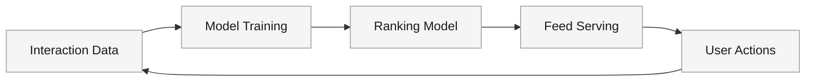
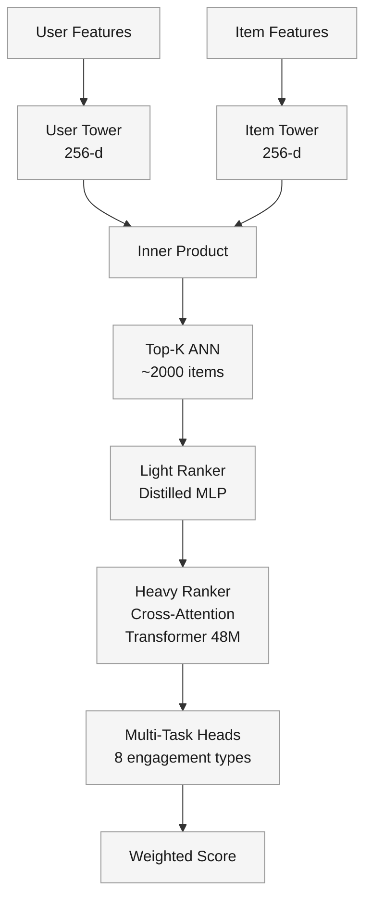
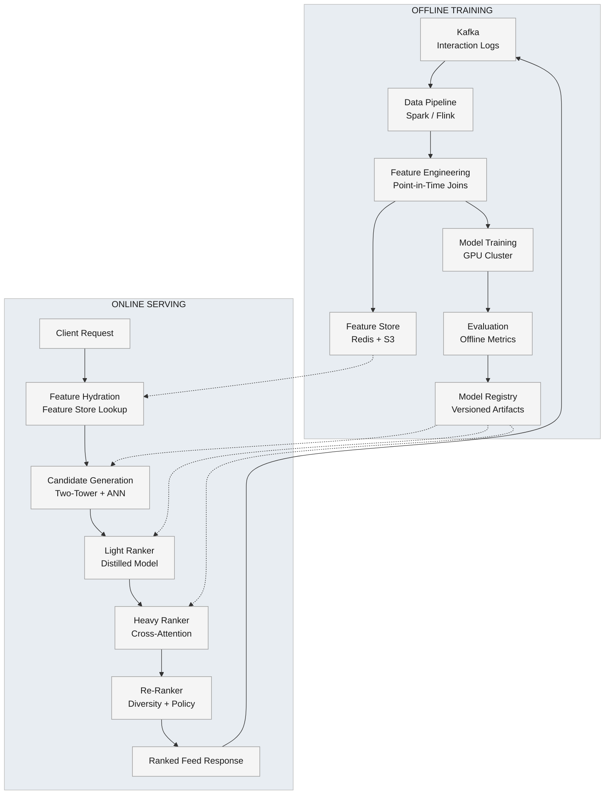

A social platform with hundreds of millions of daily active users needs to rank a firehose of content — posts, videos, articles, shares from followed accounts plus discovery content from the broader network — into a personalized feed that maximizes engagement.

<!--more-->

## 1. Problem & ML framing

A social platform with hundreds of millions of daily active users needs to rank a firehose of content — posts, videos, articles, shares from followed accounts plus discovery content from the broader network — into a personalized feed that maximizes engagement. Every user session pulls from a candidate pool of thousands of eligible items; getting the order wrong costs attention and retention.

The ML task is **learning-to-rank**: given a user *u*, their interaction history *H*, a candidate item *i*, and context *c* (time, device, session position), predict engagement probability *P(engage \| u, i, c)* and sort candidates by descending predicted value. The business objective is maximizing session-level engagement — dwell time, meaningful interactions, return frequency — while the ML objective is a weighted combination of engagement predictions that, when A/B tested, moves those business metrics.



## 2. Requirements

**Functional**

- FR1: Rank feed items by predicted relevance for each user
- FR2: Blend content from followed accounts with discovery items
- FR3: Incorporate real-time signals (likes, dwells) into ranking within seconds
- FR4: Apply diversity, safety, and policy filters to final ranked list
- FR5: Surface cold-start items and serve new users with minimal data

**Non-functional**

- NFR1: End-to-end feed ranking latency <200ms p99
- NFR2: Scale to 1B+ active items and 100M+ daily active users
- NFR3: Model retraining daily; feature store freshness <1 hour
- NFR4: 99.9% serving availability for ranking service

*Out of scope: Content creation, ad placement auction, social graph construction, notification delivery.*

## 3. Metrics

Offline (model quality on held-out data):

- **nDCG@20, nDCG@50** — ranking quality against logged interaction labels, position-weighted
- **Recall@1K** — candidate generation coverage: fraction of eventual engagements surfaced in the candidate set
- **MRR** — mean reciprocal rank of the first long-dwell or share event; penalizes burying the best item

Online (A/B experiment):

- **Session dwell time** — primary engagement metric; the sum of time spent on items from the feed
- **CTR and interaction rate** — clicks, likes, comments, shares per impression
- **Creator-side engagement distribution** — guardrail: prevents winner-take-all dynamics
- **Negative feedback rate** — hides, reports, "show less" as a safety guardrail

Each online metric ties to the business objective: longer sessions and richer interactions drive retention and ad inventory, while creator distribution and negative feedback prevent feed quality degradation.

## 4. Data

- **Sources:** User interaction logs — clicks, dwell timers (>2s, >30s), likes, shares, comments, hides, reports, follows. Item catalog with content metadata (text, media type, creator, upload time). User graph (follows, mutuals).
- **Labels / ground truth:** Implicit feedback, no human annotation. Click = weak positive. Dwell >30s or explicit like/share/comment = strong positive. Hide, report, "show less" = negative. Labels are extracted from interaction logs with a 24-hour attribution window — if a user engaged with an item within 24h of seeing it in feed, label = 1.
- **Position bias:** Items at position 1 get more clicks independent of relevance. PAL-style decomposition separates a learned position bias tower (used only during training) from the relevance tower (used at inference). Training data is also reweighted with inverse propensity scoring.
- **Class balance:** ~1–5% of impressions result in engagement. Negative downsampling during training (10:1 neg:pos ratio) plus hard-negative mining from items the heavy ranker scored high but the user skipped.
- **Train/val/test split:** Time-based. Train on days D-30 to D-3, validation on D-2, test on D-1. No random shuffling — temporal leakage inflates offline metrics and masks freshness failures.
- **Scale:** ~10B impressions/day across 100M+ DAU, ~1B active items, ~100 TB raw logs/day compressed.

## 5. Features

Feature groups with per-group representation strategy:

- **User features:** Engagement history as a sequence of item-ID embeddings (last 200 interactions), aggregated stats (interaction rate by content type, session frequency), account age, inferred demographics. Dense: user embedding from the two-tower model.
- **Item features:** Content embeddings from a multimodal encoder (text via sentence transformer, image/video via pretrained vision model), creator quality score (Bayesian average of engagement rates), upload recency, engagement velocity (likes/hour since publish), content type one-hot.
- **Context features:** Hour of day, day of week (cyclical encoding), device type, network quality, session position in feed, items already shown this session.
- **Cross / interaction features:** User-item affinity score (dot product of user and item embeddings), user-creator relationship (follows, mutual, interaction frequency), content-type preference (user's historical CTR per content type × item's type).
- **Embeddings:** All high-cardinality IDs (user, item, creator, hashtag) map to learned dense embeddings. Two-tower retriever produces 256-d user and item vectors; the heavy ranker uses 128-d per ID. Embedding tables are sharded by ID hash and served from an in-memory parameter server.

**Feature store and online/offline parity:** All features are computed through a shared feature store. Offline training reads from point-in-time-correct snapshots (feature values as they were at impression time). Online serving reads the same feature definitions from a low-latency KV store (Redis cluster, sub-ms p99). Staleness is tracked — the age of each feature value is included as a feature itself, letting the model learn to discount stale signals.

## 6. Model

### Baseline → advanced

Start with a **logistic regression** on top-200 hand-crafted features (user-item affinity, creator score, recency buckets, content-type preference). Trains in minutes, serves in microseconds, gives a sanity floor. The first serious model is **GBDT (LightGBM)** with the full feature set — handles feature interactions automatically, trains on CPU, and serves in <1ms per candidate.

The advanced design is a **multi-stage deep funnel**:

### Multi-stage funnel

```javascript
Billions of items → Candidate Generation (thousands) → Light Ranking (hundreds) → Heavy Ranking (dozens) → Re-ranking (final feed)
```

**Stage 1: Candidate generation — Two-tower retrieval**

A two-tower neural network produces 256-d embeddings for users and items independently. The user tower encodes engagement history (sequential self-attention over last 200 items), demographic features, and context. The item tower encodes content embeddings, creator stats, and freshness. Training objective: sampled softmax — predict which item the user engaged with out of the full corpus, using 1,000 negative samples per positive. At serving time, the item tower's output is precomputed and indexed in an ANN service (ScaNN, 10ms for top-1,000). The user tower runs once per request; its output queries the ANN index to retrieve ~2,000 candidates.

**Stage 2: Light ranking — Distilled student model**

A compact neural network (3-layer MLP, ~50 features) trained via knowledge distillation to mimic the heavy ranker's scores. Objective: Mean squared error against the teacher's predicted engagement probability. Runs in <1ms per candidate, reduces 2,000 → 500 candidates. Critical for latency — the heavy ranker can only score ~200 items within budget; the light ranker buys 2.5× more coverage at negligible cost.

**Stage 3: Heavy ranking — Multi-task cross-attention transformer**

A 6-layer transformer with cross-attention between user context (engagement sequence) and candidate items. Each candidate is scored independently through a shared encoder; cross-attention fuses user and item representations in the final layers. Multi-task heads predict 8 engagement types: P(click), P(dwell>10s), P(dwell>30s), P(like), P(share), P(comment), P(hide), P(report). Each head is a single linear layer on the shared transformer output.

Final score = Σ w_i × P(engage_i), where weights w_i are learned via Bayesian optimization against the online objective (session dwell time), re-tuned weekly.

Scale: ~48M parameters, ~6,000 features per candidate, 500 → 100 candidates. Served on GPU with batched inference; 100 candidates scored in ~30ms.



### Loss functions

The retriever uses **sampled softmax cross-entropy** — the model learns to distinguish the engaged item from random negatives. The light ranker uses **MSE distillation loss** against frozen teacher scores. The heavy ranker uses **per-task binary cross-entropy**, weighted by task importance. The overall objective is a scalarized sum; weights are tuned to maximize the online metric through Bayesian optimization.

### Position bias handling

The heavy ranker includes a **shallow bias tower** (2-layer MLP taking position as input) whose output is added to the relevance logit during training. At inference, the bias tower is disconnected — all items are scored as if at position 1. This is PAL-style debiasing, validated across production ranking systems with CTR improvements of 3–15%.

## 7. Architecture



### Offline training pipeline

#### Data pipeline

- **Components:** Kafka (real-time interaction stream), Spark (batch ETL), Flink (streaming feature computation), S3 (data lake for training datasets).
- **Flow:** (1) Interaction events land in Kafka within seconds of user action. (2) Spark jobs run hourly, joining impressions with their 24h attribution labels. (3) Point-in-time feature snapshots are joined — ensuring no label leakage from future features. (4) Training datasets are materialized to Parquet on S3.
- **Design consideration:** The attribution window (24h) balances label freshness against catching delayed engagement. Shorter windows miss meaningful interactions; longer windows add training latency.

#### Feature engineering

- **Components:** Shared feature definition library (Python), Spark UDFs for batch, Redis Lua scripts for online.
- **Flow:** (1) Feature definitions are written once in a shared DSL that compiles to both batch Spark jobs and online Redis scripts. (2) Batch runs compute and cache features hourly. (3) Online layer reads cached features with <0.5ms p99 latency.
- **Design consideration:** Training-serving skew is the #1 silent model killer. The shared feature definition library is non-negotiable — every feature that ships to production must have identical offline and online computation logic, verified by automated integration tests that compare sampled offline/online feature values.

#### Model training

- **Components:** GPU cluster (8× H100 for heavy ranker), PyTorch distributed training, AdamW optimizer.
- **Flow:** (1) Two-tower retriever trains daily on 3 days of data — batch size 4,096, 100K steps, sampled softmax with 1,000 negatives. (2) Heavy ranker trains daily on 7 days of data — batch size 512, 50K steps, multi-task BCE. (3) Light ranker distills from the frozen heavy ranker — batch size 2,048, 20K steps, MSE loss on teacher scores.
- **Design consideration:** Daily retraining keeps the model within 24h of drift. For sudden distribution shifts (viral event, breaking news), a warm-start incremental training pipeline retrains on the most recent 6 hours in <2 hours with 90% of full-retrain quality, using diagonal Fisher regularization to prevent catastrophic forgetting.

#### Evaluation and model registry

- **Components:** Offline metric computation (nDCG, Recall@K, MRR), model registry (MLflow or internal equivalent).
- **Flow:** (1) After training, the model is evaluated on the held-out test day. (2) If offline metrics regress >1%, the model is quarantined. (3) Passing models are registered with version, training date, and metric snapshot. (4) Deployment pipeline picks up the latest passing version.
- **Design consideration:** Offline metrics are necessary but not sufficient. A model can improve nDCG offline while degrading online metrics (position bias overfitting, popularity echo chamber). Every model must pass offline gates then survive an online A/B canary before full rollout.

### Online serving pipeline

#### Feature hydration

- **Components:** Feature store client library, Redis cluster (sharded by user ID), local LRU cache for hot users.
- **Flow:** (1) Request arrives with user ID and session context. (2) Client library batches feature lookups: user features (1 Redis call), session context (computed client-side), item features (pre-fetched from item cache). (3) Feature vectors assembled for inference. Total: <5ms p99.
- **Design consideration:** User features are cached with a 60s TTL — user embeddings change slowly; recalculating per request wastes compute. Item features for hot candidates are cached aggressively; cold-start items incur a one-time fetch penalty.

#### Candidate generation

- **Components:** User tower model (ONNX runtime, CPU), item ANN index (ScaNN, GPU), item embedding cache.
- **Flow:** (1) User tower forward pass: 5ms. (2) ANN query for top-2,000: 10ms. (3) Candidate dedup and filter (already-seen this session, blocked accounts): 2ms. Total: ~17ms.
- **Design consideration:** The ANN index is rebuilt hourly from the latest item embeddings. For real-time items (posted <1h ago), a separate small in-memory index handles the tail with exact dot-product search over ~10K recent items.

#### Light ranking

- **Components:** Distilled ONNX model (CPU), 2,000 candidates.
- **Flow:** (1) Score all 2,000 candidates in one batched forward pass: <1ms per candidate on CPU. (2) Select top 500 by distilled score. Total: ~2ms.
- **Design consideration:** The distilled model has 1/20th the parameters of the heavy ranker. It recovers ~95% of the heavy ranker's top-100 recall — the precision loss is negligible given the heavy ranker will rescore.

#### Heavy ranking

- **Components:** Cross-attention transformer (ONNX or TensorRT, GPU), 500 candidates.
- **Flow:** (1) Batch all 500 candidates with shared user context into one forward pass. (2) Cross-attention computes user-item interactions in the transformer layers. (3) 8 task heads produce per-candidate engagement probabilities. (4) Weighted score computed. (5) Select top 100. Total: ~30ms on GPU.
- **Design consideration:** The 500→100 reduction is the tightest latency-vs-quality tradeoff. Increasing to 1,000 candidate slots would add 15ms and capture ~0.3% more engagements (diminishing returns). The 500 budget was set by profiling the p99 latency slack.

#### Re-ranking

- **Components:** Rule engine + lightweight scorer (CPU).
- **Flow:** (1) Diversity: ensure no more than 2 consecutive items from the same creator or content type. (2) Freshness boost: exponential decay multiplier `exp(-hours_since_publish / 3)` applied to recent items. (3) Policy: remove items violating safety or community guidelines. (4) Final sort. Total: ~3ms.
- **Design consideration:** Re-ranking is the policy layer — it enforces product rules the model would otherwise optimize away. The diversity rule prevents feed homogeneity; the freshness rule prevents stale-top-3 syndrome.

### Serving scale

| Stage | Candidates in | Candidates out | Latency (p50) | Hardware |
|---|---|---|---|---|
| Feature hydration | — | — | 3ms | CPU |
| Candidate generation | ~1B | 2,000 | 15ms | CPU + GPU (ANN) |
| Light ranking | 2,000 | 500 | 2ms | CPU |
| Heavy ranking | 500 | 100 | 28ms | GPU |
| Re-ranking | 100 | 25 | 3ms | CPU |
| **Total** |  |  | **~51ms** |  |

At 10K QPS peak: 10 GPU instances for heavy ranking, 5 CPU instances for light ranking + ANN serving, Redis cluster of 12 nodes for feature store. Total serving cost: ~$8K/month (cloud GPU on-demand) for 100M DAU.

## 8. Deep dives

### DD1: Position bias correction

**Problem.** Items at position 1 get 10× more clicks than items at position 10, independent of relevance. A model that trains on position-contaminated data learns "position 1 = engage" rather than "relevant = engage." At inference, when all items are scored at the same virtual position, the model underperforms — it relied on position as a crutch. Worse, position correlates with true relevance (the logging policy put relevant items higher), so simply removing position from training *increases* bias by forcing the model to use correlated features as proxies.

**Approach 1: Position as a feature, dropped at inference.** Train with position as an input feature. At inference, set position to a constant (e.g., 1). The model *may* learn to disentangle position from relevance, but without explicit structure, position bleeds into other feature weights. Works poorly — position is too strong a signal relative to subtle relevance features.

**Approach 2: Inverse propensity scoring (IPS).** Reweight training examples by 1/P(seen \| position). Clicks at lower positions get higher weight because they were "earned" against lower visibility. Simple and unbiased in theory, but high variance — a single click at position 50 gets 50× the weight of a position-1 click, creating unstable gradients. Clipping weights to [0.1, 10] reduces variance but introduces bias.

**Approach 3: PAL-style two-tower debiasing.** Decompose the model into a relevance tower (all features except position) and a shallow bias tower (position only). During training, outputs are summed: `logit = f_relevance(user, item) + f_bias(position)`. At inference, only `f_relevance` is used. The bias tower is structurally prevented from accessing relevance features — position cannot contaminate the relevance representation.

> [!TIP]
> **Key insight:** PAL works because the bias tower is *starved* of relevance information. A shallow MLP that only sees position cannot learn item-specific corrections, so the relevance tower is forced to carry the full prediction burden. The architecture enforces the decomposition, unlike the "drop at inference" hack that relies on the optimizer to figure it out.

**Decision → Rationale.** PAL-style two-tower debiasing. Its structural separation of position from relevance eliminates the confounding problem that plagues the single-model approaches. In production A/B tests across Meta ranking surfaces, PAL-style shallow towers improved CTR by 3–15% over position-as-feature baselines. The implementation cost is minimal — a 2-layer MLP with 64 hidden units added to the heavy ranker, trained jointly with the main model, zero additional inference cost.

**Edge cases:** Position-blind evaluation — items that appear at the same position in both control and treatment may show no metric movement even when the model is genuinely better, because the position effect dominates. Online A/B must measure at the feed level (total engagement per session), not per-position.

### DD2: Cold start for new items and users

**Problem.** A new item with zero interactions cannot be ranked by collaborative signals. A new user with no history has no embedding to query the ANN with. Both cases degrade to popularity-based ranking, which ignores personalization and buries fresh content. The platform's growth depends on surfacing new creators (who leave if their first posts get 0 impressions) and engaging new users (who churn if their first feed is generic).

**Approach 1: Content-based bootstrapping.** For new items, extract features from the content itself — text embeddings from a pretrained language model, visual features from a vision encoder, audio features from a speech model. Score items purely on content-based affinity with the user's historical content preferences. For new users, use demographic and acquisition-channel features to map to a "lookalike" embedding from a similar user cohort. Works immediately with zero interaction data; quality is 60–70% of collaborative performance.

**Approach 2: Exploration via multi-armed bandits.** Reserve 5–10% of feed slots for exploration. Treat each new item as an arm in a Thompson sampling bandit — sample from the posterior of its engagement rate, boost items with high uncertainty. As interactions accumulate, the posterior narrows and the bandit converges to exploitation. Guarantees a minimum exposure floor for every new item; proven in production at TikTok with tiered rollout (100 → 1,000 → 10,000 → viral).

**Approach 3: Embedding warm-start via side information.** Train the item embedding tower to produce embeddings from content features alone, then fine-tune with collaborative signals. A new item's embedding is the content-only forward pass — no cold-start gap because the same encoder handled warm items during training. For new users, use the first 3–5 on-platform actions to compute a running average embedding that replaces the cold-start proxy after ~30 seconds of activity.

> [!TIP]
> **Key insight:** The most effective cold-start strategy doesn't treat it as a separate system — it designs the embedding architecture so the "cold" path and "warm" path share the same encoder. A new item's content embedding lives in the same vector space as a mature item's collaborative embedding, so the ANN index and downstream rankers need no special-case logic.

**Decision → Rationale.** Embedding warm-start (Approach 3) for item cold start, combined with bandit exploration (Approach 2) for exposure guarantees. The shared encoder approach means the retriever and ranker see cold items as just another vector — no code branches, no fallback paths. Bandit exploration provides the exposure floor that ensures new items get the impressions needed to accumulate collaborative signal. The first 100 impressions are content-driven; impressions 100–1,000 blend content and collaborative signals with a decaying weight; beyond 1,000, the item is fully warm.

**Edge cases:** Spam floods — a coordinated upload of thousands of low-quality items could exhaust the exploration budget. Mitigation: content-quality classifier gates entry to the exploration pool (minimum predicted quality score). Celebrity joins — a known creator's first post should get immediate high exposure, not bandit exploration. Mitigation: creator reputation from cross-platform signals (follower import, verified status).

### DD3: Recency vs relevance

**Problem.** Users want fresh content, but pure relevance ranking produces stale feeds — yesterday's top post still has the highest engagement score today. Timeliness is itself a component of relevance (a news article, a trending meme, a friend's just-posted photo), but it degrades at content-type-specific rates. The model must learn that a 6-hour-old tweet is stale while a 6-hour-old long-form video is fresh — a single recency decay curve fits nothing well.

**Approach 1: Global recency boost.** Apply a fixed exponential decay multiplier: `score × exp(-age / half_life)`. TikTok uses half-life ≈ 3 hours. Simple and tunable, but the single half-life applies identically to breaking news (half-life = 15 minutes) and evergreen tutorials (half-life = 6 months). Over-boosts ephemeral content types; under-boosts timely ones.

**Approach 2: Example Age (YouTube).** During training, include the example's age as a feature: `age = training_time - item_publish_time`. At inference, set age = 0. The model learns the population-level relationship between age and engagement probability; at inference it predicts "what would engagement be if this were brand new?" The model can learn content-type-specific age effects because age interacts with other features in the network. Elegant but assumes the age-engagement relationship is stationary — a platform's audience composition shift can change this relationship over time.

**Approach 3: Engagement velocity as a learned feature.** Instead of age, use engagement *velocity* — likes/hour, shares/hour, comment acceleration — as input features. A 3-hour-old post with 500 likes/hour is rising; a 3-day-old post with 5 likes/hour is dead. Velocity captures timeliness without explicit time: a trending post has high velocity regardless of absolute age. The model learns velocity thresholds per content type from data.

> [!TIP]
> **Key insight:** Age is a proxy for what actually matters — *is this item gaining or losing momentum?* Engagement velocity captures this directly and generalizes across content types. A breaking news article peaks at 2 hours with 1,000 shares/hour; an evergreen tutorial peaks at 2 weeks with 10 shares/hour. The model learns both are "at peak" from their velocity, not their age.

**Decision → Rationale.** Engagement velocity as the primary recency feature (Approach 3), with a mild global freshness boost as a backstop (Approach 1, half-life = 24h). Velocity lets the model learn content-type-specific decay curves from data — no hand-tuned half-lives. The global boost reserves 10% of feed slots for items posted in the last hour, ensuring minimum freshness regardless of velocity signal. Within-session randomization during training ensures the model observes items at varying ages rather than a monotonic recency-to-engagement correlation.

**Edge cases:** Velocity cold start — a just-posted item has zero velocity, indistinguishable from a dead item. Mitigation: for items <1h old, impute velocity from the creator's average velocity and the content-type baseline. Velocity spikes from coordinated sharing — a link shared to 50 group chats simultaneously gets artificial velocity. Mitigation: deduplicate shares from the same source; cap per-source velocity contribution.

### DD4: Monitoring, drift, and continual learning

**Problem.** An ML ranking model rots the moment it ships. User behavior shifts (new content formats, seasonal patterns, competitor launches), item distributions drift (new creator cohorts, spam evolution), and the model's own predictions change what users see (feedback loops — ranking popular items makes them more popular). Without monitoring, the first sign of failure is a business metric cliff days or weeks later.

**Approach 1: Scheduled full retraining.** Retrain from scratch on a rolling window of recent data — daily for the heavy ranker, weekly for the two-tower retriever. Simple and predictable. Catches drift within the retraining window. Fails when drift accelerates — a viral content format shift on day 2 of a 7-day retraining cycle leaves 5 days of stale predictions. Also expensive — retraining from scratch daily burns GPU budget proportional to data volume.

**Approach 2: Online continual learning (Monolith-style).** Stream interaction events through a training pipeline that updates model parameters within seconds. The serving and training systems share the same parameter server — inference reads current weights, training writes gradient updates. Catches drift immediately. Requires collisionless hash tables for dynamic embedding allocation (new user/item IDs appear constantly) and careful fault tolerance. ByteDance reports +14% engagement vs daily batch training.

**Approach 3: Warm-start incremental retraining with drift detection.** Retrain daily from the previous day's checkpoint (not from scratch), regularized with diagonal Fisher to prevent catastrophic forgetting. Run a drift detection pipeline hourly: compare feature distributions (KL divergence between current hour and training distribution), prediction distributions (do predicted CTRs shift?), and offline metric degradation on recent labeled data. When drift exceeds a threshold, trigger an emergency incremental retrain on the last 6 hours of data. Balances the responsiveness of online learning with the stability and auditability of batch.

> [!TIP]
> **Key insight:** Full retraining from scratch is the safest baseline but the slowest to react. Online continual learning is the fastest but the hardest to operate (silent corruption, difficult rollback). Warm-start incremental retraining with statistical drift detection hits the sweet spot — it reacts to drift within hours (not days), preserves model stability through regularization, and generates versioned, auditable checkpoints that can be rolled back.

**Decision → Rationale.** Warm-start incremental retraining with hourly drift detection (Approach 3). Daily incremental updates on the heavy ranker keep it within 24h of the interaction distribution, and Fisher regularization preserves 96% of cold-start quality at 4% of the training cost (validated at LinkedIn scale: LiRank incremental training). The drift detection pipeline runs hourly on the last 60 minutes of interaction data — if nDCG on recent data drops >2% or feature KL divergence spikes >0.1, an emergency retrain triggers. Models are deployed through a canary pipeline: 1% traffic → 10% → 50% → 100%, with automatic rollback if online metrics degrade.

**Monitoring dashboard (per-model):**

- **Feature drift:** Max KL divergence across top-50 features, hourly
- **Prediction drift:** Mean predicted CTR, distribution of scores, hourly
- **Offline quality:** nDCG@20 on most recent 24h of labeled data, daily
- **Online quality:** Session dwell time, CTR, negative feedback rate, per A/B slice, hourly
- **Serving health:** p50/p99 latency per funnel stage, error rate, feature store miss rate, real-time

**Edge cases:** Feedback loop blindness — a model that ranks popular items higher makes them more popular, which the next retraining interprets as genuine relevance. Mitigation: randomized data collection (1% of traffic served with random ranking) provides an unbiased relevance baseline. Concept drift vs data drift — a feature distribution shift (data drift) may not harm predictions if the feature-label relationship is unchanged (no concept drift). Monitoring only data drift creates false alarms. The drift detector checks *both*: KL divergence on features AND offline metric degradation on recent labeled data. Only when both signal fires does the emergency retrain trigger.

## 9. References

1. [Scaling Instagram Explore Recommendations (Engineering at Meta, 2023)](https://engineering.fb.com/2023/08/09/ml-applications/scaling-instagram-explore-recommendations-system/)
1. [Powered by AI: Instagram's Explore Recommender System (Meta AI, 2023)](https://ai.meta.com/blog/powered-by-ai-instagrams-explore-recommender-system/)
1. [SilverTorch: Index as Model (Engineering at Meta, 2026)](https://engineering.fb.com/2026/05/26/ml-applications/silvertorch-index-as-model-new-retrieval-paradigm-recommendation-systems/)
1. [Deep Neural Networks for YouTube Recommendations (RecSys 2016)](https://dl.acm.org/doi/10.1145/2959100.2959190)
1. [Feed SR: Industrial-Scale Sequential Recommender for LinkedIn Feed (arXiv, 2026)](https://www.arxiv.org/pdf/2602.12354)
1. [LiRank: Industrial Large Scale Ranking Models at LinkedIn (KDD 2024)](https://arxiv.org/html/2402.06859)
1. [Enhancing Homepage Feed Relevance with Large Corpus Sparse ID Embeddings (LinkedIn Engineering)](https://www.linkedin.com/blog/engineering/feed/enhancing-homepage-feed-relevance-by-harnessing-the-power-of-lar)
1. [Community-focused Feed Optimization (LinkedIn Engineering)](https://www.linkedin.com/blog/engineering/feed/community-focused-feed-optimization)
1. [X Recommendation Algorithm (GitHub, open-sourced 2023)](https://github.com/twitter/the-algorithm)
1. [PAL: Position-bias Aware Learning for CTR Prediction (Guo et al., RecSys 2019)](https://doi.org/10.1145/3298689.3347033)
1. [Monolith: Real-Time Recommendation System with Collisionless Embedding Table (ByteDance, 2022)](https://arxiv.org/abs/2209.07663)
1. [TTGL: Large-scale Multi-scenario Universal Graph Learning at TikTok (RecSys 2025)](https://doi.org/10.1145/3711896.3737269)
1. [Toward Disentangling Relevance and Bias in Unbiased Learning to Rank (arXiv, 2022)](https://doi.org/10.48550/arxiv.2212.13937)
1. [Deep Interest Network for Click-Through Rate Prediction (Zhou et al., KDD 2018)](https://arxiv.org/abs/1706.06978)
1. [DCN V2: Improved Deep & Cross Network (Wang et al., WWW 2021)](https://arxiv.org/abs/2008.13535)
