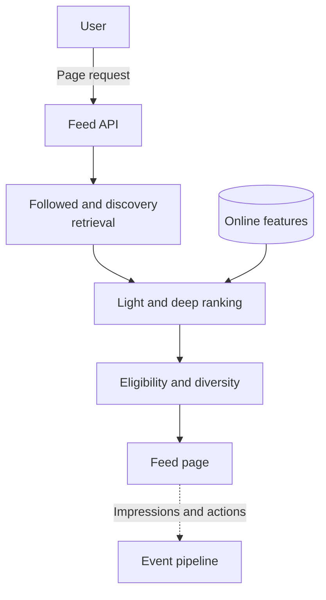
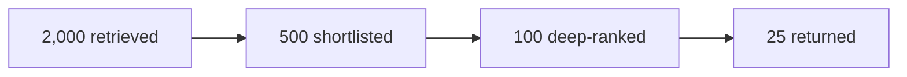
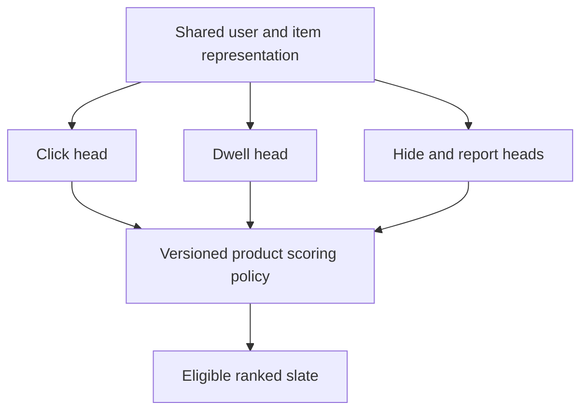

Design of a personalized feed that retrieves relevant content, ranks it for the user and updates recommendations from recent interactions.

<!--more-->

## Problem

A user opens the feed to catch up with followed accounts and discover useful content. The service selects a small set of posts from a much larger collection, taking the user's interests, recent activity and content eligibility into account.

The goal is worthwhile engagement: useful reading or viewing, meaningful interactions and return visits. Clicks provide one signal; hides, reports and repetitive recommendations help identify poor results.

## Requirements

### Functional requirements

- **Build a personalized feed.** Combine content from followed accounts with discovery recommendations.
- **Respond to recent activity.** Use likes, dwell and explicit feedback to update the next page.
- **Support new users and content.** Recommend eligible items even when interaction history is limited.
- **Apply product rules.** Enforce safety, blocked-account exclusions and diversity before returning results.

### Non-functional requirements

- **Scale:** 100M daily active users, 1B active items and 10B displayed items/day.
- **Latency:** feed ranking below 200ms at p99, measured from API receipt to response.
- **Availability:** 99.9% for feed serving, with a reduced-complexity ranking fallback.
- **Freshness:** recent interactions available within seconds; slower historical aggregates refreshed within one hour.
- **Quality:** compare retrieval recall and NDCG@20 on held-out data; evaluate session engagement with hides, reports and creator exposure as guardrails.

Content creation, ad auctions and notifications are outside this design.

## Back-of-the-envelope calculations

- Returning 25 items per page gives `10B / 25 = 400M` page requests/day: about 4.6K requests/s on average. A 5× peak is about 23K requests/s.
- The candidate budget is 2,000 retrieved → 500 shortlisted → 100 deep-ranked → 25 returned. At peak, the deep model scores about 2.3M user–item pairs/s.
- A 256-dimensional float32 vector uses 1KB. One billion item vectors need roughly 1TB before index overhead and replicas.
- At an assumed 200 bytes per impression, logging 10B impressions produces about 2TB/day before interaction events and replication.

These are sizing assumptions. Batched inference, queueing and feature retrieval must fit the end-to-end latency target under this workload.

## Core entities

- **Item:** eligible content and its creator, publication time and retrieval representation.
- **Impression:** the item actually displayed, including position and serving version.
- **Interaction:** a user action attributed to an impression.
- **Model bundle:** compatible encoders, index, rankers, feature definitions and reranking policy.

```protobuf
message Item {
  string item_id;
  string creator_id;
  string content_type;
  Timestamp published_at;
  string eligibility_version; // Latest policy decision
}

message Impression {
  string request_id;
  string user_id;
  string item_id;
  int32 position;
  Timestamp displayed_at;
  string bundle_version;
}

message Interaction {
  string event_id; // Stable across delivery retries
  string request_id;
  string item_id;
  string action; // Like, share, hide, report or dwell
  int64 dwell_ms;
  Timestamp occurred_at;
}

message ModelBundle {
  string version;
  string feature_schema;
  string retrieval_index;
  string light_ranker;
  string deep_ranker;
  string policy_version;
}
```

Impressions are recorded when items become visible. The serving log also retains candidates and the feature snapshot used for scoring, so training can reconstruct what was known at that time.

## API

```yaml
GET /v1/feed:
  query:
    cursor: opaque snapshot cursor
    limit: 25
  response:
    request_id: feed-123
    items: [{item_id: post-7, creator_id: creator-2}]
    next_cursor: opaque cursor
    bundle_version: feed-v12

POST /v1/feed/events:
  body:
    event_id: event-123
    request_id: feed-123
    item_id: post-7
    action: hide
  response: accepted
```

The authenticated user comes from the session. Event ingestion deduplicates by `event_id`; clients retry with the same ID. Cursors retain a stable candidate snapshot or deduplication state across pages.

## High-level design

The serving path combines several retrieval sources, then spends more ranking work on a progressively smaller set. Training runs separately and publishes compatible model/index bundles.


```mermaid
flowchart TB
    U["User"] -->|"Page request"| API["Feed API"]
    API --> RET["Followed and discovery<br>retrieval"]
    RET --> RANK["Light and deep ranking"]
    RANK --> POLICY["Eligibility and diversity"]
    POLICY --> OUT["Feed page"]
    FS[("Online features")] --> RANK
    OUT -.->|"Impressions and actions"| LOG["Event pipeline"]
```

[Meta's Explore architecture](https://engineering.fb.com/2023/08/09/ml-applications/scaling-instagram-explore-recommendations-system/) uses retrieval followed by lightweight ranking, heavier ranking and final reranking. The proposed feed follows that pattern while adding followed-account candidates.

## Storage

- **Content and ownership:** sharded PostgreSQL stores item metadata and creator relationships. Large media remains in object storage. Eligibility changes are versioned and propagated to serving filters.
- **Online features:** Redis holds recent user interactions and item aggregates. Flink updates velocity signals from Kafka; batch jobs materialize slower historical features. Features include timestamps and missing-value indicators.
- **Retrieval indexes:** ScaNN stores compatible item vectors. A small recent-item overlay includes newly published content until the next base-index build; its watermark prevents duplicate inclusion during cutover.
- **Training and replay:** Kafka buffers events; partitioned Parquet files retain impression snapshots and outcomes with controlled access and retention. A versioned registry owns complete serving bundles.

A cache can reuse user features where their freshness permits. Safety and blocking checks use current policy even when candidates came from an older cache.

## From request to response

### Building a feed page

1. The API authenticates the user and loads recent interactions, followed accounts and the page cursor.
2. Retrieval merges followed posts, ANN results and recent-item candidates. It removes duplicate IDs, already-shown items and ineligible content.
3. A cheap first-stage score shortlists 500 candidates. The light ranker selects 100 for richer features and deep inference.
4. The deep model predicts engagement and negative feedback using shared user context plus candidate-specific features.
5. Final reranking applies eligibility, creator diversity and the bounded exploration policy. The API returns 25 items and logs its serving snapshot.

Scoring every candidate with the deep model would multiply GPU work. The staged approach below controls that cost while measuring which useful items each stage drops.

### Using feedback on the next request

A displayed-item event creates an impression; later likes, hides and dwell events join by request and item ID. Stream processing updates the user's short-term history within seconds. A hide also updates exclusions, making it effective before the next model-training cycle.

### Handling a dependency failure

If the deep ranker times out, return eligible light-ranked candidates. If personalization features are unavailable, use followed and approved recent/popular candidates. Each response records the fallback, and policy filtering remains active.

## Deep dives

### How much ranking work should each stage receive?

A richer model can capture user–item interactions that a retrieval vector misses, but its cost grows with candidates per request.

- **One cheap ranker** has low latency but limited interaction modeling.
- **One deep ranker** simplifies scoring but consumes substantial compute for thousands of candidates.
- **A staged funnel** introduces candidate-loss risk while limiting expensive inference.

**Use a staged funnel with explicit candidate budgets.** Retrieval uses a two-tower encoder; item vectors are precomputed, while the user vector is computed from recent history. The light model learns to preserve candidates favored by the deep ranker. The deep model adds user–item cross-features and history attention.


```mermaid
flowchart LR
    A["2,000 retrieved"] --> B["500 shortlisted"]
    B --> C["100 deep-ranked"]
    C --> D["25 returned"]
```

Measure retrieval recall, top-item retention after light ranking and end-to-end quality separately. Profile actual batches at peak load; model parameter counts alone do not establish throughput. When capacity is constrained, reduce deep-ranking candidates and preserve the fallback rather than allowing an unbounded queue.

**What each stage actually receives**

Candidate generation combines followed creators, embedding neighbors and eligible recent content. Merge IDs before ranking so an item appearing in three sources gets one opportunity, while keeping its source membership as a feature.

The light ranker uses cheap cached user/item aggregates. The deep ranker adds sequence attention and user-item cross-features only for its shortlist. Batch feature hydration and tensor preparation; network lookups per candidate can dominate inference even when the model itself is fast.

```text
2,000 candidates → 500 cheap shortlist → 100 rich scores → 25 final items
Measure recall at each arrow, not just latency at the final model.
```

Train the light model to retain promising deep-model candidates, then verify against mature user outcomes. Its teacher distribution must match the current retrieval sources. Keep a fallback score for every candidate so deep-stage timeout leaves a usable order. Deadline budgets cover feature retrieval and final eligibility, not only GPU execution.

### What should the model optimize?

Click probability favors attractive items, while dwell and meaningful interactions often reflect a different outcome.

- **A click-only model** gives a simple label but can reward clickbait.
- **Separate engagement models** offer flexibility but duplicate feature and serving work.
- **A shared multi-task ranker** learns common representations with separate outcome heads.

**Use a shared model with explicit product weights.** Predict click, dwell, like, share, hide and report separately. Positive feedback increases the score; hide/report probabilities reduce it or trigger an eligibility rule.

```python
score = (
    click_weight * p_click
    + dwell_weight * p_long_dwell
    + share_weight * p_share
    - hide_weight * p_hide
    - report_weight * p_report
)
```

Weights are versioned and tested in controlled experiments. Evaluate whole-session outcomes and negative feedback; offline NDCG is a comparison tool, not a guaranteed engagement gain. [Deep Interest Network](https://arxiv.org/abs/1706.06978) and [DCN V2](https://arxiv.org/abs/2008.13535) are candidate interaction-modeling techniques.

**Separate model predictions from product policy**

The model has distinct heads for outcomes observed at different times. A click is immediate; long dwell requires watching the session; reports may arrive later. Each head's missing/unmatured labels are masked rather than treated as negative.


```mermaid
flowchart TB
    F["Shared user and item representation"] --> C["Click head"]
    F --> D["Dwell head"]
    F --> H["Hide and report heads"]
    C --> P["Versioned product scoring policy"]
    D --> P
    H --> P
    P --> R["Eligible ranked slate"]
```

Calibrate the heads used as probabilities on representative held-out traffic. Then select policy weights through controlled experiments with session-level satisfaction and negative-feedback guardrails. Changing a policy weight is a versioned release even when model weights remain fixed.

Apply safety removals as eligibility constraints, not merely as a small score penalty. Otherwise a highly engaging prohibited item could remain near the top despite its negative term. Log component scores and policy versions to explain a ranking change.

### How do we learn from biased, delayed feedback?

High positions receive more exposure, and items excluded by the old policy have no observed outcome.

- **Raw clicks** inherit exposure and position bias.
- **A position-bias model** separates observed position from relevance, with assumptions about their interaction.
- **Controlled exploration** provides known exposure probabilities, at a bounded user-experience cost.

**Retain a small, policy-approved exploration sample and log the assignment probabilities.** Use position-aware training where justified; apply clipped propensity weighting only when the logged probabilities support it. [PAL](https://doi.org/10.1145/3298689.3347033) provides a position-aware modeling approach.

A 24-hour attribution window means training waits until that window closes. Split chronologically, keep sessions together and join features by their historical availability time. Sampled negatives retain their sampling rates, while validation/test sets retain representative prevalence. Unseen items are not interchangeable with displayed items the user skipped.

**An unbiased log needs the actual exposure policy**

For each shown item, store position, candidate source, request/bundle IDs and any randomized assignment probability. Join engagement only after its observation window is mature. A late report revises the appropriate label version instead of creating another impression.

Suppose an exploration item has assignment probability 0.02. Its inverse-propensity weight would be 50 before clipping, illustrating why rare exposure can create unstable updates. Use a documented cap and examine effective sample size; weighting cannot create evidence where the policy gave an item zero support.

Position correction and candidate selection correction are different problems. A position model estimates examination among shown items; controlled retrieval/slot exploration supplies support for items that the earlier model rarely showed. Use representative, unweighted evaluation data and a chronological final test set to measure the actual result.

### How do fresh and unfamiliar items enter the feed?

New content has text, media and creator context before it has engagement history. New users have session context before a reliable long-term profile.

- **Popularity-only recommendations** provide a stable fallback but concentrate exposure.
- **Content-based retrieval** serves new items immediately, with weaker collaborative evidence.
- **Bounded exploration** gathers outcomes while protecting the rest of the feed.

**Combine content-based vectors with a bounded exploration budget.** Start with a 5% slot budget, gated by eligibility and quality checks. Tune it using session outcomes and creator exposure; this is an allocation policy, not a promise that every item receives traffic.

Use recent-item retrieval and an age feature alongside measured engagement velocity. Express any decay using an explicit half-life:

```python
freshness_weight = 2 ** (-age_hours / half_life_hours)
```

Different content types receive different policies. Freshness and exploration share one slot-allocation rule so their combined effect remains controlled.

**Allocate one coherent exploration budget**

A fresh-item source proposes content encoded with the active bundle, with missing engagement features explicit. The slot allocator chooses exploration items under one shared cap with freshness/diversity rules, then fills the remaining positions from established candidates.

For a new user, use language, selected interests and current-session behavior. An immediate hide can remove similar content from the next request without changing the global model. A new item receives bounded eligible exposure, and its outcomes update streaming aggregates.

```text
Candidate eligible? → yes → exploration slot available? → sample and log assignment
                  → no  → exclude before ranking
```

Measure discovery quality by item age and creator cohort, not just total impressions. An exploration item still follows current blocking and safety rules. The allocation can borrow unused slots only under a declared policy; it does not guarantee traffic to every submitted item.

### How do model releases remain consistent?

Updating an item encoder changes the vector space; combining it with an older query/user encoder or index can reduce retrieval quality.

- **Independent component releases** are flexible but allow incompatible combinations.
- **A complete versioned bundle** makes cutover and rollback predictable.

**Release complete bundles.** Pin user/item encoders, index watermark, feature schema, rankers and policy version. Shadow traffic checks mechanics and latency; mature held-out labels establish offline quality, and a canary measures user impact.

Stream processing continues during training and rollback. New sessions use the promoted bundle; an existing cursor stays on its original snapshot where possible. Alert on feature age, retrieval misses, fallback rate, per-stage queueing and negative feedback. Retraining creates a checkpointed candidate rather than mutating the live model invisibly.

**A bundle switch is an interface change**

The manifest records user/item encoders, embedding dimension, feature schema, base/overlay watermarks, rankers and scoring policy. Warm all artifacts, run query vectors against the new index, and validate sample feature tensors before routing live requests.

```text
Build artifacts → compatibility checks → shadow → canary → promote pointer
                                             failure → retain prior bundle
```

A feed cursor includes a session/snapshot identity and records served item IDs. Continuing that cursor uses its pinned scoring snapshot where retained, while every page rechecks current eligibility. If the snapshot expired, return an explicit restart response rather than quietly changing pagination semantics.

Rollback restores a complete compatible bundle. Streaming features continue only when their schema is compatible; incompatible records fall back or block promotion. Track stage-level fallbacks so a seemingly stable final latency does not hide an unavailable deep ranker.
