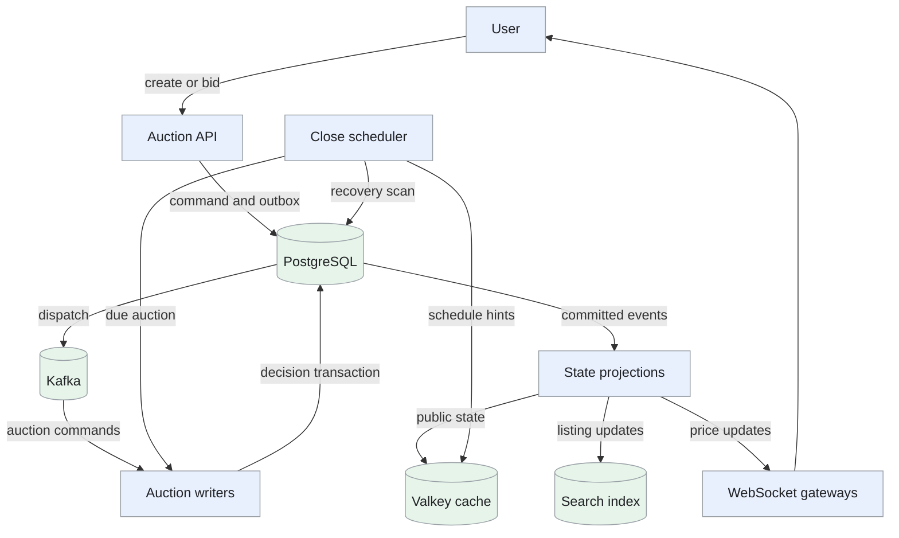
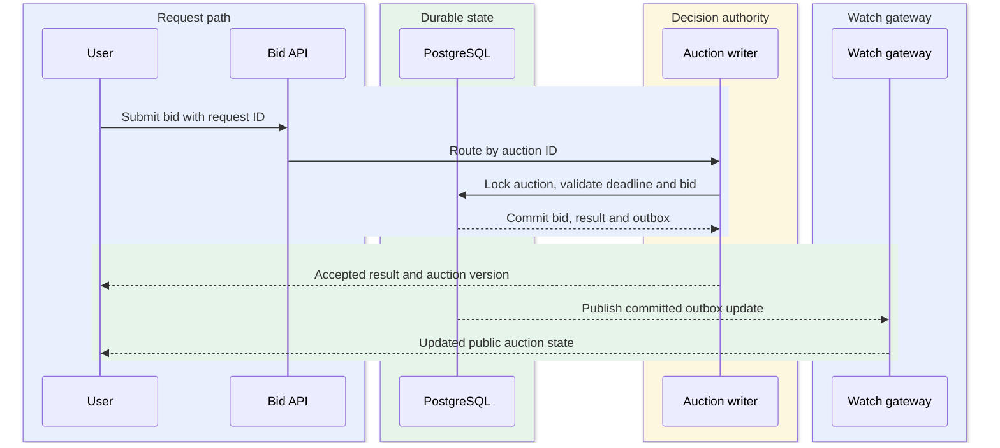
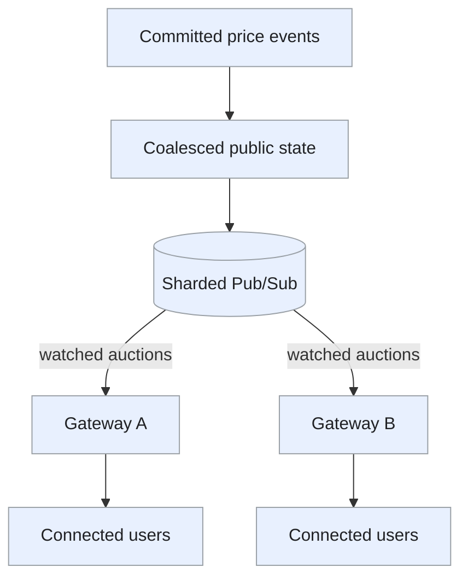
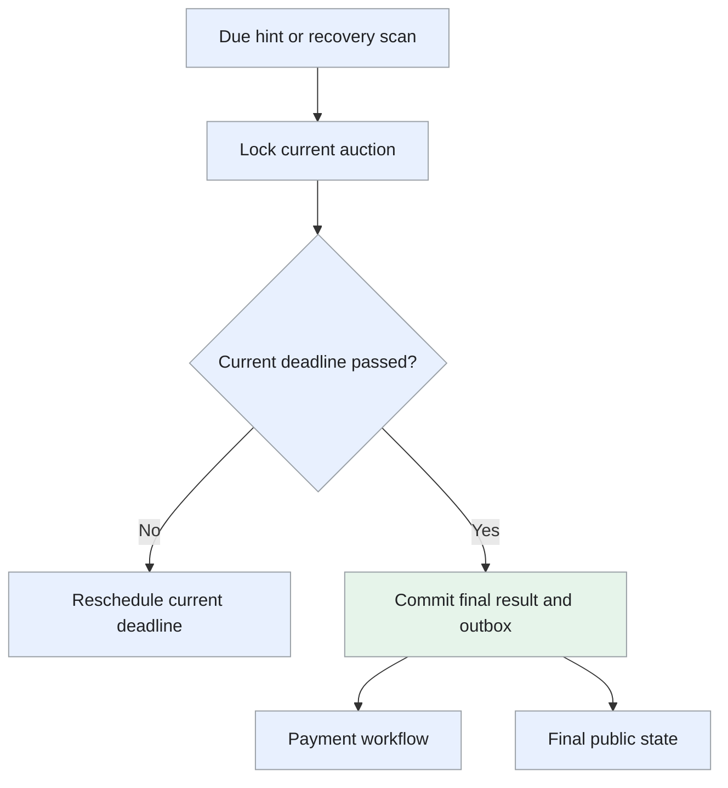

Design of an auction marketplace with ordered bids, hidden proxy limits, live prices and a durable closing result.

<!--more-->

## Problem

A seller lists an item with a starting price and an end time. Users place bids or set a hidden maximum that the service uses for automatic bidding. At closing, the auction must produce one consistent winner and final price.

Most users are watching rather than bidding. The design separates fast price distribution from the durable bid decision: a cached price helps the UI, while the auction's committed state determines whether a bid succeeds.

## Requirements

### Functional requirements

- **Create auctions:** set item details, starting price, reserve, increment and schedule.
- **Place bids:** submit a bid and receive its accepted or rejected outcome.
- **Use proxy bidding:** raise bids automatically up to a private maximum.
- **Follow auctions:** view details, bid history and live price changes.
- **Close auctions:** apply bounded anti-sniping extensions and record a sold or unsold result.
- **Find items:** search active auctions by keyword, category and price.

### Non-functional requirements

- **Scale:** support 10M active auctions, 50K bids/s at peak and up to 500 bids/s on a hot auction.
- **Latency:** target P99 bid decision and accepted-price propagation below 200ms within the serving region under provisioned load.
- **Consistency:** serialize decisions per auction and commit bids, price changes and extensions together.
- **Durability:** retain accepted outcomes and produce at most one final winner record.
- **Recovery:** retry commands and close attempts idempotently.
- **Privacy:** keep reserve values and proxy maxima out of public responses.

Payment execution, payouts, shipping and disputes are outside this design.

## Back-of-the-envelope calculations

- **Bid volume:** sustained 50K/s would produce 4.32B commands/day. At 200B/command, this is 864GB/day before indexes and replication; peak traffic need not last all day.
- **Read load:** a modeled 100:1 read/write ratio gives 5M read requests/s at peak. Cache static listings and publish live state to subscribed gateways.
- **Fan-out:** one price update still requires delivery to every connected watcher. Coalescing state updates reduces message frequency, not the final network fan-out.
- **Hot auction:** 500 commands/s is one every 2ms. A single writer can batch commands, but its transaction and queue-age budget must be measured.

## Core entities

```protobuf
message Auction {
  string auction_id;
  string seller_id;
  string title;
  string category;
  int64 starting_price_minor;
  int64 reserve_price_minor;    // Private
  int64 increment_minor;
  string currency;
  Timestamp starts_at;
  Timestamp ends_at;
  string state;                // upcoming, active, closed
  int64 current_price_minor;
  string leading_bidder_id;
  int64 version;
  int32 extensions_used;
}

message BidCommand {
  string bid_id;
  string auction_id;
  string bidder_id;
  int64 amount_minor;
  int64 proxy_max_minor;        // Private; present for proxy bidding
  Timestamp received_at;
  string outcome;              // queued, accepted, rejected
  string rejection_reason;
  int64 auction_version;
}

message ProxyLimit {
  string auction_id;
  string bidder_id;
  int64 max_amount_minor;
  int64 priority_sequence;     // Deterministic ordering for equal limits
}

message AuctionResult {
  string auction_id;           // One final result per auction
  string winner_id;
  int64 final_price_minor;
  string outcome;              // sold or unsold
}
```

Amounts use integer minor units with a fixed currency per auction.

## API

```yaml
POST /auctions:
  body: [title, category, starting_price, reserve_price, increment, currency, starts_at, ends_at]
  response: auction_id

POST /auctions/{id}/bids:
  headers: {Idempotency-Key: string}
  body: [amount, proxy_max]
  response: {status: 202, bid_id: string, outcome: queued}

GET /auctions/{id}/bids/{bid_id}:
  response: [outcome, reason, auction_version]

GET /auctions/{id}:
  response: [public_details, current_price, ends_at, state, version]

GET /auctions/{id}/history:
  query: [before_sequence, limit]

GET /auctions:
  query: [category, price_min, price_max, q, cursor]

WS /auctions/{id}/live:
  event: [version, current_price, masked_leader, ends_at, state]
```

A queued acknowledgment is distinct from bid acceptance. The processor evaluates the deadline using database time inside the serialized decision transaction; a command still queued at that deadline may be rejected. The UI shows a pending state until the durable outcome is available.

## High-level design

The API records bid commands and publishes them through an outbox. Auction writers process commands in auction order and commit outcomes in PostgreSQL. Cached public state, search and WebSocket fan-out are projections of those commits. Schedulers submit close attempts; the database checks whether closing is still due.



## Storage

- **[PostgreSQL](/designs/tech-postgresql/):** shard by `auction_id`. A short transaction locks the auction row, applies the ordered command, stores its outcome and writes an outbox event. [Row locking](https://www.postgresql.org/docs/current/explicit-locking.html#LOCKING-ROWS) supplies the final serialization boundary.
- **Bid identity:** a unique command ID and user/idempotency-key record return the same outcome on retry. A unique final-result key on auction ID prevents duplicate winners.
- **Proxy limits:** private rows indexed by auction, maximum and priority sequence. Price calculation reads and updates them within the auction transaction.
- **Valkey:** caches public auction state and due-time hints. Cache loss is repaired from committed database state; it does not reverse an accepted bid.
- **Search index:** receives versioned listing changes from the outbox. Recheck auction status and price when a user opens or bids on a search result.
- **[Kafka](/designs/tech-kafka/):** distributes commands and committed notifications with retryable delivery. Partitioning by auction reduces competing writers; the database remains authoritative during consumer reassignment.

## From request to response

### One end-to-end request

A bid is accepted only after the auction transaction commits.



The public update is delivered separately, so watching clients can reconnect and read the committed auction version if a notification is missed.

### Creating and finding an auction

The API checks seller permissions and validates price, currency and schedule. It stores the auction and publication event together. The search projection indexes the listing, while the scheduler registers start and end hints.

Keep the seller's chosen end time. Scheduler capacity is handled by sharding and batching rather than silently changing the public deadline.

### Placing a bid

The API checks syntax, user eligibility and request limits, then durably stores the command with its idempotency key. It returns the command ID. The writer locks the auction and reads its current committed version.

Within that transaction, the writer checks the active state, deadline, allowed increment and bidder rules. It calculates the new leader and public price, applies any anti-sniping extension, stores the accepted or rejected outcome and writes the event. The event becomes visible to projection workers after commit.

A retry reads the stored outcome. A database outage produces a retryable service failure, while an insufficient amount or ended auction produces a specific rejection. These outcomes must remain distinguishable.

### Resolving proxy bids

A proxy request updates the bidder's hidden maximum. The writer ranks the relevant maxima using their durable priority sequence for ties, computes the smallest qualifying public price and records one resulting state transition.

For example, with a 10-unit increment, competing proxy maxima of 500 and 450 make the first bidder lead at 460. Equal 500 limits make the earlier qualifying limit lead at 500. A single proxy can lead at the starting price.

An ordinary manual bid remains a committed public offer at its submitted amount. Proxy resolution must respect that offer, the previous public price and the auction's increment rules. Increasing the current leader's hidden maximum alone need not raise the public price.

### Watching and closing an auction

After a committed update, the fan-out service sends a versioned public-state delta to gateways with interested users. It may coalesce several price changes within a short interval; complete bid history remains available separately.

The close worker rereads and locks the auction. If an extension moved the deadline, it reschedules. Otherwise, the same transaction records the closed state and final sold/unsold result. Reserve qualification determines whether there is a sale. Repeated close attempts return the existing result.

## Deep dives

### Where should the bid decision be atomic?

**Problem.** Updating a cache and then persisting a bid leaves a failure window. A cache-side deduplication marker can survive even when the durable outcome was never written.

| Approach | Strength | Tradeoff |
| --- | --- | --- |
| Database transaction per command | One authoritative decision boundary | Hot auctions serialize on a row |
| Cache decision followed by database write | Fast in-memory decision | Requires a protocol to recover partial writes |
| Ordered durable log with deterministic state machine | Good command replay and batching | Ownership and materialization are more involved |

- **Database transaction per command:** lock the auction row, evaluate one bid and commit its outcome with the auction state. This gives a clear durable decision and safe retry identity; a busy auction serializes many small transactions, increasing lock waits and commit overhead.
- **Cache decision followed by database write:** update the high bid in memory before persisting it. The normal decision is quick, but a crash between those writes leaves the cache and durable bid history disagreeing; recovery needs a protocol that can prove which bids were accepted.
- **Ordered durable log with deterministic state machine:** append commands to an auction-keyed log and replay them in order. Batching and replay suit hot auctions, but ownership, acknowledged offsets and materialized results must be coordinated; a log acknowledgment alone is not a committed winning bid.

**Recommendation:** use ordered auction writers with PostgreSQL transactions. Batch a bounded set of commands for a hot auction, evaluate them sequentially and commit all associated outcomes and the final auction state together. Keep batches short enough to meet the latency budget. Ordered writers with bounded PostgreSQL transactions fit auctions because bid acceptance and closing must share one durable order. Batching amortizes commits on hot auctions while retaining that decision boundary; the accepted cost is per-auction serialization, so batch size and lock wait stay within the bid deadline.

```text
Transaction:
  lock auction
  load existing command outcomes
  evaluate unprocessed commands in durable order
  write outcomes, updated auction and outbox events
  commit
After commit:
  acknowledge work and publish public updates
```

An old or duplicate consumer is safe because the row lock and command identity are enforced in storage. A crashed transaction rolls back; a crash after commit is recovered by reading the existing outcome. Cache projections accept only newer auction versions.

Monitor oldest command age, batch duration, row-lock wait and hot-auction rejection rates. Admission controls and bounded queues protect the latency target; raw cache benchmark numbers are not evidence of durable bid capacity.

**Proxy resolution inside the transaction.** With a five-unit increment, A's hidden maximum of 100 and B's maximum of 80 make A lead at 85, subject to the opening/current-price rules. If C then submits a maximum of 110, C leads at 105. Equal maxima use the durable priority sequence for the winner.

Load the current auction and relevant maxima while holding the auction lock. Apply a bounded ordered command batch, recalculating public price and leader after each command, then persist every command outcome with the final version. Hidden maxima remain private and never enter watcher events.

Ordinary manual bids stay at their submitted public amount; the proxy calculation respects that offer and the previous price. A leading bidder increasing only their maximum need not change public price. The API's initial command acknowledgement means queued, while the persisted accepted/rejected outcome means the bid decision completed. Bound queue age so users can act before the advertised deadline.

### How do millions of watchers receive live state?

**Problem.** Polling each second creates millions of repeated requests, while broadcasting every intermediate bid can overwhelm users watching a popular auction.

- **Polling:** clients repeatedly fetch the latest version. It is easy to recover after disconnects, but a short interval spends requests on unchanged auctions and a long interval delays updates.
- **Global event broadcast:** send each accepted bid to every gateway and filter there. Publishing is simple, but unrelated auctions consume network and gateway work, and a hot auction can overwhelm slow clients.
- **Interest-based WebSocket delivery:** gateways subscribe only to auctions their clients watch and coalesce successive public versions. This reduces unnecessary delivery and sends current state promptly; subscriptions, bounded buffers and reconnect catch-up add operational state.

**Recommendation:** subscribe each gateway only to auctions watched by its local users. Use [sharded Pub/Sub](https://valkey.io/topics/pubsub/#sharded-pubsub) to reduce cluster-wide traffic and coalesce updates within a measured portion of the 200ms budget. Interest-based delivery fits a read-heavy auction because watchers need the latest public state, while the bid ledger retains every accepted command. Coalescing therefore saves fan-out without changing bid order; clients may skip intermediate display updates and must recover from a committed version after reconnecting.



The network still delivers bytes to each watcher. Bound per-client send buffers and disconnect slow consumers with a resumable state version. Pub/Sub delivery is best effort: on reconnect or a version gap, fetch the latest auction snapshot. A user requesting every bid reads the durable history endpoint.

**Versioned public updates.** Each committed auction transition carries a public version, current price, public leader identifier as permitted, state and deadline. Gateways subscribe once per locally watched auction and distribute those updates to their clients.

Coalescing versions 41, 42 and 43 into state 43 saves bandwidth when intermediate prices are not required. It must preserve the latest deadline and closed/open state as well as price. Bid-history queries remain a separate durable read.

A client at version 40 that receives 43 can replace its public snapshot, or refetch if the protocol sends patches requiring intermediate versions. Reconnect supplies its last known version. Slow clients have bounded buffers and receive a snapshot instead of endless queued deltas. Measure commit-to-client age and fan-out bytes; server coalescing reduces event frequency, while total egress still grows with interested users.

### How does closing survive extensions and scheduler failures?

**Problem.** Cached timers can be lost, workers can retry, and an accepted bid can extend a deadline just as a close attempt starts.

- **Continuous database scans:** repeatedly find every due auction in durable storage. Recovery is straightforward, but scanning the full active set wastes reads and scan intervals add closing delay.
- **Per-auction timers only:** schedule one in-memory callback for each deadline. Normal closing is inexpensive, but process loss drops timers and extensions can leave stale callbacks racing with the new deadline.
- **Sharded hints with durable recovery scans:** dispatch near-term deadlines from partitioned schedule hints and repair missed entries from an indexed database scan. This bounds normal work and survives hint loss; duplicate checks and recovery-scan capacity remain part of the design.

**Recommendation:** shard schedule hints by auction ID and periodically scan the database's active/deadline index to repair missed work. The close transaction decides whether the auction is due; a hint is only a reason to check. Hints plus recovery scans fit extendable auctions: scheduling can retry freely because the locked auction transaction checks the current deadline and decides closing. We accept duplicate close checks and small recovery delay in exchange for a scheduler that can be rebuilt from durable auction state.

Bid acceptance and closing take the same auction lock. An accepted extension commits before a waiting close sees the new deadline. If closing commits first, later commands receive the ended-auction outcome. The final result and its outbox event commit together, so duplicate close attempts cannot select another winner.

Retries may deliver the final notification more than once; consumers use the auction/result version. Payment processing is a separate authorized workflow keyed by that durable result. Track close lateness, repaired schedule entries, extension counts and duplicate-result conflicts.

**Extension versus close.** An auction deadline is 12:00:00. A qualifying bid obtains the auction lock at 11:59:59 and extends it to 12:00:30 under the configured policy. The close worker waiting on that row then sees the new deadline and reschedules.

If closing obtains the lock when the authoritative deadline has passed, it records the final result. A later queued command sees closed state and receives a rejection. Use the defined authoritative decision-time/deadline rule consistently; an early client timestamp alone cannot reopen an auction.



The unique auction-result identity makes repeated close attempts return the same winner. Reserve qualification and payment status remain separate: selecting a winner does not prove that payment succeeded.
