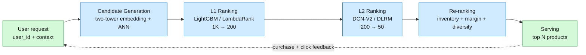
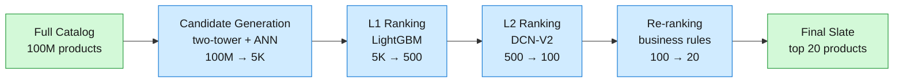
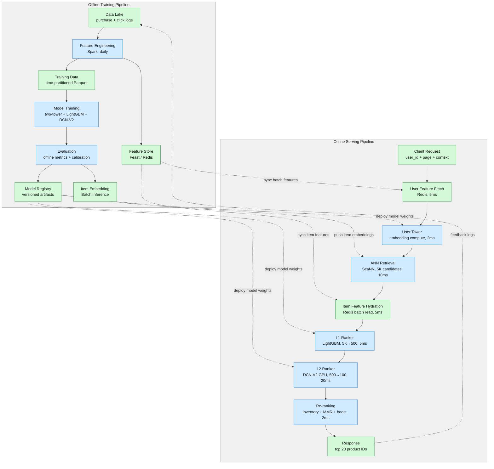

An e-commerce platform with 100M+ products and tens of millions of daily active users needs to show each visitor a personalized list of products they are most likely to purchase.

<!--more-->

## 1. Problem & ML framing

An e-commerce platform with 100M+ products and tens of millions of daily active users needs to show each visitor a personalized list of products they are most likely to purchase. The product problem: a user lands on the homepage, a category page, or a search results page, and the system must surface the right products from an enormous catalog — products they didn't know existed, products relevant to their current shopping intent, products that complement what is already in their cart. Getting this right means more purchases, higher average order value, and users who return. Getting it wrong means scroll-past items and abandoned sessions.

The ML task is **learning-to-rank for personalized product retrieval and ranking**: given a (user, candidate items, context) triple, produce a scored, ordered list of N items. The input combines the user's purchase and browsing history, the product catalog with metadata and content, and session context (device, time of day, page type, session depth). The output is a ranked list — the top K items rendered on page. The **business objective** is to maximize purchase conversion rate and revenue per visit. The **ML objective** is to train a ranking model whose top-K predictions maximize purchase probability, formulated as a combination of pointwise and pairwise ranking losses with purchase-weighted examples.

A single model scoring 100M products per request is infeasible at the required latency. The system runs as a four-stage funnel: **candidate generation** narrows the corpus from millions to thousands via embedding-based retrieval, **L1 ranking** scores those thousands to hundreds with a tree-based ranker operating on dense features, **L2 ranking** refines to tens with a deep model that learns high-order feature interactions, and **re-ranking** applies business rules — inventory awareness, margin boosts, diversity constraints — to produce the final slate.

## 2. Requirements

**Functional**

- FR1: Show N personalized products on page load for every user session
- FR2: Respect real-time inventory — never recommend out-of-stock products
- FR3: Re-score recommendations on interaction (add-to-cart, category click) within the session
- FR4: Surface new products to users with matching interests within hours of listing
- FR5: Cross-sell complementary products on product detail and cart pages
- FR6: Adapt recommendations as user behavior shifts across sessions and over weeks

**Non-functional**

- NFR1: p99 end-to-end latency under 100ms from request to rendered slate
- NFR2: Serve 100K+ QPS at peak across homepage, category, and detail pages
- NFR3: New user interactions reflected in recommendations within 1 minute
- NFR4: Model retrained daily; item embeddings refreshed within 1 hour of catalog updates

*Out of scope: search ranking and query understanding, ad placement and sponsored product ranking, inventory forecasting and demand prediction, pricing optimization, email and push notification recommendation digests.*

## 3. Metrics

**Offline**

- **Recall@K (K=100, 500, 1000):** Fraction of held-out purchased products that appear in the top-K candidates from retrieval. The primary retrieval metric — purchases missed at this stage cannot be recovered by downstream rankers.
- **nDCG@K (K=20, 50):** Normalized discounted cumulative gain on held-out purchase events, with purchases weighted by item price. Captures both that the right items appear and that they appear near the top.
- **MAP@K (K=20, 50):** Mean average precision over the ranked list, measuring how early purchased items appear. Complements nDCG by penalizing late placements of relevant items more heavily.
- **HitRate@K per user activity decile:** Fraction of users with at least one purchase among the top-K, stratified by prior purchase frequency. Heavy buyers dominate aggregate metrics; this breakdown catches regressions for light and new users.

**Online**

- **Purchase conversion rate (north star):** Purchases / sessions with recommendations shown. The direct link to the business objective — a lift here means more revenue.
- **Revenue per visit:** Total purchase dollar value per session. Guards against a model that optimizes for cheap impulse buys at the expense of high-value purchases.
- **Click-through rate:** Clicks on recommended products / impressions. A leading indicator — a CTR drop precedes a conversion drop by hours to days.
- **Catalog coverage (guardrail):** Fraction of the catalog that receives at least one impression per day. Prevents the model from collapsing onto a narrow set of popular items.
- **Category diversity (guardrail):** Entropy of recommended categories per session. A declining entropy signals the model over-personalizing into a single category and missing cross-category purchase opportunities.

## 4. Data

**Sources**

- **Purchase logs (tens of millions/day):** user_id, product_id, price, quantity, timestamp, session_id, page context (homepage, category, search, detail). The primary positive signal — a purchase is the strongest indicator of relevance.
- **Click and browse logs (hundreds of millions/day):** product impressions, clicks, add-to-cart events, dwell time on detail pages. Weaker signal than purchases but 100× more abundant and available with sub-second latency.
- **Product catalog (100M+ items):** category tree, brand, price, title, description, bullet points, images, inventory count, listing date, seller metadata. Static attributes refreshed on catalog update.
- **Search query logs:** query text, clicked results, purchased results. Connects user intent to product relevance and provides rich text features for content-based matching.

**Labeling / ground-truth strategy**

Labels are derived from implicit feedback — no explicit ratings needed at this scale. Three tiers cascade through the training pipeline:

1. **Purchase = positive (weight 1.0):** A purchase is the definitive relevance signal. Every (user, product) pair with a confirmed purchase in the training window is a positive example.
1. **Add-to-cart and long dwell = soft positive (weight 0.3–0.5):** A product added to cart but not purchased, or a detail page viewed for 30+ seconds, signals interest. These are included as positive examples with reduced weight in the loss, helping the model learn from the abundant pre-purchase signal.
1. **Impression without click = implicit negative (weight 0.01):** Products shown to the user that received no interaction within the session. Position-bias corrected — an item in position 10 that gets no click is a weaker negative than the same item in position 1.

**Class imbalance**

Purchases are rare — typically 0.5–2% of impressions. The training pipeline handles this through purchase-weighting (positives up-weighted 50×), session-level negative sampling (sample 1–2 negatives per positive from the same session to provide local contrast), and pairwise ranking losses that treat the relative ordering of positive > negative as the learning signal rather than predicting the absolute purchase probability.

**Train / val / test splits**

Strictly time-based to prevent temporal leakage. Train on 60 days of data, validate on the following 7 days, test on the final 7 days. Purchases in the validation and test windows that belong to products or users first seen in those windows are excluded from aggregate features computed during training — computing a "historical purchase rate" feature on validation data that leaks the label inflates offline metrics by 10–20%.

**Scale**

- ~200M user-product interactions per day (clicks, adds, purchases)
- ~100M products in the live catalog
- Training window of 60 days: ~12B interaction events per retraining cycle
- ~5M new products listed per day during peak seasons

## 5. Features

Features are organized into four groups, all computed through a shared feature store that guarantees identical transformations in the offline training pipeline and the online serving path.

**User features**

- **Purchase history embedding:** A 128-dim learned embedding from the user's last 50 purchased product IDs, averaged with recency-weighted decay (λ=0.9 per week). Captures long-term category preferences and price-tier affinity.
- **Browse sequence embedding:** The last 100 viewed/clicked product embeddings, processed through a lightweight temporal encoder (1-layer transformer or GRU) to produce a 128-dim session representation. Captures short-term intent that purchase history misses — a user who usually buys electronics but spent the last 10 minutes browsing cookware.
- **Category affinity vector:** Purchase counts per top-level category over the last 90 days, normalized to a probability distribution. Updated in real time as purchases occur.
- **Price tier preference:** The user's mean, median, and 90th-percentile purchase price over the last 12 months, plus the trend (slope over last 4 weeks). A user whose average purchase price is rising may be ready for higher-tier recommendations.
- **Recency-weighted engagement score:** A scalar computed as Σ (engagement weight × e^{−λ·days_since_interaction}) across clicks (weight 0.1), adds-to-cart (weight 0.5), and purchases (weight 1.0). Decays smoothly — a user who was active last week but not today still gets a non-zero score.

**Item features**

- **Category and subcategory:** One-hot encoded, with a learned embedding for the leaf-node category shared across all models. The category embedding captures semantic relationships the taxonomy encodes explicitly (e.g., "mirrorless cameras" is closer to "DSLR cameras" than to "security cameras").
- **Price and price-percentile:** The item's current price, its percentile rank within its category, and its discount from list price. A $500 item in a category where the median is $50 signals luxury positioning; the model learns to match it to users whose price-tier preference aligns.
- **Brand embedding:** A 64-dim learned embedding from purchase co-occurrence. Users who buy Brand A also tend to buy Brand B — the embedding captures these latent brand affinities without explicit rules.
- **Visual embedding:** A 256-dim embedding from a pretrained vision transformer (ViT) fine-tuned on product images within the catalog. Two products with similar visual style — a minimalist desk lamp and a minimalist clock — embed close together even if they belong to different categories.
- **Description embedding:** A 256-dim text embedding from a pretrained sentence encoder over the product title and description. Enables content-based matching: "waterproof hiking boots" matches "all-weather trail shoes" even if they are in different leaf categories and have no co-purchase history.
- **Popularity and freshness:** Impressions and purchases in the last 7 days (smoothed with a Bayesian prior per category), days since listing, and a velocity score (impressions/hour trend). Popularity provides a strong cold-start fallback; freshness ensures new items have a path to discovery.
- **Inventory count:** Real-time stock level. Products with zero inventory are filtered at retrieval time — no amount of relevance can convert an out-of-stock item.

**Context features**

- **Device type:** Mobile, desktop, tablet. Mobile users tend toward quicker, lower-value purchases; desktop users browse longer and buy higher-ticket items. The model learns separate interaction patterns per device.
- **Time of day and day of week:** Encoded as cyclical features (sin/cos of hour and day). Evening browsing is more exploratory; weekday mornings are more task-oriented.
- **Page type:** Homepage (discovery-oriented), category page (browsing within a known interest), product detail page (cross-sell and similar-item), cart page (complementary add-ons). Each page type implies a different recommendation intent, encoded as a one-hot feature.
- **Session depth:** Number of interactions in the current session. Early-session recommendations favor broad discovery; late-session recommendations narrow toward purchase intent.

**Cross features**

- **User × category affinity:** The fraction of the user's purchases in each category, multiplied by the item's category membership. A strong direct signal — a user who buys 80% electronics should see electronics recommendations weighted higher.
- **Co-purchase frequency:** How often this item and the user's recently viewed items were purchased together in the same session. Powers the "frequently bought together" signal in cross-sell placements.

**Feature store and online/offline parity**

Every feature definition lives in a shared transformation library imported by both the offline Spark pipeline and the online serving infrastructure. Batch features (user purchase history embedding, category affinity, item popularity) are precomputed daily and cached in Redis with a 1-hour refresh. Real-time features (session browse sequence, inventory count, co-purchase frequency) are computed at request time from in-memory session state and a Redis lookup. The online feature server logs the exact feature vector served for each request; the daily training pipeline reads these logs rather than recomputing from raw events, guaranteeing the same feature distribution at training and serving time.

## 6. Model

### Baseline: popularity × collaborative filtering

Before any deep model, a simple baseline establishes the performance floor. Global popularity (purchase count in the last 7 days, category-normalized) multiplied by item-item collaborative filtering (cosine similarity between item co-purchase vectors) produces a scored list. No personalization beyond category-level — the same top items appear for all users browsing the same category. This baseline takes under 5ms to compute, requires no model training (just daily aggregation jobs), and achieves a conversion rate roughly 60–70% of the eventual deep model. It also serves as the fallback when the deep serving path exceeds its latency budget.

### Multi-stage ranking funnel

Scoring 100M items with a deep model per request is infeasible at p99 < 100ms. The funnel splits the problem into stages of decreasing candidate set size and increasing model complexity:

#### Candidate generation: two-tower embedding + ANN

The retrieval stage maps users and products into a shared 256-dim embedding space where cosine similarity predicts purchase probability. The user tower encodes the user's purchase history, browse sequence, and category affinities into a dense vector. The item tower encodes product metadata — category, brand, price, visual and description embeddings — into the same space, plus an item bias term that captures each product's innate popularity independent of the user.

Training uses **sampled softmax**: for each positive (user, purchased_item) pair, sample 1,000 random negatives from the catalog and compute the softmax over the 1,001 candidates. The loss is categorical cross-entropy: the model must assign the highest score to the true purchased item among the sampled set. This approximates the full softmax over 100M items while keeping training tractable. In-batch negatives — items from other examples in the same mini-batch — provide additional negative signal at zero extra cost.

At serving time, the item tower is run offline over the entire catalog, producing L2-normalized embedding vectors stored in a ScaNN index with 4-bit quantization. The user tower is run online at request time (a small forward pass on CPU, ~2ms), and the resulting user embedding queries the ScaNN index for the top 5,000 candidates by approximate cosine similarity. ScaNN achieves >99% recall@5000 with 4-bit quantization on a 100M-item index at ~10ms query latency.

**Tradeoff:** A two-tower model captures user-item affinities through a dot product, which learns linear relationships in the embedding space but cannot model complex feature interactions (e.g., the joint effect of user price sensitivity and item discount depth). That is deferred to the downstream rankers.

#### L1 ranking: LightGBM LambdaRank

The L1 ranker scores the 5,000 retrieval candidates down to 500. At this scale, a deep model would be too slow for the latency budget; tree-based models are an order of magnitude faster while handling dense tabular features well. LightGBM with LambdaRank objective treats ranking as a pairwise problem: for each user, the model learns to order purchased items above non-purchased items. The gradient at each step is proportional to the NDCG change from swapping a pair's positions, so the model directly optimizes the offline ranking metric.

Features are the full set of user, item, context, and cross features — roughly 400 dimensions after encoding. The model trains on the last 60 days of data, ~12B examples, with purchase-weighted sampling so positives comprise ~30% of each training batch. Training completes in ~2 hours on a 32-core CPU node. Hyperparameters (max depth, num leaves, learning rate) are tuned via Bayesian optimization every two weeks.

**Tradeoff:** LightGBM cannot learn feature interactions it hasn't been explicitly given — a raw feature cross like "user_price_tier × item_discount_percent" must be explicitly added as a feature. The L2 ranker handles the high-order interactions L1 misses.

#### L2 ranking: DCN-V2

The L2 ranker scores the 500 L1 candidates down to 100 using a deeper model with automatic feature interaction learning. DCN-V2 combines two parallel sub-networks:

**Cross network:** Each layer computes *x_{l+1} = x_0 ⊙ (W_l x_l + b_l) + x_l*, where *x_0* is the input feature vector and ⊙ is element-wise multiplication. Each successive layer adds polynomial feature interactions of increasing degree — layer 1 captures pairwise crosses, layer 2 captures 3-way crosses, and so on. Two to three cross layers learn interactions like "user in top-10% price tier × item is 30% off × category is luxury goods × device is mobile" without explicit feature engineering.

**Deep network:** A stack of fully connected ReLU layers (256 → 128 → 64) learning implicit representations that the cross network's polynomial form cannot capture — non-linear combinations like saturating purchase frequency effects.

The two outputs are concatenated and passed through a final dense layer to produce a purchase probability. The loss is binary cross-entropy with purchase-weighted positives. Training runs on 4–8 GPUs with data parallelism, ~4 hours for the full 60-day window.

**Tradeoff:** DCN-V2 provides stronger ranking than LightGBM alone, but at higher inference latency (~20ms on GPU for a 500-candidate batch vs ~3ms for LightGBM on 5K candidates on CPU). This is why L2 only scores 500 candidates — the budget is spent where it has the most impact on final ranking quality.

#### Re-ranking: business rules and constraints

The re-ranker takes the top 100 L2 candidates and produces the final 20-product slate. Four operations apply in sequence:

1. **Inventory filter:** Drop products with stock ≤ 0. Non-negotiable — an out-of-stock recommendation is worse than no recommendation.
1. **Category diversity:** Greedy MMR (Maximal Marginal Relevance) where each next selection maximizes *score(v) − λ · max_{s∈selected} similarity(v, s)*, with similarity computed as the Jaccard index of shared category ancestors. λ = 0.2 keeps recommendations diverse without overwhelming relevance. Ensures the top-20 slate does not collapse into 15 laptop chargers.
1. **Margin boost:** Products with above-median margin receive *score ← score × (1 + β · margin_percentile)* with β = 0.05. A small additive signal that tilts ties toward higher-margin items without letting a high-margin but irrelevant product displace a highly relevant one.
1. **Freshness boost:** Products listed in the last 7 days receive *score ← score × (1 + α · max(0, 1 − days_since_listing/7))* with α = 0.1. A 1-day-old product gets a 8.6% boost; a 6-day-old gets 1.4%. Small enough to break ties among similarly scored candidates without distorting relevance.

## 7. Architecture

#### Offline training pipeline

**Components:** Apache Spark (feature engineering on ~200M events/day), GPU cluster (two-tower and DCN-V2 training), CPU training nodes (LightGBM), Feast feature store, MLflow model registry, ScaNN index builder.

**Flow:**

1. **Data ingestion.** Raw purchase, click, and impression logs land in a data lake (Parquet, partitioned by hour). The daily pipeline joins impressions to their eventual session outcomes — a click on an impression from day 1 whose purchase happened on day 2 is labeled after day 2's data lands. The labeling window is 48 hours: if a click does not lead to a purchase within 48 hours, it is a negative example.
1. **Feature engineering.** A Spark job computes batch features — user purchase history embeddings (last 50 purchases, recency-weighted average), category affinities, item popularity and Bayesian-smoothed purchase rates, co-purchase frequency matrices — and pushes them to the feature store. The same job logs the exact feature values for each training example so the online feature server can replay them during model evaluation.
1. **Model training.** Three models train sequentially, each consuming the output of the previous stage's data preparation:
  - **Two-tower retrieval:** Trains on (user_id, purchased_item_id, sampled_negative_ids) triples. The user tower processes user features; the item tower processes item features. Trained with sampled softmax loss on 4 GPUs, ~6 hours.
  - **LightGBM L1 ranker:** Trains on the full feature vector with LambdaRank objective on a 32-core CPU node, ~2 hours.
  - **DCN-V2 L2 ranker:** Trains on the full feature vector with binary cross-entropy (purchase-weighted) on 8 GPUs, ~4 hours.
1. **Evaluation.** Each model is evaluated on the held-out 7-day test set against its respective offline metric — Recall@K for retrieval, nDCG@K for ranking. The DCN-V2's calibration (predicted vs. actual purchase rate per decile) is checked. If any model underperforms the previous production version by more than 1% on its primary metric, the push is blocked and on-call is paged.
1. **Model registry and artifact push.** Validated checkpoints are versioned and registered in MLflow. Item embeddings from the two-tower model are L2-normalized and pushed to the ScaNN index builder, which constructs a new quantized index. User tower weights, LightGBM model files, and DCN-V2 weights are pushed to the serving infrastructure where they are loaded into in-memory caches for online inference.

#### Online serving pipeline

**Components:** API gateway, user feature server (Redis), user tower inference (CPU), ScaNN ANN server, item feature server (Redis), LightGBM inference (CPU), DCN-V2 inference server (GPU), re-ranking service.

**Flow:**

1. **Request arrives (1ms).** The API gateway receives a recommendation request — user_id, page_type, device, session_id, and any in-session interaction context — and routes it to the serving pipeline.
1. **User feature fetch (3–5ms).** Batch user features (purchase history embedding, category affinity, price tier) are read from Redis. Session features (browse sequence from the last 30 minutes) are maintained in an in-memory session store with write-through to Redis for durability.
1. **User tower embedding (2ms).** The user tower forward pass computes the 256-dim user embedding from the fetched user features. Runs on CPU — the tower is small (~2M parameters) and a GPU transfer would cost more in latency than it saves.
1. **Candidate generation via ANN (8–12ms).** The user embedding queries the ScaNN index for the top 5,000 product IDs by cosine similarity. ScaNN with 4-bit quantization and anisotropic vector quantization achieves >99% recall@5000 at this latency. The index is rebuilt daily from freshly computed item embeddings and hot-swapped with zero downtime.
1. **Item feature hydration (3–5ms).** Batch-read item features for the 5,000 candidates from the item feature store — category, price, brand, visual embedding, description embedding, popularity, inventory count. Features are stored in Redis, keyed by product_id, with a pipeline batch-read fetching all 5,000 in a single round-trip.
1. **L1 ranking (3–5ms).** LightGBM scores all 5,000 candidates on CPU using liblightgbm. The model takes the full feature vector and outputs a relevance score. The top 500 by score advance to L2.
1. **L2 ranking (15–25ms).** DCN-V2 scores the 500 candidates in a single forward pass on GPU. Batching 500 candidates amortizes the GPU transfer overhead. The model outputs a purchase probability for each candidate, and the top 100 by probability advance to re-ranking.
1. **Re-ranking (1–2ms).** The business rule layer filters by inventory, applies MMR for category diversity, applies margin and freshness boosts, and selects the final top 20.
1. **Response assembly (1ms).** The 20 product IDs, scores, and metadata are packaged and returned.

**Latency budget (p99):** Feature fetch (8ms) + user tower (2ms) + ANN retrieval (12ms) + item hydration (5ms) + L1 (5ms) + L2 (25ms) + re-rank (2ms) + overhead (5ms) ≈ 64ms, well within the 100ms budget. At median, the pipeline completes in ~30ms.

**Serving scale:** 100K QPS peak across all recommendation surfaces (homepage, category, detail, cart). The retrieval stage (user tower + ANN) handles all traffic on ~200 CPU cores across 25 replicas. The L1 ranker handles all traffic on ~50 CPU cores. The L2 ranker is the bottleneck — GPU inference on 8 GPUs across 4 replicas, each GPU handling ~25 QPS of 500-candidate batches.

**Design consideration:** The feature store is the linchpin for training-serving parity. Every feature — the user's category affinity, an item's Bayesian-smoothed purchase rate, the co-purchase score — has exactly one canonical implementation in a shared Python library. The offline Spark pipeline imports it; the online feature server imports it. When a feature definition changes, the old and new versions co-exist in the feature store during a transition period: the model is trained on the new feature version, shadow-deployed, and validated before the old version is deprecated. The alternative — maintaining two separate implementations — guarantees silent drift that degrades ranking quality over weeks until someone notices the conversion rate has dropped.

**Retraining feedback loop.** Every recommendation request — which products were shown at which positions, which were clicked, which were purchased — is logged to the data lake within minutes. The daily training pipeline reads these logs, joins to purchase outcomes, and retrains all three stages. The trained models are evaluated against the held-out test set; if they pass, they advance to shadow deployment where they score live traffic alongside the production model without affecting the served slate. After 4 hours of shadow monitoring — verifying latency, prediction calibration, and offline metric alignment — the new model is promoted to production. If the shadow model shows a regression, it is discarded and on-call is alerted.

## 8. Deep dives

### DD1: Cold start — new products and new users

**Problem.** A new product has zero purchase history, zero click data, and zero co-purchase edges. Its two-tower item embedding is untrained, its popularity score is zero, and the LightGBM features that depend on historical aggregates (purchase rate, velocity, co-purchase frequency) are all null. The funnel assigns it a near-zero score and it never surfaces — the product is invisible. A new user has no purchase history, no category affinity, and no browse sequence embedding. Their user tower embedding is a random initialization or a near-zero vector, producing random or global-popular retrievals that miss their actual interests.

**Approach 1: Content-only item tower path for new products**

The item tower has a parallel content-only path that bypasses engagement features entirely. During training, the tower processes visual embeddings, description embeddings, category, brand, and price — all available at listing time. The engagement features (purchase rate, click velocity, co-purchase edges) feed into a separate path whose output is added to the content-path output. At serving time for a new product, the engagement features are zero-filled and the content-only signal carries the embedding. A newly listed pair of waterproof hiking boots embeds near other waterproof hiking boots based on description similarity and visual style — before a single user clicks on them. As engagement accumulates over the first few hundred impressions, the engagement path's contribution grows and refines the placement.

**Challenges:** Content features alone get the category and broad style right but miss fine-grained relevance — two hiking boots with similar descriptions and images may have very different quality, fit, or durability. The first hundred purchasers provide the corrective signal. **Edge case:** A product in a genuinely new subcategory (e.g., a novel gadget) has no nearby content neighbors; the content path produces a weak embedding that lands in a sparse region of the space. The system falls back to seller-level priors — if the seller's existing products have a known audience, the new product inherits a weighted average of their embeddings as a starting point.

**Approach 2: Demographic and context bootstrapping for new users**

A new user's first request initializes their profile from demographic and context signals — device type, time of day, referring channel, and optionally a minimal onboarding signal (selected interest categories). The first page of recommendations is a 70/30 mix: 70% from a popularity-based model filtered through the declared or inferred category affinities, 30% exploration across diverse high-margin categories. As the user clicks, browses, and purchases, their user embedding updates in real time — each new interaction triggers an embedding update that nudges the user vector toward the interacted product's item embedding, with a learning rate proportional to the interaction strength: clicks move it slightly (lr=0.01), purchases move it significantly (lr=0.1).

**Challenges:** A user who signs up, clicks one product, and leaves has received a negligible embedding update. Their next session days later may still produce near-random recommendations. Mitigated by decaying the exploration fraction slowly — day 1 is 70/30 popular/explore, day 7 is 85/15, day 30 is 95/5. **Edge case:** A user who uses the platform exclusively for one niche (e.g., only buys aquarium supplies) never explores other categories. The narrow recommendation slate misses cross-sell opportunities. The re-ranking stage's category diversity MMR injects a small amount of cross-category variety even for narrow users, which generates the data needed to expand their profile.

**Decision:** Content-only item path + progressive user profiling. Together they cover both sides of the cold-start problem using the architecture's natural separation of user and item representations. The alternative — a separate cold-start model trained only on content features — would require maintaining a second serving path and a promotion rule for when to switch, adding operational complexity without outperforming the joint approach.

**Rationale:** The two-tower architecture separates user and item representations, which makes cold start solvable without a separate system. The user side bootstraps from context and learns incrementally; the item side bootstraps from content and is refined by engagement. Each side improves independently as signal accumulates.

> [!TIP]
> Key insight: the two-tower architecture's separation of user and item towers is precisely what makes cold start solvable on both sides without special-case infrastructure. A new user needs a better user embedding (bootstrapped from context, updated online). A new item needs a better item embedding (bootstrapped from content, updated as engagement arrives). The architecture hands you both levers for free — you just need to pull them.

### DD2: Position bias and its correction

**Problem.** Users click the first product in a recommendation slate more often than the fifth, regardless of relevance — position bias. A product shown in position 1 gets 3–5× more clicks than the same product in position 10. The model observes this in training data — position-1 items have higher click and purchase rates — and learns that position 1 items are "better." The next training cycle reinforces the bias: items the model scores highly get placed at position 1, they get more clicks, the clicks confirm the high score, and the model becomes more confident. Popular items get more impressions because the model recommends them, generating more purchase data, making them appear even more popular — a positive feedback loop that narrows the effective catalog to a small set of winners and starves new and niche products of discovery traffic.

**Approach 1: Position as a feature, dropped at serving time**

During training, add the displayed position (1–20) as an input feature to both the L1 and L2 rankers. The model learns how position independently influences click and purchase probability — it discovers that position 1 has a base click rate 4× higher than position 10, all else equal. At serving time, set the position feature to a constant value (position 1, or a neutral value like position 5) for all candidates. The model's prediction is now "how likely would this product be to get clicked/purchased if shown in position 1" — putting all candidates on equal footing. This removes position bias from the ranking score without architectural changes.

**Approach 2: Inverse Propensity Weighting (IPW) in the ranking loss**

Weight each training example's loss contribution by the inverse of the empirical click probability at the position where it was shown: *w = 1 / P(click \| position)*. A click on an item shown in position 10 — where the base click rate is 0.02 — receives weight 50× in the loss. A click on an item in position 1 — where the base click rate is 0.10 — receives weight 10×. This corrects position bias in the loss function: the model cannot reduce its loss by simply predicting higher scores for position-1 items, because those examples are down-weighted. The propensity weights are computed daily from the prior week's impression logs, smoothed with a Bayesian prior (a Beta distribution per position) to stabilize estimates for low-traffic positions.

**Challenges:** IPW amplifies noise — a rare click in position 20 with propensity 0.005 receives weight 200×, and if that click was accidental (the user meant to click position 19), the model overfits to a single noisy example. Clipping weights to a maximum of 100× prevents the worst instability, and the daily recalculation keeps propensities aligned with current user behavior as UI layouts change. **Edge case:** A UI redesign moves the recommendation widget from a vertical list to a horizontal scroll — the position effect changes fundamentally. The IPW weights from the old layout are stale the moment the new layout ships. The serving pipeline logs the UI layout version alongside each impression; the training pipeline segments propensity calculation by layout version and uses only the matching layout's data.

**Decision:** Position-as-feature (Approach 1) for both rankers, with IPW (Approach 2) as a complementary loss correction for the L2 ranker's purchase prediction task only. The position-as-feature approach is simple, stable, and requires no hyperparameter tuning beyond choosing the serving-time constant. IPW adds a modest improvement for the high-stakes purchase prediction — where position bias is strongest since purchases are rarer and the bias compounds — without burdening every stage.

**Rationale:** Position-as-feature is well-understood and robust: the model learns the position effect directly from data, the serving-time override is trivial, and there is no risk of propensity estimation errors destabilizing training. IPW applied only to the purchase-loss term in the L2 ranker captures the additional correction where it matters most, at minimal added complexity.

> [!WARNING]
> The popularity feedback loop is the downstream consequence of uncorrected position bias. Without correction, the model converges on a self-reinforcing set of ~10K products that receive 90% of impressions, and catalog coverage drops to single-digit percentages. Position-as-feature breaks the loop at the scoring level; IPW breaks it at the loss level. Together, they keep the funnel open to the long tail.

### DD3: Training-serving skew and feature freshness

**Problem.** Features computed in the daily training pipeline differ from the same features computed at serving time because the data is fresher, the computation path is different, or the window semantics diverge. A training pipeline computes "user purchase count in the last 7 days" on Monday morning over a clean, complete dataset — the exact value on Monday at 3am UTC. The online serving pipeline computes the same feature on Monday at 3pm UTC from a Redis cache that was last refreshed at 2am. The values differ because 13 hours of new purchases happened in between. Over time, the model's predictions degrade because it was trained on stale feature distributions — a phenomenon known as training-serving skew. The skew is silent: there is no crash, no latency spike, just a gradual decline in ranking quality that shows up in online metrics weeks after it started.

**Approach 1: Feature logging at serving time**

Every recommendation request writes the exact feature vector that was used — every feature value, every embedding dimension, every aggregate — to a feature log alongside the model version and timestamp. The daily training pipeline reads these logged feature vectors directly, joins them to eventual purchase outcomes, and trains on the exact distribution the model operated on. This guarantees bitwise feature parity: the model trains on what it saw, not what the batch pipeline thinks it should have seen. The cost is ~500 GB/day of feature logs for 100K QPS. The benefit is that any discrepancy — a stale cache, a clock skew, a code change in the feature transformation — is captured in the log and the model adapts to the distribution it actually encounters.

**Approach 2: Example Age and feature freshness as explicit features**

The age of a feature relative to training time carries information the model can exploit. A product listed 3 hours ago has unstable engagement patterns; a product listed 3 months ago has stable ones. The **Example Age** feature encodes the hours between product listing and training example timestamp. During training, this ranges from 0 to ~2,160 (90 days). During serving, this is set to the actual age — telling the model "this product is newer than anything in your training window most of the time, adjust accordingly." Similarly, the **Feature Freshness** feature encodes the hours since each time-sensitive feature was last updated — the user's purchase count is "as of 2 hours ago," the item's co-purchase frequency is "as of 24 hours ago." The model learns that staler features warrant lower confidence and should be discounted relative to fresher signals.

**Decision:** Both approaches together. Feature logging provides the gold standard for training-serving parity — the training pipeline trains on the exact same data the model scores on. Example Age and Feature Freshness handle the temporal dimension of skew that even perfect logging cannot fix: the meaning of features changes with time, and those temporal semantics are part of what the model needs to learn.

**Rationale:** Feature logging is what large-scale recommender deployments converge on after discovering that "just use the same code in both pipelines" inevitably drifts — a dependency version bump, a Spark configuration change, a different handling of nulls between Python and Java. The temporal features give the model the vocabulary to express what it already knows: newer items behave differently, and stale features are less reliable.

**Edge cases:**

- **Feature store cache invalidation during a request:** The user's category affinity is read, the user makes a purchase between the read and the model scoring, and the next request sees a stale affinity. The gap is under 1 second and affects a single request — not worth the distributed consensus cost to close. The next request will see the updated affinity.
- **Code change in feature transformation:** When the shared transformation library updates (e.g., a new version of the visual embedding model), the feature logs contain old-format embeddings. The training pipeline detects the schema version and recomputes features from raw data for a transition period of 7 days — until the new-format logs cover a full training window.

### DD4: Monitoring, drift detection, and continual learning

**Problem.** User behavior shifts — seasonality changes what people buy in December, a competitor launches and pulls away a demographic, a viral trend creates a spike in a previously dormant category. The model is always trained on a snapshot of the past, and the gap between that snapshot and current reality — **data drift** — silently degrades recommendation quality. Unlike a latency regression or a crash, drift has no sharp signal: purchase conversion declines 0.1% per day for two weeks, someone notices revenue is down 3%, and the root cause requires a week of investigation. The design must detect drift before it becomes a revenue problem, retrain fast enough to close the gap, and have a path for rapid adaptation when daily retraining is too slow.

**Approach 1: Multi-dimensional metric monitoring**

Online metrics are tracked in real time with slices that isolate drift sources:

- **Purchase conversion rate per category:** A drop in electronics with stable home goods suggests a category-specific blind spot, not a system-wide degradation.
- **Purchase conversion per user activity decile:** A drop among heavy users with stable light users suggests the model is forgetting recent high-engagement signals — a freshness problem.
- **Feature distribution drift (KL divergence):** For the top 20 features by model importance, compute the KL divergence between the current hour's serving distribution and the training window's distribution. A feature with divergence >0.2 triggers investigation — the model is scoring inputs it was not trained on.
- **Prediction calibration drift:** Compare the model's predicted purchase probability per decile against the observed purchase rate in hourly windows. If the model predicts a 5% purchase rate for the top decile but the observed rate is 3%, the model is overconfident — ranking order may still be correct (high-scored items are still the best among the candidates), but the absolute probabilities are drifting.
- **Catalog coverage and entropy:** A declining number of distinct products receiving impressions, or a declining entropy of recommended categories, signals the popularity feedback loop tightening.

**Approach 2: Daily retraining with a rolling window**

The primary defense against drift is retraining frequency. A 60-day rolling window means the model trains on the most recent two months of data, with the oldest day dropped and the newest day added each retraining cycle. Daily retraining keeps the model within 24 hours of current behavior under normal conditions. A major shift (e.g., Black Friday purchasing patterns) is partially captured the next day and fully captured within a week as the rolling window rotates over the event.

**Approach 3: Hourly fine-tuning with a replay buffer**

For shifts that cannot wait for the daily pipeline — a viral product category emerging over 4 hours, a competitor outage that drives a flood of new users — the system maintains a replay buffer of the most recent 2 hours of purchase and click data, prioritized by surprise: examples where the model's predicted purchase probability was far from the observed outcome. Every hour, a lightweight fine-tuning step runs on the replay buffer for the DCN-V2 L2 ranker only (the smallest and fastest to update), with a low learning rate (1/10th of the training learning rate) and a small number of steps (100). The fine-tuned weights are deployed as a shadow model; if online metrics improve against the production model over the next hour, the shadow model is promoted. If metrics regress, the fine-tuned weights are discarded.

**Challenges:** Replay-buffer fine-tuning risks catastrophic forgetting — the model adapts to the last 2 hours and forgets the patterns from the prior 60 days. The low learning rate and small step count are the defense: the model is nudged, not retrained. If the shift represents a permanent change (a new category that will persist), daily retraining captures it fully within 24 hours. If the shift is transient (a 4-hour flash sale), the fine-tuning was unnecessary and would have introduced noise if promoted — the shadow deployment gate prevents this.

**Decision:** All three layers. Real-time monitoring detects drift within hours. Daily retraining corrects drift within 24 hours. Hourly fine-tuning handles acute distribution shifts that move faster than the daily pipeline. The fine-tuning layer is the most operationally expensive — it requires an additional training loop, a shadow deployment path, and careful validation — so it is reserved for the L2 ranker only, where the latency budget is sufficient and the ranking quality impact is highest.

> [!TIP]
> Why not online learning on every request? A purchase by a single user updates the model by an infinitesimal amount — one gradient step on one example is noise, not signal. Batching over an hour of replay data with surprise-prioritized sampling provides enough statistical power for a stable update while being fast enough for acute drift. Full online learning per-request would require a fundamentally different serving architecture, introduce instability from outlier examples, and make rollback impossible (there is no "previous model" to revert to — the model is a continuously mutating state).

**Edge cases:**

- **Holiday and weekend patterns:** Purchase conversion spikes on weekends and drops on Monday. A monitoring alert that fires every Monday is a false positive. All monitoring thresholds are computed against the same day-of-week and hour-of-day from the prior 4 weeks, not a raw rolling average.
- **Model rollback:** If the daily retrained model underperforms the previous day's model on the held-out test set (e.g., a data quality issue in the new day's logs), the pipeline automatically retains the previous model for another 24 hours and pages on-call. A stale model is better than a broken one.
- **Shadow promotion gate:** Before a fine-tuned model is promoted, it scores live traffic in parallel with production for 1 hour. The system compares purchase conversion on requests where the shadow and production models disagree. If the shadow model's choices lead to higher conversion, it is promoted. If inconclusive, the shadow keeps running for another hour. If the shadow underperforms, it is killed and the incident is logged for post-mortem — a fine-tuning step that regresses indicates the replay buffer is not representative of current traffic.

## 9. References

1. [Deep Learning Recommendation Model for Personalization and Recommendation Systems](https://arxiv.org/abs/1906.00091) — Naumov et al., arXiv:1906.00091, 2019.
1. [DCN V2: Improved Deep & Cross Network and Practical Lessons for Web-scale Learning to Rank Systems](https://arxiv.org/abs/2008.13535) — Wang et al., WWW 2021.
1. [Modeling Task Relationships in Multi-task Learning with Multi-gate Mixture-of-Experts](https://dl.acm.org/doi/10.1145/3219819.3220007) — Ma et al., KDD 2018.
1. [Deep Neural Networks for YouTube Recommendations](https://static.googleusercontent.com/media/research.google.com/en//pubs/archive/45530.pdf) — Covington et al., RecSys 2016.
1. [Sampling-Bias-Corrected Neural Modeling for Large Corpus Item Recommendations](https://dl.acm.org/doi/10.1145/3298689.3346996) — Yi et al., RecSys 2019.
1. [Monolith: Real Time Recommendation System With Collisionless Embedding Table](https://arxiv.org/abs/2209.07663) — Liu et al., arXiv:2209.07663, 2022.
1. [Practical Lessons from Predicting Clicks on Ads at Facebook](https://research.facebook.com/publications/practical-lessons-from-predicting-clicks-on-ads-at-facebook/) — He et al., ADKDD 2014.
1. [Wide & Deep Learning for Recommender Systems](https://arxiv.org/abs/1606.07792) — Cheng et al., DLRS 2016.
1. [Accelerating Large-Scale Inference with Anisotropic Vector Quantization](https://arxiv.org/abs/1908.10396) — Guo et al., ICML 2020.
1. [Pixie: A System for Recommending 3+ Billion Items to 200+ Million Users in Real-Time](https://arxiv.org/abs/1711.07601) — Eksombatchai et al., WWW 2018.
