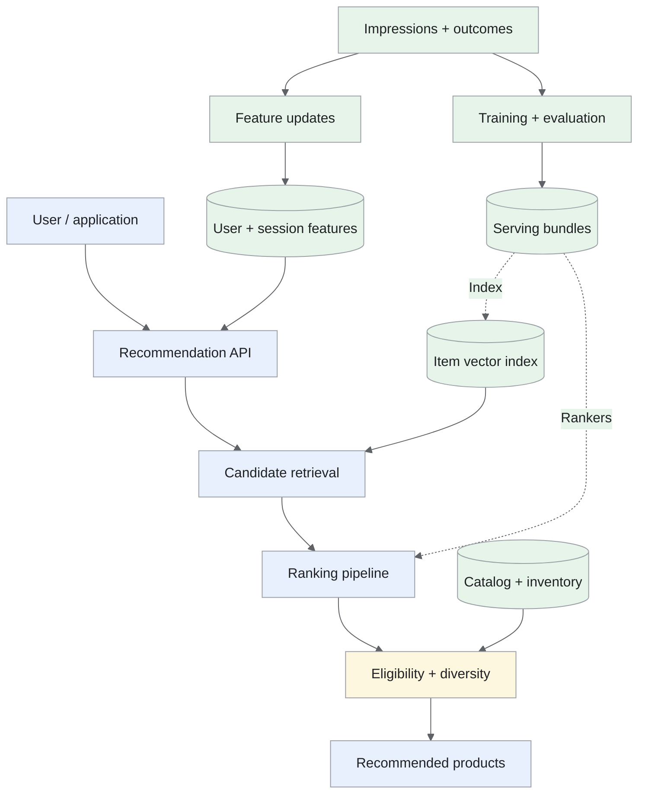
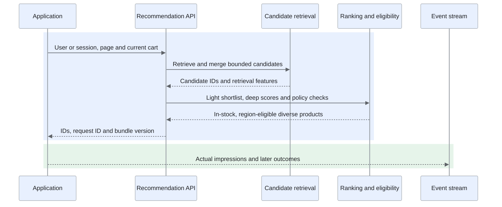
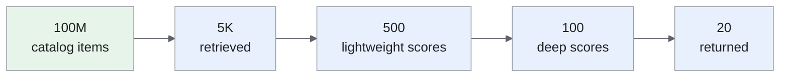
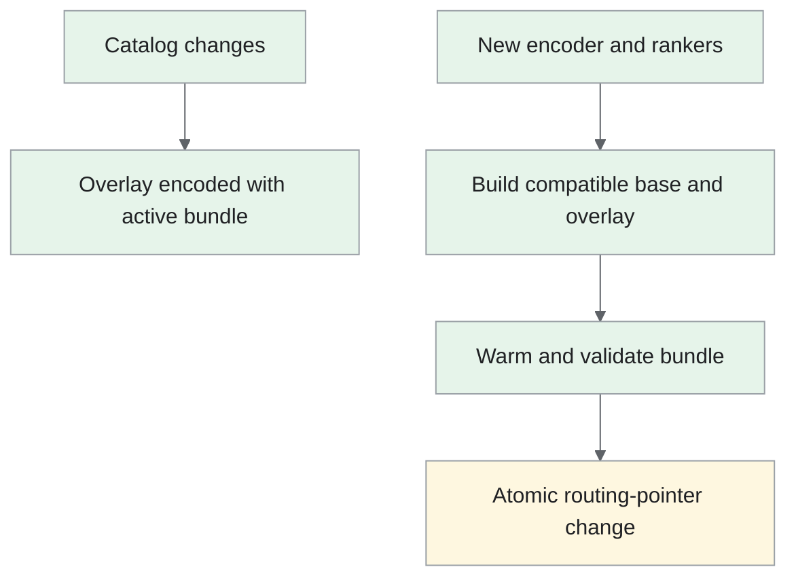

A product-recommendation service that retrieves relevant catalog items, ranks them for the current user and returns an eligible, varied set of products.

<!--more-->

## Problem

A large catalog gives users many choices, but finding useful products takes effort. Recommendations help users discover items that match their interests and the page they are viewing.
The service combines longer-term preferences with recent actions such as viewing a product or adding it to a cart. It retrieves a manageable candidate set, ranks those products and checks availability before returning the recommendations.

## Requirements

### Functional requirements

- **Recommend products.** Return a ranked set for a home page, product page or cart.

- **Use recent intent.** Incorporate views, cart changes and other approved session signals within one minute.

- **Recommend related items.** Support similar products and complementary purchases.

- **Handle cold starts.** Produce useful recommendations for new users and newly listed products.

- **Respect eligibility.** Exclude products that fail the latest availability, region or policy check.

- **Keep the set varied.** Limit repetition while preserving relevance.

- **Collect outcomes.** Record displayed recommendations, clicks and attributed purchases.

### Non-functional requirements

- **Scale:** support 100M catalog items and a peak of 100K recommendation requests/s.

- **Latency:** target p99 below 100ms from request to displayed recommendations in the supported regions.

- **Availability:** target 99.9%, with an eligible popularity-based fallback.

- **Freshness:** reflect session actions within one minute and make new products retrievable within one hour.

- **Quality:** evaluate ranking offline, then measure conversion and user outcomes in controlled experiments.

- **Privacy:** use consented personalization signals and keep private user features out of shared response caches.

## Back-of-the-envelope calculations

- A 256-dimensional float32 embedding uses **1,024 bytes per item**. For 100M products, vectors alone occupy about **102GB**, before index structures and replicas.

- 200M interactions/day is roughly **2,300 events/s on average**. A 60-day training window contains 12B interactions before filtering and sampling.

- An initial funnel retrieves 5,000 candidates, uses retrieval scores to select 500 for the lightweight ranker and applies the deep ranker to the best 100, then returns 20 products. At 100K requests/s, that is **50M cheap-ranking pairs/s** and **10M deep-ranking pairs/s**.

- Serving capacity depends on the measured cost of each stage. Cache hit rates, batch sizes and candidate budgets are part of the load test rather than assumed GPU throughput.

## Core entities

- **Product** holds catalog content and eligibility.

- **UserContext** combines longer-term preferences with current session intent.

- **RecommendationImpression** records what the application actually displayed.

- **RecommendationOutcome** links a later action to an impression.

- **ServingBundle** versions the compatible retrieval models, item index and rankers.

```protobuf
message Product {
  string product_id;
  string category_id;
  string title;
  int64 price_minor_units;
  string currency;
  bool available;
  string catalog_version;
}

message UserContext {
  string user_id;
  string session_id;
  string page_type;
  repeated string recent_product_ids;
  repeated string cart_product_ids;
}

message RecommendationImpression {
  string request_id;
  string product_id;
  int32 position;
  google.protobuf.Timestamp displayed_at;
  string serving_bundle;
}

message RecommendationOutcome {
  string event_id;         // Deduplication key for retries
  string request_id;
  string product_id;
  string action;           // Click, cart addition, purchase
  google.protobuf.Timestamp occurred_at;
}

message ServingBundle {
  string bundle_id;
  string user_tower_uri;
  string item_tower_uri;
  string item_index_uri;
  string ranker_uri;
  string feature_schema;
}

```
## API

```yaml
recommend:
  method: POST
  path: /v1/recommendations
  identity: authenticated user or anonymous session
  body:
    page_type: product
    context_product_ids: [product_123]
    cart_product_ids: []
    limit: 20
  response:
    request_id: rec_456
    product_ids: [product_789, product_234]
    serving_bundle: rec_v12
    serving_mode: personalized

record_event:
  method: POST
  path: /v1/recommendation-events
  fields: [event_id, request_id, product_id, action, occurred_at]
  actions: [impression, click, cart, purchase]

```
## High-level design

Retrieval finds products that might be relevant. A lightweight ranker removes weak candidates, a deeper ranker scores the remaining set and a final stage applies eligibility and diversity rules.
The offline pipeline learns from displayed recommendations and their outcomes. It publishes the retrieval models, item index and rankers as a compatible bundle.


```mermaid
%%{init: {'theme':'base','themeVariables':{'primaryColor':'#e8f0fe','primaryTextColor':'#202124','primaryBorderColor':'#9aa0a6','lineColor':'#5f6368','secondaryColor':'#e6f4ea','tertiaryColor':'#fef7e0','actorBkg':'#e8f0fe','actorBorder':'#9aa0a6','actorTextColor':'#202124','noteBkgColor':'#fef7e0','noteTextColor':'#202124','noteBorderColor':'#9aa0a6','signalColor':'#5f6368','signalTextColor':'#202124','labelBoxBkgColor':'#fef7e0','labelBoxBorderColor':'#9aa0a6'}}}%%
flowchart TB
  U["User / application"] --> API["Recommendation API"]
  CONTEXT[("User + session features")] --> API
  API --> RET["Candidate retrieval"]
  IDX[("Item vector index")] --> RET
  RET --> RANK["Ranking pipeline"]
  RANK --> RULES["Eligibility + diversity"]
  CATALOG[("Catalog + inventory")] --> RULES
  RULES --> RESULT["Recommended products"]
  EVENTS["Impressions + outcomes"] --> UPDATE["Feature updates"]
  UPDATE --> CONTEXT
  EVENTS --> TRAIN["Training + evaluation"]
  TRAIN --> REG[("Serving bundles")]
  REG -.->|"Index"| IDX
  REG -.->|"Rankers"| RANK
classDef request fill:#e8f0fe,stroke:#9aa0a6,color:#202124;
classDef data fill:#e6f4ea,stroke:#9aa0a6,color:#202124;
classDef control fill:#fef7e0,stroke:#9aa0a6,color:#202124;
class U,API,RET,RANK,RESULT request;
class CONTEXT,IDX,CATALOG,EVENTS,UPDATE,TRAIN,REG data;
class RULES control;

```
## Storage

- **[PostgreSQL](/designs/tech-postgresql/):** own product records and inventory state, with sharding by product ID as the catalog grows. Batched ID reads support hydration and the final eligibility check; transactions support catalog and inventory changes.

- **[Redis](/designs/tech-redis/):** serve recent session actions and frequently read feature vectors. Include feature timestamps and distinguish a missing value from an observed zero.

- **ScaNN item index:** hold product embeddings in a sharded, replicated approximate-nearest-neighbor index. Keep immutable base snapshots in object storage and a compatible recent-item overlay.

- **[Kafka](/designs/tech-kafka/) and object storage:** ingest idempotent impression and outcome events, then retain Parquet datasets for training and replay.

- **Bundle registry:** store manifests and release metadata. Promote a bundle only after its user encoder, item encoder, index and ranker contracts have been checked together.

A cached inventory value can become stale. The final eligibility check reads the inventory service's current state; checkout separately reserves stock.

## From request to response

### Recommendation flow


```mermaid
%%{init: {'theme':'base','themeVariables':{'primaryColor':'#e8f0fe','primaryTextColor':'#202124','primaryBorderColor':'#9aa0a6','lineColor':'#5f6368','secondaryColor':'#e6f4ea','tertiaryColor':'#fef7e0','actorBkg':'#e8f0fe','actorBorder':'#9aa0a6','actorTextColor':'#202124','noteBkgColor':'#fef7e0','noteTextColor':'#202124','noteBorderColor':'#9aa0a6','signalColor':'#5f6368','signalTextColor':'#202124','labelBoxBkgColor':'#fef7e0','labelBoxBorderColor':'#9aa0a6'}}}%%
sequenceDiagram
  participant U as Application
  participant A as Recommendation API
  participant R as Candidate retrieval
  participant M as Ranking and eligibility
  participant E as Event stream
  rect rgb(232, 240, 254)
    U->>A: User or session, page and current cart
    A->>R: Retrieve and merge bounded candidates
    R-->>A: Candidate IDs and retrieval features
    A->>M: Light shortlist, deep scores and policy checks
    M-->>A: In-stock, region-eligible diverse products
    A-->>U: IDs, request ID and bundle version
  end
  rect rgb(230, 244, 234)
    U-->>E: Actual impressions and later outcomes
  end

```

Retrieval determines which items can compete, and staged ranking spends expensive inference only on a bounded shortlist. The application reports actual display separately from the server response, so training outcomes join to the same request and item IDs. Eligibility checks remain active on fallback paths.

### Recommending products for a page

- **Build the context.** Resolve the user or anonymous session, page type, current product and cart contents. Fetch the feature vector in a batch.

- **Retrieve candidates.** Compute a user/context embedding and query the item index. Add a bounded set of popular, similar-item or co-purchase candidates for coverage.

- **Rank in stages.** Trim the retrieved set by retrieval score, use inexpensive features to rank the shortlist, then apply the deeper model to its strongest candidates.

- **Check eligibility.** Batch-check stock, regional availability and policy. Refill from the ranked reserve candidates when items are excluded.

- **Form the set.** Apply category or brand diversity limits and return the final product IDs with a request ID.

- **Record display and outcomes.** The application reports impressions only for items it actually rendered. Later clicks and purchases refer to that request ID.

Ranking every product for every request would be prohibitively expensive. Retrieval and stage-specific candidate limits bound that work.

### Responding to a cart change

Publish the cart event with its event ID and timestamp. The feature pipeline deduplicates it and updates the session's product set.
A cart-page request includes its current cart snapshot, allowing the service to use the latest submitted context even while the event pipeline catches up. Complementary-product retrieval and ranking then use that snapshot.

### Adding a new product

Generate an embedding from the product's content using the active item encoder. Insert it into a recent-item index and apply the same eligibility checks as existing products.
Compact recent items into the next base index. Publish the compacted index with the corresponding encoder version; the cutover watermark determines which overlay records remain necessary.

### Handling a dependency failure

If personal features are unavailable, rank from page context and regional popularity. If learned serving is unavailable, return a precomputed popularity or co-purchase list through the same eligibility check.
An inventory outage has a different consequence: serve only entries covered by an approved freshness policy, or return a smaller set. Record the fallback mode and dependency failure separately.

## Deep dives

### How much ranking work can each stage afford?

A model that captures detailed user-product interactions may be too expensive to apply to thousands of candidates at peak traffic. Candidate retrieval also determines which products the ranker ever gets to consider.


```mermaid
%%{init: {'theme':'base','themeVariables':{'primaryColor':'#e8f0fe','primaryTextColor':'#202124','primaryBorderColor':'#9aa0a6','lineColor':'#5f6368','secondaryColor':'#e6f4ea','tertiaryColor':'#fef7e0','actorBkg':'#e8f0fe','actorBorder':'#9aa0a6','actorTextColor':'#202124','noteBkgColor':'#fef7e0','noteTextColor':'#202124','noteBorderColor':'#9aa0a6','signalColor':'#5f6368','signalTextColor':'#202124','labelBoxBkgColor':'#fef7e0','labelBoxBorderColor':'#9aa0a6'}}}%%
flowchart LR
  A["100M<br/>catalog items"] --> B["5K<br/>retrieved"]
  B --> C["500<br/>lightweight scores"]
  C --> D["100<br/>deep scores"]
  D --> E["20<br/>returned"]
classDef request fill:#e8f0fe,stroke:#9aa0a6,color:#202124;
classDef data fill:#e6f4ea,stroke:#9aa0a6,color:#202124;
classDef control fill:#fef7e0,stroke:#9aa0a6,color:#202124;
class B,C,D,E request;
class A data;

```
- **Popularity or co-purchase lists:** Precompute inexpensive context-based lists. They provide a dependable fallback, but established products dominate and the current user or cart receives limited detailed matching.

- **One ranker over a large candidate set:** Apply the same detailed scorer to every retrieved product. The path is simple and avoids a light-stage cutoff, but feature reads and inference scale with thousands of candidates per request.

- **Embedding retrieval with staged ranking — recommended:** Use a shared vector space for coverage, then inexpensive shortlisting and bounded deep scoring. Compute is controlled; recall can be lost in retrieval or shortlisting and all encoders, indexes and rankers must remain compatible.
**Use two-tower retrieval followed by lightweight and deep ranking.** The user tower and item tower map context and products into a shared vector space. Item vectors are precomputed; a request computes only its context vector and retrieves nearby products. A 100M-item catalog cannot be deeply scored on each request. We accept staged recall loss and multiple serving artifacts, then measure useful-candidate retention at each cutoff alongside conversion and peak inference cost.
[ScaNN](https://arxiv.org/abs/1908.10396) offers approximate retrieval with a memory/recall trade-off. Measure candidate recall against a higher-quality retrieval baseline before tuning the downstream ranker.
Start with a tree-based lightweight ranker. Use a [DCN V2](https://arxiv.org/abs/2008.13535) deep ranker when explicit feature interactions improve held-out ranking and business outcomes enough to justify its cost.
Choose candidate counts from recall and latency curves. Profile every stage with the same workload and reserve time for eligibility checks. If deep ranking misses its deadline, the service can return the eligible lightweight-ranked set and record that mode.
**A single recommendation request through the funnel**
Build the user vector from the current cart/page and eligible historical activity, then query the compatible product index. Merge embedding candidates with co-purchase, popularity and recent-product sources by product ID. Keep source tags so recall loss can be traced to retrieval rather than blamed on the ranker.
The light stage batch-fetches inexpensive features for the candidate set. The deep stage receives only its shortlist plus richer cross-features: for example, whether a product's category matches recent purchases or whether its price lies near the user's observed range.

```text
Stage             Work performed                         Failure behavior
Retrieval         ANN plus bounded alternative sources   use surviving sources
Light ranking     batched cached features                public/context fallback
Deep ranking      richer user-product interactions       retain light order
Final selection   current eligibility and diversity      remove invalid items

```

Measure how many relevant products survive each cutoff. A fast light ranker that drops most eventual purchases saves compute by destroying recall. Use a teacher-ranked evaluation set and mature purchase outcomes to plot retained quality against candidate count. Reserve a deadline slice for final catalog hydration so a timely model response does not become a late API response.

### How do we keep features and indexes compatible?

A user's current-session vector changes frequently, while an index containing the full catalog is rebuilt less often. Updating only one tower can make user and item vectors incompatible.

- **Rebuild every artifact together:** Publish one fully rebuilt set whenever catalog data changes. Consistency is easy to reason about, but a large index rebuild delays small updates and spends substantial compute.

- **Update artifacts independently:** Refresh each encoder, ranker and index on its own schedule. Data appears quickly, but vectors from different encoder versions can become incomparable and regress retrieval.

- **Immutable bundles with compatible overlays — recommended:** Coordinate model-space releases while encoding new products with the active bundle. This separates catalog freshness from model changes; overlays, watermarks and warm rollback bundles add storage and cutover work.
**Publish a bundle containing both towers, the base index, rankers and feature definitions.** A new product is encoded using the bundle currently serving requests, and its overlay carries that version. Catalog updates are frequent, while a model-space change affects the entire index. We accept overlay reconciliation and duplicate warm artifacts so requests always use compatible user/item towers and fresh eligible product data.
Online session features update within one minute. Training features are joined by their availability at the recommendation time, including delayed events. Shared feature definitions and recorded serving snapshots keep offline evaluation comparable to the live path.
Warm the replacement index and models before switching traffic. Rollback restores the previous complete bundle; recent-item overlays are rebuilt or routed to the matching encoder version.
**Versioned artifacts during a catalog update**
The base index contains vectors generated by item encoder E1. A new product enters a small overlay after E1 encodes its content. When E2 is ready, build a new base plus overlay using E2, load query encoder U2 and its rankers, then switch the bundle pointer only after the matching artifacts are healthy.


```mermaid
%%{init: {'theme':'base','themeVariables':{'primaryColor':'#e8f0fe','primaryTextColor':'#202124','primaryBorderColor':'#9aa0a6','lineColor':'#5f6368','secondaryColor':'#e6f4ea','tertiaryColor':'#fef7e0','actorBkg':'#e8f0fe','actorBorder':'#9aa0a6','actorTextColor':'#202124','noteBkgColor':'#fef7e0','noteTextColor':'#202124','noteBorderColor':'#9aa0a6','signalColor':'#5f6368','signalTextColor':'#202124','labelBoxBkgColor':'#fef7e0','labelBoxBorderColor':'#9aa0a6'}}}%%
flowchart TB
    C["Catalog changes"] --> O["Overlay encoded with active bundle"]
    B["New encoder and rankers"] --> I["Build compatible base and overlay"]
    I --> V["Warm and validate bundle"]
    V --> R["Atomic routing-pointer change"]
classDef request fill:#e8f0fe,stroke:#9aa0a6,color:#202124;
classDef data fill:#e6f4ea,stroke:#9aa0a6,color:#202124;
classDef control fill:#fef7e0,stroke:#9aa0a6,color:#202124;
class C,O,B,I,V data;
class R control;

```

Store each product's content version in the index record. A replayed older catalog update cannot replace a newer vector or undo a deletion. A request pins its bundle ID, while the final catalog check applies current eligibility.
For historical training, reconstruct item availability and inventory signals at impression time. Today's inventory is not a valid feature for last week's displayed product. Missing features carry masks; feature-schema or embedding-dimension mismatches block release instead of producing a superficially valid vector.

### How do we recommend new users and products?

A new user has no reliable interaction history. A new product has content but little evidence about clicks or purchases.

- **Popularity baseline:** Choose established products for the page or region. It works without personal history, but concentrates exposure and gives new products little evidence.

- **Content-based retrieval:** Represent products from approved attributes and users from current context. New products are searchable immediately; content similarity has limited evidence about purchase intent.

- **Context baseline with controlled exploration — recommended:** Combine page/cart context and content vectors with a bounded eligible-item exploration allocation. Learning can reach less-exposed products; some slots have lower expected relevance and require exposure-probability logging.
**Combine context-based popularity with content embeddings, then reserve a bounded exploration budget.** For a new user, use the current page, cart, language and region. For a new product, use its title, category and other approved attributes. The service must work before reliable user or product histories exist. We accept a measured exploration cost and keep eligibility checks authoritative, while purchase outcomes establish whether broader exposure is actually useful.
Keep missing behavioral features explicit. A product with no purchase history differs from a product that received many impressions and converted poorly.
Evaluate cold-start cohorts separately. Exploration assignments are logged so later training can account for how an item became visible; eligibility rules apply to explored products as well.
**Make cold-start behavior explicit**
For a first-time shopper on a running-shoes page, retrieve category/region popularity and content-similar shoes without inventing a long-term preference vector. As clicks and cart actions arrive, update the session representation and gradually increase its influence.
A new shoe can enter content retrieval after encoding its title, category and attributes. Its purchase-count feature is missing, not evidence of poor conversion. Exploration draws from eligible new items and logs the probability of their actual slot assignment. A slot cap prevents exploration from replacing most of a strong established slate.
Evaluate new users and products separately using time-based “first seen” definitions. Randomly withholding history from established products can test mechanics, but it is not a complete substitute for genuinely new-product behavior.
An exploration purchase becomes an attributed outcome only after joining the request ID, item ID and label window. Record whether a product was later unavailable so zero conversion can be distinguished from a failed purchase opportunity.

### What outcome should the model learn?

Clicks arrive quickly, but a product that attracts clicks may produce few purchases. Purchase labels arrive later and are influenced by whether the product was shown.

- **Click-only training:** Use abundant early interaction labels. Feedback arrives quickly, but the scorer can favor enticing products that seldom convert or satisfy the customer.

- **Purchase-only training:** Optimize the transaction outcome directly. Business alignment is clearer, but labels are sparse and delayed, and exposed non-purchases must wait for the attribution window to mature.

- **Purchase-oriented learning with auxiliary outcomes — recommended:** Use mature purchase evidence and supporting click/cart signals, adding shared heads only when they improve the purchase objective. This shares information; loss-weight competition and target leakage require per-head and purchase-quality checks.
**Begin with a purchase-oriented ranking objective supported by click and cart features.** Wait for the attribution window before marking an impression as a non-purchase; start with 48 hours and validate that window against the product's actual purchase delay. Conversion is the primary outcome, while clicks and carts provide earlier supporting evidence. We accept delayed purchase labels and evaluate multi-task interference before maintaining additional heads; auxiliary click gains alone do not justify promotion.
Deduplicate outcomes and group train/test splits chronologically. Join features as they existed at impression time, excluding future cart changes and purchases. Negative sampling and class weights are recorded in the training manifest.
Use ranking metrics such as NDCG and recall for offline comparisons. Calibrate probability outputs separately if they are used for expected-value scoring. Controlled experiments measure conversion, revenue, returns and latency before wider rollout.
**Construct an impression label**
An impression log records which item occupied which slot, the serving bundle, request-time features and the exposure policy. Purchase events carry stable order/item identities. Join them within the attribution window and deduplicate repeated order notifications before producing labels.

```text
10:00 recommendation shown → 10:05 cart action → next day purchase
       snapshot stored          auxiliary label        purchase label matures

```

The proposed purchase-oriented ranker scores relevance using calibrated purchase probability; cart and click signals improve representation and diagnose the funnel. Sample negatives only from actual eligible impressions, recording their sampling rate. A product never shown has no observed purchase opportunity for that request.
Fit calibration on natural-prevalence held-out data. If serving multiplies probability by expected value, separately validate order value and returns; a click-trained score is not automatically a purchase probability. Keep a protected chronological test period and allow the label window to mature before comparing candidates.

### How do we improve the set without distorting relevance?

Repeatedly showing near-identical products limits discovery. Business constraints such as category diversity or margin also change which items a user sees.

- **Pure score order:** Return the highest independently scored products. The learned objective is preserved, but near-duplicates can occupy much of the slate and reduce discovery.

- **Hard diversity rules:** Enforce fixed category or brand counts. Product requirements are predictable, but abrupt exclusions can remove strongly relevant items and reduce the available set.

- **Eligibility followed by a bounded diversity reranker — recommended:** Select products using relevance with a small redundancy penalty among already chosen items. Variety becomes explicit; penalty tuning can trade conversion for diversity and adds slate-level evaluation work.

Users need a useful set of available products rather than many copies of the same choice. We accept a bounded relevance tradeoff, measuring conversion and discovery together instead of treating variety as a universal improvement.
**Apply eligibility first, then a small, explicit diversity penalty.** Maximum marginal relevance is one option: score each next item using its relevance and similarity to products already selected.

```python
slate_score = relevance_score - diversity_weight * max_similarity_to_selected

```

Tune the diversity weight using relevance, conversion and duplicate-category exposure. Margin or freshness boosts have their own bounded weights and experiments, making their effect on the ranking visible.
Past rankings influence the training data. Use controlled exploration with logged assignment probabilities for exposure correction; a predicted click probability is a different quantity. Apply weighting only where the logging policy gives adequate support, and cap extreme weights.
**The reranker's actual selection loop**
Start with an empty slate. On each step, remove candidates that violate a hard constraint, calculate relevance minus similarity to already selected items, and choose the highest remaining score. Repeat until the slate is full or eligible candidates run out.

```python
selected = []
while candidates and len(selected) < limit:
    eligible = apply_constraints(candidates, selected)
    if not eligible:
        break
    item = max(eligible, key=lambda x:
        x.relevance - weight * max_similarity(x, selected, default=0))
    selected.append(item)
    candidates.remove(item)

```

Keep relevance and similarity on compatible scales; an arbitrary similarity penalty can dominate an uncalibrated ranking score. Use content/category similarity to reduce near-duplicate products, then evaluate whether variety improves discovery without hurting the intended shopping task.
Hard stock/region/safety checks precede this optimization. Record the original model order and the final slate so business boosts and diversity changes are auditable. When too few products qualify, return a shorter slate or a declared fallback rather than weakening eligibility.
