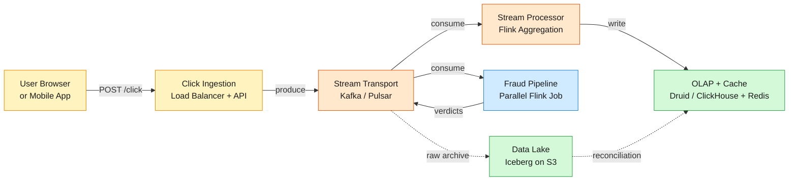
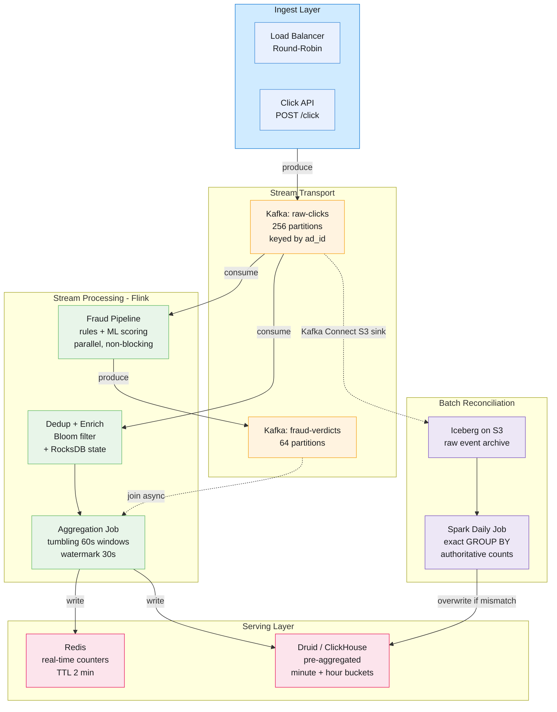

An ad platform processes clicks from millions of users across thousands of publisher sites.

<!--more-->

## 1. Problem

An ad platform processes clicks from millions of users across thousands of publisher sites. Advertisers need near-real-time visibility into campaign performance — clicks per ad, minute by minute, sliced by geography and device — so they can adjust bids, pause underperforming creatives, and enforce daily budgets. At ~200K clicks/sec peak (~10B clicks/day), the system must ingest, deduplicate, aggregate, and serve queries under one minute of freshness while maintaining exactly-once financial accuracy for billing. Fraud is pervasive: a significant fraction of clicks are bots, click farms, or accidental double-taps that must be filtered before they inflate advertiser bills.



## 2. Requirements

**Functional**

- FR1: Track ad clicks via redirect; log event with ad ID, timestamp, user, geo, device.
- FR2: Aggregate clicks per ad per minute as unique counts with configurable time windows.
- FR3: Query click metrics filtered by campaign, geo, device type, and arbitrary time range.
- FR4: Return Top-N ads by click volume over a sliding window (last hour, last 24h).
- FR5: Detect and exclude fraudulent clicks (bots, click farms, rapid repeats) before billing.
- FR6: Track per-campaign budget consumption with pacing alerts.

**Non-functional**

- NFR1: Sub-minute data freshness — click appears in aggregates within 60 seconds of arrival.
- NFR2: 99.9% financial accuracy after batch reconciliation runs (daily).
- NFR3: Sustain 200K clicks/sec peak, P99 ingest API latency under 100ms.
- NFR4: Exactly-once billing: no click double-counted, no click silently dropped from financial records.

*Out of scope: Real-time bidding (RTB), ad serving and ranking, creative asset management, conversion attribution beyond click tracking, advertiser self-service campaign creation UI.*

## 3. Back of the envelope

- **Click write throughput:** 200K events/sec × 1 KB/event = 200 MB/s ingress → requires ≥3 Kafka brokers at 100 MB/s each.
- **Raw storage per day:** 10B clicks × 1 KB = 10 TB/day raw → ~3.6 PB/year uncompressed, drives the need for columnar compression and tiered retention.
- **Aggregated query volume:** ~10M active ads × 1,440 minute buckets/day ≈ 14B aggregate rows/day. Peak query load ~10K QPS from advertiser dashboards → OLAP engine must serve pre-aggregated data, not scan raw events.

## 4. Entities

```
click_event {
  click_id:       uuid PK        ← client-generated; dedup key
  ad_id:          bigint CK      ← partition key
  campaign_id:    bigint
  event_time:     timestamp      ← event time, not ingestion time
  user_id:        string         ← hashed, anonymized
  geo:            string         ← ISO-3166 country code
  device_type:    enum           ← mobile, desktop, tablet
  impression_id:  uuid?          ← links click to impression; null if client-side
}

click_aggregate {
  ad_id:          bigint CK      ← partition key
  campaign_id:    bigint
  minute_bucket:  timestamp CK   ← truncated to minute
  geo:            string
  device_type:    enum
  click_count:    bigint         ← unique clicks in this bucket
}

fraud_verdict {
  click_id:   uuid PK
  verdict:    enum           ← clean, bot, invalid, suspicious
  score:      float          ← ML confidence 0.0-1.0
  ruled_at:   timestamp
}

campaign_budget {
  campaign_id:   bigint PK
  daily_limit:   bigint         ← integer micros, avoids float drift
  spent_micros:  bigint
  last_updated:  timestamp
}
```

### API

- `POST /click` — record a click event; redirects browser to landing page URL. Request body: `click_id`, `ad_id`, `impression_id`, `timestamp`, `user_id`, `geo`. Returns `302 Found` with `Location` header.
- `GET /metrics?campaign_id={id}&start={ts}&end={ts}&geo={cc}&device={type}&granularity={1m|1h|1d}` — aggregated click counts with dimension filters. Returns array of `{minute, clicks}`.
- `GET /top-ads?window={1h|24h}&limit={n}&geo={cc}` — Top-N ads by click count in the given window. Returns array of `{ad_id, campaign_id, clicks}`.
- `GET /campaigns/{id}/budget` — current budget consumption: `{daily_limit, spent, remaining, pacing_pct}`.
- `GET /campaigns/{id}/fraud-summary` — fraud breakdown: `{total_clicks, clean, bot, suspicious, excluded}`.

## 5. High-Level Design



#### FR1: Click tracking and redirect

- **Components:** `Client Browser → Load Balancer → Click API → Kafka`
- **Flow:**
  1. Browser sends `POST /click` with `{click_id, ad_id, timestamp, ...}` to the Click API.
  1. API validates HMAC signature on `click_id` (prevents spoofed events) and rejects malformed payloads with `400`.
  1. API produces the event to `raw-clicks` Kafka topic, keyed by `ad_id`. Messages use `acks=all` and `enable.idempotence=true`.
  1. API returns `302 Found` with landing page URL in `Location` header — browser follows redirect immediately; click tracking completes in background.
- **Design consideration:** Server-side redirect adds one network hop (~50ms intra-region) but guarantees every click is tracked. Client-side redirect (browser POSTs tracking pixel in parallel) is faster but ~2-5% of clicks are lost to ad blockers and connection drops on mobile. For billing-grade accuracy, server-side redirect is the safe default. The API layer is stateless — any instance can handle any request — so horizontal scaling behind a round-robin load balancer is straightforward.

#### FR2: Aggregate clicks per ad per minute

- **Components:** `Kafka → Flink Dedup Job → Flink Aggregation Job → Redis + OLAP`
- **Flow:**
  1. Flink Dedup Job consumes `raw-clicks`, keyed by `ad_id`. For each event, it checks a local RocksDB-backed Bloom filter (keyed on `click_id`, TTL 5 minutes).
  1. If `click_id` is already in the filter, the event is a duplicate — drop it. Otherwise, insert into filter and forward to the aggregation downstream.
  1. Flink Aggregation Job applies a 60-second tumbling window on event time. Each window emits per-`ad_id` counts.
  1. Window results are written to Redis (key: `ad:{id}:minute:{ts}`, value: count, TTL 120s) for sub-millisecond dashboard reads, and to the OLAP store for persistent querying.
  1. Watermark advances at `max_event_time - 30s`. Events arriving after their window closes are routed to a side-output for late-event reconciliation, not dropped.
- **Design consideration:** RocksDB state in Flink grows with the product of unique `click_id`s in the dedup window × partition count. At 200K events/sec, a 5-minute dedup window contains ~60M unique IDs. With Bloom filter at 1% false-positive rate (~10 bits per entry), that's ~75 MB per Flink task manager — easily fits in memory.

#### FR3: Query metrics with multi-dimensional filtering

- **Components:** `OLAP (Druid/ClickHouse) → Query API`
- **Flow:**
  1. Advertiser dashboard calls `GET /metrics?campaign_id=42&start=...&end=...&geo=US&device=mobile`.
  1. Query API rewrites the request into a range scan on the `click_aggregates` table, filtering on the partition key `(ad_id)` and the dimension columns `(geo, device_type)`.
  1. OLAP engine returns pre-aggregated rows. For time ranges spanning multiple granularities (e.g., 3 hours), the engine picks the coarsest available pre-aggregation — hourly rollups rather than scanning 180 minute buckets.
  1. If the time range includes the current incomplete minute, the Query API merges OLAP results (for completed minutes) with Redis real-time counters (for the current minute) before returning.
- **Design consideration:** Pre-aggregation at write time (Flink computes minute buckets before landing in OLAP) trades query flexibility for read speed. Advertisers seldom need arbitrary dimension combinations — the subset of `{geo, device, ad_id}` covers 95%+ of real queries. Maintaining pre-aggregated tables for all 2^3 = 8 dimension combinations costs ~8× storage but eliminates scan-time GROUP BY entirely, keeping P99 query latency under 50ms even at 10K QPS.

#### FR4: Top-N popular ads

- **Components:** `Flink Top-N Job → Redis Sorted Set`
- **Flow:**
  1. A separate Flink job consumes the aggregated minute counts and maintains a sliding-window Top-100 per geo region.
  1. Internally, it uses Flink's `KeyedProcessFunction` with a min-heap of size N per key. Each new count updates the heap; the heap is emitted every 10 seconds.
  1. Results are written to a Redis Sorted Set: `ZADD top-ads:US:hour <clicks> <ad_id>`. The set is trimmed to N entries after each write.
  1. `GET /top-ads` reads directly from Redis — no OLAP query needed. The Sorted Set's `ZREVRANGE` returns the Top-N in O(log N + N).
- **Design consideration:** A dedicated Top-N Flink job is cleaner than querying the OLAP store at read time, which would require a windowed `ORDER BY clicks DESC LIMIT 100` scan across all ads — expensive at 10M+ active ads. The in-process heap approach keeps the hot path purely in Flink state and Redis, with sub-10ms read latency.

#### FR5: Fraud detection

- **Components:** `Kafka → Fraud Flink Job → Rules Engine → ML Model → Kafka (verdicts)`
- **Flow:**
  1. A parallel Flink job consumes `raw-clicks` — it does not block the main aggregation pipeline. Both jobs read from the same topic independently.
  1. Phase 1 (rules, <10ms): check IP blocklist, user-agent bot patterns, geo-impossible velocity (same user clicking from two continents in 5 seconds), click-to-impression time under 100ms (accidental double-tap proxy).
  1. Phase 2 (ML scoring, <100ms): extract feature vector from in-memory feature store (publisher CTR history, IP velocity, device fingerprint entropy) and score with a pre-loaded XGBoost model.
  1. Verdicts (`clean`, `bot`, `suspicious`) are written to `fraud-verdicts` Kafka topic, keyed by `click_id`.
  1. The Aggregation Job asynchronously joins fraud verdicts. Clean clicks are counted normally; bot clicks are dropped; suspicious clicks are flagged but not dropped (human review later). Budget pacing always uses clean-only counts.
- **Design consideration:** Fraud runs in parallel because the fraud pipeline's latency budget (~100ms for ML scoring) must not gate the <1-minute freshness target for dashboard metrics. Verdicts arrive asynchronously — the dashboard may briefly show clicks that a few seconds later are classified as bot and retroactively excluded. This is acceptable because dashboards are operational, not financial. Billing always runs against batch-reconciled, fraud-excluded counts.

#### FR6: Budget pacing

- **Components:** `Flink Aggregation Job → Campaign Budget State (RocksDB) → Budget API`
- **Flow:**
  1. The Aggregation Job maintains per-campaign `spent_micros` in Flink keyed state (RocksDB).
  1. Each minute's clean click count is multiplied by the campaign's CPC bid to compute incremental spend. Spend is applied to the running counter.
  1. When `spent_micros` exceeds 80% of `daily_limit`, the job emits a pacing alert to a Kafka topic consumed by the ad serving system (out of scope for this design, but the signal is available).
  1. `GET /campaigns/{id}/budget` reads from a materialized view in the OLAP store, refreshed from Flink state every 10 seconds via a changelog stream.
- **Design consideration:** Budget state lives in Flink RocksDB rather than an external database because it needs transactional consistency with the click aggregation itself — a checkpoint that includes both the click count and the budget deduction is trivially atomic within a single Flink operator. Integer micros (e.g., $0.01 CPC = 10,000 micros) avoid the float accumulation errors that plagued early ad platforms running on MySQL `DECIMAL(10,4)` over billions of rows.

## 6. Deep dives

### DD1: Exactly-once processing chain

**Problem.** Financial correctness demands that every click is counted exactly once for billing, but the system distributes processing across 256 Kafka partitions and dozens of Flink task managers — network partitions, broker failures, and checkpoint restarts routinely cause duplicate writes or silent drops. The chain spans three hops: Kafka producer → Flink dedup state → OLAP write. Each hop is a potential duplication or loss point.

**Approach 1: Transactional outbox with idempotent writes**

Every Flink operator writes its output inside a Kafka transaction. The Flink job's checkpoint barrier flows through the operator topology: when a barrier reaches an operator, it snapshots its state (RocksDB) and commits the Kafka producer transaction for all messages emitted since the last barrier. If the job restarts, it reloads the last checkpoint and replays from the last committed offset. Downstream — Redis and the OLAP store — use `click_id` as an upsert key, so duplicate writes from replay are harmless.

```javascript
Flink checkpoint interval: 120 seconds
  |
  v
[Checkpoint Barrier N] → flows through operator DAG
  |
  ├── Snapshot RocksDB state (dedup filter, window buffers)
  ├── Commit Kafka transaction (all outputs since barrier N-1)
  └── Acknowledge checkpoint to JobManager
```

**Challenges:** Checkpoint overhead is proportional to state size. A 75 MB RocksDB snapshot per task manager × 32 task managers = 2.4 GB written to distributed filesystem every 120 seconds — ~20 MB/s sustained. At 120-second checkpoint interval, failure recovery replays up to 2 minutes of events (~24M clicks), which takes ~10-15 seconds of catch-up processing.

**Edge case:** If a checkpoint fails to commit (e.g., distributed filesystem timeout), the job retries the checkpoint. While retrying, it continues processing and accumulating state — but none of those outputs are committed. If the next checkpoint also fails and the job is eventually restarted, up to 4 minutes of clicks are replayed. The idempotent upsert in the OLAP store absorbs this cleanly, but it means the dashboard may show stale data during the catch-up window.

**Approach 2: At-least-once hot path + batch reconciliation**

Deliberately use at-least-once semantics on the streaming path — no transactions, no checkpoint barriers. Flink writes each window result to Redis and OLAP with a simple `UPSERT`. Duplicate writes (from retries, replays) inflate counts briefly. A nightly Spark job reads the raw event archive (Iceberg on S3), recomputes exact `GROUP BY (ad_id, minute_bucket)` counts, and overwrites the OLAP aggregates. The batch job is the authoritative source; the stream path is approximate and fast.

**Challenges:** Every advertiser-facing number changes overnight, sometimes by 2-5% (typical duplicate + late-event correction). Advertisers who made intra-day decisions based on dashboard numbers may find their budgets were off. Customer trust erodes when the 9 AM dashboard says $10K spent but the end-of-day invoice says $10,300.

**Edge case:** If the batch job fails (Spark cluster down, Iceberg table corruption), the system has no authoritative count until it recovers. A 24-hour gap without reconciliation is a financial reporting risk. Production systems run the batch job with multi-region redundancy and maintain a 3-day retry window.

**Approach 3: Two-phase commit with Pinot upsert**

Kafka transactional producers, Flink's `TwoPhaseCommitSinkFunction`, and an OLAP store that supports atomic upsert (Apache Pinot with upsert compaction, or Druid with `REPLACE` segment granularity). Flink's checkpoint triggers a `preCommit` → the sink writes data to a staging location → `commit` atomically promotes the staged data. Pinot's upsert merges rows by primary key on compaction, making even non-idempotent writes converge to the correct count.

```javascript
Flink TwoPhaseCommitSink:
  preCommit()  → flush window results to Pinot staging
  commit()     → atomic promote (Pinot segment swap)
  abort()      → discard staging, no side effects
```

**Challenges:** Pinot upsert compaction adds ~10 seconds of latency between write and query visibility, edging close to the sub-minute freshness target. At 10B events/day, Pinot's per-minute segments produce 1,440 segments/day/ad — compaction merges these into hourly and daily segments to keep query performance acceptable, but the compaction backlog can spike during traffic surges.

**Edge case:** Pinot's `REPLACE` mode (full segment replacement) has stronger atomicity guarantees than `UPSERT` mode but requires re-ingesting the entire time window on each checkpoint. For 60-second windows at 200K events/sec, that's 12M events per window — a full segment replace every 60 seconds is I/O-heavy. `UPSERT` mode with per-row primary keys is the better fit for this workload.

**Decision:** Approach 1 — transactional outbox with idempotent writes. Approach 2's advertiser trust erosion from overnight number changes is a business risk that outweighs the operational simplicity. Approach 3's Pinot-specific compaction latency is a real concern at <60s freshness; Druid and ClickHouse — the two leading OLAP engines in this space — have more mature exactly-once integration through the Kafka indexing service (Druid) and `ReplacingMergeTree` (ClickHouse) without the staging-latency overhead.

**Rationale:** Kafka transactions + Flink checkpoints with 120-second intervals give us a 30-40% overhead (state snapshot I/O) — higher than the at-least-once path but well within capacity at 200K events/sec. MillWheel's production experience proved that exactly-once stream processing at this scale is achievable: billing pipelines run on exactly-once semantics and have done so since 2013. The key insight is that 120 seconds is acceptable because window results are emitted to Redis immediately (for dashboard freshness) while the transactional commit guards the durable OLAP write — the dashboard sees numbers quickly through the non-transactional Redis path, and the OLAP path is a few seconds behind but guaranteed correct.

**Edge cases:**

- **Checkpoint timeout on state growth:** If dedup state grows beyond RocksDB's write buffer (e.g., a flash-mob attack generating millions of unique `click_id`s), checkpoint snapshots time out. Mitigation: RocksDB write buffer limit at 256 MB per task manager, with spill-to-disk; Bloom filter false-positive rate relaxed from 1% to 2% under memory pressure, reducing bit-per-entry from 10 to 7.
- **Kafka transaction ID fencing:** If a Flink task manager is declared dead (heartbeat timeout) but is still running (split-brain), its producer transaction must be fenced. Kafka's `transactional.id` with epoch fencing ensures the zombie producer's `commit` is rejected — no duplicate writes leak through.

### DD2: Hot shard mitigation

**Problem.** Click traffic is wildly uneven across ads. A Super Bowl ad or a viral product launch can receive 50,000 clicks/sec — 25% of total system throughput — all keyed to a single `ad_id`. Because Kafka partitions by `ad_id`, all of that ad's events land in one partition, and the Flink task processing that partition becomes a bottleneck. Its event-time watermark stalls, its RocksDB state bloats, and downstream windows for that ad emit late or never. Meanwhile, 255 other partitions sit mostly idle.

**Approach 1: Salted key with two-stage aggregation**

Add a random salt (0..N) to the Kafka key. Instead of `ad_id:42`, the key becomes `ad_id:42:salt:3`. This spreads a hot ad's events across N salt buckets, each landing in a different Kafka partition. The first-stage Flink job aggregates per `(salt, ad_id, minute_bucket)`. A second-stage Flink job (or the same job's downstream operator) reads these salt-bucket aggregates and merges them by `(ad_id, minute_bucket)` into the final count.

```javascript
Stage 1 key: (ad_id, salt_bucket, minute_bucket)
Stage 2 key: (ad_id, minute_bucket)

Example: ad_id=42, salt=0..7
  Stage 1 emits: (42, 0, 12:01) → 6,200 clicks
                 (42, 1, 12:01) → 6,100 clicks
                 ...
  Stage 2 merges: (42, 12:01) → 49,600 clicks
```

**Challenges:** Two-stage aggregation doubles the number of Flink operators and network shuffles. Salt bucket count N is a trade-off: too small (N=4) and the hot ad still concentrates load; too large (N=64) and every ad gets unnecessary fan-out overhead. For non-hot ads (~95% of traffic), the salt adds pointless overhead.

**Edge case:** The second-stage operator that merges salt buckets for a hot ad can itself become a bottleneck — now instead of one hot partition in stage 1, you have one hot merge operator in stage 2. Mitigation: key the second stage by `(ad_id, minute)` with the same parallelism, and use Flink's `KeyedProcessFunction` with timer-based emission — the merge happens in-memory per key and is lightweight.

**Approach 2: Dynamic re-partitioning with back-pressure signaling**

Use a control plane that monitors per-partition throughput via Kafka's `__consumer_offsets` metrics. When a partition's bytes-in rate exceeds a threshold (e.g., 50 MB/s), the control plane sends a signal to the Click API: "for ad_id=42, start appending a random salt." The API dynamically switches to salted keys for that ad only. When traffic subsides, the salt is dropped. Flink processes both salted and unsalted keys transparently — the aggregation logic handles both shapes.

**Challenges:** The control plane adds a new failure mode: if the monitoring pipeline is delayed, the hot shard saturates before re-partitioning kicks in. The switch from unsalted to salted keys mid-stream means the Flink job sees events for the same ad with two different key shapes, requiring state migration logic.

**Approach 3: Partition by hash(click_id) instead of ad_id**

If partitioning is by `click_id` (random by nature), events naturally spread evenly across partitions. Flink then performs a shuffle (re-partition by `ad_id`) after deduplication, before aggregation. The dedup stage has uniform load; the shuffle distributes aggregation work.

**Challenges:** The shuffle is a full cross-partition network transfer — every event moves from its ingestion partition to its aggregation partition. At 200K events/sec × 1 KB, that's 200 MB/s of intra-cluster network traffic, latencies of 5-20ms per hop. For an ad-tech pipeline where end-to-end latency must be under one minute, a full shuffle per event is acceptable but wasteful. Worse: the dedup Bloom filter must now be globally distributed (or checked after the shuffle), since events for the same `ad_id` arrive on different partitions and the dedup state for that ad is scattered.

**Decision:** Approach 1 — salted key with two-stage aggregation, but with a refinement: apply salting only for ads exceeding a configurable threshold (e.g., 1,000 events/sec), detected in-stream by a Flink `ProcessFunction` that tracks per-key throughput using a simple count-min sketch. Ads below the threshold use the unsalted key `(ad_id, minute)` and skip the second-stage merge. This gives us the best of both: uniform load for the 5% of ads that are hot, zero overhead for the 95% that aren't.

**Rationale:** The two-stage pattern is battle-tested. MillWheel's paper explicitly identifies the single-hot-key problem and recommends two-phase aggregation. Production systems at this scale use the same pattern. The in-stream hot-ad detector (count-min sketch) adds ~1% CPU overhead and avoids the control-plane latency of Approach 2. The overhead for non-hot ads is zero because they never enter the salted path.

**Edge cases:**

- **Threshold oscillation:** An ad hovering around 1,000 events/sec toggles between salted and unsalted modes, causing frequent re-keying. Mitigation: hysteresis — salt is enabled at 1,200 events/sec and disabled at 800 events/sec, with a minimum salt duration of 60 seconds.
- **Salt bucket collision:** Two hot ads hashed to the same salt bucket land in the same partition. The count-min sketch's per-key tracking catches this and can increase the salt range (N) adaptively.
- **State migration on mode switch:** When an ad transitions from unsalted to salted, existing Flink state for the unsalted key must be merged into the salted state. The operator emits a final unsalted partial and starts fresh with salted keys — the merge is deferred to stage 2.

### DD3: Fraud detection pipeline

**Problem.** A significant fraction of ad clicks are invalid — bots, click farms, accidental double-taps, competitor sabotage. Advertisers pay per click; every fraudulent click billed erodes trust and, at scale, represents millions of dollars in disputed charges. Detection must be fast enough to exclude bots from real-time dashboards (seconds) and accurate enough to withstand advertiser audits (batch reconciliation). But fraud detection is computationally expensive — ML model scoring takes 50-100ms per event — and must not gate the <60-second freshness target.

**Approach 1: Inline fraud (blocking, synchronous)**

Every click passes through a fraud check before entering the aggregation pipeline. The Click API calls a fraud service synchronously (RPC or in-process library). Clean clicks proceed; invalid clicks are dropped with a `204 No Content` response. The fraud service maintains a local cache of blocklists and feature vectors.

```javascript
POST /click → validate HMAC → fraud.check(click) → if clean: produce to Kafka
                                                  → if bot: 204, drop
```

**Challenges:** Fraud scoring latency (50-100ms for ML) adds directly to the Click API's P99 latency. At 200K events/sec, the fraud service needs to handle 200K RPS with 50-100ms per request — requiring a fleet of ~200 CPU-heavy instances just for fraud, separate from the Click API tier. Worse, a fraud service outage blocks all click ingestion — the pipeline is only as available as the fraud service.

**Edge case:** The ML model is updated daily. During model deployment, the fraud service briefly serves stale predictions or rejects requests. A blue/green deployment with traffic splitting mitigates this, but the synchronous coupling means even a brief model-loading stall (e.g., 5 seconds to deserialize a 500 MB XGBoost model) pauses all click processing.

**Approach 2: Asynchronous fraud (parallel, non-blocking)**

Fraud detection runs as an independent Flink job, consuming from the same `raw-clicks` topic as the aggregation job. Both jobs process clicks in parallel — the aggregation job counts every click optimistically, and fraud verdicts arrive asynchronously on a separate Kafka topic. The aggregation job joins verdicts when they arrive: clean clicks are confirmed, bot clicks are subtracted from counts, and suspicious clicks are flagged.

```javascript
raw-clicks → ─┬─→ Aggregation Job (counts all clicks, then adjusts)
              └─→ Fraud Job (rules → ML → verdicts)
                         ↓
              fraud-verdicts topic
                         ↓
              Aggregation Job ← joins verdicts, subtracts bots
```

**Challenges:** The dashboard briefly shows inflated numbers before fraud verdicts arrive (typically 1-5 seconds later). If an advertiser queries exactly during this window, they see a count that will soon decrease. This is acceptable for operational dashboards but confusing for less technical users. The join between aggregation state and fraud verdicts requires the Aggregation Job to buffer click counts in state until verdicts arrive — state grows by ~60M clicks/minute × 5 seconds of buffering ≈ 5M entries.

**Edge case:** If the fraud job falls behind (e.g., ML model serving latency spikes), verdicts are delayed by minutes. The aggregation job's state buffer grows proportionally. Mitigation: a timeout on the buffered state (120 seconds) — if no verdict arrives, the click is provisionally classified as clean and may be retroactively adjusted during daily batch reconciliation. The timeout keeps state bounded and prevents backpressure from the fraud pipeline from cascading into the aggregation pipeline.

**Approach 3: Hybrid — inline rules, async ML**

Phase 1 rules (IP blocklist, user-agent patterns, velocity checks) execute inline at the Click API — these are cheap (<1ms), cover ~70% of fraud, and require no model. Phase 2 ML scoring runs asynchronously in the dedicated fraud job. The Click API drops events that match phase 1 rules immediately; the remaining 30% proceed to Kafka and are scored asynchronously.

**Challenges:** Inline rules must be kept current — an outdated blocklist misses new bot IPs. The blocklist needs sub-second propagation from the fraud pipeline back to the Click API. This creates a feedback loop: the async fraud job discovers new bot patterns and pushes them to a Redis set; the Click API reads the Redis set on every request. Redis is queried at 200K RPS — if Redis is down, rules silently fail and bots enter the pipeline.

**Decision:** Approach 3 — hybrid inline rules + async ML. Approach 1's synchronous coupling creates an unacceptable availability dependency (fraud outage = click ingestion outage). Approach 2's "briefly inflated dashboard" is workable but the hybrid approach eliminates it for the most common fraud cases (70% caught by rules), making the dashboard more trustworthy without the complexity of buffered state and retroactive adjustment in the aggregation path. The inline rule engine is a simple in-process hash table + Redis-backed blocklist with a local LRU cache — adding <0.5ms latency at P99.

**Rationale:** The multi-phase fraud architecture uses exactly this split: fast rules at ingest, ML scoring async, batch re-scoring for finality. The critical design principle is that fraud never blocks the main pipeline. Every production ad system that learned this the hard way — through outages where fraud detection went down and took click tracking with it — now runs fraud in parallel. The 70/30 split (inline rules catch 70%, async ML catches the rest) means the dashboard is accurate for most traffic immediately and self-corrects within seconds for the remaining 30%.

**Edge cases:**

- **Redis blocklist cache staleness:** The Click API's local LRU cache holds blocklist entries for 10 seconds. A new bot IP discovered by the async fraud job won't be blocked for up to 10 seconds. During an active botnet attack, this window matters. Mitigation: the local cache uses a write-through notification pattern — the fraud job publishes new blocklist entries to a Redis pub/sub channel; each Click API instance subscribes and updates its local cache within 100ms.
- **ML model update during peak traffic:** Deploying a new XGBoost model to 32 Flink task managers takes ~30 seconds (model deserialization is I/O-bound). During deployment, some task managers score with the old model, some with the new — verdicts are inconsistent. Mitigation: the fraud job uses Flink's broadcast state, which atomically distributes the model across all task managers. The switch happens on a checkpoint boundary — all task managers switch to the new model at the same barrier.

### DD4: Late-arriving events and watermarks

**Problem.** Click events don't always arrive in timestamp order. A user on a subway loses connectivity and their phone batches 15 minutes of clicks, sending them all at once when they surface. A publisher's tracking pixel is slow and delivers yesterday's clicks this morning. If the aggregation window closes strictly at wall-clock time, these late events are either dropped (losing genuine clicks) or force window recomputation (expensive). The tension: close windows quickly for dashboard freshness, but hold them open long enough to capture stragglers.

**Approach 1: Fixed watermark with grace period**

Set a watermark that lags event time by a fixed offset (e.g., 30 seconds). A 12:01:00-12:02:00 window fires when the watermark advances past 12:02:00 — roughly at wall-clock 12:02:30. Events with timestamp 12:01:45 arriving at 12:03:00 are late. A grace period (e.g., 60 seconds beyond watermark) allows late events to update the window result, which is re-emitted as an upsert to the OLAP store.

```javascript
Watermark: max_event_time - 30s
Grace period: 60s after watermark

Window [12:01:00, 12:02:00):
  Watermark fires at     ~12:02:30 → emit result (12,450 clicks)
  Grace window closes at ~12:03:30 → any late event arriving before this updates result
  After 12:03:30         → event routed to side-output (late-events topic)
```

**Challenges:** A fixed watermark assumes a bounded distribution of event lateness. Mobile batch-uploads routinely produce events 10-15 minutes late — far beyond a 30-second watermark. Setting the watermark to 15 minutes defeats the sub-minute freshness goal. The grace period partially mitigates this but means dashboard numbers are "mostly right" at 30 seconds and "final" at 90 seconds — the two-phase accuracy model is hard to explain to users.

**Edge case:** During a traffic spike (Super Bowl), the watermark advances slowly because Flink is processing a backlog of events. Late events that would normally arrive within the grace period now arrive after it — they're silently dropped from aggregation. The daily batch reconciliation catches them, but the real-time dashboard undercounts the biggest traffic event of the year.

**Approach 2: Adaptive watermark with per-source statistics**

Track the P95 and P99 of event lateness per source (per publisher, per geo, per device type). The watermark is set dynamically: `max_event_time - P95_lateness[source] - safety_margin`. A publisher known for batch-uploading gets a 10-minute watermark; a publisher with real-time pixels gets a 5-second watermark. The aggregation window fires with different watermarks for different sources, and the counts are merged at query time.

**Challenges:** Per-source watermarks explode the state space — 10,000 publishers × watermark tracking = 10,000 timer entries. Merging window results from different watermarks at query time requires the serving layer to understand which sources are "final" and which are "pending." This leaks pipeline internals into the query API.

**Approach 3: Side-output with late-event reconciliation service**

Run a tight watermark (30 seconds) for the main aggregation pipeline — this guarantees sub-minute freshness for 95% of events. Late events are routed to a side-output stream. A separate "late-event reconciliation" Flink job consumes this stream and produces corrected aggregate counts, which are written to the OLAP as "late adjustments" — separate rows that the query API sums with the main aggregates.

```javascript
Main pipeline:         watermark 30s  → windows close fast → dashboard freshest
Late-event pipeline:   watermark 60min → corrects aggregates → dashboard self-heals
```

**Challenges:** The late-event pipeline is itself a second stream processing job with its own state, watermarks, and failure modes — doubling operational surface area. The OLAP store now has two kinds of rows for the same minute bucket: `{ad_id: 42, minute: 12:01, clicks: 12,450, type: "main"}` and `{ad_id: 42, minute: 12:01, clicks: 1,200, type: "late_adjustment"}`. The query API must always sum both types, adding latency and query complexity.

**Decision:** Approach 1 — fixed watermark (30 seconds) with a 60-second grace period, coupled with a dedicated side-output for events older than 90 seconds that feeds into the daily batch reconciliation. Approach 2's per-source watermarking is elegant in theory but unwieldy in production — operational incidents have shown that a misconfigured watermark for one publisher can stall the entire pipeline. Approach 3 adds a second streaming job whose benefit over the daily batch reconciliation is marginal — events 15 minutes late and events processed overnight both show up in the same "next day corrected" dashboard.

**Rationale:** The 30-second watermark + 60-second grace period captures ~95% of events (real-world click latency distributions are heavily right-skewed with a mode at <1 second). The remaining 5% — primarily mobile batch uploads and slow publisher pixels — are handled by the daily Spark reconciliation, which recomputes exact counts from the raw event archive. This gives us sub-minute freshness for the common case and authoritative corrections within 24 hours. Production ad pipelines at this scale use a similar model with a 60-minute absolute cutoff (events older than 60 minutes are dropped for billing, retained for analytics).

**Edge cases:**

- **Watermark stall during catch-up:** If a Flink task manager restarts and replays from a checkpoint, it processes a backlog of events whose timestamps are in the past. The watermark is clamped to the earliest unprocessed event — effectively 0 — so no windows fire until catch-up completes. During catch-up (typically 10-15 seconds), the dashboard freezes. Mitigation: the Redis real-time counters are written before the transactional commit, so they remain available even during checkpoint recovery — the dashboard reads Redis, not OLAP, for the current minute.
- **Clock skew between client and server:** A user's device clock is set 5 minutes ahead. Events arrive with timestamps from the future, pushing the watermark forward artificially and closing windows prematurely. Mitigation: the Click API normalizes timestamps — if `event.timestamp > server_time + 60s`, the timestamp is clamped to `server_time`. The original timestamp is preserved in the raw event for audit.
- **Zero-event partitions and idle watermarks:** A Kafka partition with no events produces no watermark advancement. If the Flink job's watermark is the minimum across all partitions, a single idle partition stalls the entire job. Mitigation: Flink's `withIdleness(Duration.ofSeconds(30))` marks a partition as idle after 30 seconds of inactivity, excluding it from the watermark calculation.

## 7. References

1. [MillWheel: Fault-Tolerant Stream Processing at Internet Scale](https://research.google/pubs/millwheel-fault-tolerant-stream-processing-at-internet-scale/) — Akidau et al., VLDB 2013
1. [Photon: Fault-tolerant and Scalable Joining of Continuous Data Streams](https://research.google/pubs/photon-fault-tolerant-and-scalable-joining-of-continuous-data-streams/) — Ananthanarayanan et al., SIGMOD 2013
1. [Real-Time Exactly-Once Ad Event Processing](https://www.uber.com/en/blog/real-time-exactly-once-ad-event-processing/) — Uber Engineering Blog, 2021
1. [TSAR: Robust, Scalable, Real-Time Event Time Series Aggregation at Twitter](https://cs.uwaterloo.ca/~jimmylin/publications/Yang_etal_SIGMOD2018.pdf) — Yang et al., SIGMOD 2018
1. [Modernizing Twitter's Ad Engagement Analytics Platform](https://cloud.google.com/blog/products/data-analytics/modernizing-twitters-ad-engagement-analytics-platform) — Google Cloud Blog
1. [High-Risk, High-Scale: Guaranteeing Ad Budget Precision at 1 Million Events/Second](https://blog.flipkart.tech/high-risk-high-scale-guaranteeing-ad-budget-precision-at-1-million-events-second-cc23977796d7) — Flipkart Tech Blog, 2026
1. [Powering Pinterest Ads Analytics with Apache Druid](https://medium.com/pinterest-engineering/powering-pinterest-ads-analytics-with-apache-druid-51aa6ffb97c1) — Pinterest Engineering Blog
1. [Behind the Scenes: Building a Robust Ads Event Processing Pipeline](https://netflixtechblog.com/behind-the-scenes-building-a-robust-ads-event-processing-pipeline-e4e86caf9249) — Netflix Tech Blog, 2025
1. [From Keywords to AI: Engineering the Google Ads Machine](https://www.gregrc.com/2025/from-keywords-to-ai-engineering-google-ads) — Greg Charles, 2025
1. [Apache Kafka Exactly-Once Semantics](https://docs.confluent.io/platform/current/streams/concepts.html#exactly-once-semantics) — Confluent Documentation
