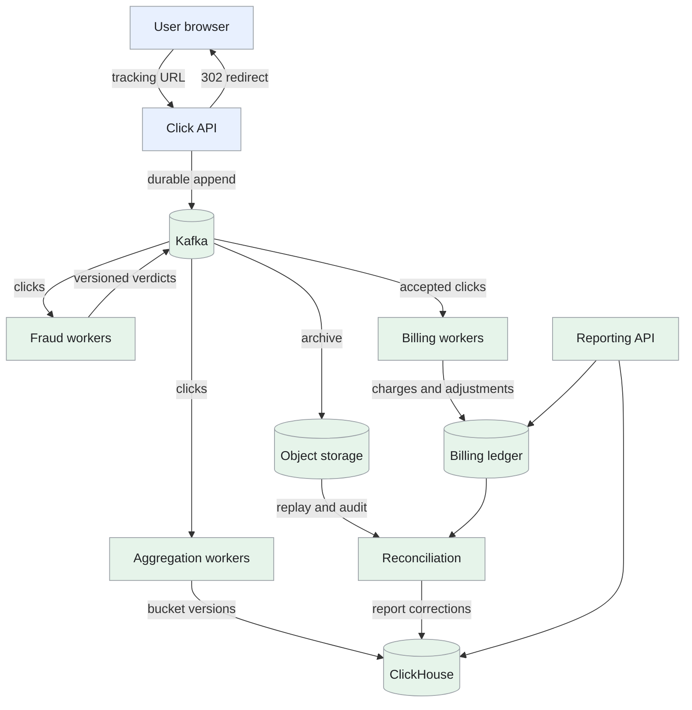
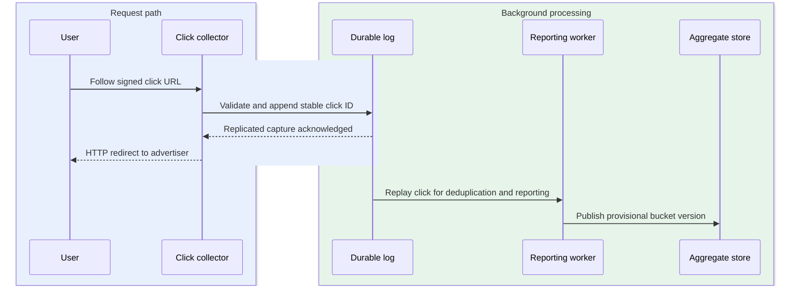
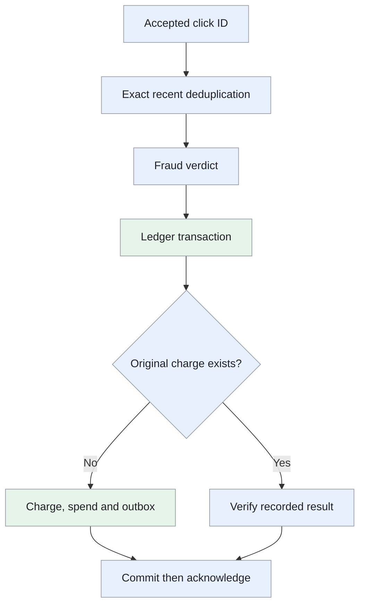
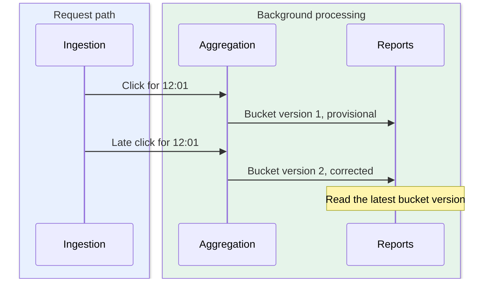

Design of an ad-click pipeline that records clicks, reports campaign performance and produces auditable billing records.

<!--more-->

## Problem

Advertisers need to see how their ads are performing and how quickly a campaign is spending its budget. Each click must reach the reporting pipeline, while retries and fraudulent activity must be handled before the advertiser is charged.

The system accepts clicks through a tracking URL and redirects the user to the advertiser's landing page. Background workers build minute-level metrics, evaluate fraud and record billable clicks. Reporting can update as more events arrive; billing requires a durable record of each charge and correction.

## Requirements

### Functional requirements

- **Track clicks:** validate a tracking request, record the click and redirect to its registered landing page.
- **Report campaign activity:** query click counts by time, ad, country and device, including hourly and daily totals.
- **Rank ads:** show the most-clicked ads over the last hour or day.
- **Evaluate fraud:** separate pending, accepted and excluded clicks, with later corrections when a verdict changes.
- **Track spending:** report campaign spend and publish budget-pacing alerts.

### Non-functional requirements

- **Scale:** handle 10B clicks/day, 200K clicks/s at peak and 10K dashboard queries/s.
- **Latency:** target P99 below 100ms for click ingestion within the serving region.
- **Freshness:** publish provisional metrics within 60s of ingestion; expose processing time and pending fraud counts.
- **Financial correctness:** charge an accepted click at most once, retain accepted events for reconciliation and record adjustments explicitly.
- **Availability:** continue ingesting during reporting outages while durable transport has capacity.
- **Privacy:** restrict access to user and network identifiers and apply separate retention policies to raw events and billing records.

Ad serving, bidding and conversion attribution remain outside this design.

## Back-of-the-envelope calculations

- **Ingress:** 10B/day is about 116K clicks/s on average. At 1KB/event, raw data is approximately 10TB/day; peak ingress is 200MB/s before replication.
- **Deduplication:** a five-minute window at peak contains up to 60M IDs. Exact state, indexes and checkpoints require substantially more space than a compact Bloom filter.
- **Aggregation:** 10M ads × 1,440 minute buckets gives 14.4B possible ad-minute rows/day before dimensions. Write only populated combinations and choose rollups from actual query patterns.
- **Retention:** 30 days of raw events is approximately 300TB before compression and replication. Broker and worker capacity require load tests with the chosen durability settings.

## Core entities

```protobuf
message ClickEvent {
  string click_id;             // Stable across retries of the same tracking event
  string ad_id;
  string campaign_id;          // Resolved from the signed tracking token
  Timestamp event_time;
  Timestamp ingested_at;
  string country;
  string device_type;
  int64 price_micros;           // Price recorded for this click
  string currency;
}

message FraudVerdict {
  string click_id;
  string status;               // pending, accepted, excluded
  int64 version;
  string reason;
}

message ClickAggregate {
  string campaign_id;
  string ad_id;
  Timestamp minute;
  string country;
  string device_type;
  int64 received_clicks;
  int64 accepted_clicks;
  int64 version;               // Replacement version for this bucket
}

message BillingEntry {
  string entry_id;             // Stable ID for one charge or verdict adjustment
  string click_id;
  string campaign_id;
  int64 amount_micros;          // Signed amount; reversals are separate entries
  string currency;
  string kind;                 // charge or adjustment
  string related_entry_id;
}

message CampaignBudget {
  string campaign_id;
  int64 daily_limit_micros;
  string currency;
}
```

## API

```yaml
GET /click/{tracking_token}:
  response: 302 with Location set to the registered landing URL
  errors: [400 invalid token, 410 expired token, 503 ingestion unavailable]

GET /metrics:
  query: [campaign_id, start, end, country, device, granularity]
  response: [buckets, pending_clicks, processed_through, provisional]

GET /top-ads:
  query: [window, limit, country]
  response: [ranked_ads, as_of]

GET /campaigns/{id}/budget:
  response: [daily_limit, posted_spend, pending_spend, as_of]

GET /campaigns/{id}/fraud-summary:
  response: [received, pending, accepted, excluded, as_of]
```

Dashboard endpoints authenticate the user and check campaign access. The tracking endpoint obtains campaign, price and destination information from server-controlled records rather than trusting query parameters.

## High-level design

The click API writes to durable transport before returning the redirect. Independent workers evaluate fraud and build reporting aggregates. A billing worker posts accepted clicks to a ledger; an archive supports replay and reconciliation.


```mermaid
flowchart TB
  U[User browser] -->|tracking URL| API[Click API]
  API -->|durable append| K[(Kafka)]
  API -->|302 redirect| U
  K -->|clicks| A[Aggregation workers]
  K -->|clicks| F[Fraud workers]
  F -->|versioned verdicts| K
  K -->|accepted clicks| B[Billing workers]
  B -->|charges and adjustments| L[(Billing ledger)]
  A -->|bucket versions| O[(ClickHouse)]
  K -->|archive| R[(Object storage)]
  R -->|replay and audit| C[Reconciliation]
  L --> C
  C -->|report corrections| O
  Q[Reporting API] --> O
  Q --> L
  classDef request fill:#e8f0fe,stroke:#9aa0a6,color:#202124,stroke-width:1px
  classDef background fill:#e6f4ea,stroke:#9aa0a6,color:#202124,stroke-width:1px
  classDef control fill:#fef7e0,stroke:#9aa0a6,color:#202124,stroke-width:1px
  class U,API request
  class K,A,F,B,L,O,R,C,Q background
```

## Storage

- **[Kafka](/designs/tech-kafka/):** retains clicks and verdicts for bounded replay. Producers use idempotent publication, acknowledgments from the in-sync replicas and a minimum replica policy. Acknowledgment still depends on that configured durability policy.
- **[Flink](/designs/tech-flink/) state:** stores exact recent click IDs and active aggregation buckets in checkpointed state. Hash `click_id` for deduplication, then repartition accepted events by aggregation key. Salt exceptionally busy ad keys only after deduplication.
- **[ClickHouse](/designs/tech-clickhouse/):** stores versioned aggregates ordered by campaign, time and ad. Queries select the latest version of each bucket before summing. [ReplacingMergeTree](https://clickhouse.com/docs/reference/engines/table-engines/mergetree-family/replacingmergetree) removes duplicates during background merges, so the query path must also handle unmerged versions.
- **[PostgreSQL](/designs/tech-postgresql/) billing ledger:** shard campaigns across transactional databases. Each shard uses a unique `entry_id` for every ledger entry and a partial unique index for the original charge on `(campaign_id, click_id)`. Charges, spend updates and notification outbox records commit together; distinct adjustments retain their own entry IDs. Route every retry for a campaign to the same shard.
- **Object storage:** retains immutable raw-event files and manifests for reconciliation. Archive access and retention differ from the longer-lived financial ledger.
- **[Redis](/designs/tech-redis/):** caches published Top-N lists and dashboard responses. Durable stores can rebuild these caches.

## From request to response

### One end-to-end request

The collector acknowledges a click after replicated capture; reporting and billing consume that same retained event independently.


```mermaid
sequenceDiagram
  box rgb(232,240,254) Request path
    participant U as User
    participant A as Click collector
  end
  box rgb(230,244,234) Background processing
    participant D as Durable log
    participant W as Reporting worker
    participant R as Aggregate store
  end
  rect rgb(232,240,254)
    U->>A: Follow signed click URL
    A->>D: Validate and append stable click ID
    D-->>A: Replicated capture acknowledged
    A-->>U: HTTP redirect to advertiser
  end
  rect rgb(230,244,234)
    D->>W: Replay click for deduplication and reporting
    W->>R: Publish provisional bucket version
  end
```

Reporting workers publish versioned buckets for authorized dashboard queries; the clicking user receives only the advertiser redirect. Billing workers post a charge after fraud approval, while provisional report totals may be available before that verdict is final.

### Recording a click

The user follows a signed tracking URL issued for an ad impression. Its token identifies one tracking event, so repeated requests for that token count as retries; a new event requires a new token. The API validates the signature and expiry, resolves the landing page, and publishes the event with its stable `click_id`. It returns the redirect after Kafka acknowledges the append.

A normal browser navigation follows the HTTP redirect. Tracking through a separate JavaScript request requires the client to perform navigation itself and has a different delivery guarantee. The selected flow makes durable ingestion part of redirect latency; broker congestion therefore needs bounded timeouts and an explicit unavailable response.

### Building minute-level metrics

The deduplication worker checks exact state for the click ID and forwards each new event. Aggregation workers update the event's minute, ad and dimensions. They publish bucket snapshots periodically rather than waiting for every minute window to close.

Fraud verdicts arrive separately. Reports distinguish received clicks from accepted clicks and show pending verdicts. A changed verdict produces a new bucket version. Repeated delivery of that version replaces the same result.

Minute buckets provide fast standard reports, but every added dimension increases state and storage. Build only useful rollups and use the detailed event archive for less frequent analysis.

### Posting charges and reporting spend

After a click is accepted, the billing worker inserts its charge using a database-enforced unique key. The transaction also updates campaign spend and writes an outbox record. An existing charge is returned on retry; a changed verdict creates an identifiable reversal or adjustment.

Use the price and currency recorded for that click. A later bid change must not alter its original charge. The budget API reports posted and pending spend separately, and pacing alerts carry their calculation time.

### Reading reports and Top-N lists

The reporting API checks campaign access, chooses a minute or hourly rollup, and reads one version of each bucket. It returns processing freshness alongside counts so a delayed pipeline can be distinguished from zero activity.

A Top-N worker maintains counts for all active ad candidates in disjoint minute buckets. It expires old buckets and publishes an immutable ranked result for the requested window. Keeping only the previous winners would miss an ad whose later activity moves it into the ranking.

## Deep dives

### How do retries avoid duplicate charges?

**Problem.** A click may be retried by the browser, republished after a timeout or replayed after worker recovery. Correct operator state alone does not make an external database write idempotent.

| Approach | Benefit | Limitation |
| --- | --- | --- |
| Processing-state deduplication | Reduces repeated aggregation work | Limited by its retention window |
| Checkpoints with transactional sinks | Coordinates supported writes with recovery | Guarantees depend on the specific sink |
| Unique ledger entries and reconciliation | Makes financial retries safe and auditable | Requires transactional writes and retained evidence |

- **Processing-state deduplication:** retain seen click IDs in stream state and suppress repeats before aggregation. This reduces duplicate reporting work, but events replayed beyond the retention horizon can be counted again unless reconstruction uses retained evidence.
- **Checkpoints with transactional sinks:** checkpoint operator state and input positions alongside a sink-supported commit protocol. Supported outputs recover consistently; an ordinary external database call falls outside that protocol unless its connector provides the needed transaction semantics.
- **Unique ledger entries and reconciliation:** insert charges under a stable click/entry identity and verify provider or settlement evidence afterward. This protects financial retries and supports corrections; transactional writes, evidence retention and reconciliation increase storage and operational work.

**Recommendation:** use exact stream deduplication for reporting and an idempotent ledger for billing. [Flink's checkpoint model](https://nightlies.apache.org/flink/flink-docs-stable/docs/learn-flink/fault_tolerance/) explains operator recovery; the ledger's transaction defines whether a charge has been posted. Reporting needs fast replayable aggregation, while billing needs an auditable charge decision. Exact stream deduplication plus a unique transactional ledger fits those different contracts; it accepts two state systems and an explicit replay horizon rather than treating a stream checkpoint as a universal financial guarantee.

PostgreSQL's [partial unique index](https://www.postgresql.org/docs/current/indexes-partial.html) limits original charges, while the primary key on `entry_id` deduplicates individual adjustments.

```sql
-- Installed once per shard; entry_id is the table's primary key.
CREATE UNIQUE INDEX one_original_charge_per_click
  ON billing_entries (campaign_id, click_id)
  WHERE kind = 'charge';

BEGIN;
INSERT INTO billing_entries (
  entry_id, click_id, campaign_id, kind, amount_micros, currency
)
VALUES ($1, $2, $3, 'charge', $4, $5)
ON CONFLICT DO NOTHING
RETURNING entry_id;
-- Only a newly inserted charge updates spend and inserts an outbox row.
COMMIT;
```

Only a newly inserted entry changes spend and writes an outbox record. On conflict, the worker reads the existing entry and checks that its click, amount and currency match before acknowledging the retry. It acknowledges after commit, so recovery can safely repeat a delivered message. Each verdict correction has a stable adjustment ID; later corrections create additional entries. Reconciliation compares the ledger with accepted raw events.

A Bloom filter can avoid some exact lookups. Its positive result must be confirmed in exact state: a false positive must not discard a genuine click. Monitor duplicate rates, ledger conflicts, unposted accepted clicks and reconciliation differences.

**Commit and acknowledgement race.** Click C arrives twice after a producer retry. Reporting state recognizes its stable ID within the replay horizon. The billing consumer attempts the original charge in PostgreSQL; the partial unique index admits one charge for that campaign/click.

If the worker commits and crashes before acknowledging Kafka, replay finds the existing entry. It verifies the amount/currency and acknowledges without updating spend again. A conflicting payload is a reconciliation error, not permission to replace the original charge.


```mermaid
flowchart TB
  C["Accepted click ID"] --> D["Exact recent deduplication"]
  D --> V["Fraud verdict"]
  V --> T["Ledger transaction"]
  T --> U{"Original charge exists?"}
  U -->|"No"| N["Charge, spend and outbox"]
  U -->|"Yes"| R["Verify recorded result"]
  N --> A["Commit then acknowledge"]
  R --> A
  classDef request fill:#e8f0fe,stroke:#9aa0a6,color:#202124,stroke-width:1px
  classDef background fill:#e6f4ea,stroke:#9aa0a6,color:#202124,stroke-width:1px
  classDef control fill:#fef7e0,stroke:#9aa0a6,color:#202124,stroke-width:1px
  class C,D,V,U,R,A request
  class T,N background
```

A later exclusion creates a uniquely identified adjustment linked to the original charge. Replaying that adjustment returns its recorded result; a different correction has a different identity. Ledger history therefore explains both the initial charge and every later change.

### How can reports be fresh while events arrive late?

**Problem.** A minute window may still receive delayed events after its first report has been published. Waiting for every possible event would delay all dashboard updates.

- **Long watermark delay:** wait until most delayed events should have arrived before publishing a bucket. Final-looking totals need fewer corrections, but every dashboard waits for the slowest tolerated delay.
- **Close quickly and drop late events:** finalize a bucket immediately and discard later arrivals. This is simple and fresh, but outages and delayed clients systematically undercount activity.
- **Provisional buckets with corrections:** publish versioned snapshots quickly, then revise them as late events arrive within a retained horizon. Users see fresh data and recoverable totals; queries must select the latest complete version and the UI must identify provisional results.

**Recommendation:** publish provisional snapshots every few seconds, use a short event-time watermark for normal completion, and accept late corrections within the configured reconciliation horizon. Validate event timestamps at ingestion and retain the original value for audit. Mark idle input partitions so they do not indefinitely delay watermark progress. Provisional buckets fit near-real-time dashboards without sacrificing the retained reconciliation window. The accepted downside is that recent totals change; bucket versions and completion status make those changes explicit and keep replay from adding a second copy of a published total.


```mermaid
sequenceDiagram
  box rgb(232,240,254) Request path
  participant I as Ingestion
  end
  box rgb(230,244,234) Background processing
  participant A as Aggregation
  participant Q as Reports
  end
  I->>A: Click for 12:01
  A->>Q: Bucket version 1, provisional
  I->>A: Late click for 12:01
  A->>Q: Bucket version 2, corrected
  Note over Q: Read the latest bucket version
```

An event beyond online state retention goes to durable reconciliation rather than disappearing. Reconciliation emits another version of the same bucket, with a publication generation that prevents old streaming writes from replacing a newer correction. Monitor ingestion lag, watermark lag, late-event age and correction volume.

**Provisional and corrected bucket reads.** Suppose the 12:01 bucket first contains 100 clicks under revision 1. A late valid click raises it to 101 under revision 2. Store both as versioned absolute values; a query selects revision 2 and counts 101, rather than summing 100 and 101.

Streaming and reconciliation writers share an ordered publication-generation contract. An old streaming revision cannot overwrite a later reconciled value. In ClickHouse, background replacement alone is not the query's correctness boundary: select the latest version explicitly while physical duplicates may still exist.

Record expected partitions, watermark and completion state in the report metadata. An idle partition can be excluded from watermark progress under a documented idleness policy, but later events still enter correction handling. Events outside active state retention remain in the archive and generate a later corrected bucket. The UI distinguishes fresh provisional totals from reconciled totals.

### How do fraud decisions affect billing and budget limits?

**Problem.** A verdict may arrive after the first dashboard update or change after a model review. Meanwhile, asynchronous spend reports trail newly accepted clicks.

- **Block tracking on fraud evaluation:** obtain a verdict before redirecting or recording eligible activity. This simplifies immediate acceptance, but scanner latency or failure becomes user-visible redirect latency.
- **Treat immediate counts as final:** count and charge at capture time. Reporting is straightforward, but delayed exclusions require untracked financial corrections or leave invalid clicks charged.
- **Separate received, pending and accepted activity:** capture durably, evaluate asynchronously and post a charge only for an accepted verdict. Redirects remain responsive and decisions are auditable; pending spend and later adjustments require separate states and cannot enforce an instantaneous cap from delayed reports alone.

**Recommendation:** redirect after durable capture, evaluate fraud in the background and charge only accepted clicks. An unresolved verdict remains pending. Record the rule/model version, apply verdict updates idempotently and post financial adjustments when a previously charged click is excluded. Separate states fit a click-tracking service because redirect availability and billing evidence have different timing requirements. We accept provisional reports and a pending-verdict backlog, then use idempotent verdict transitions and ledger adjustments to make the final financial result explainable.

A pacing alert is an operational signal rather than a strict spending cap. Approximate additional spend during reporting delay is:

```text
accepted clicks/second × delay in seconds × average click price
```

Enforcing a hard cap would require coordinated budget reservation in the ad-serving flow. This design supplies timestamped spend and alerts to that system. During a fraud or billing outage, pending work remains durable, freshness visibly degrades, and recovery drains the backlog before reconciliation confirms the totals.

**Verdict and spend transitions.** Track received, pending, accepted and rejected counts separately. A captured click is pending until its fraud decision becomes final enough for billing policy. Accepting it creates one original charge; changing the verdict later creates a retained adjustment and updates net spend transactionally.

At 100 accepted clicks/s, a ten-second reporting delay and an average price of \$0.20 can hide approximately \$200 of new spend. A pacing alert based on the delayed dashboard cannot enforce a hard \$100 remaining budget.

Hard budget enforcement reserves allowance at the authoritative ad-serving boundary before further billable exposure according to its policy. This tracking design delivers verdicts, timestamped spend and reconciliation outcomes to that authority. During a fraud outage, pending age grows visibly; recovery must process those decisions and reconcile their ledger outcomes before calling the spend totals final.
