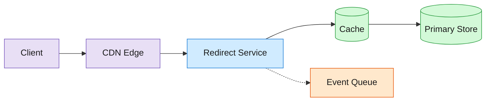
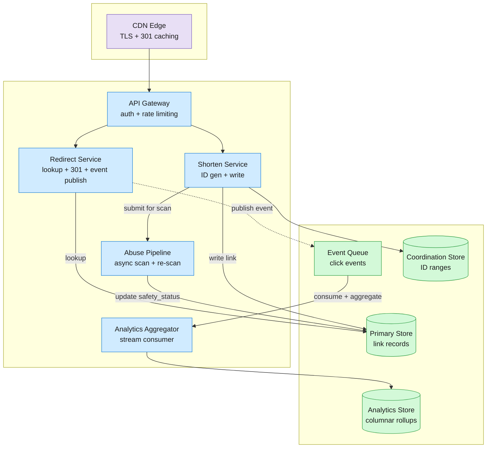

A URL shortener stores a mapping from a short code to a destination URL and redirects visitors on every lookup.

<!--more-->

## 1. Problem

A URL shortener stores a mapping from a short code to a destination URL and redirects visitors on every lookup. The workload is heavily read-biased: a link created once is resolved thousands of times over its lifetime, yielding a read-to-write ratio of roughly 100:1 (derived: 30B redirects/month ÷ 300M creates/month). A redirect must finish in under 10ms (target) to avoid perceptible latency from the extra HTTP hop. Every redirect must also produce an analytics event that records who clicked, when, and from where. Those two forces pull in opposite directions: writing a durable analytics event per redirect adds latency a redirect cannot afford.



## 2. Requirements

**Functional**

- FR1: Submit a long URL and receive a shortened version
- FR2: Click a short URL and get redirected to the destination
- FR3: View click counts, referrer breakdowns, and geographic distribution per link
- FR4: Create a custom short code alias for a long URL
- FR5: Set an expiration time after which a short link stops redirecting
- FR6: Receive a safety warning before reaching a suspicious destination

**Non-functional**

- NFR1: Redirect P50 < 10ms, P99 < 50ms (target)
- NFR2: 99.99% availability for the redirect path (target)
- NFR3: Support 40B active links and 60K redirects/sec peak (assumed)
- NFR4: Analytics events available in aggregates within 90s of the redirect (target)

*Out of scope: user authentication, billing, link-in-bio pages, QR code generation, mobile deeplinks.*

## 3. Back of the envelope

- **Redirect peak QPS:** 30B redirects/month ÷ 2.6M s/month × 5 (peak-to-average multiplier for social sharing bursts) ≈ 58K redirects/s → a single store cannot serve this hot; the design must absorb the read load in cache layers before it reaches the primary store.
- **Create peak QPS:** 300M creates/month ÷ 2.6M s/month × 5 ≈ 580 writes/s → the write path is quiet; a single coordination store for ID generation can absorb it without sharding.
- **Analytics ingest:** 30B events/month × 200 bytes/event (assumed: link_id, timestamp, user_agent, country, referrer) ≈ 6TB/month raw → streaming writes to a columnar store with pre-aggregation reduce this by 10-100× before query time.

## 4. Entities

```
Link {
  short_code:    string    PK  ← base62-encoded, 7 chars
  long_url:      string
  domain:        string    CK  ← e.g. "bit.ly"; shard key for multi-tenant isolation
  created_at:    timestamp
  expires_at:    timestamp ?
  safety_status: enum          ← safe | warn | blocked; updated async by abuse pipeline
  org_id:        uuid      FK
}

Organization {
  org_id:   uuid    PK
  name:     string
}

ClickRollup {
  link_short_code: string    CK
  bucket:          timestamp CK  ← hourly aggregation window
  country:         string    CK
  referrer_domain: string    CK
  click_count:     integer      ← pre-aggregated by the streaming consumer
}
```

### API

- `POST /v4/shorten`  -  create a short link; body: `long_url`, optional `domain`, `alias`, `expires_at`; returns `short_code`
- `GET /{short_code}`  -  resolve a short code; returns HTTP 301 with `Location: <long_url>` and `Cache-Control: private, max-age=90`
- `GET /v4/bitlinks/{short_code}/clicks`  -  click counts; query: `units` (day/hour), `from`, `to`
- `POST /v4/expand`  -  resolve a short code to its destination URL without redirecting; body: `short_code`; returns `long_url`
- `GET /v4/groups/{group_guid}/bitlinks`  -  list links in a group; query: `size`, `page`

## 5. High-Level Design



#### FR1: Create a short link

- `Components:` API Gateway, Shorten Service, Coordination Store (ID range allocation), Primary Store, Abuse Pipeline.
- `Flow:`
  1. Client sends `POST /v4/shorten` with `long_url`, authenticated via bearer token.
  1. API Gateway validates auth, enforces rate limit (token bucket per org), forwards to Shorten Service.
  1. Shorten Service allocates the next ID from its local range; if the local range is exhausted, it requests a new range from the Coordination Store.
  1. Shorten Service base62-encodes the 64-bit ID into a 7-character short code, inserts `(short_code, long_url, domain, created_at, expires_at, org_id, safety_status=safe)` into the Primary Store.
  1. Shorten Service publishes the destination URL to the Abuse Pipeline for async scanning.
  1. Returns `{ "short_code": "abc123X", "link": "https://bit.ly/abc123X" }`.
- `Design consideration:` The Shorten Service holds a local buffer of pre-allocated IDs  -  typically 10,000 per fetch (default)  -  so 99.99% of creates avoid a coordination-store round-trip. Range exhaustion during a burst triggers a synchronous range fetch that adds ~5ms (target) to that single create.

#### FR2: Redirect to the destination

- `Components:` CDN Edge, Redirect Service, Primary Store.
- `Flow:`
  1. Client sends `GET /abc123X` to `bit.ly`.
  1. CDN Edge terminates TLS, checks its edge cache for a cached redirect. On hit, returns HTTP 301 immediately.
  1. On CDN miss, CDN forwards to Redirect Service.
  1. Redirect Service checks its in-process LRU cache; on miss, queries the Primary Store for `short_code="abc123X"`.
  1. If `expires_at` is set and has passed, returns HTTP 410 Gone.
  1. If `safety_status=blocked`, returns HTTP 403 with a block page.
  1. If `safety_status=warn`, returns HTTP 301 with `Location: <long_url>` and sets a cookie to show an interstitial on the next visit.
  1. Otherwise, returns HTTP 301 with `Location: <long_url>` and `Cache-Control: private, max-age=90`.
  1. After sending the response, the Redirect Service publishes a click event to the Event Queue.
- `Design consideration:` The `private, max-age=90` directive caches the redirect in the browser for 90 seconds (default, per max-age directive) but does not share it across users, so click analytics remain accurate. The CDN caches the 301 response keyed on short code for subsequent requests from other users.

#### FR3: View click analytics

- `Components:` API Gateway, Analytics Store.
- `Flow:`
  1. Client sends `GET /v4/bitlinks/{short_code}/clicks?units=day&from=2026-07-01&to=2026-07-23`.
  1. API Gateway validates auth and org membership for the link.
  1. Queries the Analytics Store for pre-aggregated `ClickRollup` rows matching the short code and time window.
  1. Returns total clicks and a time-series breakdown by country and referrer domain.
- `Design consideration:` The Analytics Aggregator rolls raw click events into hourly buckets with composite keys (`link_short_code`, `bucket`, `country`, `referrer_domain`). A dashboard query scans a handful of pre-aggregated rows per day instead of scanning billions of raw events.

#### FR4: Create a custom short code

- `Components:` Shorten Service, Primary Store.
- `Flow:`
  1. Client sends `POST /v4/shorten` with an `alias` field (e.g., `"my-campaign"`).
  1. Shorten Service checks uniqueness: `SELECT 1 FROM Link WHERE short_code = "my-campaign"`. If taken, returns HTTP 409 Conflict.
  1. On success, inserts with the client-supplied short code instead of a generated one.
- `Design consideration:` Custom codes are not generated from the ID range, so they bypass the Coordination Store. Uniqueness is enforced at the Primary Store with the existing PK constraint. A counting Bloom filter in front of the Primary Store absorbs most negative lookups for unavailable aliases.

#### FR5: Set URL expiration

- `Components:` Shorten Service, Redirect Service.
- `Flow:`
  1. Client sets `expires_at` during create (minimum 5 minutes from now, maximum 1 year; assumed).
  1. Shorten Service stores it in the `Link` record.
  1. On redirect, the Redirect Service compares the current time against `expires_at`. If expired, returns HTTP 410.
  1. A periodic cron job sweeps expired links and marks them for archival.
- `Design consideration:` The redirect check is a simple timestamp comparison on an already-fetched record, adding no extra I/O. A background cleanup job (executed hourly, default) removes expired links older than a configurable retention window to reclaim storage.

#### FR6: Safety warning on suspicious destinations

- `Components:` Abuse Pipeline (Crawler, Threat Detection Service, Abuse API), Redirect Service.
- `Flow:`
  1. On create, the Shorten Service publishes the `long_url` to the Abuse Pipeline.
  1. The Crawler fetches the destination page and extracts metadata (title, content type, redirect chain).
  1. The Threat Detection Service (TDS) scans the metadata, checks against Google Web Risk API for real-time threat classification, and assigns a confidence score.
  1. The Abuse API stores the verdict (`safety_status = safe | warn | blocked`) and the Redirect Service reads it from the cached link record on every redirect.
  1. A rolling consumer re-scans existing links periodically (daily for links visited in the last 30 days, default) because a benign page can become malicious later.
- `Design consideration:` Scanning is entirely async from create and redirect. The redirect path reads a single cached field from the link record and branches on it; the verdict adds no latency. The false-positive rate is calibrated conservatively  -  a URL is only blocked when the confidence score exceeds a high threshold (default: extremely-high risk tier from the Web Risk API).

## 6. Deep dives

### DD1: Short code generation at scale

**Problem.** Each new link needs a globally unique short code. A central counter is simple but creates a serialization bottleneck at the write target of 580 creates/sec peak. A hash function is decentralized but produces collisions at scale: with a 7-character base62 alphabet, the space holds 62^7 ≈ 3.5 trillion codes; at 40B links the probability of a single collision under uniform hashing is non-trivial, and the long-tail collision rate grows with link count.

**Approach 1: Hash + truncation**

Hash the long URL (SHA-256), take the first 7 characters of the base62 encoding, and insert. On collision, retry with a salt.

- **Challenges:** Collision probability rises with fill rate. At 40B links out of 3.5T, roughly 1.1% fill, the expected collision count is ~200M (derived: n - m + m(1 - 1/m)^n ≈ 40B - 3.5T(1 - 1/3.5T)^40B ≈ 200M). Each collision means a retry  -  an extra write for a small but measurable fraction of creates. For custom aliases this approach is irrelevant (the user picks the code), so hash-based generation and alias-based creation live in separate code paths.

**Approach 2: Central counter**

A single atomic counter in a coordination store (e.g., an atomic increment in a strongly-consistent key-value store). Each create reads the counter, base62-encodes the value, and writes the link.

- **Challenges:** At 580 creates/sec peak, a single counter can keep up  -  a strongly-consistent atomic increment in a system like etcd handles ~10K ops/sec (assumed). But every create pays a network round-trip to the counter, adding ~1-3ms of latency and creating a single point of contention that prevents horizontal scale-out of the Shorten Service beyond a handful of instances.

**Approach 3: Distributed range allocation**

A coordination store hands out contiguous ID ranges to Shorten Service instances. Each instance holds a local buffer (e.g., 10,000 IDs per batch, default) and burns through them without any network call. When the buffer runs low, the instance requests the next range.

```javascript
range_key = "id_range:" + instance_id
range = coordination_store.compare_and_swap(range_key, expected_current_end, expected_current_end + 10000)
```

```javascript
local_counter = range.start
buffer = range.end - range.start

function next_id():
    if local_counter >= range.end:
        range = fetch_range()          // synchronous, ~5ms
        local_counter = range.start
    id = local_counter
    local_counter += 1
    return base62_encode(id)
```

- **Challenges:** If an instance crashes mid-range, the IDs in its buffer are lost  -  a gap in the ID sequence. This is acceptable for URL short codes; the 62^7 space is large enough that gaps have no operational impact. Range size is a trade-off: larger ranges reduce coordination overhead at the cost of potentially larger gaps on crash.

**Decision:** Distributed range allocation from a coordination store.

**Rationale:** With 10,000-ID buffers (default), 99.99% of creates avoid a coordination-store round-trip. The Coordination Store handles only range allocation (tens of requests per second across all instances), not per-create counter operations. The headroom is ample: at 580 creates/sec, the coordination-store write rate is 0.058 ops/sec per instance, and the store can serve 10,000× that. The gap-on-crash trade-off is acceptable because short codes carry no sequential semantics.

**Edge cases:**

- **Buffer exhaustion during a burst:** A viral event that drives hundreds of creates per second on one instance can drain a 10,000-ID buffer in under a minute. The instance requests a new range synchronously; only the single create that triggers the fetch pays the extra ~5ms (target).
- **Coordination store unavailability:** If the coordination store is unreachable when a buffer runs dry, the instance enters a retry loop with exponential backoff. Creates are rejected with HTTP 503 until the store recovers. The buffer acts as a grace period: with 10,000 IDs and a typical create rate of ~10/s per instance, the instance has ~17 minutes of runway (derived: 10,000 IDs ÷ 10 creates/s ≈ 1,000s ≈ 17 min).
- **Hot instance:** If load balancing is sticky, one instance may exhaust its buffer faster than others. The fix is a low-water-mark prefetch: the instance requests a new range when the buffer hits 20% remaining, not 0%, so the fetch overlaps with the remaining buffer.

### DD2: Redirect latency and cache architecture

**Problem.** A redirect must complete in under 10ms P50 (target). A direct database lookup per request cannot meet this at 58K redirects/sec peak  -  the primary store adds 5-10ms of read latency even with indexing, and the QPS would saturate it. The design pushes the redirect path through progressively faster cache layers, so the primary store sees only cache misses.

**Approach 1: Direct primary-store lookup**

Every redirect queries the Primary Store by short code. The store is keyed on `short_code` and returns the `long_url` and `safety_status`.

- **Challenges:** At 58K reads/sec peak, even a horizontally-scaled store with 10 replicas would serve 5,800 reads/sec per replica. Each read is a point lookup over the network, adding 5-10ms. P50 latency would be dominated by network round-trips and store load, pushing well past the 10ms target. Additionally, 58K QPS to the store leaves no headroom for writes, backups, or rebalancing.

**Approach 2: Multi-tier cache pyramid**

Caching at four levels, each absorbing a fraction of the traffic so the tier below sees a reduced load:

| Tier | Hit rate (cumulative) | Latency |
|---|---|---|
| Browser (Cache-Control header) | 15-30% (assumed) | 0ms |
| CDN Edge (keyed on short code) | 50-65% (assumed) | 5-20ms |
| In-process LRU (per Redirect Service instance) | 92-97% (assumed) | ~0.1ms |
| Primary Store (point lookup) | 100% (assumed) | 5-10ms (assumed) |

- A browser that has visited the link in the last 90 seconds (default, per Cache-Control max-age) returns the cached 301 from its own cache  -  no network request at all.
- The CDN caches the 301 response for a configurable TTL. Subsequent requests from different users for the same short code hit the CDN edge, not the origin.
- Each Redirect Service instance holds an in-process LRU of the most frequently accessed short codes. An LRU hit returns the `long_url` and `safety_status` in ~0.1ms (assumed).
- The Primary Store is the source of truth, reached only on a cold miss at all three cache layers.

**Singleflight for cache stampede defense:**

When a popular link's cache entry expires  -  for example, after a CDN TTL roll or a Redirect Service restart  -  thousands of concurrent requests can arrive for the same short code simultaneously, all missing every cache layer and hammering the Primary Store. Singleflight coalesces these concurrent misses into one fetch.

```javascript
function resolve(short_code):
    cached = lru.get(short_code)
    if cached:
        return cached
    return singleflight.do(short_code, lambda: store.lookup(short_code))
```

`singleflight.do` guarantees that only one request per `short_code` actually queries the Primary Store; all other concurrent callers block on that single fetch and receive the same result. This is implemented as an in-memory map of in-flight keys with a wait group per key.

**Approach 3: Hot-key replication**

A small fraction of links  -  viral campaigns, breaking news  -  absorb a disproportionate share of traffic. These hot keys can saturate individual Redirect Service instances even with an LRU. Hot-key replication detects keys whose request rate exceeds a threshold (configurable, e.g., 10,000 requests/sec per instance, default) and replicates them across all Redirect Service instances with a push from a background watcher that monitors the Event Queue for sudden spikes.

- **Challenges:** Replication adds ~100ms of propagation delay (assumed). During that window, the hot key may still hit the Primary Store on instances that have not received the push. A short-term mitigation: the singleflight call on the Primary Store already absorbs the concurrent-miss burst, so the store sees at most one query per instance, not thousands.

**Decision:** Multi-tier cache pyramid with singleflight and hot-key replication.

**Rationale:** A browser-cached redirect is free; a CDN-cached redirect costs 5-20ms (assumed); an LRU-cached redirect costs ~0.1ms (assumed). At 58K peak QPS, if 50% hit the CDN and 45% hit the LRU, the Primary Store sees ~2,900 reads/sec (derived: 58K × 5%)  -  an order of magnitude below the worst case, well within the capacity of a horizontally-scaled store. Singleflight prevents the pathological case where a cache miss on a popular link triggers a thundering herd. Hot-key replication handles the long tail of viral links that dominate traffic for a narrow time window.

**Edge cases:**

- **CDN purge on safety status change:** When the Abuse Pipeline updates a link's `safety_status` from `safe` to `blocked`, cached 301 responses at the CDN must be invalidated. The Abuse Pipeline issues a CDN purge for the short code's path immediately after the status update commits to the Primary Store.
- **LRU eviction under memory pressure:** During a sustained burst  -  a global news event that drives traffic to millions of distinct links  -  the LRU thrashes and hit rate drops. The Redirect Service expands its LRU size dynamically up to a configured memory limit (default: 25% of instance heap), and the Primary Store absorbs the additional load through singleflight coalescing.
- **Singleflight memory leak:** An abandoned short code that never resolves (e.g., a client that disconnects before the fetch completes) leaves an entry in the in-flight map. A TTL on each in-flight entry (5 seconds, default) ensures it is cleaned up.

### DD3: Click analytics pipeline

**Problem.** Every redirect must produce an analytics event  -  link clicked, timestamp, user agent, country, referrer  -  but writing that event synchronously to the analytics store during the redirect adds latency the redirect path cannot absorb. The event must be durable (not lost on crash) and available in dashboards within 90 seconds (target). The raw event volume, at ~58K events/sec peak, would produce ~6TB of raw data per month if stored uncompressed  -  too much to query directly.

**Approach 1: Synchronous write during redirect**

The Redirect Service writes the click event to the Analytics Store as part of the same request that performs the redirect lookup. The redirect response is sent only after the event write acknowledges.

- **Challenges:** Adding a synchronous write to the redirect path doubles the P50 latency  -  even with a fast columnar store, a write over the network adds 2-5ms (assumed). At 58K writes/sec peak, the Analytics Store becomes a write bottleneck, and any store degradation cascades into redirect failures. This violates the core invariant: the redirect path must not be gated on analytics.

**Approach 2: Async publish to a message queue**

The Redirect Service publishes the click event to a durable message queue after sending the HTTP 301 response. A separate consumer reads from the queue, enriches events (geo-IP lookup, referrer parsing), and writes pre-aggregated buckets to a columnar analytics store.

```javascript
// Inside the Redirect Service, after writing the 301 response:
event = {
    link_short_code: "abc123X",
    timestamp:       now(),
    user_agent:      request.headers["User-Agent"],
    ip:              request.remote_ip,
    referrer:        request.headers["Referer"],
}
queue.publish("clicks", event)  // fire-and-forget; non-blocking
```

The consumer reads batches from the queue, derives `country` via a GeoIP database loaded in memory, and groups events into hourly buckets:

```javascript
SELECT
    link_short_code,
    date_trunc('hour', timestamp) AS bucket,
    country,
    referrer_domain,
    COUNT(*) AS click_count
FROM click_events_raw
GROUP BY link_short_code, bucket, country, referrer_domain
```

- **Challenges:** A fire-and-forget publish can lose events if the Redirect Service crashes after sending the 301 but before the publish completes. To bound this loss, the Redirect Service can batch events in a ring buffer (1,000 events or 100ms, whichever comes first, default) and flush the batch atomically  -  a single publish call after the 301, rather than one per redirect. A crash between the 301 and the flush loses at most one buffer's worth of events (~1,000 at worst), which is acceptable for click analytics where per-event precision is not required.

**Approach 3: Client-side beacon**

Instead of publishing from the server, the Redirect Service returns an HTML page with an embedded tracking pixel or JavaScript beacon. The client's browser fires the analytics event as a separate HTTP request.

- **Challenges:** This offloads the event entirely from the server redirect path but loses events from clients that block JavaScript, images, or tracking pixels. It also adds complexity: the beacon endpoint must be a separate service with its own scaling, and it cannot capture the server-side referrer header. For a URL shortener, where the core product value is click analytics, losing 10-30% of events (assumed, based on ad-blocker penetration) is unacceptable.

**Decision:** Async publish to a message queue with batched flushes from a ring buffer (Approach 2). Consumer pre-aggregates into hourly buckets in a columnar store.

**Rationale:** The redirect path writes the HTTP 301 response first, then publishes the event  -  the redirect never waits on the analytics write. A ring buffer bounds the per-crash event loss to a small, configurable window (~1,000 events, default). Pre-aggregation into hourly buckets reduces the query-time scan from billions of raw events to hundreds of pre-computed rows per link per day. The columnar store's merge-tree engine compacts small hourly buckets into daily buckets as a background operation, keeping storage at ~60GB/month (derived: 6TB raw ÷ 100× aggregation factor).

**Edge cases:**

- **Late-arriving data:** Mobile clients may buffer events and send them minutes after the redirect. The consumer maintains a late-arrival window of 5 minutes (default)  -  events with a timestamp within that window are re-aggregated into their correct bucket. Events outside the window are written to a separate late-arrival partition and reconciled daily.
- **Ring buffer overflow under sustained burst:** If the publish target (message queue) is slower than the event arrival rate, the ring buffer fills and new events are dropped. The Redirect Service exposes a `dropped_events` counter as a monitoring metric. The ring buffer size is tuned so that overflow occurs only under pathological conditions (queue partition offline for >1 second at peak rate).
- **Dedup:** A network retry can publish the same click event twice. The consumer deduplicates on a composite key of `(link_short_code, truncated_timestamp, user_ip_hash)`. If a duplicate arrives within the same hourly bucket, the consumer discards it.

### DD4: Abuse detection and rate limiting

**Problem.** A URL shortener is an abuse vector: a malicious actor can create a short link pointing to a phishing page, distribute it, and hide the destination behind a trusted short domain. Blocking known malicious URLs at redirect time is necessary, but a synchronous external API call during the redirect adds unacceptable latency. The system must also prevent a single actor from flooding the create endpoint with spam links.

**Approach 1: Synchronous blocklist check on redirect**

On every redirect, the Redirect Service checks the destination URL against a local blocklist before returning the 301.

- **Challenges:** A local blocklist must be kept in sync with threat intelligence, and a full blocklist scan per redirect adds latency. A bloom-filter-based check adds ~0.1ms (assumed), but keeping the blocklist current requires a separate sync mechanism. More critically, new malicious URLs are not in the blocklist at create time  -  a phishing campaign can run for minutes before the blocklist is updated  -  so the window of exposure is the blocklist refresh interval.

**Approach 2: Async scan at create time with cached verdict**

When a link is created, the destination URL is submitted to an async Abuse Pipeline that scans it offline. The verdict (`safety_status`) is stored with the link record. On redirect, the Redirect Service reads the cached status and branches:

- `safe` → 301 redirect
- `warn` → 301 redirect + set a cookie that triggers an interstitial on the next click
- `blocked` → 403 with a block page

The Abuse Pipeline has three stages: a Crawler that fetches the page and extracts metadata, a Threat Detection Service (TDS) that classifies the content using heuristics and an external threat intelligence API, and an Abuse API that writes the verdict back to the link record.

- **Challenges:** The scan takes 1-5 seconds (assumed), during which the link exists with `safety_status=safe` (the default). This creates a brief window where a malicious link can be clicked before the scan completes. The exposure is bounded: the Crawler fetches the page within seconds of creation, and the TDS returns a verdict within seconds of the crawl. For a phishing campaign distributed via email, the blast-to-click delay is typically minutes to hours, so a 5-second scan window is acceptable.

**Approach 3: External threat intelligence + periodic re-scanning**

Integrate with an external threat intelligence API (Google Web Risk) that maintains a database of over 1 million unsafe URLs (assumed) and classifies URLs across five risk tiers (low → medium → high → very high → extremely high). Every newly created URL is checked against this API during the async scan. A periodic re-scanner re-evaluates existing links because a benign page today can be compromised tomorrow.

- **Challenges:** The external API adds latency to the scan pipeline, but the scan is already async. The re-scanner's frequency (daily for active links, default) determines how quickly a compromised page is caught. A higher frequency increases API costs; a lower frequency widens the exposure window. The design balances this by re-scanning links that received clicks in the last 30 days (assumed), not all 40B links.

**Decision:** Async scan at create time with cached verdict (Approach 2) integrated with an external threat intelligence API and periodic re-scanning (Approach 3).

**Rationale:** The redirect path reads a single field (`safety_status`) from the link record already fetched for the redirect  -  there is no additional I/O and no latency impact. The async scan catches malicious URLs before they are distributed at scale: the scan's 1-5 second (assumed) window is far shorter than the typical time-to-click for a phishing campaign. The external API provides a continuously-updated threat feed that catches known-bad domains at scan time. Periodic re-scanning closes the window for pages that turn malicious after creation. The false-positive rate is calibrated conservatively by requiring the highest confidence tier before blocking.

**Edge cases:**

- **Scan timeout:** If the Crawler cannot fetch the page (destination down, TCP timeout), the TDS falls back to the external API check alone. If the API returns a `high` or above verdict, the link is marked `blocked` immediately. Otherwise, it stays `safe` and is re-scanned later.
- **Redirect-chain evasion:** A destination URL that redirects through multiple hops to a final malicious page. The Crawler follows redirect chains up to a configurable limit (5 hops, default) and scans the final destination.
- **Rate limiting on create:** A separate token-bucket rate limiter sits in the API Gateway, scoped per organization and per IP. The default limit is 100 creates per minute per organization and 5 concurrent connections per IP (default). A breach returns HTTP 429 with a `Retry-After` header. The rate limiter prevents bulk spam-link creation, complementing the async scan by limiting the volume a malicious actor can produce before being caught.

## 7. References

1. [Google Cloud  -  Bitly migrates link data from MySQL to Bigtable](https://cloud.google.com/blog/products/databases/bitly-migrates-link-data-from-mysql-to-bigtable-for-scalability)
1. [Google Cloud Customers  -  Bitly](https://cloud.google.com/customers/bitly)
1. [Google Cloud Blog  -  Bitly: Ensuring real-time link safety with Web Risk](https://cloud.google.com/blog/topics/partners/bitly-ensuring-real-time-link-safety-with-web-risk)
1. [dablooms  -  an open source, scalable, counting Bloom filter (Bitly Engineering)](https://word.bitly.com/post/28558800777/dablooms-an-open-source-scalable-counting)
1. [Why We Write Everything in Go (Bitly Engineering)](https://bitly.com/blog/why-we-write-everything-in-go/)
1. [Bitly API v4 Reference](https://dev.bitly.com/api-reference/)
1. [Bitly API Rate Limits](https://dev.bitly.com/docs/getting-started/rate-limits/)
1. [The Great Migration (Bitly Engineering, 2016 datacenter move)](https://word.bitly.com/post/168053046227/the-great-migration)
1. [Bitly Trust Center](https://bitly.com/pages/trust)
1. [Kleppmann, M. (2017). Designing Data-Intensive Applications. O'Reilly.](https://dataintensive.net/)
1. [Merkle, R. (1989). A Certified Digital Signature. CRYPTO '89.](https://link.springer.com/chapter/10.1007/0-387-34805-0_21)
