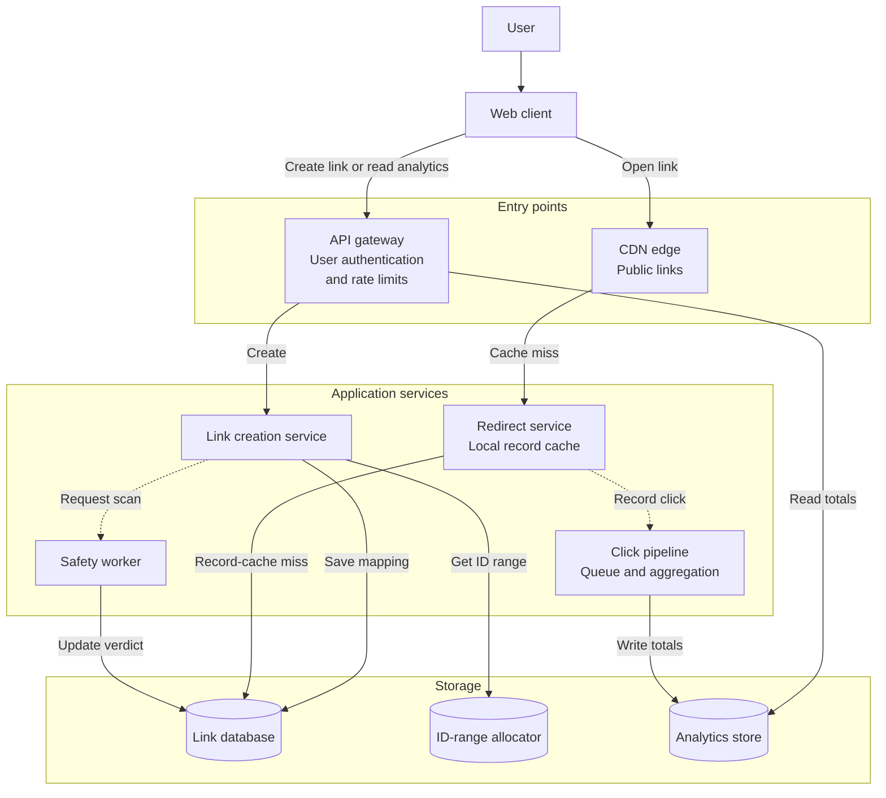
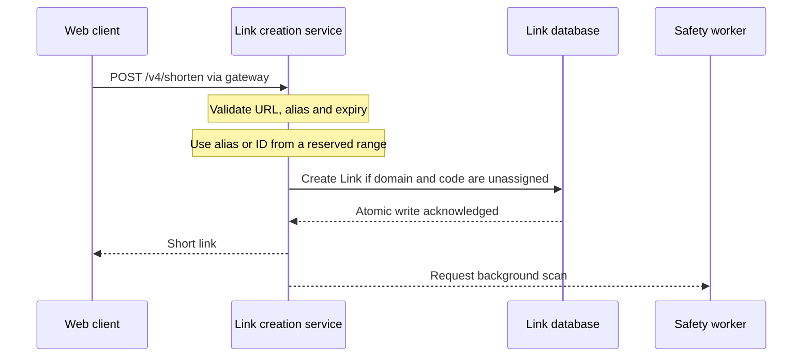
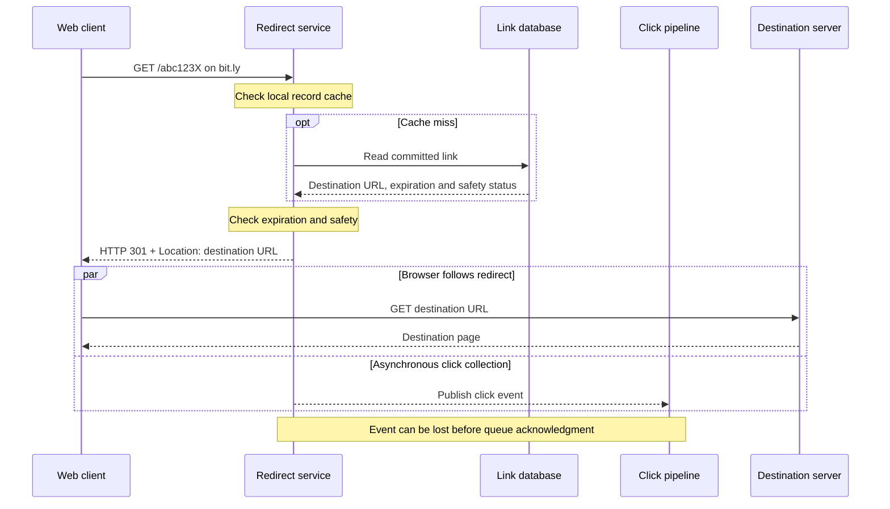
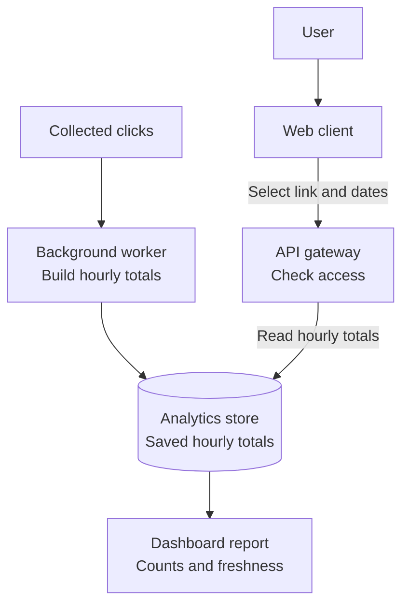
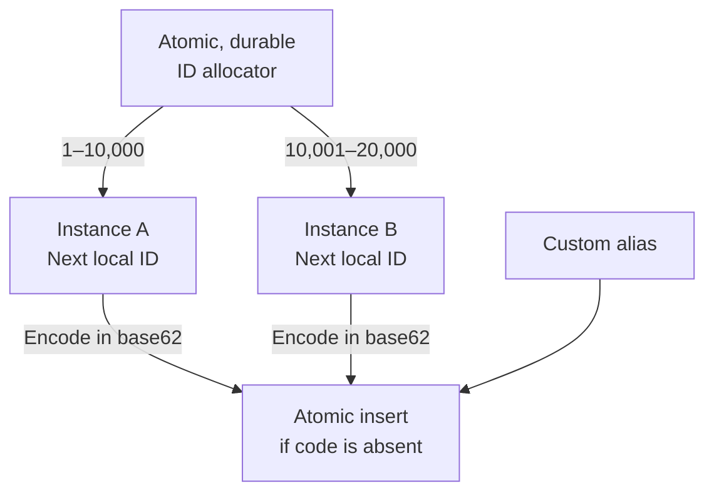
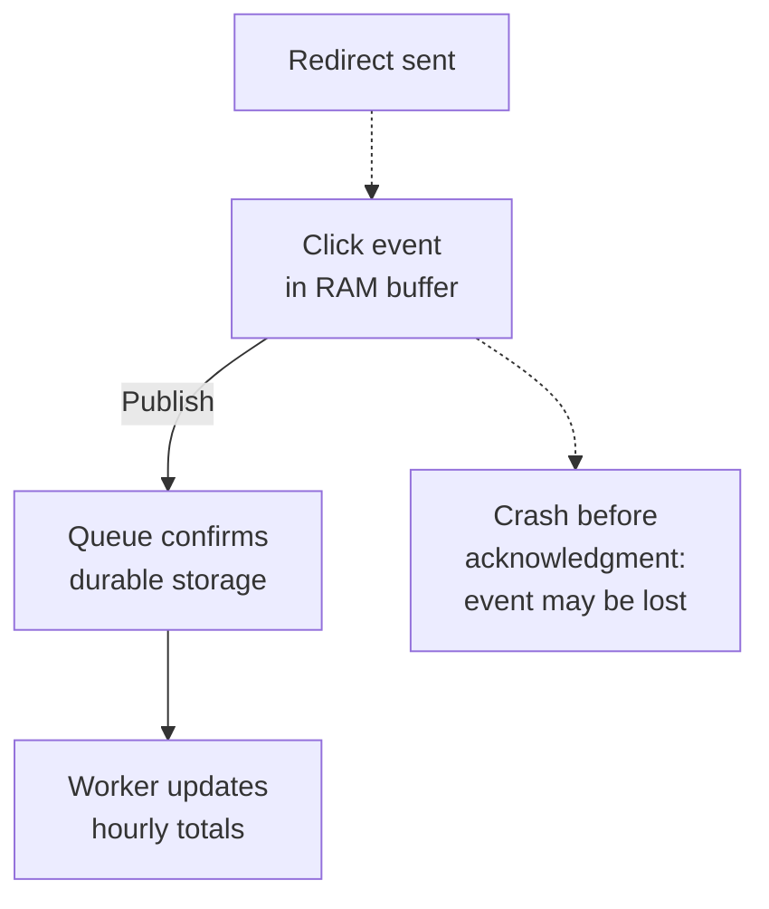

This document describes the design of a Bitly-style URL-shortening service. A user submits a long URL, and the service generates a unique short code or accepts a custom alias, stores the corresponding destination URL, and returns a short link. When a user follows that link, the service redirects the browser to the destination and records the click for analytics.

<!--more-->

## Problem

Long URLs can be cumbersome to share in messages, emails and social posts. Users need a compact, shareable link, and businesses use [click analytics](https://support.bitly.com/hc/en-us/articles/115001195267-What-type-of-campaign-analytics-are-available) to measure campaign performance.

Users follow existing short links much more often than they create them, making this a read-heavy workload.

The service needs to redirect users with low latency and record clicks for analytics. Processing click events asynchronously keeps analytics writes off the redirect request path.

## Requirements

### Functional requirements

- **Create a short link.** A user submits a long URL and receives a unique short link that maps to it.
- **Follow a short link.** The service redirects users who follow an unexpired, permitted public short link to its destination URL.
- **View click analytics.** An organization owns the links created by its users. A user selects one of these links and a date range to see click counts, geographic breakdowns and referring sites.
- **List and preview links.** A user can browse their organization's links and preview a destination URL without following the link or adding a click.
- **Choose a custom alias.** A user can choose a code such as `spring-sale`, provided it is available on the chosen domain.
- **Set an expiration time.** A user can set an expiration time, after which the short link returns an expired-link response.
- **Handle unsafe destinations.** Users see a warning for suspicious destinations or a block page for prohibited destinations.

### Non-functional requirements (targets)

- **Scalability:** support 40B active links, 60K redirects/s and 580 creates/s at peak.
- **Latency:** return redirect responses in under 10ms at P50 and 50ms at P99.
- **High availability:** target 99.99% availability for the redirect endpoint, including during allocator or analytics outages.
- **Link consistency:** each `(domain, short_code)` identifies one link, and newly created links are usable immediately.
- **Analytics freshness:** include 98% of durably collected click events in reported totals within 90 seconds, with the latest processed time shown.
- **Cache freshness:** invalidate service and edge caches after destination or safety changes; cached redirects must expire by the link's expiration time.
- **Access control:** authenticated organization users can create links and read their organization's analytics; public redirects are unauthenticated.

### Out of scope

- Authentication implementation and billing.
- Link-in-bio pages, QR codes and mobile deep links.

## Back-of-the-envelope calculations

- **Traffic:** assume 30B redirects and 300M new links/month—a 100:1 read/write ratio. A 5× burst gives ≈58K redirects/s and 580 creates/s.
- **Code capacity:** seven [base62](https://en.wikipedia.org/wiki/Base62) characters—letters and digits—provide `62^7 ≈ 3.5T` codes. 40B active links use ≈1.1%; retired codes and unused allocated IDs also consume capacity.
- **Click storage:** `30B × 200 bytes ≈ 6TB/month` raw. Assuming 10–100× aggregation, retain ≈60–600GB/month before storage overhead.
- **Database reads:** in an illustrative 95% cache-hit scenario, `58K × 5% ≈ 2.9K reads/s` reach storage. The hit rate depends on traffic and cache policy.

## Core entities

Each Link record is identified by `(domain, short_code)`. This pair is its logical primary key: `bit.ly/spring-sale` and `go.example.com/spring-sale` are separate links, while each code on a given domain belongs to one link.

The [Protobuf-style](https://protobuf.dev/programming-guides/proto3/) models below show the core fields and relationships.

```protobuf
message Link {
  // Primary key: (domain, short_code).
  string domain;
  string short_code;
  string long_url;           // Destination URL.
  string org_id;             // Owner -> Organization.
  Timestamp expires_at;      // Unset for links without an expiry.
  string safety_status;      // safe | warn | blocked
}

message Organization {
  string org_id;
  string name;
}
```

`Organization` identifies the group of users that owns a link. The service checks the authenticated user's membership before allowing them to manage the link or read its analytics.

```protobuf
message ClickEvent {
  string event_id;           // Unchanged when delivery is retried.
  string domain;
  string link_short_code;    // With domain, identifies the Link.
  Timestamp timestamp;       // Time the user followed the link.
  string ip;                 // Derives country; retention is restricted.
  string referrer;
}

message ClickRollup {
  // One count per link, UTC hour, country and referring site.
  string domain;
  string link_short_code;
  Timestamp bucket;
  string country;
  string referrer_domain;
  uint64 click_count;
}
```

```protobuf
message IDSequence {
  string sequence_id;        // Shared sequence for generated codes.
  uint64 next_id;            // Advance atomically to reserve an ID range.
}
```

### API

Proposed service API:

```yaml
"POST /v4/shorten":
  access: authenticated organization member
  body:
    long_url: string
    domain: optional string
    alias: optional string
    expires_at: optional UTC timestamp
  result: [domain, short_code, link]
  errors: {400: invalid input, 409: alias taken, 429: creation limit}

"GET /{short_code}":
  access: public
  domain: request hostname
  result: {status: 301, Location: long_url}
  condition: allowed and unexpired
  errors: {404: missing, 410: expired, 403: blocked}
  warning: show a warning before navigation

"GET /v4/bitlinks/{short_code}/clicks":
  access: organization owns the link
  query:
    domain: string
    units: "hour | day"
    from: UTC bucket boundary
    to: UTC bucket boundary
  interval: "[from, to)"
  result: [time buckets, click counts, country/referrer breakdowns,
           latest processed time]
  empty_result: zero collected clicks
  query_failure: unavailable analytics

"POST /v4/expand":
  access: authenticated organization member
  body: {domain: string, short_code: string}
  result: long_url
  redirect: false
  record_click: false

"GET /v4/organizations/{org_id}/links":
  access: organization member
  query: {size: integer, page: integer}
  result: paginated links owned by the organization
```

The proposed redirect returns HTTP 301 with `Cache-Control: private, max-age=90`, shortened when less than 90 seconds remain before link expiration. The browser can reuse the response during that freshness lifetime and request the destination directly. A safety change at the origin may therefore take effect for that user only after the cached response expires. The caching deep dive explains the effects on safety and click counts.

## High-level design

Authenticated requests use the API gateway for link creation and analytics. Public links use a separate redirect service, which reads URL mappings from a local cache or the link database. The CDN caches redirects where expiration and safety policies allow.

The creation service generates short codes from allocated ID ranges and saves the mappings. A safety worker scans destinations, while an asynchronous click pipeline aggregates events into hourly counts. Services scale independently across availability zones, with replicated link storage. [Bitly's MySQL-to-Bigtable migration](https://cloud.google.com/blog/products/databases/bitly-migrates-link-data-from-mysql-to-bigtable-for-scalability) illustrates how that storage can grow.


```mermaid
flowchart TB
    User["User"] --> Web["Web client"]
    subgraph Entry["Entry points"]
        CDN["CDN edge<br>Public links"]
        API["API gateway<br>User authentication<br>and rate limits"]
    end
    subgraph Services["Application services"]
        Shorten["Link creation service"]
        Redirect["Redirect service<br>Local record cache"]
        Safety["Safety worker"]
        Clicks["Click pipeline<br>Queue and aggregation"]
    end
    subgraph Data["Storage"]
        Links[("Link database")]
        Allocator[("ID-range allocator")]
        Rollups[("Analytics store")]
    end
    Web -->|Open link| CDN
    Web -->|Create link or read analytics| API
    CDN -->|Cache miss| Redirect
    API -->|Create| Shorten
    API -->|Read totals| Rollups
    Shorten -->|Get ID range| Allocator
    Shorten -->|Save mapping| Links
    Shorten -.->|Request scan| Safety
    Redirect -->|Record-cache miss| Links
    Redirect -.->|Record click| Clicks
    Clicks -->|Write totals| Rollups
    Safety -->|Update verdict| Links
```

When a safety result changes, the worker invalidates the affected service and CDN caches. The click pipeline collects events from requests handled by the redirect service; collection for CDN-served redirects remains an open design choice.

### Storage

The design uses Bigtable for link records, PostgreSQL for organizations and ID allocation, local memory for redirect caches, and ClickHouse for analytics.

| Data | Required properties | Selected storage |
| --- | --- | --- |
| Link records | Fast reads by domain and code, durable writes, atomic creation, immediate visibility, horizontal partitioning. | Bigtable |
| Organizations and ID ranges | Relational ownership data and transactional range allocation. | PostgreSQL |
| Cached link records | Low-latency reads, bounded memory, expiration and invalidation. | Per-instance LRU cache |
| Click events and hourly totals | Batched ingestion, time-range queries, grouped reports, compression and retention controls. | ClickHouse |

- **Bigtable:** each row stores a Link record and a permanent code-reservation marker. The row key is `reverse(short_code):domain`; reversing the code distributes sequential writes across key ranges. A [conditional write](https://docs.cloud.google.com/bigtable/docs/writes#conditional-writes) creates the row only when the reservation marker is absent. Writes and redirect reads use the same authoritative cluster for read-after-write consistency. [Failover](https://docs.cloud.google.com/bigtable/docs/routing) must preserve acknowledged reservations before another cluster accepts creations. An organization/time listing index supports browsing links; failed index updates are retried, and ownership is checked against the Link record.
- **PostgreSQL:** stores Organization and IDSequence records. The allocator advances `next_id` in a transaction and returns the reserved range after commit. Acknowledged reservations must survive failover. PostgreSQL is also a simpler alternative for link storage at smaller scale: a unique `(domain, short_code)` constraint and an `(org_id, created_at)` index support creation and listing. See [PostgreSQL](/designs/tech-postgresql/).
- **Local cache:** holds copies of Link records, including expiration and safety status. LRU eviction removes the least recently used entries when memory fills up; expiration and invalidation control freshness. A shared Redis cache is an alternative when reuse across instances matters more than avoiding a network lookup. Redis offers [LRU/LFU eviction](https://redis.io/docs/latest/develop/reference/eviction/) and TTLs; see [Redis](/designs/tech-redis/).
- **ClickHouse:** its [column-oriented storage](https://clickhouse.com/docs/get-started/about/intro) supports batched ingestion and reports grouped by link, time, country and referrer. Raw events retain stable IDs for deduplication; saved hourly totals serve dashboard queries. Retain event IDs for the replay window and restrict raw-IP access and retention.

Cassandra is another option for distributed link storage when an existing cluster or portability favors it. Alias creation requires [`IF NOT EXISTS`](https://cassandra.apache.org/doc/latest/cassandra/developing/cql/dml.html#insert)[ with a lightweight transaction](https://cassandra.apache.org/doc/latest/cassandra/developing/cql/dml.html#insert), plus consistency settings that preserve uniqueness and immediate reads. See [Cassandra](/designs/tech-apache-cassandra/).

Kafka carries click events from redirect services to analytics workers and retains them for replay. The click-processing deep dive explains this flow and how workers recover safely. See [Kafka](/designs/tech-kafka/).

## Functional scenarios

### Creating a link

A user submits a long URL and receives a short link such as `https://bit.ly/abc123X`. The creation request can also include a domain and an expiration time.

- **Validate the request.** The web client sends `POST /v4/shorten`. The gateway authenticates the user and checks membership in the organization that will own the link. The creation service validates the destination URL, domain permissions and expiration time, then sets `org_id` to that organization's ID. Invalid input returns 400, denied access returns 403, and exceeding the creation limit returns 429.
- **Generate and save the code.** The creation service takes the next numeric ID from its reserved range and encodes it as seven base62 characters. It creates the Link record in Bigtable with its domain, code, destination, organization ID and timestamps. A conditional write saves the record only if that domain-and-code pair has never been assigned. If an alias already uses the generated code, the service tries the next ID.
- **Respond after the write succeeds.** Once Bigtable acknowledges the new record, the service returns the short link and schedules a background safety scan. A failed write returns a service error. A timeout may occur after a successful write, so retrying creation can produce another link; request-idempotency handling remains to be specified.

The new link must work immediately after creation. Redirect reads therefore need read-after-write consistency: a cache miss must reach a database copy containing the committed record. Any cached 404 for the same key must be invalidated. An eventually consistent replica that has not received the write could otherwise report a newly created link as missing.


```mermaid
sequenceDiagram
    participant W as Web client
    participant S as Link creation service
    participant D as Link database
    participant B as Safety worker
    W->>S: POST /v4/shorten via gateway
    Note over S: Validate URL, alias and expiry
    Note over S: Use alias or ID from a reserved range
    S->>D: Create Link if domain and code are unassigned
    D-->>S: Atomic write acknowledged
    S-->>W: Short link
    S-->>B: Request background scan
```

Calling the allocator for every link would add a network round trip and make creation depend on its availability. Reserving ID ranges moves most allocation work into the service instance; the code-generation deep dive covers durable reservations, refill and collision handling.

### Choosing a custom alias

A user includes `alias: spring-sale` in the link creation request, `POST /v4/shorten`, to request `https://bit.ly/spring-sale`.

- **Validate the request and alias.** Perform the organization-membership, domain-permission, URL and expiration checks described above. Accept letters, digits and hyphens, reject reserved routes, and store the alias as `short_code`. Both user-chosen aliases and generated codes identify Link records, so either kind can already occupy the requested domain-and-code pair.
- **Create the Link record atomically.** In Bigtable, write the complete record only if no reservation exists for `(bit.ly, spring-sale)`. The database checks the reservation marker and writes the record in one atomic operation. Competing requests for that pair are handled by the same cluster, so only one can create the record.
- **Return the result.** A successful write returns the short link. If the pair is already reserved, return [HTTP 409 Conflict](https://www.rfc-editor.org/rfc/rfc9110.html#name-409-conflict) so the user can choose another alias. A database timeout or outage returns a service error.

We use Bigtable's [conditional-write API](https://docs.cloud.google.com/bigtable/docs/samples/bigtable-writes-conditional) to check `meta:reserved` and create the marker and serialized Link together. The marker is retained when an expired destination is removed, so a previously shared code stays reserved. The `table` below uses single-cluster routing, and `link` is the populated Protobuf record:

```python
from google.cloud.bigtable import row_filters

def create_link_if_absent(table, link):
    row_key = f"{link.short_code[::-1]}:{link.domain}".encode()
    reserved = row_filters.RowFilterChain([
        row_filters.FamilyNameRegexFilter("^meta$"),
        row_filters.ColumnQualifierRegexFilter(b"^reserved$"),
    ])
    row = table.conditional_row(row_key, filter_=reserved)
    row.set_cell("meta", b"reserved", b"1", state=False)
    row.set_cell("link", b"data", link.SerializeToString(), state=False)
    already_reserved = row.commit()
    return not already_reserved
```

The [commit result](https://docs.cloud.google.com/python/docs/reference/bigtable/latest/row#google_cloud_bigtable_row_ConditionalRow_commit) reports whether the marker existed. If it did, the stored Link is unchanged; otherwise, the two cells are written atomically. The `meta` and `link` column families must already exist.

An availability preview shows the database state at the time of the check. Another user can submit the same alias before the first user completes the form, causing a race between their creation requests. The atomic write accepts one request and returns a conflict for the other. The UI then asks that user to choose another alias.

The preview adds one database read for early feedback; the conditional write determines whether creation succeeds. Generated codes use the same operation, as explained in the code-generation deep dive.

### Following a short link

When a user follows `https://bit.ly/abc123X`, the web client sends `GET /abc123X` to `bit.ly`. The hostname supplies the domain, giving the lookup key `(bit.ly, abc123X)`. This endpoint is public.

- **Read the link.** Check the local record cache, then read the Link record from the database on a miss. Cache entries use the complete domain-and-code key. A confirmed missing record returns 404; a failed database read returns a server error.
- **Apply link policy.** Check `expires_at` and `safety_status` even when the record comes from the cache. An expired link returns 410, a blocked link returns a 403 page, and `warn` displays a warning. Valid expiration and block responses count as successfully handled requests in the availability target.
- **Return the redirect.** For an allowed, unexpired link, return an [HTTP redirect response](https://www.rfc-editor.org/rfc/rfc9110.html#name-redirection-3xx): `301 Moved Permanently`, with the destination in the `Location` header. The web client then requests that URL. Set the browser-cache lifetime to at most 90 seconds, shortened to the remaining lifetime of an expiring link.
- **Collect the click asynchronously.** Assign an `event_id` and visit timestamp, then place the event in the publisher's buffer. The service returns the redirect while the publisher sends batches to Kafka. Retries retain the same ID so analytics workers can deduplicate events. Collection becomes durable when Kafka acknowledges the configured replicas; a crash before acknowledgment can lose a click.


```mermaid
sequenceDiagram
    participant W as Web client
    participant R as Redirect service
    participant D as Link database
    participant P as Click pipeline
    participant T as Destination server
    W->>R: GET /abc123X on bit.ly
    Note over R: Check local record cache
    opt Cache miss
        R->>D: Read committed link
        D-->>R: Destination URL, expiration and safety status
    end
    Note over R: Check expiration and safety
    R-->>W: HTTP 301 + Location: destination URL
    par Browser follows redirect
        W->>T: GET destination URL
        T-->>W: Destination page
    and Asynchronous click collection
        R-->>P: Publish click event
    end
    Note over R,P: Event can be lost before queue acknowledgment
```

With the proposed `Cache-Control: private` policy, cached HTTP redirects are limited to private caches such as the browser. CDN-served redirects require the separate shared-cache policy described in the cache deep dive. Reusing an HTTP redirect bypasses the service's current expiration and safety checks and its click collection; caching a Link record keeps those checks in the request path.

A popular link can cause many simultaneous cache misses to request the same database record. The hot-link deep dive explains how a local cache and a shared in-flight lookup reduce those repeated reads.

### Setting an expiration

A user sets `expires_at` when creating a temporary link—for example, Friday at 18:00 UTC.

- **Validate and store the deadline.** In `POST /v4/shorten`, validate `expires_at` as a UTC timestamp between five minutes and one year ahead, then save it in the Link record. Invalid input returns 400.
- **Enforce it during redirects.** After reading the record, compare the current time with `expires_at`. At `now >= expires_at`, return 410 Gone. Perform the comparison on local-cache hits as well as database reads.
- **Bound cached responses.** Calculate the browser's `max-age` as the smaller of 90 seconds and the remaining whole seconds before expiration. If less than one second remains, use `no-store`. A shared-cache policy must enforce the same deadline.

Thus, a redirect issued at 17:59:50 can be cached for at most ten seconds, even though the usual lifetime is 90 seconds.

The hourly cleanup job archives expired destination data while retaining the key and expiration marker. Subsequent requests can still return 410, and the code remains reserved. Request-time checks enforce the deadline independently of cleanup; the cache-policy deep dive covers freshness and invalidation.

### Reading click analytics

A user selects a link in the dashboard and requests click counts for a date range, grouped by hour or day.

- **Authorize and validate the query.** The web client sends the domain, code, `from`, `to` and `units`. The gateway checks organization membership and link ownership before querying analytics. Use an inclusive `from` and exclusive `to`, aligned to the selected UTC reporting boundaries; invalid or reversed ranges return 400.
- **Read saved totals.** Query ClickRollup by domain, code and hourly bucket, then sum `click_count` for the requested period. For daily reports, combine UTC hours and incorporate late events from daily reconciliation. Country and referrer views group the same collected events by their recorded dimensions; missing referrers remain unattributed.
- **Return counts and freshness.** The response includes time buckets, counts and the worker's latest processed time. Display zero after a successful query finds no collected clicks, and an unavailable-data message when the query fails.

The ClickHouse query sums country- and referrer-specific totals into one count per hour. Its named parameters identify the link and reporting interval:

```sql
SELECT bucket, SUM(click_count) AS clicks
FROM click_rollups FINAL
WHERE domain = {domain:String}
  AND link_short_code = {code:String}
  AND bucket >= {from:DateTime} AND bucket < {to:DateTime}
GROUP BY bucket
ORDER BY bucket;
```

The rollup table uses `ReplacingMergeTree(version)` with the ClickRollup key as its sorting key. `FINAL` selects the latest stored version for each row before the query sums its counts.

For example, 12 clicks in the 09:00–10:00 UTC bucket and 8 in the next bucket produce 20 for `[09:00, 11:00)`. Requiring bucket-aligned boundaries prevents an hourly total from being presented as an exact count for part of that hour.


```mermaid
flowchart TB
    Visits["Collected clicks"]
    Worker["Background worker<br>Build hourly totals"]
    Totals[("Analytics store<br>Saved hourly totals")]
    User["User"] --> Web["Web client"]
    Web -->|"Select link and dates"| API["API gateway<br>Check access"]
    Visits --> Worker --> Totals
    API -->|"Read hourly totals"| Totals
    Totals --> Report["Dashboard report<br>Counts and freshness"]
```

The freshness target is to include 98% of events within 90 seconds after durable queue acknowledgment. Each collected click event contributes once after deduplication; separate requests by the same user count as separate clicks. Reports cover requests handled by the redirect service, with browser- and CDN-cached redirects outside that collection path.

Scanning raw events for every dashboard query would increase query cost as history grows. An index or equivalent storage ordering on `(domain, link_short_code, bucket)` restricts reads to the selected link and interval; saved hourly totals reduce the number of records to sum. The click-processing deep dive covers deduplication, late events and reconciliation.

Users can browse their organization's links in a paginated list. Destination preview returns the saved URL as data and leaves the click count unchanged.

### Handling unsafe destinations

A destination can become suspicious after a short link is created. Each redirect uses the saved safety verdict to decide whether to continue, display a warning or block navigation.

- **Schedule and perform scans.** Creation requests the first background scan, and recurring jobs recheck recently used destinations. The worker reads the Link's destination and runs the external checks within its scan budget. A timeout leaves verification incomplete and schedules a retry, as described in the safety deep dive.
- **Commit the verdict and invalidate caches.** The worker saves `safe`, `warn` or `blocked` in the Link record, then invalidates that domain-and-code key in service caches and any configured CDN cache. Failed invalidations need retries; until they succeed or an entry expires, requests may still use an older verdict.
- **Apply the current result.** The redirect service checks the verdict after resolving the link. If a user continues from a warning page, that new request reads the authoritative Link record and rechecks expiration and safety before returning a redirect.

| Saved verdict | What the user sees | Next action |
| --- | --- | --- |
| `safe` | Normal redirect | Follow the destination while the link remains valid. |
| `warn` | Warning with the destination shown | If continuing is permitted, recheck expiration and the latest verdict before redirecting. |
| `blocked` | 403 block page | Display the block page and end the request. |

The current model initializes new links as `safe`, allowing navigation while the first scan is pending. A failed scan-scheduling request therefore needs recovery, and a pending-scan state and scanner-outage behavior remain open choices. Browser-cached redirects remain usable for their freshness lifetime after the origin records a block.

An external check on every redirect would add scanner latency and availability to the request path. Background scans keep that work separate, at the cost of serving an older verdict between checks. The safety deep dive compares the alternatives and their detection limits.

## Deep dives

### Unique short codes

Several creation-service instances can generate links at the same time. Their IDs must remain distinct through crashes and database failover. A generated code can also match an alias chosen by a user, so the Link write must enforce uniqueness even when ID allocation is correct.

- **A central sequence:** increment one durable counter and encode the result in base62. Each creation request makes a database call to obtain its ID. This is the simplest option when that call's latency and availability are acceptable.
- **Random codes or a truncated URL hash:** each instance generates a candidate independently and attempts a uniqueness-checked insert. Collisions require a retry with another candidate. A URL-hash strategy also needs a way to assign distinct codes to separate campaign links that share the same destination. At 40B assignments in a seven-character base62 space, random generation would require roughly 200M collision retries.
- **Allocated ID ranges:** the allocator durably reserves a distinct range for each instance, which generates codes locally from that range. One reservation supports many creations. Durable, non-overlapping reservations preserve uniqueness across crashes.

**Recommended:** reserve ID ranges to keep allocation local for most creation requests. An instance with unused IDs can continue creating links during a short allocator outage. A central sequence remains a simpler alternative at the assumed 580 creates/s.

[Base62](https://en.wikipedia.org/wiki/Base62) represents a numeric ID using letters and digits. We use the alphabet `0123456789abcdefghijklmnopqrstuvwxyzABCDEFGHIJKLMNOPQRSTUVWXYZ`, with uppercase and lowercase treated as distinct characters. ID `62` becomes `10`, then `0000010` when padded to seven characters. Each instance encodes the next ID from its reserved range:


```mermaid
flowchart TB
    Allocator["Atomic, durable<br>ID allocator"]
    Allocator -->|"1–10,000"| A["Instance A<br>Next local ID"]
    Allocator -->|"10,001–20,000"| B["Instance B<br>Next local ID"]
    A -->|"Encode in base62"| Insert["Atomic insert<br>if code is absent"]
    B -->|"Encode in base62"| Insert
    Alias["Custom alias"] --> Insert
```

The allocator uses the IDSequence row with `sequence_id = "generated_links"`. In one PostgreSQL transaction, it advances `next_id` by the range size and returns the previous interval after commit. All instances reserve ranges through this shared row, so their allocations cannot overlap. Acknowledged reservations must survive database failover. After an instance crashes, unused IDs from its range stay reserved because some may already have been issued. [PostgreSQL's atomic updates](https://www.postgresql.org/docs/current/sql-update.html) provide the transaction mechanism; its [sequence documentation](https://www.postgresql.org/docs/current/functions-sequence.html) explains why gaps are acceptable. [Designing Data-Intensive Applications](https://dataintensive.net/) covers the broader coordination.

A 10,000-ID range requires one allocation call for every 10,000 creations, so about 99.99% of link creations avoid that call. At the assumed peak of 580 creates/s, this works out to roughly 0.058 allocations/s across the fleet. An individual instance creating ten links/s would take about 17 minutes to use its full range.

An instance requests another range when 20% of its current range remains. A late refill adds an estimated 5ms to creation. If the instance exhausts its IDs during an allocator outage, creation returns HTTP 503 while refill retries use exponential backoff. Larger ranges tolerate longer outages but leave more unused IDs after crashes. Stop allocation at `62^7` to stay within seven-character codes.

Distinct IDs produce distinct generated codes. A custom alias can still use one of those codes, so every Link creation goes through the Bigtable [conditional write](https://docs.cloud.google.com/bigtable/docs/writes#conditional-writes) described above. If its reservation marker already exists, the service skips that ID and tries the next one. All competing claims use the same cluster.

For comparison, assume a central counter can handle 10K increments/s and that a separate allocator call adds 1–3ms to each creation. That capacity would cover the proposed create load. These figures are inputs to the sizing calculation; actual throughput and round-trip latency require measurement.

**Range-boundary example.** If next_id is 20,001 and the requested size is 10,000, the transaction advances it to 30,001 and returns \[20,001, 30,001). A concurrent reservation then starts at 30,001. Return the interval only after commit; otherwise a rolled-back reservation could still have issued codes.

Associate a stable allocation request ID with the reserved interval. If the response is lost after commit, the instance can recover that same interval instead of ambiguously asking for another. After a process crash, never resume an old interval without reliable issued-ID state; discarding its remainder preserves uniqueness at the cost of gaps.

The Link insert remains a separate uniqueness boundary. An allocated generated code already occupied by a custom alias consumes that ID and tries the next; it never overwrites the alias.

### Popular links

When a link is shared with a large audience, many users request the same destination at once. A database index makes each lookup efficient, but every request still asks storage for the same record. Caching avoids most of those repeated reads; the difficult case is the first burst, when several requests arrive before the record has been cached.

- **Indexed database reads:** the simplest path, with one authoritative record. Every redirect still reaches storage, including repeated requests for a hot link.
- **A shared Redis cache:** all instances reuse the same cached record, reducing database reads even when requests land on different instances. Each cache lookup still crosses the network, and the shared cache needs enough capacity and availability to serve the redirect traffic.
- **A local LRU cache with shared in-flight lookups:** each instance serves cached records from its own memory and combines simultaneous misses for the same code into one database lookup. Hits avoid a network call, but every instance has its own cache to warm and must remove stale entries when links change.

**Recommended:** use a local record cache in the scaled redirect service. LRU eviction removes the least recently used records when memory fills up. On a cache miss, the first request starts the database lookup and other requests for that key on the same instance wait for its result instead of starting their own lookups. This coordination is called singleflight:

```text
resolve(domain, short_code):
    key = (domain, short_code)
    if local_cache contains key:
        return cached_record
    return singleflight(key, lookup_in_database)
```

Singleflight combines concurrent lookups within one instance; each other instance warms its own cache. A watcher can preload a suddenly popular link into those caches to reduce the fleet's initial database lookups. The proposed trigger is 10K requests/s per instance, with about 100ms budgeted to distribute the update. The cache uses at most 25% of the instance's heap, and each shared lookup has a five-second deadline that bounds how long requests wait for a stalled fetch.

When a link changes, an invalidation message tells each instance to remove its cached record. Failed deliveries need retries and a bounded TTL, so stale records eventually expire. Requests for many distinct, uncached links still reach Bigtable; cold-start and eviction tests establish how much of that traffic storage can handle.

**Cold burst versus sustained misses.** On one instance, 1,000 simultaneous requests for a cold link can share one database lookup and receive the same result. Across 200 cold instances, ordinary singleflight can still produce up to 200 lookups. Prewarming or a shared fill coordinator addresses that fleet-wide burst if measurements justify the added component.

Store record version and expiry with each cached value. A lookup begun for version 10 must not repopulate the cache after version 11's invalidation; retain a versioned tombstone or compare the invalidation generation before accepting the fill.

Use a bounded wait deadline consistent with the redirect latency budget. Waiting five seconds bounds resource retention but misses the normal latency target; mark it as failure handling and load-test those slow-path requests separately.

### Redirect cache policy

Caching a Link record keeps the redirect service involved in each request, allowing it to check expiration and safety before responding. Caching the HTTP redirect response lets a browser or CDN reuse the previous navigation instruction. Those cached responses bypass the service's current checks and click collection, so their lifetime affects both link behavior and analytics coverage.

The three places to cache have different controls:

| Cache | What it stores | Control and limits |
| --- | --- | --- |
| Service | Link record | Invalidate changed records; check expiration before redirecting. |
| CDN | HTTP redirect | Purge where configured; cache only where policy permits. |
| Browser | HTTP redirect | Remains under browser control until expiry; may bypass safety checks and click collection. |

**Recommended:** cache Link records inside the service to reduce database reads while checking expiration and safety on each request. Browser and CDN caching eliminate the request to the service, so their freshness policy must account for destination or verdict changes and analytics coverage.

The proposed `private, max-age=90` policy permits browser reuse for up to 90 seconds, bounded by link expiration, and restricts storage to private caches ([HTTP cache rules](https://www.rfc-editor.org/rfc/rfc9111.html#name-private)). A redirect with less than one second remaining uses `no-store`. The CDN hit-rate estimates describe a separate shared-caching scenario, which also requires expiration-bounded freshness and a purge mechanism for destination or safety changes.

HTTP 301 is [cacheable without explicit freshness](https://www.rfc-editor.org/rfc/rfc9110.html#name-301-moved-permanently), and HTTP 302 can also be cached when the response policy allows it. Both therefore need explicit cache controls to enforce the intended lifetime. That lifetime must end by link expiration, and cached warning or block responses must preserve those response types. A committed safety change requires origin and edge cache invalidation, while responses already cached by a user's browser remain usable until their freshness expires.

**Expiration-bounded response.** A link expires at 12:00:45 and is requested at 12:00:00. A proposed 90-second browser lifetime is shortened to at most 45 seconds. The redirect record is checked before response generation, and the Cache-Control lifetime ends no later than the link deadline.

A later blocked verdict can purge service and configured edge caches, but an already-issued private browser response may remain reusable for its remaining lifetime. This is the concrete freshness tradeoff of response caching; changing 301 to 302 without cache controls does not establish immediate safety updates.

Keep response-cache policy separate from record-cache policy in configuration and metrics. An origin miss, an edge hit and a browser reuse have different request visibility and analytics coverage.

### Click processing

Returning a redirect response requires a destination lookup and the expiration and safety checks; recording a click adds a write. If the service waits for that write before responding, a slow analytics store makes the user wait and an outage can interrupt navigation. Returning the redirect first avoids that dependency, but leaves a period in which a crash could lose the click before it is saved.

- **Update a counter synchronously:** commit the click-counter update before returning the redirect. This keeps counting simple, but adds write latency to each request and makes navigation depend on the analytics store.
- **Buffer events and publish asynchronously:** return the redirect promptly, then batch click events into a durable queue. Analytics processing runs independently of the response. Events awaiting queue acknowledgment remain vulnerable to a process crash.
- **Wait for durable recording before responding:** the service waits for the queue to confirm that it has saved the event before returning the redirect. This removes the pre-acknowledgment loss window for successful responses, but adds queue latency to every visit and makes navigation depend on the queue's availability.

**Recommended:** buffer click events in the redirect service and publish them to Kafka asynchronously. Analytics workers store them in ClickHouse and build hourly totals separately. This keeps analytics latency off the redirect path, with possible click loss before Kafka acknowledges storage. Billing-grade records would require stronger durability guarantees.


```mermaid
flowchart TB
    Response["Redirect sent"] -.-> Buffer["Click event<br>in RAM buffer"]
    Buffer -->|"Publish"| Queue["Queue confirms<br>durable storage"]
    Queue --> Worker["Worker updates<br>hourly totals"]
    Buffer -.-> Loss["Crash before<br>acknowledgment:<br>event may be lost"]
```

#### Technologies and event flow

- **Kafka retains and distributes events.** Publishers send batches to a replicated `click-events` topic with `acks=all`, replication factor 3 and `min.insync.replicas=2`. These proposed settings acknowledge a batch after the required in-sync replicas have stored it. Partition by `event_id` to distribute even a popular link's clicks across workers.
- **Analytics workers enrich and save events.** A Kafka consumer group shares the partitions. Each worker derives country with a local GeoIP lookup, extracts the referrer domain and inserts a batch into ClickHouse. It commits its Kafka offsets—the positions through which it has read—after ClickHouse acknowledges the insert. A crash can replay a batch, so events retain their original `event_id`.
- **ClickHouse builds reports.** Store raw events in `ReplacingMergeTree`, partitioned by their original event date and ordered by `(domain, link_short_code, timestamp, event_id)`. Retries keep these fields unchanged. [Query-time deduplication with ](https://clickhouse.com/docs/reference/engines/table-engines/mergetree-family/replacingmergetree#query-time-de-duplication--final)[`FINAL`](https://clickhouse.com/docs/reference/engines/table-engines/mergetree-family/replacingmergetree#query-time-de-duplication--final) removes duplicate deliveries before aggregation. Rebuild affected hourly totals as versioned snapshots keyed by the ClickRollup fields; report queries select the latest version of each total instead of adding replayed counts.

This uses Kafka consumers and scheduled aggregation jobs. Flink is an alternative for continuously maintained event-time windows and checkpointed processing. Its [Kafka connector](https://nightlies.apache.org/flink/flink-docs-stable/docs/connectors/datastream/kafka/) supports checkpoint-based recovery, but the ClickHouse output still needs replay-safe writes. Add that processing layer when windowing complexity justifies it.

The aggregation below rebuilds one affected hour from deduplicated events:

```sql
SELECT domain, link_short_code,
       toStartOfHour(toTimeZone(timestamp, 'UTC')) AS bucket,
       country, referrer_domain, COUNT(*) AS click_count
FROM click_events_raw FINAL
WHERE timestamp >= {hour_start:DateTime}
  AND timestamp < {hour_end:DateTime}
GROUP BY domain, link_short_code, bucket, country, referrer_domain
```

The publisher sends a batch when it reaches 1,000 events or has waited 100ms, whichever happens first. Batching reduces publishing overhead. Events remain vulnerable to a process crash until the queue acknowledges them, and a prolonged outage can exhaust the buffer and lose more events. The loss window depends on outage duration and available buffering. Monitor dropped-event counts and queue lag, and stress-test the assumption that the buffer overflows only after more than one second of failure at peak traffic. Acceptable click loss remains an open choice; the 90-second target applies to processing delay after durable collection.

Synchronous analytics writes are estimated to add 2–5ms to each redirect. A browser beacon would move collection to the client and change the navigation flow, with an assumed 10–30% event loss from tracking blockers. Adopting it would require evaluating those collection semantics and losses separately.

An event can arrive after its reporting hour has ended. Within five minutes, the worker updates the original hourly bucket; later arrivals enter a separate partition for daily reconciliation. The daily reporting job must combine hourly totals with reconciled late events explicitly. Storage compaction handles storage layout, while reconciliation incorporates those events into the daily count.

A worker that saves a batch and crashes before committing its Kafka offsets reads that batch again after restarting. Deduplicating by `event_id` and rebuilding totals prevents those retries from increasing the count. Two genuine clicks can share a timestamp and IP, so those fields cannot identify an event reliably. A transactional-counter alternative must save the processed ID and increment the count in the same transaction. Kafka's [delivery-semantics documentation](https://kafka.apache.org/42/design/design/#message-delivery-semantics) explains why writes to an external database require this coordination. These guarantees cover collected events; browser- and CDN-cached visits remain outside the collection path.

**Versioned rollup correction.** Suppose hour H contains 100 deduplicated events and publishes rollup revision 1. A late event adds one genuine click. Rebuild the affected hour to absolute count 101 and publish revision 2; a report selects the latest revision rather than adding 100 and 101.

If an insert succeeded before the worker crashed, replay preserves each event's identity and original ordering fields. Query-time deduplication removes that duplicate before rebuilding. A reconciliation generation must sort after the streaming generation it corrects, so a delayed old aggregation cannot replace the newer result.

Store each publication's source cutoff and completion state with its rollup version. This connects a displayed count to collected evidence and distinguishes pipeline lag from visits never collected because of browser reuse or pre-acknowledgement loss.

### Link safety

A destination can change after the short link is created—for example, a harmless site may later serve malware. A creation-time scan establishes a verdict for that point in time. Detecting subsequent changes requires another check. Performing it on every redirect gives a more recent verdict but adds scanner latency and availability to the user's request path.

- **Scan only at creation:** cheap and simple, but a later change can go undetected indefinitely.
- **Check externally on every redirect:** request the freshest available verdict before returning a redirect. Navigation then depends on the scanner's latency and availability. Detection is limited to threats already known to the provider.
- **Rescan in the background and cache results:** check destinations periodically and update cached records when a verdict changes. Each redirect uses the saved verdict, keeping external scanner latency off the request path. Visits between scans may use an older verdict after a destination changes.

**Recommended:** scan destinations in the background and store `safe`, `warn` or `blocked` results with the link. When a verdict changes, clear the cached copies so new requests can use it. This keeps external checks out of the redirect path, but the protection still depends on scan frequency and the policy used while the scanner is unavailable.

A scan follows up to five redirect hops and collects the destination's title and content type, combining those signals with threat intelligence before writing a verdict to the Link record. The starting scan budget is 1–5s. After a crawl timeout, the worker consults the threat API and schedules another scan, leaving verification incomplete. It rescans links visited in the previous 30 days once a day, focusing recurring work on recently active destinations.

As noted in the safety scenario, the model currently allows visits before the first scan finishes. A pending-scan state and behavior during scanner outages are still undecided.

[Bitly's Web Risk integration](https://cloud.google.com/blog/topics/partners/bitly-ensuring-real-time-link-safety-with-web-risk-to-protect-people) describes five risk tiers and a feed covering more than a million unsafe URLs, illustrating the use of external threat intelligence. The timeouts and blocking thresholds in this design are proposed choices. [Bitly's current safety description](https://bitly.com/blog/trust-safety-at-bitly/) checks its Abuse API on each click; the cached-verdict approach here needs its own freshness guarantees.

A definitive blocklist can identify a known unsafe destination for rejection. A counting Bloom filter first narrows the lookup to possible matches, which require a definitive check because the filter can produce false positives. The same distinction applies if a filter is used to check whether an alias is taken: the final lookup establishes membership. [Bitly's dablooms](https://word.bitly.com/post/28558800777/dablooms-an-open-source-scalable-counting) provides the counting-filter background. Newly emerging threats remain a detection gap until a scan or feed update identifies them.

The proposed creation limits are 100 requests/minute per organization and five concurrent connections per IP. Exceeding a limit returns 429 with `Retry-After`; [Bitly's published API limits](https://dev.bitly.com/docs/getting-started/rate-limits/) describe Bitly's own policy. The blocking threshold remains an open choice: block only the highest-confidence risk tier, or include the high-risk tier after a timeout.

**Safe scanner execution.** Fetching a user-submitted destination is a server-side network operation, so the scanner needs a constrained egress boundary. Validate scheme and resolved destination before connecting, block internal/loopback/link-local addresses, and repeat validation at every redirect hop. Bound response bytes, decompressed size, time and redirect count.

A scan job carries link and destination versions. If a user changes the destination while the scan is running, its old verdict cannot overwrite the new destination's state. Commit a verdict only when the scanned version still matches, then emit the corresponding invalidation.

Persist scan time and intelligence version so freshness can be evaluated. This mechanism does not decide the still-open pending-scan policy; it ensures that whichever policy is chosen applies a verdict to the destination actually inspected.
