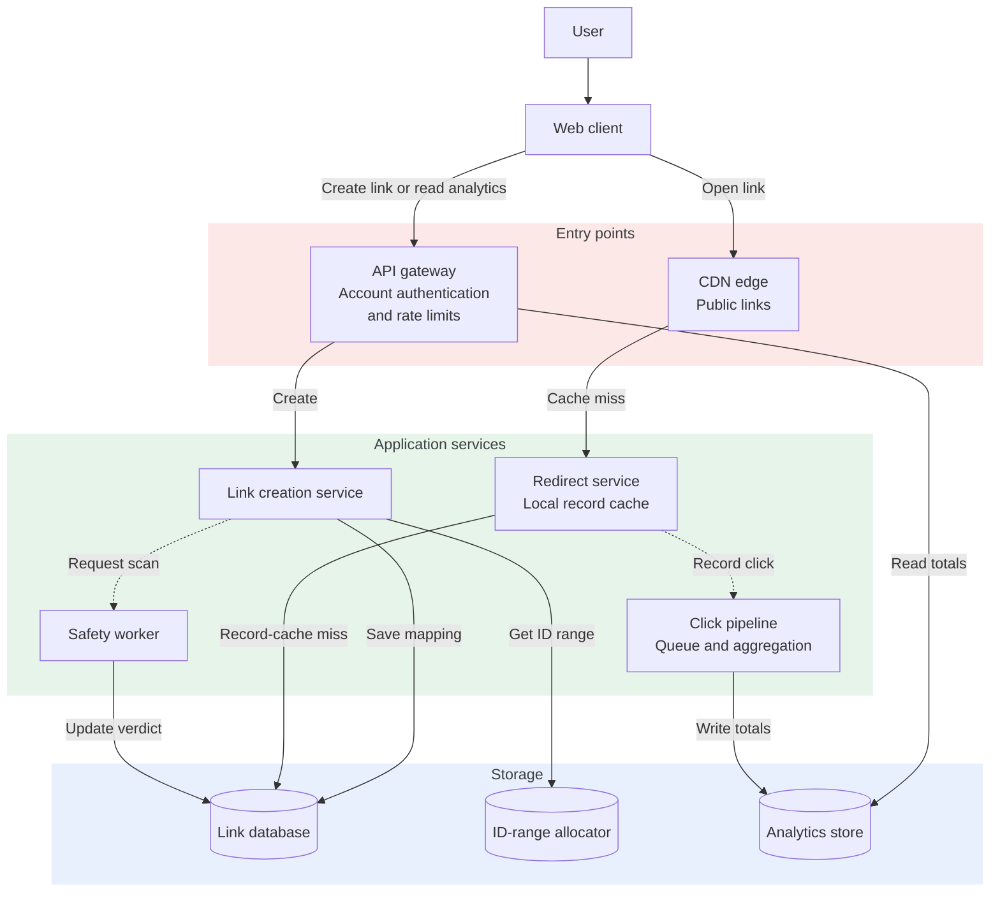
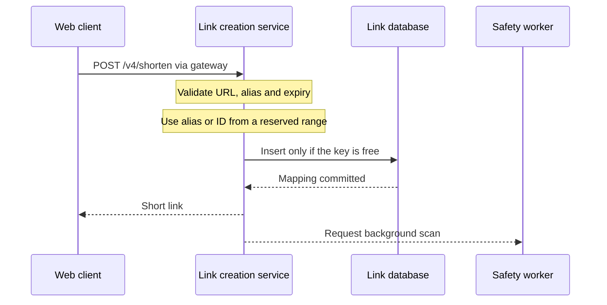
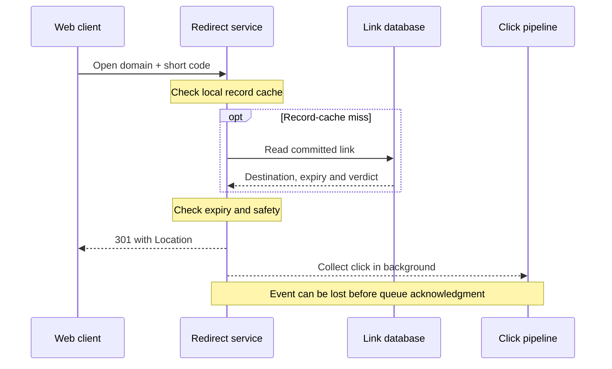
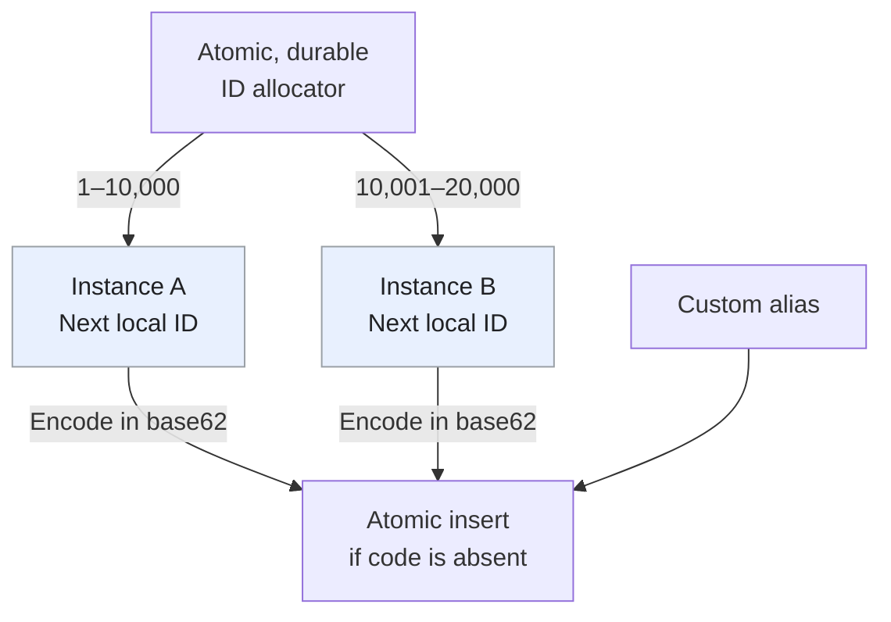
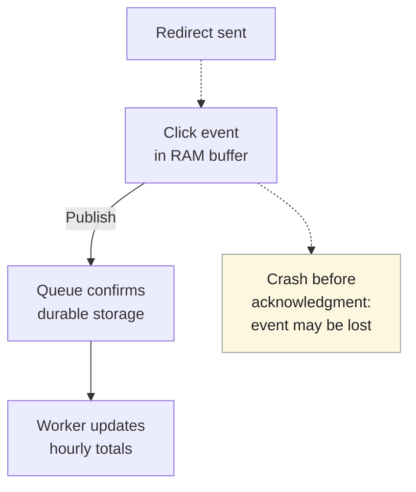
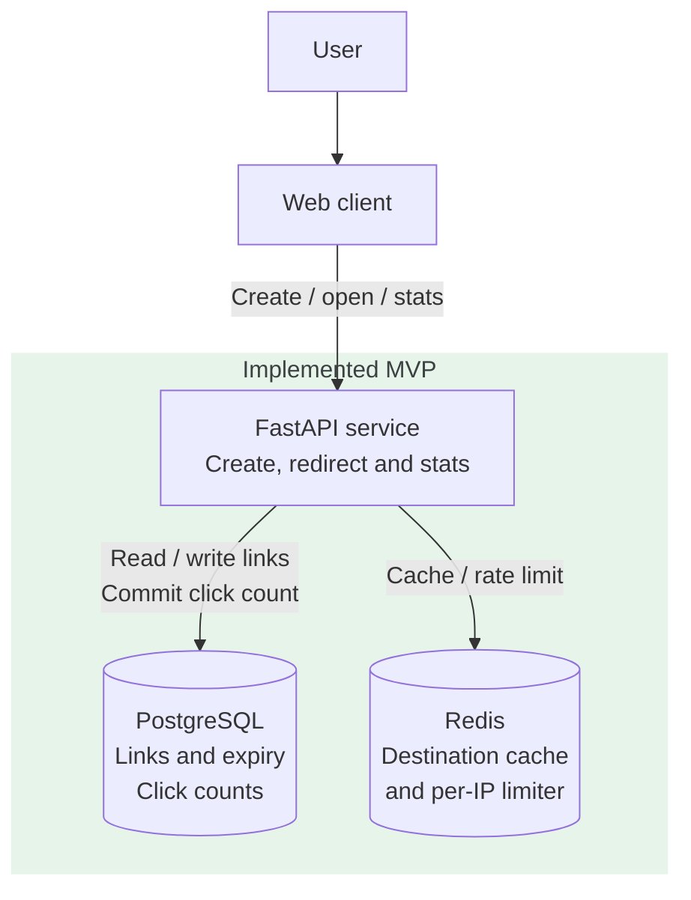

Design for creating short links, redirecting visitors and tracking clicks.

<!--more-->

## Problem

Users need to share URLs in messages, emails and posts. Long URLs are difficult to read, can look suspicious and take up space where character limits apply. Businesses and advertisers also need engagement data to compare campaigns and understand which links attract visitors.

A user provides a long URL and receives a short link such as `https://bit.ly/abc123X`. When another user opens it, the service resolves `abc123X` to the destination URL and returns an HTTP redirect.

The service supports link creation, redirects and click reporting. Redirects must remain fast when a link becomes popular, while honoring expiration and safety checks. Click processing runs separately so reporting does not delay navigation.

## Requirements

### Functional requirements

- **Create a short link.** A user submits a long URL and receives a short link ready to share, such as `https://bit.ly/abc123X`. Each short link points to one saved destination.
- **Open a short link.** A visitor can follow a public link without signing in. The service redirects them to the saved destination if the link is allowed and has not expired.
- **View click analytics.** A link owner selects a link and a time range to see click counts, referrers and geographic breakdowns. For example, they can compare which sites sent visitors to a campaign.
- **Choose a custom alias.** A user can request a readable code such as `spring-sale` instead of a generated one. If it is already taken, creation fails without changing the existing link.
- **Set an expiration time.** A user can add an end time when creating a link for a temporary promotion. Once that time passes, the link stops redirecting visitors.
- **Handle unsafe destinations.** For a suspicious destination, the service shows a warning before forwarding the visitor; for a blocked destination, it shows a block page instead. Safety checks also cover URLs that become unsafe after the link was created.

### Non-functional requirements

These are targets for the proposed design, not measured MVP results.

- **Scalability:** support 40B active links, 60K redirects/s and 580 creates/s at peak. Scale link creation, redirects and click processing independently; partition link storage as it grows.
- **Latency:** return the shortener's redirect response in less than 10ms at P50 and 50ms at P99, excluding loading the destination page. P99 means 99% of measured responses fall below that time.
- **High availability:** target 99.99% for public-link resolution. Run stateless services across availability zones with replicated link storage. An allocator or analytics outage must not stop existing links from redirecting. Correct expired or blocked responses are not outages.
- **Link consistency:** reserve aliases and ID ranges atomically. Persist a link before returning it, and let its first redirect read the committed record even if a replica or negative cache is behind. Never return two destinations for the same link key.
- **Analytics freshness:** click reporting is eventually consistent. Target P98 visibility lag below 90s from durable queue acknowledgment to queryable totals: 98% of accepted events should be reflected within that window. Events lost before acknowledgment are measured separately.
- **Cache freshness:** invalidate destination and safety changes in service and edge caches; limit cache lifetime by link expiration. Previously cached browser redirects cannot be recalled.

Creating links and reading analytics require an authenticated organization account. Opening a public short link does not.

### Out of scope

- Authentication implementation and billing.
- Link-in-bio pages, QR codes and mobile deep links.

## Back-of-the-envelope calculations

- 30B redirects and 300M new links per month give a 100:1 read/write ratio. Using 2.6M seconds per month and a 5× burst multiplier gives about 58K redirects/s and 580 creates/s at peak. Caching matters much more for opening links than for creating them.
- [Base62](https://en.wikipedia.org/wiki/Base62) writes a number using 62 symbols: `0–9`, `a–z` and `A–Z`. Unlike hashing, it is a reversible way to represent an ID more compactly. With the MVP's alphabet, decimal `62` becomes `10`, then `0000010` when padded to seven characters. Uppercase and lowercase characters are distinct.
- Seven base62 characters provide `62^7`, about 3.5T codes. Forty billion links use about 1.1% of that space. Random allocation would produce roughly 200M collision retries over those assignments; allocating unique numeric IDs avoids collisions between generated codes. Crash gaps and retired keys consume the namespace too; active links alone do not determine remaining capacity.
- At 200 bytes per click event, the service collects about 6TB/month before aggregation. Reducing that by 10–100× would leave roughly 600–60GB/month, before storage overhead. The reduction depends on how many distinct link, country and referrer combinations remain.

For cache planning, assume cumulative hit rates of 15–30% at the browser, 50–65% through a content delivery network (CDN), and 92–97% through the service's local cache. Estimated lookup times are no server lookup for a browser hit, 5–20ms at the CDN, about 0.1ms locally and 5–10ms at the database. A browser hit still needs to load the destination.

One illustrative mix is 50% CDN hits, 45% local-cache hits and 5% database reads. At peak, that leaves about 2,900 reads/s for the database. Without caches, ten service instances would each handle about 5,800 reads/s. The cache policy and traffic distribution determine whether this database load is realistic.

## Core entities

These logical records use UTC timestamps; `?` marks an optional field. A link key is `(domain, short_code)`, so aliases may repeat on different domains. The MVP is single-domain.

```text
Link {
  domain:        string
  short_code:    string       # Unique with domain; generated: 7 base62 chars
  long_url:      string       # Saved destination
  org_id:        uuid         # Owner → Organization
  created_at:    timestamp
  expires_at:    timestamp?   # No value means no scheduled expiry
  safety_status: safe | warn | blocked
}

Organization {
  org_id: uuid                # Primary key
  name:   string
}
```

`Organization` supplies ownership context; authentication and membership implementation are out of scope. The current safety model has no pending-scan state.

```text
ClickEvent {
  event_id:        uuid       # Assigned once; unchanged on retry
  domain:          string
  link_short_code: string     # With domain → Link
  timestamp:       timestamp  # Visit time, not processing time
  user_agent:      string
  ip:              string    # Restricted access and retention
  referrer:        string?
}

ClickRollup {
  domain:          string
  link_short_code: string
  bucket:          timestamp  # UTC hour
  country:         string     # Derived from the event
  referrer_domain: string     # Derived from referrer
  click_count:     integer
  # Key: (domain, link_short_code, bucket, country, referrer_domain)
}
```

```text
IDSequence {
  namespace: string           # Primary key; one global generated-ID namespace
  next_id:   integer          # First unreserved numeric ID
  # Atomically reserve ranges; stop before 62^7.
}
```

### API

Proposed HTTP contracts; these are separate from the MVP's `/api/urls` endpoints.

```text
POST /v4/shorten                      # Authenticated organization
  body:   long_url: string, domain?: string, alias?: string,
          expires_at?: UTC timestamp
  result: domain, short_code, link
  errors: invalid input; 409 alias taken; 429 creation limit

GET /{short_code}                     # Public; domain comes from the hostname
  result: 301, Location: long_url     # Only if allowed and unexpired
  errors: 404 missing; 410 expired; 403 blocked
  warn:   show a warning before navigation

GET /v4/bitlinks/{short_code}/clicks   # Organization must own the link
  query:  domain, units: hour | day, from, to: UTC timestamps
  result: time buckets, click counts, country/referrer breakdowns,
          latest processed time; distinguish zero from unavailable

POST /v4/expand                      # Authenticated organization
  body:   domain: string, short_code: string
  result: long_url                    # No redirect and no recorded click

GET /v4/groups/{group_guid}/bitlinks  # Authorized group
  query:  size: integer, page: integer
  result: paginated links for that group
```

The redirect contract currently uses HTTP 301 and `Cache-Control: private, max-age=90`. That choice needs review because links can expire or be blocked after a browser caches them.

## High-level design

A user creates a link, shares it and later checks how many visits it received. Visitors open the link without signing in. Link creation and reporting use an authenticated API; public redirects have their own entry point so account and reporting work does not slow them down.

The creation service saves the destination in the link database. The redirect service reads that record, using a local cache to avoid repeated database lookups. A CDN can cache redirects where the expiration and safety policy permits it. [Bitly's migration from MySQL to Bigtable](https://cloud.google.com/blog/products/databases/bitly-migrates-link-data-from-mysql-to-bigtable-for-scalability) illustrates how the underlying link storage can grow.

Two background paths support those services: the safety worker updates destination verdicts, and the click pipeline builds the totals used by analytics. The ID-range allocator supplies non-overlapping numeric IDs for generated codes. The scenarios below follow each user action through these components.


```mermaid
flowchart TB
    accTitle: Bitly high-level design
    accDescr: Public redirects and authenticated creation have separate entry points, with link storage, ID allocation and background safety and click processing.
    User["User"] --> Web["Web client"]
    subgraph Entry["Entry points"]
        CDN["CDN edge<br>Public links"]
        API["API gateway<br>Account authentication<br>and rate limits"]
    end
    subgraph Services["Application services"]
        Shorten["Link creation service"]
        Redirect["Redirect service<br>Local record cache"]
        Safety["Safety worker"]
        Clicks["Click pipeline<br>Queue and aggregation"]
    end
    subgraph Data["Storage"]
        Links[("Link database")]
        Allocator[("ID-range allocator")]
        Rollups[("Analytics store")]
    end
    Web -->|Open link| CDN
    Web -->|Create link or read analytics| API
    CDN -->|Cache miss| Redirect
    API -->|Create| Shorten
    API -->|Read totals| Rollups
    Shorten -->|Get ID range| Allocator
    Shorten -->|Save mapping| Links
    Shorten -.->|Request scan| Safety
    Redirect -->|Record-cache miss| Links
    Redirect -.->|Record click| Clicks
    Clicks -->|Write totals| Rollups
    Safety -->|Update verdict| Links
    style Entry fill:#fce8e6,stroke:#fce8e6,color:#3c4043
    style Services fill:#e6f4ea,stroke:#e6f4ea,color:#3c4043
    style Data fill:#e8f0fe,stroke:#e8f0fe,color:#3c4043
```

Public redirects bypass account authentication. Link creation and analytics go through the gateway. Safety verdict updates also invalidate origin and edge caches; those feedback paths are omitted from the diagram to keep the main flow readable. The click pipeline shown here receives origin events; recording CDN hits remains an open analytics decision.

### Storage

The diagram has three logical storage components. Their responsibilities are:

- **Link database:** stores Link and Organization records. Use `(domain, short_code)` for lookups, cache keys and analytics references; index `(org_id, created_at)` for owner listings. Create only if a key is absent from both live links and retired-code reservations, and commit before returning it. Keep the reservation after removing an expired destination.
- **ID-range allocator:** persists IDSequence. Reserve a range with one atomic, durable advance of `next_id`; commit before handing it out and never reassign it after a crash.
- **Analytics store:** retains collected ClickEvent data for the supported replay window and serves ClickRollup totals. Deduplicate immutable event IDs and update totals in one atomic boundary, or use equivalent idempotent aggregation. Keep processed-event records for the replay window and restrict raw IP access and retention.

The durable queue belongs to the click pipeline. Record caches are disposable copies, not another source of truth.

## Functional scenarios

### Creating a link

The user submits `long_url` and optional domain and expiration through `POST /v4/shorten`. The gateway verifies the organization, its right to use the domain and the creation limit; invalid input is rejected, while an exceeded limit returns 429.

The creation service takes an ID from its reserved range, encodes it and conditionally inserts the Link. If a custom alias already occupies that generated key, it tries another ID. Only a committed mapping is returned, for example `{"domain":"bit.ly","short_code":"abc123X","link":"https://bit.ly/abc123X"}`. A failed write does not produce a usable link.

After the commit, the service requests a background safety scan. A redirect cache miss uses an authoritative, strongly consistent read rather than a lagging replica, and any cached “not found” entry for the new key is invalidated.

The successful creation path is:


```mermaid
sequenceDiagram
    accTitle: Creating a short link
    accDescr: The creation service commits a unique link mapping before returning it, then requests a background safety scan.
    participant W as Web client
    participant S as Link creation service
    participant D as Link database
    participant B as Safety worker
    W->>S: POST /v4/shorten via gateway
    Note over S: Validate URL, alias and expiry
    Note over S: Use alias or ID from a reserved range
    S->>D: Insert only if the key is free
    D-->>S: Mapping committed
    S-->>W: Short link
    S-->>B: Request background scan
```

### Choosing a custom alias

The user supplies an alias such as `spring-sale` in the same creation request. The service validates its characters and reserved-name policy, then skips ID generation and attempts an atomic insert under `(domain, alias)`.

If two users request that key together, one succeeds and the other receives 409 and can choose another alias. An availability preview is only advisory; it never authorizes overwriting an existing link.

### Opening a link

The web client requests `https://bit.ly/abc123X`. The hostname and path identify the link. A CDN may return a redirect only if its caching policy permits it; otherwise the redirect service checks its local record cache, then committed link storage. A missing key returns 404.

Before sending a destination, the service checks the record's expiration and safety verdict—even on an internal-cache hit. Expired links return 410, blocked links show a 403 block page, and suspicious links show a warning before navigation. An allowed link returns the redirect with `Location: <long_url>`.

The proposed asynchronous path collects a click without waiting for aggregation. A later failure before durable queue acknowledgment can lose that event; redirect success is not proof that it was counted.

For an allowed link handled by the origin, the flow is:


```mermaid
sequenceDiagram
    accTitle: Opening a short link
    accDescr: The redirect service looks up the link, checks expiry and safety, returns the redirect, and collects a click asynchronously.
    participant W as Web client
    participant R as Redirect service
    participant D as Link database
    participant P as Click pipeline
    W->>R: Open domain + short code
    Note over R: Check local record cache
    opt Record-cache miss
        R->>D: Read committed link
        D-->>R: Destination, expiry and verdict
    end
    Note over R: Check expiry and safety
    R-->>W: 301 with Location
    R-->>P: Collect click in background
    Note over R,P: Event can be lost before queue acknowledgment
```

A browser or CDN cache hit can bypass this origin sequence.

### Setting an expiration

A promotion owner includes `expires_at` when creating the link. This proposal accepts a UTC time five minutes to one year ahead; that validation window is a design choice, not an implemented MVP restriction.

Every service-handled redirect compares the current time with the saved expiration. At or after that instant, it returns 410 without forwarding the visitor. Any permitted HTTP-cache lifetime must end no later than the expiration.

An hourly job archives expired records and applies the configured retention policy. Cleanup does not enforce expiry; retired keys remain reserved so an old short link cannot later point somewhere else.

### Reading analytics

The owner requests a link, `from`, `to` and hourly or daily units. The gateway checks organization membership and link ownership before querying ClickRollup rows; another organization's link is not exposed.

The query sums hourly buckets for the chosen interval and groups them by country or referrer when requested. Daily reports aggregate those UTC hours. The response distinguishes zero collected clicks from unavailable analytics and identifies its latest processed time.

Recent visits may not yet appear: P98 visibility lag targets 90s after durable collection. These totals cover collected origin events, not visits served entirely by browser or CDN caches. Expanding a link returns its saved destination without visiting or counting it; owner listings paginate the organization's links.

### Handling unsafe destinations

Creation triggers the first scan; background rescans also cover destinations that become unsafe later. The safety worker writes `safe`, `warn` or `blocked` to Link and invalidates controllable record and edge caches.

A `warn` verdict shows the destination and a warning before navigation. If policy allows the visitor to continue, that request rechecks expiration and the latest verdict before redirecting. A `blocked` verdict never forwards the visitor.

The current model starts new links as `safe`, so they can be visited before scanning completes. A pending state and behavior during scanner failures still require a policy; background scanning alone does not make unchecked links safe. Previously cached browser redirects remain outside the service's control.

## Deep dives

### How do we keep codes unique?

Two creation requests can arrive at different instances at the same time. They must receive different codes, even after a crash or failover. Custom aliases add another collision case: a user can claim a code that the generator would later produce.

- **A central sequence:** increment one durable counter and encode the result in base62. This is the simplest approach, and the MVP uses a database-generated ID. Every create depends on that store.
- **Random codes or a truncated URL hash:** generate candidates independently, then insert only if the code is unused. This avoids a counter service but requires collision retries; hashing also needs separate handling when the same destination needs multiple campaign links.
- **Allocated ID ranges:** reserve a different range for each instance and generate codes locally. Most creates avoid an allocation call, but reservations must survive crashes and never overlap.

**Recommended:** use allocated ranges for the distributed design, so instances can keep generating codes through a brief allocator outage. A central sequence remains a reasonable starting point at the assumed 580 creates/s; ranges are an availability choice, not a demonstrated throughput requirement.

Each instance takes the next ID from its range and encodes it in base62, padded to seven characters:


```mermaid
flowchart TB
    accTitle: Unique short-code allocation
    accDescr: A durable allocator gives instances disjoint ID ranges. Generated codes and custom aliases both require an atomic insert.
    Allocator["Atomic, durable<br>ID allocator"]
    Allocator -->|"1–10,000"| A["Instance A<br>Next local ID"]
    Allocator -->|"10,001–20,000"| B["Instance B<br>Next local ID"]
    A -->|"Encode in base62"| Insert["Atomic insert<br>if code is absent"]
    B -->|"Encode in base62"| Insert
    Alias["Custom alias"] --> Insert
    classDef action fill:#e8f0fe,stroke:#9aa0a6,color:#202124
    class A,B action
```

Use the global IDSequence record to reserve disjoint ranges, and commit each reservation before returning it. Separate counters keyed by instance would allocate overlapping IDs. Reserved ranges are never reassigned after a crash; unused IDs become gaps. [PostgreSQL's sequence documentation](https://www.postgresql.org/docs/current/functions-sequence.html) explains atomic allocation, gaps and committing IDs before using them outside the database; [Designing Data-Intensive Applications](https://dataintensive.net/) covers the broader coordination.

With 10,000-ID ranges, about 99.99% of creates avoid an allocation call. At the assumed peak of 580 creates/s, the fleet needs roughly 0.058 range allocations/s. An instance creating ten links/s has about 17 minutes before a full range runs out.

Prefetch the next range when 20% remains. A late refill adds an estimated 5ms to creation. If the allocator stays unavailable after the range is exhausted, return 503 and retry allocation with exponential backoff. A crash leaves unused IDs behind; gaps are acceptable, duplicate assignments are not. Larger ranges allow more creates during an allocator outage but waste more IDs after a crash. IDs must also stop before exceeding the seven-character namespace.

Generated codes and custom aliases share the namespace, so every insert still needs an atomic uniqueness check. If an alias has claimed a generated code, skip that ID and try another. A store such as Bigtable needs appropriate [conditional writes and routing](https://docs.cloud.google.com/bigtable/docs/writes#conditional-writes), not an ordinary overwrite.

For comparison, a central counter with an assumed 10K increments/s capacity could handle this create load, but a separate allocator call on every create would add an estimated 1–3ms round trip. Those are sizing assumptions, not measured MVP performance.

### What happens when a link gets popular?

A link posted to a large audience can receive thousands of requests for the same record. An index makes each database lookup efficient, but it does not remove the repeated work. A burst of simultaneous cache misses can also overwhelm storage before the first response fills the cache.

- **Indexed database reads:** the simplest path, with one authoritative record. Every redirect still reaches storage, including repeated requests for a hot link.
- **A shared Redis cache:** reuse records across instances and reduce database reads. It adds a network hop and makes redirects depend on the shared cache's capacity and availability.
- **A local LRU cache with shared in-flight lookups:** serve hot records from each instance's memory and combine simultaneous misses for the same code. This avoids a network call on hits, but each instance has its own cache to warm and invalidate.

**Recommended:** use local record caching for the scaled redirect service. LRU evicts the least recently used entries when memory fills up. On a miss, let one request fetch the record while other requests on that instance wait for the same result; this is called singleflight:

```text
resolve(domain, short_code):
    key = (domain, short_code)
    if local_cache contains key:
        return cached_record
    return singleflight(key, lookup_in_database)
```

Other instances still perform their own first lookup. A hot-link watcher can prewarm their caches once a link exceeds the assumed 10K requests/s per-instance threshold; budget about 100ms for propagation. Bound the cache to 25% of instance heap and give shared fetches a five-second deadline so failed work cannot leave requests waiting indefinitely.

The tradeoff is cache freshness: changes must invalidate every affected instance. This approach also does not help a flood of different uncached codes. Cold-start and cache-churn tests must establish how much traffic storage can absorb before the service sheds load. The MVP's Redis implementation, described below, is a smaller starting point.

### How long can a cached redirect remain valid?

A cached database record and a cached HTTP redirect behave differently. The service can recheck an internal record before forwarding a visitor. A browser or CDN holding the redirect response may skip the service entirely, missing an expiration, safety change or click event.

The three places to cache have different controls:

| Cache | What it stores | Control and limits |
| --- | --- | --- |
| Service | Link record | Invalidate changed records; check expiration before redirecting. |
| CDN | HTTP redirect | Purge where configured; cache only where policy permits. |
| Browser | HTTP redirect | No reliable remote purge; may bypass safety checks and click recording. |

**Recommended:** cache Link records inside the service, where expiration and safety checks still run. Treat browser and CDN redirect caching as separate optimizations that require an explicit staleness and click-count policy. Internal caching saves database reads; HTTP caching can save the whole origin request, but gives up control over that visit.

The current `private, max-age=90` header allows browser caching but excludes ordinary shared-CDN caching. [HTTP cache rules](https://www.rfc-editor.org/rfc/rfc9111.html#name-private) make that distinction explicit. An edge override would need its own freshness and invalidation policy; the CDN hit-rate estimate cannot be assumed under the current header.

HTTP 301 is also [cacheable without explicit freshness](https://www.rfc-editor.org/rfc/rfc9110.html#name-301-moved-permanently). Choosing 302 instead would not, by itself, prohibit caching. The policy must limit stale redirects, avoid caching warnings or blocks as successful redirects, and keep freshness within the link's remaining lifetime. A committed safety change must invalidate both origin and edge caches. Previously cached browser redirects cannot be recalled.

### How do we count clicks without slowing redirects?

Recording a click takes work beyond finding the destination. If the redirect waits for an analytics write, a slow analytics store becomes a slow link. If it returns first, a crash can lose the click before it is saved.

- **Update the counter synchronously:** simple and suitable for the MVP. The redirect waits for the database commit; analytics availability and write latency affect navigation.
- **Buffer events and publish asynchronously:** return the redirect first, then send events in batches to a durable queue. This keeps analytics off the response path, but buffered events can be lost before the queue acknowledges them.
- **Wait for durable recording before responding:** acknowledge the queue write before returning the redirect. This closes the pre-acknowledgment loss window for successful responses, at the cost of queue latency and availability on every visit.

**Recommended:** use asynchronous collection for campaign reporting when fast redirects matter more than a complete count. Do not use the same best-effort path for billing or other loss-intolerant records. The queue's acknowledgment confirms durable storage; returning the redirect does not.


```mermaid
flowchart TB
    accTitle: Asynchronous click recording
    accDescr: Clicks move from memory to a durable queue and hourly totals. A crash before queue acknowledgment may lose an event.
    Response["Redirect sent"] -.-> Buffer["Click event<br>in RAM buffer"]
    Buffer -->|"Publish"| Queue["Queue confirms<br>durable storage"]
    Queue --> Worker["Worker updates<br>hourly totals"]
    Buffer -.-> Loss["Crash before<br>acknowledgment:<br>event may be lost"]
    classDef caution fill:#fef7e0,stroke:#9aa0a6,color:#202124
    class Loss caution
```

Each event carries an immutable `event_id`, `domain`, `link_short_code`, `timestamp`, `user_agent`, `ip` and `referrer`. The worker derives country from an in-memory GeoIP lookup, extracts the referrer domain and adds the event to its UTC hourly bucket. For deduplicated raw events, the rollup query is:

```sql
SELECT domain, link_short_code,
       date_trunc('hour', timestamp AT TIME ZONE 'UTC') AS bucket,
       country, referrer_domain, COUNT(*) AS click_count
FROM click_events_raw
GROUP BY domain, link_short_code, bucket, country, referrer_domain
```

Flush at 1,000 events or 100ms, whichever comes first. Batching reduces publishing overhead, but a process crash can lose its buffer. A prolonged queue outage can lose more; this path does not guarantee a bounded loss window. Monitor dropped events and queue lag. Stress-test the assumption that overflow occurs only after more than one second of queue failure at peak traffic. The acceptable loss threshold remains a product decision, separate from the 90s reporting target.

A synchronous analytics write is estimated to add 2–5ms. A browser beacon is another option, but the assumed 10–30% loss from tracking blockers and the changed navigation flow make it unsuitable as a drop-in replacement.

Late events arriving within five minutes update the correct hourly bucket. Later arrivals go to a separate partition for daily reconciliation. Daily reports need explicit aggregation of the hourly totals and reconciliation of that partition; storage compaction does neither by itself.

Retries can deliver an event twice. Keep the same `event_id` across retries; timestamp/IP combinations can merge legitimate repeat visits and are not an event identity. The worker must record that ID and update its rollup atomically, or use an idempotent replacement from deduplicated raw events. A crash after updating a total but before acknowledging the queue must not increment it again. CDN hits bypass this queue, and browser-cache hits may bypass the service entirely. These totals measure collected origin events, not every visit to the destination.

### What if the destination becomes unsafe?

A destination that is harmless today can serve malware tomorrow. Checking only when a link is created will miss that change. Checking an external service on every redirect catches fresher information, but puts its latency and availability in the navigation path.

- **Scan only at creation:** cheap and simple, but a later change can go undetected indefinitely.
- **Check externally on every redirect:** use the freshest available verdict for each visit. The redirect now depends on the external check, and that check still cannot detect a threat its provider has not discovered.
- **Rescan in the background and cache verdicts:** keep external scanners off the redirect path, then invalidate cached records when a verdict changes. Visits between scans can use stale knowledge.

**Recommended:** use background rescanning with cached `safe`, `warn` and `blocked` verdicts, plus invalidation. It fits the redirect latency goal, but scan freshness and scanner-failure behavior are part of the safety policy—not a guarantee that every destination is safe.

The worker follows up to five redirect hops, collects the title and content type, and combines those signals with threat intelligence. It writes the verdict back to the Link record. The starting scan budget is 1–5s; if crawling times out, consult the threat API and schedule another scan. Rescan links visited in the previous 30 days daily, instead of crawling all stored links.

The current model marks a new link safe before its first scan completes, so an unchecked destination can be visited. A pending state and the response to unavailable scanners still need an explicit policy; asynchronous scanning does not settle those choices.

[Bitly's Web Risk integration](https://cloud.google.com/blog/topics/partners/bitly-ensuring-real-time-link-safety-with-web-risk-to-protect-people) describes five risk tiers and a feed covering more than a million unsafe URLs. It supports the use of threat intelligence, not our chosen timeouts or blocking thresholds. [Bitly's current safety description](https://bitly.com/blog/trust-safety-at-bitly/) checks its Abuse API on each click; our cached-verdict approach needs its own freshness guarantees.

A definitive blocklist can reject known unsafe destinations. A counting Bloom filter only identifies candidates for a definitive lookup: a hit means “possibly present,” not “definitely unsafe” or “alias already taken.” [Bitly's dablooms](https://word.bitly.com/post/28558800777/dablooms-an-open-source-scalable-counting) provides the counting-filter background. New threats remain unknown until the feed or scan discovers them.

Creation limits start at 100/minute per organization and five concurrent connections per IP, with 429 and `Retry-After` when exceeded. Those are design choices, not [Bitly's published API limits](https://dev.bitly.com/docs/getting-started/rate-limits/). Threat classification must also settle whether to block only the highest-confidence tier or high-and-above after a timeout.

## MVP

The existing [Bitly backend](https://github.com/iliazlobin/sd-bitly-backend-mvp) implements creation, redirects and basic click counts in one FastAPI service. PostgreSQL stores links and counters; Redis caches destinations and enforces per-IP creation limits. The original scope is recorded in [Bitly MVP scope](https://app.notion.com/p/38ed865005a88128b11dca33d9868286).

| Operation | MVP endpoint | Implemented behavior |
| --- | --- | --- |
| Create | `POST /api/urls` | Encode a database ID as a base62 code, padded to seven characters. Accept an optional alphanumeric alias and expiration time; return 409 if the code is taken. |
| Redirect | `GET /{short_code}` | Return 301 to the destination, 404 for a missing code or 410 for an expired link. |
| Stats | `GET /api/urls/{short_code}/stats` | Return total clicks and creation/expiration timestamps. |


```mermaid
flowchart TB
    accTitle: Implemented Bitly MVP
    accDescr: One FastAPI service uses PostgreSQL for links, expiry and click counts, and Redis for the destination cache and creation limits.
    User["User"] --> Web["Web client"]
    subgraph MVP["Implemented MVP"]
        API["FastAPI service<br>Create, redirect and stats"]
        DB[("PostgreSQL<br>Links and expiry<br>Click counts")]
        Cache[("Redis<br>Destination cache<br>and per-IP limiter")]
        API -->|"Read / write links<br>Commit click count"| DB
        API -->|"Cache / rate limit"| Cache
    end
    Web -->|"Create / open / stats"| API
    style MVP fill:#e6f4ea,stroke:#e6f4ea,color:#3c4043
```

Unlike the larger design, the [MVP request path](https://github.com/iliazlobin/sd-bitly-backend-mvp/blob/3cc1eed8ce48a9b175dd93c2087ffcc96a19bf79/src/bitly/services/url_service.py) uses database-generated IDs rather than allocated ranges. Cache hits still read PostgreSQL to check expiry, and each redirect waits for the click-counter update to commit. Counts cover requests handled by the service, not repeat visits served from a browser's cached redirect.

Authentication, safety scanning, asynchronous analytics, CDN caching and multi-region deployment are not implemented. The [repository README](https://github.com/iliazlobin/sd-bitly-backend-mvp#quickstart) contains Docker Compose setup and test commands.
