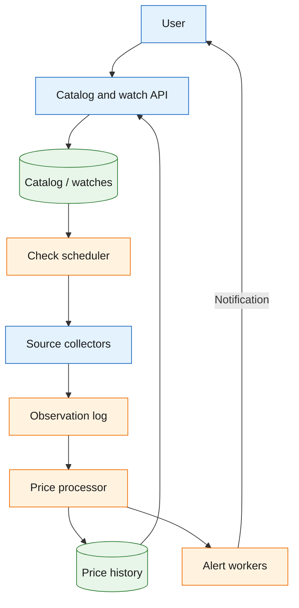
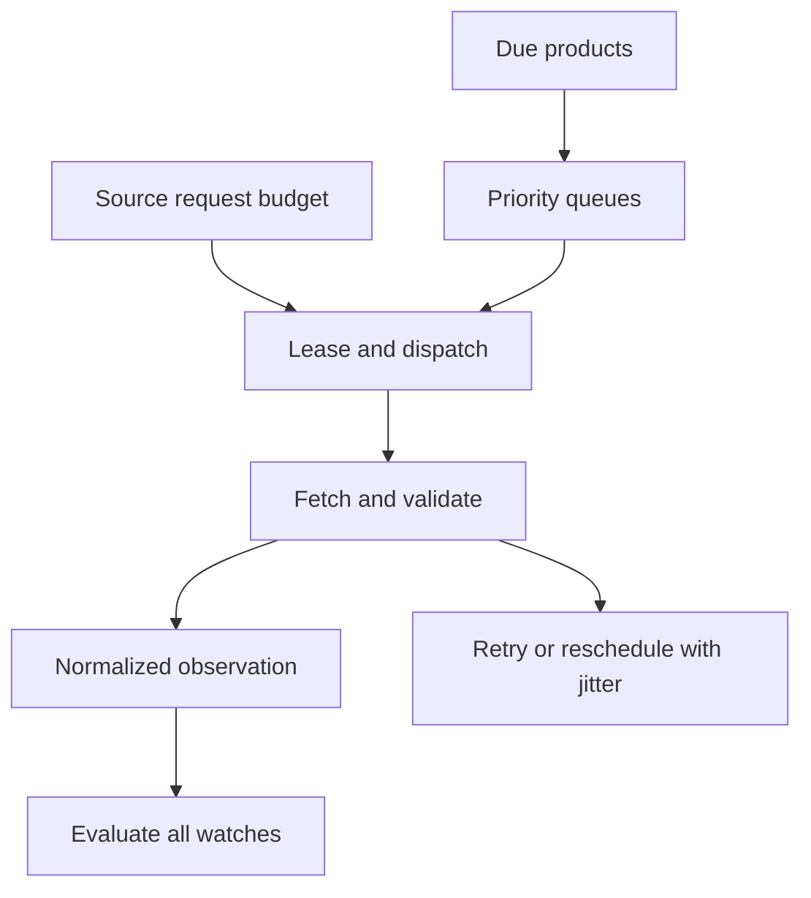

Design of a price tracker that keeps product price history and notifies users when a chosen offer reaches their target price.

<!--more-->

## Problem

A user wants to know whether a product is selling at a good price and receive an alert when it falls below a chosen amount. They paste a product URL, review its price history and create a price watch.

The service checks supported retailers on a schedule. Each observation identifies the offer, price, currency and availability. The main engineering challenge is allocating limited collection capacity across millions of products while keeping charts and alerts consistent with the observations we actually collected.

## Requirements

### Functional requirements

- **Find a product:** search the catalog or submit a URL from a supported retailer.
- **View price history:** show current and historical prices for a selected marketplace, seller and condition.
- **Create a price watch:** choose an offer, target price and notification channel; update or remove it later.
- **Receive an alert:** notify the user when an available offer crosses their target price.
- **Maintain the catalog:** collect price observations and keep the last successful check visible.

Account authentication uses an existing identity provider. Purchasing products and supporting arbitrary websites are outside this design.

### Non-functional requirements

- **Scale:** track 100M products with approximately 107M scheduled checks/day in the example workload.
- **Latency:** return a cached product chart within 500ms at P95.
- **Freshness:** check high-priority products hourly; support shorter intervals only where source quotas allow.
- **Alert delivery:** target P95 below 5 minutes from a valid observation to notification-provider acceptance for priority watches, and below 1 hour for standard delivery.
- **Correctness:** compare prices for the same offer and currency; show collection gaps and the last successful check.
- **Availability:** target 99.9% for watch management and chart queries; retain accepted watches during collection outages.
- **Source limits:** honor retailer/API quotas, crawl permissions and retry instructions. Collection capacity bounds achievable freshness.

## Back-of-the-envelope calculations

- **Checks:** 1M hourly products × 24 + 80M daily + 19M weekly / 7 ≈ 107M checks/day, or 1,235/s on average.
- **History writes:** assuming prices change on 13% of checks, approximately 14M changes/day, or 161/s. Successful unchanged checks still update freshness.
- **Storage:** at 50 bytes/observation, keeping every check for two years is approximately 3.9TB of payload; retaining only changes is approximately 0.51TB. Indexes, replicas and audit evidence add storage.
- **Freshness:** hourly polling can discover a price change almost an hour later. The alert-processing target starts after collection; a five-minute end-to-end guarantee requires a matching source update interval.

## Core entities

- **Product:** a catalog item identified by retailer, marketplace and retailer product identifier.
- **Offer:** the seller, condition and currency whose price is being tracked.
- **Observation:** a successful price check or collection failure with a source timestamp.
- **Price watch:** a user's target price and alert state.
- **Collection task:** a scheduled check with a lease and retry policy.

```protobuf
message Product {
  string product_id;
  string retailer;
  string marketplace;
  string retailer_product_id; // For example, an Amazon ASIN.
  string title;
}

message Offer {
  string offer_id;
  string product_id;
  string seller_id;
  string condition;
  string currency;
  int64 price_minor;
  bool available;
  Timestamp last_checked_at;
}

message PriceObservation {
  string observation_id; // Stable across a retry of the same collected result.
  string offer_id;
  Timestamp observed_at;
  int64 price_minor;
  string currency;
  bool available;
  string result; // Valid, unavailable or collection failure.
}

message PriceWatch {
  string watch_id;
  string user_id;
  string offer_id;
  int64 target_price_minor;
  string state; // Armed or waiting for price to rise before another crossing.
  int64 generation; // Changes when the watch is edited.
}

message CollectionTask {
  string product_id;
  Timestamp next_check_at;
  string lease_token;
  Timestamp lease_expires_at;
}
```

An offer's identity includes its marketplace and seller. Matching the same product across retailers helps discovery, while each offer retains its own price history. [Schema.org's Offer model](https://schema.org/Offer) provides useful terminology for these distinctions.

## API

```yaml
POST /products/resolve:
  body: {url: "https://www.amazon.com/dp/example"}
  response: {product_id: "...", offers: [...]}
  errors: [400 unsupported_or_invalid_url]

GET /products/{product_id}/history:
  query: {offer_id: "...", from: "...", to: "...", resolution: day}
  response: {points: [...], last_checked_at: "...", collection_gaps: [...]}

POST /watches:
  body: {offer_id: "...", target_price_minor: 2500, channel: email}
  response: {watch_id: "...", state: armed}

PATCH /watches/{watch_id}:
  body: {target_price_minor: 2200}
  response: {generation: 2}

DELETE /watches/{watch_id}:
  response: 204

GET /watches:
  query: {cursor: "...", limit: 50}
  response: {watches: [...], next_cursor: "..."}
```

Watch endpoints authenticate the user and enforce ownership. Product URLs are resolved only for supported retailers; collection workers also validate redirects and reject private-network destinations.

## High-level design

The API manages products and watches. A scheduler selects due products, collectors obtain authorized source data, and a processing pipeline updates history and evaluates watches. Charts read prepared time-series data; notification workers deliver durable alert jobs.



## Storage

- **PostgreSQL:** stores catalog identities, watches, collection leases and the notification outbox. Unique keys prevent duplicate products and duplicate alerts for the same watch generation and observation.
- **TimescaleDB:** partitions price changes by observation time and indexes them by offer and time. Prepared daily summaries support long chart ranges; recent raw points fill the unmaterialized tail. [Continuous aggregates](https://www.tigerdata.com/blog/achieving-the-best-of-both-worlds-ensuring-up-to-date-results-with-real-time-aggregation) support this combination.
- **Kafka:** retains collected observations for replay. Partitioning by product preserves processing order for related offers.
- **Redis:** caches charts and rate-limit state. Durable watch and history records stay in PostgreSQL/TimescaleDB.
- **Search index:** add Elasticsearch when catalog search needs richer text matching; direct retailer-ID lookup uses the catalog database.
- **Object storage:** retains bounded collection evidence for parser debugging, with access and retention controls.

PostgreSQL transactions suit watch updates and alert creation. TimescaleDB adds time-series partitioning and aggregation while retaining SQL. Cassandra could distribute high-volume observations, but would require separate query-specific tables and more application coordination for watch transactions.

## From request to response

### Finding a product and creating a watch

1. The user submits a supported product URL. The resolver extracts the retailer product identifier and marketplace, then looks up the canonical catalog key.
2. If the product is new, the service creates its catalog entry and schedules an initial check. It returns a collecting state until a valid offer is available.
3. The user selects an offer and target price. The API saves the watch and its generation in a transaction, then adjusts scheduling priority.
4. Editing a watch increments its generation. Pending alerts from older generations are checked before delivery.

Priority watches can increase collection demand sharply; scheduling must account for retailer-wide limits rather than assigning each watch its own collector.

### Collecting and recording a price

1. The scheduler leases a due product and dispatches one check shared by all its watchers.
2. The collector obtains source data through an approved API or permitted crawl, respecting quotas and Retry-After instructions.
3. The parser validates product identity, currency, seller, condition and price. Collection failures become gap/freshness records rather than zero-price observations.
4. The processor deduplicates the observation, updates the latest valid offer and appends a history change when its canonical values differ.
5. The next check is scheduled after success or bounded backoff. A lost worker lease can be retried; its token prevents a late worker from overwriting a newer result.

### Displaying a chart

The API reads cached chart points or queries the selected offer and date range. It uses exact change points for recent history and prepared summaries for long ranges. The response includes the latest successful check and collection gaps. The chart uses step changes between observed prices; missing data is shown explicitly.

### Sending a price alert

A valid available offer below the target triggers an armed watch. A transaction advances its alert state and inserts a uniquely keyed notification job. The worker rechecks the watch generation, sends the message with a provider idempotency key where supported, and records delivery evidence. The alert links to the observed offer and includes its check time.

## Deep dives

### How do we keep useful prices fresh within source limits?

**Problem.** Checking every product frequently is expensive, and a retailer's permitted request rate may be lower than demand.

- **Fixed-frequency polling:** simple to operate, but spends equal capacity on unused products and heavily watched offers.
- **One collector per watch:** gives direct ownership of freshness, but many watches repeat the same source request.
- **Shared priority scheduling:** check each product once and prioritize it by active watches, requested freshness, recent changes and source capacity.

**Recommendation.** Use shared scheduling with a per-source budget. Separate urgent and routine queues, reserve capacity for each, and spread due times with jitter. Prefer authorized APIs or partner feeds where available. A product's advertised freshness is limited by its source quota and observed completion rate; [CamelCamelCamel's price-check documentation](https://camelcamelcamel.com/support/price_checks) also treats checking frequency as an explicit part of the product.

A scheduler lease prevents duplicate dispatch, while the observation ID handles a retry that still completes twice. On 429, honor Retry-After; repeated access failures pause the affected source for review. Track overdue products, valid-check rate, source errors and freshness percentiles. Extra IPs are not a substitute for permitted collection capacity.

**Quota-aware scheduling.** Maintain one due record per product/source, not per watch. Its priority combines overdue time and demand; its collection lease has an owner, expiry and attempt generation. The scheduler takes work only when that source's token budget permits it. Ten thousand watches for one product then share one fetch and one normalized observation.

Suppose a source permits 100 checks/minute but 1,000 watched products request one-minute freshness. The scheduler can sustain roughly ten-minute coverage before retries and overhead. Advertise that actual coverage instead of promising a one-minute refresh. Reserve some capacity for routine checks so a few popular products cannot starve the catalog.



A lease reduces duplicate work; the observation ID and generation make a delayed completion safe after reassignment. Source-wide failures trip a circuit breaker and retain due work for recovery.

### How do we retain history without storing unchanged prices repeatedly?

**Problem.** Most checks may return the same offer, but users still need to know that it was checked recently.

- **Store every observation:** provides a detailed audit trail, with the largest storage cost.
- **Store only changed prices:** compact, but loses evidence of successful unchanged checks and collection gaps.
- **Separate history from collection status:** append price changes and maintain freshness/gap records independently.

**Recommendation.** Keep change-point history plus collection status. Compare normalized price, currency, availability, seller and condition; an offer identity change creates a separate series. Update last_checked_at on a valid unchanged check. Record parser or source failures separately.

Hourly or daily chart summaries preserve min/max and the last value, with exact recent points available for detail. Choose compression and retention from measured query and recovery needs. Restoring a parser version may require replaying retained observations, so that window must fit the evidence-retention policy.

**History and freshness records.** For an offer at \$100, valid checks at 09:00, 09:10 and 09:20 need one price change point plus a freshness record showing the last successful check. A \$90 observation at 09:30 appends a second point. A failed check at 09:40 records a collection gap rather than extending evidence of the \$90 price.

Normalize currency and minor units before comparison, and distinguish a seller change from a price change on the same offer. Persist the change point and latest collection status together, or expose their versions so readers can detect a lagging projection.

A daily chart summary retains first/last values, min/max, successful coverage and gaps. When a user zooms into the last hour, fetch exact change points instead. A late corrected observation identifies the affected time bucket; refresh that summary and bump its generation. Simply appending a correction to the end of the chart would put the price change at the wrong time.

### How do we avoid repeated or missed alerts?

**Problem.** Observation processing and notification delivery can both retry. A price can also remain below the target for days or cross it repeatedly.

- **Send on every below-target check:** responsive, but repeatedly notifies the same user.
- **Remember the lowest notified price:** useful for a new-low product, but can suppress later threshold crossings.
- **Threshold-crossing state machine:** notify once per crossing and rearm after the price rises above the target by a defined margin.

**Recommendation.** Use threshold-crossing state with a cooldown and documented rearm margin. Save the state transition and notification outbox entry together. The durable key is (watch_id, generation, observation_id); a short-lived Redis dedupe key alone cannot cover queue replay.

```text
Above target → armed
Valid available price crosses below target → alert queued
Still below target → remain disarmed
Price rises above rearm margin → armed again
```

Delivery retries reuse the same notification identity. If a provider times out after accepting a message, query its status where possible. Without provider idempotency or status lookup, duplicate delivery remains possible and is recorded as an operational limitation. Standard watches may use a durable digest rather than discard excess alerts.

**Crossing transaction.** A watch for \$95 starts armed while the observed price is \$100. Observation O12 reports \$90. Lock or conditionally update the watch generation, change it to disarmed and insert notification N12 in the same PostgreSQL transaction. Replaying O12 finds the already-recorded transition and produces no second notification.

If the next check reports \$89, the watch stays disarmed. A configured rearm margin might require a price above \$97 before a later drop can trigger another alert. This hysteresis prevents small fluctuations around \$95 from producing repeated notifications. Editing the target creates a new watch generation with an explicit policy for evaluating the current price.

The outbox worker sends N12 with a stable provider key and records the provider result. If it crashes after sending, the next worker queries status or retries the same key. Unsubscribe is checked immediately before dispatch; queued identities remain as cancelled records for replay safety rather than being forgotten.

### How do charts remain useful when collection is incomplete?

**Problem.** An attractive chart can mislead users if it treats a missing check as a known price.

- **Interpolate between observations:** smooth, but suggests prices we did not collect.
- **Display only isolated points:** accurate, but harder to follow over long periods.
- **Step chart with freshness and gaps:** shows observed changes and clearly marks uncertain periods.

**Recommendation.** Use a step chart for valid observed offers and explicit gaps when collection fails. Keep seller, condition, marketplace and currency fixed for each series. A stale current price includes its observation time; unavailable offers are not shown as zero. Monitor parser disagreement and implausible price changes, quarantine suspicious observations, and retain bounded evidence for investigation.

**Rendering observed coverage.** The chart API returns points with observation timestamps plus coverage intervals and gap markers. For the \$100 → \$90 example, the UI draws a step at 09:30. After the failed 09:40 check, it marks the following interval as uncertain according to the freshness threshold.

Keep availability separate from numeric price: an out-of-stock offer is not a \$0 sale. Do not merge prices from a used item and a new item into the same series. Tooltips identify the source, seller, currency and observation age so the user can judge whether the displayed price is actionable.

For a year-long chart, select daily summaries within a point budget and include gaps in those summaries. Downsampling only min/max values can hide weeks without collection, so coverage is part of the stored aggregate. Recheck the source through the permitted collection path when a user follows an old offer, and label the result as current only after that check succeeds.
