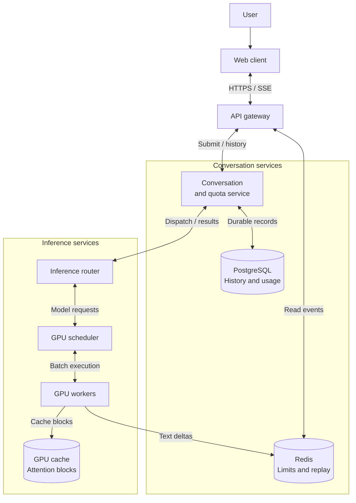
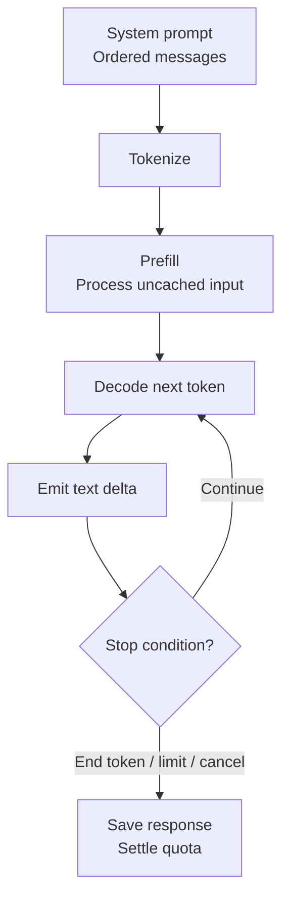
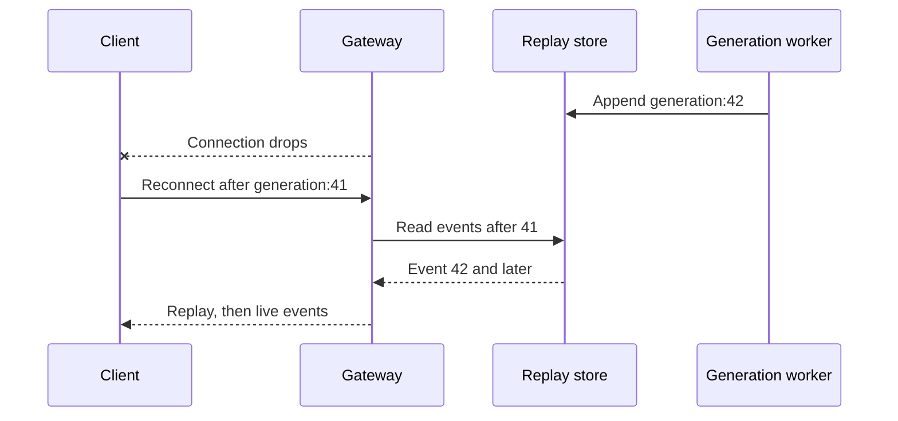

Design of a ChatGPT-like chat service that generates streaming responses and maintains conversation history.

<!--more-->

## Problem

A user sends a prompt, reads the response as it is generated, and asks follow-up questions in the same conversation. The service must keep the conversation in order and provide enough previous context for the model to answer each new message.

Each response requires GPU processing. The model first processes the prompt, then generates one token at a time while retaining attention data in GPU memory. Long prompts and responses consume more of that capacity, so the serving system needs to manage both computation and memory across concurrent requests.

This is a proposed self-hosted serving architecture. Model training, fine-tuning, billing, content moderation and tool execution are outside its scope.

## Requirements

### Functional requirements

- **Generate a response.** Accept a prompt and stream the answer as it is generated.
- **Continue a conversation.** Include previous messages and a conversation-level system prompt in each request.
- **Control generation.** Let the user stop a response or reconnect after a brief connection interruption.
- **Manage history.** List, search and delete the user's conversations.
- **Apply usage limits.** Enforce per-user request rates, concurrent-generation limits and daily token allowances.

### Non-functional requirements

Targets for text requests with up to 4,000 input tokens and 500 output tokens, within the workload below:

- **Latency:** P95 time to first token below 2s; P95 completion time below 12s.
- **Streaming:** P95 inter-token delay below 20ms during decode, equivalent to about 50 tokens/s.
- **Availability:** 99.9% successful generations for valid, in-quota requests at the modeled load.
- **Consistency:** ordered conversation messages and one active generation per conversation; retries reuse the same generation.
- **Privacy:** enforce conversation ownership on every operation and isolate cached private prompts between users.

## Back-of-the-envelope calculations

- **Traffic:** 300M weekly active users × 10 prompts/week ÷ 604,800s ≈ 5K requests/s average; a 3× peak gives 15K requests/s.
- **Inference:** an assumed 500-token response at 50 tokens/s takes about 10s to decode. At peak, that means about 150K concurrent decodes and 7.5M output tokens/s, before adding prefill and queueing time.
- **History:** assuming 500 input and 500 output tokens per exchange at roughly four UTF-8 bytes/token, 3B exchanges/week produce about 12TB/week of text before indexes, metadata and replication.
- **Buffers:** 500 four-byte token IDs × 150K active generations ≈ 300MB. Text, replay storage and transport buffers add overhead.
- **Capacity:** keep a proposed 20% of provisioned serving capacity warm and spare. GPU count comes from benchmarks of the selected model, prompt mix and latency targets; concurrent requests per GPU vary with available attention-cache memory.

## Core entities

- **Conversation** stores its owner, model and system prompt. Its active-generation field serializes follow-up requests.
- **Message** stores user or assistant text. A unique `(conversation_id, sequence)` key defines message order.
- **Generation** records one response attempt, its state and token usage. A unique `(user_id, idempotency_key)` key makes submission retries safe; reusing a key with different input returns a conflict.
- **UserQuota** stores used and reserved tokens for one daily allowance window.

```protobuf
message Conversation {
  string conversation_id;
  string user_id;                // Owner of the conversation.
  string title;
  string model_revision;
  string system_prompt;
  string active_generation_id;   // One response at a time.
}

message Message {
  // Unique key: (conversation_id, sequence).
  string conversation_id;
  uint64 sequence;
  string role;                   // user | assistant
  string content;
  string generation_id;          // Response attempt that produced it.
}

message Generation {
  string generation_id;          // One response attempt.
  string conversation_id;
  string user_id;
  string idempotency_key;         // Unique per user; reused on retry.
  string status;                 // queued | running | completed |
                                 // cancelled | failed
  uint32 input_tokens;
  uint32 output_tokens;
  uint32 max_output_tokens;      // Upper bound reserved before execution.
}

message UserQuota {
  // One allowance window per user.
  string user_id;
  Timestamp window_start;
  uint64 tokens_limit;
  uint64 tokens_used;
  uint64 tokens_reserved;         // Held by accepted requests.
}
```

### API

Submission creates a generation; a separate authenticated GET streams its events. The web client uses `fetch` streaming so it can supply authentication and a replay cursor.

```yaml
POST /conversations:
  body: {title: string, model: string, system_prompt: string}
  response: {status: 201, conversation_id: uuid}

POST /conversations/{id}/messages:
  headers: {Idempotency-Key: uuid}
  body: {content: string, max_output_tokens: integer}
  response: {status: 202, generation_id: uuid}
  errors: [400 invalid_input, 409 active_generation_or_key_conflict, 429 user_limit, 503 capacity_unavailable]

GET /generations/{id}/events:
  headers: {Last-Event-ID: last_applied_event_id}
  response: {content_type: text/event-stream, events: [delta, completed, cancelled, failed]}
  errors: [404 not_found, 410 replay_expired]

GET /generations/{id}:
  response: {status: generation_status, output: string, usage: object}

POST /generations/{id}/cancel:
  response: {status: 202}

GET /conversations:
  query: {q: title_search, cursor: opaque_cursor}
  response: {conversations: array, next_cursor: string}

GET /conversations/{id}/messages:
  query: {cursor: opaque_cursor}
  response: {messages: array, next_cursor: string}

DELETE /conversations/{id}:
  response: {status: 204}

GET /quota:
  response: {used: integer, reserved: integer, limit: integer, resets_at: timestamp}
```

## High-level design

The conversation service saves messages and reserves quota before dispatching work. The inference router selects a compatible model pool, where the scheduler batches requests and manages GPU memory. The gateway delivers generated text through an SSE stream; PostgreSQL retains the conversation and Redis provides short-lived replay.



### Storage

- **PostgreSQL:** choose transactions and uniqueness constraints for message ordering, idempotency and quota reservations. Store related records on the same user shard as the dataset grows. Index messages by `(conversation_id, sequence)` and conversations by `(user_id, updated_at, conversation_id)`; a [GIN text-search index](https://www.postgresql.org/docs/current/textsearch-indexes.html) supports title search.
- **Redis:** use atomic token-bucket counters for request-rate limits and bounded event streams for reconnect replay. These records expire; PostgreSQL retains final responses and usage. A Redis outage pauses new admission and stream delivery until recovery.
- **GPU memory:** retain active key/value attention tensors and reusable prompt prefixes. Model artifacts remain in object storage and are loaded when a worker starts.

Cassandra would provide horizontally distributed history storage, but coordinating the selected uniqueness and quota transactions would require additional machinery. PostgreSQL keeps those operations together; Redis serves the transient, low-latency state.

## Functional scenarios

### Sending a prompt

A user submits a message through `POST /conversations/{id}/messages`. The conversation service verifies ownership and loads the system prompt and messages in sequence order.

- **Validate the request.** Tokenize the assembled context with the selected model's tokenizer and check the context and output limits.
- **Save and reserve.** In one PostgreSQL transaction, lock the conversation and quota rows, check the user's remaining allowance and concurrency cap, and ensure the conversation has no active generation. Append the user message, reserve `input_tokens + max_output_tokens` and save the Generation record with its idempotency key.
- **Dispatch.** Return the generation ID and deliver the committed request to the inference router. A dispatcher recovers queued records after a service restart; the router and worker deduplicate deliveries by generation ID.

Token allowance counts the assembled input once per generation, including cached input, plus generated output. An atomic reservation accounts for concurrent requests before they begin consuming GPU time. Queueing and memory admission are covered in the deep dives.

### Generating a response

The worker runs two stages. **Prefill** processes the input tokens and creates the key/value attention cache. **Decode** uses that cache to generate successive output tokens.



Each iteration adds output to a per-generation buffer. An independent I/O task sends text deltas to Redis; the gateway reads them and delivers SSE events to the web client. This separates GPU scheduling from socket speed.

When generation ends, the conversation service saves the assistant message, marks the generation terminal, clears the conversation's active-generation field and replaces the reservation with actual input/output usage in one transaction. A repeated completion callback sees `usage_settled` and leaves usage unchanged. Cancellation charges consumed input and generated output; unused allowance is released. Cancelling a queued request releases its full reservation.

### Continuing a conversation

A follow-up uses the saved system prompt, ordered history and new user message. A worker with matching attention-cache blocks can reuse the unchanged prefix. Otherwise it rebuilds the context from PostgreSQL and runs prefill.

Changing the model or system prompt produces a different cache key. If the assembled conversation exceeds the context limit, return a context-limit error and let the UI ask the user to shorten it or start a new conversation. Prefix reuse reduces repeated computation, but long histories still occupy GPU memory.

### Stopping and reconnecting

The Stop action sends `POST /generations/{id}/cancel`. The worker checks cancellation between iterations, releases active cache blocks and saves the partial response with a cancelled status.

A dropped SSE connection has a 30s reconnect grace period. The web client reconnects to the same generation with its last applied event ID; the gateway replays retained events and then attaches to live output. The replay buffer is bounded, so an older cursor returns `410 replay_expired`; the client retrieves the saved response when generation finishes. Stream recovery is detailed below.

### Managing history

Conversation lists use an opaque cursor over `(updated_at, conversation_id)`; messages use their sequence number. Title search uses PostgreSQL full-text search, and every query includes the authenticated user ID.

Deletion sets `deleted_at`, hides the conversation immediately and cancels its active generation. A background job removes its messages and replay data after the proposed 30-day retention period; private cache entries are invalidated. List cursors provide stable ordering for unchanged records; updates between pages can move a conversation, so the client deduplicates by ID.

## Deep dives

### GPU scheduling

Requests need different amounts of work: a long prompt requires substantial prefill, while an active response needs frequent decode steps. Reserving a full context buffer for every request wastes memory, and a fixed batch retains capacity until its longest response finishes.

- **Fixed batches:** straightforward execution, but short responses wait behind longer ones.
- **Continuous batching:** admit and finish requests between iterations; chunk long prefills so active streams keep receiving tokens.
- **Separate prefill/decode pools:** tune each workload independently, at the cost of transferring attention state and coordinating two capacity pools.

**Recommendation:** start with continuous batching, chunked prefill and paged attention-cache allocation. [Orca](https://www.usenix.org/conference/osdi22/presentation/yu) and [TensorRT-LLM in-flight batching](https://nvidia.github.io/TensorRT-LLM/batch_manager.html) describe iteration-level scheduling; [PagedAttention](https://arxiv.org/abs/2309.06180) describes noncontiguous cache blocks.

Size attention memory from the selected model configuration:

```python
kv_bytes = tokens * layers * kv_heads * head_dimension * 2 * bytes_per_value
# Example: 10K tokens, 32 layers, 8 KV heads, dimension 128, FP16.
# About 1.31 GB per sequence before allocator overhead.
```

Model weights, execution workspace and cache blocks must fit within each worker's GPU group. Parallelism determines which tensors are sharded or replicated.

At each iteration, schedule active decodes, fill the remaining token budget with prefill chunks, emit output and reclaim finished requests. Allocate more blocks as sequences grow; when memory is exhausted, briefly queue new work or preempt a request and later recompute its state. [vLLM's tuning guide](https://docs.vllm.ai/en/latest/configuration/optimization/#chunked-prefill) explains this prefill/decode trade-off. Benchmark mixed lengths, first-token latency and inter-token gaps before increasing the batch budget.

[TensorRT-LLM](https://nvidia.github.io/TensorRT-LLM/architecture/overview.html) and [DeepSpeed Inference](https://arxiv.org/abs/2207.00032) are serving-engine alternatives. [FlashAttention](https://arxiv.org/abs/2205.14135) optimizes attention execution; [FlexGen](https://arxiv.org/abs/2303.06865) explores offloading for throughput-oriented workloads. Whole-state offloading requires measured transfer costs before use on this latency-sensitive path.

**Walk through one scheduler iteration**

Suppose the worker has two active decodes and receives a 12K-token prompt. Running the entire prefill first could leave both active users waiting. Instead, the scheduler includes each active sequence's next decode token and fills the remaining per-iteration token budget with a bounded prefill chunk. The next iteration repeats this process; a completed sequence releases its cache blocks immediately.

```text
Iteration    Decode work       Prefill work              Memory action
1            A + B             C, first chunk            allocate C blocks
2            A + B             C, next chunk             grow C blocks
3            B                 C, next chunk             reclaim finished A
4            B + C             D, first chunk            allocate D blocks
```

The runtime maps each sequence's logical attention pages to physical GPU blocks. Every layer's key/value tensor is addressed through that mapping, so a long request can grow without reserving one large contiguous allocation up front. Allocator efficiency helps concurrency; it does not reduce the model's per-token attention-state requirement.

Choose the token budget by profiling first-token latency, inter-token gaps and throughput across the real prompt-length distribution. Keep a separate ceiling on active sequences and cache occupancy. If the next iteration would exceed memory, queue admission or preempt a selected sequence; resumption rebuilds lost state from saved tokens. A prefill/decode split is worthwhile only when measured transfer and coordination costs are below its capacity benefit.

### Streaming and recovery

A generation can continue while its connection drops, and reconnecting must refer to the same attempt. Slow sockets and gateway failures therefore need a lifecycle separate from GPU execution.

- **Cancel on disconnect:** frees capacity immediately, but a brief network interruption ends the response.
- **Bounded replay with a grace period:** supports short reconnects while keeping memory and abandoned work bounded.
- **Durable storage for every delta:** permits longer recovery, with extra writes and storage.

**Recommendation:** use bounded replay and a 30s disconnect grace period. Assign increasing event IDs within each generation and retain up to 1,000 events per generation in Redis, with a byte limit and a 30s TTL after termination. The worker appends each delta once with a stable sequence ID; retried writes deduplicate that ID. The client ignores events it has already applied.

```yaml
id: "generation-123:42"
event: delta
data: {"text": "Hello"}
```

The gateway disables proxy buffering and sends a heartbeat every 15s. A shared connection lease records the reconnect grace period; after 30s without a client, the service cancels the generation. A lagging socket is disconnected when its gateway buffer fills; other streams continue. If Redis is unavailable, the affected worker uses its bounded 500-token output buffer, then pauses that generation's decode. A prolonged delivery failure cancels it and releases its GPU state.

[Server-sent events](https://html.spec.whatwg.org/multipage/server-sent-events.html#the-last-event-id-header) define the event cursor. [OpenAI's streaming API](https://developers.openai.com/api/docs/guides/streaming-responses) uses SSE for incremental responses; these endpoints and recovery policies belong to this proposed design.

Checkpoint partial text and usage in PostgreSQL periodically. A gateway restart can replay from Redis; a GPU worker crash marks the generation failed and retains its last checkpoint. Retrying creates a new generation explicitly. Each worker assignment has an expiring lease and increasing execution epoch; stale epochs cannot publish results or settle usage. Stop the old worker before reclaiming GPU capacity. If final usage is unavailable, hold its reserved allowance for reconciliation. Test these paths alongside ordinary reconnects.

**Reconnect and failure are different recovery paths**

Assume event 42 reached Redis but the socket dropped before the client rendered it. The client reconnects with its last applied cursor, 41. The gateway validates generation ownership and replays events after 41, including 42, before switching to live delivery. Appending an event uses its stable sequence ID, so a worker retry cannot create a second logical delta.



If the cursor is older than the retained buffer, return a replay-gap response with the durable partial checkpoint. The UI can display that checkpoint and show that continuous recovery is unavailable. It must not concatenate a newly generated continuation as though it were the original exact output.

A gateway crash preserves GPU execution because delivery and generation have separate ownership. A GPU crash loses attention state and fails that generation; restoring text does not restore the exact sampling state. A stale worker epoch is rejected by both publication and settlement paths. Test the crash after delta persistence, before checkpoint commit and after completion so each boundary has an explicit outcome.

### Prefix caching

Every follow-up repeats much of the previous context. Recomputing that prefix increases first-token latency; retaining all historical attention data would eventually exhaust GPU memory.

- **Recompute every turn:** simple recovery with higher prefill cost.
- **Cache immutable prefix blocks:** reuse recent compatible context and evict unused blocks under memory pressure.
- **Persist whole attention caches:** avoids some recomputation, but adds transfer cost and model-version coupling.

**Recommendation:** keep an ephemeral, per-user prefix cache. A block's identity includes the preceding-prefix hash, token IDs, model revision, tokenizer configuration and a server-controlled user isolation salt. The preceding hash matters because attention data depends on earlier tokens.

```python
import hashlib
import json

identity = (user_salt, model_revision, tokenizer_config,
            previous_block_hash, token_ids)
encoded = json.dumps(identity, sort_keys=True,
                     separators=(",", ":")).encode("utf-8")
block_key = hashlib.sha256(encoded).hexdigest()
```

Reuse complete matching blocks, then allocate writable blocks for new tokens. Reference counts protect blocks used by active requests; zero-reference blocks become eviction candidates. Edits reuse only the prefix before the changed text. A cache miss recomputes from saved history.

[vLLM's prefix-cache design](https://docs.vllm.ai/en/latest/design/prefix_caching/) explains block identity, reference counts and cache salting. Use a collision-resistant hash and test model upgrades, prefix edits and ownership boundaries. Measure saved prefill tokens separately from overall throughput: decode work and GPU memory remain part of each response.

**Why the preceding prefix belongs in the key**

For tokens `A B C D`, attention state for the block `C D` depends on `A B`. A cache keyed only by `C D` would wrongly reuse that state after `X Y`. Chaining the previous-block hash makes the cached block identify the complete preceding context.

A follow-up request tokenizes the full conversation using the bundle's tokenizer. The scheduler walks complete block keys from the start until the first miss. It acquires references to matching blocks, computes the remaining suffix, and allocates writable storage for new tokens. A partially filled shared block needs copy-on-write before extension.

```text
Saved context:  [A B] → [C D] → [E F]
Follow-up:      [A B] → [C D] → [E F] → [G H]
Reused: first three complete blocks; computed: new suffix

Edited turn:   [A B] → [C X] → [E F]
Reused: first block only; later attention state is recomputed
```

Evict zero-reference entries using a recency policy; active generations retain their pages. Model, tokenizer and isolation-salt changes intentionally create misses. Cache survival is an optimization: PostgreSQL history and versioned model artifacts supply the recovery path when a worker or its GPU memory disappears.

### Fair admission

A request count alone understates load: two long-context generations can consume more memory than many short requests. Unbounded priority queues also give low-priority users unpredictable waits.

- **Separate tier fleets:** strong capacity isolation, but idle capacity is harder to share.
- **Strict priority queues:** simple priority handling, with starvation risk.
- **Weighted fair queues:** share service between tiers while enforcing user and memory limits.

**Recommendation:** use weighted fair admission per model pool, then continuous batching within each worker. Give each tier a positive share and bound both queued work and active generations. Start with proposed per-user caps of two free-tier and ten paid-tier generations; tune those policies from queue delay and GPU-memory measurements.

Implement admission with weighted deficit round-robin: each scheduling round adds work credits in proportion to the tier's weight. A request becomes eligible when its estimated prefill/decode cost fits those credits; dispatch subtracts that cost. Rotate between users within each tier. The GPU scheduler separately checks available cache blocks.

Request-rate or concurrency limits return `429` with `Retry-After`; a full model-pool queue returns `503`. Expire accepted work still queued after 1s, publish a capacity error and release its reservation. Quota reservations cover input and the requested output allowance, so concurrent requests cannot spend the same remaining budget.

Keep warm spare capacity and scale from queue age, prefill/decode throughput and cache occupancy. Test burst load and long requests against the same latency targets; priority weights distribute capacity but do not establish a performance guarantee.

**Fairness at admission and inside a worker**

A tier weight allocates estimated work, not simply request count. A 20K-token prompt gets charged more prefill credits than a short prompt; its reserved output ceiling also bounds future decode exposure. Estimates are reconciled against actual work to detect systematic underestimation.

Use separate limits for queued bytes/tokens, active requests and per-user concurrency. A request passing its quota check can still wait for GPU memory; keep those outcomes explicit in the API. Scheduling round-robin among users prevents one account with many submissions from occupying its entire tier.

For example, weights 3:1 give a paid tier three work credits for each free-tier credit. Unused shares may be borrowed while demand is low, but new free requests regain their share on subsequent rounds. Deficit credits need a cap so an idle tenant cannot accumulate a huge future burst.

The GPU scheduler then protects the streams already admitted by chunking prefill and limiting decode gaps. End-to-end latency is queue wait plus prefill plus decode plus delivery, so a fair queue alone cannot establish the first-token target. Autoscaling uses queue age and throughput; new workers are admitted to routing only after their model is loaded and their health probe confirms execution.
