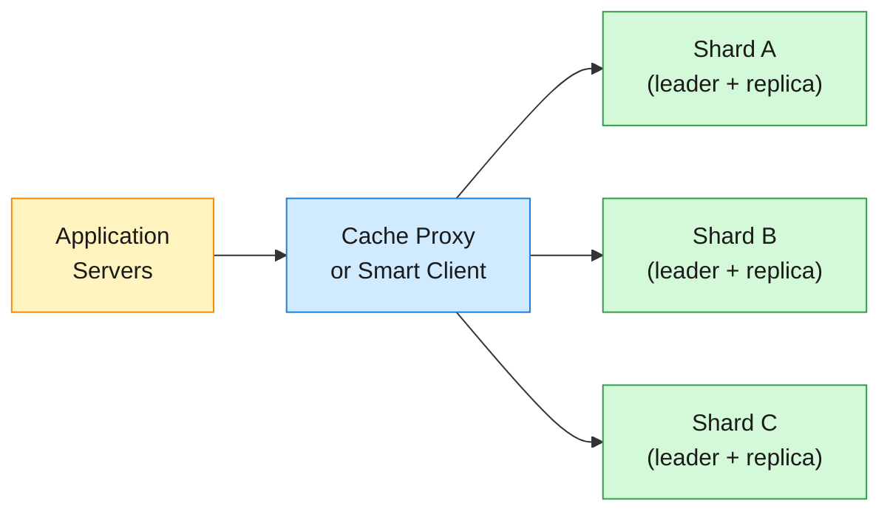
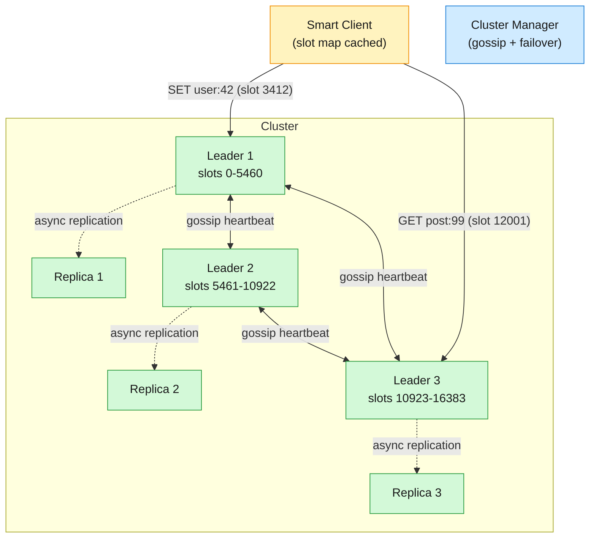

A single-node cache (one Redis instance, one Memcached process) hits a hard wall: the server's RAM ceiling.

<!--more-->

## 1. Problem

A single-node cache (one Redis instance, one Memcached process) hits a hard wall: the server's RAM ceiling. At ~256 GB of DRAM you saturate a modern box, and beyond that you cannot store more data without spilling to disk — at which point latency jumps from microseconds to milliseconds and the cache stops being a cache. Even before the memory limit, a single node is a single point of failure and a throughput bottleneck: one process on one core can serve roughly 100K operations per second, and at 1M req/s you need horizontal scale.

A distributed cache shards data across many nodes, so total capacity and throughput grow with the node count. It replicates data so a node crash does not lose the hot working set. It presents a single logical key space to the application — the client writes `SET user:42 "Alice"` and the system routes it to the right shard transparently.

When to build one vs. use Redis Cluster or Memcached off the shelf: you almost never build from scratch. Redis Cluster (16384 hash slots, gossip protocol, built-in replication) and Memcached behind mcrouter (5B req/s at Facebook scale) are battle-tested substrates. The design work is choosing the right substrate, sizing it, and hardening the client layer — consistent hashing, failure handling, eviction policy. The distributed cache "design" is really a client + routing + replication architecture painted onto an existing engine.



## 2. Requirements

**Functional**

- FR1: Store a key-value pair with an optional time-to-live
- FR2: Retrieve the value for a given key
- FR3: Delete a key explicitly before its TTL expires
- FR4: Retrieve or update multiple keys in one round trip
- FR5: Query or extend a key's remaining time-to-live

**Non-functional**

- NFR1: Median read latency under 1 ms at any scale
- NFR2: Horizontally scalable to at least 1M requests per second
- NFR3: Survive a single-node failure with no unavailable keys
- NFR4: 99.9% availability; stale reads acceptable for up to 2 seconds

*Out of scope: persistence to disk, durable writes, complex data structures (sorted sets, streams), pub/sub messaging.*

## 3. Back of the envelope

- **Peak throughput:** 1M req/s, 80% reads / 20% writes → 800K reads/s + 200K writes/s → a single node does ~100K ops/s, so 10 nodes at minimum; budget 15 for headroom and replication.
- **Storage per node:** 1 TB logical cache, replication factor 2 → 2 TB raw ÷ 15 nodes ≈ 133 GB per node → fits in a 256 GB RAM instance with room for metadata overhead.
- **Replication bandwidth:** 200K writes/s × 2 replicas × 1 KB avg value ≈ 400 MB/s of replication traffic across the cluster → 10 Gbps network links handle this with 3x headroom; replication is not the bottleneck.

## 4. Entities

```
CacheEntry {
  key:      string     PK
  value:    blob
  ttl_ms:   integer               ← absolute expiry timestamp (ms); 0 = no expiry
  version:  integer               ← monotonic; used for CAS and conflict resolution
}

ShardMap {
  slot_start:  integer  CK        ← 0..16383, contiguous range
  slot_end:    integer  CK
  node_id:     string             ← which physical node owns this slot range
  epoch:       integer             ← config version; bumped on reshard
}

Node {
  node_id:    string     PK
  address:    string             ← host:port
  role:       enum               ← leader | follower
  status:     enum               ← healthy | pfail | fail
  slots:      integer[]          ← slot ranges owned; denormalized for fast lookup
}
```

### API

- `GET /cache/{key}` — return value + remaining TTL, or 404
- `SET /cache/{key}` — upsert with optional `ttl_seconds` in body; returns 200
- `DELETE /cache/{key}` — remove key; idempotent, returns 200
- `MGET /cache` — body carries `["key1","key2",...]`; returns map of found keys
- `MSET /cache` — body carries `{"key1":"val1","key2":"val2",...}` with optional per-key TTLs
- `GET /cache/{key}/ttl` — return remaining TTL in seconds, or -1 (no TTL) / -2 (not found)
- `PATCH /cache/{key}/ttl` — extend or shorten TTL; body carries `ttl_seconds`

## 5. High-Level Design

The system uses Redis Cluster as the substrate: 16384 hash slots partitioned across leader nodes, each with one or more async replicas. A smart client library (or lightweight proxy) holds a slot-to-node map and routes every command directly to the correct node — no central router, no extra hop.



#### FR1: Store a key-value pair with optional TTL

- **Components:** Smart client, leader node owning the target slot.
- **Flow:**
  1. Client hashes the key: `slot = CRC16(key) % 16384`.
  1. Client looks up slot in its local slot→node table, sends `SET key value EX ttl` to the leader.
  1. Leader writes to its in-memory hash table, records the expiry timestamp, replies `OK`.
  1. Leader asynchronously replicates the write to its followers via the replication stream.
  1. If the client's slot map is stale (slot moved to a different node), the leader replies `MOVED <slot> <new-node>`. Client updates its map, retries on the new node.
- **Design consideration:** The client must handle `MOVED` redirects transparently. On a `MOVED` response, it updates the slot map (not just for that one key — it learns the whole slot range that moved) and retries. A `MOVED` is permanent; an `ASK` redirect (temporary, during migration of a single key) forces a one-shot redirect but does not update the map.

#### FR2: Retrieve the value for a given key

- **Components:** Smart client, any node (leader or follower, if read-from-replica is enabled).
- **Flow:**
  1. Client computes slot, routes `GET key` to the leader for that slot.
  1. Leader checks the hash table. If key exists and TTL has not expired, returns value. If expired, lazily evicts and returns nil.
  1. If key is absent, returns nil — the caller treats this as a cache miss and fetches from the source of truth.
- **Design consideration:** Reads can be served from replicas for higher throughput (Redis `READONLY` command on replica connections), at the cost of reading slightly stale data — the replica may lag behind the leader by the replication delay (typically sub-millisecond on a local network, but can spike under load). For cache workloads, this staleness is acceptable; the cache-aside pattern already tolerates it.

#### FR3: Delete a key explicitly before its TTL expires

- **Components:** Smart client, leader.
- **Flow:**
  1. Client routes `DEL key` to the leader.
  1. Leader removes the key from the hash table and the expiry index.
  1. Leader replicates the deletion to followers.
- **Design consideration:** `DEL` is synchronous on the leader but the replication is still async. If the leader crashes immediately after ack'ing the `DEL`, a replica that did not yet receive the deletion might promote and serve the stale key — until its own TTL expires. This is the same async-replication caveat as writes.

#### FR4: Retrieve or update multiple keys in one round trip

- **Components:** Smart client, multiple leaders (keys may hash to different slots).
- **Flow:**
  1. Client receives `["key1","key2","key3"]`. For each key, computes its slot.
  1. Groups keys by slot → node, sends one `MGET` (or pipelined `GET`s) per target node.
  1. Waits for all responses, merges results, returns the combined map to the caller.
  1. For `MSET`, the same grouping — pipeline writes per node, collect acknowledgements.
- **Design consideration:** Redis hash tags (`{...}`) let the application force related keys to the same slot: `user:{42}:profile` and `user:{42}:settings` both hash on `42`. This enables true atomic `MGET`/`MSET` on co-located keys but creates hot spots if one user dominates. Use hash tags sparingly and only when atomicity across keys is required.

#### FR5: Query or extend a key's remaining TTL

- **Components:** Smart client, leader.
- **Flow:**
  1. `TTL key` → leader returns seconds remaining, -1 (no expiry), or -2 (not found).
  1. `EXPIRE key 300` → leader updates the expiry timestamp to now + 300s in the expiry index, replicates the change.
- **Design consideration:** Redis stores TTLs in a separate expiry dictionary (not inline in the hash table entry), so `EXPIRE` is an O(1) update that does not touch the value. The server lazily evicts expired keys on access plus an active background scan sampling 20 random keys from the expiry set 10 times per second.

## 6. Deep dives

### DD1: Data distribution — hash slots vs. consistent hashing ring

**Problem.** The key space must be partitioned across N nodes so that every key lands on exactly one node, reads route in one hop, and adding or removing a node moves only ~1/N of the keys. The naive approach — `hash(key) % N` — moves (N-1)/N keys on every topology change, which at terabyte scale means hours of data migration.

**Approach 1: Consistent hashing ring with virtual nodes**

Map every node onto a hash ring at 100-200 positions (virtual nodes). A key hashes to a point on the ring; walk clockwise to find the owning node. When a node joins, it inserts its vnodes onto the ring, absorbing ~1/N of the keys from its clockwise neighbors. When a node leaves, its keys shift to the next node clockwise.

```javascript
Ring:  0 ---------------- 2^160 ---------------- 0

Nodes: A at 0x1A, 0x8F, 0xE2  (3 vnodes for A)
       B at 0x3C, 0xA1         (2 vnodes for B)
       C at 0x5B, 0xD4         (2 vnodes for C)

Key k1 hashes to 0x45 → clockwise walk → B (0xA1, first node clockwise)
Key k2 hashes to 0x90 → clockwise walk → A (0x8F? wait no — 0x90 > 0x8F, next is 0xA1 → B)
```

**Challenges:** Ring lookups are O(log V) with binary search over the sorted vnode list. Load variance is ~10% at 100 vnodes — acceptable for most workloads but can still produce hot nodes under heavy skew. The ring approach couples key distribution to physical topology: add a node and keys redistribute probabilistically, which makes capacity planning harder.

**Approach 2: Fixed hash slots with explicit ownership (Redis Cluster)**

Partition the keyspace into 16384 fixed slots. A key maps to a slot via `CRC16(key) % 16384`. Each slot is owned by exactly one leader node at any time. The slot-to-node mapping is an explicit assignment, not a probabilistic ring walk. Resharding means moving slots between nodes — deterministic, measurable (you know exactly which slots are moving and how many keys they contain).

```javascript
Slot mapping (explicit, gossip-propagated):
  Slots 0-5460     → Node A (leader)
  Slots 5461-10922 → Node B (leader)
  Slots 10923-16383 → Node C (leader)

Key "user:42":
  CRC16("user:42") = 3412
  3412 % 16384 = 3412  → slot 3412 → Node A

Client holds the full slot→node table (16384 entries, ~64 KB in memory).
On MOVED redirect, client updates only the affected range.
```

**Challenges:** The 16384-slot granularity means the smallest unit of migration is one slot. With 16384 slots and a 1 TB cluster, each slot holds ~64 MB on average — coarse but acceptable. Redis 8.4 Atomic Slot Migration makes moving a slot near-instantaneous: a bulk snapshot transfer followed by a brief write pause for delta catch-up, 30x faster than the old per-key MIGRATE loop. Adding a new node requires the operator (or cluster manager) to rebalance slots; it is not automatic the way consistent hashing is.

**Decision.** Fixed hash slots with 16384 partitions. The deterministic slot ownership model makes failure detection and failover unambiguous — gossip heartbeats carry a 2 KB bitmap encoding which node owns which slot, and every node agrees on the full picture within one gossip round. The MOVED/ASK redirect protocol gives the client a precise, actionable signal on every topology change. The explicit rebalancing is a feature, not a bug: operators know exactly how much data is moving before they commit.

**Rationale.** Consistent hashing is elegant for stateless nodes (CDN edge caches, Memcached), where a node can disappear and the ring self-corrects. For a stateful cache with replication and failover, the system needs deterministic slot ownership so that a replica promotion can claim exactly the slots its dead leader held — not a fuzzy probability distribution of keys. The 2 KB slot bitmap that fits in one gossip heartbeat is the concrete engineering constraint that drove the 16384 choice: larger would fragment gossip messages; smaller would limit maximum cluster size.

**Edge cases:**

- **Slot migration in progress:** A key in a migrating slot returns `ASK` redirect, telling the client to try the destination node for this one request. The client sends an `ASKING` command first, then the actual command. After migration completes, the redirect becomes a permanent `MOVED`.
- **Hash tag collisions:** `{user}profile` and `{user}settings` both hash on `user`. If user `42` is a celebrity, that one slot becomes hot. Mitigation: key-level replication (read from replicas) or application-level splitting (`user:42:1`, `user:42:2`).
- **Empty cluster bootstrap:** At startup with zero nodes, there are no slot assignments. The first node claims all 16384 slots. As nodes join, an operator runs `CLUSTER REBALANCE` to spread slots evenly.

### DD2: Cache eviction and memory management

**Problem.** RAM is finite. When the cache fills up, the system must evict some entries to make room for new ones. The eviction policy directly determines the hit rate — evict the wrong keys and the cache becomes useless. The policy must also be cheap: a strict LRU with a doubly-linked list and per-access pointer updates costs two pointer writes per read, which at 1M req/s becomes the bottleneck.

**Approach 1: Approximated LRU with sampling (Redis model)**

Instead of maintaining a global LRU list, each key carries a 24-bit access timestamp (the server's `lru_clock`, incremented every 100 ms). On eviction, sample N random keys (default N=5), evict the one with the oldest timestamp. An eviction pool of 16 candidates across multiple sampling rounds improves accuracy: the oldest candidates survive across rounds and compete against fresh samples.

```python
# Simplified Redis approximated LRU logic
def evict_if_needed(db, maxmemory):
    while used_memory > maxmemory:
        pool = []  # eviction pool, size 16
        for _ in range(maxmemory_samples):  # default 5
            candidate = random_key(db)
            pool.append((candidate, candidate.lru_clock))
        pool.sort(key=lambda x: x[1])  # oldest first
        evict(pool[0][0])  # evict the oldest in the pool
```

**Challenges:** Sampling 5 keys is fast but imprecise — with 1M keys, a random sample of 5 has a ~1% chance of including a truly cold key that should be evicted. Increasing `maxmemory-samples` to 10 improves precision at ~2x CPU cost. The approach also evicts keys that were accessed recently but are older than the sample — a "good enough" LRU, not a true LRU.

**Approach 2: Segmented LRU with HOT/WARM/COLD tiers (Memcached model)**

Instead of one LRU, maintain four per-slab-class sub-LRUs: HOT (new items, capped at 32% of slab), WARM (active items that survived HOT), COLD (candidates for eviction), and TEMP (short-TTL items that never get bumped). A background thread moves items between sub-LRUs based on access count and age. New items enter HOT. Items accessed twice are "active" and migrate WARM → COLD on eviction scan. Cold items accessed again jump directly back to WARM.

```javascript
New item → HOT (32% cap)
             │
             ▼ (item hit >= 2 times, or eviction scan)
           WARM
             │
             ▼ (eviction scan, item not recently hit)
           COLD ──► EVICT
             ▲
             │ (item hit while in COLD)
             └── promoted to WARM

TEMP LRU: items with TTL <= temporary_ttl. Never bumped, never mixed with main LRU.
```

**Challenges:** The slab allocator (fixed-size chunk classes) introduces internal fragmentation: a 200-byte value in a 256-byte slab class wastes 56 bytes. Memcached's adaptive slab rebalancer (Facebook extension) auto-reassigns pages between slab classes based on eviction rates, but it is reactive. The HOT/WARM/COLD segmentation adds complexity — the background `lru_maintainer` thread needs CPU budget and tuning.

**Decision.** Approximated LRU with sampling and an eviction pool. It is simpler, has fewer moving parts, and at our scale (1M req/s, 15 nodes), the statistical approximation is good enough — the eviction pool of 16 candidates per cycle makes the effective sample size much larger than the raw `maxmemory-samples` of 5. We also set `maxmemory-policy allkeys-lru` (not `volatile-lru`) so the cache can evict any key, not just those with a TTL.

**Rationale.** The true win of segmented LRU is under pathological access patterns (repeated full-table scans that evict the entire working set) — Memcached's COLD tier catches scan traffic before it trashes HOT. At our scale, those scans are the caller's problem: the application should not full-scan the cache. Redis's sampling LRU is fast, predictable, and has 10+ years of production data showing hit rates within 5% of true LRU with `maxmemory-samples 10`. The simplicity buys reliability.

**Edge cases:**

- **Expired keys pile up:** Redis lazily expires keys (on access + background scan). If a key expires and is never accessed, it sits in memory until the active expiry scan finds it. The scan checks 20 random keys from the expiry set 10 times/second — with 10M expiring keys, some linger for minutes. Acceptable for a cache; the memory they occupy is available for eviction if the maxmemory limit is hit.
- **TTL-based eviction without maxmemory:** If `maxmemory` is not set and keys only expire via TTL, memory can grow unbounded if the write rate exceeds the expiry rate. Always set `maxmemory` as a hard cap.
- **Write spikes during eviction:** When memory is near the limit and eviction runs frequently, every write may trigger an eviction scan, increasing write latency. Headroom — keep memory at ~80% of maxmemory under normal load — absorbs spikes without triggering eviction on every write.

### DD3: Replication and high availability

**Problem.** A cache node crash must not make its keys unavailable. The system needs redundancy so that on failure, another node takes over with the same data. But synchronous replication — waiting for every replica to acknowledge before responding to the client — adds latency and kills throughput for a cache. The tension is between durability (no data loss on failure) and performance (sub-millisecond writes).

**Approach 1: Async leader-follower replication (Redis model)**

The leader accepts writes and streams them to followers via an append-only replication log. Followers replay the log and stay caught up — typically within milliseconds on a local network. Clients write only to the leader; reads can go to followers if the client issues `READONLY`. On leader failure, a follower is promoted to leader via a consensus protocol: a majority of remaining leaders must observe the failure (PFAIL → FAIL in gossip) and authorize the promotion.

```javascript
Client  ──SET key val──►  Leader A  ──replication stream──►  Follower A1
                                                           ──►  Follower A2

Leader A crash:
  Follower A1 has offset 1042, Follower A2 has offset 1041.
  Gossip detects A is down (PFAIL → FAIL after cluster-node-timeout).
  Follower with highest offset (A1, 1042) requests promotion.
  Majority of remaining leaders vote. A1 becomes new leader for A's slots.
```

**Challenges:** Writes acknowledged by the leader but not yet replicated are lost on leader crash — the "async replication caveat." The loss window is the replication lag (~1 ms under normal load, seconds under heavy write pressure). For a cache, this is acceptable: lost writes are regenerated on the next cache miss from the source of truth. The `WAIT` command offers a compromise — the client can request acknowledgement from N replicas before the write is considered complete, paying latency for reduced loss window.

**Approach 2: Quorum-based replication with read repair (Dynamo-style)**

Every write goes to W nodes, every read goes to R nodes, with W + R > N (where N is the replication factor). On read, if a replica returns stale data, the coordinator repairs it from a more up-to-date replica. This allows tunable consistency and tolerates up to N - W node failures on the write path. Hinted handoff temporarily stores writes for unreachable nodes.

**Challenges:** The read path is more expensive — every read contacts multiple nodes to detect and repair staleness. This doubles or triples the internal network traffic for reads, which at 800K reads/s becomes the dominant cost. The coordinator pattern adds a hop or forces the client to be the coordinator (smart client complexity). Quorum systems are designed for durability-first workloads (DynamoDB, Cassandra); a cache is performance-first.

**Decision.** Async leader-follower replication with the `WAIT` command as an opt-in durability knob. The default path — leader acks immediately, replicates async — keeps writes at sub-millisecond latency. The `WAIT 1 100` escape hatch (wait for at least 1 replica to ack within 100 ms) is available for keys where a write loss would be expensive to regenerate (e.g., a computed aggregation that takes seconds to rebuild).

**Rationale.** A cache is not a system of record. If a leader crashes and loses the last 100 writes, those writes are cache entries — the source of truth (database, API, computation) still has the data, and the next GET will repopulate the cache. The performance cost of synchronous replication (2-3x write latency) is not worth paying for durability that the system does not require. This is the standard operating model for cache infrastructure at scale: cached data is regenerable, so replication provides availability without paying the durability tax; a cache warming system handles the cold-start window after a failover.

**Edge cases:**

- **Split-brain:** Two nodes both believe they own the same slot range. Redis Cluster prevents this with config epochs — a monotonically increasing integer per slot assignment. When a follower promotes, it increments its config epoch. Nodes with a lower epoch for a slot refuse writes. Gossip propagates the higher epoch, and the stale leader steps down (or is fenced by the majority).
- **Replica sync after long partition:** A replica that falls behind by hours cannot replay the replication log (the leader's backlog is finite). The replica performs a full resynchronization: leader snapshots its entire dataset to disk, sends the RDB file over the network, then streams the delta from the snapshot point. During sync, the replica is unavailable but the leader continues serving.
- **Cross-region replication:** Async replication across regions (e.g., us-east → eu-west) adds 50-150 ms of lag. For a global cache, deploy independent regional clusters (no cross-region replication) and let the source of truth handle cross-region consistency. Each region's cache is local to its users; a write in one region invalidates the other region's cache via a CDC-driven invalidation message.

### DD4: Multi-tier caching — L1 in-process + L2 distributed

**Problem.** Even a sub-millisecond distributed cache adds network latency — typically 200-500 us for a same-AZ Redis GET. For hot keys accessed thousands of times per second, this network tax dominates. An in-process cache (L1) can serve reads in ~100 ns — 2000x faster — but has tiny capacity (~100 MB per instance) and consistency problems across instances.

**Approach 1: Short-TTL L1 with L2 fallback**

Each application instance maintains a small in-process cache (Caffeine, Guava, or a hand-rolled concurrent hash map) with a very short TTL — 1 to 10 seconds. On read, check L1 first; on miss, fetch from L2 (distributed cache); on L2 miss, fetch from the source of truth and populate both caches. On write, invalidate L2 (delete key); L1 entries expire naturally within the short TTL — no explicit invalidation protocol needed.

```javascript
Read path:
  L1.get(key) → hit? return               (100 ns)
  L1.get(key) → miss → L2.get(key) → hit?  (300 us + 100 ns)
    → return + L1.put(key, val, TTL=5s)
  L2.get(key) → miss → DB.get(key)        (5 ms + 300 us)
    → L2.put(key, val) + L1.put(key, val) → return

Write path:
  DB.write(key, val) → L2.delete(key)
  L1 entries expire within 5s — no explicit L1 invalidation
```

**Challenges:** The short TTL means L1 entries are stale for up to 5 seconds after a write. For most cache workloads (user profiles, product metadata, session data), 5-second staleness is invisible. The L1 hit rate is low for cold keys but excellent for hot keys — the 80/20 rule means 20% of keys get 80% of reads, and those hot keys stay resident in L1.

**Approach 2: Pub/sub-driven L1 invalidation**

When L2 is updated or invalidated, publish an invalidation event. Every application instance subscribes and evicts the key from L1 immediately. This eliminates the staleness window but adds complexity: a missed pub/sub message (network blip, subscriber restart) means stale L1 data indefinitely. Redis Pub/Sub is fire-and-forget — messages are not persisted and cannot be replayed, so a subscriber that misses an event has no way to catch up.

**Decision.** Short-TTL L1 without pub/sub invalidation. The 5-second staleness window is acceptable for a cache whose source of truth is eventually consistent anyway (cache-aside pattern). The simplicity — no pub/sub infrastructure, no missed-message recovery — outweighs the benefit of instant invalidation.

**Rationale.** The short TTL acts as a safety net that bounds staleness to a known window (5 seconds) without any coordination overhead — no pub/sub infrastructure, no missed-message recovery. At 5M reads/s, a 1-second L1 TTL with an L2 fallback cuts storage node count by 90% and drops P99 latency by 60%: the L1 absorbs the hot key traffic, and the L2 only handles cache fills and the long-tail cold keys. This is the pattern behind production multi-tier caches at scale: the in-process tier serves the hot working set at nanosecond latency, the distributed tier provides capacity for the long tail, and the short TTL keeps both layers eventually consistent with the source of truth without explicit coordination.

**Edge cases:**

- **Hot key write storm:** A popular key is updated; all instances see the L2 delete and race to repopulate L1 from L2. The L2 hit absorbs the concurrent reads (singleflight at the L2 layer). Without singleflight, L2 is thrashed by 1000 concurrent reads for the same key — use a per-key mutex in the L2 client.
- **Memory pressure on L1:** Caffeine's W-TinyLFU eviction adaptively balances recency and frequency, so the hot working set stays resident even under memory pressure. Size the L1 to hold the top ~10K keys by access frequency.
- **Cold start:** On deployment, L1 is empty. All reads hit L2, then L1 warms up. If L2 is also cold (new cluster), reads hit the database. A cache warmer — a process that preloads hot keys at startup — mitigates this. The warmer snapshots the hot key set to a persistent volume; new instances load the snapshot at boot, then catch up on recent writes from the replication stream.

## 7. References

1. [Redis Cluster Specification](https://redis.io/docs/latest/operate/oss_and_stack/reference/cluster-spec/)
1. [Redis Eviction Policies](https://redis.io/docs/latest/develop/reference/eviction/)
1. [Atomic Slot Migration in Redis 8](https://redis.io/blog/atomic-slot-migration/)
1. [Scaling Memcache at Facebook, NSDI 2013](https://www.usenix.org/system/files/conference/nsdi13/nsdi13-final170.pdf)
1. [Memcached Modern LRU Design](https://memcached.org/blog/modern-lru/)
1. [mcrouter: Scaling Memcached at Facebook](https://engineering.fb.com/2014/09/15/web/introducing-mcrouter/)
1. [Netflix EVCache: Cache Warming with EBS](https://netflixtechblog.medium.com/cache-warming-leveraging-ebs-for-moving-petabytes-of-data-adcf7a4a78c3)
1. [Consistent Hashing with Bounded Loads (Mirrokni et al., Google, 2018)](https://arxiv.org/abs/1608.01350)
1. [Dynamo: Amazon's Highly Available Key-Value Store, SOSP 2007](https://www.allthingsdistributed.com/files/amazon-dynamo-sosp2007.pdf)
