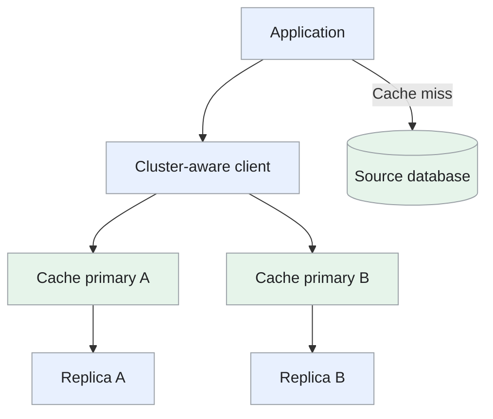
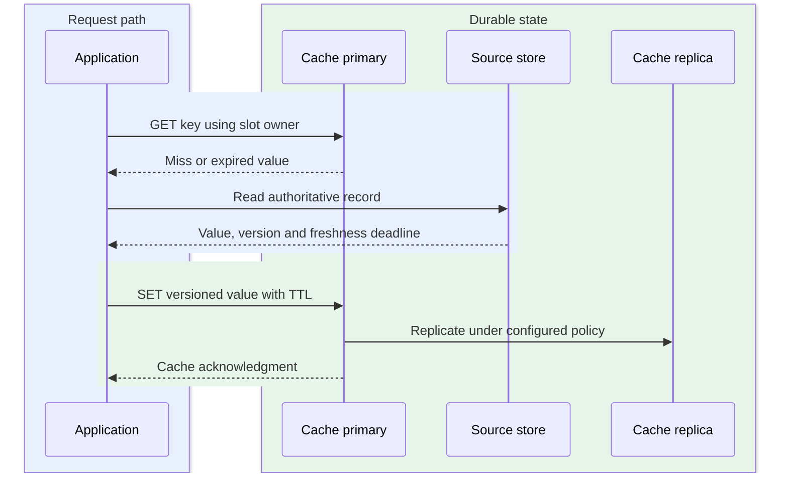
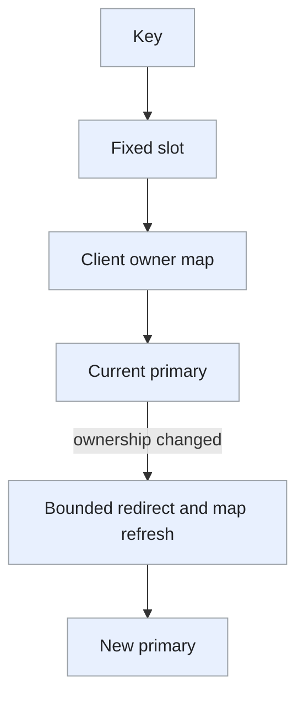

Design of a distributed key-value cache using Redis Cluster, with bounded freshness and recoverable cache misses.

<!--more-->

## Problem

Applications cache frequently read data to reduce database work and response time. As the working set and request rate grow, one cache node becomes a capacity limit and a failure boundary.

The service partitions keys across nodes and replicates their contents. Cached values remain disposable copies: the application retains a durable source from which a missing or lost entry can be rebuilt.

## Requirements

### Functional requirements

- **Store and retrieve:** set a key/value pair with an optional expiration and read it by key.
- **Invalidate:** delete a key or change its expiration.
- **Batch operations:** fetch or update several keys with explicit per-key outcomes.
- **Distribute data:** route requests across shards and migrate ownership as capacity changes.
- **Recover failures:** promote healthy replicas and rebuild missing cache contents.

### Non-functional requirements

Design targets:

- **Scale:** 1M operations/s, 80% reads, with a 1TB logical working set.
- **Latency:** p50 below 1ms and p99 below 5ms for healthy same-region single-key requests under the measured workload.
- **Availability:** 99.9%, with bounded interruption during failover and source-store fallback where permitted.
- **Freshness:** up to two seconds stale for explicitly tolerant values; critical authorization and financial state use the source of truth.
- **Capacity:** bounded memory, value size, request batch size and connection pools.

Durable storage, pub/sub and complex data structures are outside this design.

## Back-of-the-envelope calculations

- **Traffic:** 800K reads/s and 200K writes/s at peak.
- **Memory:** 1TB logical × two copies = 2TB before metadata, allocator overhead and operational headroom.
- **Replication:** one additional copy × 200K writes/s × 1KB ≈ 200MB/s aggregate payload.
- **Network reads:** 800K/s × 1KB ≈ 800MB/s response payload, distributed unevenly under hot-key traffic.

Measure throughput per shard with realistic payloads, connections and eviction. A fixed operations/s claim does not determine the required node count.

## Core entities

- **Cache entry:** the application value and its source version/freshness.
- **Slot ownership:** current mapping from key partition to serving node.
- **Cache node:** endpoint and leader/replica role.

```protobuf
message CacheEntry {
  bytes value;
  string source_version;          // Application data version where available
  Timestamp fresh_until;          // Application freshness bound
}

message SlotOwnership {
  int32 slot;
  string primary_node_id;
  repeated string replica_node_ids;
  int64 topology_epoch;
}

message CacheNode {
  string node_id;
  string endpoint;
  string role;
  string health;
}
```

Redis manages expiry and cluster metadata internally. The application freshness field prevents a re-cached stale value from receiving a new full freshness window.

## API

Use the native Redis protocol through a cluster-aware client rather than adding an HTTP hop.

```bash
redis-cli SET user:42:profile '<value>' PX 2000
redis-cli GET user:42:profile
redis-cli DEL user:42:profile
redis-cli PTTL user:42:profile
redis-cli PEXPIRE user:42:profile 1000
redis-cli MGET 'user:{42}:profile' 'user:{42}:settings'
```

An application batch spanning slots uses pipelined single-key commands and returns partial failures explicitly. Native multi-key commands require their keys to share a slot.

## High-level design

A cluster-aware client routes a key to its owning primary. Each primary replicates to a separate failure domain. The application handles misses by reading its source store.


```mermaid
flowchart TB
    A["Application"] --> C["Cluster-aware client"]
    C --> P1["Cache primary A"]
    C --> P2["Cache primary B"]
    P1 --> R1["Replica A"]
    P2 --> R2["Replica B"]
    A -->|"Cache miss"| D[("Source database")]
  classDef request fill:#e8f0fe,stroke:#9aa0a6,color:#202124,stroke-width:1px
  classDef background fill:#e6f4ea,stroke:#9aa0a6,color:#202124,stroke-width:1px
  classDef control fill:#fef7e0,stroke:#9aa0a6,color:#202124,stroke-width:1px
  class A,C,R1,R2 request
  class P1,P2,D background
```

## Storage

- **[Redis](/designs/tech-redis/) Cluster:** in-memory key/value storage, expiry and an explicit slot-to-node map. Primaries serve writes; replicas provide failover capacity.
- **Application source database:** durable records and versions. Cache loss or eviction never removes the underlying record.
- **Bounded in-process cache:** optional for hot tolerant values, with expiration no later than the value's original freshness deadline.

Use TLS, authenticated service identities, tenant key prefixes and value-size limits. Keep replica, resynchronization and migration memory outside the eviction budget.

## From request to response

### One end-to-end request

A client routes a key through its cached slot map.


```mermaid
sequenceDiagram
  box rgb(232,240,254) Request path
    participant U as Application
  end
  box rgb(230,244,234) Durable state
    participant A as Cache primary
    participant D as Source store
    participant W as Cache replica
  end
  rect rgb(232,240,254)
    U->>A: GET key using slot owner
    A-->>U: Miss or expired value
    U->>D: Read authoritative record
    D-->>U: Value, version and freshness deadline
  end
  rect rgb(230,244,234)
    U->>A: SET versioned value with TTL
    A->>W: Replicate under configured policy
    A-->>U: Cache acknowledgment
  end
```

A hit returns a value within its freshness deadline; a miss loads the authoritative store and fills the cache. Replication improves cache availability while the authoritative record remains the recovery source.

### Storing a value

The client computes the key's slot, sends SET to its primary and receives the primary acknowledgment. Replication follows asynchronously.

A MOVED response updates routing knowledge; an ASK response directs a one-request migration retry. Retried SET operations need a version-aware policy where concurrent source updates can otherwise overwrite a newer cached value.

### Reading a value

Route GET to the primary. Return a value only within the application's freshness bound. On nil, expiry or an allowed cache error, read the source database and populate the cache with a bounded TTL.

Coalesce concurrent fills for the same key and bound total fallback concurrency. A cache outage can otherwise move the entire workload onto the database.

### Invalidating or extending expiration

After committing a source update, invalidate affected keys through a recoverable change stream or outbox. A direct best-effort deletion improves speed; the retained event and TTL provide recovery.

Extending a key's TTL does not extend the underlying data's permitted freshness. A refill carries the source version and original freshness deadline.

### Fetching a batch

Group commands by slot and pipeline them to the relevant nodes. Preserve the caller's order and identify failed keys. A cross-shard batch is not one atomic operation.

Hash tags can colocate related keys, such as `user:{42}:profile` and `user:{42}:settings`. Apply them to small, bounded groups rather than entire tenants.

## Deep dives

### How should keys be distributed?

Modulo hashing by the current node count remaps many keys during a topology change.

- **Consistent hashing:** place independent nodes on a hash ring and use virtual nodes to spread key ranges. Only part of the key set moves when membership changes; clients and migration tooling still need a shared membership view, and equal ranges do not ensure equal traffic.
- **Fixed slots:** hash keys into a stable slot set and assign slot owners separately. Redis Cluster can migrate explicit partitions and direct clients to their owners; clients must handle redirects and multi-key operations are constrained by colocation.
- **Central proxy:** route every operation through a service that owns topology knowledge. Applications stay simple, but the proxy adds a hop, capacity demand and an availability boundary.

**Recommendation.** Fixed slots fit the selected Redis Cluster because its protocol already defines ownership and migration. We accept topology-aware clients and slot-colocation constraints rather than implementing a competing ring or introducing a mandatory routing proxy.

The [Redis Cluster specification](https://redis.io/docs/latest/operate/oss_and_stack/reference/cluster-spec/) defines 16,384 slots and client redirects. Cache the slot map, bound redirect retries and refresh topology after ownership changes.

Migration requires destination capacity, a transfer plan and a final ownership transition. Partial migrations may temporarily restrict multi-key commands. Track moved bytes, errors and p99 rather than promising instantaneous resharding.

**A request during slot migration**

The client hashes a key to its fixed slot and uses its cached owner map. A moved slot produces a topology redirect; an in-progress transfer can produce a one-request redirect to the destination. The client follows the documented protocol with a retry limit, then refreshes its map.


```mermaid
flowchart TB
    K["Key"] --> H["Fixed slot"]
    H --> M["Client owner map"]
    M --> P["Current primary"]
    P -->|ownership changed| R["Bounded redirect and map refresh"]
    R --> N["New primary"]
  classDef request fill:#e8f0fe,stroke:#9aa0a6,color:#202124,stroke-width:1px
  classDef background fill:#e6f4ea,stroke:#9aa0a6,color:#202124,stroke-width:1px
  classDef control fill:#fef7e0,stroke:#9aa0a6,color:#202124,stroke-width:1px
  class K,H,M,P,R,N request
```

Moving keys needs destination memory and a rate budget so migration does not exhaust the same bandwidth used by replication. Keep ownership transitions distinct from per-key copy progress. A multi-key atomic command needs keys in the compatible slot scope; moving arbitrary keys cannot preserve a cross-slot transaction.

For disposable cached values, migration can tolerate some misses and refill from the source under a limit. For any value used as authority, the stronger migration/durability protocol must be defined separately rather than assumed from the slot map.

### Which eviction policy protects useful values?

A full cache must choose what to remove while continuing to serve requests.

- **Strict LRU:** maintain exact recency on every access and evict the least recently used key. The policy is intuitive, but bookkeeping consumes CPU and one-off scans can displace repeatedly useful values.
- **Approximate LRU:** sample candidates and prefer older accesses. It keeps recency behavior with lower overhead; sampling can evict a useful record and remains vulnerable to scan-heavy workloads.
- **Approximate LFU:** retain decayed access-frequency estimates and prefer less-used keys. Repeated hotspots survive scans better, but counters and decay need tuning and old popularity can delay adaptation to a new hotspot.

**Recommendation.** Start with `allkeys-lru` and a measured memory ceiling. Approximate recency bounds bookkeeping for general regenerable records; we accept imperfect eviction and compare `allkeys-lfu` on scan-heavy traces before switching. Source load and byte-weighted value matter alongside hit rate.

[Redis eviction policies](https://redis.io/docs/latest/develop/reference/eviction/) describe the available choices.

Track hit rate, bytes per key, evictions and source-store load. Leave memory headroom for replication and allocator behavior. TTL handles logical freshness; eviction handles memory pressure.

**Eviction and expiry answer different questions**

The cached record carries its authoritative data version and `fresh_until`. Expiry prevents reuse after that deadline. Eviction frees space when memory pressure rises, even if the value is still fresh.

For a scan over many one-off keys, recency can displace a smaller truly hot set. Approximate LFU may preserve those repeated values better; compare policies on traces including scans, large values and changing hotspots. A hit-count metric alone can favor tiny cheap records while evicting expensive fills.

```text
TTL expired?      → value is too old to serve
Memory pressure?  → choose a value to remove regardless of freshness
```

Set limits on value size and cached collections. Keep memory headroom for replication backlog, allocator fragmentation and resharding. Monitor source cost per miss, not just hit ratio, and pin no unbounded “critical” key set outside the eviction budget.

### What does replication guarantee during failover?

A primary can acknowledge a write before its replica receives it.

- **Asynchronous replication:** acknowledge at the primary and copy to replicas afterward. Regenerable values get a low-latency write path, but promotion can lose an acknowledged update or expose an older value.
- **Replica acknowledgment with WAIT:** wait for a chosen number of replica acknowledgments. This narrows some replication-loss windows at additional latency and reduced availability; it still does not provide a consensus-backed durability contract.
- **Consensus-backed authority:** commit writes through a durable replicated decision before acknowledgment. This fits records whose loss changes correctness, but quorum coordination costs more than a disposable cache write.

**Recommendation.** Asynchronous replication fits cache values that can be rebuilt from the source store. We accept acknowledged cache loss and enforce freshness on reads; balances, unique allocations and other irreversible decisions stay in a durable authority rather than gaining a misleading guarantee from WAIT.

[WAIT](https://redis.io/docs/latest/commands/wait/) does not make Redis a strongly consistent system. Failover can still lose or restore a stale value depending on the failure.

Use primary reads where recent-write visibility matters, and replica reads only for tolerant data. A replica lag observation alone does not prove a universal two-second freshness bound; enforce the value's deadline and fall back to authoritative storage.

Place primary and replica in separate failure domains. During cluster interruption, bound source fallback and shed optional work. Test primary loss, network partitions, incomplete replication and cold-cache recovery.

**An acknowledged cache write can still be lost**

Suppose the primary stores version 12 and returns success, then fails before its replica receives it. The promoted replica may contain version 11. A client requiring current state compares the version/deadline or reads the authority; a tolerant display read may use the older value within its explicit policy.

Replica acknowledgment narrows some windows but does not replace an authoritative transactional record. Store source versions with cache values and prevent a slow fill of version 10 from overwriting an already observed version 12 where the cache update path supports a conditional version check.

```text
Source commits v12 → cache update v12 → replica lags → primary failure
                                                  promoted cache may be older
```

Cold failover sends more misses to the source. Apply a global fallback concurrency budget, prioritize necessary reads and shed optional expensive work. Test replica resynchronization and source recovery while traffic remains high, rather than testing only the healthy cache path.

### How do hot keys and synchronized misses stay manageable?

Adding shards spreads different keys, but a single popular key still maps to one slot.

- **More shards:** distribute different keys among more owners. Aggregate capacity rises, but one popular key still belongs to one slot and can saturate that owner.
- **Short-lived local copies with coalescing:** serve tolerant hot reads near the application and let one fill serve concurrent misses. This absorbs bursts, but local staleness, invalidation and memory budgets must be bounded.
- **Application-level splitting:** divide a counter or collection across keys and merge at read time. Writes can scale across owners; the merge changes read cost and consistency and is unsuitable for an indivisible value.

**Recommendation.** Local copies and single-flight fills fit repeated hot reads without changing the stored value's semantics. We accept a short freshness window and bounded authoritative fallback; write sharding is reserved for operations whose merge rule is explicitly defined.

```python
value = local_cache.get(key)
if value and now < value.fresh_until:
    return value
return singleflight(key, lambda: read_cache_or_source(key))
```

Singleflight coalesces fills within one process. Cross-instance fill storms need a bounded distributed lease or a source-wide concurrency limit. Lease losers wait briefly or use permitted stale data; they do not all query the source.

Invalidate local copies where possible and retain a hard freshness deadline for missed events. Jitter expiration to avoid synchronized refills. Warm only useful hot keys and rate-limit warmers against the source database.

**Coalesce a popular key across application instances**

Local single-flight turns concurrent misses in one process into one source read. With many application instances, acquire a short distributed fill lease or use a source-wide concurrency limiter. Lease losers wait briefly, use permitted stale data, or return a bounded fallback.

The lease holder reads the source and writes a versioned value with its original freshness deadline. Lease expiry means another filler can begin; a paused former holder must not overwrite a newer result without a version check.

```text
1,000 callers → local coalescing → bounded shared fillers → source database
```

Add expiry jitter only within the permissible freshness window. A refresh-ahead task can spread work for predictably hot keys, but it needs the same source budget as ordinary misses. Track fill concurrency, waiting time and requests suppressed per source read; cache stampede protection is successful when source load stays bounded during a cache outage.
