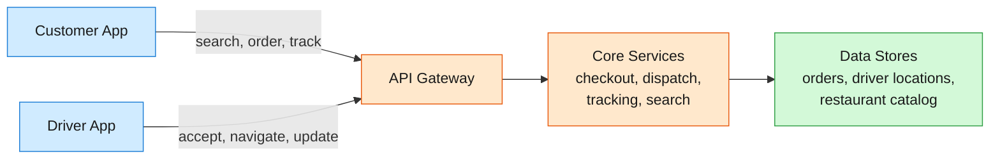
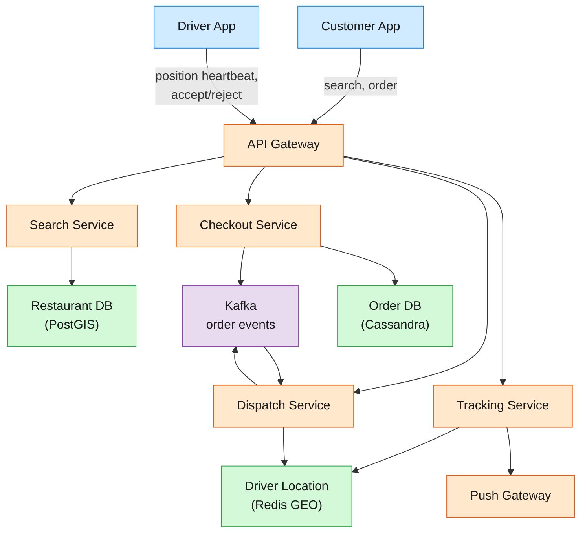
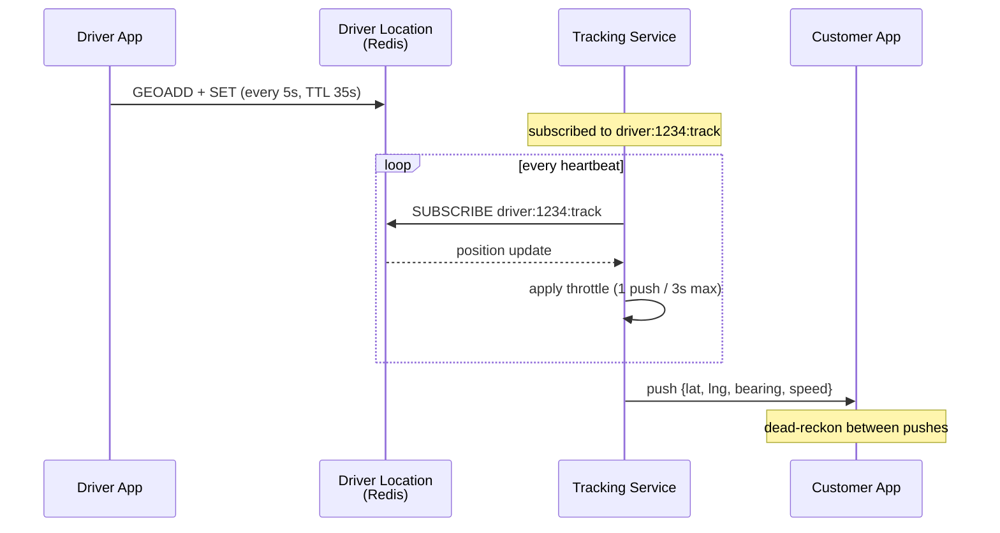

DoorDash and Uber Eats operate a three-sided marketplace: customers order food from restaurants and a driver picks it up and delivers it. Each side runs on i...

<!--more-->

## 1. Problem frame

DoorDash and Uber Eats operate a three-sided marketplace: customers order food from restaurants and a driver picks it up and delivers it. Each side runs on its own clock — a customer expects their burrito in 35 minutes, a restaurant needs 12 minutes to cook it, and a driver is 6 blocks away finishing another drop-off. The system must coordinate these three timelines in real time across millions of concurrent participants, and it must never lose an order mid-flight, because a customer whose dinner vanishes from the app doesn't call support — they open a competitor.



## 2. Requirements

**Functional**

- FR1: Search restaurants and browse menus by location, cuisine, and rating

- FR2: Place an order with items, payment, and delivery address

- FR3: Receive dispatch offers and accept or decline in real time

- FR4: Track driver location and order status from placement through delivery

- FR5: Follow an optimized multi-stop route to restaurant and customer

- FR6: Receive personalized restaurant recommendations

**Non-functional**

- NFR1: Order placement reliability >99.99% — no silently lost orders

- NFR2: Driver position to customer display latency under 3 seconds

- NFR3: Dispatch assigns a driver within 30 seconds of order placement

- NFR4: 99.95% availability; degrade gracefully under 5× normal peak

**Out of scope:** restaurant onboarding and menu management, payment processing details, delivery insurance, customer support, driver background checks.

## 3. Back of the envelope

- **Order peak QPS:** 2.5B orders/year ÷ 31.5M seconds × 5 (peak-to-average) ≈ **400 orders/s** → far exceeds single-DB write throughput; the checkout write path is the bottleneck.

- **Tracking write volume:** 2M concurrent drivers × 1 position update/5s ≈ **400K writes/s** → two orders of magnitude above single-shard write capacity.

- **Order storage:** 2.5B orders × 10 KB ≈ **25 TB/year** → modest; the write path, not storage, constrains the design.

## 4. Entities & API

```sql
Customer {
  id:              uuid        PK
  name:            string
  email:           string
  addresses:       jsonb       ← [{"label":"Home","lat":...,"lng":...}]
  payment_methods: jsonb       ← tokenized; never raw card numbers
  created_at:      timestamp
}

Restaurant {
  id:              uuid        PK
  name:            string
  location:        geo_point   ← lat/lng for spatial proximity queries
  cuisine:         string[]
  status:          enum        ← active, busy, closed, offline
  prep_time_avg:   smallint    ← minutes; denormalized for dispatch scoring
  rating:          decimal(2,1)
}

Order {
  id:              uuid        PK
  customer_id:     uuid        FK
  restaurant_id:   uuid        FK
  driver_id:       uuid?       ← populated when dispatch succeeds
  status:          enum        ← created, preparing, ready, picked_up, delivered
  items:           jsonb       ← snapshot of name, qty, price at order time
  total:           decimal(8,2)
  delivery_address: jsonb      ← snapshot; survives customer address changes
  promised_by:     timestamp   ← ETA shown to customer
  created_at:      timestamp
}

Driver {
  id:              uuid        PK
  name:            string
  status:          enum        ← offline, idle, on_delivery
  rating:          decimal(2,1)
}

DriverPosition {
  driver_id:       uuid        PK
  location:        geo_point   ← current lat/lng
  bearing:         smallint    ← heading in degrees
  speed:           decimal(4,1) ← mph
  updated_at:      timestamp   ← TTL: 30s; stale drivers drop from search
}

```

**API**

- `GET /restaurants?lat=&lng=&radius=&cuisine=` — search nearby restaurants

- `GET /restaurants/{id}/menu` — browse menu items with prices and availability

- `POST /orders` — place an order, returns order_id and initial ETA

- `GET /orders/{id}` — get full order status, driver ETA, and latest position

- `WS wss://tracking.example.com/{order_id}` — real-time driver position stream

- `POST /dispatch/offers/{id}/accept` — driver accepts a dispatch offer

## 5. High-Level Design

The system splits into two lanes: a request/response lane for search, ordering, and status (low throughput, transactional), and a streaming lane for driver positions and dispatch offers (high throughput, latency-sensitive). A shared geo-index powers the spatial queries that both lanes depend on.



#### FR1: Search restaurants and browse menus

**Components:** Search Service, Restaurant DB (PostGIS).

**Flow:**

1. Customer opens app; client sends `GET /restaurants?lat=37.77&lng=-122.42&radius=3`.

1. Search Service queries PostGIS: `SELECT *, ST_Distance(location, ST_MakePoint(lng, lat)) AS dist FROM restaurants WHERE status = 'active' AND ST_DWithin(location, ST_MakePoint(lng, lat), radius * 1609.34) ORDER BY dist LIMIT 50`.

1. Results return with name, cuisine, rating, prep time estimate, and delivery fee.

1. Tapping a restaurant triggers `GET /restaurants/{id}/menu` — served from a read replica, cached in Redis with a 5-minute TTL since menu changes are infrequent.

**Design consideration:** PostGIS spatial indexes (GiST on the location column) make bounding-box queries constant-time for the restaurant catalog. With ~600K restaurants, a single read replica handles search comfortably. The hot path is the real-time driver location index, not the restaurant catalog — that lives in Redis GEO (see DD1) because it updates 400K times per second.

#### FR2: Place an order

**Components:** Checkout Service, Order DB (Cassandra), Kafka.

**Flow:**

1. Customer submits cart + payment method + delivery address via `POST /orders`.

1. Checkout Service validates: restaurant is open and accepting orders, payment method is valid, delivery address is within range.

1. Checkout writes the order to Cassandra with status `created`, keyed by `order_id`.

1. On successful write, Checkout publishes an `OrderCreated` event to Kafka and returns `order_id` + initial ETA to the client.

1. The Kafka event triggers the Dispatch Service to begin driver matching.

**Design consideration:** The checkout is the one write that must never be lost. The old Python/Django monolith had no proper transaction boundaries — orders could vanish between steps. The current design uses a single Cassandra write as the atomic commit point: if that write succeeds, the order exists. If it fails, the client retries with an idempotency key. Kafka publication is fire-and-forget — the order is durable in Cassandra regardless of whether the event publishes on the first attempt.

#### FR3: Dispatch offers to drivers

**Components:** Dispatch Service, Driver Location store (Redis GEO), Kafka.

**Flow:**

1. Dispatch Service consumes `OrderCreated` events from Kafka.

1. Queries Redis GEO for idle drivers within a 3-mile radius of the restaurant: `GEORADIUS driver:locations <lng> <lat> 3 mi ASC`.

1. Scores each candidate: prep time match, driver proximity, acceptance likelihood (see DD3).

1. Solves the assignment as an optimization problem.

1. Pushes an `Offer` to the top-ranked driver's WebSocket connection with order summary and payout.

1. If driver accepts within 30 seconds, Dispatch writes the driver assignment to Cassandra. If declined or timed out, Dispatch re-runs with the next-ranked driver.

**Design consideration:** Dispatch is a latency budget of ~30 seconds per order. Batch processing — grouping orders that arrive within a 5-second window — improves match quality because the optimizer can consider batching (one driver picks up two orders from the same restaurant). The trade-off is that batching adds up to 5 seconds of deliberate delay to the first order in the window, which is acceptable because the restaurant hasn't started cooking yet.

#### FR4: Track driver location and order status

**Components:** Tracking Service, Driver Location store, Push Gateway.

**Flow:**

1. Driver app sends a position heartbeat every 5 seconds.

1. Tracking Service writes to Redis GEO and simultaneously updates the driver's in-memory position for active subscribers.

1. Customer app connects via `WS wss://tracking.example.com/{order_id}`. The Tracking Service resolves the order to its assigned driver, subscribes to that driver's position channel, and begins forwarding updates.

1. When the driver marks the order as picked up, the Tracking Service updates order status in Cassandra and pushes a status-change event over the WebSocket.

1. Positions are stored with a 35-second TTL in Redis — if a driver's app crashes, their position disappears and the Dispatch Service stops offering them orders.

**Design consideration:** Customer-facing position updates don't need the full 5-second resolution. The Tracking Service throttles WebSocket pushes to one update per 3 seconds, applying dead-reckoning between samples: the receiver interpolates the driver's current position from the last known location, bearing, and speed.

#### FR5: Multi-stop routing

**Components:** Routing Engine (embedded in Dispatch), third-party map provider.

**Flow:**

1. When a driver accepts an offer, the Routing Engine requests a route: driver's current location → restaurant → customer.

1. For batched orders, the route includes two restaurants and two customers, sequenced to minimize total drive time.

1. The Routing Engine solves this as a traveling-salesman variant using ruin-and-recreate.

1. Turn-by-turn directions stream to the driver's navigation app.

**Design consideration:** The routing problem is NP-hard, but at per-order scale (2–4 stops), ruin-and-recreate converges in under a second. The Routing Engine runs multithreaded: large drive-only orders (10+ stops) are split into chunks solved concurrently.

#### FR6: Personalized recommendations

**Components:** Recommendation Service, Feature Store (Redis), ML Model Serving.

**Flow:**

1. On app open, the client requests `GET /recommendations?lat=&lng=`.

1. Recommendation Service fetches user features and restaurant features from the Feature Store.

1. A graph neural network model scores candidate restaurants.

1. Results are ranked and filtered to the customer's delivery radius, then returned.

**Design consideration:** Recommendations are pre-computed in batch for most users and served from a cache. Real-time inference runs only for active-session users, keeping inference QPS manageable.

## 6. Deep dives

### DD1: Geo-indexing for nearby search

**Problem.** Two different spatial queries with opposing requirements: the restaurant catalog is ~600K records, slowly changing, queried at ~50K QPS; driver locations are ~2M records, updating at 400K writes/s, queried at ~400 QPS. One index cannot serve both.

**Approach 1: Single relational geo-index for both**

Store both restaurants and driver locations in PostGIS with GiST indexes, updating driver positions as SQL UPDATEs.

- **Pro:** Simple — one technology, one operational surface.

- **Con:** 400K row updates per second on a relational table is a heavy write load even with partitioning. Vacuum and index maintenance become a full-time job. The dispatch query contends with 400K writes/s for the same index pages.

**Approach 2: Redis GEO for drivers, PostGIS for restaurants**

Driver positions live entirely in Redis as `GEOADD driver:locations <lng> <lat> <driver_id>`. Restaurants stay in PostGIS. Dispatch queries Redis with `GEORADIUS`, which computes distance on sorted-set lookups.

- **Pro:** Redis GEO is an in-memory sorted set; `GEORADIUS` with a 3-mile radius resolves in under a millisecond. Writes are single `GEOADD` commands with no locking overhead. The restaurant catalog stays in PostGIS where rich filtering is natural.

- **Con:** Two geo subsystems to operate. Driver position data is ephemeral — if Redis restarts without persistence, all positions are lost until the next heartbeat cycle.

**Approach 3: S2 cell hierarchy for both**

Encode every lat/lng into an S2 cell ID at multiple resolution levels. Store both datasets in a key-value store keyed by S2 cell.

- **Pro:** Uniform interface. S2 cells tessellate the sphere evenly. Cell-based prefix scans in any ordered KV store are fast.

- **Con:** Operational overhead of maintaining the cell hierarchy. Redis GEO already implements this internally with 52-bit Geohash.

**Decision:** Approach 2 — Redis GEO for the hot driver location path, PostGIS for the restaurant catalog.

**Rationale:** The driver location workload is the hard problem. 400K writes/s on a relational table creates a noisy-neighbor problem where the dispatch SELECT and the tracking UPDATE contend for the same index pages. Separating them into an in-memory geo-index for the write-heavy dataset and a disk-backed spatial index for the read-heavy dataset means each gets the storage engine that matches its access pattern. The same split is used in production delivery systems — a fast ephemeral index for active drivers and a durable catalog for places.

**Edge cases:**

- **Redis failure recovery:** A Redis node crash loses all driver positions in that shard. Drivers heartbeat every 5 seconds, so positions repopulate within one heartbeat cycle. During the gap, Dispatch excludes drivers in the affected shard from candidate generation.

- **Geo-fencing at city boundaries:** A driver 3.1 miles away in a neighboring city won't appear in a 3-mile radius query. Dispatch widens the radius in 0.5-mile increments if the initial query returns fewer than 5 candidates, up to a 10-mile cap.

- **Dense urban areas:** A 3-mile radius in Manhattan returns hundreds of idle drivers. `GEORADIUS` with `COUNT 50` limits results, and the ML scoring layer filters further.

> [!TIP]
> Redis GEO uses a 52-bit Geohash internally — the same algorithm as S2 but implemented as a ZSET. The sorted-set skiplist gives O(log N) range queries with no spatial index build step. A single `GEOADD` is just a `ZADD` under the hood, which is why it handles 400K writes/s on modest hardware.

### DD2: Real-time tracking pipeline

**Problem.** 2 million drivers each send a position update every 5 seconds. That is 400,000 writes per second. For a customer watching their driver approach, the system must turn those writes into a visual position on a map with under 3 seconds of end-to-end latency.

**Approach 1: Polling from the client**

Customer app calls `GET /orders/{id}/position` on a 2-second interval.

- **Pro:** Simple REST endpoint. No persistent connection state.

- **Con:** Read amplification. At 2M active deliveries, 1M polling customers generate 500K QPS of position reads. Wastes bandwidth on unchanged positions.

**Approach 2: WebSocket push per order**

Customer opens a WebSocket. The Tracking Service subscribes to the assigned driver's position channel.

- **Pro:** Push model eliminates polling reads. Latency drops to one hop.

- **Con:** Connection state per watcher. At 2M concurrent watchers, the Tracking Service holds 2M open WebSocket connections. A single driver with 3 watchers triggers 3 pushes per heartbeat.

**Approach 3: Pub/sub with dead-reckoning and throttling**

The Tracking Service maintains a pub/sub channel per driver. Customers subscribe via their WebSocket. On each driver heartbeat, the server pushes to all subscribers — but throttles to one push per 3 seconds regardless of heartbeat frequency. Between pushes, the customer app runs dead-reckoning: it animates the marker from the last known position toward the last known bearing at the last known speed.

- **Pro:** Throttling caps per-driver push rate at 20/min regardless of subscribers. Dead-reckoning makes 3-second updates feel continuous.

- **Con:** Dead-reckoning errors accumulate if a driver turns. At city speeds (25 mph), the maximum error between updates is ~110 feet — visually acceptable on a phone map.

**Decision:** Approach 3 — WebSocket pub/sub with throttled push and client-side dead-reckoning.

**Rationale:** Polling is a non-starter at this scale. Straight WebSocket push without throttling burns server CPU on redundant pushes (a driver at a red light sends 12 identical heartbeats per minute). Throttling cuts push volume by 60% with no perceptible quality loss because dead-reckoning fills the gaps.

**Edge cases:**

- **Driver enters a tunnel:** Heartbeats stop. After 30 seconds without a heartbeat, the server pushes a "location unavailable" status.

- **Driver switches apps mid-delivery:** Same tunnel behavior. The dispatch system sees the driver disappear from Redis GEO and stops offering new orders while preserving the current assignment.

- **WebSocket reconnection:** The customer switches from Wi-Fi to cellular. The client reconnects and re-subscribes. The server replays the most recent position immediately.



> [!NOTE]
> Dead-reckoning quality depends on a bearing field. A driver heading north at 30 mph on a straight avenue looks smooth. A driver zigzagging through a parking lot does not — but parking lot speeds are low enough (5 mph) that the 110-foot maximum error shrinks to ~20 feet, below the noise floor of consumer GPS.

### DD3: Dispatch optimization

**Problem.** An order arrives. The naive solution — assign the nearest idle driver — ignores three hard realities: the nearest driver might be finishing a delivery, the restaurant takes 15 minutes to cook, and that driver historically declines 40% of offers from this restaurant.

**Approach 1: Nearest-idle assignment**

Query Redis GEO for the closest idle driver. Offer the order. If declined, move to the second-closest.

- **Pro:** O(1) per order. Simple.

- **Con:** No consideration of prep time. No batching — two orders from the same restaurant go to different drivers. Acceptance rate ignored.

**Approach 2: Scoring with greedy assignment**

Rate every driver-order pair on predicted total delivery time and assign greedily.

- **Pro:** Accounts for prep time. A driver arriving exactly when food is ready scores higher than a driver who will wait 14 minutes.

- **Con:** Cannot optimize across orders — two orders at the same restaurant might be batched but greedy misses that.

**Approach 3: ML-scored mixed-integer program**

A three-layer pipeline: (1) candidate generator queries Redis GEO for idle drivers; (2) an ML layer predicts prep time, travel time, and acceptance likelihood; (3) an optimization layer formulates the assignment as a MIP solved with an off-the-shelf solver.

- **Pro:** Global optimization across orders. Batch decisions, strategic delay, and ML predictions are all modeled.

- **Con:** Solving a MIP with tens of thousands of variables requires a commercial solver. If it doesn't converge within 5 seconds, fall back to greedy.

**Decision:** Approach 3 — ML-scored MIP with a greedy fallback timeout.

**Rationale:** At 400 peak orders/second, the difference between greedy and global optimization is measured in percentage points of on-time rate — and each percentage point is tens of thousands of refunded orders per day. The MIP runs in a 5-second window. The architecture uses an MIP solver with ML feature inputs from a dedicated feature store, running in a continuous batch loop rather than per-order.

**Edge cases:**

- **Solver timeout:** Orders with feasible assignments from the partial solution get those assignments; remaining orders fall back to greedy scoring.

- **Cold-start for new drivers:** The ML model imputes a population mean for acceptance likelihood with a cold-start penalty that decays over the first 20 offers.

- **Restaurant marks order ready early:** Dispatch re-runs the MIP for any driver still en route.

> [!TIP]
> The dispatch loop runs on a fixed cadence — every 5 seconds — not per order. All orders that arrived since the last cycle enter the MIP together. This batching is what makes global optimization tractable.

> [!WARNING]
> The MIP solver is a single point of congestion per metro area. If it crashes, that area falls back to greedy assignment until restart. Running a hot standby solver minimizes the degradation window.

### DD4: ETA prediction and demand balancing

**Problem.** When a customer places an order, the app shows a promised delivery time. Quote too high and they bail; quote too low and they complain. Late deliveries are roughly 3× worse than early ones. The system must produce accurate ETAs across millions of orders with wildly different characteristics.

**Approach 1: Distance-based heuristic**

ETA = fixed prep time per cuisine + distance / average speed.

- **Pro:** Trivial to compute.

- **Con:** Ignores restaurant load, traffic, parking difficulty, and driver availability. Performs acceptably on the median — terribly on the tail.

**Approach 2: ML regression with point estimates**

Train a gradient-boosted tree model on historical order data.

- **Pro:** Captures non-linear interactions (Friday 7 PM + rain + sushi place = 52 minutes).

- **Con:** Point estimates have no confidence interval. The asymmetric loss (late is 3× worse than early) is hard to tune into a single-point model.

**Approach 3: Multi-task deep learning with probabilistic output**

A neural network with a shared foundation and per-task heads, each outputting a log-normal distribution. The loss function uses asymmetric MSE: early errors weight 1, late errors weight 3.

- **Pro:** Distribution output lets dispatch reason probabilistically. Multi-task architecture shares representations across tasks. Asymmetric loss directly encodes the business cost function.

- **Con:** Training pipeline complexity, higher inference latency requiring dedicated GPU serving.

**Decision:** Approach 3 — multi-task probabilistic model with asymmetric loss.

**Rationale:** At 2.5 billion orders per year, each percentage point of ETA accuracy is worth tens of millions. The probabilistic model explicitly optimizes for tail accuracy by penalizing late predictions 3× harder. Rolling real-time features capture emergent conditions without needing explicit data feeds.

**Edge cases:**

- **New restaurant with no history:** The model imputes prep time from cuisine-level priors with wide variance. The first 20 orders get a "learning" flag that suppresses the promised-time display.

- **Model drift during demand shocks:** Rolling features capture the shift within one window cycle. A drift monitor triggers a model refresh if the gap exceeds a threshold for 15 consecutive minutes.

- **Long-tail event handling:** For orders where the predicted 95th percentile exceeds the quoted window by 5+ minutes, the system proactively sends a push notification.

> [!TIP]
> Why not use the map provider's ETA API? Map ETAs are drive-time only — they don't include prep time, parking, or the time a Dasher spends walking to a 14th-floor apartment. A delivery ETA is a composition of 6+ sub-events, each with its own distribution.

> [!TIP]
> Why not a single end-to-end model instead of multi-task? Breaking out prep time, drive time, and total time as separate heads lets the dispatch optimizer use each component independently. A single total-time model can't surface a driver who is 2 minutes away but food won't be ready for 12 minutes.

## 7. Trade-offs

| Decision | Options | Choice | Why |
| --- | --- | --- | --- |
| Order durability | Synchronous dual-write vs Cassandra atomic write + async Kafka | Cassandra write as commit point | One write that either succeeds or fails. Kafka is async; a periodic scanner re-publishes unassigned orders. |
| Driver location store | PostGIS vs Redis GEO vs S2 custom index | Redis GEO | 400K writes/s demands an in-memory sorted-set. Redis GEO handles spatial queries in O(log N). PostGIS is right for the restaurant catalog. |
| Dispatch strategy | Per-order greedy vs batch MIP | Batch MIP with greedy fallback | Global optimization improves on-time rate by 5–8 percentage points. 5-second batch window prevents unbounded latency. |
| Tracking push frequency | Per-heartbeat vs throttled vs polling | Throttled push with dead-reckoning | Cuts push volume 60% without visible quality loss. 3-second gap at city speeds produces ~110-foot max error. |
| ETA model complexity | Heuristic vs point-estimate ML vs probabilistic DL | Probabilistic multi-task DL | Tail accuracy matters at 2.5B orders/year. Asymmetric loss encodes business cost. Distribution output feeds dispatch. |
| Geo-sharding scheme | City-based vs S2 cell-based vs consistent hash | S2 cell hierarchy | City boundaries are political, not geometric. S2 cells at level 8 partition uniformly; radius queries span at most 4 shards. |
| Consistency model | Strong vs eventual | Eventual with idempotency keys | Positions are stale after 5s by definition. Order placement uses idempotency keys for exactly-once semantics. |

## 8. References

1. [Building a More Reliable Checkout Service at Scale with Kotlin](https://doordash.engineering/2021/02/02/building-a-more-reliable-checkout-service-with-kotlin/) — DoorDash Engineering Blog (Feb 2021)

1. [Using ML and Optimization to Solve DoorDash's Dispatch Problem](https://doordash.engineering/2021/08/17/using-ml-and-optimization-to-solve-doordashs-dispatch-problem/) — DoorDash Engineering Blog (Aug 2021)

1. [Improving ETAs with Multi-Task Models, Deep Learning, and Probabilistic Forecasts](https://careersatdoordash.com/blog/improving-etas-with-multi-task-models-deep-learning-and-probabilistic-forecasts/) — DoorDash Engineering Blog (Mar 2024)

1. [Precision in Motion: Deep Learning for Smarter ETA Predictions](https://careersatdoordash.com/blog/deep-learning-for-smarter-eta-predictions/) — DoorDash Engineering Blog (Oct 2024)

1. [Scaling a Routing Algorithm Using Multithreading and Ruin-and-Recreate](https://doordash.engineering/2021/11/30/scaling-a-routing-algorithm-using-multithreading-and-ruin-and-recreate/) — DoorDash Engineering Blog (Nov 2021)

1. [Managing Supply and Demand Balance Through Machine Learning](https://doordash.engineering/2021/06/29/managing-supply-and-demand-balance-through-machine-learning/) — DoorDash Engineering Blog (Jun 2021)

1. [Building a Gigascale ML Feature Store with Redis](https://doordash.engineering/2020/11/19/building-a-gigascale-ml-feature-store-with-redis/) — DoorDash Engineering Blog (Nov 2020)

1. [Building a Declarative Real-Time Feature Engineering Framework](https://doordash.engineering/2021/03/04/building-a-declarative-real-time-feature-engineering-framework/) — DoorDash Engineering Blog (Mar 2021)

1. [How DoorDash Transitioned from a Monolith to a Microservice Architecture](https://doordash.engineering/2020/12/02/how-doordash-transitioned-from-a-monolith-to-microservices/) — DoorDash Engineering Blog (Dec 2020)
