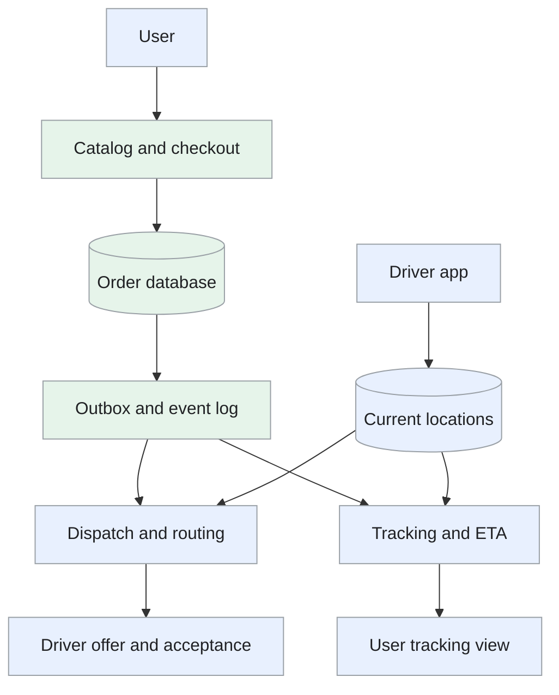
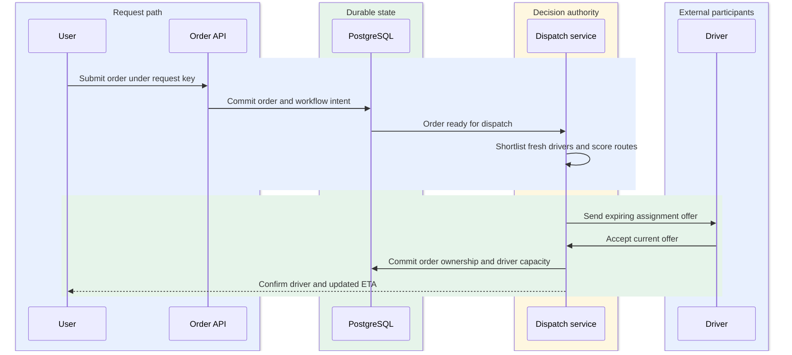
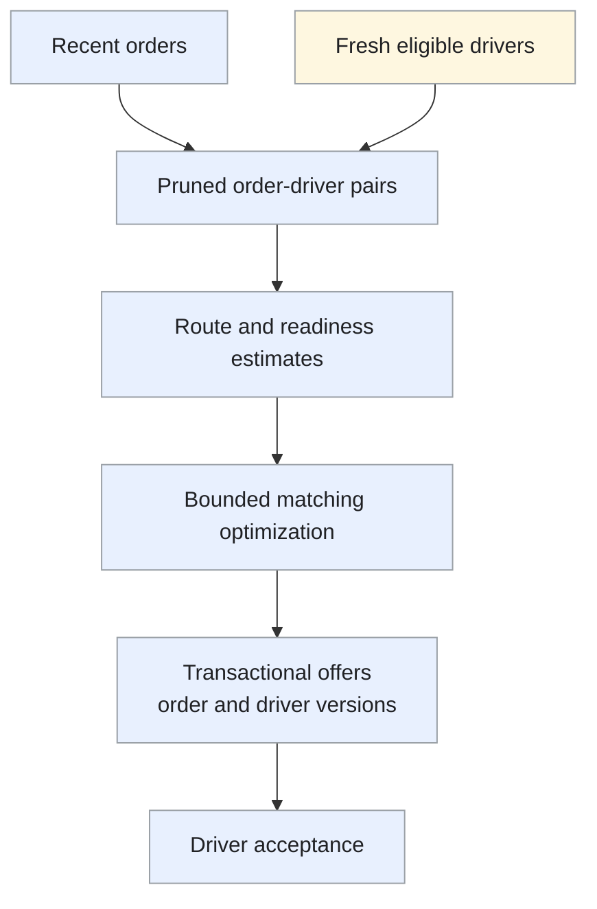

Design of a food-delivery marketplace covering restaurant discovery, checkout, driver assignment and live order tracking.

<!--more-->

## Problem

A user chooses a restaurant, places an order and expects the food to arrive within the promised time. The restaurant needs a clear preparation request, while a driver needs a feasible pickup and delivery route.

These activities overlap. A restaurant may finish cooking before a driver arrives, several orders may compete for the same driver, and mobile location updates can arrive late. The system keeps the order state durable and coordinates dispatch using current availability and estimated travel times.

## Requirements

### Functional requirements

- **Find restaurants:** search nearby open restaurants, view menus and receive personalized recommendations.
- **Place an order:** confirm items, prices and delivery address; authorize payment and send the order to the restaurant.
- **Assign a driver:** offer deliveries to eligible drivers and confirm one assignment per order.
- **Track delivery:** show order progress, driver location and an updated arrival estimate.
- **Plan routes:** combine compatible deliveries while respecting pickup-before-drop-off and delivery deadlines.
- **Handle cancellations:** update the order, payment and delivery assignment consistently.

### Non-functional requirements

Design targets:

- **Scale:** 2.5B orders/year, about 400 order creations/s at peak; 2M active drivers reporting location every five seconds.
- **Availability:** 99.95% for checkout and order tracking.
- **Durability:** every acknowledged order remains recoverable; retries preserve the original order and payment attempt.
- **Freshness:** accepted GPS updates appear in tracking within three seconds at p99; show the last update time.
- **Dispatch:** target assignment within 30 seconds when suitable drivers are available.
- **Security:** authorize access by order role and retain precise locations only for their defined operational purpose.

Grocery substitutions and long-distance shipping are outside this design.

## Back-of-the-envelope calculations

- **Orders:** 2.5B / 31.5M seconds ≈ 79/s average; a 5× burst gives about 400/s.
- **Location updates:** 2M / 5 seconds = 400K updates/s. At 100 bytes/update, payload ingestion is about 40MB/s before protocol and replication overhead.
- **Current locations:** 2M × 200 bytes ≈ 400MB of logical position records, plus geospatial indexes and Redis overhead.
- **Tracking fan-out:** accepted update rate × active viewers per order. Count connections and bytes separately from location ingestion.

Order transactions and location updates have very different workloads, so they use separate storage and scaling paths.

## Core entities

- **Order:** the purchased items, price snapshot, delivery address and current lifecycle state.
- **Restaurant:** menu, service area, opening state and preparation-time signals.
- **Driver:** availability, current position and accepted delivery work.
- **Assignment:** the confirmed relationship between an order and a driver.

```protobuf
message Order {
  string order_id;
  string user_id;
  string restaurant_id;
  repeated OrderItem items;
  int64 total_minor_units;          // Currency stored separately
  string delivery_address;
  string status;                   // Accepted, preparing, picked_up, delivered, cancelled
  string assignment_id;
  Timestamp created_at;
  int64 version;                   // Preconditions for state transitions
}

message OrderItem {
  string menu_item_id;
  int32 quantity;
  int64 unit_price_minor_units;     // Checkout snapshot
}

message DriverPosition {
  string driver_id;
  double latitude;
  double longitude;
  Timestamp observed_at;
  int64 sequence;                   // Reject older position updates
  string availability;
}

message Assignment {
  string assignment_id;
  string order_id;
  string driver_id;
  string status;                   // Offered, accepted, expired, completed
  Timestamp offer_expires_at;
}
```

Payment details remain with the payment provider; orders store provider references rather than card data.

## API

```yaml
GET /v1/restaurants:
  query: {latitude: number, longitude: number, cuisine: string, cursor: string}
  response: {restaurants: array, next_cursor: string}

POST /v1/orders:
  headers: {Idempotency-Key: checkout-attempt}
  body: {restaurant_id: string, items: array, address_id: string, payment_token: string}
  response: {order_id: string, status: string, estimated_arrival: timestamp}

POST /v1/assignments/{assignment_id}/accept:
  body: {driver_id: string, offer_version: integer}
  response: {order_id: string, route: array}
  errors: [409 offer_expired_or_already_assigned]

POST /v1/drivers/me/positions:
  body: {latitude: number, longitude: number, observed_at: timestamp, sequence: integer}

GET /v1/orders/{order_id}:
  response: {status: string, driver_position: object, position_updated_at: timestamp, eta: timestamp}

WebSocket /v1/orders/{order_id}/tracking:
  events: [order_status, driver_position, eta_update]
```

## High-level design

Checkout commits the order and its outgoing event together. Dispatch consumes accepted orders and current driver availability. Tracking combines durable order changes with recent positions.


```mermaid
flowchart TB
    U["User"] --> C["Catalog and checkout"]
    C --> O[("Order database")]
    O --> E["Outbox and event log"]
    E --> D["Dispatch and routing"]
    P["Driver app"] --> L[("Current locations")]
    L --> D
    D --> A["Driver offer and acceptance"]
    E --> T["Tracking and ETA"]
    L --> T
    T --> V["User tracking view"]
  classDef request fill:#e8f0fe,stroke:#9aa0a6,color:#202124,stroke-width:1px
  classDef background fill:#e6f4ea,stroke:#9aa0a6,color:#202124,stroke-width:1px
  classDef control fill:#fef7e0,stroke:#9aa0a6,color:#202124,stroke-width:1px
  class U,D,P,L,A,T,V request
  class C,O,E background
```

## Storage

- **[PostgreSQL](/designs/tech-postgresql/):** orders, price snapshots, idempotency records and assignments need transactions, unique constraints and conditional state changes. An order update and its outbox row commit in the same transaction. Partition historical orders as retention grows; 400 creates/s alone is not a reason to discard transactional storage.
- **PostgreSQL with PostGIS:** restaurant coordinates and service areas support indexed distance and containment queries. [ST_DWithin](https://postgis.net/docs/ST_DWithin.html) accepts meters for geography values and can use a spatial index.
- **[Redis](/designs/tech-redis/):** recent driver positions and city-level geospatial indexes support frequent updates and nearby-driver queries. [GEOSEARCH](https://redis.io/docs/latest/commands/geosearch/) finds candidates within a radius; application-level freshness checks exclude stale positions. A cleanup job removes expired members from the geo index.
- **[Kafka](/designs/tech-kafka/):** durable order and location events support dispatch, tracking and feature updates. Order IDs provide ordering for order changes; driver IDs provide ordering for position streams.
- **Object storage and analytical tables:** retained events and delivery outcomes support offline ETA training and operational analysis with restricted location access.

A tracking connection reads a current snapshot after reconnecting. Redis pub/sub updates improve responsiveness; durable order state provides recovery.

## From request to response

### One end-to-end request

An order becomes dispatchable after its durable checkout and restaurant state are recorded.


```mermaid
sequenceDiagram
  box rgb(232,240,254) Request path
    participant U as User
    participant A as Order API
  end
  box rgb(230,244,234) Durable state
    participant D as PostgreSQL
  end
  box rgb(254,247,224) Decision authority
    participant W as Dispatch service
  end
  box rgb(232,240,254) External participants
    participant C as Driver
  end
  rect rgb(232,240,254)
    U->>A: Submit order under request key
    A->>D: Commit order and workflow intent
    D->>W: Order ready for dispatch
    W->>W: Shortlist fresh drivers and score routes
  end
  rect rgb(230,244,234)
    W->>C: Send expiring assignment offer
    C->>W: Accept current offer
    W->>D: Commit order ownership and driver capacity
    W-->>U: Confirm driver and updated ETA
  end
```

The location index supplies candidates; only an assignment transaction can reserve driver capacity and confirm an accepted offer.

### Finding a restaurant

The catalog service searches within the delivery area, filters closed or unavailable restaurants and returns menus and availability. A ranker orders eligible restaurants using user preferences, expected arrival time and current service capacity.

Cache restaurant details separately from availability. A cached menu improves browsing latency, while checkout revalidates item availability and prices.

### Placing an order

The checkout service validates the cart and address, reserves an idempotency key and creates a pending order. It authorizes payment through the provider with a stable payment-attempt ID, then records the accepted order and restaurant-notification event.

If authorization succeeds but the response is lost, reconciliation checks the same provider reference before retrying. Restaurant rejection or cancellation triggers a recorded compensation, such as releasing an authorization. Workers retry each step using the order and event IDs.

### Assigning a driver

Dispatch searches nearby available drivers, rejects stale positions and scores feasible order/driver pairs. The service sends a time-limited offer. Acceptance commits only while the offer is current and the order and driver remain eligible.

Competing acceptances use database preconditions and uniqueness constraints. One assignment succeeds; another request receives a conflict and refreshed availability. A driver can carry multiple orders only when the accepted route satisfies capacity and deadline rules.

### Tracking a delivery

The driver app reports timestamped positions. Ingestion accepts newer sequence numbers, updates the current-position store and publishes an update to the order's tracking channel. The user receives the position, freshness timestamp and revised ETA.

Five-second reporting already limits how current the map can be. The three-second target covers processing after an update reaches the service. During a mobile disconnect, the map shows the last known position and its age.

### Planning a combined route

The router evaluates inserting a pickup and drop-off into an existing route. It preserves pickup-before-delivery, capacity and each order's promised arrival window. It returns the best feasible route within a bounded compute deadline.

Checking every possible route becomes expensive as orders accumulate. Candidate pruning and bounded optimization are covered below.

## Deep dives

### How do we assign drivers without delaying other orders?

Independent nearest-driver decisions can assign a scarce driver to an easy order while leaving another order with no feasible pickup.

- **Nearest available driver:** choose the closest eligible position. Candidate selection is fast, but straight-line distance ignores restaurant readiness, accepted routes and another order's limited choices.
- **Greedy pair scoring:** rank each order/driver pair using pickup and lateness estimates, then take feasible pairs one at a time. It adds useful prediction signals cheaply, but an early choice can consume the only driver for a harder order.
- **Bounded batch optimization:** compare recent orders and eligible drivers together under capacity and offer constraints. Scarce drivers can be allocated across competing orders; solver time and prediction error require a deadline and a feasible fallback.

**Recommendation.** Small city-level batches fit a marketplace with competing simultaneous orders. We accept a short dispatch wait and bounded solver cost to improve collective assignments, while greedy fallback prevents optimization from consuming the response budget.

Use a short dispatch interval, prune distant pairs and estimate pickup time, lateness risk and added route distance. The optimizer selects compatible assignments subject to driver capacity and offer state. Offers become final only through the assignment transaction.

[DoorDash's dispatch design](https://careersatdoordash.com/blog/using-ml-and-optimization-to-solve-doordashs-dispatch-problem/) combines prediction and optimization. This proposal uses the same separation: models estimate outcomes; an optimizer selects feasible assignments.

If the optimizer times out, use its best feasible result or the greedy fallback. Re-run expired offers with refreshed driver state.

**One dispatch batch from candidates to accepted work**

Build a bipartite graph: recent unassigned orders on one side, eligible drivers on the other. First prune by service area, stale location, driver capacity and whether pickup/delivery windows can still be met. Compute route/restaurant-readiness estimates only for surviving edges.

An edge cost combines expected pickup wait, delivery lateness and added travel under explicit weights. The optimizer chooses a feasible set of edges before its deadline. Model predictions supply costs; assignment constraints supply correctness.


```mermaid
flowchart TB
    O["Recent orders"] --> C["Pruned order-driver pairs"]
    D["Fresh eligible drivers"] --> C
    C --> E["Route and readiness estimates"]
    E --> M["Bounded matching optimization"]
    M --> T["Transactional offers<br>order and driver versions"]
    T --> A["Driver acceptance"]
  classDef request fill:#e8f0fe,stroke:#9aa0a6,color:#202124,stroke-width:1px
  classDef background fill:#e6f4ea,stroke:#9aa0a6,color:#202124,stroke-width:1px
  classDef control fill:#fef7e0,stroke:#9aa0a6,color:#202124,stroke-width:1px
  class O,C,E,M,T,A request
  class D control
```

Suppose driver A can serve orders X or Y, while driver B can serve only X. Greedily giving X to A strands Y; selecting B-X and A-Y serves both. This is why pair scoring alone is not the final decision.

Persist offers with expiry and expected order/driver versions. Acceptance conditionally claims the actual assignment; stale optimizer output is rejected and the order re-enters dispatch. Optimizer timeout returns its best feasible solution or the bounded greedy fallback, never a partially committed set of conflicting assignments.

### How do we search fresh driver positions at high write rates?

Putting every GPS update in the order database would add a large write workload unrelated to checkout.

- **Relational location history:** persist every update with queryable indexes. Durable audit and historical queries are straightforward, but frequent GPS writes compete with checkout and assignment transactions.
- **Global in-memory geo index:** update one searchable location space. Radius lookup is simple, but hot cities concentrate writes and broad searches create a shared capacity bottleneck.
- **Regional geo indexes:** route updates by city/cell and search neighboring partitions near boundaries. Live work scales geographically; crossing drivers, duplicate boundary results and stale membership need explicit version/freshness handling.

**Recommendation.** Regional indexes fit dispatch queries that are naturally local and GPS state that can be refreshed by heartbeats. We accept temporary coverage reduction after cache loss and rebuild from fresh positions; accepted order/driver ownership remains durable.

Keep coordinates, observation time and sequence together. The geospatial index provides candidates; the position record provides the freshness check. An expired driver record must also be removed from the geo index because a geo member has no independent key TTL.

Redis loss temporarily reduces dispatch coverage. Rebuild from fresh driver heartbeats and retained recent events; accepted assignments remain in PostgreSQL.

**Publish a location safely to the candidate index**

The driver stream carries a monotonic session epoch and sequence alongside coordinates and observation time. Ignore older updates after a new session takes ownership. Route by city/cell; update the location record and its geo membership using a shard-local atomic operation where colocated.

A radius query returns possible drivers, then the dispatch service reads their records and rejects stale or unavailable entries. Near a partition boundary, query neighboring cells and deduplicate driver IDs. Straight-line distance is a shortlist signal; road-network travel time determines the final cost.

```text
GPS update → epoch/sequence check → regional geo index
Nearby IDs → freshness/availability check → road ETA shortlist
```

Moving across cells removes the old membership with a version guard so a late removal cannot erase the new one. Cleanup removes expired members from the geo set; key TTL on a separate record does not do that automatically. Rebuild after Redis loss from fresh heartbeats/recent retained events and throttle dispatch while coverage recovers.

### How do we give an ETA that reflects uncertainty?

Cooking, driver arrival and travel can overlap. Adding independent component averages can hide long waits, and adding component p90 values does not generally produce the route's p90.

- **Distance and historical averages:** estimate travel from route length and typical stage times. This is cheap and interpretable, but restaurant queues and changing demand make its error uneven.
- **Gradient-boosted quantile models:** learn tabular route, restaurant and stage features and predict arrival intervals. They provide a measurable baseline at bounded serving cost; calibration drifts by city and stage and component quantiles cannot simply be added.
- **Shared probabilistic model:** jointly model related delivery outcomes across stages or tasks. It can share sparse signals and capture dependencies, but training, serving and calibration become more complex and require stronger evidence.

**Recommendation.** Start with component-aware gradient-boosted predictions and an end-to-end arrival model. This is a bounded-serving-cost baseline for tabular restaurant, route and order-stage features. We accept periodic recalibration and imperfect tails; a shared probabilistic model must improve cohort-level coverage and lateness within the serving budget.

Measure absolute error, late-arrival rate and interval coverage by city, restaurant and order stage. Promote the shared model when it improves those outcomes within the latency budget.

[DoorDash's probabilistic ETA work](https://careersatdoordash.com/blog/improving-etas-with-multi-task-models-deep-learning-and-probabilistic-forecasts/) separates the arrival distribution from the business decision about what time to display. Apply that separation here: dispatch needs expected route cost and lateness risk, while the user needs a realistic arrival window.

Store feature and model versions with each prediction. Training joins features available at prediction time to completed-delivery outcomes.

**Account for overlap before predicting arrival**

For a readying restaurant and an approaching driver, pickup begins at the later of their completion times. A useful baseline is `max(food_ready_time, driver_arrival_time)`, followed by handoff and delivery travel. Simply summing preparation and driver travel overstates the wait when they overlap.

```text
Food preparation -----------|
Driver approach ------|     | pickup/handoff → delivery travel
                      later ready stage determines pickup start
```

Train the end-to-end output against completed delivery outcomes using features available at each order stage. Record whether the restaurant accepted, preparation started or pickup completed; one model can then condition on the remaining work rather than repeatedly predicting already completed time.

Component distributions are correlated during demand spikes. Adding component P90s gives no general end-to-end P90 guarantee. Use joint/end-to-end quantile outputs or a validated simulation of stage dependence, then calibrate interval coverage by city/restaurant/stage. Dispatch consumes expected cost and lateness risk; the displayed window uses the product's separately chosen percentile policy.

### How do combined routes remain practical?

Exhaustive route enumeration grows rapidly with the number of stops.

- **First feasible insertion:** place new pickup/drop-off stops at the first valid positions. Computation is small, but a feasible route can still add unnecessary travel or food waiting.
- **Exact global optimization:** search every allowed route combination. It finds the optimum under the supplied model, but runtime grows rapidly and predictions may change before that optimum is usable.
- **Bounded insertion with local improvement:** enumerate a shortlist, retain the best feasible route and improve it until the compute deadline. Runtime is controlled and commitments are preserved; the selected route may be locally rather than globally optimal.

**Recommendation.** Bounded insertion fits continuously changing routes where a timely feasible plan is more useful than a late global optimum. We accept suboptimality under the deadline and replan only remaining actions as better traffic and readiness information arrives.

Score added travel, food waiting time and missed delivery windows. Keep the best feasible route throughout the search. If traffic changes or a pickup is delayed, replan the remaining stops while preserving completed actions and accepted work.

**Insert stops while preserving precedence**

A new order adds a pickup and a drop-off. Enumerate a bounded set of insertion positions in the driver's remaining route, requiring pickup before its drop-off and retaining already accepted commitments. Recalculate affected leg times and time-window slack.

Reject candidates exceeding capacity, food waiting or lateness limits. Keep the lowest-cost feasible route as the search evaluates local swaps or different insertions.

```text
Existing: pickup A → drop A
Candidate: pickup A → pickup B → drop B → drop A
Checks: capacity, pickup readiness, precedence, both delivery windows
```

Version the route proposal. Driver acceptance checks that the current route/assignment version still matches; otherwise recalculate. Replanning after a delay considers only remaining stops and preserves completed actions. A bounded search may not find the mathematical optimum, but its deadline and feasible-so-far result make its operational behavior predictable.
