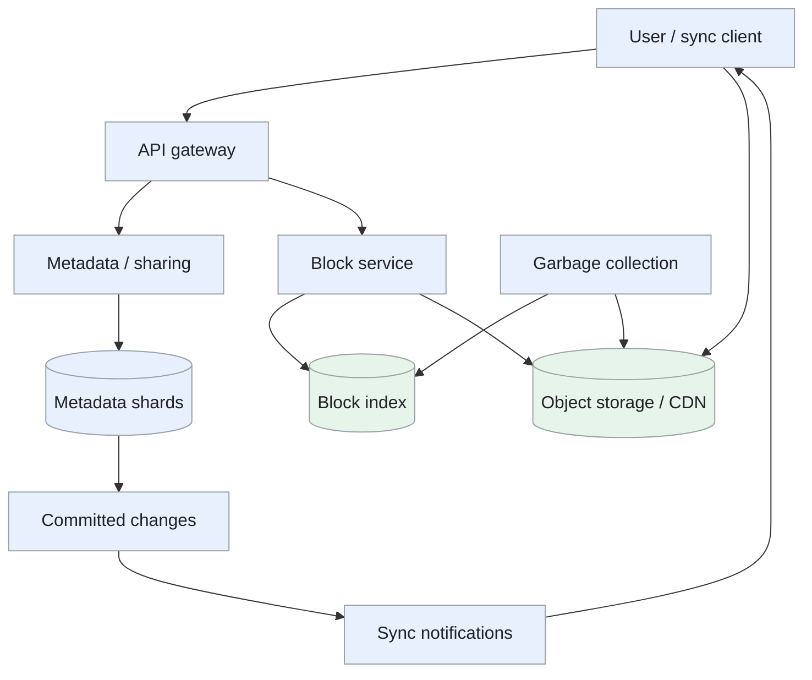
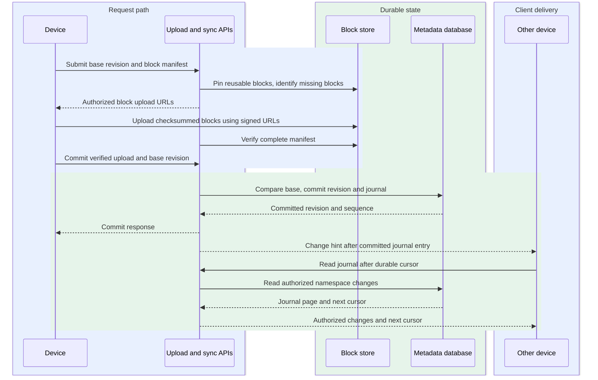
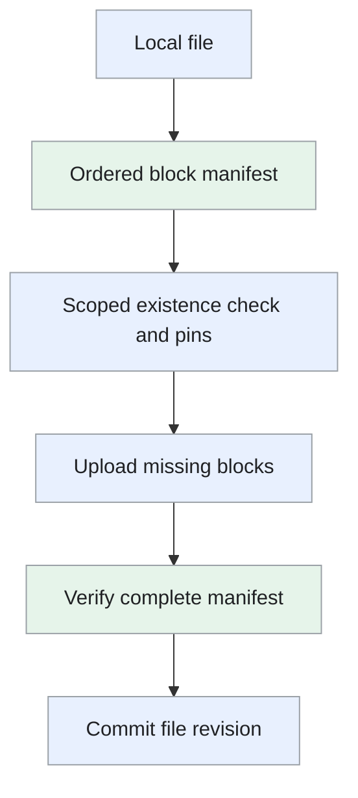

Design of a cloud file service that synchronizes files across devices, supports sharing and preserves version history.

<!--more-->

## Problem

A user edits a file on one device and expects the change to appear on their other devices. Devices can stay offline and make conflicting edits, so synchronization must preserve both the current file tree and recoverable content.

The design separates immutable file blocks from transactional metadata. Clients transfer missing blocks, commit a new revision and use a change cursor to discover later updates.

## Requirements

### Functional requirements

- **Upload and download:** support resumable transfer of files up to 50 GB.
- **Synchronize:** propagate changes, renames and deletions across devices.
- **Share:** grant viewer or editor access to files and folders.
- **Version:** list and restore retained revisions.
- **Conflicts:** preserve competing edits for user resolution.

Live collaborative editing and client-held-key end-to-end encryption are outside this design.

### Non-functional requirements

Design targets:

- **Consistency:** atomic metadata updates within a shared namespace and read-after-write visibility.
- **Freshness:** change notifications p50 below two seconds after metadata commit; transfer time depends on file size and network.
- **Durability:** acknowledge a revision after its verified blocks and metadata meet the replication policy.
- **Integrity:** verify block hashes and preserve concurrent edits.
- **Availability:** 99.99% for metadata and file reads.
- **Security:** authorize namespace operations and block downloads; isolate deduplication checks by permitted scope.

## Back-of-the-envelope calculations

Assume 700M users, one 150 KB revision/user/day and a 5 EB retained content estate.

- **Ingress:** 105 TB/day ≈ 1.22 GB/s average.
- **Revisions:** 700M/day ≈ 8.1K commits/s average, or 40.5K/s at an assumed 5× burst.
- **Blocks:** small files need one block; larger files add roughly one block per 4 MiB. Derive block request volume from the size distribution.
- **Revision metadata:** 700M/day × 500 bytes ≈ 350 GB/day before block lists, indexes and replicas.
- **Transfer savings:** measure changed-block and compressible-byte ratios; they vary substantially by file type.

## Core entities

```protobuf
message File {
  string file_id; // Stable across moves within a namespace.
  string namespace_id;
  string parent_id;
  string name;
  string current_revision_id;
  int64 version;
}

message FileRevision {
  string revision_id;
  string file_id;
  string parent_revision_id;
  repeated string block_hashes; // Ordered content manifest.
  int64 size_bytes;
  Timestamp created_at;
}

message NamespaceChange {
  string namespace_id;
  int64 sequence;
  string operation;
  string file_id;
  string revision_id;
}

message Block {
  string dedup_scope;
  string content_hash;
  string object_key;
  int64 size_bytes;
  string state; // Uploading, durable or reclaimable.
}

message Membership {
  string namespace_id;
  string user_id;
  string role;
}
```

Each personal root or shared folder has a namespace: a file tree with its own permissions and ordered change journal.

## API

```yaml
begin_upload:
  method: POST
  path: /files/uploads
  body: {namespace_id: string, file_id: string, base_revision: string, blocks: array}
  response: {upload_id: string, missing_blocks: array}
commit:
  method: POST
  path: /files/uploads/{upload_id}/commit
  headers: {Idempotency-Key: string}
  response: {revision_id: string, cursor: string}
changes:
  method: GET
  path: /namespaces/{namespace_id}/changes
  query: {cursor: string, limit: integer}
download:
  method: GET
  path: /files/{file_id}/revisions/{revision_id}
share:
  method: POST
  path: /namespaces/{namespace_id}/members
  body: {user_id: string, role: viewer_or_editor}
restore:
  method: POST
  path: /files/{file_id}/restore
  body: {revision_id: string, expected_version: integer}
```

Signed block URLs are issued only after revision access is authorized.

## High-level design

The metadata service commits file-tree changes and journals them. A block service manages verified content uploads. Notifications tell clients to read the durable journal; clients reconcile changes against their local sync state.



## Storage

- **[PostgreSQL](/designs/tech-postgresql/) shards by namespace:** file entries, revisions, memberships and an ordered change journal. Unique `(namespace_id, parent_id, name)` entries prevent conflicting paths; conditional version updates protect edits.
- **Content-addressed object storage:** immutable verified blocks, with compression codec and original-size metadata.
- **Partitioned block index:** `(dedup_scope, content_hash)` identifies durable blocks and locations. A transactional block service owns upload pins and reclamation state.
- **Client SQLite:** local, remote and last-synced tree state, unfinished transfers and journal cursors.
- **[Redis](/designs/tech-redis/):** bounded metadata caches and notification routing. Current authorization and revision commit use the metadata authority.

[Dropbox's Magic Pocket](https://dropbox.tech/infrastructure/inside-the-magic-pocket) illustrates a dedicated large-scale block store; this design can begin with managed object storage.

## From request to response

### One end-to-end request

Blocks upload independently, but a revision becomes visible only after every referenced block is verified and the metadata transaction commits.



The API participant groups the upload, metadata and sync-notification services shown in the high-level design. Metadata commits the revision and journal entry before returning success; notifications prompt other devices to fetch authorized journal pages through the sync API. Signed URLs permit direct block transfers.

### Uploading and committing

The client hashes blocks incrementally and sends a manifest. The server identifies reusable authorized blocks and issues resumable uploads for the rest. It verifies completed objects and pins the manifest's blocks for the upload session.

Commit checks permissions, quota and the base revision, then updates the file pointer and appends a namespace change in one transaction. A retry returns the same committed revision. Block pins remain until durable references are recorded.

### Downloading and synchronizing

A client reads changes after its cursor, downloads missing blocks and verifies hashes before applying a file. It writes to a temporary local path, completes the filesystem operation, and advances local sync state atomically where the platform permits.

Notifications are hints; reconnect reads the journal. If the cursor is older than retention, the client downloads a snapshot and resumes from its matching journal watermark.

Transferring whole files for every small edit wastes bandwidth. Missing-block transfer reduces bytes, while metadata version checks preserve concurrent edits.

### Sharing and restoring

A shared namespace gives all members one authoritative tree and journal. Granting or revoking access changes its membership record. Restoring a retained revision creates a new current revision and journal event, preserving history.

## Deep dives

### Choosing block boundaries and transfer format

**Problem.** A small edit should transfer fewer bytes, while each block adds metadata and request overhead.

- **Whole-file transfer:** hash and upload one object whenever content changes. The protocol and reconstruction are simple, but a small edit can resend the whole file.
- **Fixed-size blocks:** split at known offsets and upload only changed block hashes. Metadata and parallel transfer are predictable; an insertion near the beginning can shift later boundaries and make many blocks appear changed.
- **Content-defined chunking:** derive boundaries from local content so unchanged regions can retain their hashes after insertions. This reduces transfer for insertion-heavy edits, but rolling-boundary computation, variable block sizes and larger manifests add CPU and operational cost.

**Recommendation.** Use fixed blocks around 4 MiB initially, batch manifest checks and parallelize bounded transfers. Evaluate content-defined chunking on representative workloads before adding it. Fixed blocks around 4 MiB fit a first implementation with bounded manifests and parallel multipart transfer. We accept poor reuse after some insertions; content-defined chunking is added only when representative transfer savings justify its additional CPU and metadata.

Hash canonical uncompressed bytes, record the compression format, and verify reconstructed bytes. Skip compression when it increases size. Delta transfer is useful when both sides have an authorized base block; fall back to full-block transfer when the base is unavailable.

**Manifest and upload protocol.** The client splits a file into blocks, hashes each block's canonical bytes and sends an ordered manifest of hash, length and compression metadata. The server checks authorized blocks within the deduplication scope, pins reusable blocks and returns the missing set. Only missing blocks are uploaded.

A 100-MiB file with 4-MiB fixed blocks has 25 blocks. Replacing bytes inside one block can transfer about 4 MiB; inserting bytes near the front may shift many boundaries and require much more. Content-defined chunking is worth adding when measured insertion-heavy workloads justify its CPU and metadata costs.



Reconstruction follows manifest order, verifies each block, decompresses with recorded limits and checks the resulting file. A list of hashes alone is insufficient without lengths/order and a committed revision binding them together.

### Reconciling offline changes

**Problem.** Two devices can edit or move the same file while disconnected.

- **Last-write-wins:** accept the latest revision according to the server's order. Convergence is simple, but an offline user's valid edits can be silently replaced.
- **Application-specific merge:** combine changes using a format-aware editor. Compatible text or structured edits may merge well, but arbitrary binary formats need separate semantics and an invalid merge can corrupt content.
- **Common-base reconciliation:** compare each device's local and remote state with the last synced tree. Independent moves/edits can be combined and conflicting contents preserved; clients retain base state and users may need to resolve conflict copies.

**Recommendation.** Compare the local tree and remote tree with the last-synced tree. Apply independent changes; preserve both contents when edits conflict. Stable file IDs distinguish moves from unrelated deletes and additions. Common-base reconciliation fits arbitrary files and long offline periods without assuming every format has a safe merge algorithm. We accept conflict copies and extra client state to preserve both users' data; stable file IDs separate a rename from deletion/recreation.

```text
last synced tree ── local changes ──► local tree
       │
       └──────── remote changes ──► remote tree
                         │
                 reconcile / preserve conflicts
```

A commit carries its base revision. A competing commit creates an explicit conflict outcome rather than silently replacing the other edit. [Dropbox's sync-engine rewrite](https://dropbox.tech/infrastructure/rewriting-the-heart-of-our-sync-engine) explains the value of stable identifiers and atomic moves.

**Three-way reconciliation example.** At the shared base revision, file F is named report.txt and contains V10. Device A renames it to final.txt without editing content. Device B changes its content to V11 while offline. Because both changes reference stable file ID F, the reconciler can combine the rename and content edit.

If A and B both change the contents from V10, the base identifies a concurrent edit. For an arbitrary binary file, keep both revisions and expose a conflict copy; a supported application-specific merge may instead combine them. Wall-clock last-write-wins would silently discard one user's work.

Commit the reconciled change with the expected remote base revision. If the remote advanced again, reload and reconcile rather than forcing the stale result. Persist local transfer progress and the last-synced revision transactionally in SQLite so a client restart resumes from the same base rather than mistaking downloaded files for new local edits.

### Metadata consistency and hot shared folders

**Problem.** Shared folders create high read fan-out and occasional concurrent writes.

- **One database:** keep all trees and journals in one transactional authority. Cross-folder operations are easy to express, but one write/metadata capacity ceiling limits growth and hot folders compete with unrelated users.
- **Namespace-sharded transactions:** colocate a namespace's tree and journal and commit its mutations locally. Most sync work scales by namespace; hot namespaces still serialize and cross-namespace moves need a recoverable coordinator.
- **Globally transactional store:** transact across namespace boundaries through distributed coordination. Atomic multi-namespace changes are easier for callers, but network/quorum work adds latency, availability coupling and operating cost to ordinary mutations.

**Recommendation.** Keep one namespace's tree and journal on the same shard. Serve read-after-write requests from the leader or a replica proven to have reached the returned sequence; use immutable version-keyed caches for older revisions. Namespace sharding fits sync operations whose normal consistency boundary is one shared tree. We accept explicit coordination for cross-namespace moves and a hot-namespace limit rather than charging every small metadata edit for global coordination.

A user's joined namespaces can reside on different shards. Cross-namespace moves need a durable coordinator or distributed transaction with a persisted decision and recovery; prepare acknowledgements alone do not make all shards visible simultaneously. Bound hot-namespace writes and cache journal pages by sequence.

**Namespace journal and client cursors.** A namespace transaction updates a file entry and appends journal sequence 250. Clients subscribe for a hint, then read journal pages after their durable cursor. The hint can be lost; the journal remains replayable.

Read-after-write clients carry sequence 250, and a replica serves them only after applying it. Cached metadata includes namespace and revision generation, preventing an older cached path from overriding a newer move. Very hot folders use shared journal-page caches and bounded client catch-up rather than a separate database read per notification.

For a cross-namespace move, the coordinator records a durable operation and decision. Recovery can determine whether to complete the destination and source transitions or abort prepared work. Define when each side becomes visible; merely receiving two prepare acknowledgements does not establish atomic public visibility. If the product requires that stronger guarantee, use a distributed transaction protocol that includes the visibility and failure semantics.

### Reclaiming blocks safely

**Problem.** Uploaded or old blocks may appear unreferenced while a revision commit or reference update is still in flight.

- **Immediate reference-count deletion:** delete a block when its count reaches zero. Space returns quickly, but a delayed reference update or concurrent revision can make a still-needed block appear unused.
- **Delayed counters:** wait before acting on zero counts. A grace period absorbs some lag, but lost or misordered updates can still make the count wrong, so delay alone is not a proof of safety.
- **Mark-and-sweep with pins:** mark references from a complete checkpoint and protect active uploads with durable pins before reclaiming candidates. This handles retained revisions and in-flight commits; scans, grace periods and pin recovery keep more storage live and require a coordinated deletion state.

**Recommendation.** Use upload pins, durable revision references and a reclamation grace period. A block-service state transition coordinates new pins with pending deletion. Sweep only from a complete reference snapshot/checkpoint, and preserve references from retained revisions. Pins plus complete reference snapshots fit immutable blocks shared by uploads and retained revisions. We accept delayed reclamation and scan cost to protect acknowledged data; the final deletion transition rechecks references and pins.

Replay reference updates idempotently, audit missing blocks and test interrupted commits, restore-versus-GC races and concurrent uploads. Expired uploads can release pins; an acknowledged revision must keep its blocks reachable.

**Pinning versus deletion race.** A block can look unreferenced just before an upload commits a revision that needs it. Coordinate pin creation and reclamation state in the block service: a pin can attach only to a live block, and a deletion candidate must have no active pins or durable references.

A sweep uses a complete metadata checkpoint, marks candidates and waits a grace period. Before actual deletion, recheck references/pins under the same state transition. A block already marked deleting cannot be reused by a new revision; that upload supplies another verified copy or waits for the documented recovery path.

Retained history, shared copies and legal retention all count as references. Reference-count deltas have stable identities so replay does not increment twice. Audit manifests whose blocks are missing and compare the sweep's metadata checkpoint with live publication progress. This prevents a partial scan from being mistaken for proof that a block is unused.
