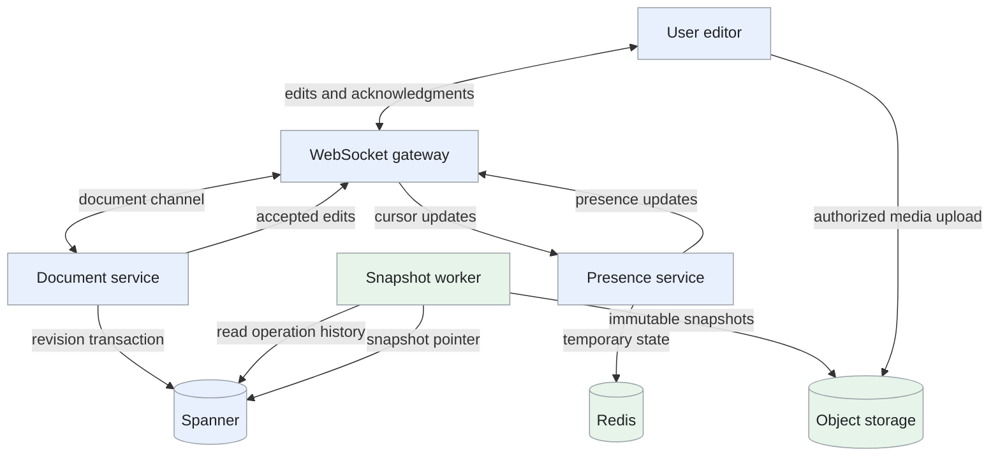
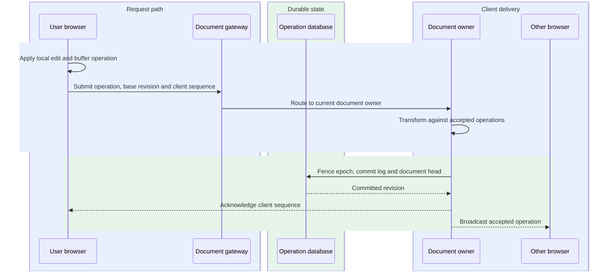
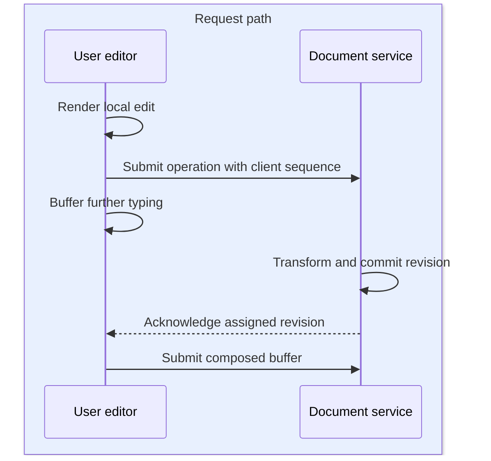
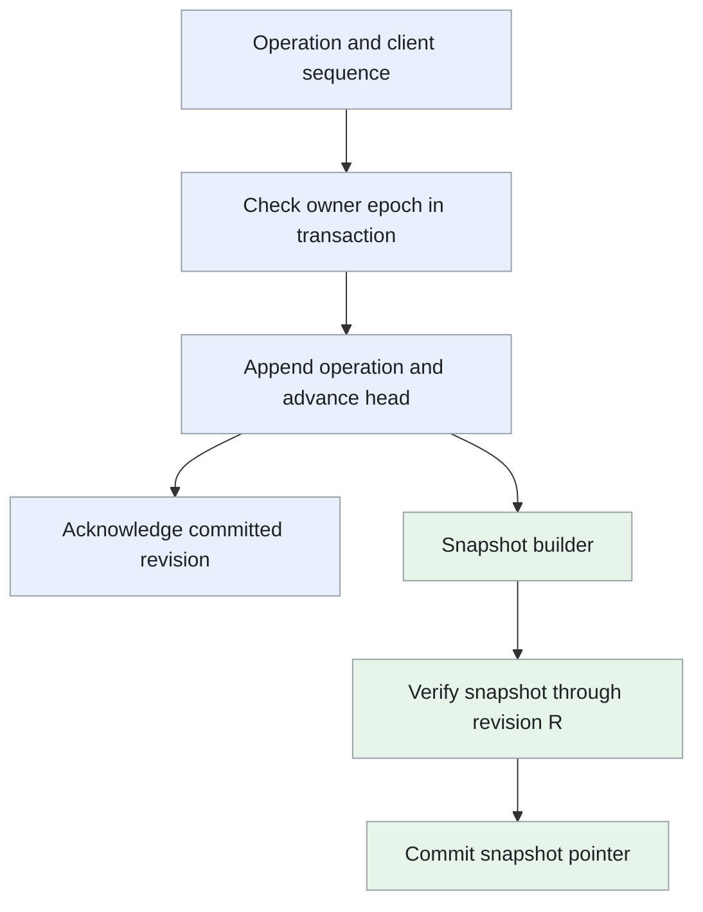

Design of a collaborative document editor where users edit shared text, see each other's changes and restore earlier versions.

<!--more-->

## Problem

Users working on the same document expect their typing to appear immediately and their colleagues' changes to arrive shortly afterward. When two people edit the same text, every connected editor must eventually display the same result.

The service orders accepted edits for each document, merges concurrent operations and saves them before acknowledgment. Document content and version history are durable; cursor positions and online status are temporary.

## Requirements

### Functional requirements

- **Manage documents:** create, open, rename and soft-delete documents.
- **Edit collaboratively:** support concurrent text edits and rich formatting.
- **Show presence:** display other editors' cursors, selections and online status.
- **Review history:** inspect retained revisions and restore an earlier version.
- **Add document content:** insert images, tables, comments and supported embeds.

### Non-functional requirements

- **Scale:** plan for 150K edit operations/s, 50M connected sessions and up to 100 editors per document.
- **Latency:** target P99 edit-to-remote-screen below 200ms within the supported regional network envelope; render local typing immediately.
- **Durability:** acknowledge an edit only after the operation and document revision commit together.
- **Consistency:** assign a single revision order per document, preserve each client's operation order and make replicas converge.
- **Recovery:** reconnect from a known revision and retry submissions without applying them twice.
- **Security:** enforce document access for reads, edits, history and media.

Account provisioning, full offline merging and export rendering are outside the collaboration design.

## Back-of-the-envelope calculations

- **Edit log:** 150K ops/s × 200B × 86,400s is about 2.6TB/day before indexes, snapshots and replication.
- **Fan-out:** three remote recipients per edit gives 450K deliveries/s on average. A document with 100 editors may require 99 deliveries per edit.
- **Connections:** 50M sessions × 100KB of connection state is about 5TB across the gateway fleet. Actual state and connection density require measurement.
- **History:** retaining every operation for 90 days would consume about 233TB before replication. Snapshots shorten replay; retention still determines which historical versions remain available.

## Core entities

```protobuf
message Document {
  string doc_id;
  string owner_id;
  string title;
  int64 current_revision;
  int64 snapshot_revision;
  string snapshot_object;
  Timestamp deleted_at;
}

message EditOperation {
  string doc_id;
  string client_id;
  int64 client_sequence;        // Retry identity within a client session
  int64 base_revision;
  int64 assigned_revision;      // Set by the document service
  bytes operation;              // Typed text or document-tree operation
}

message DocumentLease {
  string doc_id;
  string server_id;
  int64 epoch;                  // Fences a previous document owner
  Timestamp expires_at;
}

message Presence {
  string doc_id;
  string session_id;
  int64 base_revision;          // Revision used to interpret the selection
  bytes selection;
  Timestamp last_seen;
}

message Comment {
  string comment_id;
  string doc_id;
  string author_id;
  bytes anchor;                 // Tracked through document edits
  string text;
}
```

## API

```yaml
POST /docs:
  body: {title: string}
  response: {doc_id: string, revision: integer}

GET /docs/{doc_id}:
  response: [metadata, snapshot, snapshot_revision, operations, head_revision]

PATCH /docs/{doc_id}:
  body: {title: string, expected_version: integer}

DELETE /docs/{doc_id}:
  response: soft-delete confirmation

WS /docs/{doc_id}/edit:
  submit: [client_id, client_sequence, base_revision, operation]
  ack: [client_sequence, assigned_revision]
  remote_edit: [assigned_revision, operation]
  presence: [session_id, base_revision, selection]

GET /docs/{doc_id}/revisions:
  query: [from, to, cursor]
  response: retained revision history

POST /docs/{doc_id}/restore:
  body: {target_revision: integer, expected_head: integer}
  response: new head revision
```

The gateway authenticates each session; the document service enforces its read or edit permissions. A client carries its last received revision when reconnecting.

## High-level design

WebSocket gateways keep client connections open and route edits to the current document owner. That owner transforms operations, commits revisions and broadcasts accepted edits. Snapshot workers compact history; presence travels through a separate, lower-priority path.



## Storage

- **Spanner:** stores document metadata, owner leases and the authoritative operation log. A serializable transaction checks the owner epoch, appends operations and advances the head revision together. [Spanner transactions](https://docs.cloud.google.com/spanner/docs/transactions) provide the required cross-table atomicity.
- **Keys and indexes:** operation history is ordered by `(doc_id, assigned_revision)`. A unique index on `(doc_id, client_id, client_sequence)` recognizes a retried submission. Owner/title indexes support document listing with access filtering.
- **Object storage:** contains immutable snapshots and uploaded media. Publish a snapshot pointer only after the object is complete and verified. Keep the previous usable snapshot until the new pointer commits.
- **Bigtable:** can hold archived history for sequential reads after a verified transfer. Keep the live revision commit in one transactional store; splitting its head and operation append across databases requires an additional coordination protocol.
- **[Redis](/designs/tech-redis/):** stores leased presence information and publishes best-effort updates. Connected clients expire stale presence locally and refresh it after reconnecting.

## From request to response

### One end-to-end request

The browser displays a local edit immediately, while the document owner transforms and durably commits its operation before acknowledging it.



Other browsers apply the accepted revision; the sender retains unacknowledged edits for retry under the same client sequence.

### Opening and managing a document

The API checks access and reads the document head. The current owner loads a snapshot at revision S, replays operations S+1 through the captured head and returns that consistent state. Changes committed during loading follow on the edit channel.

Rename updates metadata with a version check. Soft deletion marks the document unavailable to ordinary editing, disconnects active edit sessions and retains recoverable content under the retention policy.

Snapshot replay keeps reads simple, but long operation tails increase open latency. The snapshot and recovery deep dive describes how to keep that tail bounded in normal operation.

### Editing text and formatting

The browser applies local typing immediately. It submits an operation with the revision on which it was based and a stable client sequence. Further local edits remain buffered while the first submission is in flight.

The document owner transforms the incoming operation against intervening committed edits. It then assigns the next revision and commits the operation and updated head. After commit, it acknowledges the submitting client and broadcasts the accepted operation. Peers transform remote edits against their own outstanding and buffered operations before applying them.

Formatting and table edits use a defined document operation model, including attributes and structured child nodes. Text offsets alone are insufficient for every rich-content operation; use a tested transformation implementation for that model.

One owner simplifies revision ordering, but a busy document can exhaust its transform and fan-out budget. Batch compatible local changes and isolate noisy documents rather than promising unlimited concurrent editors.

### Showing cursors and adding content

Presence updates include the revision used for the selection. The presence service rate-limits and coalesces updates, then broadcasts them independently of durable edits. Clients transform selections through subsequent edits and remove a cursor when its heartbeat expires.

An image uploads through a scoped URL. After completion and media validation, an edit inserts its object reference into the document. Tables use structured edit operations; comment anchors move with the document's tracked positions. Media bytes remain outside the edit stream.

### Reviewing and restoring history

The history API loads a retained snapshot and the following operations to reconstruct the requested revision. Restoring that content appends a new document revision. The service checks the expected current head so an unexpected concurrent edit prompts the user to retry or confirm the restore.

Snapshots accelerate reconstruction; they do not create unlimited history. Keep enough snapshots and operations to cover the stated retention period, and tell the user which versions remain available.

## Deep dives

### How should concurrent edits merge?

**Problem.** Two users can insert text at the same position while each is already showing their own local edit. Applying their original offsets in arrival order can produce different results on different clients.

| Approach | Strength | Tradeoff |
| --- | --- | --- |
| Whole-document locking | Simple update rules | Other users must wait |
| Operational transformation (OT) | Fits server-ordered editing and compact text operations | Requires correct server and client transforms |
| Conflict-free replicated data types (CRDTs) | Supports independently generated updates and offline merging | Adds identifier and synchronization state |

- **Whole-document locking:** grant one editor exclusive mutation ownership. Conflict handling is simple, but collaborators wait and disconnected lock holders need expiry/recovery.
- **Operational transformation:** order accepted operations at the server and transform their positions against concurrent accepted changes. Compact text operations fit an online document owner; correct client/server transforms and retained revision history are required for every supported operation.
- **CRDTs:** assign stable identities and merge independently generated updates using a proven convergence algorithm. Offline edits can synchronize without arrival-order transforms; identifiers, tombstones and library-specific synchronization/garbage collection consume extra state.

**Recommendation:** use server-ordered OT for this online-first design. A deterministic rule orders simultaneous inserts, and transforms adjust positions relative to operations already accepted. A CRDT is a useful alternative when offline editing becomes a requirement; libraries such as [Yjs](https://docs.yjs.dev/api/y.doc) provide their own synchronization and garbage-collection behavior. Server-ordered OT fits the stated online-first document and authoritative revision log. We accept transform complexity and a connection-dependent shared revision order; a move to offline-first editing would justify reassessing the CRDT alternative rather than mixing the two operation contracts.

```text
Base document: "cat"
A inserts "s" at position 3 → "cats"
B inserts "!" at position 3 → "cat!"

Server accepts A first.
Transform B's position from 3 to 4 under the insert ordering rule.
Both editors converge to "cats!".
```

This is a small text example. Deletes, overlapping formatting and structured content need transformation rules with automated convergence tests. Test permutations of concurrent edits, retry sequences, reconnects and mixed text/table operations.

**Operation coordinates and transformation.** Each submitted operation identifies its base revision and client sequence. If B submits an insert based on revision 10 after A's insert has committed as revision 11, the owner loads operations after revision 10 and transforms B against them before assigning revision 12.

In the “cat” example, choose a deterministic tie rule for inserts at the same position. Accepting A first places “s” at position 3; transforming B shifts “!” to position 4. Clients must apply the corresponding transforms to remote operations and their unacknowledged local work, not simply append the server's text.

A delete overlapping an insert requires more than shifting an offset. The implementation needs a transformation algebra covering each supported operation pair, including structured edits and formatting. Test that concurrent permutations converge and preserve the intended editing semantics. Use an established OT implementation or formally tested operation model; the small example explains the protocol rather than specifying a complete production editor.

### How can typing stay responsive over a slow connection?

**Problem.** Waiting for an acknowledgment before showing each keystroke would make editing depend on network latency. Sending unrestricted operations creates a growing transform backlog during outages.

- **Committed-only rendering:** display text after the server acknowledges its operation. Client state is straightforward, but each keystroke inherits network round-trip latency.
- **Independent keystroke submissions:** display locally and submit every edit separately. Typing feels immediate, but high latency grows an outstanding-operation queue and multiplies transformations and retry state.
- **One outstanding operation plus a buffer:** compose compatible subsequent edits locally while one operation is in flight, transforming both against remote revisions. Typing stays immediate with bounded submissions; composition and cursor transformation must preserve the editor's semantics.

**Recommendation:** render locally, keep one outstanding composed operation and compose subsequent compatible changes in a buffer. Remote edits transform against both. Once the outstanding operation is acknowledged, submit the transformed buffer using the updated base revision. One outstanding operation fits continuous typing over variable connections and the server-ordered OT model. We accept a more involved client buffer and unsynced state during outages instead of making UI responsiveness depend on acknowledgments.



Cap queued bytes and operation count. On reconnect, request edits after the last received revision and retry the outstanding submission with the same sequence. If its base revision is beyond retained transform history, reload the document and preserve unsent changes for a supported rebase or user review.

Measure local render latency, acknowledgment latency, remote delivery delay and buffered-operation age separately.

**Outstanding operation and buffer.** The editor immediately renders local operation A and sends it once. Further keystrokes compose into buffer B while A is awaiting acknowledgement. If remote operation R arrives, transform R against A and then B before applying it locally, while updating the outstanding/buffer coordinates consistently.

When A's acknowledgement arrives, clear that outstanding operation and submit the transformed B using the acknowledged server revision. The client sequence stays stable for retransmission of A; a retry is not a new edit. Composition combines compatible adjacent changes without changing their effect.

Persist unacknowledged work locally when the product promises crash recovery. On reconnect, ask for committed history after the known revision, identify whether A already committed, and transform remaining work. Bound buffered bytes and history distance. If the base is no longer supported, retain unsent content for an explicit rebase or review instead of discarding it during a fresh snapshot load.

### How do ownership and history survive a server failure?

**Problem.** Consistent hashing identifies a preferred server, but it cannot by itself prevent an old and a replacement server from committing edits concurrently.

- **Gateway routing alone:** consistently hash a document to one preferred server. Normal placement is simple, but a stale gateway can still reach an old server after failover and produce concurrent writers.
- **Lease without storage fencing:** expire ownership and let a successor take over. Most takeover paths work, but a paused old owner can resume and commit unless the durable write checks ownership too.
- **Fenced revision commits:** advance a durable owner epoch and require it on every log/head transaction. A successor makes stale commits fail and can replay committed history; lease renewal, epoch checks and verified snapshots add control-plane and storage work.

**Recommendation:** keep a document owner lease with a monotonically increasing epoch. A new owner acquires it transactionally after expiration. Every edit transaction checks that epoch and lease validity, then writes the log and head together. A stale owner fails that check and redirects clients to the new owner. Fenced commits fit a document whose acknowledged revision must survive owner replacement. We accept a durable ownership dependency and pause acknowledgments during authority loss; locally visible buffered edits remain explicitly unsynced.

After a failure, the replacement reads a verified snapshot and replays committed operations. A submission whose commit succeeded before the connection failed is recognized by its client sequence and returns the original acknowledgment.

Trigger snapshots after an operation-count threshold or elapsed interval. Worker lag can exceed either trigger, so monitor replay depth, snapshot age and open latency; apply backpressure before the tail becomes operationally expensive. Delete older operations only after verifying snapshot coverage and the history-retention requirements.

A presence outage may temporarily remove remote cursors. An authoritative-storage outage pauses new durable acknowledgments; local buffered edits remain visible with an unsynced indicator until service recovers.

**Fenced commit and snapshot coverage.** The owner transaction checks epoch E, verifies lease validity, recognizes an existing client sequence, and appends the transformed operation while advancing the document head. A successor acquiring E+1 causes the old owner's later transaction to fail even if its socket still reaches clients.



A snapshot includes the exact state through revision R; recovery replays R+1 onward. Write and verify the immutable object before publishing its pointer. Retain log records required for history and client transforms, even if the snapshot covers their rendered text. Snapshot coverage, transform retention and user-visible revision history are different constraints.
