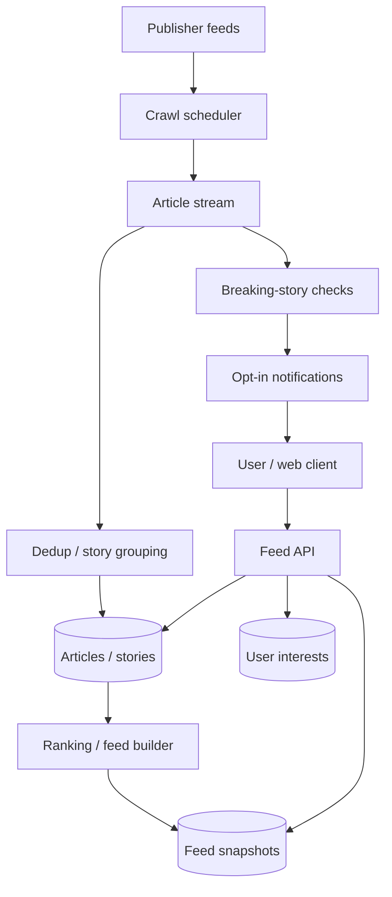
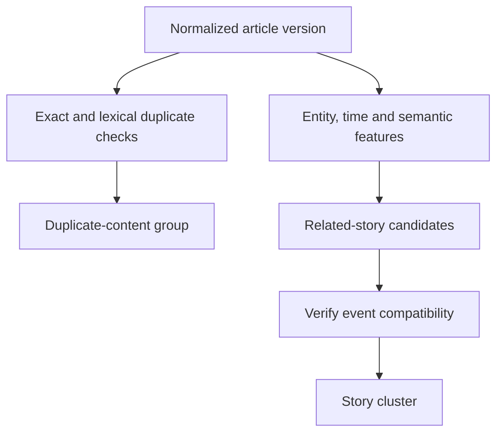

Design of a news aggregator that groups related coverage and serves fresh regional and personalized feeds.

<!--more-->

## Problem

A user wants to understand the day's important stories without reading repeated copies of the same report. The service collects publisher updates, groups coverage of an event and presents representative articles with links to other sources.

Ingestion and ranking run independently of feed requests. Users receive short summaries and source attribution, then follow links to read the publisher's article.

## Requirements

### Functional requirements

- **Collect news:** ingest approved publisher feeds and pages.
- **Browse:** show global, category and regional feeds.
- **Group coverage:** separate duplicated text from distinct reporting on the same story.
- **Personalize:** use chosen interests and permitted interactions.
- **Read:** show snippets, publisher attribution and full-coverage links.
- **Notify:** identify breaking stories for opt-in alerts.

Publisher payments, public comments and offline article hosting are outside this design.

### Non-functional requirements

Design targets:

- **Latency:** feed p99 below 200 ms.
- **Freshness:** eligible articles appear within 15 minutes of publication, or five minutes for breaking-news sources with supported delivery.
- **Availability:** 99.99%; disclose stale feeds during processing outages.
- **Crawler safety:** respect robots rules, publisher permissions and per-origin limits.
- **Quality:** measure duplicate detection, story-cluster precision and feed diversity by language.
- **Integrity:** preserve corrections, retractions, timestamps and attribution.

## Back-of-the-envelope calculations

Assume 50K sources, 5M articles/day, 150M monthly users and 30M daily users.

- **Ingest:** 5M/day ≈ 58 articles/s average; a 10× burst is about 580/s.
- **Reads:** 30M daily users × ten requests/day ≈ 3.5K/s average, or 17.4K/s at 5× peak.
- **Metadata:** 5M/day × 2 KB × 30 days ≈ 300 GB before indexes and replicas.
- **Signatures:** 128 four-byte MinHash values × 5M/day ≈ 2.56 GB/day.
- **Publisher polling:** 50K sources every five minutes would create 167 feed requests/s before article fetches; use source-specific schedules.

## Core entities

```protobuf
message Article {
  string article_id;
  string source_id;
  string canonical_url;
  string title;
  string snippet;
  string language;
  Timestamp published_at;
  int64 version;
  string state; // Active, corrected or retracted.
  string story_id;
}

message Source {
  string source_id;
  string origin;
  string feed_url;
  Timestamp next_fetch_at;
  string etag;
}

message Story {
  string story_id;
  repeated string article_ids;
  repeated string entities;
  string representative_article_id;
  Timestamp last_development_at;
}

message FeedSnapshot {
  string snapshot_id;
  repeated string story_ids;
  string ranking_version;
  Timestamp generated_at;
}

message UserInterests {
  string user_id;
  repeated string topics;
  string region;
  string language;
}
```

Canonical URLs identify publisher articles; story IDs group different articles about an event.

## API

```yaml
feed:
  method: GET
  path: /feed
  query: {category: string, region: string, language: string, cursor: string}
  response: {stories: array, next_cursor: string, generated_at: timestamp}
personalized:
  method: GET
  path: /feed/personalized
  query: {cursor: string}
story:
  method: GET
  path: /stories/{story_id}
  response: {representative: object, coverage: array}
article:
  method: GET
  path: /articles/{article_id}
  response: {snippet: string, source: object, publisher_url: string}
interests:
  method: PUT
  path: /users/me/interests
  body: {topics: array, region: string, language: string}
```

## High-level design

Publisher updates enter a durable pipeline for extraction, duplicate detection and story assignment. Feed builders create ranked snapshots, while serving services assemble pages from cached snapshots and article metadata.



## Storage

- **PostgreSQL:** source schedules, article versions, story membership and corrections; unique source/canonical URL keys support retry-safe updates.
- **Object storage:** permitted extraction artifacts and reproducible processing inputs under explicit retention rules.
- **Kafka:** replayable article changes keyed by article ID. Workers apply versions and checkpoint after durable writes.
- **Redis / Valkey:** recent similarity buckets, article metadata caches and immutable feed snapshots.
- **Bigtable or sharded PostgreSQL:** interest profiles and bounded interaction features keyed by user; choose based on measured scale and access patterns.
- **Analytical store:** sanitized impression/click events and ranking evaluations.

Publisher links and attribution remain in every article response. Store only content permitted by the publisher/content policy.

## From request to response

### Collecting and grouping articles

The scheduler polls feeds using conditional requests, applies origin budgets and schedules newly discovered article URLs. Extraction records publication time separately from fetch time and emits a versioned article event.

Exact URL/content checks identify re-fetches and syndicated copies. Similarity retrieval produces candidate story groups; a verifier checks event identity, time and language before assignment. Corrections update the existing article; retractions invalidate serving eligibility.

### Serving a feed

The feed service selects a snapshot for the requested region, language and category, applies user preferences where appropriate, and batch-loads current article metadata. It filters retracted content and returns source-labelled cards.

The cursor binds an immutable snapshot and offset. New stories appear on refresh; expired snapshots require a new feed session.

Sorting every recent article during each request is wasteful. Prebuilt candidate feeds and bounded reranking keep expensive work off the read path.

## Deep dives

### Duplicated text versus related reporting

**Problem.** Reprinted wire copy and independently written coverage of one event are different grouping problems.

**Options.** Exact hashes, lexical fingerprints such as SimHash/MinHash, or semantic event clustering.

**Recommendation.** Use exact hashes and lexical fingerprints for duplicated content, then event-aware clustering for related reporting. Named entities, event time, location and embeddings provide candidate signals; verify before merging.

MinHash with locality-sensitive hashing narrows candidate comparisons. For band count b and rows per band r, candidate probability is `1 - (1 - similarity^r)^b`; thresholds affect both missed matches and verification load. They require evaluation on real articles.

Retain verification features through the comparison window, bound oversized buckets and review cluster merges/splits. Cross-language linking needs compatible multilingual features and separate quality tests.

**Candidate generation and verification.** Normalize permitted article text, remove publisher boilerplate and compute an exact digest. Exact matches join a duplicate-content group. For near-duplicates, build lexical signatures, look up recent locality-sensitive buckets and verify the small returned set using retained text features.

Story clustering is a second decision. Two reports can describe the same election result using different wording; entities, event time and location make them related even when their lexical overlap is low. Conversely, articles about elections in different countries should stay separate despite similar vocabulary.



Store cluster decisions with feature and article versions. A correction or mistaken merge can then split a cluster and rebuild affected feed generations. Cap huge candidate buckets and fall back to a bounded verification strategy rather than comparing every article with every other article.

### Serving feeds with stable pagination

**Problem.** Ranking scores change while a user scrolls.

**Options.** Offset pagination over a live list, score-based cursors over that list, or immutable session snapshots.

**Recommendation.** Publish feed generations and retain a short-lived immutable ordering for each feed session. Update shared candidate feeds incrementally and periodically refresh time-sensitive ranking.

```text
article changes → candidate feed → ranking generation
                                      │
                             immutable session snapshot
                                      │
                                page 1 → page 2
```

A score cursor alone does not freeze order. Expired sessions return an explicit refresh response; snapshot age and pipeline lag are exposed for operational monitoring. During an outage, serve a bounded-age snapshot with current retraction checks.

**A feed session that survives refresh.** At the first request, select feed generation G8 and store an immutable ordered list of story IDs for a short-lived session. The cursor carries session ID and next position. Even if G9 ranks a breaking story first a minute later, page two continues G8.

The server rechecks current retractions and visibility while hydrating each page. Removing a story can leave a shorter page or cause bounded extra reads from the same snapshot; it does not reorder all earlier results. A refresh starts a new session under G9.

Build G9 from a durable candidate cutoff and publish its pointer only after all required partitions are complete. Store expiry with session state and return an explicit refresh requirement after expiry. Measure snapshot age independently from query latency: a fast cache can still serve an old news ordering.

### Balancing freshness and relevance

**Problem.** Early coverage can be brief, while original reporting and analysis arrive later.

**Options.** Chronological order, engagement-only scores or a multi-signal ranker.

**Recommendation.** Rank with recency, topic-specific source quality, original reporting, user interests and diversity constraints. [Google's topic-authority explanation](https://developers.google.com/search/blog/2023/05/understanding-news-topic-authority) provides background for authority and original-reporting signals.

A time-decay half-life is a tunable feature, rather than a universal expiry rule. Measure source diversity, relevance and repeated-story rate alongside engagement. Assign one story slot before selecting representative coverage, and preserve access to other perspectives.

**Ranking stories before articles.** Retrieve eligible recent story candidates, score each using user interest, recency and quality signals, then select representative articles within the story. This gives one prominent slot to an event instead of filling the page with five reprints.

For a decay feature with a six-hour half-life, an otherwise equal story retains half of its recency contribution after six hours. That feature is combined with relevance and development signals; an important ongoing event is not deleted simply because its initial report is old.

A new independent report may improve coverage without increasing the story's importance enough to reorder the whole feed. Keep source diversity constraints explicit and show links to alternative reporting. Train/evaluate from logged impressions at their historical feature cutoff so future corrections or later engagement do not leak into the original ranking example.

### Detecting breaking stories

**Problem.** Article volume can spike because of an important event, duplicated syndication or a widely repeated rumour.

**Options.** Fixed count thresholds, baseline-relative anomalies or anomaly candidates followed by quality checks.

**Recommendation.** Use source-deduplicated volume relative to topic/region baselines, then verify independent coverage and eligibility before promoting a story or sending notifications. Cold topics need minimum evidence; sustained events need development-aware updates.

Separate processing-time alerts from event-time windows, handle late data and checkpoint stream state with input positions. Use story-level cooldowns and user notification budgets. Track alert precision and detection delay; volume alone does not establish credibility.

**Volume anomaly to confirmed alert.** In each topic/region window, count independent source groups rather than raw article copies. Compare the count with a baseline for the same time-of-day and recent history. A wire story syndicated 100 times may count as one underlying contribution; five independently reported developments carry different evidence.

An anomaly creates a candidate, not an automatic notification. Verify topic relevance, independent coverage, source eligibility and whether this is a new development. Then record a story-level alert identity and cooldown before dispatching user notifications.

Event-time windows allow late reports to update the underlying evidence. Checkpoint counts, source-deduplication state and input offsets together. A recovery replay can reproduce the candidate and finds the already-recorded alert identity. Corrections or retractions create a new development state and use the product's correction policy rather than silently leaving a misleading breaking alert active.
