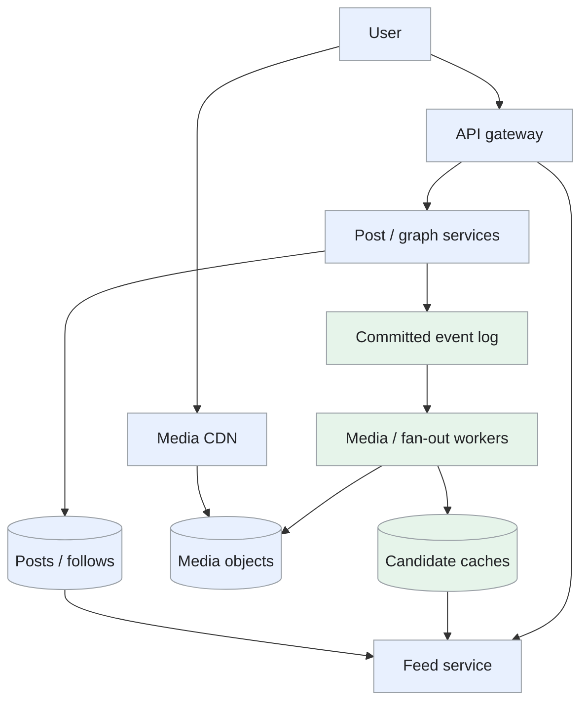
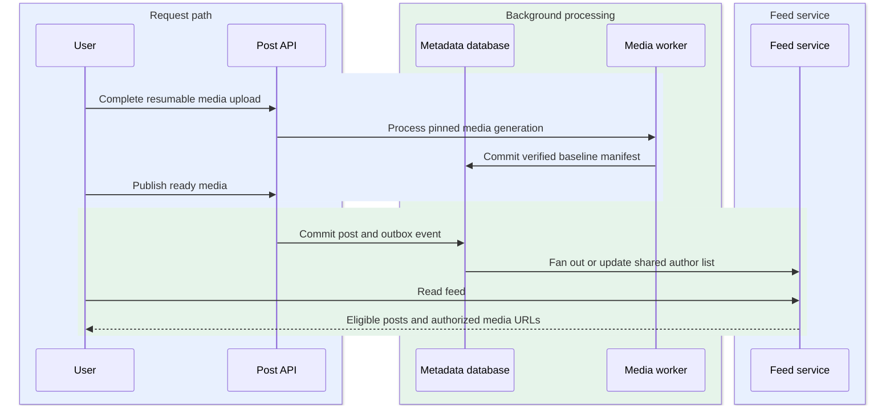
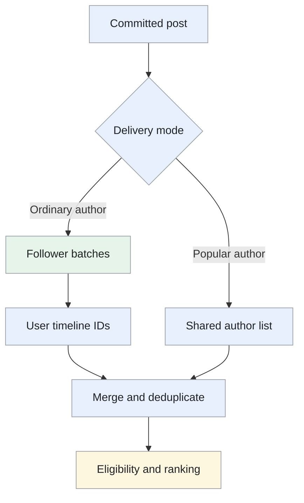

Design of a photo and video sharing service with media publishing, follow relationships and a personalized feed.

<!--more-->

## Problem

Users upload photos or videos, add a caption and share them with followers. The feed then combines eligible posts from followed accounts and presents them in a useful order.

The two largest workloads are media delivery and feed assembly. Processing a video should happen before it is offered for playback, while a popular author's post should remain available without requiring millions of synchronous timeline writes.

## Requirements

### Functional requirements

- **Publish media:** upload photos or videos with captions and optional location tags.
- **Read a feed:** browse ranked posts from followed accounts with stable pagination.
- **Manage follows:** follow/unfollow users and enforce private-account approval.
- **View profiles:** show profile metadata and eligible recent posts.

Messaging, ads, live video and detailed recommendation-model training are outside this design.

### Non-functional requirements

- **Scale:** plan for 500M daily users, 100M posts/day and 50B feed impressions/day.
- **Latency:** target feed API P99 below 200ms within a serving region, with a bounded candidate pool.
- **Publishing:** acknowledge image processing completion within 3 seconds at P95 after upload bytes have arrived; video processing has a separate size-dependent budget.
- **Availability:** target 99.99% for feed reads and 99.9% for publishing.
- **Durability:** acknowledge accepted content after object persistence and the configured database replication commit.
- **Correctness:** enforce current follows, privacy and post removal before response or media authorization.
- **Recovery:** target zone-failure RPO 0 for acknowledged metadata; asynchronous region replicas have an explicit recovery lag.
- **Security:** scope upload URLs to one user/object, scan media and protect precise location fields.

## Back-of-the-envelope calculations

- **Publishing:** 100M posts/day ≈ 1.16K/s average, or 3.5K/s at a 3× burst.
- **Feed pages:** 500M users × 2 sessions × 50 displayed posts = 50B impressions/day. At 20 posts/page, that is 2.5B page requests/day, or 29K/s average and 87K/s at 3×.
- **Media:** 100M posts/day × 2MB blended average ≈ 200TB/day, or 219PB over three years before variants, replicas and retention.
- **Graph:** 500M users × 300 follows ≈ 150B edges; at 64 bytes/edge, 9.6TB of logical records before indexes and reverse views.
- **Object indexes:** 328.5B variants over three years × 64 bytes/index entry ≈ 21TB, not a single-machine index.

These figures are workload assumptions rather than current Instagram measurements.

## Core entities

- **Post:** author, caption, visibility and media references.
- **Media:** upload ownership, persisted source object and processed variants.
- **Follow:** an approved or pending relationship.
- **Feed session:** a bounded ranked list for stable pagination.

```protobuf
message Post {
  string post_id;
  string author_id;
  string caption;
  repeated string media_ids;
  string visibility;
  string state; // Processing, published or removed.
  int64 version;
  Timestamp created_at;
}

message Media {
  string media_id;
  string owner_id;
  string source_object_key;
  repeated string variant_keys;
  string processing_state;
  string checksum;
}

message Follow {
  string follower_id;
  string followee_id;
  string state; // Pending approval or active.
}

message FeedSession {
  string session_id;
  string user_id;
  repeated string ranked_post_ids;
  Timestamp expires_at;
}
```

Optional location data is stored with its own visibility policy. Media references are internal object identities; the delivery service issues the permitted variant URL.

## API

```yaml
POST /media/uploads:
  body: {content_type: image/jpeg, size_bytes: 2000000, checksum: "..."}
  response: {media_id: "...", upload_url: "...", expires_at: "..."}

POST /posts:
  headers: {Idempotency-Key: "..."}
  body: {caption: "...", media_ids: [...], visibility: followers}
  response: {post_id: "...", state: processing}

GET /posts/{post_id}:
  response: {post: {...}, processing_state: "..."}

GET /feed:
  query: {cursor: "...", limit: 20}
  response: {posts: [...], next_cursor: "..."}

PUT /me/follows/{user_id}:
  response: {state: active_or_pending}

DELETE /me/follows/{user_id}:
  response: 204

GET /users/{user_id}:
  response: {profile: {...}, posts: [...], next_cursor: "..."}

GET /media/{media_id}/access:
  query: {variant: feed}
  response: {delivery_url: "...", expires_at: "..."}
```

Creation keys are scoped to the authenticated user and input. Feed cursors bind the user, ranking session and offset.

## High-level design

The client uploads directly to object storage. The post service records the publication workflow; workers validate and prepare media before emitting a published event. Feed workers distribute candidate IDs, and the read service ranks and hydrates eligible posts. The CDN serves authorized variants.



## Storage

- **[PostgreSQL](/designs/tech-postgresql/) shards by author/user:** own posts, media ownership, follow state and outbox events. Author-time indexes support profile and recent-post reads. Follow edges are keyed by follower; a versioned reverse view supports fan-out.
- **[Redis](/designs/tech-redis/):** holds candidate timelines, shared recent-author lists, post caches and short-lived ranking sessions. Values are rebuildable from durable records.
- **Object storage:** stores originals and immutable prepared variants, partitioned by object key rather than author popularity. A CDN absorbs repeated reads.
- **[Kafka](/designs/tech-kafka/):** carries committed processing and graph events. Media tasks and fan-out jobs retain progress and idempotent identities.
- **Model/feature storage:** supplies the bounded feed ranker. Media processing and model serving have separate capacity budgets.

A [TAO-style graph model](https://www.usenix.org/system/files/conference/atc13/atc13-bronson.pdf) is a useful reference for association access. The chosen implementation uses explicit forward/reverse records rather than assuming both directions are a cross-shard atomic write. [Haystack](https://www.usenix.org/legacy/events/osdi10/tech/full_papers/Beaver.pdf) illustrates specialized object storage; managed object storage avoids building that subsystem in this proposal.

## From request to response

### One end-to-end request

A media upload and a published post have separate durable states.



Workers verify a usable baseline rendition before publication; fan-out then prepares feed candidates, while readers apply current visibility checks before receiving media access.

### Publishing media

1. The API validates format/size and creates an owned upload identity with a scoped, expiring URL.
2. The client uploads bytes directly. Finalization verifies object completion, size and checksum.
3. The post service commits the post, media references and processing outbox event together.
4. A leased worker validates content, applies metadata/privacy policy and creates the required image or video variants using versioned object keys.
5. After a durable manifest exists, a versioned transition marks the post published and emits the fan-out event. Failed processing remains a visible retry/failure state.

Uploads can resume by part identity. A duplicate asset may reuse processing output under access controls, while each post retains separate ownership and visibility.

### Reading a feed

The feed service retrieves bounded candidate IDs and merges recent posts from followed high-fan-out authors. It batch-loads metadata, checks current graph and privacy state, ranks candidates and saves a short-lived ID list. The response includes only authorized variants; later pages still check current eligibility.

A cache hit saves reconstruction, but does not skip privacy checks. A model timeout uses a defined recency/affinity fallback; a missing candidate cache triggers a bounded recent-history rebuild.

### Following and viewing profiles

A follow of a public account becomes active; a private account requires approval before posts become eligible. The graph write and outbox event commit together. Backfill adds recent candidate IDs, while unfollow takes effect at read time before background cleanup completes.

Profile reads use author-time pagination and current visibility checks. Approximate follower counts update from deduplicated graph changes.

## Deep dives

### How should feed distribution handle popular authors?

**Problem.** Writing to every follower's timeline makes a popular post expensive, while rebuilding from all followed authors on every read increases latency.

- **Push:** append each new post ID to active followers' timelines. Reads start from prepared candidates; large follower sets amplify one post into many writes and create projection lag.
- **Pull:** merge followed authors' recent posts when the user reads. Publication is cheap, but users following many authors pay repeated lookup/merge cost on every request.
- **Hybrid:** push ordinary authors and keep one shared recent-post list for high-fan-out authors. It controls both extremes; readers deduplicate two sources and mode changes need a generation/cutover protocol.

**Recommendation.** Use hybrid delivery with a measured cutoff based on active followers, posting rate and feed-request cost. Writing one shared popular-author list is a pull-on-read source, not per-follower push. Hybrid delivery fits a skewed follower distribution with many ordinary authors and a few very large ones. We accept projection lag and bounded read merges; the cutoff is chosen from actual fan-out and request costs rather than follower count alone.

Fan-out jobs operate in resumable batches, and inserting the same post ID twice is harmless. During a policy transition, readers merge old and new sources and deduplicate. Current follow checks handle unfollows immediately; TTL merely reclaims old cache entries. Track fan-out lag, writes/post, merge latency and rebuild rate.

**A resumable distribution path.** Commit the post and outbox event on its author shard. The fan-out worker pages through the reverse follower view, writes post IDs into active followers' timelines and checkpoints the next follower cursor. Replaying one page inserts the same post ID, preserving a bounded candidate set.

A high-degree author instead publishes to a shared recent-author list. At feed read, merge that list with the user's pushed candidates, deduplicate and batch-check current follows and visibility. A distribution-mode generation keeps both sources readable during cutover.



Choose thresholds from active followers and request cost rather than total follower count alone. A rarely viewed author with many inactive followers need not generate millions of writes. Returning inactive users rebuild a recent window, leaving older history in authoritative profile reads.

### How do media variants improve delivery without excessive storage?

**Problem.** Different clients need different sizes and bitrates, but preparing every possible variant multiplies processing and storage.

- **Transform on demand:** generate the requested size or bitrate on its first read. Unused variants cost little storage, but popular first requests compete for CPU and experience processing delay.
- **Fixed common variants:** prepare a bounded thumbnail/feed/baseline set before publication. Common devices get predictable reads; rarely viewed media still pays preparation and storage cost.
- **Progressive or layered formats:** let compatible clients fetch increasing quality from one representation. Some duplication is reduced, but decoder support and range/CDN behavior constrain coverage and must be validated.

**Recommendation.** Prepare a small common set: thumbnail, feed image and an initial playable video rendition. Add higher-quality or uncommon variants asynchronously or on measured demand. Video uses an adaptive-bitrate manifest; image formats are negotiated by client support. A small common set fits the feed's common display sizes and prompt first render. We accept baseline preparation before publishing, then add optional quality only where demand and client support justify it.

```text
Upload complete → validate / scan → generate required variants
→ commit manifest → publish post → deliver through CDN
```

Variant writes are idempotent by media ID and processing version. Bound worker leases, quarantine repeated failures and prevent partial output from appearing ready. Storage tiering retains frequently viewed content in immediately readable tiers. Measure processing lag, variant bytes per source byte, playback startup and cache-miss transform cost.

**Versioned media preparation.** An upload receives media ID M and processing generation G. Required tasks validate the original and create a thumbnail, feed image or baseline video rendition under deterministic M/G keys. A manifest records verified outputs; the post becomes publishable only after required outputs pass validation.

For video, align rendition segment boundaries and timestamps so adaptive bitrate switching remains coherent. Optional higher-resolution tasks continue after baseline publication and add verified entries to the generation's manifest. A task retry checks its stored output/checksum before repeating work.

A failed generation stays unpublished while the previous good generation remains usable. New processing settings create G+1 instead of overwriting files that clients and CDN caches may still reference. Measure variant utilization to remove formats that add storage without serving supported devices. Rare on-demand variants use single-flight generation and a queue budget, avoiding hundreds of transforms for the first burst of requests.

### How do caches handle hot posts and removal?

**Problem.** A popular post can receive many simultaneous cache misses, while a removal must change eligibility even if cached copies remain.

- **TTL only:** reuse post records until expiry. Operation is simple, but simultaneous expiry causes stampedes and removed posts can remain cached until the deadline.
- **Single-flight plus versioned invalidation:** let one fill serve concurrent misses and reject fills older than a committed tombstone. Origin amplification and stale resurrection are controlled; fill leases, generations and invalidation delivery require recovery logic.
- **Primary reads for every object:** fetch current records directly. Staleness is easier to reason about, but repeated hot-post reads concentrate load and couple feed latency to storage.

**Recommendation.** Use per-key single-flight refresh, jittered expiries and versioned values. Separate feed, graph and object cache budgets so one surge cannot evict every workload. [Scaling Memcache at Facebook](https://www.usenix.org/system/files/conference/nsdi13/nsdi13-final170_update.pdf) provides a historical reference for lease-based cache coordination. Versioned coalesced caches fit popular immutable media and mutable post eligibility. We accept invalidation lag in derived caches, protecting it with current access checks and bounded private-media tokens rather than relying on TTL for revocation.

Removal increments the post version and publishes a tombstone. Serving validates current policy, invalidates controllable caches and denies renewed media access. Short-lived private-media tokens bound already-issued access; downloaded copies cannot be recalled. Monitor invalidation lag, coalesced requests and denied stale objects.

**Stampede and removal race.** If a hot post expires from a cache while 1,000 requests arrive, a fill lease lets one worker hydrate it and other requests share or briefly wait for that result. Lease generation and post version travel with the fill. A delayed fill for version 20 is rejected after a version 21 removal tombstone.

Persist the removal first, then invalidate feed/post caches and revoke renewed media access through the outbox. Read-time eligibility checks protect the period while invalidation propagates. Private media URLs have a bounded lifetime or edge authorization, making the remaining access window explicit.

Jitter expiry times across keys and keep separate memory budgets for timelines and media metadata. Cache failure triggers bounded authoritative reads or a degraded feed, rather than unconstrained refill traffic. Monitor fill concurrency, tombstone rejection and policy-propagation age so a cache hit-rate dashboard does not hide stale-content exposure.

### How should replication support reads and recovery?

**Problem.** Nearby replicas improve latency, but asynchronous copies may lag both new posts and privacy changes.

- **One home-region writer:** serialize each shard's writes and replicate elsewhere. Ordering is clear and zone-local commits are fast; distant reads can lag and regional loss may lose asynchronously copied updates.
- **Synchronous cross-region replication:** acknowledge after a remote durable copy/quorum participates. Regional recovery can protect acknowledged writes more strongly, but WAN latency and remote failures enter the write path.
- **Active-active writers:** accept writes locally in several regions. Remote users avoid a home-region hop, but graph changes, deletion and conflicting edits need explicit conflict rules and globally unique versioning.

**Recommendation.** Use one writer per shard, synchronous zone replicas for acknowledged metadata and asynchronous region replicas for disaster recovery. Route read-your-write requests to the authoritative shard until a replica reaches the required version. Security-sensitive eligibility uses authoritative or freshness-validated state. One writer with synchronous zone replicas fits ordered metadata changes and the proposed asynchronous disaster-recovery policy. We accept remote freshness routing and the stated regional recovery point; zero-loss regional requirements would change the acknowledgment protocol and latency budget.

Regional promotion requires fencing the previous writer and measuring recovered log position. If zero-loss regional failover is required, adopt synchronous cross-region acknowledgment and budget its latency explicitly. Test recovery of metadata, media manifests, outbox positions and derived caches together; replicas alone do not establish a verified recovery procedure.

**Replica freshness and promotion.** A metadata write returns its committed shard position. Subsequent read-your-write requests carry that position; a replica can serve them only after applying it, otherwise route to the writer. Ordinary profile reads may tolerate bounded lag, while privacy-sensitive reads follow stricter authority checks.

For regional recovery, first fence the old writer, inspect the surviving durable log position, and promote one new owner. Report the recovery point if asynchronous regional replication lost an acknowledged tail. Rebuild outbox consumers and cache generations from the promoted state before accepting conflicting writes.

Media publication is also generation-based: recover both the metadata pointer and every referenced object. A metadata replica that references missing variants is not a ready serving replica. Exercise failure drills across database promotion, object availability, outbox replay and token revocation; these together determine recovery time and data-loss bounds.
