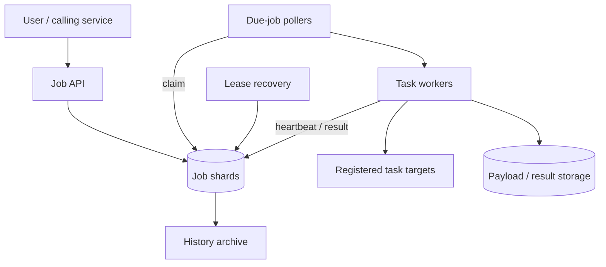
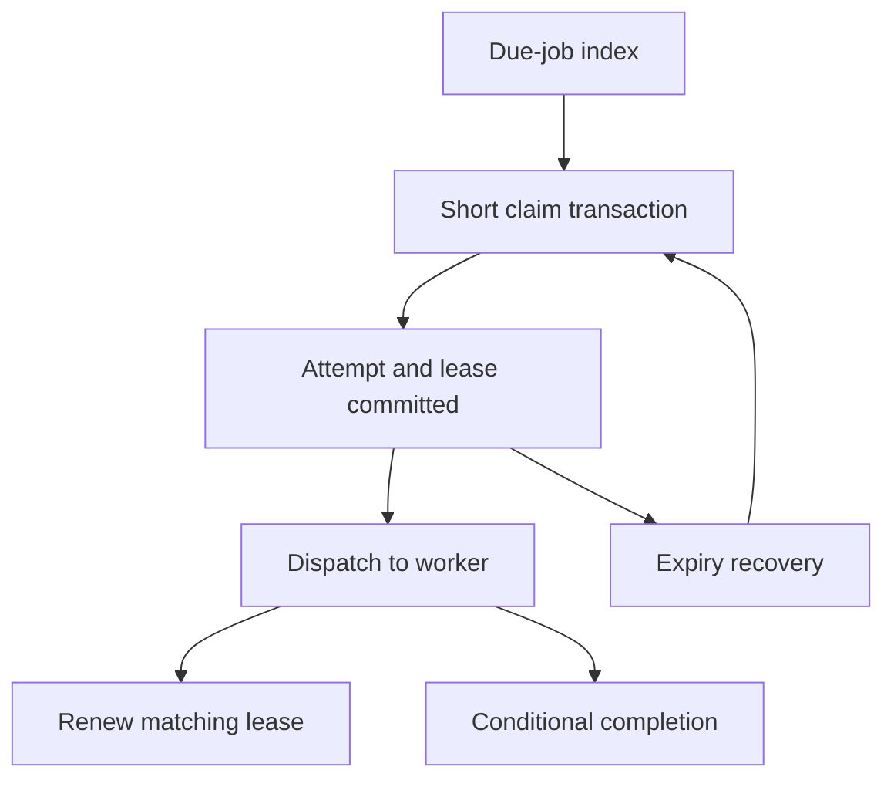

Design of a job scheduler that accepts work for a future time, executes it and records each attempt.

<!--more-->

## Problem

A service may need to send a reminder tomorrow or process a report after a delay. The scheduler stores that request durably and makes it eligible for execution when its scheduled time arrives.

Workers can fail during execution, and clients can retry submissions after losing a response. The design handles both cases through durable job state, retry-safe submission and explicit ownership of each execution attempt.

## Requirements

### Functional requirements

- **Schedule a job:** submit a registered task type, payload and execution time.
- **Cancel pending work:** cancel a job before a worker claims it.
- **Execute and retry:** run eligible jobs and retry transient failures within configured limits.
- **Inspect progress:** list jobs and read their status, attempt history and results.

Recurring schedules, task dependencies and preemption are outside this design.

### Non-functional requirements

Design targets:

- **Throughput:** 10K submissions/s and 10K starts/s, with separate capacity for retries.
- **Scheduling delay:** p95 below two seconds from the scheduled time to execution start under the admitted workload.
- **Availability:** 99.9% for submission and status APIs.
- **Durability:** acknowledged jobs survive a worker failure and a database-node failure within the configured replication model.
- **Execution:** at-least-once attempts; task handlers support idempotent external effects.
- **Isolation:** tenant quotas, bounded task runtimes and authenticated access to jobs.

## Back-of-the-envelope calculations

- **Daily volume:** 10K jobs/s × 86,400 ≈ 864M jobs/day.
- **History:** 864M × 30 days × 500 bytes ≈ 13 TB before attempt records, indexes and replicas.
- **Worker concurrency:** 10K starts/s × two seconds average runtime ≈ 20K active executions.
- **Claiming:** batches of 100 require at least 100 successful claims/s at that load; polls and retries add overhead.
- **Polling delay:** a one-second interval contributes roughly 0.5 seconds average waiting time before queueing and execution.

Partition the working set and archive terminal jobs; the workload is a sharded-system target, rather than a measured single-PostgreSQL capacity.

## Core entities

```protobuf
message Job {
  string job_id;
  string tenant_id;
  string task_type;
  string payload_key;
  Timestamp run_at;
  string status; // Scheduled, running, completed, failed or cancelled.
  int32 attempt_count;
  int32 max_attempts;
  string lease_token; // Identifies the current execution attempt.
  Timestamp lease_expires_at;
  string result_key;
}

message JobAttempt {
  string attempt_id;
  string job_id;
  string worker_id;
  Timestamp started_at;
  Timestamp finished_at;
  string outcome;
  string error_code;
}

message Submission {
  string tenant_id;
  string idempotency_key; // Unique together with tenant_id.
  string request_hash;
  string job_id;
}
```

The lease token changes for each attempt. Completion and heartbeat writes must match the current token.

## API

```yaml
schedule:
  method: POST
  path: /jobs
  headers: {Idempotency-Key: string}
  body: {task_type: string, payload: object, run_at: timestamp, max_attempts: integer}
  response: {job_id: string, status: scheduled}
  errors: {409: key_reused_with_different_request, 429: tenant_limit}

cancel:
  method: POST
  path: /jobs/{job_id}/cancel
  response: {job_id: string, status: cancelled}
  errors: {409: already_running_or_terminal}

status:
  method: GET
  path: /jobs/{job_id}
  response: {status: string, attempts: array, result_url: string}

list:
  method: GET
  path: /jobs
  query: {status: string, from: timestamp, to: timestamp, cursor: string}
```

The authenticated tenant scopes every request. Retrying an identical submission returns the existing job.

## High-level design

The API writes jobs to PostgreSQL. Pollers claim due jobs in short transactions and dispatch them to workers with available capacity. Heartbeats extend execution leases; recovery workers reschedule attempts whose leases expire.



## Storage

- **PostgreSQL shards:** Job and JobAttempt records, with a partial index on `(run_at, job_id)` for scheduled jobs and an index on lease expiry for running jobs. Tenant-scoped submission keys remain on the same shard as their jobs.
- **Object storage:** large immutable payloads and results referenced by key; keep access tenant-scoped.
- **History storage:** time-partitioned attempt records and terminal jobs, archived under a defined retention policy.
- **Redis, if needed:** rate-limit counters and cached status responses. PostgreSQL remains the authority for execution state.

The [PostgreSQL SKIP LOCKED mechanism](https://www.postgresql.org/docs/current/sql-select.html#SQL-FOR-UPDATE-SHARE) allows competing pollers to claim different rows. SQS or another durable queue is an alternative execution transport, but scheduled state and queue publication would then need an outbox and duplicate-safe consumers.

## From request to response

### Scheduling and cancellation

The API validates the task type, payload size, tenant quota and execution time. It writes the Job and Submission record in one transaction. A duplicate submission key returns the original job when the request hash matches; different input returns HTTP 409.

Cancellation uses a conditional update from scheduled to cancelled. A worker claim competes with that update in the database: whichever commits first determines whether the job can still be cancelled.

### Claiming and executing

A poller selects due jobs using row locks, assigns each a fresh lease token and attempt record, and commits before dispatching. Workers invoke only registered task handlers and report heartbeats while running.

A successful result transitions the job to completed only when its lease token still matches. A failed attempt either schedules a retry or marks the job failed after its attempt limit.

Polling all rows would become expensive as history grows. Partial indexes and archiving keep scans focused on due work; sharding and admission limits keep the execution backlog within worker capacity.

## Deep dives

### Claiming work across multiple pollers

**Problem.** Concurrent pollers may find the same due job.

**Options.** A single leader, a distributed lock per job, or transactional row claims. A leader simplifies ownership but adds failover coordination; individual distributed locks add another state system.

**Recommendation.** Use short PostgreSQL transactions with SKIP LOCKED. Claim only as much work as available workers can accept.

```sql
WITH due AS (
  SELECT job_id
  FROM jobs
  WHERE status = 'scheduled' AND run_at <= now()
  ORDER BY run_at, job_id
  FOR UPDATE SKIP LOCKED
  LIMIT 100
)
UPDATE jobs AS j
SET status = 'running',
    lease_token = gen_random_uuid(),
    lease_expires_at = now() + interval '30 seconds',
    attempt_count = attempt_count + 1
FROM due
WHERE j.job_id = due.job_id
RETURNING j.*;
```

Insert attempt records in the same transaction. A crash before commit releases the locks; a crash after commit leaves a lease for recovery. Tune batch size using transaction duration, database contention and dispatch delay.

**Claim, dispatch and completion.** The claim transaction assigns a fresh lease token and creates the attempt record before dispatch. Once committed, the scheduler sends the job ID and token to a worker. The worker completes only through a conditional update matching that token, so an older attempt cannot overwrite its replacement.



If dispatch fails after claim, the lease eventually expires and recovery requeues the job. This adds delay but preserves discoverability. Keep the claim batch no larger than available dispatch capacity: preclaiming thousands of jobs makes them appear running while they wait locally. Due-job scans and expiry scans use separate indexes and bounded pages. Under many tenants, per-tenant quotas prevent one large due backlog from consuming every claim.

### Preventing duplicate submissions

**Problem.** The job may be stored successfully even when the client receives a timeout.

**Options.** Compare payloads, accept duplicates or require an idempotency key. Payload equality alone can merge intentional repeated work.

**Recommendation.** Enforce a unique `(tenant_id, idempotency_key)` constraint and store a hash of the validated request. Concurrent submissions converge on one job; retries read that record and compare its hash.

Retain the mapping through the promised retry window. Document what happens after that window and keep keys tenant-scoped so a collision cannot expose another tenant's job.

**Submission race.** Two requests with the same tenant/key arrive together. Both validate and hash the canonical input. One inserts the job and idempotency mapping; the other's insert conflicts and reads the winner. Matching input returns the original job ID; changed input returns a conflict.

Do not use the payload hash as the job identity. A user can intentionally run identical work twice under different keys. Scope keys to the tenant and operation, and normalize only fields whose semantic equivalence is defined—silently dropping a parameter while hashing can merge different requests.

Store the job and mapping in the same shard transaction. After an ambiguous response, the client queries or retries that same key. If the promised retry window has expired, the API says that a new submission may create new work. Retaining terminal job history does not automatically retain a reusable idempotency contract forever.

### Recovering from worker failures

**Problem.** A worker may crash, lose connectivity or keep running after the scheduler has reassigned its job.

**Options.** A fixed execution timeout, renewable leases or a workflow engine with durable execution history. A fixed timeout is simpler for tightly bounded jobs but can reassign legitimate long-running work.

**Recommendation.** Use renewable leases and a separate maximum runtime. A recovery transaction checks the expired token, records the attempt outcome, and reschedules the job or marks it failed. Stale workers cannot update the new attempt's state.

A lease protects scheduler state; an external operation still needs an idempotency key based on the logical job and operation, rather than the attempt ID. After an ambiguous external timeout, query the target's operation status or retry with that same key. Track expired leases, rejected stale results and recovery delay.

**Expired lease and stale worker.** Attempt A holds token T1 and renews every ten seconds. Its network fails; the 30-second lease expires. Recovery conditionally marks T1 expired and reschedules the job. Attempt B later receives T2. When A eventually reports success with T1, the scheduler rejects it rather than replacing B's state.

The harder case is A having already called an external payment or email service. Use a stable logical operation ID, such as job ID plus operation name, across both attempts. Where supported, pass that identity to the external service and query its outcome after a timeout. Fencing only the scheduler database cannot retract an external side effect.

Heartbeat and completion requests compare the exact token and use server-side time. A maximum runtime bounds repeatedly renewed but stuck jobs. Keep expired-attempt evidence so operators can distinguish a failed process, a scheduler reassignment and an external outcome still awaiting reconciliation.

### Retrying without overloading dependencies

**Problem.** An outage can make thousands of jobs retry together.

**Options.** Fixed delays, exponential backoff or exponential backoff with jitter. Fixed delays synchronize retries; plain exponential backoff can preserve that synchronization.

**Recommendation.** Use capped backoff with full jitter, per-target concurrency limits and a retry budget, following the [AWS backoff-and-jitter guidance](https://aws.amazon.com/blogs/architecture/exponential-backoff-and-jitter/).

```python
def retry_delay(attempt, base_seconds=2, cap_seconds=300):
    ceiling = min(cap_seconds, base_seconds * 2 ** (attempt - 1))
    return random.uniform(0, ceiling)
```

Retry transient failures within the job's deadline; invalid payloads fail immediately. Persist the chosen next execution time. Track queue age by tenant and target, and reduce admission when healthy work is waiting behind retries.

**Retry scheduling and isolation.** For attempt four with a two-second base, the full-jitter ceiling is 16 seconds; persist one sampled next-run time rather than resampling on every scheduler scan. Respect a dependency's Retry-After and the job's overall deadline.

Separate first attempts from retries using quotas or fair queues. During a provider outage, a circuit breaker stops most calls and allows a small probe budget; queued work remains durable. Per-target concurrency limits bound the number of blocked workers, while per-tenant admission prevents a retrying tenant from starving others.

Classify errors before retrying. A temporary transport failure is different from invalid input, permission denial or a confirmed business rejection. When the deadline or attempt budget is exhausted, store the terminal reason and any unresolved external operation. Monitor queue age and successful completion rate by class; a falling queue length caused by permanent failures is not recovery.
