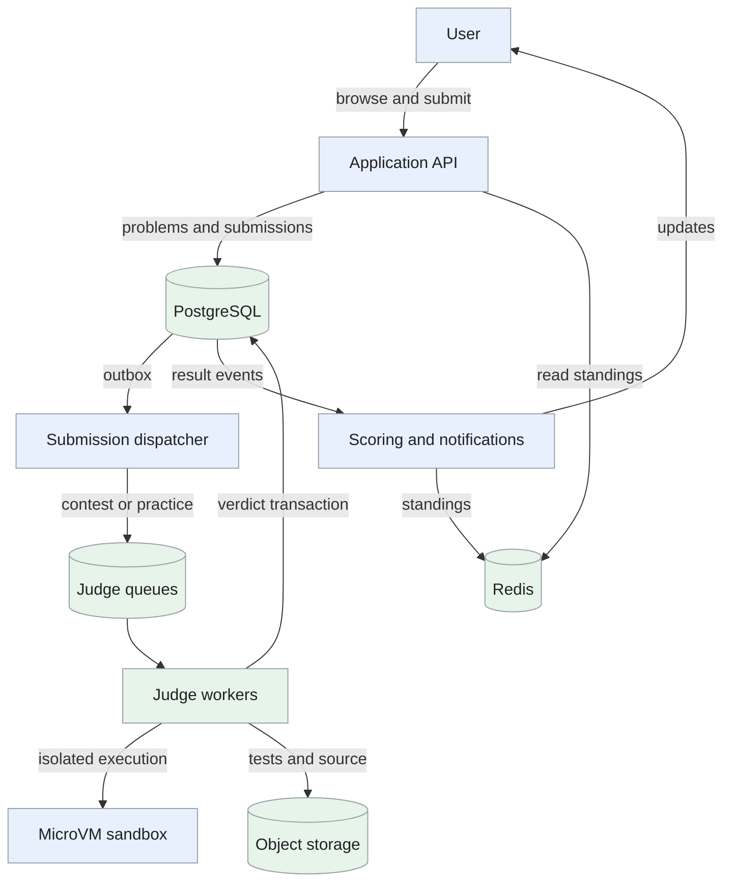
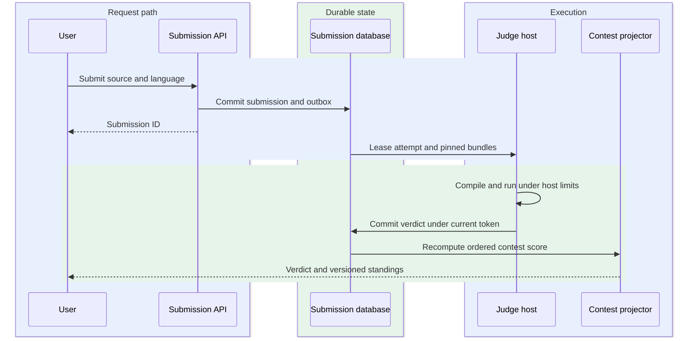
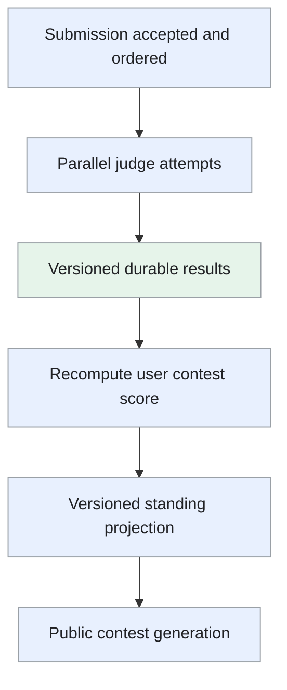

Design of an online coding platform with searchable problems, isolated solution judging and live contest standings.

<!--more-->

## Problem

Users browse programming problems, submit solutions and receive a verdict showing whether their code passes the test suite. During a timed contest, many users submit at once, and results must update the standings fairly.

The most sensitive operation is executing user-supplied code. The judge needs a strong isolation boundary, controlled resources and reproducible tests. Submission timing and contest scoring remain durable even when judging is delayed.

## Requirements

### Functional requirements

- **Find problems:** browse and search by difficulty, tags and acceptance rate.
- **Open a problem:** display its statement, examples, constraints and language-specific starter code.
- **Judge a solution:** compile and execute supported languages, then return verdict, runtime and memory usage.
- **Join contests:** register, submit within the contest window and view live standings.
- **Review submissions:** browse the user's source code and judging history.

### Non-functional requirements

- **Scale:** support 100K concurrent contestants, a modeled burst of 3.3K submissions/s and 20+ languages.
- **Latency:** target P95 submission-to-verdict within 5s for the standard test workload at provisioned capacity.
- **Isolation:** keep untrusted code outside the application hosts' trust boundary, with no application credentials or general network access.
- **Fairness:** score using durable server-side acceptance time, independent of judge completion order.
- **Reliability:** persist accepted submissions, retry failed judge attempts and apply each final result idempotently.
- **Freshness:** target standings updates within 1s of a committed verdict.

Discussion forums, subscriptions and plagiarism detection are outside this design.

## Back-of-the-envelope calculations

- **Contest burst:** 100K users × 2 submissions/min ÷ 60 ≈ 3,333 submissions/s.
- **Judge slots:** at an assumed 2s average execution time and 70% target utilization, the burst needs approximately 9,500 concurrent execution slots. Compile time and language mix affect this estimate.
- **Storage:** an assumed 50M submissions/day × 2KB metadata/source is 100GB/day, or 9TB for 90 days before indexes, replication and larger source files.
- **Standings:** 100K participants at 64B/entry is a 6.4MB payload floor. Redis data-structure overhead and per-problem scoring state increase actual memory.

## Core entities

```protobuf
message Problem {
  string problem_id;
  string title;
  string difficulty;
  repeated string tags;
  map<string, string> starter_code;
  string test_bundle_version;   // Immutable tests and checker configuration
}

message Submission {
  string submission_id;
  string user_id;
  string problem_id;
  string contest_id;
  string language_version;
  string source_object;
  Timestamp accepted_at;        // Server time used for contest scoring
  string verdict;               // queued, running, accepted, wrong_answer, limits, error
  int64 result_version;
}

message JudgeAttempt {
  string submission_id;
  int64 attempt_epoch;          // Fences an expired worker attempt
  Timestamp lease_expires_at;
  string worker_id;
}

message Contest {
  string contest_id;
  Timestamp starts_at;
  Timestamp ends_at;
  repeated string problem_ids;
  string scoring_rules_version;
}

message ContestScore {
  string contest_id;
  string user_id;
  int32 solved;
  int64 penalty_seconds;
  int64 version;
}
```

## API

```yaml
GET /problems:
  query: [difficulty, tags, cursor, limit]

GET /problems/{problem_id}:
  query: [language]
  response: [statement, examples, constraints, starter_code]

POST /submissions:
  headers: {Idempotency-Key: string}
  body: [problem_id, language, source_code, contest_id]
  response: {status: 202, submission_id: string, state: queued}

GET /submissions/{submission_id}:
  response: [state, verdict, runtime_ms, memory_kb, result_version]

GET /submissions:
  query: [problem_id, cursor, limit]
  access: current user's submissions

POST /contests/{contest_id}/register:
  response: idempotent registration

GET /contests/{contest_id}/leaderboard:
  query: [cursor, limit]
  response: [standings, as_of, provisional]

WS /submissions/{submission_id}/updates:
  event: versioned verdict notification
```

Hidden tests and expected outputs remain on the judging side. Notifications supplement the durable status endpoint.

## High-level design

The submission service stores accepted work with an outbox. Dispatchers publish it to separate contest and practice queues. Judge workers claim leased attempts, run isolated executions and commit results. Scoring workers project those results into cached standings.



## Storage

- **[PostgreSQL](/designs/tech-postgresql/):** owns problems, submissions, contests, registrations, results and outbox rows. Use `(user_id, accepted_at, submission_id)` for history and a unique user/idempotency-key record for submission retries.
- **Submission partitions:** time partitioning supports retention and recent-history scans. A separate unpartitioned identity registry or a partition-aware key enforces submission identity; a global unique index cannot simply omit the partition key.
- **Object storage:** contains source archives and immutable test/checker bundles. Workers verify bundle versions and cache approved tests locally. Cold archives need an explicit retrieval service rather than assuming `postgres_fdw` reads object storage directly.
- **[Kafka](/designs/tech-kafka/) or another durable work queue:** absorbs bursts and redelivers work after failures. Contest and practice pools have reserved capacity and separate backlog metrics.
- **[Redis](/designs/tech-redis/):** stores versioned contest score projections and sorted sets. Durable results can rebuild standings; the cache is not the authority for contest eligibility or accepted submissions.

## From request to response

### One end-to-end request

The submission ID is returned after durable acceptance, before code execution.



The trusted judge leases an attempt and runs pinned artifacts in a disposable sandbox; only its current attempt token can commit a verdict and update standings.

### Browsing and submitting a solution

The problem service filters a small catalog in PostgreSQL, using indexes for tags and difficulty. It returns the chosen language's starter code and public examples. Hidden test bundles are accessible only to the judge control plane.

On submission, the API validates size, language, problem availability and contest registration. It checks the contest deadline using server time in the durable acceptance transaction. The transaction inserts the submission and an outbox row, then the API returns `202`.

The outbox dispatcher publishes later and may publish again after a crash. A database transaction encloses database writes only; it does not also commit a Kafka publication. Workers therefore recognize submissions by ID.

### Running the judge

A worker atomically claims a queued submission or an expired attempt, incrementing its attempt epoch. It obtains a clean sandbox from the approved language image, compiles the code and runs the versioned tests under limits.

The worker records compile errors, wrong answers, time limits, memory limits or successful execution. Infrastructure failures remain retryable judge errors rather than a wrong-answer verdict. The final-result transaction checks the attempt epoch, stores measurements and emits a result event.

Queue wait, compilation and execution all contribute to response time. Warm pools and contest capacity reservations address the burst; a stale worker cannot overwrite a newer result.

### Updating contest standings

A scoring worker reads committed results in each user's server-accepted submission order. It determines the first successful submission for each problem and counts eligible wrong attempts according to the contest rules.

A later-completing early submission can change the score. The worker recomputes the user's projection and publishes a higher score version. Redis accepts only newer versions. The leaderboard sorts by solved problems and penalty, with an explicit tie rule.

A notification can be missed during disconnect. The client reads the current result or standings snapshot on reconnect rather than relying on Pub/Sub history.

### Reading submission history

History queries are limited to the authenticated user and use cursor pagination over acceptance time and submission ID. The source object and verdict reference the same submission version. Older archived submissions display retrieval state rather than appearing to be missing.

## Deep dives

### What isolation should the judge use?

**Problem.** Submitted programs can exhaust resources, probe the environment or exploit runtime vulnerabilities. Compilers are also processing untrusted input.

| Approach | Strength | Tradeoff |
| --- | --- | --- |
| Ordinary containers | Fast startup and familiar tools | Share the host kernel |
| User-space kernel sandbox | Reduces direct host-kernel interaction | Compatibility and performance depend on workload |
| MicroVMs | Separate guest kernel and hardware virtualization | Requires host hardening and image/pool operations |

- **Ordinary containers:** isolate processes/files while sharing the host kernel. Startup and tooling are familiar, but a kernel exploit from untrusted code threatens other executions and host state.
- **User-space kernel sandbox:** intercept guest system calls through a restricted implementation. Host-kernel exposure is reduced; compiler/runtime compatibility and syscall-heavy performance depend on the selected sandbox.
- **MicroVMs:** execute inside a separate guest kernel using hardware virtualization. The boundary suits hostile submissions, but clean images, patched KVM/hosts, pool startup and bounded result channels require dedicated operations.

**Recommendation:** compile and execute in disposable Firecracker microVMs on dedicated judge hosts. Follow the project's [production host setup](https://github.com/firecracker-microvm/firecracker/blob/main/docs/prod-host-setup.md), use the jailer and keep the host, KVM, guest kernel and language images patched. Disposable Firecracker microVMs fit intentionally untrusted code better than a convenience container boundary. We accept dedicated host/image operations and prewarm cost; host-enforced resource and network limits remain necessary even with virtualization.

The trusted host controls VM resources, egress and deadlines. Guest-side restrictions are additional defense, not the enforcement boundary after a guest compromise. Give the guest only its input and required files; compare output with hidden expected results in the trusted judge control plane. Authenticate result channels and cap output bytes.

```text
Trusted judge host
  ├─ validates test/checker version
  ├─ limits VM resources and elapsed time
  ├─ compares captured output
  └─ disposable microVM
       ├─ untrusted compiler and solution
       └─ isolated scratch disk
```

Use [cgroup v2](https://docs.kernel.org/admin-guide/cgroup-v2.html) for host resource controls and a host watchdog for total time budgets. CPU bandwidth throttling is different from a total CPU-time deadline. Guest process limits alone do not enforce a budget for the whole VM.

Restore only pristine, approved snapshots; regenerate guest identity and randomness where required. Discard execution disks and process state after each submission. Test fork bombs, excessive output, network probes and compiler crashes; monitor suspicious exits and isolate affected hosts. Hardware virtualization reduces attack exposure but is not an absolute escape-proof guarantee.

**Trusted control plane and disposable execution.** The scheduler leases submission S with attempt token T. A trusted host verifies the source/test/checker bundle versions, creates an isolated VM from a clean approved image, and runs compilation and solution execution under host-enforced resource limits.

Transfer only required inputs to the guest. Capture output through bounded channels and evaluate it with the trusted checker; hidden expected outputs stay outside the untrusted environment. Apply limits to compilation as well as execution, including elapsed time, memory, disk and output.

The result identifies S, T and every bundle version. The database accepts it only if T still owns the attempt. After a crash, another host may execute S again; the fenced result commit prevents duplicate score application. Destroy per-submission disks and state instead of recycling a possibly compromised guest into the next user's execution. Isolation also requires patching and resource controls on the host, not just a VM boundary.

### How can standings stay correct when results arrive out of order?

**Problem.** A slow early submission can finish after a fast later one. Scoring in completion order could select the wrong solve time or penalty.

- **Serialize judging per user:** finish one submission before running the next. Completion order follows acceptance, but one slow program delays all later feedback for that user.
- **Increment counters on completion:** update solves/penalties as verdicts arrive. Processing is cheap, but an earlier failed submission arriving later can change the correct first-solve penalty and duplicate deliveries can drift totals.
- **Versioned projection from ordered submissions:** recompute a user's score from durable acceptance order and result versions. Rejudges and late verdicts produce reproducible standings; reads are provisional while judging remains incomplete and projection work must be bounded.

**Recommendation:** derive the score from durable acceptance order. Judge executions can run independently, while each user's contest projection is recomputed when relevant results change. Publish solved count, penalty and projection version together. Versioned projections fit parallel judging and rejudges while preserving contest rules based on submission order. We accept brief standings lag and provisional labels rather than serializing execution or treating completion order as contest order.

For a bounded contest rule, an integer score such as `solved × M - penalty` fits a Redis sorted set if M exceeds maximum penalty and the largest value remains within exact integer precision of the double score. Keep tie-breaking in explicit fields or a deterministic member ordering; avoid arbitrary fractional hash adjustments.

A rebuild reads the same durable records and replaces the cache through a new generation. Show standings as provisional until all eligible submissions and rejudges complete. Monitor projection lag, missing results and rebuild duration.

**Out-of-order results example.** A user submits at 10:01 and 10:02. The 10:02 submission finishes first and is accepted; the earlier one later reports wrong answer. Under a contest policy charging failed attempts before the first accepted submission, the score must include that 10:01 failure even though it completed later.

Compute from submissions ordered by durable acceptance time/sequence, not judge completion time. Rejudging one result creates a new result version and recomputes the affected user's projection from those ordered records.



Publish the user's whole solved/penalty state conditionally by projection version. Replaying an older projection cannot restore the wrong score. Contest freeze and disclosure policy apply at response assembly, while the authority retains the complete underlying records.

### How should capacity handle a contest burst?

**Problem.** Reactive scaling can arrive after the first submission wave. A queue prevents loss but cannot guarantee a short verdict time without sufficient execution capacity.

- **Reactive scaling:** start workers after queue age or load rises. Idle cost is low, but image startup arrives after a synchronized contest wave and early users wait.
- **Prewarm the full peak:** reserve all expected capacity before the event. Initial latency is predictable if the estimate is right; unused slots and language-specific pools cost money.
- **Scheduled reserve plus queue-age scaling:** prewarm the modeled baseline, retain practice capacity and scale additional slots from queued work. This balances startup and cost; forecasts can still miss the peak, so admission limits and explicit overload remain necessary.

**Recommendation:** prewarm the modeled contest capacity before the event, including language images and test bundles. Then scale from oldest queued age, execution duration and free slots. Maintain a practice reservation so one contest does not indefinitely starve ordinary users. Scheduled prewarming fits known contest start times, while queue-age scaling handles uncertain submission mix. We accept reserved idle capacity before the event and a bounded queue when demand exceeds the verified pool.

```text
Required slots ≈ arrival rate × average occupied time / target utilization
Queue delay ≈ queued work / available processing rate
```

Drain workers before scale-down and let expired leases recover interrupted attempts. A fenced result write handles duplicate execution during recovery. When capacity is exhausted, show queue status and retain the original acceptance time. Measure submission-to-verdict separately from execution time, and load-test the actual language and test-suite mix.

**Capacity calculation and drain.** If the burst is 50 submissions/s and each occupies a slot for four seconds on average, 200 slots are needed at 100% utilization. At a target of 70%, plan roughly 286 slots before considering the language/test mix and tail duration. A queue absorbs variance; it does not create compute capacity.

Prewarm approved language images and bundles before scheduled contests. Scale from oldest queued age and estimated queued work, not only CPU utilization—workers waiting on startup or I/O can leave CPU low while users wait.

Reserve practice capacity and enforce per-user/contest submission limits. Scale-down first marks a host draining, stops new leases and lets existing attempts finish. A forced termination expires its attempt token and requeues safely. Record verdict latency from API acceptance so waiting time is visible alongside actual compile and run time.
