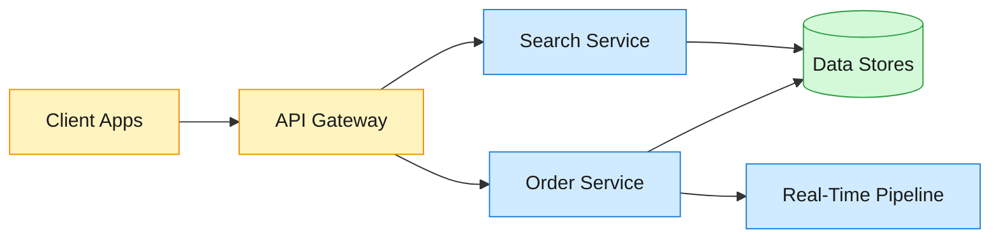
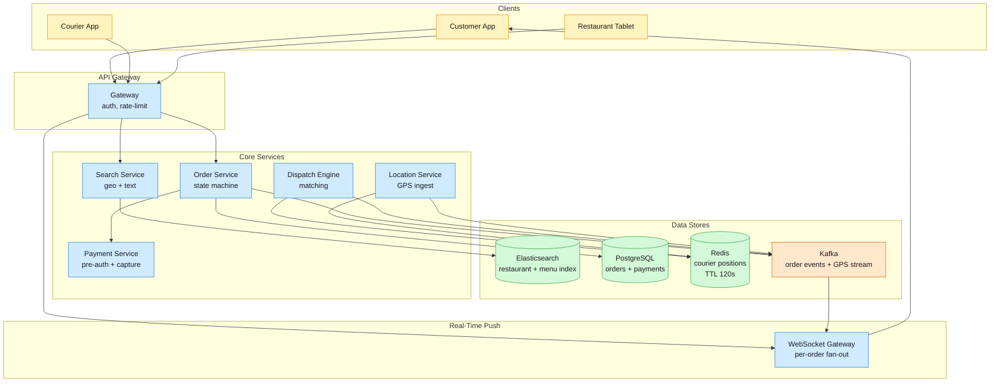
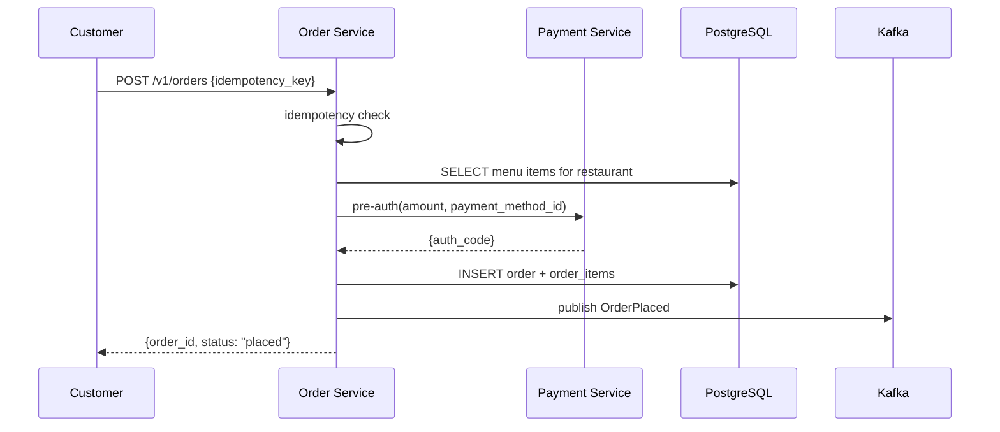

Local Delivery connects customers, restaurants, and couriers in a three-sided marketplace — a customer opens the app, searches for restaurants near their address, builds a cart from a live menu, and checks out.

<!--more-->

## 1. Problem

Local Delivery connects customers, restaurants, and couriers in a three-sided marketplace — a customer opens the app, searches for restaurants near their address, builds a cart from a live menu, and checks out. The system reserves the order, charges payment, notifies the restaurant, dispatches a nearby courier, and streams the courier's real-time GPS position to the customer with a continuously updated ETA. At scale, ~2M orders flow daily with ~100K couriers active at peak, each pinging GPS every 4 seconds. The core tension is coordinating three independent actors — a restaurant that may reject or delay an order, a courier whose position is stale seconds after it's reported, and a customer watching a countdown — with strong consistency where money and inventory are involved and eventual consistency everywhere else.



## 2. Requirements

**Functional**

- FR1: Browse restaurants and menus filtered by delivery address, with real-time availability
- FR2: Place a multi-item order with payment and idempotent submission
- FR3: Dispatch a courier to the restaurant after the order is accepted
- FR4: Track courier location on a map in real time during delivery
- FR5: View predicted delivery ETA that updates as the order progresses
- FR6: View order history and re-order from past purchases

**Non-functional**

- NFR1: Catalog reads with geo-filtering return p95 under 200 ms
- NFR2: Order placement is strongly consistent — no double-charge or oversell
- NFR3: Courier location updates visible to the customer within 3 seconds
- NFR4: 99.95% availability during peak meal hours (11am–2pm and 5pm–9pm local)

*Out of scope: restaurant onboarding and menu management, courier onboarding and payouts, promotional pricing, surge/dynamic pricing, fraud detection, and customer support tooling.*

## 3. Back of the envelope

- **Read QPS:** 2M DAU × 5 page loads/session ÷ 86,400 s ≈ 116 QPS average, ~350 at peak → the browse path is read-heavy but the absolute QPS is modest; a well-indexed search cluster absorbs it.
- **Write QPS:** 2M orders/day ÷ 86,400 s × 3x peak multiplier ≈ 70 order writes/s at peak → single-node PostgreSQL handles this comfortably; the write path is not the bottleneck.
- **GPS volume:** 100K active couriers × 1 ping/4s ≈ 25K location writes/s sustained, 3–5× at dinner rush → raw GPS ingest is the throughput bottleneck; the location store must handle ~75K–125K writes/s at peak with sub-millisecond latency.

## 4. Entities

```
Restaurant {
  restaurant_id:  uuid     PK
  name:           string
  geo_hash:       string            ← GeoHash-7 prefix for spatial index
  center_lat:     float
  center_lon:     float
  delivery_radius_mi: decimal(3,1)
  status:         enum              ← active | paused | closed
}

MenuItem {
  item_id:        uuid     PK
  restaurant_id:  uuid     FK
  name:           string
  category:       enum
  unit_price_cents: bigint
  is_available:   boolean
  is_active:       boolean           ← soft-delete when removed from menu
}

Order {
  order_id:       uuid     PK       ← client-generated for idempotency
  user_id:        uuid     CK       ← partition key for user-scoped queries
  restaurant_id:  uuid     FK
  courier_id:     uuid?
  status:         enum              ← placed | accepted | preparing | ready | picked_up | en_route | delivered | cancelled
  subtotal_cents: bigint
  total_cents:    bigint
  delivery_address: jsonb
  created_at:     timestamp
}

OrderItem {
  order_id:       uuid     PK
  item_id:        uuid     PK
  quantity:       smallint
  unit_price_cents: bigint          ← snapshot at checkout
}

Courier {
  courier_id:     uuid     PK
  status:         enum              ← available | busy | offline
  current_lat:    float
  current_lon:    float
  last_ping_at:   timestamp
  vehicle_type:   enum
}
```

### API

- `GET /v1/search?lat=...&lon=...&q=...&category=...` — browse restaurants and menus near an address; returns ranked restaurant list with distance and ETA
- `GET /v1/restaurants/{id}/menu` — full menu with real-time item availability
- `POST /v1/orders` — place an order; body includes items, delivery address, payment method; returns `order_id`
- `GET /v1/orders/{id}` — current order status, line items, courier position, and ETA
- `POST /v1/orders/{id}/cancel` — cancel before the restaurant accepts; releases payment hold
- `GET /v1/orders/{id}/track` — SSE stream of courier location and status updates
- `GET /v1/orders?user_id=...&page=...` — order history for a user

## 5. High-Level Design



#### FR1: Browse restaurants and menus by delivery address

- **Components:** Customer App → Gateway → Search Service → Elasticsearch → ranked results.
- **Flow:**
  1. Customer opens the app; the client sends `GET /v1/search?lat=39.95&lon=-75.16&q=thai&category=dinner`.
  1. Search Service builds a geo-filtered Elasticsearch query: a `geo_distance` filter (3 mi radius from user) + `multi_match` across `restaurant.name`, `menu_item.name`, and `cuisine` tags.
  1. Elasticsearch returns `restaurant_id` + relevance score + distance. Search Service bulk-fetches availability from Redis (`HMGET restaurant:{id}:availability item:...`) and attaches an availability flag per restaurant.
  1. Results are ranked: open restaurants with available items rank above closed or fully-booked ones. The response includes ETA estimates from a cached routing table.
- **Design consideration:** The geo-prefix scan narrows the search space before full-text scoring. Each restaurant is indexed with a GeoHash-5 prefix (~2.4 km cell) so a 3-mile radius query hits at most 9 adjacent cells. This keeps the per-query doc count under ~200 restaurants even in dense urban cores, so full-text relevance scoring stays fast. The search index is rebuilt nightly via Spark batch and supplemented with a Kafka CDC stream for real-time menu changes (price updates, 86'd items).

#### FR2: Place a multi-item order with payment

- **Components:** Customer App → Gateway → Order Service → PostgreSQL (order + payment) → Payment Service → Kafka.
- **Flow:**
  1. Customer submits `POST /v1/orders` with `{restaurant_id, items: [{item_id, quantity}], delivery_address, payment_method_id, idempotency_key}`. The client generates `idempotency_key` as a UUIDv4.
  1. Order Service checks idempotency: `SELECT status FROM orders WHERE idempotency_key = $key`. If found, return the existing order state — no reprocessing.
  1. Order Service validates the cart against the menu (item exists, currently available, price unchanged) via a single `SELECT ... WHERE restaurant_id = $rid AND item_id = ANY($item_ids)`.
  1. Order Service calls Payment Service: `POST /v1/payments/pre-auth` with `{amount_cents, payment_method_id, idempotency_key}`. Payment Service proxies to the payment gateway with the `Idempotency-Key` header.
  1. On successful pre-auth, Order Service inserts the `Order` + `OrderItem` rows in a single transaction and publishes `OrderPlaced` to Kafka. The restaurant tablet receives a push notification.
  1. Response: `{order_id, status: "placed", estimated_delivery: "..."}`.



- **Design consideration:** The idempotency key is the load-bearing mechanism for exactly-once order creation. If the client's POST times out and it retries, the second request hits the idempotency check and returns the existing order state — no duplicate charge, no duplicate order. The key is stored on the `Order` row with a `UNIQUE` constraint, and the check + insert happen in the same transaction as the order write so there is no window for a race.

#### FR3: Dispatch a courier to the restaurant

- **Components:** Dispatch Engine → Redis (courier positions) → scoring → push notification → Courier App.
- **Flow:**
  1. Dispatch Engine consumes `OrderPlaced` from Kafka. It waits for the restaurant to accept (via a `RestaurantAccepted` event) — if the restaurant rejects, the order is cancelled and payment voided.
  1. On `RestaurantAccepted`, Dispatch Engine queries Redis for nearby available couriers: `GEOSEARCH couriers:locations FROMLONLAT <restaurant_lon> <restaurant_lat> BYRADIUS 3 km ASC COUNT 20`.
  1. For each candidate, the engine computes a score from travel distance, courier rating, and historical acceptance probability. It sends an offer push notification to the top-ranked courier.
  1. The courier has 30 seconds to accept. On accept: order `status` advances to `accepted`, `courier_id` is set, the courier's status changes to `busy`, and `CourierAssigned` is published to Kafka.
  1. On decline or timeout: the engine offers to the next candidate. If all 20 decline or time out, the search radius expands to 5 km and the process repeats.
- **Design consideration:** Dispatch latency is the hardest constraint — the matching loop must complete within 3 seconds from restaurant acceptance so the customer sees a timely ETA. A pure round-robin offer (one courier at a time with 30s windows) would take minutes to exhaust 20 candidates. The practical approach: batch-offer the top 3 couriers simultaneously with a 30-second window and pick the first acceptor. Race condition guard: a Redis `SETNX courier_lock:{courier_id}` with 60s TTL prevents the same courier from accepting two offers concurrently.

#### FR4: Track courier location in real time

- **Components:** Courier App → Location Service → Redis (position store) → Kafka (GPS stream) → WebSocket Gateway → Customer App.
- **Flow:**
  1. Courier App sends GPS pings every 4 seconds over a persistent WebSocket to the Location Service.
  1. Location Service writes each ping to Redis: `GEOADD couriers:locations <lon> <lat> <courier_id>` with a 120s TTL. If the courier has an active delivery, the ping is also published to `courier.location.{order_id}` in Kafka.
  1. A stream processor consumes the Kafka topic, updates the ETA model (FR5), and forwards the sanitized location to the WebSocket Gateway.
  1. The WebSocket Gateway pushes the location update to the customer's open SSE connection at `GET /v1/orders/{id}/track`. The gateway uses consistent hashing on `order_id` so a given order's updates always route to the same gateway node.
- **Design consideration:** WebSocket push inverts the fan-out cost. Without push, every customer would poll for courier location every few seconds — read load scales as O(active customers × ping frequency). With push, one courier ping produces one push to one watching customer: O(active couriers). At 100K couriers each with ~1 active delivery at peak, the push path handles ~25K messages/s — a single Kafka partition per order keeps the stream ordered per delivery.

#### FR5: View predicted ETA that updates as the order progresses

- **Components:** ETA Service → Redis (prep-time cache) + OSRM (travel time) → Order Service → Customer App.
- **Flow:**
  1. At order placement, ETA Service computes an initial estimate: `base_prep_time(restaurant_id, item_count, hour) + travel_time(restaurant → delivery_address)`.
  1. Prep time is a rolling median from the last 30 days of completed orders at that restaurant, keyed in Redis as `restaurant:{id}:prep_median`, refreshed hourly.
  1. Travel time is queried from OSRM (OpenStreetMap routing) at order placement and re-queried every 60 seconds while the courier is en route.
  1. When the courier is assigned (FR3), the ETA updates to `remaining_prep_time + travel(restaurant → courier) + travel(courier → customer)`. Each status transition (preparing → ready → picked_up → en_route) triggers a recalculation.
  1. The updated ETA is published to the order's SSE stream alongside location updates.
- **Design consideration:** OSRM is called on order placement and during active delivery only — not on every browse query. At 70 orders/s peak, that's ~70 table queries/s at placement plus another ~70/s for en-route recalculations, well within a single OSRM instance's capacity (~1,000 table queries/s on a loaded graph). The OSRM instance is pre-loaded with OpenStreetMap data for the service region and refreshed weekly.

#### FR6: View order history and re-order from past purchases

- **Components:** Customer App → Order Service → PostgreSQL → response.
- **Flow:**
  1. `GET /v1/orders?user_id=<id>&page=1&limit=20` queries the Order table scoped to the user's partition (`user_id`), ordered by `created_at DESC`.
  1. For re-order: `POST /v1/orders/reorder/{order_id}`. Order Service reads the previous `OrderItem` rows, maps them to current menu availability at the original restaurant, and creates a new order via the FR2 flow. Items that are discontinued or unavailable are flagged in the response so the app can surface them before checkout.
- **Design consideration:** Re-order is a convenience shortcut, not a guarantee. The service redirects through the standard FR2 checkout path (idempotency key, payment pre-auth, menu validation) rather than replicating the logic. This keeps a single code path for order creation.

## 6. Deep dives

### DD1: Dispatch engine — candidate generation, scoring, and offer concurrency

**Problem.** The dispatch engine must match a newly accepted order to the best available courier among ~100K active couriers across a metro area. It must balance delivery speed (shortest ETA) against marketplace efficiency (batching multiple orders on one route) and courier fairness (idle couriers shouldn't be starved). The entire matching loop must complete within 3 seconds from restaurant acceptance, and no courier may be offered the same order twice concurrently.

**Approach 1: Full scan with Haversine filter and greedy assignment**

Scan every available courier's position, compute straight-line distance to the restaurant, rank by distance, and offer to the closest.

```javascript
candidates = [c for c in active_couriers if haversine(c.pos, restaurant.pos) < 5_km]
candidates.sort(key=lambda c: haversine(c.pos, restaurant.pos))
offer(candidates[0])
```

**Challenges:** A full scan of 100K courier positions per dispatch event is O(N) — at peak dinner rush with hundreds of concurrent orders, this saturates the CPU. Straight-line distance ignores road networks, river crossings, and one-way streets, so the "closest" courier by Haversine may be 8 minutes away by road while another courier 500m farther by air is 3 minutes away. Greedy assignment (one order at a time) misses multi-order batching opportunities that improve courier efficiency by 15–30%.

**Approach 2: H3 geo-index with ML scoring**

Pre-partition courier positions into H3 hex cells at resolution 9 (~0.1 km² per cell, ~200 m edge). On dispatch, compute the restaurant's H3 cell, expand by k-ring (k=0..3 → up to 37 cells), and collect couriers within those cells. Score each candidate with an ML model, then offer to the top-ranked courier.

```javascript
restaurant_hex = h3.latlng_to_cell(restaurant.lat, restaurant.lon, 9)
candidate_cells = h3.grid_disk(restaurant_hex, 3)
candidates = redis.sunion([f"h3:{cell}:available" for cell in candidate_cells])

for courier in candidates:
    score = (w1 * travel_time_estimate(courier, restaurant)
           + w2 * acceptance_probability(courier, order)
           + w3 * courier_utilization(courier))
offer(best_scored)
```

```sql
-- Courier position write on each GPS ping
GEOADD couriers:locations <lon> <lat> <courier_id>
SADD h3:{hex}:available <courier_id>
EXPIRE h3:{hex}:available 120

-- Candidate generation on dispatch
SMEMBERS h3:{hex_0}:available
SMEMBERS h3:{hex_1}:available
...
```

**Challenges:** H3 indexing reduces the candidate pool from 100K to ~200 per dispatch event — fast enough. But individual offer-and-wait (one courier at a time, 30s per offer) means exhausting 10 declines takes 5 minutes. The scoring function depends on real-time features (traffic, courier workload) that change between the score computation and the offer acceptance — stale scores produce suboptimal matches.

**Approach 3: Batch-offer with concurrency guard and MIP optimization**

Batch-offer the top 3 couriers simultaneously with a 30-second acceptance window. Use a Redis lock (`SETNX`) to prevent double-assignment. For dense markets, formulate dispatch as a Mixed-Integer Program that matches multiple orders to couriers in one optimization window.

```javascript
-- Lock courier during offer window
SETNX courier_lock:{courier_id} {order_id}
EXPIRE courier_lock:{courier_id} 60

-- On accept: validate lock owner
if redis.GET("courier_lock:{courier_id}") == order_id:
    UPDATE orders SET courier_id = {courier_id}, status = 'accepted'
    DEL courier_lock:{courier_id}
```

**MIP formulation (for dense markets, solved via Gurobi):**

```javascript
Variables:
  x[d,o] in {0,1}  -- courier d assigned to order o
  b[d,O] in {0,1}  -- courier d assigned to batch O (up to 2 orders per batch)

Objective:
  max sum score(d,o) * x[d,o] + sum batch_score(d,O) * b[d,O]

Constraints:
  sum_d x[d,o] <= 1   for all o       -- each order to at most 1 courier
  sum_o x[d,o] <= 2   for all d       -- max 2 active orders per courier
```

The MIP runs periodically (every 10–30 seconds per region) and solves the "strategic delay" decision: hold an order a few seconds if a better courier is about to free up.

**Decision:** Batch-offer with Redis locking for the common case; MIP optimization for dense metro regions where batching delivers 15–30% courier efficiency gains.

**Rationale:** The batch-offer approach completes the full matching loop in ~2 seconds (score → offer top 3 → first-acceptor-wins). The Redis `SETNX` lock is validated server-side at order assignment time — a courier whose lock expired between acceptance and the database write is rejected by `SELECT ... WHERE courier_id IS NULL FOR UPDATE`, and the offer cascades to the next courier. The MIP layer is gated behind a market-density threshold — in sparse suburban regions, the greedy batch-offer is sufficient and avoids the operational cost of running a Gurobi solver.

> [!TIP]
> **Why not Redis Redlock for courier assignment?** Redlock (distributed lock across multiple Redis nodes) adds latency and complexity for a lock that must be validated against the order's database state. The `SETNX` single-node lock with server-side `SELECT ... FOR UPDATE` re-validation gives us the same protection — the order row is the ultimate arbiter of who gets it, not the Redis lock. At 70 assignments/s peak, a single Redis node handles the lock throughput with sub-millisecond latency.

**Edge cases:**

- **Courier app crashes after accepting but before the order write:** The order stays unassigned. The Dispatch Engine's reconciliation job (every 30 seconds) detects orders in `accepted` status older than 45 seconds with no `courier_id` and re-dispatches.
- **Two couriers accept the same offer in the same millisecond:** `SETNX` is atomic — only the first write succeeds. The second courier sees the lock is held and their acceptance is rejected.
- **All 20 candidates decline:** The search radius expands to 5 km and the cycle repeats. If no courier accepts within 3 cycles, the order is flagged for manual dispatch and the customer sees an adjusted ETA.

### DD2: Real-time GPS pipeline — 25K writes/s with sub-3-second visibility

**Problem.** 100K couriers each pinging GPS every 4 seconds produces ~25K location writes/s sustained and ~75K–125K/s at dinner rush peaks. Each ping must update the courier's position for dispatch (millisecond-latency reads) and stream to the one customer watching that delivery (sub-3-second end-to-end visibility). A dropped ping means a stale position for dispatch.

**Approach 1: Direct Redis writes with HTTP polling**

Courier App sends `POST /v1/location` with `{courier_id, lat, lon}`. Location Service writes to Redis directly. Customer App polls `GET /v1/orders/{id}/location` every 4 seconds.

**Challenges:** HTTP is connection-heavy — 25K new TCP+TLS handshakes per second at the ingestion layer. Customer-side polling multiplies read load: 500K active customers × 1 poll/4s = 125K reads/s on the location store, most returning unchanged data. Polling also adds up-to-4-seconds of inherent visibility lag.

**Approach 2: WebSocket ingestion + Kafka pipeline with Redis state store**

Courier App maintains a persistent WebSocket to the Location Ingestion Gateway. The gateway validates the payload, stamps a server timestamp, and produces to `courier.location.raw` (Kafka topic, partitioned by `courier_id`). A stream processor consumes each event and performs three writes atomically:

```java
void process(CourierLocation event) {
    // 1. Update Redis geospatial index
    redis.geoAdd("couriers:locations", event.lon, event.lat, event.courierId);
    redis.expire("couriers:locations", 120);

    // 2. Update H3 cell membership
    String hex = h3.latLngToCell(event.lat, event.lon, 9);
    redis.sAdd("h3:" + hex + ":available", event.courierId);
    redis.expire("h3:" + hex + ":available", 120);

    // 3. If courier has an active order, fan out to customer push
    String orderId = redis.get("courier:active_order:" + event.courierId);
    if (orderId != null) {
        kafka.produce("courier.location." + orderId, event.toSanitized());
    }
}
```

The WebSocket Gateway cluster subscribes to per-order Kafka topics and pushes to the customer's SSE connection. Each gateway node handles ~50K concurrent connections with consistent hashing on `order_id` for sticky routing.

**Decision:** WebSocket ingestion + Kafka pipeline + Redis state store. Redis serves the hot dispatch path (sub-millisecond `GEOSEARCH`). Kafka provides durability and ordered replay for the streaming pipeline.

**Rationale:** Partitioning the raw GPS topic by `courier_id` ensures a single courier's pings are processed in order — a later ping cannot overtake an earlier one and produce a backwards-jumping position on the customer's map. The 120s TTL on Redis keys is the safety net: if a courier's phone dies mid-delivery, their position ages out automatically and dispatch stops considering them. The WebSocket Gateway's consistent hashing keeps a single order's entire location stream pinned to one node, so the node can buffer the last known position and serve it immediately to a reconnecting customer.

> [!TIP]
> **Key insight:** The Redis write and Kafka produce are not atomic — if the stream processor crashes between them, the courier's position is in Kafka but not in Redis (or vice versa). The fix: Redis is the authoritative position store for dispatch because it carries a TTL — a missing position means "don't dispatch to this courier," which is the safe failure mode. Kafka is the durable replay log for the push pipeline. The two systems serve different readers with different consistency needs.

**Edge cases:**

- **Connection storm after gateway restart:** 100K courier apps reconnect simultaneously. The gateway applies jittered exponential backoff (0–5s random delay) and a connection rate limiter (500 new connections/s per node).
- **Kafka consumer lag at dinner rush:** The `courier.location.raw` topic may accumulate millions of unprocessed events. The stream processor auto-scales based on consumer lag: when lag exceeds 30 seconds, new processor instances join the consumer group.
- **Redis node failure:** If the Redis instance holding courier positions fails, dispatch falls back to the last known positions cached in the Dispatch Engine's in-memory H3 cell index (stale, but functional for a 30-second window until Redis recovers from a replica).

### DD3: ETA prediction — composite model across restaurant prep and road travel

**Problem.** Total delivery time is the sum of semi-independent segments: restaurant prep time (restaurant-controlled, right-censored — some restaurants never mark "ready"), courier travel to the restaurant (traffic-dependent), handoff/wait-at-restaurant, courier travel to the customer, and last-mile dwell (parking, apartment navigation). A single regression on total time misses the segment-level dynamics. And the ETA displayed at checkout must not jump dramatically when the customer moves to the tracking view.

**Approach 1: Single regression on total delivery time**

Train an XGBoost model with features: restaurant_id, item_count, distance, time_of_day, day_of_week, weather. Output: total ETA in minutes.

```javascript
features = [restaurant_encoding, item_count, distance_mi, hour, dow, is_rain]
eta_minutes = xgb_model.predict(features)
```

**Challenges:** Total delivery time is the sum of independent processes with different feature sensitivities. Prep time depends on restaurant throughput and item count. Travel time depends on traffic and distance. A single model averages these effects, producing high variance — a restaurant known for fast prep but located in heavy traffic gets the same treatment as a slow-prep restaurant in light traffic.

**Approach 2: Segmented pipeline with per-segment models**

Decompose ETA into four stages, each modeled independently:

| Stage | Segment | Method |
|---|---|---|
| T1 | Order → restaurant accepted | Constant (5s offer window) |
| T2 | Restaurant accepted → ready for pickup | Rolling median prep time per restaurant × hour, from last 30 days |
| T3 | Courier → restaurant (travel to pickup) | OSRM duration × recency-smoothed ratio (actual/estimate from last 100 trips) |
| T4 | Restaurant → customer (delivery) | OSRM duration × smoothed ratio + zone × hour dwell median |

```javascript
eta_total = T1 + T2 + T3 + T4
```

Prep time cache (Redis, refreshed hourly):

```javascript
HSET restaurant:4821:prep hour:18 median:14 p90:22
HSET restaurant:4821:prep hour:19 median:18 p90:28
```

**Challenges:** The segmented approach produces accurate per-stage estimates but can give inconsistent total ETAs at different customer touchpoints. The browse view uses coarse category-level prep times (no cart data yet). The checkout view uses item-level estimates. The tracking view uses live courier GPS. These three numbers can differ by 5–10 minutes, and the apparent jump when the customer transitions from one view to the next undermines trust.

**Approach 3: Multi-task deep learning with probabilistic output**

A single model trained simultaneously on all ETA prediction contexts (browse, checkout, tracking), with a shared encoder backbone and task-specific heads:

```javascript
Encoder: MLP-gated Mixture of Experts
  ├── DeepNet: embeddings for categoricals (restaurant_id, cuisine, hour)
  ├── CrossNet: explicit feature interactions (item_count × restaurant_throughput)
  └── Transformer: temporal patterns (rolling prep times, traffic, weather)

Output: log-normal distribution params (mu, sigma)

Task heads:
  ├── browse_eta: P50 (optimistic, for discovery)
  ├── checkout_eta: P50 with wider CI (committed estimate)
  └── tracking_eta: P70 (conservative, en-route uncertainty)
```

**Decision:** Segmented pipeline with per-segment models for the initial implementation; multi-task deep learning as the v2 upgrade path. The segmented approach gets to production in weeks with off-the-shelf components (OSRM, Redis, periodic batch jobs).

**Rationale:** The segmented pipeline's per-stage decomposition makes the ETA debuggable — if delivery ETAs drift 3 minutes late across a metro area, the operations team can isolate whether it's prep time (restaurants slowing down), travel time (new construction), or dwell time (parking enforcement changes). A black-box deep learning model cannot provide this operational insight. The segmented approach also handles data sparsity naturally: a new restaurant with no prep-time history falls back to the cuisine-category median.

> [!TIP]
> **Why not a single global OSRM call for travel time?** OSRM computes the fastest route given the current road graph, but it has no memory — it treats every trip as independent. In practice, the same restaurant-to-neighborhood segment has a consistent fudge factor (a particular intersection adds 45 seconds, a parking lot takes 90 seconds to exit) that OSRM's graph doesn't capture. The recency-smoothed ratio (actual / OSRM_estimate) learns these per-segment adjustments from observed data and corrects the OSRM baseline.

**Edge cases:**

- **Restaurant that never marks orders "ready":** The prep-time model only observes the courier's pickup time, creating right-censored data. The estimated prep time is the minimum of (observed pickup_time − order_placed_time) across all orders at that restaurant; the model treats unmarked orders as "at most N minutes."
- **Extreme weather:** A sudden storm doubles all travel times. The recency-smoothed ratio adapts within ~100 trips (roughly 15 minutes at peak), and the OSRM baseline reflects the pre-storm road network — the ratio spikes, correcting the ETA upward.
- **New restaurant with no history:** Falls back to cuisine-category median (e.g., "pizza places in this metro average 16 min prep"). After 50 orders, the restaurant's own data gains enough weight to override the category prior.

### DD4: Order lifecycle — idempotency, payment, and cancellation across service boundaries

**Problem.** An order touches four services (Order, Payment, Dispatch, Location) and an external payment gateway. A single order creation involves 5 network calls — any of which can fail, timeout, or succeed without the caller knowing. The system must guarantee that no customer is double-charged, that a payment hold without a corresponding order is eventually released, and that a cancelled order releases its courier and voids the payment — even when the cancellation arrives mid-dispatch.

**Approach 1: Synchronous orchestration with compensating transactions**

The Order Service acts as a central orchestrator. Each step (validate menu → pre-auth payment → insert order → dispatch courier) is called synchronously. If any step fails, the orchestrator runs compensating transactions in reverse: void payment, release courier, delete order.

```javascript
try:
    validate_menu(items, restaurant_id)
    auth = payment_service.pre_auth(amount, payment_method_id)
    order = insert_order(auth.order_id, items, restaurant_id)
    dispatch_service.assign_courier(order.id)
except PaymentDeclined:
    # No order created -- nothing to compensate
except DispatchFailed:
    payment_service.void(auth.id)
    delete_order(order.id)
```

**Challenges:** The orchestrator holds the transaction open across multiple network calls — if the orchestrator crashes after `insert_order` but before `assign_courier`, the order is orphaned with a payment hold and no courier. The compensating step for `void(auth.id)` may itself fail (the payment gateway could be unreachable), requiring a retry queue. The orchestrator becomes the single point of failure for every order.

**Approach 2: Event-driven choreography with outbox pattern and reconciliation**

Each service owns its own state transitions and publishes domain events to Kafka. Downstream services react to events. Idempotency is enforced at every consumer. No central orchestrator — each service knows how to compensate its own failures.

**Normal path:**

1. Order Service receives `POST /v1/orders`, validates the cart, inserts `Order (status=placed)`, and publishes `OrderPlaced` via the outbox (a row in an `outbox` table, CDC'd to Kafka by Debezium).
1. Payment Service consumes `OrderPlaced`, calls the payment gateway for pre-auth, updates `Payment (status=authorized)`, publishes `PaymentAuthorized`.
1. Order Service consumes `PaymentAuthorized`, advances order status to `confirmed`, publishes `OrderConfirmed`.
1. Dispatch Engine consumes `OrderConfirmed`, waits for restaurant acceptance, then assigns a courier (DD1), publishes `CourierAssigned`.

```sql
-- Idempotent payment record insert
INSERT INTO payment (payment_id, order_id, amount_cents, status, idempotency_key)
VALUES ($pid, $oid, $amt, 'authorized', $key)
ON CONFLICT (idempotency_key) DO NOTHING
RETURNING payment_id, status;
```

**Failure and cancellation paths:**

- **Payment gateway timeout:** The Payment Service called the gateway but never received a response. A reconciliation job (every 2 minutes) queries the payment gateway for orphaned authorizations matching recent order amounts. If found, it publishes `PaymentAuthorized`. If not found after 3 cycles, the order is cancelled.
- **Restaurant rejects order:** The restaurant tablet publishes `OrderRejected`. Payment Service consumes and voids the pre-auth. Order Service advances status to `cancelled`.
- **Customer cancels mid-delivery:** `POST /v1/orders/{id}/cancel`. If order status is `confirmed` or earlier: Order Service publishes `OrderCancelled`. Payment Service voids the auth. Dispatch Engine releases the courier lock. If the order is already `picked_up`, cancellation is rejected.

**Decision:** Event-driven choreography with outbox pattern, per-service idempotency, and a reconciliation job for payment gateway edge cases.

**Rationale:** The outbox pattern eliminates the dual-write problem — a service writes its local state and the event to the same database in one transaction, and the CDC connector publishes to Kafka atomically. If a service crashes, the event is still in its outbox and is published on restart. The reconciliation job is the safety net for the one boundary the system does not control: the external payment gateway. The 2-minute reconciliation sweep catches the production failure mode where the gateway accepted a charge but the response was lost, without manual intervention and without blocking the happy path.

> [!WARNING]
> **The payment gateway is the one boundary with no exactly-once guarantee.** The system can deduplicate its own events (Kafka consumer groups, `ON CONFLICT` upserts), but the payment gateway's `Idempotency-Key` header only protects against client-side retries for 24 hours. If the gateway's response is lost and the key expires before reconciliation, a duplicate charge is possible. Mitigation: the reconciliation job queries the gateway by `(amount_cents, timestamp +/- 2 min, merchant_id)` and flags ambiguous matches for manual review — this catches the long-tail case before it reaches the customer.

**Edge cases:**

- **Duplicate** **`OrderPlaced`** **event due to Kafka at-least-once delivery:** The Payment Service consumer deduplicates on `order_id + event_type`. The `UNIQUE(idempotency_key)` constraint on the `Payment` table catches any that slip past consumer dedup.
- **Courier accepts but the customer cancels 30 seconds later:** The order is already `accepted` (courier en route to restaurant). The cancellation is rejected — the restaurant has already started preparing the food. The customer is charged the restaurant's preparation fee.
- **Order stuck in** **`placed`** **with no** **`PaymentAuthorized`** **for > 5 minutes:** The reconciliation job cancels the order and alerts the on-call engineer. This indicates a systemic failure (Payment Service is down, Kafka partition is stalled) rather than a transient one.

## 7. References

1. [DoorDash: Using ML and Optimization to Solve Dispatch](https://careersatdoordash.com/blog/using-ml-and-optimization-to-solve-doordashs-dispatch-problem/) — DeepRed three-layer dispatch architecture, MIP formulation with Gurobi, switchback experimentation
1. [DoorDash: Next-Generation Optimization for Dasher Dispatch](https://careersatdoordash.com/blog/next-generation-optimization-for-dasher-dispatch-at-doordash/) — evolution from Hungarian algorithm to MIP, batching support, strategic delay modeling
1. [DoorDash: Deep Learning for Smarter ETA Predictions](https://careersatdoordash.com/blog/deep-learning-for-smarter-eta-predictions/) — MLP-gated Mixture of Experts, multi-task learning for ETA, probabilistic output
1. [DoorDash: Improving ETAs with Multi-Task Models](https://careersatdoordash.com/blog/improving-etas-with-multi-task-models-deep-learning-and-probabilistic-forecasts/) — transfer learning across ETA contexts, DeepNet/CrossNet/Transformer encoder architecture
1. [Uber: Evolution and Scale of Delivery Search Platform](https://www.uber.com/us/en/blog/evolution-and-scale-of-ubers-delivery-search-platform/) — two-tower semantic search, H3 geosharding, Lambda architecture with Lucene indexes
1. [Uber: Fulfillment Platform Re-architecture](https://www.uber.com/us/en/blog/fulfillment-platform-rearchitecture/) — migration from Node.js/Cassandra to Google Cloud Spanner, outbox pattern with Kafka/Cadence
1. [Stripe: Idempotent Requests](https://docs.stripe.com/api/idempotent_requests) — `Idempotency-Key` header semantics, 24-hour key retention
1. [Redis: Geospatial Indexes](https://redis.io/docs/latest/commands/geoadd/) — `GEOADD`, `GEOSEARCH`, TTL-based auto-expiry for ephemeral position data
