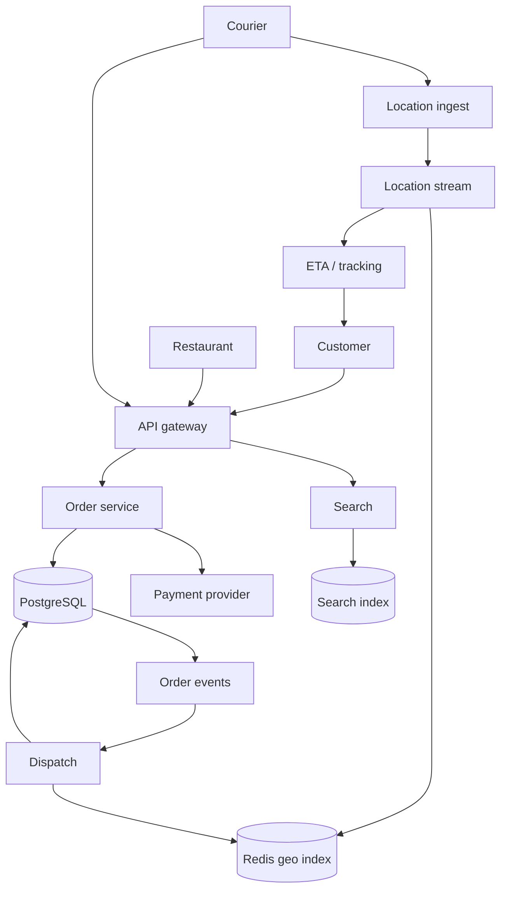
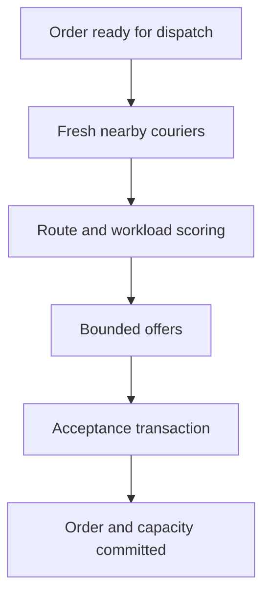

Design of a local-delivery service for restaurant discovery, checkout, courier assignment and live order tracking.

<!--more-->

## Problem

A customer selects a restaurant, places an order and follows its progress until delivery. The restaurant confirms the order and prepares it; a courier collects it and takes it to the customer.

These steps involve independent services and people. Durable order transitions coordinate payment and courier assignment, while location updates and ETA estimates keep the customer informed.

## Requirements

### Functional requirements

- **Browse:** find restaurants serving an address and read current menus.
- **Order:** submit a cart, authorize payment and receive restaurant confirmation.
- **Dispatch:** offer accepted orders to eligible couriers and record an assignment.
- **Track:** show order status, recent courier location and updated ETA.
- **History:** list past orders and rebuild a cart from a previous purchase.

Restaurant onboarding, courier payouts and promotional pricing are outside this design.

### Non-functional requirements

Design targets:

- **Latency:** browse p95 below 200 ms; assignment candidate generation p95 below three seconds.
- **Integrity:** retry-safe order and payment operations; atomic courier-capacity checks.
- **Freshness:** location updates reach an authorized tracking session within three seconds of ingestion at p95.
- **Availability:** 99.95% for order and browse APIs.
- **Privacy:** expose courier location only for an authorized active delivery and retain raw traces briefly.
- **ETA quality:** measure error and interval coverage by market, order stage and weather conditions.

## Back-of-the-envelope calculations

Assume 2M orders/day, 2M daily customers and 100K couriers online at peak.

- **Browse:** five requests/customer/day ≈ 116 requests/s average, or 350/s at 3× peak.
- **Orders:** 2M/day ≈ 23/s average, or 70/s at 3× peak; each order creates several transitions and events.
- **GPS:** 100K couriers ÷ four-second interval = 25K updates/s at the stated peak.
- **Location log:** 25K/s × 200 bytes ≈ 5 MB/s while that courier population is active.
- **Tracking:** one watching customer per active courier gives up to 25K updates/s before additional subscribers.

Courier response time is separate from candidate-generation latency.

## Core entities

```protobuf
message Restaurant {
  string restaurant_id;
  string name;
  double latitude;
  double longitude;
  string service_area;
  string status;
}

message MenuItem {
  string item_id;
  string restaurant_id;
  int64 price_minor_units;
  string currency;
  bool available;
  int64 version;
}

message Order {
  string order_id;
  string customer_id;
  string restaurant_id;
  string courier_id;
  string status;
  repeated OrderLine items;
  int64 total_minor_units;
  string currency;
  string payment_operation_id;
  int64 version;
}

message OrderLine {
  string item_id;
  int32 quantity;
  int64 unit_price_minor_units; // Checkout price snapshot.
}

message CourierLocation {
  string courier_id;
  double latitude;
  double longitude;
  int64 sequence;
  Timestamp observed_at;
  Timestamp received_at;
}

message DeliveryOffer {
  string offer_id;
  string order_id;
  string courier_id;
  Timestamp expires_at;
  string status;
}
```

Payment authorization, capture, void and refund have separate operation IDs and states.

## API

```yaml
browse:
  method: GET
  path: /restaurants
  query: {address: string, q: string, cursor: string}
menu:
  method: GET
  path: /restaurants/{restaurant_id}/menu
order:
  method: POST
  path: /orders
  headers: {Idempotency-Key: string}
  body: {restaurant_id: string, items: array, address: object, payment_method_id: string}
  response: {order_id: string, status: payment_pending}
accept_offer:
  method: POST
  path: /offers/{offer_id}/accept
tracking:
  method: GET
  path: /orders/{order_id}/track
  transport: server_sent_events
cancel:
  method: POST
  path: /orders/{order_id}/cancel
history:
  method: GET
  path: /orders
  query: {cursor: string}
```

The authenticated user scopes history and tracking. Cancellation eligibility follows the order's current state.

## High-level design

Search serves geographic discovery; the order service owns the lifecycle and coordinates payment. Dispatch selects couriers using recent locations. A separate streaming path updates customer tracking sessions and ETA estimates.


```mermaid
flowchart TB
  C["Customer"] --> API["API gateway"]
  R["Restaurant"] --> API
  D["Courier"] --> API
  API --> S["Search"]
  API --> O["Order service"]
  O --> DB[("PostgreSQL")]
  O --> P["Payment provider"]
  DB --> E["Order events"]
  E --> MATCH["Dispatch"]
  MATCH --> DB
  D --> L["Location ingest"]
  L --> GPS["Location stream"]
  GPS --> GEO[("Redis geo index")]
  MATCH --> GEO
  GPS --> ETA["ETA / tracking"]
  ETA --> C
  S --> IDX[("Search index")]
```

## Storage

- **PostgreSQL by market:** orders, menu snapshots, offers, courier assignment capacity and payment operations. Unique customer-scoped idempotency keys and version-checked transitions protect retries.
- **PostGIS / search index:** restaurant locations and service areas; OpenSearch adds text/category discovery. Checkout rechecks canonical menu and restaurant state.
- **Redis:** region-scoped geographic indexes and per-courier position records. A separate timestamp index and cleanup worker remove stale geo members.
- **Kafka:** fixed sets of order and GPS topics, keyed by order or courier ID. An outbox publishes committed order changes.
- **Object storage:** restricted longer-term operational data under retention limits; analytical datasets use sanitized locations.

Redis GEO members have no individual TTL. Store freshness per courier and remove expired members explicitly.

## From request to response

### Checkout and restaurant confirmation

The API validates the cart, price and service area, then stores the order, idempotency record and payment intent in a transaction. The payment worker authorizes the exact operation with a stable provider key. A successful authorization moves the order to restaurant confirmation.

The restaurant accepts or rejects against the expected order version. Rejection triggers an authorization void; acceptance makes the order eligible for dispatch. Capture occurs at the defined fulfilment milestone, with reconciliation for ambiguous provider responses.

### Assigning a courier

Dispatch retrieves nearby, available couriers with recent positions and estimates road travel time. It creates time-limited offers and sends notifications.

An acceptance transaction checks the offer, order state and courier capacity together. It assigns the order once and publishes the result through the outbox. Expired or losing offers return their current outcome.

### Tracking and reordering

Authenticated GPS messages carry a monotonic courier sequence. Consumers keep the newest valid position, update dispatch indexes and publish sanitized tracking events. The tracking gateway sends a snapshot on reconnect before later updates.

A reorder rebuilds a cart using current item prices and availability, then uses the ordinary checkout flow.

Full courier scans and repeated customer polling add unnecessary work. Geographic retrieval and active-order subscriptions reduce that load; durable assignment still belongs in the order database.

## Deep dives

### Choosing and reserving couriers

**Problem.** The closest courier may have a slow road route, and multiple orders can compete for the same courier.

**Options.** Nearest-distance assignment, scored candidates with limited concurrent offers, or a market-wide optimizer.

**Recommendation.** Retrieve a bounded geographic candidate set, score travel time and workload, and send a small number of offers. Commit assignment through a transaction covering both order ownership and courier capacity. Redis availability narrows candidates; it is advisory.

Dense markets can add batched optimization, as described in [DoorDash's dispatch architecture](https://careersatdoordash.com/blog/using-ml-and-optimization-to-solve-doordashs-dispatch-problem/). Use a time-bounded solver and a feasible fallback. Measure assignment time, acceptance rate, lateness and courier utilization; a 30-second offer window makes a universal three-second completed assignment unrealistic.

**Candidate scoring and assignment.** Geographic lookup returns a bounded group of fresh couriers. Batch route-time estimates and combine them with remaining workload, vehicle constraints and expected food readiness. The resulting score estimates whether a courier can complete this pickup well, rather than simply ranking straight-line distance.

Create an offer with order ID, courier ID, expiry and assignment generation. On acceptance, lock or conditionally update both order ownership and courier capacity in the market transaction. Only a current offer can commit. Concurrent accepted offers therefore converge on one assignment; others are rejected using the committed state.


```mermaid
flowchart TB
  O["Order ready for dispatch"] --> G["Fresh nearby couriers"]
  G --> S["Route and workload scoring"]
  S --> F["Bounded offers"]
  F --> A["Acceptance transaction"]
  A --> C["Order and capacity committed"]
```

If an offer times out, advance the assignment generation before issuing replacements. A delayed acceptance for the old generation cannot take the order back. The optimization budget ends with a feasible fallback so a stalled solver does not halt dispatch.

### Current locations under streaming load

**Problem.** Old or reordered GPS events can move a courier backwards or leave a disconnected courier eligible.

**Options.** Direct database writes, Redis-only positions or a replayable stream feeding a geographic cache.

**Recommendation.** Consume a courier-keyed stream and conditionally apply events newer than the stored sequence. Record server receipt time and bound acceptable device clock skew. Separate consumers update caches and tracking; replayed events are safe.

Reject stale couriers during candidate validation and at acceptance. During backlog, prioritize current snapshots and avoid dispatch from unverified old positions. Track ingestion-to-visibility delay and position age, rather than consumer offsets alone.

**Sequence-aware position projection.** For each courier, store session epoch, event sequence, coordinates and server receipt time. Accept a position only if its epoch/sequence is newer. A delayed sequence 101 cannot overwrite sequence 104 even if it reaches the consumer later.

Update the position record and geographic membership through a coordinated cache operation. If the courier crosses a region boundary, remove the old membership or retain a versioned temporary overlap that readers deduplicate. Redis GEO has no per-member TTL, so a freshness index and cleanup worker explicitly remove stale entries.

Before scoring and again before accepting an offer, compare position age and current courier status. A courier replayed from yesterday's stream is historical evidence, not a dispatch candidate. Under backlog, publish current snapshots through a bounded fast path and keep older updates for analytics. Tracking responses include their last verified timestamp so the map can display uncertainty rather than inventing movement.

### Predicting ETA across overlapping stages

**Problem.** Food preparation and courier travel to the restaurant happen concurrently.

**Options.** A single total-duration model, separate stage models or a multi-task probabilistic model.

**Recommendation.** Use stage estimates with an explicit timeline:

```text
remaining time =
  max(remaining preparation, courier travel to restaurant)
  + pickup / handoff
  + restaurant-to-customer travel
  + final delivery handling
```

Once pickup is complete, estimate only the remaining stages. A routing engine supplies road-time baselines; observed errors and contextual features adjust them. Missing ready timestamps are imperfect labels requiring careful evaluation.

Use a consistent displayed quantile and calibrated interval across browse, checkout and tracking. [DoorDash's ETA work](https://careersatdoordash.com/blog/improving-etas-with-multi-task-models-deep-learning-and-probabilistic-forecasts/) provides background for shared models across contexts.

**Worked remaining-time estimate.** At dispatch, preparation has eight minutes left and the courier needs five minutes to reach the restaurant. With two minutes for handoff, 12 minutes to the customer and one minute for final handling, the estimate is `max(8,5) + 2 + 12 + 1 = 23 minutes`. Adding preparation and courier approach would double-count their overlapping work.

After pickup, those first two stages are complete; recompute from the current route and final handling only. An order-state version travels with the prediction so a delayed pre-pickup estimate cannot replace a post-pickup estimate.

Use observed stage durations as labels with explicit missing-data handling. Calibrate intervals by market, time, route length and order state; a 90% interval should contain roughly 90% of held-out realized outcomes for the assessed cohort. Display updates with controlled hysteresis to avoid noisy minute-by-minute jumps while still reflecting a real restaurant delay.

### Coordinating order and payment failures

**Problem.** Database commits and external payment calls can succeed independently.

**Options.** Synchronous calls with compensation, event choreography or a durable workflow orchestrator.

**Recommendation.** Use persisted order transitions, an outbox and a durable workflow with explicit authorization, capture, void and refund operations. A database transaction finishes before the external call.

Retries use the same [provider idempotency key](https://docs.stripe.com/api/idempotent_requests); reconciliation uses the recorded operation/provider ID. Amount and time alone cannot identify a payment reliably. An unknown provider outcome remains pending until resolved, while overdue workflows alert operators. Preserve the order and transition history through compensation.

**Durable workflow recovery.** Save a payment operation and its provider key before making the external call. The order transaction commits its state and outbox intent, then the workflow dispatches authorization or capture. If the provider accepts but the response is lost, retain an unknown operation linked to the same order.

Recovery queries provider status or applies a verified provider event. Confirmed success advances the order once; definitive failure performs the policy's void/refund compensation. An unknown result stays pending while operators can see its age and evidence.

Courier assignment and restaurant acceptance have their own versioned transitions. A cancellation races against those transitions through the order authority, producing one committed outcome. Compensation does not roll history back: it appends what was voided, refunded or released, with stable operation identities. This makes a later reconciliation explainable even when several services failed at different points.
