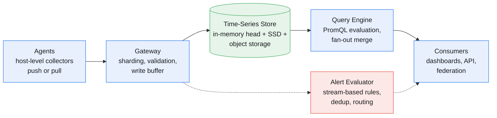
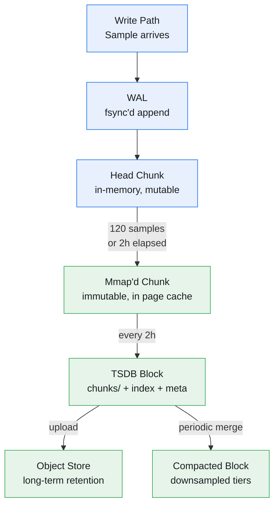
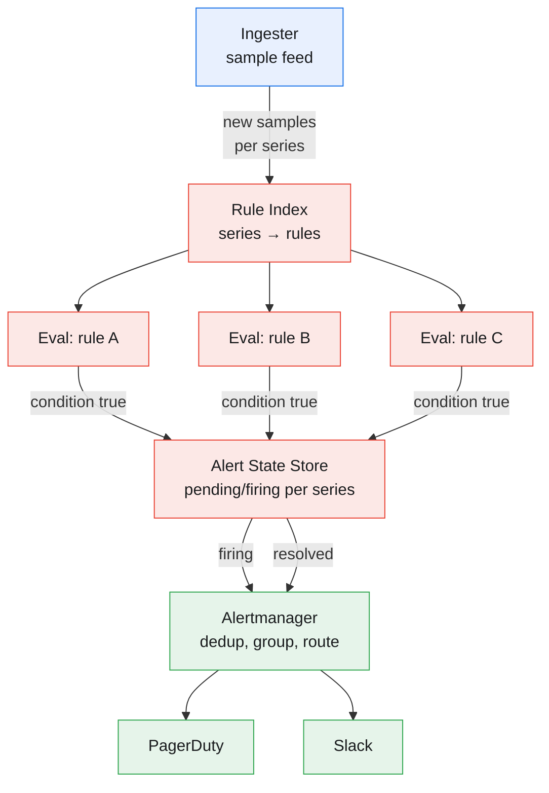

A metrics monitoring platform ingests time-series data from hundreds of thousands of services, stores it durably, and answers sub-second dashboard queries while evaluating alert rules against a streaming firehose.

<!--more-->
## 1. Problem

A metrics monitoring platform ingests time-series data from hundreds of thousands of services, stores it durably, and answers sub-second dashboard queries while evaluating alert rules against a streaming firehose. Three forces pull the architecture apart: (1) the write path absorbs millions of data points per second — a B-tree store collapses under this append load, so the storage engine must be purpose-built for sequential writes; (2) a dashboard query like "p99 latency over the last 7 days" spans billions of points and demands an answer in under a second, which forces pre-computed rollups and index pruning to avoid full scans; (3) alert evaluation must not lag — if a service's error rate spikes, the operator needs a notification in under a minute, not after the next polling cycle, so the alert path taps the stream, not the stored lake.



## 2. Requirements

**Functional**

FR1: Ingest 5M+ data points per second from 100K+ monitored hosts

FR2: Query metrics by name, labels, and time range with sub-second latency

FR3: Define alert rules with threshold-and-duration conditions, evaluated continuously

FR4: Display dashboards refreshing in under 10 seconds with rollups over arbitrary windows

FR5: Deliver alert notifications to email, Slack, and PagerDuty with deduplication

**Non-functional**

NFR1: 99.9% write availability; accepted data points must survive single-node failure

NFR2: Query freshness under 60 seconds from ingestion for real-time dashboards

NFR3: Support 10M+ active time-series across 100K+ hosts

NFR4: Compressed storage target under 2 bytes per data point

## 3. Back of the envelope

- **Ingest throughput:** 100K hosts × 100 metrics / 10s = 1M points/sec baseline; at 5× peak-to-average (deploy waves, health-check storms) → **5M points/sec peak** → the gateway must fan out writes before any single node saturates its disk.
- **Storage footprint:** 5M points/sec × 86,400 sec/day = 432B points/day; at Gorilla-class compression (~1.4 bytes/point) → **~560 GB/day**; 30-day retention = **~16 TB compressed** → replication factor (3×) is the dominant multiplier on total cluster storage.
- **Query scan volume:** 10K matching series × 7-day dashboard at 15s scrape interval = 10K × (7 × 24 × 3600 / 15) = **~400M data points** → scanning raw points exceeds a single SSD's read bandwidth at sub-second latency.

## 4. Entities

```sql
Metric {
  name:        string            -- e.g. "http_requests_total"
  labels:      map<string,string>  -- e.g. {method="GET", status="200", handler="/api"}
  type:        enum              -- counter | gauge | histogram | summary
  created_at:  timestamp
}
-- A (name, labels) tuple defines a unique time-series identity.
-- The label set is the primary index dimension for query filtering.

Sample {
  series_ref:  uint32            -- references the Metric's series ID in the TSDB block index
  timestamp:   int64             -- epoch milliseconds
  value:       float64           -- the measured value at this instant
}
-- Samples are stored columnar within chunks: a chunk holds 120 consecutive
-- samples with delta-of-delta timestamps and XOR-compressed float values.

Chunk {
  series_ref:  uint32
  min_time:    int64             -- earliest timestamp in the chunk (for block pruning)
  max_time:    int64             -- latest timestamp in the chunk
  data:        blob              -- Gorilla-compressed: delta-of-delta timestamps + XOR values
  sample_count: uint16           -- typically 120, or fewer for the final chunk in a block
}

Block {
  block_id:    ulid              -- sortable unique ID; encodes creation time
  min_time:    int64             -- block time range start (typically a 2-hour window)
  max_time:    int64
  chunks:      []Chunk           -- all chunks within this time window
  index:       blob              -- compact inverted index: label pair → sorted list of series IDs
  tombstones:  []series_ref      -- deletion markers for soft-deletes
  meta:        json              -- compaction level, source blocks, statistics
}

AlertRule {
  name:        string
  query:       string            -- PromQL expression, e.g. "rate(errors[5m]) / rate(total[5m]) > 0.01"
  duration:    duration          -- how long the condition must hold before firing (e.g. "5m")
  labels:      map<string,string>  -- additional labels attached to the fired alert
  annotations: map<string,string>  -- human-readable summary/description templates
  severity:    enum              -- critical | warning | info
  state:       enum              -- inactive | pending | firing  ← derived during evaluation
}
-- State is transient and lives only in the alert evaluator's memory.
-- Pending means the condition is true but the duration hasn't elapsed yet.
-- Firing means both are satisfied and a notification has been dispatched.

```

### API

- `POST /api/v1/write` — ingest a batch of time-series samples (snappy-compressed protobuf, Prometheus Remote Write protocol)
- `GET /api/v1/query` — instant query: evaluate a PromQL expression at a single timestamp
- `GET /api/v1/query_range` — range query: evaluate a PromQL expression over a time window, returning a matrix of samples per series
- `GET /api/v1/series` — series discovery: return all time-series matching a set of label matchers
- `GET /api/v1/labels` — return all label names present in the database
- `POST /api/v1/rules` — create or update an alert/recording rule

## 5. High-Level Design

The ingest path and query path are decoupled at the gateway layer. All writes enter through a stateless gateway cluster that hash-routes each sample to the ingester that owns its series, using consistent hashing on the (metric name + sorted labels) tuple. The ingester writes the sample to a write-ahead log for durability, appends it to the in-memory head chunk, and acknowledges the gateway immediately — total ingest latency under 2ms within a region. Every 2 hours, the ingester flushes completed head chunks into an immutable TSDB block, uploads it to object storage, and builds a compact inverted index for label-based pruning. Queries fan out from stateless queriers to every ingester (for recent data still in memory) and every store-gateway (for historical blocks in object storage), merge results, and apply PromQL operators.

#### FR1: Metric ingestion

Components: Agent (per-host collector), Gateway (stateless ingestion frontend), Ingester (stateful write node with WAL and in-memory head).

Flow:

1. The agent collects metrics from the host every 10–15 seconds: system counters via `/proc` or `/sys`, application metrics via an in-process library or sidecar scraping an HTTP endpoint.
1. The agent batches collected samples, compresses the batch with snappy, and pushes via HTTP to any gateway node — the gateway is stateless and all nodes are equivalent.
1. The gateway validates the batch (schema check, timestamp freshness), hashes the series identity onto the consistent hash ring, and forwards the batch to the owning ingester.
1. The ingester appends the batch to its WAL (fsync'd before ack), then inserts each sample into the in-memory head chunk for its series. It acknowledges the gateway.
1. The gateway acknowledges the agent. Total round-trip: under 5ms within the same region.

Design consideration: Push vs pull. A pull model (Prometheus scraping targets) simplifies HA — two servers scrape the same target independently. But it requires every target to be reachable from the monitoring infrastructure, fails in NAT'd environments, and cannot handle ephemeral jobs. We choose push (Prometheus Remote Write) as the primary path because the agent controls batching and backpressure at the edge. We support a pull shim as a separate scraper service that converts scrape results into the same write protocol, so existing Prometheus-ecosystem exporters work unchanged.

#### FR2: Metric query

Components: Query-Frontend (splits and caches), Querier (stateless PromQL engine), Store-Gateway (reads blocks from object storage), Ingester (serves recent data from memory).

Flow:

1. A dashboard or API client sends a PromQL range query to the query-frontend.
1. The query-frontend parses the PromQL expression, splits the time range into sub-ranges (e.g., a 7-day range becomes seven 1-day sub-queries), and dispatches each to a querier via a work queue.
1. The querier identifies the target time range: for data less than 3 hours old, it fans out to all ingesters via gRPC; for older data, it fans out to store-gateways. Both calls return matching samples.
1. The querier merges results from all shards, applies the PromQL function (rate, histogram_quantile, sum by, etc.), and returns the result matrix.
1. The query-frontend caches the result in Memcached keyed by (query string, time range, step), with a TTL of 60 seconds, and returns it to the client.

Design consideration: Split-and-merge beats single-node evaluation for large ranges. A 7-day query scanning 400M points on one node hits disk bandwidth limits (~2s just for I/O). Splitting into N sub-queries dispatched to N queriers gives near-linear speedup — N=8 queriers drops the scan time to ~250ms. The trade-off is that PromQL functions like `rate()` require continuity across the split boundary; the query-frontend inserts a small overlap (one scrape interval) in each sub-range and the querier trims it after evaluation.

#### FR3: Alert evaluation

Components: Alert Evaluator (stream-based rule engine), Alert State Store (in-memory with WAL), Alertmanager (dedup, grouping, inhibition, routing).

Flow:

1. Alert rules stored in a rule database are loaded by the evaluator on startup. Each rule has a PromQL query, a `for` duration (e.g., "5m"), labels, and annotations.
1. The evaluator subscribes to the stream of new samples at the ingester layer — it does not poll the storage engine. Every new sample for a series referenced by any alert rule triggers a re-evaluation of that rule.
1. When a rule's PromQL expression evaluates to a non-empty result, the evaluator records the firing series in the alert state store with a timestamp and transitions them to "pending." If the condition holds continuously for the `for` duration, the alert transitions to "firing."
1. On transition to firing, the evaluator constructs an alert (with templated labels and annotations) and dispatches it to Alertmanager.
1. Alertmanager groups alerts by configurable label sets (e.g., all alerts for `job="frontend"` in one notification), deduplicates across HA evaluator replicas via a gossip-based memberlist, applies inhibition rules (a `datacenter_down` alert suppresses individual `host_down` alerts within that datacenter), and routes the grouped notification to PagerDuty, Slack, or email.

Design consideration: Stream evaluation vs periodic polling. Polling every 30 seconds against the storage engine means alert latency is at best 30 seconds plus the `for` duration. For a 5-minute threshold, that is 5.5 minutes worst-case. A stream-based evaluator tapping the ingester's sample feed sees the violating data point within milliseconds and starts the `for` timer immediately — alert latency approaches the `for` duration itself. The cost is complexity: the evaluator must be stateful to track which series are in `pending` across restarts, which is why we use a WAL-backed state store (the same mechanism the ingesters use for sample durability).

#### FR4: Dashboards

Components: Grafana or equivalent dashboard UI (out of scope for the backend), Query-Frontend (result cache), Downsampler (pre-computed rollups).

Flow:

1. A dashboard panel issues a range query (e.g., "avg by (status) of rate(http_requests_total[5m])" over the last 6 hours).
1. The query-frontend checks its result cache. A dashboard refresh every 10 seconds with a 5-minute lookback means 30-second-old cached results are usually acceptable.
1. On cache miss: the query engine checks the maximum step. If the dashboard resolution (pixels on screen) is coarser than the raw scrape interval, the query engine reads from the pre-computed rollup tier instead of raw chunks.
1. The downsampler is a background component that reads raw 2-hour blocks and writes rollup blocks at 1-minute and 1-hour resolution, storing min/max/sum/count per series per window. A query for a 30-day time range at hourly granularity reads the 1-hour rollup tier — orders of magnitude fewer points than raw scans.
1. The rendered time-series data is returned to the dashboard.

Design consideration: Cache invalidation is the hard part. We use time-bounded caching: results keyed by (query, step) with a TTL equal to the freshness SLA. The TTL decays as the time range approaches now() — results touching the last 5 minutes get a 10-second TTL; results fully in the past get a 60-second TTL. This avoids serving stale data for real-time panels while still absorbing the load of refreshes. A write-through invalidation (purging cached results when new samples arrive) is too expensive to maintain — a single `http_requests_total` counter update would invalidate thousands of cached dashboard queries.

#### FR5: Alert notifications

Components: Alertmanager (receives firing alerts from evaluators), Notification Pipeline (inhibition → silencing → routing → throttling).

Flow:

1. Alertmanager receives a firing alert from any evaluator replica.
1. Inhibition: if a higher-severity alert is already firing for a superset of the labels (e.g., `{datacenter="dc1"}` inhibits `{datacenter="dc1", host="h42"}`), the new alert is suppressed and never reaches the operator.
1. Silencing: the operator can mute specific alerts by label matchers for a time window (e.g., silence all `severity="warning"` alerts during a planned maintenance).
1. Routing: the alert's labels are matched against a routing tree. `severity="critical"` → PagerDuty immediately. `severity="warning"` → Slack channel after a 5-minute grouping window.
1. Grouping: multiple firing alerts sharing the same `group_by` labels (e.g., `{alertname, job}`) are batched into a single notification to avoid pager storms.
1. Deduplication: HA Alertmanager replicas share state via gossip; the same alert received by two replicas fires only one notification.

Design consideration: Notification throttling. A system generating 500 alerts per day trains operators to ignore them. We apply rate limits: each routing destination (e.g., a specific PagerDuty service) receives at most one notification per 5 minutes regardless of how many distinct alerts fire. Alerts exceeding the throttle are queued and delivered in the next window. At the other end — critical incidents — we bypass throttles entirely for the first firing of any `severity="critical"` alert since the last resolution.

## 6. Deep dives

### DD1: Time-series storage engine

Problem. A time-series workload is 95%+ writes (appending new samples) and 5% reads (dashboard queries and alert evaluations). A B-tree store like PostgreSQL rewrites pages on every insert, doubling the I/O per write. At 5M samples/sec with ~80 bytes per B-tree row (index overhead), that is 400 MB/s of sustained random I/O — well past what a single SSD can absorb. We need a storage model where writes are purely sequential and reads exploit time-range locality.

**Approach 1: General-purpose SQL (PostgreSQL) with time-based partitioning.**

Table per day, BRIN index on timestamp. Append-only ingestion with batch inserts.

Pro: Familiar operational model — backups, replication, tooling all standard. Simple to query with SQL.

Con: At 5M writes/sec, even batched INSERTs create index maintenance overhead (B-tree leaf splits on the label index). Each sample row is ~80 bytes on disk (32B data + 48B index), or 400 MB/s. A 30-day retention at this rate is 1 PB raw — 40× more than a compressed TSDB. Querying 7 days of data for a p99 calculation means scanning billions of rows through the buffer pool; even with BRIN pruning, the label filter requires a secondary index lookup per matching row.

Decision: Not viable past ~100K writes/sec. PostgreSQL on very fast hardware can sustain ~50K sequential writes/sec; our target is 100× that.

**Approach 2: LSM-tree with time-partitioned blocks (LevelDB/RocksDB pattern).**

Writes land in an in-memory memtable (skip list), are flushed to sorted SSTable files on disk, and periodically compacted to merge overlapping files and discard overwritten keys.

Pro: Excellent write throughput — sequential disk I/O, no page rewrites. Compaction runs in background, doesn't block writes. Used in production at scale by InfluxDB (though InfluxDB has since moved to a custom engine).

Con: Compaction write amplification. Each byte written to the memtable is rewritten multiple times during level compaction — typically 10–30× amplification depending on the level fanout. At 560 GB/day of compressed data, 10× amplification means 5.6 TB/day of actual disk writes. Read path for range scans (the dominant query pattern) must merge data from multiple SSTable levels, which adds latency. Time-range queries do not map naturally to the LSM key order unless the key encodes time as a prefix, which then breaks the label-based index.

Decision: LSM-trees are a reasonable fit for key-value time-series workloads (where the key is `series_id:timestamp`) but the compaction tax is too high at our scale. They also couple the read and write paths — a heavy compaction can stall reads.

**Approach 3: Immutable time-partitioned blocks with a separate inverted index (Prometheus TSDB pattern).**

Writes accumulate in an in-memory head chunk (append-only, up to 120 samples per chunk per series). Completed chunks are memory-mapped for reads but never modified. Every 2 hours, all head chunks for that window are flushed to disk as an immutable block — a directory containing a chunk file, an inverted index, and metadata. No compaction of data blocks — only index compaction when blocks are merged for retention. Deletes are tombstones, not in-place modifications.

Pro: Writes are purely sequential — append to head chunk, then write a new block file. The inverted index (label pair → sorted series ID list) is also built once per block and never rewritten. Reads use the index to find matching series, then mmap the chunk files — the OS page cache naturally caches hot chunks. Compaction is optional and only needed for index merging, not data rewrites — no write amplification on the data path. This is the design behind Prometheus TSDB, used in production at SoundCloud (800K samples/sec on a single node) and in Thanos/Cortex at much higher scale.

Con: The 2-hour block boundary means a sample arriving at t=1:59:59 is flushed almost immediately; a sample at t=0:00:01 stays in memory for 2 hours. This asymmetry in memory residency can cause uneven memory pressure if series are unevenly distributed in time. The inverted index must fit in memory for fast query performance — at high cardinality (millions of unique label values), the postings lists become large. This is the "cardinality explosion" problem: label a metric with `user_id` and every user becomes a separate series with its own chunk and index entries, ballooning index size and query latency.

Decision: Immutable time-block storage with inverted index. This is the right trade-off for a metrics workload. The 2-hour block granularity aligns with the natural query pattern — dashboards rarely need sub-hour granularity for data older than a day, so the block boundary never crosses a query's time range in practice. The cardinality problem is addressed at the data model layer (see DD2): high-cardinality dimensions belong in log fields, not metric labels.




> [!TIP]
> **Gorilla compression in practice.** The delta-of-delta encoding for timestamps works because scrape intervals are regular. The first timestamp is stored in full (8 bytes). The second is a delta from the first (typically 2 bytes for a 15s interval). All subsequent timestamps store the delta-of-delta — the change in the interval. For a perfectly regular 15s scrape, delta-of-delta is always 0, encoded in 1 bit. Value compression uses XOR of consecutive IEEE 754 doubles: if two consecutive values are 45.2 and 45.3, their XOR has many leading zeros — store the zero-run length and the trailing meaningful bits. Facebook's Gorilla paper measured 1.37 bytes per (timestamp, value) pair on production ODS data. Prometheus's implementation achieves ~1.0–1.3 bytes/sample for typical monitoring data where values change slowly.


> [!WARNING]
> **The "don't reach for a TSDB first" heuristic.** If your write rate is under 10K points/sec and you already operate PostgreSQL, put metrics there with time-based partitioning and BRIN indexes. The operational simplicity of a familiar database outweighs the storage efficiency gain from a specialized TSDB until the write volume demands it. We design the TSDB path for the 5M/sec case, but the system should support a PostgreSQL backend for small deployments.

### DD2: High-cardinality control

Problem. A time-series identity is the tuple (metric name, label set). Each unique label combination creates a new series — its own chunk buffer, WAL entries, inverted index postings, and downsampled rollup series. If `http_requests_total` has labels `{method, status, handler}`, cardinality is the product of unique values: 5 methods × 10 status codes × 200 handlers = 10,000 series. Manageable. But add `user_id` as a label and cardinality explodes to 10,000 × 10M = 100 billion series — each writing a sample every 15 seconds means 6.7 billion samples/sec, crushing any storage engine.

**Approach 1: Hard limit per metric.**

Reject writes for any metric whose label cardinality exceeds a configurable threshold (e.g., 100,000 unique series).

Pro: Simple to implement — count unique (name, labels) tuples in the head block index, drop samples on overflow. No runtime overhead.

Con: Binary — either the metric works or it doesn't. No graceful degradation. A legitimate metric with 101,000 valid label combinations (e.g., an HTTP handler split by customer, with 500 customers × 200 handlers = 100K) would be rejected. Operators hate false positives in cardinality limits — a blocked metric during an incident is worse than a slow dashboard.

**Approach 2: Field-based high-cardinality dimensions.**

Move high-cardinality values out of labels and into a separate field store. Labels index the low-cardinality dimensions (method, status). The high-cardinality dimension (user_id) is stored as a field on the sample, queryable via a separate inverted index that supports exact-match and prefix filters but not full series enumeration.

Pro: Decouples cardinality from series count. A metric with 10,000 label combinations and 10M user_ids still has only 10,000 time-series in the TSDB — the user_id is a filter applied at query time against the field index, not a dimension that multiplies the series space.

Con: Requires a second index structure for high-cardinality fields. Queries like "p99 latency by user_id" need to aggregate across the field index, which is slower than label-based aggregation. The API surface becomes more complex — users must understand the label vs field distinction.

**Approach 3: Cardinality budget with soft enforcement.**

Each tenant gets a cardinality budget (e.g., 10M total series). The system tracks cardinality per metric and across the tenant. When a metric exceeds 80% of its per-metric cap, it emits a warning. At 100%, the system drops the highest-cardinality label values (least recently seen) and continues accepting writes for the remaining series. This is survivable degradation: the most important data (aggregated or low-cardinality) is preserved; the long tail is sacrificed.

Pro: Graceful degradation. No hard failure during incidents. Operators see warnings and can adjust budgets before data loss occurs. Aligned with how Datadog handles per-tenant cardinality in production.

Con: Drops are non-deterministic from the user's perspective — a spike in one high-cardinality metric can evict series from an unrelated metric if they share a tenant budget. Requires careful tenant isolation.

Decision: Field-based dimensions plus cardinality budgets. Use labels for low-cardinality (≤1,000 unique values) dimensions and fields for high-cardinality dimensions. Enforce soft cardinality budgets per tenant with LRU eviction. This gives operators control (they choose which dimensions go to labels vs fields) and survivability (budgets degrade gracefully). The field index uses a lightweight inverted index stored alongside each TSDB block, with the same immutability guarantees — built once when the block is flushed, never modified.

> [!WARNING]
> **The cardinality rule of thumb:** If a dimension has more than ~1,000 unique values, it should not be a label. `user_id`, `request_id`, `session_id`, `trace_id` — all belong in logs or as fields, never as metric labels. This rule is universal across Prometheus, Datadog, and every production metrics system.

### DD3: Stream-based alert evaluation

Problem. If alert rules are evaluated by periodically polling the query engine (e.g., every 30 seconds), the latency from a violating data point to a fired notification is poll_interval + for_duration. For a 5-minute alert rule, worst-case latency is 5.5 minutes. But production incidents demand faster feedback. The alternative — evaluating every rule on every new sample — is O(rules × samples) and would overwhelm the evaluator. We need a way to evaluate rules as data arrives without re-evaluating every rule for every sample.

**Approach 1: Periodic polling against the storage engine.**

Every 30 seconds, the evaluator queries the TSDB for each alert rule's PromQL expression over the `for` duration window. If the expression returns a non-empty result, the alert fires (or transitions through pending).

Pro: Simple implementation — the evaluator is stateless. It uses the same query path as dashboards. Rule updates (new rules, modified thresholds) take effect on the next poll cycle with no coordination.

Con: Alert latency floor is the poll interval. To achieve under-60-second alerting, the poll interval must be ≤30 seconds, which means evaluating every rule every 30 seconds regardless of whether new data exists. At 10,000 alert rules — a moderate fleet — that is 333 rule evaluations per second continuously. Most of these evaluations return "no alert" because the underlying data hasn't changed. This is wasted compute.

Decision: Periodic polling works for small rule sets (<1,000 rules) but the constant evaluation overhead scales linearly with rule count, not data volume.

**Approach 2: Stream-based without indexing (naive stream evaluation).**

The evaluator subscribes to the ingester's sample feed. Every incoming sample triggers a re-evaluation of every alert rule, regardless of whether the rule references that series.

Pro: Zero alert latency — the violating sample triggers evaluation within milliseconds of ingestion. No polling delay. The evaluator sees all data as it arrives.

Con: The computational cost is O(rules × samples) — at 5M samples/sec and 10,000 rules, that is 50 billion rule evaluations per second. This is physically impossible even with aggressive parallelization. The approach only works when either the rule count or the sample rate is very low.

Decision: Not viable at any real scale. The naive stream approach is what people imagine when they hear "stream-based alerting" and it's why many systems default to polling — but as we'll see, indexing makes stream-based feasible.

**Approach 3: Stream-based with rule indexing.**

The evaluator subscribes to the ingester's sample feed. Rather than evaluating every rule on every sample, it maintains a reverse index: rule → set of series it references. When a sample arrives, the evaluator looks up which rules reference that series and re-evaluates only those rules. Rules that reference no newly arrived series are skipped.

Pro: Evaluation cost is proportional to data arrival rate, not rule count. A quiet system (few samples) evaluates few rules. A busy system (many samples) evaluates rules proportional to the affected series. This aligns computational cost with actual change. The evaluator sees the violating sample within milliseconds of ingestion, so the `for` duration is the dominant latency term — a 1-minute alert rule fires in ~1 minute, not 1.5 minutes.

Con: The evaluator is stateful — it must track which series are in `pending` state for each rule across restarts. This requires a durable state store (WAL or replicated KV). The reverse index must be kept in sync with the ingester's hash ring: when a series migrates to a different ingester (due to ring membership change), the evaluator must update its subscription.

Decision: Stream-based with rule indexing. The latency benefit is decisive — a 1-minute alert rule that takes 1.5 minutes to fire is a 50% degradation on the SLA. The stateful complexity is manageable: the alert state store is a simple append-only WAL that records state transitions (series X → pending at time T, series X → firing at time T+D). On restart, replay the WAL from the last checkpoint (taken every 30 seconds). The reverse index is rebuilt from the current rule set on evaluator startup and incrementally updated as rules change.



The fan-out from the rule index to individual evaluators is trivially parallelizable — each rule evaluation is independent and can be distributed across multiple evaluator instances sharded by rule ID. The state store is the only coordination point: it must be consistent across evaluator shards so two shards evaluating the same rule (for HA) don't produce duplicate alerts. We use a lightweight Raft-based KV store for the state store — each shard writes to the local Raft leader, and the Alertmanager deduplication layer (gossip-based) provides an additional safety net.

### DD4: Query fan-out and result merging

Problem. At 10M active time-series and 100K hosts, no single node can store all data or answer a query spanning all series. A query like `rate(http_requests_total[5m])` that matches 500K series requires the query engine to fan out to every shard that owns a subset of those series, collect partial results, and merge them into a single response — all within the sub-second latency budget.

**Approach 1: Centralized query against a single-node TSDB.**

All data lives on one node (or one primary with read replicas). The query engine scans local indexes, reads local chunks, and returns results.

Pro: No fan-out complexity. PromQL operators that require global ordering (topk, bottomk) or cross-series arithmetic work naturally because all series data is co-located. Debugging is simple — one node, one query log.

Con: Hard capacity ceiling. A single node can reasonably handle ~2M active series and ~800K samples/sec (Prometheus's documented limit). We need 5× that. Vertical scaling (more RAM, faster SSDs) helps linearly but cost grows super-linearly — a machine with 512 GB RAM and 8 NVMe SSDs costs 10× what a cluster of 128 GB nodes costs and is a single point of failure.

Decision: Centralized works for small-to-medium deployments, which is why the system's single-binary mode exists. But at 10M+ series, horizontal distribution is mandatory.

**Approach 2: Hash-based sharding with full fan-out.**

All ingesters form a hash ring. A query fans out to every ingester (for recent data) and every store-gateway (for historical data). Each node evaluates the query against its local subset of series and returns partial results. The querier merges.

Pro: Scales horizontally — add more ingesters to increase write capacity, add more store-gateways to increase read capacity. The hash ring ensures that each series is owned by exactly one ingester at any time, so there is no duplication in query results.

Con: Full fan-out means every query touches every shard. At 100 ingesters and 50 store-gateways, a single dashboard query fans out to 150 nodes. The querier waits for the slowest node — a single slow or overloaded shard makes the entire query slow. The query cost is O(shards) regardless of the actual data volume matching the query.

**Approach 3: Query sharding with index-based pruning.**

The query-frontend splits the series space into hash ranges and dispatches each range to a subset of queriers, which then fan out only to the ingesters/store-gateways that own series in that range. The series hash is computed from the (metric name + labels) tuple and is available in the inverted index without reading chunk data.

Pro: Selective fan-out. If the query's label matchers restrict the result to a subset of the data (e.g., `{job="frontend"}` which is only 5% of all series), the inverted index on each shard prunes the irrelevant series before fan-out. Even better: the query-frontend can compute the series hash range(s) that could contain matching series and dispatch only to relevant shards. This reduces the per-query fan-out from O(all shards) to O(matching shards).

Con: Requires the query-frontend to understand the hash ring topology and series distribution. This couples the query planning layer to the storage layer's partitioning scheme. When the hash ring changes (node added/removed), the query-frontend must update its routing table — a brief window of stale routing can produce incomplete results (missing series that migrated to a new node).

Decision: Query sharding with index-based pruning. We accept the coupling between query planning and the hash ring because it is the only way to achieve sub-second queries at 10M+ series. The coupling is managed: the hash ring is published to a coordination service (etcd), and the query-frontend watches for changes with a 5-second refresh. During the propagation window, a small subset of series may be queried twice (from both old and new owners) — the querier deduplicates by series ID, so the result is correct but slightly more expensive. Pre-computed rollups (see DD1, downsampling) reduce the data volume per query by another 60–100× for long-range queries, making the merge step cheap regardless of fan-out width.

## 7. References

1. **Gorilla: A Fast, Scalable, In-Memory Time Series Database.** Pelkonen et al., VLDB 2015. [https://www.vldb.org/pvldb/vol8/p1816-teller.pdf](https://www.vldb.org/pvldb/vol8/p1816-teller.pdf)
1. **DDSketch: A Fast and Fully-Mergeable Quantile Sketch with Relative-Error Guarantees.** Masson, Rim, Lee, VLDB 2019. [https://www.vldb.org/pvldb/vol12/p2195-masson.pdf](https://www.vldb.org/pvldb/vol12/p2195-masson.pdf)
1. **Prometheus TSDB Format.** Prometheus authors, 2018–present. [https://github.com/prometheus/prometheus/blob/main/tsdb/docs/format/tsdb.md](https://github.com/prometheus/prometheus/blob/main/tsdb/docs/format/tsdb.md)
1. **Prometheus TSDB: The Head Block.** Ganesh Vernekar, 2020–2021. [https://ganeshvernekar.com/blog/prometheus-tsdb-the-head-block/](https://ganeshvernekar.com/blog/prometheus-tsdb-the-head-block/)
1. **Thanos Design Document.** [https://thanos.io/tip/thanos/design.md/](https://thanos.io/tip/thanos/design.md/)
1. **Grafana Mimir Architecture.** [https://grafana.com/docs/mimir/latest/get-started/about-grafana-mimir-architecture/](https://grafana.com/docs/mimir/latest/get-started/about-grafana-mimir-architecture/)
1. **M3: Uber's Open Source, Large-Scale Metrics Platform.** Uber Engineering, 2018. [https://eng.uber.com/m3/](https://eng.uber.com/m3/)
1. **Scaling Datadog's Time-Series Database.** Datadog Engineering, 2022. [https://www.datadoghq.com/blog/engineering/timeseries-intro/](https://www.datadoghq.com/blog/engineering/timeseries-intro/)
1. **Pull Doesn't Scale — Or Does It?** Julius Volz, Prometheus Blog, 2016. [https://prometheus.io/blog/2016/07/23/pull-does-not-scale-or-does-it/](https://prometheus.io/blog/2016/07/23/pull-does-not-scale-or-does-it/)
1. **VictoriaMetrics Cluster Architecture.** [https://docs.victoriametrics.com/Cluster-VictoriaMetrics.html](https://docs.victoriametrics.com/Cluster-VictoriaMetrics.html)
